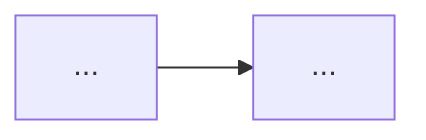

# Haandol Blog Project Guide

This file acts as a living wiki for the repository.
Use it to quickly understand the project layout, common tasks and key documentation.

## Overview

Haandol is a Korean tech blog built on Jekyll and hosted via GitHub Pages.
Topics include AI/ML, AWS, software engineering, startup/lean startup, and more.

- **Site URL**: https://haandol.github.io
- **Author**: DongGyun Lee (haandol)
- **Theme**: Hyde (based on Poole)

## Repository Structure

### Core Directories

- **`_posts/`** – Blog posts (Markdown)
  - Filename convention: `YYYY-MM-DD-slug-title.md`
  - Must include front matter (layout, title, excerpt, author, email, tags, publish)
- **`_drafts/`** – Work-in-progress drafts (pre-publish)
- **`_layouts/`** – HTML layout templates
  - `default.html` – Base layout (Google Analytics, sidebar)
  - `post.html` – Post layout (tags, date, related posts)
  - `page.html` – Generic page layout
- **`_includes/`** – Reusable HTML components
  - `head.html` – HTML head tag
  - `sidebar.html` – Sidebar navigation
  - `comments.html` – Comment system
- **`public/css/`** – Stylesheets
  - `poole.css` – Base styles
  - `hyde.css` – Hyde theme styles
  - `syntax.css` – Code highlighting
- **`assets/img/`** – Image assets
  - Directory convention: `assets/img/YYYY/MMDD/` (e.g., `assets/img/2026/0205/`)
  - Older posts may use `assets/img/YYYYMMDD/` format
- **`_site/`** – Jekyll build output (should not be tracked by git)

### Configuration Files

- **`_config.yml`** – Jekyll site configuration
- **`Gemfile`** – Ruby dependencies (github-pages, jekyll-sitemap, jekyll-feed, jekyll-paginate)
- **`about.md`** – About page

## Development Commands

### Local Server

```bash
bundle install
bundle exec jekyll serve --watch
```

### Serve with Drafts

```bash
bundle exec jekyll serve --watch --drafts
```

## Technology Stack

- **Static Site Generator**: Jekyll (GitHub Pages)
- **Theme**: Hyde (based on Poole)
- **Markdown Engine**: kramdown
- **Syntax Highlighter**: rouge
- **Plugins**: jekyll-sitemap, jekyll-feed, jekyll-paginate
- **Language**: HTML (ko-kr), Markdown, CSS/SCSS, Liquid

## Blog Post Conventions

### Front Matter Format

```yaml
---
layout: post
title: "Post title in Korean"
excerpt: English excerpt for the post
author: haandol
email: ldg55d@gmail.com
tags: tag1 tag2 tag3
publish: true
---
```

### Title

- Write a **hook-oriented** title aimed at the reader who actually wants to *do* the thing — not a textbook summary. Lead with the concrete payoff or the question the reader is asking ("그래서 실제로는 어떻게?").
- **Do NOT end titles with the declarative "~이다" copula style.** Older posts avoided it; keep titles noun- or gerund-ending (e.g. "...하기", "...과정", "...정리") or a short phrase.
- A subtitle after an em dash (`—`) is welcome to add the practical angle (e.g. "EncBird에 하네스를 한 겹씩 씌워온 과정 — 실전 하네스 엔지니어링").
- Ground the title in a concrete project/case when the post is a hands-on walkthrough (real service names like EncBird, PixelBank are fine to expose).

### Post Structure Pattern

1. **TL;DR** – Key takeaways as **short, single-clause** bullets. Prefer several short bullets over one long sentence; do not pack multiple ideas into one bullet. **Cap at 3 bullets max** — force the post down to its essential points.
2. **시작하며 (Introduction)** – Background and personal experience leading to the topic
3. **Body sections** – Numbered sections (`## 1. Title`, `## 2. Title`); a `## 0.` 출발점/기준점 section is fine when you need to set up a framing before step 1
4. **마치며 (Conclusion)** – Wrap-up with personal opinion
5. **Footnotes** – Reference links using `[^1]` format; cross-link your own related posts liberally

### Writing Style

- Written in Korean; technical terms remain in English
- Essay style with personal experience and opinions
- **Short paragraphs** — often one or two sentences per paragraph, separated by blank lines, rather than dense blocks. This is the current cadence; match it.
- Explanations use analogies and real-world examples
- **Bold** for key messages
- Code blocks and images used where appropriate
- Ground abstract steps in **real project examples** (e.g. EncBird/PixelBank actual AGENTS.md, hooks, skills) rather than staying purely conceptual

### Diagrams

- The site supports **Mermaid** (loaded in `_includes/head.html`). Prefer Mermaid over ASCII art for any diagram (flows, trees, relationships).
- Wrap every Mermaid block in `` / `` so Liquid does not choke on `{{ }}`-like syntax:

````markdown



````

- Keep genuine code/config (shell, JSON, YAML) as normal fenced code blocks — only convert ASCII *diagrams* to Mermaid.

### Image Insertion

```markdown

```

## Agent-specific Instructions

### Safe to Modify

- Post files in `_posts/`
- Draft files in `_drafts/`
- `about.md`
- `README.md`

### Approach with Caution

- `_config.yml` – Affects entire site configuration
- `_layouts/` – Affects all page rendering
- `_includes/` – Reusable components, site-wide impact
- `public/css/` – Affects entire site styling
- `Gemfile` – Build dependency changes

### Key Patterns to Follow

- Post filenames must follow `YYYY-MM-DD-slug.md` format
- All required front matter fields must be present
- Images go under `assets/img/YYYY/MMDD/`
- `excerpt` field is written in English
- Tags are space-separated (not comma-separated)
- Match tone and structure of existing posts for consistency
