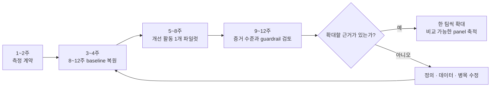

# 평가 기준 없는 팀에서 CTS-SW 시작하기

시니어 엔지니어를 위한 90일 도입 플레이북

## 핵심 원칙

- 처음 90일은 성과 평가가 아니라 측정 체계를 검증한다.
- CTS-SW는 팀 단위 흐름과 품질 지표를 함께 본다.
- baseline이 안정된 뒤에만 개선 활동의 효과를 비교한다.

## 목적

팀에 공통된 개발 평가 기준이 없는데, 시니어 한 명이 CTS-SW를 도입하려고 한다고 해보자.

가장 먼저 떠오르는 일은 Git과 CI/CD 데이터를 모아 대시보드를 만드는 것이다. 하지만 이 상태에서 바로 숫자부터 만들면 `deployment를 많이 하면 좋은 팀`이라는 잘못된 신호를 주기 쉽다.

평가 기준이 없다는 것은 단순히 metric이 없다는 뜻이 아니다.

**무엇을 고객에게 전달한 것으로 볼지, 어떤 비용을 포함할지, 품질이 나빠졌을 때 효율 향상으로 인정할지에 대한 팀의 합의가 없다는 뜻**이다.

따라서 첫 번째 산출물은 대시보드가 아니라 **측정 계약(Metric Contract)**이어야 한다고 생각한다.

이 플레이북의 목적은 별도의 평가 체계가 없는 팀에서 CTS-SW를 작은 파일럿으로 시작하고, 90일 뒤 확대 여부를 판단할 수 있게 만드는 것이다.

## 0. CTS-SW를 개인 생산성 지표로 시작하지 않는다

CTS-SW(Cost to Serve Software)는 개념적으로 다음과 같다.

```text
CTS-SW =
Software를 만들고 운영하는 비용
/ 고객에게 도달한 Software Unit
```

Amazon은 이를 고객에게 도달한 software unit당 비용으로 설명한다. 마이크로서비스 조직에서는 production deployment가 잘 맞을 수 있지만, 모놀리스나 정기 릴리스 조직에서는 실제 배포된 PR·code review·commit이 더 적절할 수 있다고 설명한다.[^1]

처음부터 정확한 인건비와 공통비를 배부하려 하면 프로젝트가 커진다. 그래서 첫 90일에는 비용 대신 engineering capacity를 proxy로 사용하는 편이 현실적이다.

```text
CTS-SW(time) =
Builder Weeks
/ Customer-Reaching Software Units
```

예를 들어 개발자 8명이 한 주 동안 고객에게 도달한 production deployment를 16회 만들었다면 다음과 같다.

```text
Builder Weeks = 8
Software Units = 16

CTS-SW(time) = 8 / 16 = 0.5 builder-week / unit
Delivery Velocity = 16 / 8 = 2 units / builder-week
```

같은 정의를 사용하는 동안 둘은 역수 관계다. Delivery velocity가 높아지면 software unit 하나에 필요한 capacity는 낮아진다.

하지만 이 숫자를 개인 평가에 연결하면 바로 망가진다.

PR을 잘게 쪼개거나 의미 없는 deployment를 늘리는 행동이 개인에게 합리적이 되기 때문이다. Amazon도 team velocity를 개인의 CR 개수가 아니라 팀 단위 결과로 다룬다고 명시한다.[^1] SPACE 역시 개발 생산성을 하나의 활동량이나 단일 지표로 환원하지 말아야 한다고 제안한다.[^2]

따라서 시작 전에 다음 원칙부터 합의한다.

1. CTS-SW는 **개인이 아니라 팀과 시스템의 흐름**을 본다.
2. 첫 90일에는 팀 간 서열이나 목표 달성률에 사용하지 않는다.
3. 서로 다른 software unit을 쓰는 팀의 절대값을 비교하지 않는다.
4. CTS-SW와 품질 guardrail을 항상 함께 본다.
5. 정의가 바뀌면 과거 숫자와 이어 붙이지 않고 version을 나눈다.

이 약속을 얻지 못한다면 데이터를 수집하기 전에 도입을 멈추는 편이 낫다.

## 1. 1~2주차 — 숫자보다 측정 계약부터 만든다

시니어가 혼자 metric을 설계해 팀에 배포해서는 안 된다.

software unit은 Product가 함께 정의해야 하고, production과 incident 데이터는 SRE·Platform의 확인이 필요하다. 사람 수와 조직 변경은 Engineering Manager가 책임져야 한다.

시니어의 첫 역할은 정답을 정하는 사람이 아니라 **이 합의를 끌어내는 metric steward**에 가깝다.

첫 회의에서는 아래 한 장을 채운다.

| 항목 | 파일럿 예시 |
| --- | --- |
| 목적 | AI 코딩 도구가 고객 전달 capacity를 개선하는지 학습한다 |
| 범위 | Payment 팀이 소유한 3개 production service |
| Software Unit | 고객 traffic을 받는 production deployment |
| 비용 proxy | 주별 active builder 수 |
| 품질 guardrail | rollback rate, change failure rate, incident hours, MTTR |
| 흐름 보조지표 | lead time, manual intervention, review wait time |
| 맥락 변수 | planned/unplanned work, AI adoption, 팀 구성 변경 |
| 사용 금지 | 개인 평가, 팀 서열, 인원 감축 근거 |
| 정의 owner | Senior + EM + Product + SRE |
| 정의 변경 | 변경 날짜와 이유를 기록하고 metric version을 올린다 |

여기서 가장 오래 논의해야 할 항목은 software unit이다.

`production deployment`가 고객 가치와 어느 정도 함께 움직이는 팀이라면 좋은 출발점이다. 반대로 매일 정해진 시간에 여러 변경을 한 번에 배포하는 모놀리스라면 deployment 수는 흐름을 제대로 표현하지 못할 수 있다.

이 경우에는 다음 조건을 만족하는 다른 단위를 택한다.

- 고객이 실제로 사용할 수 있는 상태까지 도달한다.
- Git과 CI/CD 데이터로 일관되게 재현할 수 있다.
- 팀이 숫자를 늘리기 위해 쉽게 분할하기 어렵다.
- 최소 8~12주의 과거 데이터를 같은 정의로 복원할 수 있다.

처음부터 모든 종류의 가치를 하나의 완벽한 unit으로 표현할 필요는 없다. planned feature, defect, maintenance, urgent fix를 같은 unit으로 세되, **work type은 분리해 맥락으로 남기는 편**이 낫다.

긴급 장애 수정으로 deployment가 늘어난 주를 생산성이 좋아진 주로 오해하지 않기 위해서다.

## 2. 3~4주차 — 최소 team-week baseline을 복원한다

측정 계약이 끝나면 최근 8~12주의 데이터를 `team-week` 단위로 복원한다.

처음부터 거대한 engineering data platform을 만들 필요는 없다. 파일럿 한 팀이라면 SQL view나 주간 CSV로도 충분하다.

최소 데이터는 다음과 같다.

```text
week
team_id
metric_version
active_builder_count
customer_reaching_unit_count
planned_unit_count
unplanned_unit_count
rollback_count
change_failure_count
incident_count
incident_hours
manual_intervention_count
lead_time_p50
lead_time_p90
ai_active_builder_count
```

이 데이터를 만들기 위해 필요한 원천은 네 가지다.

| 원천 | 가져올 데이터 |
| --- | --- |
| 조직 정보 | 주별 team-builder mapping, 휴직·이동 |
| Git | merge 시점, repository, team ownership |
| CI/CD | production deployment, rollback, 수동 개입 |
| Incident | 장애 시간, severity, MTTR, 원인 service |

AI 도입 효과를 보려면 다섯 번째로 주별 AI 사용 여부와 rollout 시점을 추가한다.

여기서 `AI가 생성한 코드 라인 수`는 핵심 데이터가 아니다. 궁금한 것은 AI가 코드를 얼마나 썼는지가 아니라, **팀의 delivery flow를 바꾸고 CTS-SW를 낮췄는가**이기 때문이다.

baseline 기간에는 목표값을 두지 않는다.

대신 데이터가 실제 팀의 경험을 설명하는지 확인한다.

- 배포를 많이 한 주가 실제 release 기록과 맞는가?
- incident가 많았던 주의 unplanned work가 높게 잡히는가?
- 휴가나 조직 이동이 active builder 수에 반영됐는가?
- rollback과 재배포가 software unit을 부풀리지 않는가?
- repository와 service ownership 변경이 누락되지 않았는가?

이 검증은 통계보다 중요하다. 입력 데이터가 틀렸다면 정교한 회귀모델도 틀린 결론을 더 자신 있게 보여줄 뿐이다.

baseline의 대표값도 평균 하나로 끝내지 않는다. 주별 median과 범위, work type 비중, 품질 guardrail을 함께 본다.

```text
CTS-SW(time)
Delivery velocity
Lead time p50 / p90
Rollback rate
Change failure rate
Incident hours
Unplanned work share
```

DORA도 throughput과 instability를 함께 봐야 하며, 하나를 높이는 대신 다른 하나를 희생하는 식으로 사용하지 말 것을 권한다.[^3]

## 3. 5~8주차 — 개선 활동은 한 번에 하나만 넣는다

baseline이 만들어졌다면 개선 활동 하나를 선택한다.

CTS-SW는 점수를 매기는 도구라기보다 **어디를 개선했을 때 전체 delivery 비용이 내려가는지 학습하는 도구**로 쓰는 편이 적절하다.

예를 들어 AI 코딩 도구를 도입한다면 가설을 다음처럼 쓴다.

```text
가설:
AI 코딩 도구를 실제 사용하는 builder 비율이 높아지면
review wait time과 lead time이 줄고,
품질 guardrail을 악화시키지 않으면서
customer-reaching units / builder-week가 증가한다.
```

CI 대기시간 단축이나 수동 배포 제거가 실험이라면 독립변수만 바꾼다.

```text
AI 도구 도입
+ CI 교체
+ 팀 재편
+ release policy 변경
```

이 네 가지를 같은 달에 진행하면 CTS-SW가 좋아져도 무엇이 원인인지 알기 어렵다.

물론 실제 조직에서 모든 변화를 멈출 수는 없다. 대신 팀 이동, 대형 release, incident, 정책 변경을 주별 맥락 변수로 기록한다.

매주 30분 리뷰에서는 아래 질문만 본다.

1. metric 정의나 데이터 수집이 바뀌었는가?
2. CTS-SW와 delivery velocity가 어느 방향으로 움직였는가?
3. rollback, incident, MTTR가 악화됐는가?
4. planned work와 unplanned work의 비중이 달라졌는가?
5. 이번 변화가 개선 활동 때문이라고 볼 근거가 있는가?

숫자가 나빠졌을 때 사람을 찾지 않고 시스템을 찾는 것도 중요하다.

```text
CTS-SW 악화
→ review queue 증가?
→ CI 대기 증가?
→ 수동 승인 증가?
→ incident와 interruption 증가?
→ 팀 구성 또는 service ownership 변경?
```

이 흐름은 앞선 글에서 설명한 `평가 기준 → 개인에게 합리적인 행동 → 조직 결과`의 반대 방향이기도 하다.[^4] metric이 사람을 압박하는 목표가 아니라 병목을 발견하는 피드백이 되어야 한다.

## 4. 9~12주차 — 숫자가 아니라 증거 수준으로 판단한다

12주가 지났다고 바로 AI나 개발 도구의 ROI를 확정하면 안 된다.

처음 90일의 목적은 CTS-SW를 정확한 재무 지표로 완성하는 것이 아니라, **조직이 반복해서 사용할 수 있는 측정 체계가 만들어졌는지 확인하는 것**이다.

증거는 세 단계로 올린다.

### 1단계 — 기술통계와 추세 관찰

한 팀의 전후 추세를 본다.

```text
도입 전 8~12주 baseline
vs
도입 후 4~8주
```

방향을 탐색하는 데는 유용하지만 계절성, release cycle, 팀 변경을 분리하지 못한다.

### 2단계 — 비교 가능한 파일럿

software unit과 업무 특성이 비슷한 팀을 찾거나, 여러 팀에 도구를 순차적으로 rollout한다.

같은 기간의 공통 변화와 팀별 차이를 일부 분리할 수 있다. 이때도 팀의 절대 CTS-SW를 서열화하기보다 **각 팀이 자기 baseline에서 얼마나 변했는지**를 비교한다.

### 3단계 — 인과효과 추정

정의가 안정되고 여러 팀의 panel data가 쌓인 뒤에야 fixed effect, difference-in-differences, mixed model 같은 방법을 검토한다.

Amazon도 수천 개 팀의 장기간 panel data에서 CTS-SW의 driver를 찾고, 이후 Q Developer의 주별 adoption과 velocity를 별도 모델로 분석했다.[^1]

평가 기준이 없던 한 팀이 첫 달부터 이 수준의 회귀분석을 따라 하는 것은 순서가 뒤집힌 접근이다.

먼저 `software unit`, `builder`, `production`, `rollback`, `manual intervention`의 정의가 매주 같은 의미를 가져야 한다. 그 뒤에야 모델의 계수도 해석할 수 있다.

90일차 판단은 다음 표로 끝낸다.

| 결과 | 판단 |
| --- | --- |
| CTS-SW 개선 + guardrail 안정 | 파일럿 범위를 한 팀씩 확대한다 |
| CTS-SW 개선 + 품질 악화 | 확대하지 않고 실패 구간을 개선한다 |
| CTS-SW 정체 + lead time 개선 | downstream 병목과 관찰 기간을 확인한다 |
| CTS-SW 악화 + 품질 개선 | 의도한 trade-off인지 Product와 판단한다 |
| 데이터 정의·완전성 불안정 | 도구 효과에 대한 결론을 내리지 않는다 |

## 5. 시니어가 실제로 소유해야 할 것

시니어가 CTS-SW를 도입한다고 해서 데이터팀, EM, Product의 역할까지 가져갈 필요는 없다.

대신 다음 네 가지는 직접 소유할 수 있다.

### 측정 계약의 초안

무엇을 software unit으로 볼지, 어떤 상황에서 정의를 바꿀지 초안을 만든다. 논쟁이 생기면 숫자를 밀어붙이지 않고 사례를 수집해 계약을 수정한다.

### 추적 가능한 데이터

대시보드의 숫자에서 실제 deployment, incident, 조직 변경까지 내려갈 수 있게 만든다. 숫자가 이상할 때 원천 사건을 확인할 수 없다면 신뢰를 얻기 어렵다.

### 품질과 맥락의 동시 노출

CTS-SW만 크게 보여주고 rollback과 incident를 작은 글씨로 숨기지 않는다. primary metric, mechanism metric, guardrail, context를 같은 화면에 둔다.

| 역할 | 예시 |
| --- | --- |
| Primary | CTS-SW(time proxy) |
| Mechanism | delivery velocity, lead time, review wait time |
| Guardrail | rollback, change failure, incident hours, MTTR |
| Context | AI adoption, unplanned work, team change |

이를 하나의 종합점수로 합치지 않는다. 효율이 좋아진 대신 품질이 나빠진 사실을 평균으로 지우지 않기 위해서다.

### 회고를 다음 개선으로 연결하는 운영

metric을 보고 끝내지 않고 반복 병목을 자동화와 하네스에 반영한다.

review queue가 반복되면 reviewer routing을 바꾸고, CI 실패가 반복되면 테스트와 feedback loop를 개선한다. AI가 같은 실수를 반복하면 평가 사례와 가드레일로 남긴다.[^5]

CTS-SW는 이 개선들이 최종 delivery flow에 영향을 주었는지 확인하는 상위 지표가 된다.

## 6. 도입을 망치는 대표적인 방식

### 배포 횟수 목표를 팀 OKR로 둔다

목표가 되는 순간 deployment를 잘게 쪼개는 행동이 합리적이 된다. deployment는 software unit의 후보이지 고객 가치 그 자체가 아니다.

### 개인별 PR과 AI 사용량을 공개 순위로 만든다

팀 흐름을 개인 활동량으로 바꾸면 협업과 어려운 작업이 불리해진다. AI adoption도 노출량이지 성과가 아니다.

### 처음부터 원 단위의 정확한 비용을 계산한다

인건비 배부 논쟁에 시간을 쓰다가 delivery data를 검증하지 못할 수 있다. 첫 파일럿은 builder-week로 시작하고, 정의가 안정된 뒤 loaded cost를 추가한다.

### 서로 다른 팀의 CTS-SW 절대값을 비교한다

architecture, release policy, software unit이 다르면 숫자의 의미도 다르다. 초기에는 같은 팀의 시간에 따른 변화만 본다.

### baseline 없이 회귀분석부터 시작한다

데이터 정의가 바뀌는 기간의 계수는 도구 효과가 아니라 측정 방식의 변화를 설명할 수 있다.

### 품질이 나빠졌는데 효율이 좋아졌다고 발표한다

rollback, incident, MTTR가 악화됐다면 절감한 capacity가 운영 비용으로 이동했을 수 있다.

## 7. 90일 실행 체크리스트



### 시작 전

- EM이 첫 90일간 개인 평가와 팀 서열에 쓰지 않겠다고 합의했다.
- Product와 SRE가 software unit과 guardrail 정의에 참여한다.
- 한 팀과 한 bounded scope만 파일럿으로 정했다.

### 2주차

- Metric Contract 한 장이 작성됐다.
- software unit과 cost proxy를 실제 사례로 검증했다.
- 정의 변경과 versioning 방식이 정해졌다.

### 4주차

- 최소 8주의 team-week baseline을 복원했다.
- 숫자에서 원천 deployment와 incident까지 추적할 수 있다.
- 품질과 unplanned work가 같은 화면에 보인다.

### 8주차

- 개선 활동을 한 번에 하나만 적용했다.
- rollout과 실제 adoption을 구분해 기록했다.
- 팀 구성과 release policy 변경을 함께 기록했다.

### 12주차

- 효과보다 현재 증거 수준을 먼저 표시했다.
- 확대·수정·중단 중 하나를 guardrail과 함께 결정했다.
- 반복 측정과 운영 책임의 owner가 정해졌다.

## 최종 원칙

평가 기준이 없는 팀에 CTS-SW를 도입할 때 가장 위험한 것은 metric이 없는 상태가 아니다.

**합의되지 않은 숫자가 갑자기 평가 기준이 되는 것**이 더 위험하다.

그래서 시니어가 처음 해야 할 일은 정교한 대시보드나 회귀모델을 만드는 것이 아니다. 개인 평가에 쓰지 않는다는 약속을 얻고, 고객에게 전달된 software unit과 품질 guardrail을 팀이 함께 정의하는 일이다.

그 뒤 한 팀의 과거 데이터를 복원하고, 개선 활동 하나를 넣고, 같은 정의로 전후를 비교한다. 숫자가 좋아졌다면 품질과 맥락을 확인하고, 데이터가 쌓인 뒤에야 비교와 인과분석의 수준을 높인다.

CTS-SW는 팀을 줄 세우는 답안지가 아니라, **어떤 시스템 개선이 고객에게 software를 전달하는 비용을 실제로 낮췄는지 학습하는 운영 장치**에 가깝다고 생각한다.

처음 90일에 만들어야 하는 것도 완성된 점수가 아니다.

다음 개선 실험에서도 다시 사용할 수 있는 측정 계약, 데이터, guardrail과 회고 루프다.

## 참고 자료

[^1]: Amazon Science, [Measuring the effectiveness of software development tools and practices](https://www.amazon.science/blog/measuring-the-effectiveness-of-software-development-tools-and-practices) — CTS-SW를 고객에게 도달한 software unit당 비용으로 정의하고, architecture에 따른 unit 선택, team velocity, delivery health와 Q Developer의 효과 분석을 설명한다.

[^2]: Nicole Forsgren et al., [The SPACE of Developer Productivity](https://queue.acm.org/detail.cfm?id=3454124) — 개발 생산성을 단일 활동량으로 환원하지 않고 Satisfaction, Performance, Activity, Communication, Efficiency의 여러 차원에서 함께 보아야 한다고 제안한다.

[^3]: Google Cloud DORA, [Accelerate State of DevOps Report 2024](https://dora.dev/research/2024/dora-report/) — throughput과 instability를 함께 개선해야 하며 metric을 경쟁 목표로 사용하지 말 것을 설명한다.

[^4]: Haandol, [AI 도입은 언제 비즈니스 성과로 평가해야 할까 — 3S와 AHEAD·LEVER](https://haandol.github.io/2026/06/15/organizational-ai-adoption-3s.html)

[^5]: Haandol, [EncBird에 하네스를 한 겹씩 씌워온 과정 — 실전 하네스 엔지니어링](https://haandol.github.io/2026/06/16/harness-engineering-in-practice.html)
