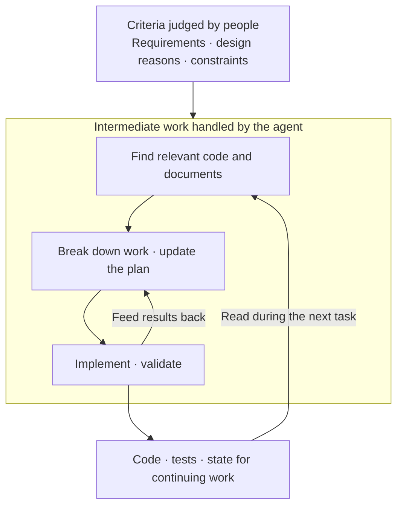

## TL;DR

- Organize context at the level needed for each decision.
- Agents are taking on more of the work between requirements and code.
- Separate lasting human decisions from task state managed by agents.

## Introduction

Developing with agents makes me reconsider how much of the process between requirements and code a person needs to manage.

I used to describe a framework that organized development context into increasingly concrete layers: [Requirement → Feature → Task → Code][^1]. Requirements became features, features became tasks, and tasks became code.

At the time, I thought it was important to break down the intermediate stages, document them, and keep them up to date. Models and tools were less capable, so people had to oversee more of that process.

Watching agents find code and plan their work has changed my view. There is less need for a person to maintain every intermediate document. **Which information should last, and which steps of turning it into concrete work should the agent handle?** That has become the more useful question.

## 1. Intermediate Work Is Moving Into the Agent

TaskMaster and GSD (Get Shit Done) organize the work between requirements and code. TaskMaster breaks a product requirements document (PRD) into tasks and manages their dependencies and progress.[^3] GSD preserves requirements, plans, and state in files so development can continue across sessions.[^4]

These tools address real needs. A large requirement is hard to implement in one step, and interrupted work needs a record of where it stopped. Better models do not make those needs disappear.

What is changing is who handles them. Claude Code has a Plan Mode for inspecting code and proposing a plan, as well as tools for creating and updating task lists.[^5] Some planning and tracking capabilities supplied by separate tools now overlap with features built into the coding agent.

I expect this absorption to accelerate. If an agent can read and modify code, then feed the results directly into its plan, a person has less work explaining those changes to another tool and reconciling its state. Better reasoning and tool use also let us entrust longer stretches of work to an agent.

This does not mean every TaskMaster or GSD feature has already been replaced. What I consider transitional is **having people manually reconcile intermediate state across several tools**. I expect the creation of plans and state to become increasingly integrated into the agent's work.

## 2. Abstract the Criteria That Need to Last

Here, context means the requirements, design decisions, code, and task state an agent reads to make decisions. Abstracting that context means **organizing it at the level needed for the decision at hand**, while retaining the details that matter.

For example, when changing order cancellation, a person decides which orders can be canceled and which refund rules apply. The agent reads those rules and the current code, then plans which files to change and which tests to add. A change in editing order should not require redefining the refund policy.

I call information that persists across tasks **static context**. Static does not mean unchangeable. It means these criteria should outlast an individual work plan.

- A **PRD** records what to build and which conditions it must satisfy.
- An **architecture decision record (ADR)** records why a design was chosen and which constraints apply.

An agent can help draft and update these documents. People need to judge whether the business goals and constraints are right and keep those criteria consistent. This gives the agent a basis for choosing concrete steps without prescribing every task in advance.

## 3. Let the Agent Manage the Details of the Current Task

Applying those criteria to the current code requires locating changes, dividing the work, and checking results. The information read and created along the way is **dynamic context**: plans, exploration results, progress, code changes, and test results.

In the order cancellation example, the agent might discover an unexpected dependency while reading the refund logic. It should update the work sequence using that code and the test results, rather than follow the original plan regardless of what it finds.





People can then focus on whether the criteria and results are right, instead of maintaining every intermediate document. When requirements do not settle a policy question, the agent needs a person's judgment. That decision should remain available to future tasks.

Dynamic context is not all disposable. Code and tests remain as deliverables; unfinished work and unresolved issues need to reach the next session. Cleaning up obsolete exploration records and temporary summaries that conflict with current code is part of managing this context.

## Conclusion

I expect more task decomposition, planning, and state management between requirements and code to move into agents, and I expect that change to accelerate. The context people maintain should therefore make business intent and lasting decision criteria clear.

**A useful abstraction lets the agent decide the concrete steps.** I want to organize development around clear constraints and work I can delegate, rather than personally detailing every intermediate stage.

The resulting code also becomes context for the next task. It needs to explain the business it implements so an agent can reconnect requirements with implementation. In the [next post][^2], I explore that idea as “screaming code.”

---

[^1]: [RFTCR — A New SDLC Framework for Agent-Driven Software Development](/en/2025/05/11/rftcr-framework-for-agentic-dev.html).
[^2]: [Good Code for Agents to Read — Code That Screams Its Business Purpose](/en/2026/03/13/agentic-dev-business-aligned-code.html).
[^3]: [TaskMaster](https://github.com/eyaltoledano/claude-task-master) — requirements decomposition, task dependencies, and progress tracking.
[^4]: [GSD](https://github.com/gsd-build/get-shit-done) — a development workflow that preserves requirements, plans, and state.
[^5]: Claude Code's official documentation on [Plan Mode](https://code.claude.com/docs/en/common-workflows#plan-before-editing) and the [task list](https://code.claude.com/docs/en/interactive-mode#task-list). Task-tracking availability depends on the model and configuration.
