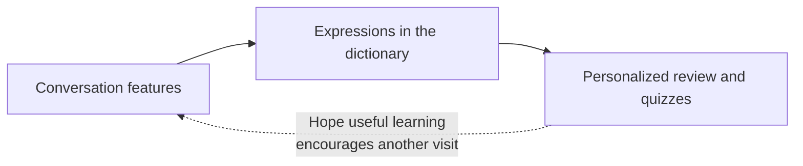

## TL;DR

- EncBird collects expressions from several conversation features in one dictionary.
- Review activities and quizzes reuse that data.
- Decide first how collected information will improve the next user experience.

## Introduction

While designing generative AI (GenAI) services recently, I became interested in connecting information gathered from users so other features could use it too.

In EncBird,[^1] the AI English-learning service I am building, I organized this around the **Expression Dictionary**.

We collect users' expressions through PictoChat's photo-based conversations, DiaryChat's English diary with an AI coach, and FreeChat's business-scenario practice. Flashcards and English-writing quizzes reuse the data stored in the Expression Dictionary.

Rather than building a separate review system for each conversation feature, I connected the shared collection of expressions to multiple learning features.

## 1. What Is a GenAI Flywheel?

This is the cycle I want to build in EncBird.





I call it a flywheel when information users leave in conversation improves the next experience, which in turn produces more information.

I designed EncBird to personalize review using expressions collected in conversation, hoping a more useful learning experience would lead to another conversation. The effects discussed below assume a service where this kind of personalization matters.

## 2. Ask What Information to Reuse and Where

Accumulating more conversations does not improve personalization unless the collected information informs the next experience. I therefore want to check two things before building a feature.

**First, which feature creates the most value when personalized?**

For example, even among search features, a case in which user preferences substantially change the results should be treated differently from one that needs to give everyone the same facts.

**Second, what user information does personalization require?**

In EncBird, I arranged for expressions from a user's conversations to return in review activities. What we collect needs to connect to what we provide with it.

I think defining this connection first reduces the risk of accumulating data and only later searching for a use for it.

## 3. Ask About User Intent Through Conversation

Logs, clicks, and purchase histories let us infer intent from behavior. In conversation, we can also ask directly why users are searching and what matters to them.

More conversation does not by itself mean we obtained the information we needed. We need to check whether the collected expressions actually feed review activities and quizzes, and whether users find the results useful.

## 4. Separate Collection from the Features That Use the Data

EncBird divides responsibilities as follows.

- **Conversation features and the Expression Dictionary**: Collect expressions from conversations in one place.
- **Flashcards and English-writing quizzes**: Use those expressions for personalized review.

When adding a conversation feature, its collected expressions can feed the same review features. When building a new way to review, we can also use expressions already collected.

## 5. Launch the Initial Features, Then Check the Loop

GenAI can help build initial features quickly, but we still need to learn through operation what information real users leave and what results they want.

Before launch, decide which inputs to collect and where to use them. Then check that the inputs are collected, cleaned, and passed to the next feature.

Even once that connection works, we must separately check whether the learning experience has improved. More data alone does not establish that users return more often or learn better.

## Conclusion

While designing EncBird, I came to find it useful to let review activities and quizzes share expressions collected in conversation.

When building the next feature, alongside deciding what new information to collect, I want to start with **how to reuse data already in the Expression Dictionary**. Whether that connection actually improves learning is something to check through operation.

---

[^1]: [EncBird — AI-Powered English Expression Learning](https://www.encbird.com).
