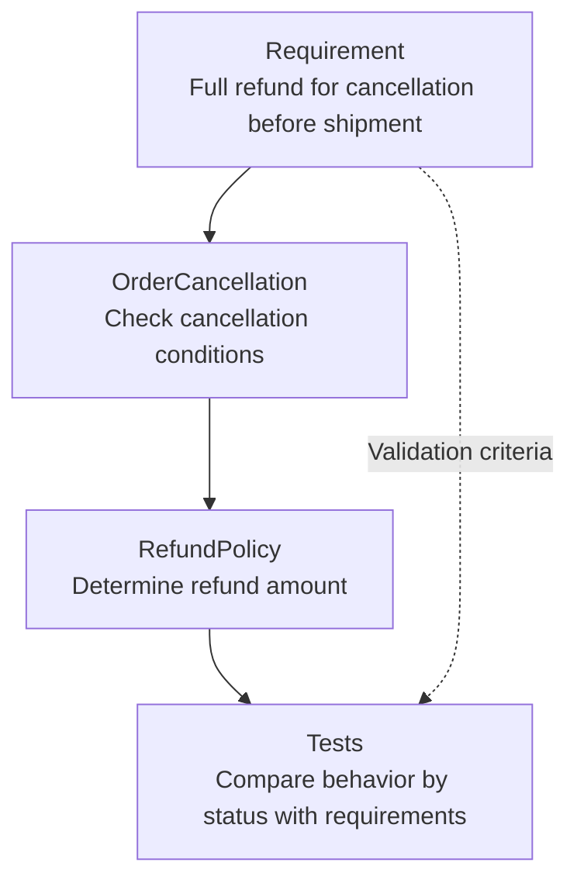

## TL;DR

- Code that explains its business intent matters in the age of agents.
- Names and structure should reveal business concepts and rules.
- Tests check that those rules hold in actual behavior.

## Introduction

I have been trying Claude Code for the first time now that it is available through Bedrock. GSD (Get Shit Done), a tool for managing project state, caught my attention. It records requirements, plans, and progress in documents that later tasks can read.[^2]

It made me think about who will manage the intermediate work between requirements and code. In the [previous post][^1], I argued that as planning and task tracking become part of the agent, people will have less intermediate state to reconcile manually.

An agent taking on more of that work also needs to read the current code to decide what has already been implemented. If the code obscures its business intent, the agent must first infer how requirements relate to implementation.

That makes me interested in what good code should look like in the age of agents. **Code that explains its business purpose to the next agent reading it**—code that screams its business purpose.

## 1. Code Can Reveal the Business, Just as Architecture Can

Robert C. Martin's “Screaming Architecture” argues that a repository's structure should reveal what the system does. In an accounting system, the accounting should be apparent before the web framework.[^3]

I think this perspective becomes important for code read by agents, too. If a requirement mentions “order cancellation” and “refund policy,” but the code presents only `Manager`, `Processor`, and `handle`, the agent has to locate and interpret the relevant files one by one.

Names such as `OrderCancellation` and `RefundPolicy` provide a starting point for connecting business concepts with code. If the cancellation code visibly calls the refund policy, the workflow becomes readable along with the names.

**Screaming code should reveal business concepts, rules, and their relationships.** Long comments explaining the implementation are not enough. Names must match actual responsibilities so the next change can rely on them.

## 2. Connect the Language of Requirements to Code and Tests

Domain-Driven Design (DDD), which organizes software around business concepts and rules, helps establish this connection. A starting point is “ubiquitous language”: using terms agreed on by domain experts and developers with the same meaning in code.[^4]

For example, suppose a requirement says, “Canceling an order before shipment gives a full refund.” An agent modifying this policy should be able to connect three things.

- **Names**: Find the cancellation and refund responsibilities in `OrderCancellation` and `RefundPolicy`.
- **Structure**: Follow cancellation through the shipment-status check and application of the refund policy.
- **Tests**: Distinguish cancellation before and after shipment to check the results against the policy.





When the same business rule is copied into several places, good names alone do not make it clear which implementation to change. Keeping a responsibility in one place and making its connections to other workflows explicit helps reveal the scope of a change.

Tests that merely repeat the implementation can also accept the wrong policy. They need to check the outcomes required by the business so we can trust both what the code says and what it does.

## 3. Preserve Intent That Cannot Be Recovered from Code

Code shows how the system behaves now. It rarely explains why a policy was chosen, why alternatives were rejected, or what should be built next.

For example, reading the refund calculation reveals the current policy. It may not reveal whether that policy follows a customer promise or a constraint imposed by an external payment system. Those reasons belong in requirements documents or architecture decision records (ADRs).

Separate code summaries can miss updates or omit necessary detail. If an agent must read the code to confirm current behavior anyway, making the business understandable there is a worthwhile investment. I would use documentation to preserve intent and constraints that are difficult to reconstruct from code.

This continues the context abstraction discussed in the previous post. People manage business goals and decision criteria; the agent connects those criteria to code responsibilities and plans the work. Clearer code reduces the effort of rebuilding intermediate summaries for the next task.

## 4. Refactor with the Next Agent in Mind

Over the past few years of developing with AI, I have felt execution costs steadily decline. I have more room to attempt documentation, refactoring, and optimization that I used to postpone. That change is also spreading beyond code.

I want to use some of that room to clarify the relationship between business concepts and code. An agent can look for names used with different meanings or business rules scattered across the relevant code, then propose ways to organize them.

People need to judge whether those proposals fit the business and organization. The same term can mean different things in different teams or workflows, so similar names do not automatically justify merging implementations. If an agent proposes three or four approaches, we can choose with the team's capabilities and business direction in mind, then reflect that choice in code and tests.

## Conclusion

As agents take on more of the work between requirements and code, the next agent performing a task becomes one of the code's readers. Helping it avoid reconstructing the business from guesses will become an important criterion for good code.

I want names and structure that make the business readable, with tests that check its rules. **Just as screaming architecture reveals a system's purpose, screaming code explains the business it handles.** That code is easier for people to read and easier to entrust to an agent for the next change.

---

[^1]: [Context Engineering — Letting Agents Handle the Work Between Requirements and Code](/en/2026/03/11/context-engineering-static-vs-dynamic.html).
[^2]: [GSD](https://github.com/gsd-build/get-shit-done) — a development workflow that preserves requirements, plans, and state in files.
[^3]: Robert C. Martin, [Screaming Architecture](https://blog.cleancoder.com/uncle-bob/2011/09/30/Screaming-Architecture.html) (2011.09.30). “Screaming code” is my application of that perspective to code read by agents.
[^4]: [What to Know When Starting to Learn DDD](/2021/10/11/thoughts-for-ddd-starters.html) (Korean).
