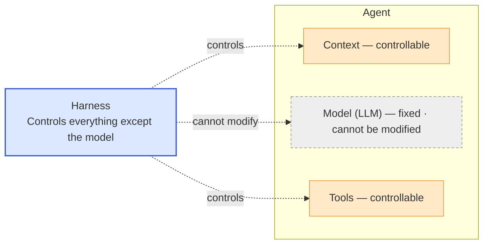
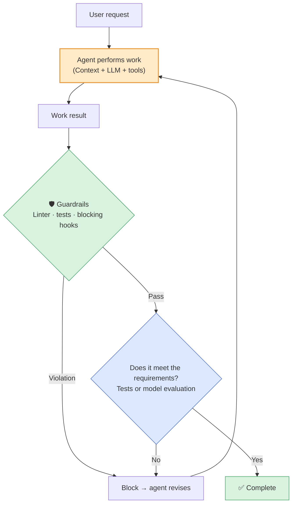
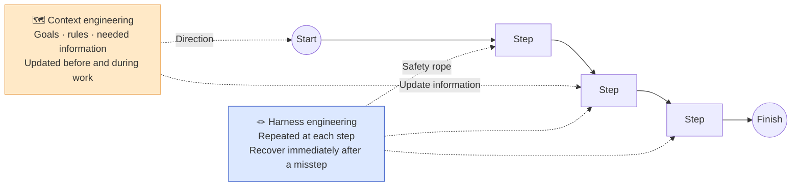
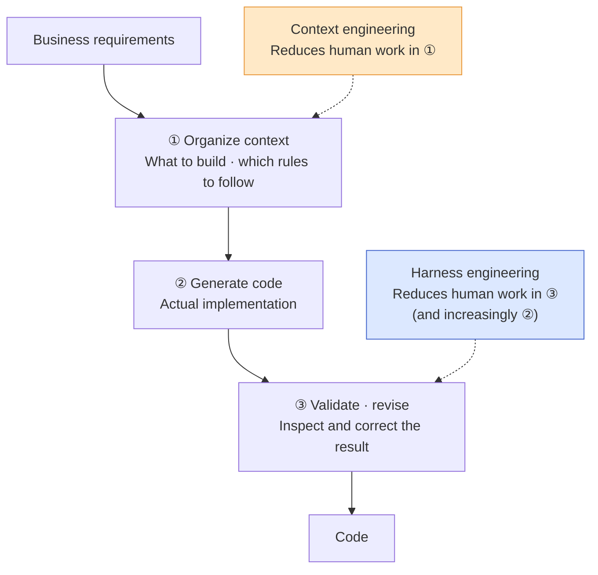
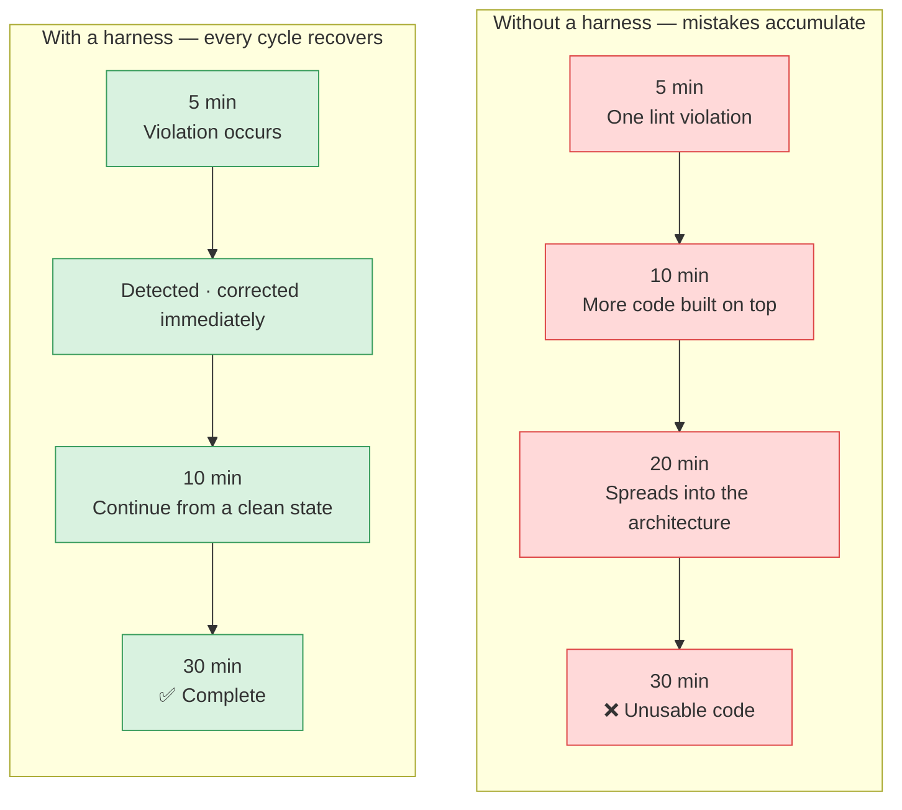
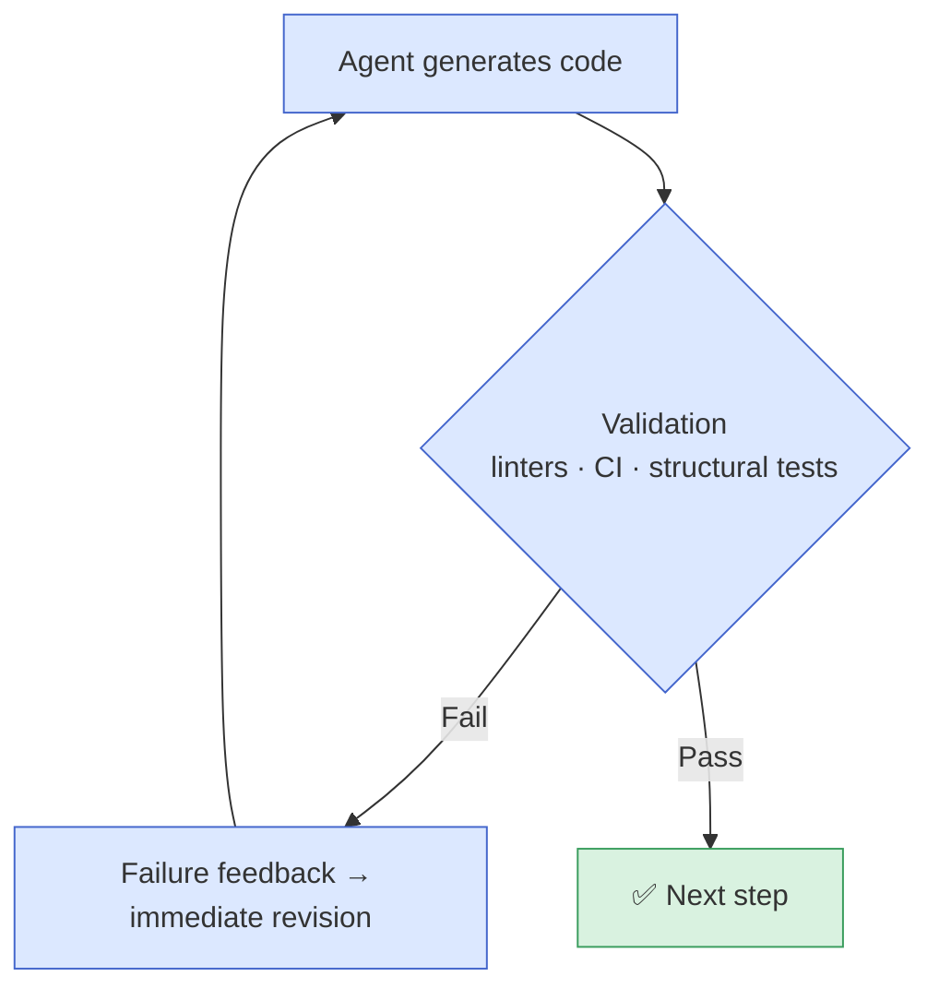
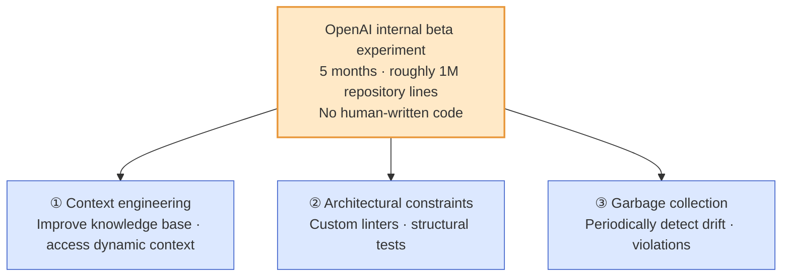
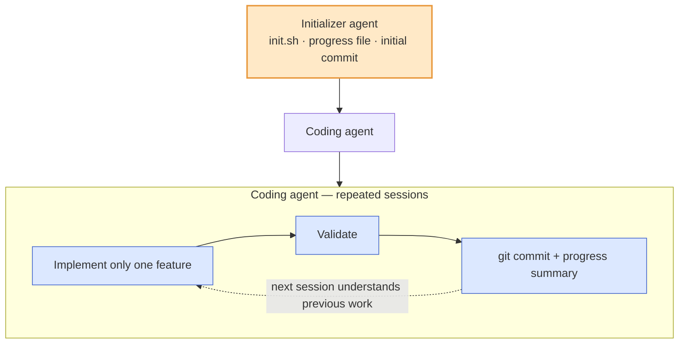
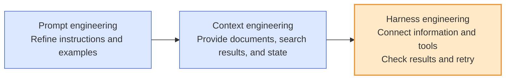

## TL;DR

- A harness is an execution environment connecting context, tools, and validation.
- Short validation and retry cycles reduce the accumulation of errors.
- Start by automatically checking one recurring error.

## Introduction

Earlier posts discussed context engineering[^1] and how to embed business context in code.[^2]

The argument was that an agent operates more reliably when it receives good static context and the code itself explains the business clearly.

But once you run agents at production level, problems appear that context alone cannot solve.

An agent ignores lint rules, drifts away from architectural principles, or repeats a mistake that has already been corrected. You may have experienced unstable output even after providing a good prompt and strong context.

When an agent continues beyond its context window—the amount of information it can read at once—it can lose track of earlier errors or unfinished work. Longer tasks make it important to decide which state carries forward and how results are checked.

Anthropic described harnesses for long-running agents in November 2025.[^6] In February 2026, Mitchell Hashimoto[^3] and OpenAI[^4] also described their practices and experiments using the name **harness engineering**.

## 1. What is a harness?

A harness originally refers to the tack placed on a horse: equipment such as reins and a saddle that keeps the horse from running wherever it wants.

A harness for an AI agent serves the same purpose. It means **the entire environment that surrounds an agent and prevents it from wandering down the wrong path**.

First, consider what we can control. An agent combines **context + an LLM (model) + tools**. Here, I am discussing a development environment in which we select and use models rather than train them ourselves.

In other words, what we can actually manipulate is **everything except the model**: the context, the tools, and the environment in which they operate.





A harness puts validation results into context and uses tools to carry out the next action. Two mechanisms used in this process are **feedback loops** and **guardrails**.

### Feedback loops — "inspect the result, then retry if it is wrong"

A feedback loop is **a cycle that validates the agent's output and makes the agent retry on its own until the result meets the criteria**.

Instead of a person saying, "This is wrong, fix it," the system automates that role. It runs tests, lets the agent correct the code when they fail, runs them again, and repeats until they pass.

We need to distinguish validation from modification within the loop. We can use **deterministic checks that produce the same result for the same input**, such as linters and tests, or ask a model to evaluate whether the requirements are met.

The model may choose different fixes in the same situation, so reproducibility of a check differs from reproducibility of the entire repair process. Using the same check does not guarantee the same fix or number of attempts.

### Guardrails — "cross the line and the system blocks you"

The guardrails discussed here are **deterministic blocking mechanisms**. They define explicit rules and prevent progress when those rules are violated.

A linter or test failure can be connected to a condition that blocks a commit or deployment, while blocking hooks prevent prohibited actions. Merely printing a result or adding a prompt does not guarantee enforcement.

They are predictable automatic blocking mechanisms that produce the same result from the same input.

### They serve different roles

| Mechanism | Nature | Role | Example |
| --- | --- | --- | --- |
| Feedback loop | A cycle of validation and modification | Return validation results and retry | Run tests → revise after failure |
| Guardrail | Deterministic blocking based on rules | Prevent the next action when a rule is violated | Linter · type check · blocking hook |

Guardrails draw the lines the agent must not cross, while feedback loops refine the work within those lines until it is correct. Together, they form the environment surrounding the agent: the harness.

Placed into an actual workflow, the system operates like this.





The reason a guardrail blocked an action also becomes input to the next revision. In the diagram above, the entire path that checks the result and returns to the work is the feedback loop.

## 2. The relationship between context engineering and harness engineering

It helps to distinguish what information to give the model from how to validate the work it performs with that information.

**Context engineering adjusts the broad direction.** It tells the agent what to do, which architecture to follow, and which business context governs its work.

System prompts, `CLAUDE.md`, retrieved documents, and memory are examples. Code read during a task and validation results also become context for the next decision.

**Harness engineering configures the environment so errors can be checked and another attempt made during execution.** Short cycles aim to stop later work from accumulating on top of small errors.

A linter catches a style violation and the agent immediately corrects it. CI reports a failed test and the agent fixes it automatically. A structural test detects an architectural violation and forces the agent to reverse course. These mechanisms are **safety systems that check the ground beneath every step**.

In a hiking analogy, context provides the map and current location, while validation and recovery during execution act like a safety rope when you lose your footing. Just as you consult the map again when circumstances change, context is also updated during the task.





Anthropic's article on harness design for long-running agents[^6] emphasizes the same point.

The article describes difficulty in continuing reliably across context windows with compaction and a high-level goal alone.

Every execution loop needs mechanisms that record state, detect failure, and recover automatically.

| Area | Main role | Timing | Design focus |
| --- | --- | --- | --- |
| Context engineering | Provide goals, rules, and needed information | Updated before and during work | Information the LLM uses to make decisions |
| Validation and recovery during execution | Check results and retry | Each execution loop | Tools · guardrails · feedback loops |

In the broader sense, I use harness to mean the entire execution environment connecting context with validation and recovery. The table distinguishes roles within that environment rather than two mutually exclusive technologies.

Birgitta Böckeler's article on Martin Fowler's site combines guidance before work with checks after it, describing a user harness as a form of context engineering.[^5] Authors draw the terminology differently. Here, I distinguish providing information from checking results and call the environment connecting them the harness.

### Ultimately, the question is how far we reduce human intervention

Why these two forms of engineering must work together becomes clear when we consider **the points where people intervene** in the development process.

People typically intervene in three places while turning a business requirement into code: **organizing the context for what to build**, **writing the code itself**, and **checking and correcting the result**.

Delegating work to an agent means removing human hands from these three points one by one.





**Context engineering reduces the human work in step ①.** Instead of a person repeatedly explaining, "Do it this way," the rules and context are placed in documents in advance.

**Harness engineering reduces the human work in step ③.** Instead of a person inspecting every result and saying, "This part is wrong, fix it," linters and tests validate the work automatically, and the agent corrects itself.

The important point is that **step ① must be established properly before we can remove the human from step ③**. The definition of correctness—the context—must be clear before we can build mechanisms that automatically catch errors—the harness.

The two are therefore not separate practices. They lie along **one progression that gradually reduces human intervention**. Context first reduces the hand that sets the direction. The harness then reduces the hand that validates the result. The process moves toward leaving people only with the act of "providing business requirements."

## 3. Why short-cycle automatic error recovery matters

Assume that context engineering has established the broad direction well.

During a 30-minute task, however, the agent generates code that violates a lint rule at minute 5. At minute 10, it builds more code on top of that violation. By minute 20, the original mistake has spread across the architecture.

At minute 30, the result points in the right direction, but the code is unusable.





**The problem is not the mistake itself, but the fact that it accumulates without being recovered.** This is the essential difficulty of long-running agents.

Anthropic's article[^6] compares the situation to **"an engineer arriving without any memory of the previous shift."** If an agent starting with a fresh context does not recognize earlier mistakes, it repeats them or builds more work on top of them.

The core of harness engineering is to **recover from this problem automatically during every short execution cycle**.

**The linter checks the code on every run.** When the agent generates code, the linter catches the violation immediately and returns failure feedback. The agent fixes it at minute 5, preventing the violation from accumulating through minutes 10 and 20.

**CI runs tests on every commit.** When the agent implements a feature, automated tests validate it immediately. If they fail, the agent attempts a correction automatically.

To support this, Anthropic proposes **limiting the agent to one feature at a time and requiring a git commit and progress summary at the end of every session**.[^6]

**Structural tests detect architectural violations.** Custom lint rules or architecture tests verify that the agent's output remains within the overall structure.

These three mechanisms ultimately form one short feedback loop. The agent produces an output, validation mechanisms immediately decide whether it passes, and a failure sends feedback back to the same point for another attempt.





The shorter each loop is, the sooner it stops a mistake from accumulating. This is why "keep feedback loops short" is a core principle of the harness.

Mitchell Hashimoto also describes harness engineering as improving instructions and tools so agents do not repeat the same mistakes.[^3]

Connect conditions that can be checked automatically to actual checks. Short feedback cycles let the agent attempt corrections before errors accumulate.

## 4. What OpenAI and Anthropic demonstrated

In February 2026, OpenAI published the results of a five-month internal experiment.[^4]

A small team built an internal beta product with Codex without humans writing code directly. The roughly million-line repository included application code, tests, infrastructure, tools, and documentation.

The engineers set goals, judged results, and **designed the harness** through which agents could check their work. I grouped the parts worth examining into three areas.

1. **Context engineering**: Continuously improve the knowledge base inside the codebase and give agents access to dynamic context such as observability data and browser exploration.
2. **Architectural constraints**: Monitor the system not only with LLM-based agents, but also with deterministic custom linters and structural tests.
3. **Garbage collection**: Run agents periodically to find documentation drift and architectural violations, countering entropy and decay.





Anthropic published harness-design principles for long-running agents in the same context.[^6] The central idea is a **two-part architecture**.

An initializer agent sets up the environment—`init.sh`, a progress file, and the initial commit—while a coding agent implements one feature at a time, incrementally. Every session records its state so the next session can understand the previous work quickly.

This case shows how **carrying state into the next session and checking current behavior before new work** can support long-running tasks. Automatic checks do not guarantee that every task will succeed.





Both articles ultimately emphasize the same point. Context should establish the broad direction, but an agent also needs **mechanisms that automatically detect and recover errors during every execution cycle** if it is to complete a long-running task.

## 5. Expanding attention from instructions to the execution environment

These concepts do not replace one another. I find it useful to see them as an expanding scope of what we try to control.





The direction is consistent: **the target of control expands from "input text" to "the entire process in which the agent works."** As the model becomes more autonomous and works for longer, areas that input alone cannot control become visible.

For a short question, refining instructions and examples matters. For changes across a repository, we also need to choose the documents and code to expose and how to communicate current state.

Longer tasks also require checking tool results, feeding failures into the next revision, and passing state to the next session. Which mechanisms to provide depends on the task's scope, not a particular year or product name.

## 6. What this means in practice

First, choose one condition that people repeatedly check. Put code-style conditions in a linter or behavioral conditions in tests, and have the agent run them during work.

When validation fails, return the violated condition and execution result as input to the next revision. Use the same check to verify whether the revision now passes.

After the task, also check for mismatches between documentation and code. Rules added to prevent the same mistake must agree with actual behavior if they are to remain useful for the next task.

## Conclusion

I want to keep expanding the scope of work I can entrust to agents when turning business requirements into code.

That requires an execution environment that shows what was checked and where it failed, rather than asking me to trust a description of the result. I think building a harness starts with moving repeated human checks into that environment one at a time.

---

[^1]: [Context Engineering — Static Context and Dynamic Context](/en/2026/03/11/context-engineering-static-vs-dynamic.html).
[^2]: [The Value of Developers Who Understand the Business in the Age of Agentic Development](/en/2026/03/13/agentic-dev-business-aligned-code.html).
[^3]: [Mitchell Hashimoto — My AI Adoption Journey](https://mitchellh.com/writing/my-ai-adoption-journey) (2026.02.05).
[^4]: [OpenAI — Harness engineering: leveraging Codex in an agent-first world](https://openai.com/index/harness-engineering/) (2026.02.11).
[^5]: Birgitta Böckeler, [Harness engineering for coding agent users](https://martinfowler.com/articles/exploring-gen-ai/harness-engineering.html), Martin Fowler's site (2026.04.02).
[^6]: [Anthropic — Effective harnesses for long-running agents](https://www.anthropic.com/engineering/effective-harnesses-for-long-running-agents) (2025.11.26).
