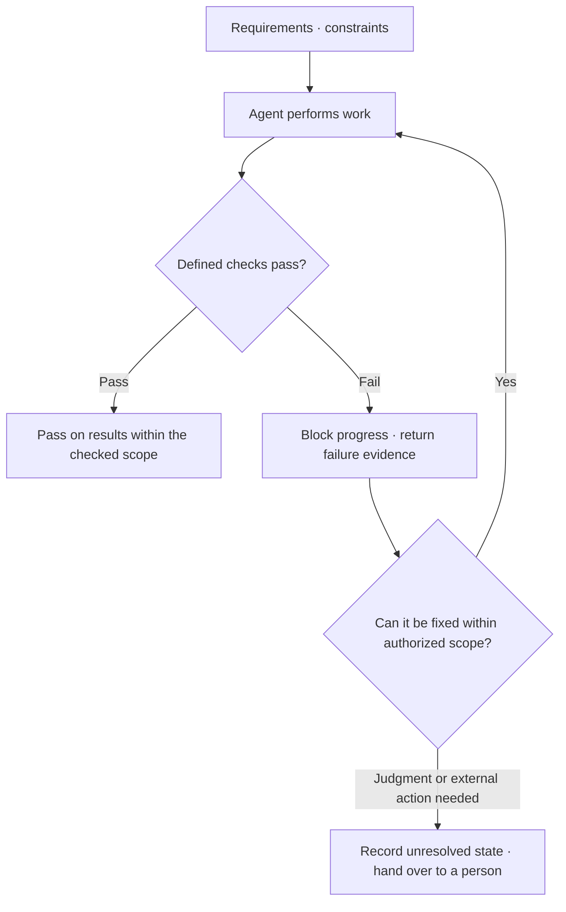
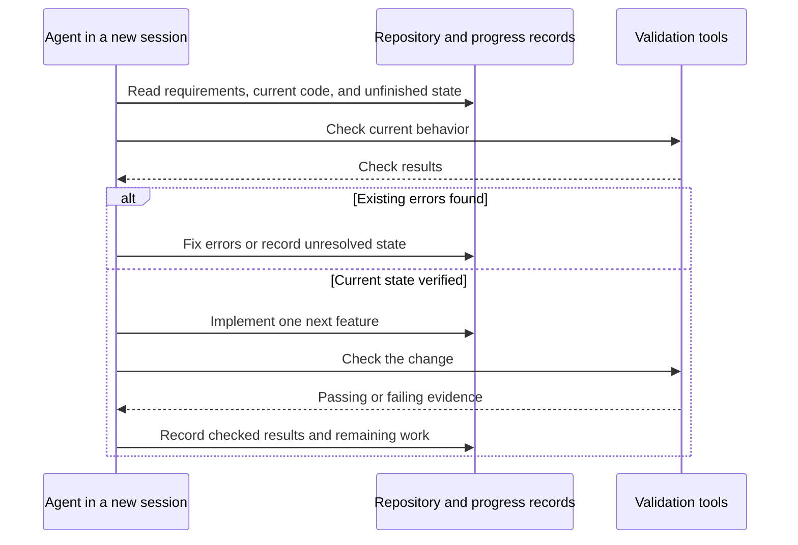

## TL;DR

- A harness connects context, tools, and validation in an execution environment.
- Short validation and retry cycles reduce accumulated errors.
- Start by automating one condition people repeatedly check.

## Introduction

Earlier posts discussed delegating planning and state management between requirements and code to agents,[^1] and why code should explain its business intent.[^2]

An agent's access to that context does not mean it will always follow the criteria. It can violate a documented architecture constraint or finish a task without checking results despite instructions to run tests.

Longer tasks make the problem harder. When work exceeds the context window—the amount of information an agent can read at once—errors and unfinished state also need to reach the next session.

Delegating more intermediate work therefore requires **an environment where the agent can check results and respond to failures**. Anthropic's long-running agent example,[^6] Mitchell Hashimoto's practices,[^3] and OpenAI's internal experiment[^4] drew my attention to harness engineering as a way to build that environment.

## 1. A Harness Connects Information to Actions and Checks

A harness originally means equipment fitted to a horse. For an AI agent, it refers to the execution environment that supplies information to a model, lets it run tools, and feeds results into the next decision.

If we view an agent as **context + a large language model (LLM) + tools**, developers who are not training the model primarily control the context, tools, and connections between them. Choosing a model is distinct from building the environment in which that model works.

Two useful mechanisms to understand are feedback loops and guardrails.

### Feedback Loops and Guardrails

A **feedback loop** checks a result and returns failing conditions to the agent for revision and another check. It moves the repeated instruction “this test failed, fix it” from a person into the environment.

A **guardrail** blocks the next action when a rule is violated. A linter printing an error is different from preventing a commit because of that error. Here, I use guardrail for a check connected to actual blocking behavior.

The same linter or test can serve both roles. Its failure explains what needs attention while preventing progression until the condition passes.



```mermaid
flowchart TB
    R["Requirements · constraints"] --> A["Agent performs work"]
    A --> C{"Defined checks pass?"}
    C -->|Pass| D["Pass on results within the checked scope"]
    C -->|Fail| B["Block progress · return failure evidence"]
    B --> F{"Can it be fixed within authorized scope?"}
    F -->|Yes| A
    F -->|Judgment or external action needed| S["Record unresolved state · hand over to a person"]
```


Passing a check means satisfying the conditions that check covers. It does not establish that every requirement has been verified. A model can also choose different fixes in the same situation, so retries do not guarantee eventual success.

## 2. Supplying Context and Checking Results

Context engineering means selecting and managing information an agent uses to decide. Requirements, design reasons, instructions in `CLAUDE.md`, retrieved documents, current code, and test results all contribute. Context is not limited to information supplied once before work begins.

A harness connects that information to tool execution and validation. For example, documenting that “the order module must not directly reference the payment module's internal implementation” gives the agent a criterion to read. Checking those dependencies and feeding violations into revision makes the criterion checkable during execution, too.

In a hiking analogy, context is the map and current location; validation and recovery help identify a wrong turn and return from it. Just as you consult the map again after your location changes, validation results become context for the next decision.

These are therefore not mutually exclusive techniques. I use harness broadly for the environment connecting information, tools, and validation. In an article I read later, Birgitta Böckeler also discusses instructions before work and checks afterward, describing a user harness as a form of context engineering.[^5]

This relationship makes delegation concrete. We can establish lasting requirements and constraints, let the agent implement, and turn repeated checks into executable tests. Policy decisions that resist automation and results not yet verified still need human judgment.

## 3. Check Errors Before More Work Depends on Them

If we inspect the result only at the end, several changes can accumulate on top of an incorrect assumption.

For example, suppose an agent makes the order module call the payment module's internal implementation directly. If cancellation and refund features are then built on that relationship, fixing the dependency later may require changing several features together.

A structural check reporting the first violation lets the agent reconsider that change earlier. **Shortening the interval between a check and a revision reduces the chance of building more work on top of a mistake.**

| Condition | Check | Action after failure |
| --- | --- | --- |
| Code style and types | Linter and type checker | Fix the reported location and run the same check |
| Behavior required by the business | Automated tests | Compare the failing condition with the implementation |
| Module dependency rules | Structural checks | Correct the responsibilities and references |

CI, an environment that runs checks automatically when code changes, can apply the same criteria. A CI failure notification alone does not automate the repair. The agent needs a connection that lets it read the result and act on it.

If a failure lacks enough evidence for a fix or requires a policy decision, the agent should preserve that state and hand it over. Marking failure as success or weakening the check is not completion.

### Continue Checking Across Sessions

Anthropic's example addresses work spanning several sessions. An initializer agent prepares a feature list and environment; a coding agent implements one feature at a time. Progress records and Git history help the next session understand prior work, and it checks current behavior before starting something new.[^6]



```mermaid
sequenceDiagram
    participant N as Agent in a new session
    participant R as Repository and progress records
    participant T as Validation tools
    N->>R: Read requirements, current code, and unfinished state
    N->>T: Check current behavior
    T-->>N: Check results
    alt Existing errors found
        N->>R: Fix errors or record unresolved state
    else Current state verified
        N->>R: Implement one next feature
        N->>T: Check the change
        T-->>N: Passing or failing evidence
        N->>R: Record checked results and remaining work
    end
```


This extends short feedback cycles across sessions. Progress records tell the next session what to check and where to continue; they do not replace the current code.

## 4. Move Repeated Checks Into the Environment

In February 2026, OpenAI described a small team's five-month experiment building an internal beta product with Codex. The roughly million-line repository, with no directly human-written code, included tests, infrastructure, tools, and documentation as well as the application.[^4]

Engineers set goals, judged results, and designed the agent's environment. They supplied repository knowledge and information gathered during execution, checked constraints with custom linters and structural tests, and periodically cleaned up mismatches between documentation and code.

What I want to learn from that example is how human checks moved into the environment, more than the repository's size. Mitchell Hashimoto similarly describes improving instructions and tools to prevent recurring mistakes as harness engineering.[^3]

In practice, we can start with one condition a person repeatedly checks. Put style conditions in a linter or behavioral conditions in tests, then connect the failure result to an agent's revision and recheck. Gradually make more documented constraints executable.

Seen this way, attention to prompts, context, and harnesses forms a connected progression. Refining instructions leads to managing all the information needed for work. Longer tasks then require designing tool execution, result checks, and handover to the next session.

## Conclusion

I want to entrust more of the process between requirements and code to agents. Along with explaining what to build, I need to prepare how results will be checked and how failures will be handled.

I think a harness starts with **moving one repeated human check into the agent's execution environment**. Before entrusting the next task, I should be able to explain what the check covers, where a failure goes, and when human judgment is needed.

---

[^1]: [Context Engineering — Letting Agents Handle the Work Between Requirements and Code](/en/2026/03/11/context-engineering-static-vs-dynamic.html).
[^2]: [Good Code for Agents to Read — Code That Screams Its Business Purpose](/en/2026/03/13/agentic-dev-business-aligned-code.html).
[^3]: [Mitchell Hashimoto — My AI Adoption Journey](https://mitchellh.com/writing/my-ai-adoption-journey) (2026.02.05).
[^4]: [OpenAI — Harness engineering: leveraging Codex in an agent-first world](https://openai.com/index/harness-engineering/) (2026.02.11).
[^5]: Birgitta Böckeler, [Harness engineering for coding agent users](https://martinfowler.com/articles/harness-engineering.html) (2026.04.02). Added during a revision after this post's original publication.
[^6]: [Anthropic — Effective harnesses for long-running agents](https://www.anthropic.com/engineering/effective-harnesses-for-long-running-agents) (2025.11.26).
