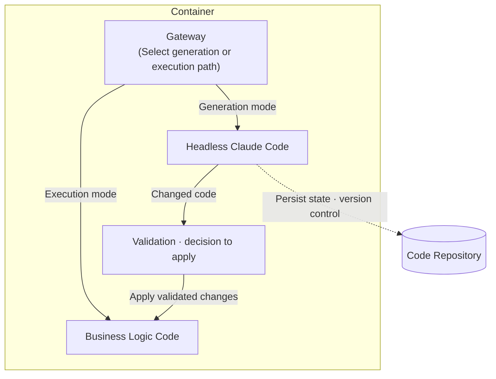

## TL;DR

- I envision an app engine that hosts code generation and execution in one environment.
- Agents handle generation mode; validated code handles execution mode.
- The same setup could support personalization through user-specific modules.

## Introduction

While writing about harness engineering[^1] and multi-agent systems without harnesses,[^2] I became curious about what happens after an agent writes the code.

Even completed code must pass through packaging and a deployment pipeline before users can use it. **Could we operate the code-generating agent and the environment that runs its code together?**

Anthropic's recent release of Managed Agents[^3] made the picture I had been imagining feel a little more concrete. This post is about that picture.

## 1. The fundamental purpose of software development

I view software development as **the process of turning business requirements into executable code**.

This process includes planning, design, and implementation, as well as managing the execution environment.

When considering VMs, containers, or serverless options, I am interested in how much of the execution environment developers can stop managing directly. From the same perspective, I wondered whether packaging and deployment after code generation could be brought together more closely.

## 2. Agentic development and the harness

Agentic development is a natural extension of this progression. It is the stage at which we begin reducing human involvement in the act of development itself.

As the earlier post explained,[^1] an agent needs a **harness** to operate reliably. Unless linters, CI, structural tests, retry loops, permission controls, and similar mechanisms recover errors outside the agent at short intervals, the agent cannot complete long-running tasks.

Rather than building this entire execution environment myself, I want to start with the coding agents I already use, connecting project tests, permissions, and recovery procedures to tools such as Claude Code or Codex.

## 3. The idea of deploying the agent itself

Let us push the idea one step further. **Deploying code produced by an agent** and **deploying the agent itself** are two different propositions.

The current workflow looks like this: an agent produces code on my local machine or in CI → that code is packaged into a container → it passes through a deployment pipeline → the code handles requests at runtime. The agent exists only at build time and disappears at runtime.

Taking this further, I imagined an agent interpreting business logic and responding to requests at runtime. In this vision, the agent handles both code generation and serving.

Reality, however, presents two barriers: **token cost** and **nondeterministic execution**. If an LLM interprets every request in real time, the cost per call becomes too high. The same input may also produce different outputs, making production reliability difficult to guarantee. Until token costs effectively approach zero and determinism improves enough, we cannot implement this ideal directly.

We therefore need a practical compromise: **separate generation from execution**. The agent behaves as if it were at build time and produces code in advance, while that code runs deterministically at runtime. The agent itself remains in the runtime, but the system does not call the LLM for every request.





The structure is simple. Put headless Claude Code—or another agent such as Codex or Kiro—and the business-logic code in the same container, then **place a gate in front of them**. The gate determines whether each incoming request belongs to "generation mode" or "execution mode."

- **Generation mode**: Pass requirements in natural language to the headless agent. The agent uses its harness to create code, validates it with linters and tests, and commits the final artifact to a code repository.
- **Execution mode**: The generated business-logic code handles requests like an ordinary application. This path does not call an LLM. It is deterministic, fast, and inexpensive.

This hybrid setup is what I want to try now. If some workflows eventually meet their cost and reliability requirements even when a model interprets each request, we could start letting the model handle those workflows directly.

If you want to see the structure running as actual code, refer to the proof-of-concept implementation[^5] that places headless Claude Code behind a gateway and separates generation mode from execution mode.

## 4. A ubiquitous development environment

If this structure works in practice, the daily life of a developer changes considerably.

In this vision, a developer can send requirements to a deployed agent to generate or modify an API without opening a local IDE. Given a request such as "Change the refund policy for order cancellations this way," the agent finds the relevant code, modifies it, and runs tests.

Requests use the new logic only after the change has passed validation and the process for applying it to execution mode.

In this setup, changes can begin wherever requirements can be sent, such as a phone chat or Slack. As I discussed in an earlier post,[^4] describing the desired behavior precisely becomes important.

Debugging and testing can also begin in the hosted environment. But we still need to decide how to separate code being generated from code handling live requests, and when to apply validated changes. Splitting the modes does not resolve that boundary by itself.

This idea is not entirely new. Anthropic's Managed Agents[^3] have already opened a path for running agents as long-lived tasks on hosted infrastructure. The app engine I am describing is an extension of that direction, closer to **treating the agent as a runtime component rather than a development tool**.

## 5. Extension: hyper-personalization

If users need different behaviors, this arrangement could also support **personalization through user-specific generated modules**.

Software has traditionally been built on the assumption that "one piece of business logic applies equally to every user." Shared code processes user-specific data to produce personalized results, but structurally everyone calls the same function.

That assumption breaks when the agent becomes a runtime component. **The system can generate a dedicated function or module for each user and execute that module when the user sends a request.** Even behind the same endpoint, code tailored to user A's preferences and context runs for user A, while user B receives user B's version.

- Generation mode receives a requirement such as **"Create user A's year-end tax-settlement module with the applicable tax benefits"** and creates `handlers/user_a/tax.py`.
- When a request arrives, execution mode reads the user identifier and dispatches the request to that user's module.
- If the user changes a preference, they communicate it in natural language and update only their module. Other users' modules remain unchanged.

Traditional A/B tests and feature flags select among "predefined variations." In this approach, **the variations themselves are created by the agent at runtime**. The unit of personalization moves one level down, from data to code. If the shared core remains deterministic while the agent generates or updates only a thin per-user layer, the system can also control cost and determinism to some extent.

Compared with including user history in the prompt on every request, this setup **does not need another LLM call to execute personalization rules already translated into code**.

LLM call costs arise when generating or updating a module. That does not eliminate the costs of data retrieval, code execution, or storing and loading modules.

We also need to compare the costs of managing a growing number of user-specific modules and verifying that each follows shared rules. The next question is which workflows benefit from code generation rather than managing personalization rules as data.

## 6. Assumptions and limitations

The limitations of the two designs described above also need to be considered separately.

**A design in which the model interprets every request** still faces LLM call costs, response latency, and result-validation challenges. Those costs need to be checked first for high-traffic workflows or ones with strict response-time requirements.

**A hybrid setup that executes generated code** makes no LLM calls on its execution path. Instead, it needs to separate changes under generation and validation from currently serving code, and provide a process for applying or reverting validated changes.

**Security and audit trails** must also be redesigned. If natural language can change business logic in real time, the records and approval flows showing who changed what and when must be stricter than those in conventional CI/CD. The gate controller becomes more than a simple mode switch; it becomes the governance layer.

The app engine must also apply only code that has passed harness validation[^1] to its execution path. Even when generation and serving are close together, any path that bypasses validation can expose defects directly through the live API.

## Conclusion

I am curious whether hosting code generation and execution together could shorten the process from a requirement change to users seeing the result.

For now, I want to test a setup that validates code produced in generation mode before applying it to execution mode. User-specific module generation is an experiment to extend into once that boundary can be operated reliably.

---

[^1]: [Demystifying Harness Engineering](/en/2026/03/15/harness-engineering-beyond-context-engineering.html).
[^2]: [Multi-Agent Without a Harness Is Just Context Engineering](/en/2026/03/31/multi-agent-without-harness-is-just-context-engineering.html).
[^3]: [Anthropic — Managed Agents Overview](https://platform.claude.com/docs/en/managed-agents/overview).
[^4]: [The Value of Developers Who Understand the Business in the Age of Agentic Development](/en/2026/03/13/agentic-dev-business-aligned-code.html).
[^5]: [Agentic App Engine POC — a generation/execution mode demo built on headless Claude Code](https://github.com/haandol/agentic-app-engine-poc).
