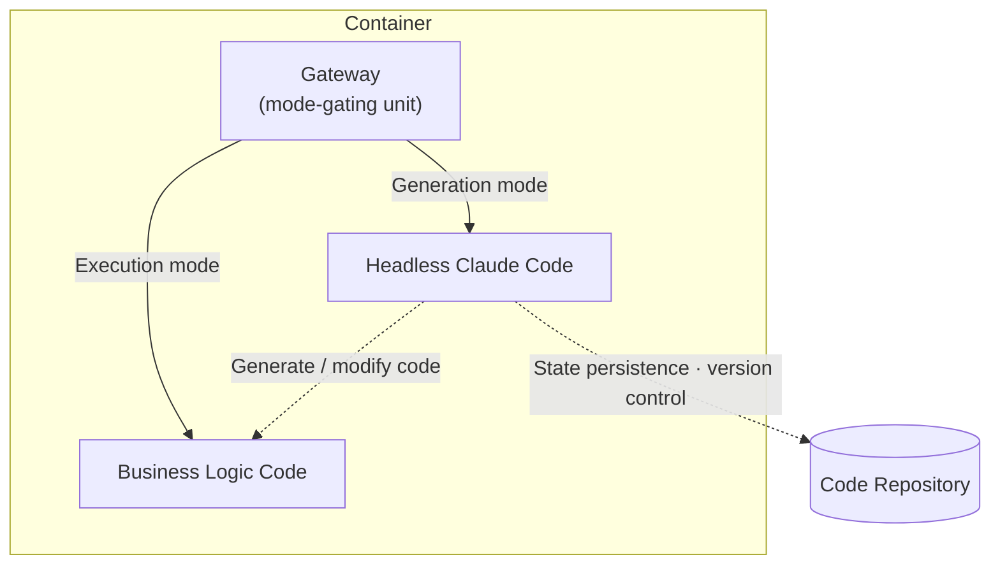

## TL;DR

- The purpose of software development is ultimately to **translate business requirements into code**, and the progression from VMs to containers to serverless has continually abstracted away infrastructure layers distant from that purpose.
- The ideal next stage of agentic development is not deploying code produced by an agent, but having **the agent itself serve business logic directly at runtime**.
- Token cost and nondeterminism make that ideal difficult today, so a practical starting point is to **separate generation mode from execution mode with a gate**; extending the same structure can lead to **hyper-personalization** through dynamically generated per-user modules.

## Introduction

Earlier posts discussed harness engineering[^1] and multi-agent systems without harnesses.[^2] While writing them, one question kept circling in my mind: **Where are we ultimately going?**

After working in software development for a long time, I have found that the names of technologies change while their direction remains surprisingly consistent. In one sentence, that direction is this: **minimize human intervention in the process of translating business requirements into code.** VMs became containers, and containers became serverless, along that same path. The agentic development trend we are now watching is ultimately the next scene in the same progression.

Anthropic's recent release of Managed Agents[^3] made the picture I had been imagining feel a little more concrete. This post is about that picture.

## 1. The fundamental purpose of software development

The purpose of software development may look complicated, but it is actually simple: **translate business requirements into executable code**.

Doing so requires product managers, developers, designers, and operators at a small scale, or large teams at a greater one. Over the past several decades, technologies have repeatedly been created to reduce human intervention in this process.

Consider the progression **from VMs to containers, and from containers to serverless**. On the surface, it looks like an evolution in deployment methods, but its essence lies elsewhere. The closer a layer is to infrastructure, the less it has to do with business requirements. Time spent managing operating systems, configuring networks, and worrying about scaling is not time spent translating business requirements into code.

The industry has therefore continued to abstract away these non-business layers. VMs hid the operating system, containers standardized the runtime environment, and serverless removed server management itself. At each stage, people moved closer to the essential work. **The direction of abstraction has always been toward an environment where people can focus exclusively on translating business requirements into code.**

## 2. Agentic development and the harness

Agentic development is a natural extension of this progression. It is the stage at which we begin reducing human involvement in the act of development itself.

As the earlier post explained,[^1] an agent needs a **harness** to operate reliably. Unless linters, CI, structural tests, retry loops, permission controls, and similar mechanisms recover errors outside the agent at short intervals, the agent cannot complete long-running tasks.

This makes one fact clear: **whether we build an agent directly or use an agent to build code, we ultimately have to construct the harness from the ground up.** A good prompt alone does not make an agent produce production-grade code consistently. OpenAI and Anthropic have already demonstrated this through their respective experiments.

That raises a practical question: **nobody wants to build an agent from scratch.** We want to focus on translating business requirements into code, not assembling linters, CI, recovery loops, and permission systems from the ground up. Doing so would be like returning to the era of managing servers and orchestrating containers ourselves.

Fortunately, **agents already exist with sufficiently mature harnesses optimized for translating business requirements into code.** Tools such as Claude Code and Codex have spent a long time refining their harnesses around the goal of producing production-grade code. Starting with them gets us closer to the essential work than building a new agent.

## 3. The idea of deploying the agent itself

Let us push the idea one step further. **Deploying code produced by an agent** and **deploying the agent itself** are two different propositions.

The current workflow looks like this: an agent produces code on my local machine or in CI → that code is packaged into a container → it passes through a deployment pipeline → the code handles requests at runtime. The agent exists only at build time and disappears at runtime.

When you think about it, this structure is rather awkward. **If an agent can understand business logic and turn it into code, why serve only the artifact?** The ideal picture is to place the agent itself in the runtime so that it interprets the business logic directly and responds whenever a request arrives. That is the true state in which "the agent is the app engine."

Reality, however, presents two barriers: **token cost** and **nondeterministic execution**. If an LLM interprets every request in real time, the cost per call becomes too high. The same input may also produce different outputs, making production reliability difficult to guarantee. Until token costs effectively approach zero and determinism improves enough, we cannot implement this ideal directly.

We therefore need a practical compromise: **separate generation from execution**. The agent behaves as if it were at build time and produces code in advance, while that code runs deterministically at runtime. The agent itself remains in the runtime, but the system does not call the LLM for every request.





The structure is simple. Put headless Claude Code—or another agent such as Codex or Kiro—and the business-logic code in the same container, then **place a gate in front of them**. The gate determines whether each incoming request belongs to "generation mode" or "execution mode."

- **Generation mode**: Pass requirements in natural language to the headless agent. The agent uses its harness to create code, validates it with linters and tests, and commits the final artifact to a code repository.
- **Execution mode**: The generated business-logic code handles requests like an ordinary application. This path does not call an LLM. It is deterministic, fast, and inexpensive.

The important point is that this separation is **a practical compromise on the ideal of "agent = app engine."** If token costs fall far enough and determinism becomes reliable, execution mode will gradually become thinner and eventually disappear, leaving only generation mode. Until then, this hybrid is the most practical form.

If you want to see the structure running as actual code, refer to the proof-of-concept implementation[^5] that places headless Claude Code behind a gateway and separates generation mode from execution mode.

## 4. A ubiquitous development environment

If this structure works in practice, the daily life of a developer changes considerably.

**You need neither an IDE nor a local machine.** Send business requirements directly to the deployed Claude Code infrastructure, and it immediately creates an API containing the requested logic. The gate's mode control can let that API begin receiving real traffic at once. Changes work the same way. Send a natural-language instruction such as, "Change the refund policy for order cancellations like this," and the agent finds the relevant code, modifies it, runs the tests, and saves the new state. The next request uses the updated logic.

**If you can send text from anywhere, you can change and serve the business from anywhere.** It could be a smartphone chat window, Slack, or email. The development environment leaves the physical device behind and becomes ubiquitous. This is the idea of "the value of developers who understand the business" from an earlier post[^4] pushed to its extreme. The hands that write code disappear, leaving only the language that communicates the business precisely.

Debugging and testing also require no separate environment. **Because you can modify and test code simply by switching modes**, a natural hybrid emerges: the LLM serves as the business-logic management engine, while only the deterministic parts remain fixed as stored state. The runtime moves between logic produced by the LLM and stored deterministic artifacts.

This idea is not entirely new. Anthropic's Managed Agents[^3] have already opened a path for running agents as long-lived tasks on hosted infrastructure. The app engine I am describing is an extension of that direction, closer to **treating the agent as a runtime component rather than a development tool**.

## 5. Extension: hyper-personalization

Push this idea just one step further and it reaches an interesting destination: **hyper-personalization**.

Software has traditionally been built on the assumption that "one piece of business logic applies equally to every user." Shared code processes user-specific data to produce personalized results, but structurally everyone calls the same function.

That assumption breaks when the agent becomes a runtime component. **The system can generate a dedicated function or module for each user and execute that module when the user sends a request.** Even behind the same endpoint, code tailored to user A's preferences and context runs for user A, while user B receives user B's version.

- Generation mode receives a requirement such as **"Create user A's year-end tax-settlement module with the applicable tax benefits"** and creates `handlers/user_a/tax.py`.
- When a request arrives, execution mode reads the user identifier and dispatches the request to that user's module.
- If the user changes a preference, they communicate it in natural language and update only their module. Other users' modules remain unchanged.

Traditional A/B tests and feature flags select among "predefined variations." In this approach, **the variations themselves are created by the agent at runtime**. The unit of personalization moves one level down, from data to code. If the shared core remains deterministic while the agent generates or updates only a thin per-user layer, the system can also control cost and determinism to some extent.

There is another easy-to-overlook advantage: **instead of injecting the user's context into every prompt, the system translates it into code once and leaves it in the module.** Traditional personalization must keep carrying the user's preferences, history, and profile into the model's context window. As the information accumulated for each user grows, token cost and latency increase linearly. Once the context-window limit is reached, summarization or omission becomes unavoidable, and personalization quality declines. If the system translates context into code and serves that code instead, **personalized runtime behavior becomes independent of the size of the user's context.** Whether a user has ten years of history or joined moments ago, the execution path consumes nearly zero tokens in either case. Cost arises only when the per-user module is updated—only when the personalization conditions actually change.

There are, of course, barriers here as well: storing and loading modules that multiply with the number of users, designing harnesses that ensure the quality of each personalized module, and governing user-specific artifacts. But these are all **concrete problems to solve along the direction of "agent = app engine."**

## 6. Assumptions and limitations

This picture does not fit every service today.

**Services with massive traffic and strict latency requirements** still benefit from the traditional code-deployment model. The overhead of having an agent interpret logic at runtime remains high, and areas requiring deterministic performance leave little room for compromise.

**Security and audit trails** must also be redesigned. If natural language can change business logic in real time, the records and approval flows showing who changed what and when must be stricter than those in conventional CI/CD. The gate controller becomes more than a simple mode switch; it becomes the governance layer.

**The quality of the harness becomes the quality of the system.** The reliability of the API produced by the app engine ultimately depends on how thorough the harness around the headless agent is. At this point, harness engineering[^1] becomes even more important. **In a world that deploys code produced by an agent, a weak harness at least leaves an opportunity to catch problems before deployment. In a world that deploys the agent itself, every hole in the harness is a hole in production.**

## Conclusion

The progression of abstraction from VMs to containers to serverless has ultimately moved toward **an environment where people can focus only on translating business requirements into code**. Within that progression, agentic development is now abstracting the act of development itself.

The ideal future is **a world where the agent itself becomes the runtime, interprets business logic directly, and responds**. Token cost and nondeterminism remain practical constraints, however, so today we have to begin with a compromise that separates generation from execution through a gate. If that compromise expands into per-user module generation, it leads to hyper-personalization, and execution mode will become thinner as token costs fall.

The idea remains experimental, and reality imposes many constraints. But just as serverless would have sounded imaginary when we managed VMs ourselves, this picture may become an ordinary infrastructure default within a few years. **When that future arrives, one thing will still matter: how well we understand the business and how precisely we can express that understanding in language.**

---

[^1]: [Demystifying Harness Engineering](/en/2026/03/15/harness-engineering-beyond-context-engineering.html).
[^2]: [Multi-Agent Without a Harness Is Just Context Engineering](/en/2026/03/31/multi-agent-without-harness-is-just-context-engineering.html).
[^3]: [Anthropic — Managed Agents Overview](https://platform.claude.com/docs/en/managed-agents/overview).
[^4]: [The Value of Developers Who Understand the Business in the Age of Agentic Development](/en/2026/03/13/agentic-dev-business-aligned-code.html).
[^5]: [Agentic App Engine POC — a generation/execution mode demo built on headless Claude Code](https://github.com/haandol/agentic-app-engine-poc).
