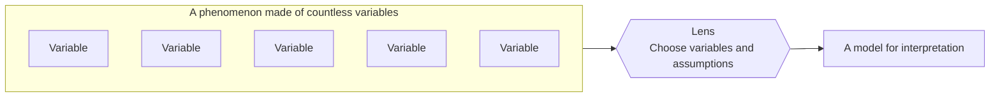
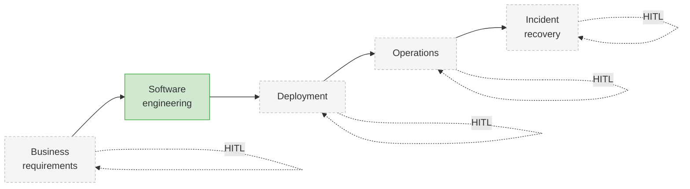
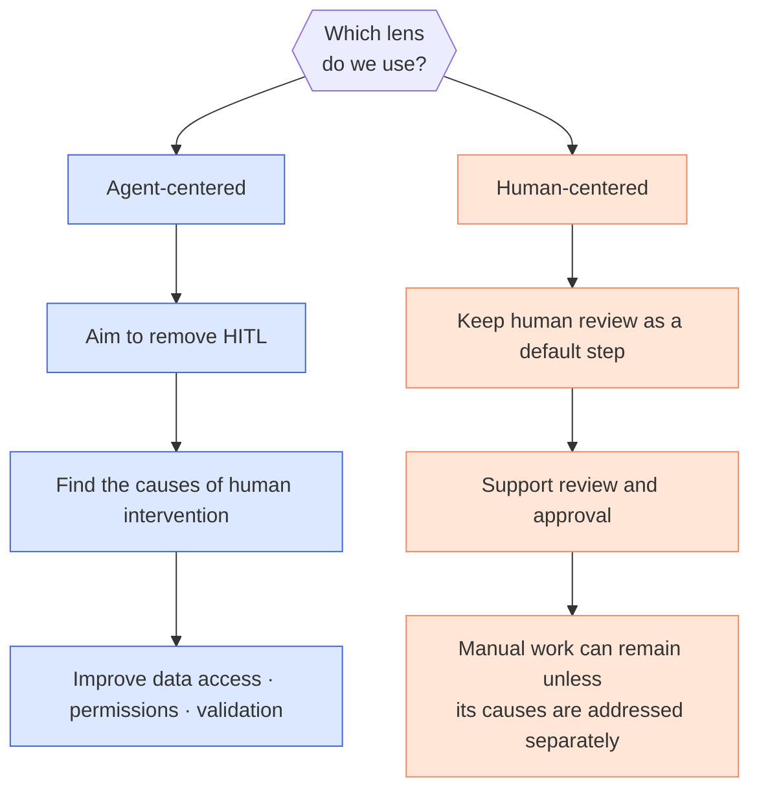

## TL;DR

- A lens makes explicit which variables we hold constant when interpreting a phenomenon.
- I view agentic engineering as moving toward the removal of recurring human intervention.

## 1. What is a lens?

Economics uses models to explain complex phenomena. One method is to **select the variables and relationships to examine while simplifying others or assuming they remain constant**.

We can find this way of thinking all around us.

MBTI is a familiar example.

MBTI describes people through sixteen combinations of four preference axes. What interests me here is the reduction of a complex subject to a few axes, rather than the accuracy of that classification. Another example that has been my favorite for several years is Kent Beck's 3X model.

It frames product development as exploring possibilities, expanding a validated opportunity, and extracting value from an established product, with a different strategy for each stage.[^5]

I call the perspective that chooses what to examine closely and what to simplify a **lens**.





Having a lens or not makes a striking difference when trying to predict what lies ahead.

It is especially helpful for adjusting the next prediction after one turns out to be wrong.
Without a lens, there is little to do except guess. With a lens, **the variables held constant are explicit, so we can retrace where the prediction went wrong.** Even a failed prediction becomes material for refining the lens.

## 2. Viewing agentic engineering through the HITL lens

There are countless lenses through which to interpret a phenomenon, and the same is true for the currently popular field of agentic engineering. There may be a cost lens, a UX lens, or a lens based on competition within the ecosystem.

Personally, I often use the **HITL lens** when looking at agentic engineering. Human in the loop (HITL) means a person intervenes during execution to judge or approve something. I look at *where that intervention remains and how it can be reduced*.

The reason I chose this lens over others is simple. **It explains the development so far with the fewest exceptions and also makes the direction ahead easy to explain.** I especially like it because I think Anthropic's moves can be explained through this lens.[^1]

In this post, I will call the perspective that seeks to remove humans from the loop **agent-centered**, and its opposite **human-centered**.

## 3. Using the HITL lens to relieve agent motion sickness

I think the hypersensitive reactions people have recently shown toward AI are a kind of **motion sickness** caused by interpreting agent-centered technology from a human-centered perspective.

From a human-centered perspective, experience tells us that we should not be moving this fast, so we unconsciously keep reaching for the brakes, whether emotionally or through our actions.

But agent technology is advancing too quickly and its effects are too disruptive for those brakes to work as expected, making it difficult to keep our thinking synchronized with what is happening.

The software development life cycle turns business requirements into code. In short, it is the compilation process for business requirements.[^4]

I interpret agentic engineering through the reduction of HITL in this process. OpenAI has published an internal experiment in building a product with Codex without humans writing the code.[^7] I can examine such attempts and the tools those teams produce through the same lens.

Personally, simplifying software engineering around HITL and deliberately ignoring the other variables allowed me to treat everything else as noise—or, since this is a lens, to leave it blurred. That relieved a considerable amount of the motion sickness.

## 4. Using the HITL lens to predict what comes next

Another use of this lens is **prediction**. If we closely examine where HITL remains in the current process, we can make a reasonable guess at the tools and technologies likely to appear next.

Across the flow from business requirements through software engineering, deployment, operations, and incident recovery, I have focused first on changes in **writing and validating code**.





Green marks the area where I have focused on automation changes, not a stage from which people have disappeared. Gray stages also have existing tools such as deployment automation. I use the picture to ask which human decisions remain in each stage.

Through this lens, I expect more attempts to automate recurring judgments in deployment, operations, and incident recovery alongside code writing. Development automation need not finish before those attempts begin.

A little later, I expect attempts to automate even **business-requirement analysis**, which today begins with a person and ends with a person.

## 5. What Lens Does Our Organization Wear?

If we define a lens as the perspective an organization uses to interpret phenomena and the direction in which it tries to move, we can identify that lens by watching its behavior rather than listening to what it says.

In my personal classification, OpenAI and Anthropic are leading examples of companies wearing an agent-centered lens. Google appears somewhat neutral, while AWS and Cursor look like leading examples of companies wearing a human-centered lens.

This is my impression of the products and working practices I have encountered. Tools and methods within the same company can handle human involvement differently, so I would not use it as a fixed classification of an entire company.

When examining this difference, we can also look at the work assigned to **AI Deployment Engineers (AI DEs)** and **Forward Deployed Engineers (FDEs)**. I want to look beyond the presence of a title to whether they can actually change data access, permissions, and work procedures.





A company wearing an **agent-centered lens** asks how to automate the HITL that remains today.

If people retrieve information for the agent, improve data access. If they act because permissions are missing, improve tools and permissions. If they review results because those results cannot be trusted, improve validation.

Domain experts and AI DEs or FDEs can do this work together. I try to read an organization's direction from how far those roles can change customer workflows and systems.[^2]

An organization wearing a **human-centered lens**, by contrast, always pursues an appropriate level of automation on the assumption that a person remains.

One risk in this approach is that human review can hide data and permission problems. Having a person handle difficult cases keeps operations running for now, but leaves that person necessary for the same reasons on the next task.

Of course, an organization can improve this foundation while retaining human review. Rather than deciding its direction from a job title or company name alone, I think it is better to examine **whether it is actually removing the causes of human intervention**.

> As an aside, I think FDE is currently the most self-destructive role. I can picture today's Solutions Architects, or SAs, shrinking substantially and being replaced by FDEs, only for the FDEs themselves to disappear a little later. This is pure speculation too, but there is a great deal more I could say about it.

Seen through this lens, the conclusion leans in one direction.

If lower model execution costs and better harnesses let us **finish more work with the same budget**, I think **the human-centered lens will ultimately be rejected, at least within agentic engineering**.[^6]

At some point, the rising curve of the side that began by removing people will overtake the ceiling of automation built around the compromise that a person will remain.

> Physical AI companies can actually be divided in roughly the same way.[^3]

## 6. Once You Choose a Lens, What Will You Do?

Finally, once you choose a lens, you need to decide **what to do with it** and begin moving.

If LLMs stop improving at their current level and ultimately fail to replace software engineering, what will I do?

> Artificial general intelligence, or AGI, capable of intellectual work across many fields, may never arrive. Even so, I think concentrating data and verification on the narrower task of software development can automate a substantial part of the work people perform. I want to distinguish general intelligence from automation of a particular workflow.

Either way, we cannot avoid learning agent technology.

Today's technology already allows more code writing to be delegated to agents. In the OpenAI experiment above, people still set goals, built the verification environment, and judged the results.[^7] A high proportion of generated code does not establish that design, validation, and operations have all been automated.

Conversely, if it is already settled that agents will eventually replace software engineering, what should I prepare now?

Everyone will have ideas that come to mind and choices they have already made. Even this thought experiment alone can produce many entertaining scenarios.

I also use this perspective to choose which technologies to learn next and what kind of team I want to work with.

## Conclusion

Grinding a lens—bringing some parts into sharper focus while intentionally leaving others blurred—is more enjoyable than one might expect. Any phenomenon contains so many variables.

More than anything, finding one plausible lens that explains what is happening reduces stress. (Cue Ki-young's head over a one-minute candlestick chart.)

We are usually stressed when **prediction is impossible**—that is also what causes motion sickness—and a good lens gives us some freedom from that stress.

It leaves room to think about a world and a current we cannot control. That space also gives us the courage to take the next action.

One downside of my current company is that everyone has different interests or serves different customers, so there is no one with whom I can have conversations like this. Even when I go out of my way to organize and explain my thoughts, many people disagree, so having the conversation only becomes tiring.

My goal is to change jobs around the end of the year. I hope either that my side projects go well enough for me to start a company on my own, or that I can work at a company with many people who see the world through a lens similar to mine.

I also started posting on LinkedIn because we live in an era when the messenger matters more than the message, and I wondered how I could increase my value as a messenger. It did not have much effect. (It is equally difficult for a capital-I introvert to survive online or offline.)

In an era when writing and code are cheap, a messenger's value seems to lie not in a few lines on a blog or LinkedIn, or a few lines of code on GitHub, but in the trail that person has created.

My trail so far has been unimpressive, but focusing on meaningful side projects and producing results from now on will be better than writing a few more lines like these.

---

[^1]: [Agentic Engineering and Transitional Technologies](/en/2026/05/11/direction-of-agentic-engineering.html).

[^2]: [The Next Evolution of Agents Will Come from Smarter Tools](/en/2026/05/27/agent-evolution-smart-edge.html).

[^3]: [Demystifying Harness Engineering](/en/2026/03/15/harness-engineering-beyond-context-engineering.html).

[^4]: [The Future Agentic App Engine](/en/2026/04/17/future-agentic-app-engine.html).

[^5]: Kent Beck, [The Product Development Triathlon](https://medium.com/@kentbeck_7670/the-product-development-triathlon-6464e2763c46) (2016). The original article introducing the 3X model of Explore, Expand, and Extract.

[^6]: [Why AI Adoption Should Not Start with Token Savings — The 3S Stages 1/2](/en/2026/06/15/organizational-ai-adoption-3s.html).

[^7]: OpenAI, [Harness engineering: leveraging Codex in an agent-first world](https://openai.com/index/harness-engineering/) — describes an internal product-development experiment without human-written code and the goal-setting, environment design, and review people performed.
