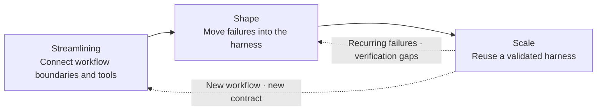
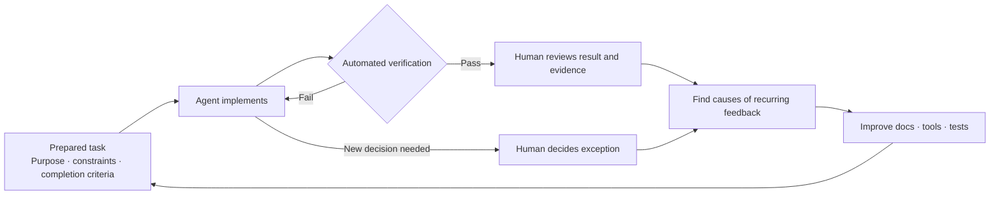

## TL;DR

- Early token savings can prevent investment in the harness.
- 3S separates the stages of connection, learning, and reuse.
- Investment and evaluation criteria should change by stage.

## Introduction

Two demands often appear together when organizations discuss AI adoption.

Employees are told to use AI more. At the same time, they are told to reduce token use and tool costs quickly.

Both demands are necessary. The problem is their order.

During the early work of connecting AI to a workflow, teams need to observe many failures, build evaluation cases and tools, and move repeated human decisions into rules. This process consumes not only tokens but also domain-expert time and engineering capacity.

If reducing usage becomes the goal from the beginning, people are likely to finish the immediate task with fewer tokens instead of building the harness. That is rational for the individual, but the same failure returns in the next task.

If experimentation grows without limits, however, review, rework, and maintenance costs also grow.

Rather than searching for one budget principle between these extremes, I think it is better to first identify **which stage the current workload is in**.

I divide those stages into `Streamlining`, `Shape`, and `Scale`. [Part 2](/en/2026/08/18/measuring-ai-adoption-ahead-lever-part-2.html) continues with how to evaluate each stage using AHEAD and LEVER.

After reading Kiro's Frontier Engineering principles and its guide for managers, I expanded what teams need to prepare and operate within each stage. Its suggestion to start with a small workflow in one team, share what works, and keep maintaining it was particularly useful.[^6]

## 1. Tokens are only part of the total cost

Token prices are immediately visible.

But turning a business requirement into something that reaches customers also requires tool execution, retries, human review, continuous integration (CI) to build and test changes automatically, deployment, and incident response.

When AI produces code faster, the review queue can grow longer. If cognitive load removed from implementation moves into review, token cost may look low while total delivery cost remains unchanged.[^1]

That is why token use is dangerous as a standalone goal.

The question should be whether the total input required to deliver a feature of the same quality to customers has fallen. This is also why I argued in the [CTS-SW post](/en/2026/08/14/cts-sw-software-delivery-cost.html) that code volume needs to be replaced by a connection between customer-delivered software and total cost.[^2]

It is equally unrealistic to expect CTS-SW, the total delivery cost per unit of software, or short-term return on investment (ROI) to improve at the beginning of adoption.

Cost comes first while teams connect data and tools and move failures into evaluations and guardrails. Until that investment is reused by later workloads, it can look inefficient when judged by the numbers alone.

## 2. Teams need room to build the harness

A harness is broader than giving an agent a long prompt.

It is closer to an environment that combines the data and tools required for a workflow, quality criteria, tests, permissions, observability, and exception handling so the agent does not repeat the same failure.[^3]

A harness is not completed in one pass.

When the agent fails, examine the cause and add an evaluation case. When the same review comment repeats, move it into a test or architecture rule. When a human makes the same exception decision every time, define the required behavior and data formats as a contract, and specify when the agent should stop and ask a human to decide.

The result of spending tokens in this process must remain available to the next execution.

Using many tokens merely to finish the current task is different from using them to reproduce a failure and update the harness. The latter can reduce review and rework in future tasks.

The following figure is a conceptual illustration of that relationship, not a measured result.

On the left, the team lacks enough room to begin exploration and validation. On the right, experiments unrelated to business goals and maintainable outputs both increase.

The appropriate point depends on the risk and complexity of the workflow and the current maturity of its harness. Even so, I think it is clear that early investment and operational optimization should not be evaluated by the same standard.

Making room for this work is also a manager's responsibility. If a team is asked to improve tests and tools while maintaining its previous feature output, people will prioritize the feature work on which they are evaluated.

I would choose the first workflow together with a time allocation, budget, and review date for harness work. At that review, examine which tools and evaluation cases remain and how repeated interventions have changed. This gives learning room without keeping ineffective experiments running indefinitely.

## 3. Divide adoption into the 3S stages

Kent Beck's 3X model divides product development into Explore, Expand, and Extract and argues that each stage requires a different strategy.[^4]

Applying that idea to AI adoption, I divided the process into three stages: `Streamlining`, `Shape`, and `Scale`.

3S is not a validated standard model. It is a lens I propose for changing investment and evaluation questions according to the state of a workload.





During Streamlining, build an environment in which the agent can complete the workflow end to end.

During Shape, feed real failures and review feedback back into the harness.

During Scale, reuse the validated harness for other requirements to reduce total delivery cost and time.

These stages are not one maturity rating for the entire organization.

Within one team, order-cancellation automation may be in Scale while a newly started settlement workflow is in Streamlining. An existing workload also returns to an earlier stage when its data contract or risk criteria change.

## 4. Streamlining — connect the workflow so it can finish end to end

Streamlining starts with the workflow, not the model.

I would begin with a small workflow in one team whose outcome and owner can be clearly defined. Even when the workflow crosses several systems, the initial scope and completion criteria can remain narrow.

Suppose we want to automate order cancellations.

The cancellation request may live in the order system, the payment reversal may go through the payments team's API, and the refund policy may live in a customer-support tool. If every team simply wraps its system in Model Context Protocol (MCP), a standard for connecting agents to external tools, the agent receives several API fragments but may not know the order or permissions required to combine them.

First, lay out the data, rules, permissions, and responsibilities required for the order-cancellation workflow.

Event Storming maps events in a workflow to help identify its flow and bounded contexts: areas where the same terms and rules apply.[^5] Instead of assuming that the organization chart matches domain boundaries, it reveals what must be read and changed together.

Then connect the required reads and mutations through explicit contracts.

There is no need to merge all data into one place. The agent only needs to check the order state, decide whether cancellation is allowed, and issue the refund within its authorized scope. Least privilege, audit records, and the conditions for handing work to a human should also be defined here.

The implementation task also needs enough detail for an agent to execute it. Suppose the first scope is cancellation before shipment. Include the eligible order states, how duplicate requests should behave, the result to show on completion, and the tests to run. For an existing service, examine its current behavior first and distinguish what must remain from what should change.

Keep design decisions and instructions for running and testing the system in the repository so the next session can find them. **Reducing the information available only by asking a colleague** is part of connecting the workflow.

Permissions need more than written prohibitions. Kiro's developer guide recommends enforcing limits on file, tool, network, and credential access.[^7] In this example, permission to verify cancellation in development and test environments should be separate from permission to refund real customers.

The questions in this stage are closer to readiness than performance.

- Are the workflow's start and completion conditions clear?
- Can the agent access the required data and tools?
- Are documents and tests available to check existing behavior and completion criteria?
- Are permission and responsibility boundaries connected?
- Is there a baseline for the current manual workflow's time, quality, and cost?

Without these conditions, failures observed during Shape are difficult to classify as model problems or environment problems.

## 5. Shape — move recurring decisions into the harness

During Shape, give the connected workflow to the agent and observe its failures.

Instead of aiming for high autonomy from the beginning, find which decisions repeat and where humans return to reading the code.

To observe failures, the agent must be able to verify its work. If a human has to run tests and paste errors back, each iteration waits for that person. Kiro recommends giving agents access to local tests, browser verification, and test substitutes for external services.[^8]

For the cancellation feature, let the agent test a normal cancellation and a duplicate request, read the failure, make a correction, and rerun the same test. Passing in a test environment does not establish that integration with the real payment system works. The results should identify what was verified and in which environment.





If reviewers repeatedly point out the same import direction, move it into an architecture test. If the same requirement must be confirmed every time, turn it into a contract and test case. If missing evidence forces a human to read the entire codebase, require the next execution to leave verification results for each contract.[^1]

In my view, the output of Shape is not an automation rate.

It is a harness that detects the same failure faster when it returns or prevents it entirely. This stage also separates decisions that can be repeated from high-risk exceptions instead of trying to eliminate every human judgment.

Domain experts and harness engineers need to work together during this stage.

Domain experts define what a correct result is and which exceptions are dangerous. Harness engineers move that knowledge into evaluation cases, tools, contracts, and guardrails. Policies that require security or legal judgment remain owned by those organizations.

Harness engineers do not need to remain permanently embedded in every domain.

Early on, they can establish the shared foundation and feedback loop. Once the domain team can classify failures and repair the harness directly, it is better for the harness engineer to move to the next workload. For the harness to become an organizational capability, the domain team must take over operational ownership.

Meanwhile, managers should prepare both the next tasks and time to review the results. Resolve missing purposes and prerequisite decisions before assigning work, and reduce concurrent tasks when review falls behind. Maximizing agent runtime alone can leave the team with a growing pile of unfinished work.

## 6. Scale — reuse the earlier investment for the next requirement

During Scale, a team does not rebuild the environment and evaluation criteria from scratch for every new requirement.

It reuses validated data contracts, external-system connectors, tests, access controls, and execution records. The agent should complete normal paths through the agreed verification and bring new contracts or unverified risks to a human.

When expanding to another team, separate shared rules from workflow-specific ones instead of copying every rule from the original team. A check for credentials accidentally included in code can be shared, but an order-cancellation policy cannot simply be applied to settlement work. Verify quality and permission conditions in the new workflow before widening its scope.

Shared assets also need an owner. I would have an early-adopter team or support team maintain common tools and examples, while each domain team maintains its own policies and evaluations. Without people and time allocated to incorporating other teams' feedback, the original rules can be left unchanged.

At this point, the earlier investment can be examined as a reduction in total delivery cost.

Look not only at code generation time but also at the time required for a requirement to reach customers, human review and waiting, deployment, and operating cost. In this stage, a metric such as CTS-SW can help track the trend within the same team.[^2]

Scale does not mean cost reduction alone.

It may allow the same number of people to handle more customer requests, reduce incident risk, or automate small workflows that were previously uneconomical. The workload's definition of value should be chosen when the work begins.

I also do not think decisions to replace a model or agent should be made in this stage without evaluation.

I could not move for a while because a harness I had built around Cursor did not work unchanged in Claude Code. When the model and tools change, context usage and failure patterns can change as well.

Separating contracts and evaluation cases that should remain common assets from tools tailored to a particular agent makes it possible to compare the system before and after replacement using the same standard.

Kiro also recommends reassessing whether rules and tools created to compensate for an older model are still needed when a new model arrives.[^9] Preserving failure cases, removing unnecessary rules, and verifying again should be included in the operating cost of Scale.

## Conclusion

Token use may increase during the early stages of AI adoption.

Connecting data and tools, reproducing failures, and moving repeated human decisions into the harness all create costs before savings appear.

That does not mean early investment should be unlimited.

I would begin with a small workflow in one team and agree on an investment period and the results to examine. Expand once that team can address recurring problems itself, and keep allocating time to maintain the tools it shares.

3S is **a lens for deciding what to invest in and what to check in the current workload**. The stage names become useful as an adoption method when they change how work is assigned and evaluated.

The next post, [part 2](/en/2026/08/18/measuring-ai-adoption-ahead-lever-part-2.html), explains how I use AHEAD to examine harness learning and review burden during Shape, and LEVER to examine total delivery cost and value capture during Scale.

---

[^1]: [Why Does AI-Generated Code Make Review Harder?](/en/2026/08/18/ai-coding-review-cognitive-load.html) — examines how cognitive load removed from implementation can move into review and how contract-based review can narrow that burden.

[^2]: [Did AI Coding Tools Actually Cut Development Cost?](/en/2026/08/14/cts-sw-software-delivery-cost.html) — explains CTS-SW as a connection between customer-delivered software and total delivery cost rather than generated code volume.

[^3]: [Demystifying Harness Engineering](/en/2026/03/15/harness-engineering-beyond-context-engineering.html) — explains the scope of a harness that combines context, tools, evaluations, and guardrails.

[^4]: Kent Beck, [The Product Development Triathlon](https://medium.com/@kentbeck_7670/the-product-development-triathlon-6464e2763c46) — the 3X model of Explore, Expand, and Extract.

[^5]: [Demystifying Event Storming](/2020/12/10/demystifying-event-storming.html) (Korean) — explains how to identify domain events and boundaries from the real workflow.

[^6]: Kiro, [Frontier Engineering Teams](https://kiro.dev/topics/frontier-teams/) — an adoption pattern that starts with one team and proceeds through experimentation, expansion, and sustained operation. This is separate from 3S; its reported timelines and results are not targets for every team.

[^7]: Kiro, [Trust the boundaries, not the agent](https://kiro.dev/topics/frontier-engineering/trust-the-boundaries/) — access limits and automated checks for autonomous execution.

[^8]: Kiro, [Give agents a fast feedback loop](https://kiro.dev/topics/frontier-engineering/fast-feedback-loop/) — investing in tests and verification environments that agents can use directly.

[^9]: Kiro, [Continuously tune your agent setup](https://kiro.dev/topics/frontier-engineering/tune-your-setup/) — learning from repeated interventions and reassessing rules and tools when models change.
