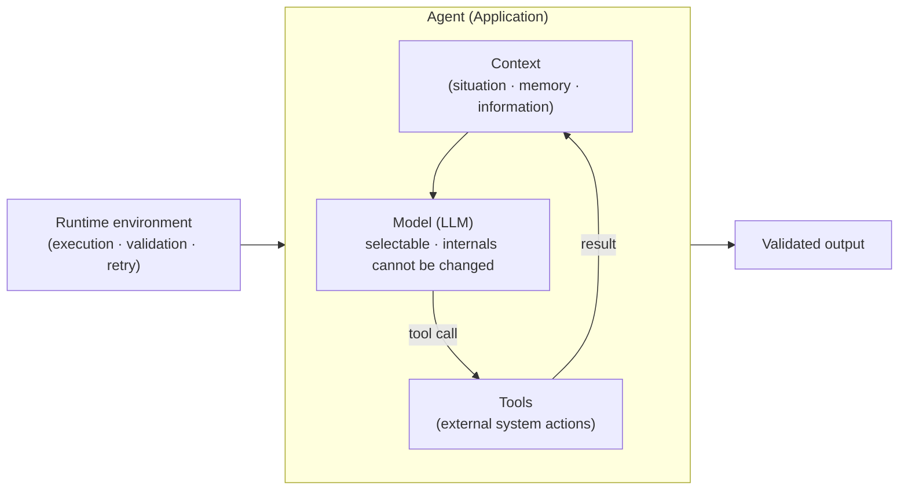
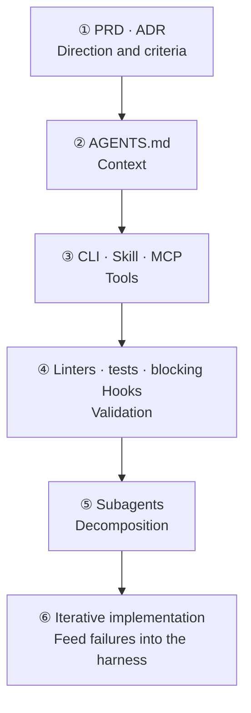
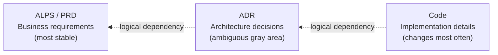
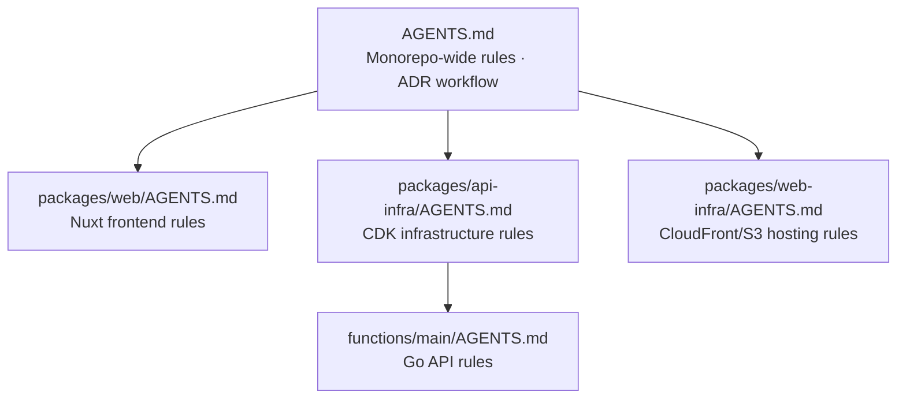
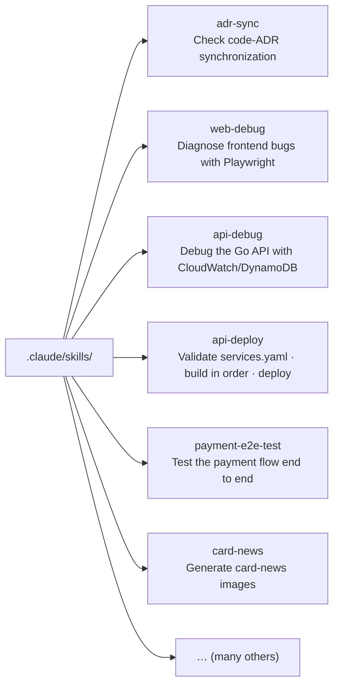
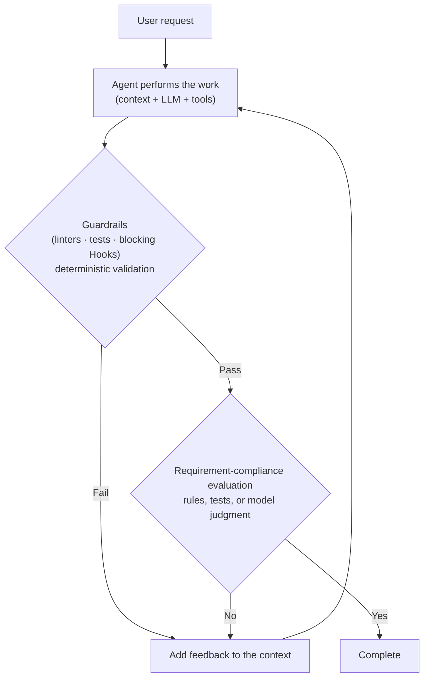
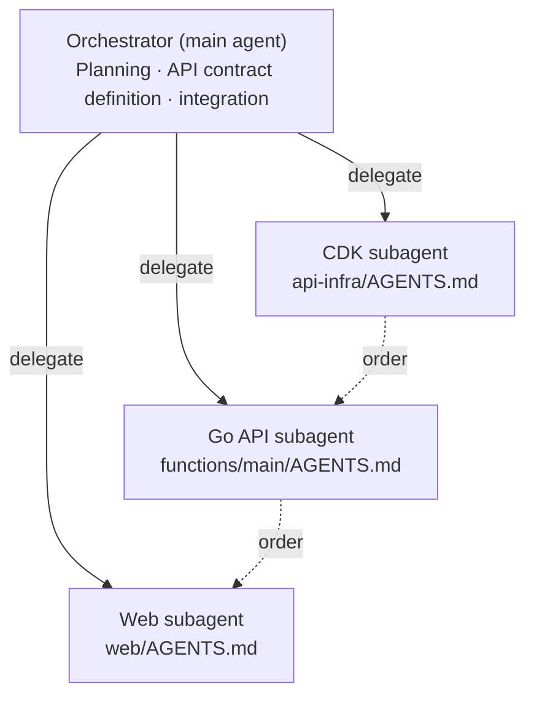
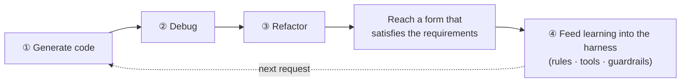
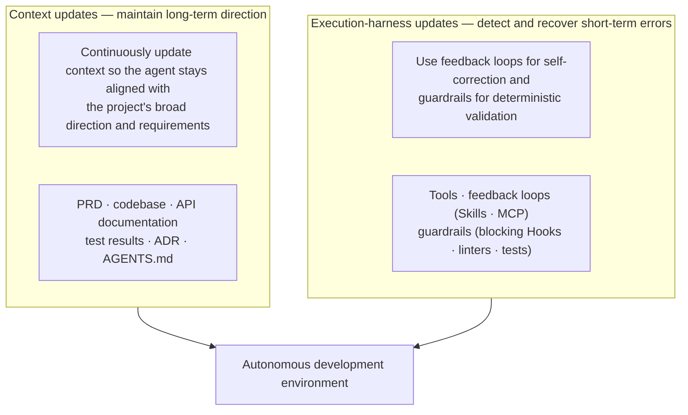

## TL;DR

- A harness increases an agent's autonomy.
- Build the minimum foundational harness before work begins.
- Feed failures from each task into the next harness layer.

## Introduction

Earlier posts explained what harness engineering is[^1] and why it is necessary.[^2]

The argument was that context provides the broad direction while the harness recovers errors during each execution cycle, allowing an agent to complete long-running tasks.

After explaining the concept, however, I always hear the same question.

**"So what do I actually do, and how?"**

The word harness sounds grand, but when you sit in front of an empty directory, it is difficult to know where to begin.

This post describes the order in which I built harness layers around [EncBird](https://encbird.com), a GenAI English-learning service, and [PixelBank](https://pixelbankstudio.com), an AI image-editing service, both of which I build and operate alone.

I used the same approach to build agent tools such as [ALPS Writer](https://github.com/haandol/alps-writer-plugins) and [PPT Generator](https://github.com/haandol/ppt-generator).

All of these projects share the same foundation: an Nx monorepo with an ADR-first workflow. I will therefore use EncBird as the main example and mention other projects when useful.

The EncBird harness was not the result of designing the entire structure in advance.

Whenever the agent repeated the same mistake or inconvenience, I moved the cause into a rule, tool, or validation mechanism. The harness grew into its current form through that process.

## 0. Starting point: control the execution environment around the model

Before discussing the sequence, let us establish the reference point.

The core components of an agent application are **model + context + tools**. During actual execution, a runtime environment connects and repeats these components.





We can select or replace the model, but we cannot directly change how it works internally. What we mainly control is **the context, the tools, and the runtime environment in which they operate**.

This post uses the following scope for harness engineering.

> **Without directly changing the model, use controllable context, tools, and the runtime environment to automate code generation while ensuring that the result still reflects the original business requirements.**

Context engineering supplies broad direction and decision criteria. The short-cycle harness automates validation and retries. In this post, I use harness to mean the broader execution environment that combines both.[^3]

The actual build order looks like this.





You do not complete all six stages from the beginning. Before the first task, establish direction and the minimum context and validation mechanisms. Then add rules and tools whenever actual work reveals a failure.

Let us follow this sequence through an empty project, one layer at a time.

## 1. Do not start empty-handed — establish direction with a PRD and ADR

I said we would start an agent in an empty project, but that does not mean starting completely empty-handed. When creating a new feature, the prompt may look like this.

```
$ claude
> Add refunds to the payment module.
```

The agent will do something.

But without knowing what service it is building, what the refund policy is, or which constraints apply, it produces code in whatever direction seems plausible.

A human has to stay beside it, inspect every line, and interrupt whenever something looks wrong. Without a harness, the human fills every gap.

That is why, **before** asking for code, I first create a direction the agent can follow.

There are two parts.

**PRD — describe what to build without ambiguity.** The main reason an agent drifts is that business requirements exist only in a person's head.

I therefore begin with a PRD using a tool such as [ALPS Writer](https://github.com/haandol/alps-writer-plugins).

ALPS, or Agentic Lean Product Spec, is a PRD format designed so **an agent can write code without ambiguity**, unlike a traditional PRD that expects a human reader to fill gaps through intuition.

Instead of asking a human to begin from a blank page, the agent asks questions across nine sections and the human answers them.

It also treats "what will not be built," or Out of Scope, as a first-class section, making explicit what the agent **must not do**.

Fixing the question flow also reduces the number of items that different authors accidentally omit.

**ADR — record decisions about how to build it.**

If a PRD defines "what," an ADR, or Architecture Decision Record, captures decisions about "how."

ALPS Writer uses `/feature-to-adr` to transfer PRD features into ADR drafts. From there, `adr-writer` runs a cycle in which `/adr-new` records a new decision and `/adr-impl` implements it.

The rule I maintain is a **one-way dependency from PRD to ADR to code**.





Code is written to satisfy the ADR, and the ADR is written to satisfy the PRD.

When the inner layer, the PRD, changes, the outer layers, ADRs and code, follow. The reverse does not happen.

If every code refactoring forces an ADR rewrite, the ADR was holding implementation details.

That is why an ADR records why a decision was made and how alternatives were compared rather than storing file paths and code fragments.

The PRD and ADR become the reference point for the rules and validation mechanisms added later.

The "correct form" enforced by AGENTS.md rules and guardrails is judged against the direction established by the PRD and ADR.

Without a written direction, every later automation runs without knowing what it is supposed to automate toward.

It is easy to skip this stage and ask for code immediately.

That may be fine if you do not intend to delegate the entire development process to an agent.[^1]

If you want to increase delegation, however, writing the direction first is the starting point.

Once the agent begins working, sources of irritation gradually appear. That irritation becomes the material for the next layer.

## 2. After the third repeated correction, open AGENTS.md (context)

Patience usually wears out first in moments like these.

- "Our project uses pnpm. Stop installing things with npm."
- "I told you to write commit messages in Korean."
- "I just said API handlers belong under `handlers/`."

The same correction is typed into the chat every time. The conversation then disappears.

When the next session begins, the agent repeats the same mistake like **a new hire arriving with no memory of the previous shift**.[^1]

**If you have made the same correction about three times, that is a signal to put it in a file instead of typing it into chat.** This is the first harness layer: `AGENTS.md`, or `CLAUDE.md`.

Writing every best practice from the beginning usually creates a pile of rules that are never used.

Start with only the minimum rules, then add one line whenever the agent deviates in the same way.

The root AGENTS.md in EncBird grew this way.

It now contains entries like the following, each one a trace that says, "the agent caused an incident here once."

```markdown
## Agent Work Protocol
### Principles
- Focus on one feature/bug at a time
- Code must be buildable and pass lint at session end
- Write descriptive commit messages so the next session can
  understand progress from `git log` alone
- Prefer early return: handle errors and edge cases first ...

## Deployment & CI/CD
- A merge to `main` is itself a web deploy, so the agent never
  pushes/merges to `main` without explicit user confirmation.
```

The final line—"merging into `main` is a deployment, so do not merge without human confirmation"—was added after the agent casually merged into `main` and triggered an unintended deployment.

As a project grows, one AGENTS.md is no longer enough. EncBird is an Nx monorepo whose packages use completely different toolchains, so I also divided context hierarchically.





The root contains only shared agreements. Each package's AGENTS.md owns its specific build, lint, and convention rules.

When the agent changes the web package, it reads only the web AGENTS.md. When it changes Go, it reads only the Go AGENTS.md.
This keeps the context from becoming bloated and reduces the chance of applying rules from the wrong package.

At this point, the agent deviates less from the project's broad direction. This is the domain of context engineering. Soon, however, context alone reaches a wall.

## 3. When the agent cannot do something, give it a tool (tools)

AGENTS.md provides direction, but some tasks reveal things the agent fundamentally **cannot do**.

- It needs to inspect the database schema but has no access, so it guesses while writing code.
- It needs to inspect deployment status but cannot read the logs, so it ends with "it probably worked."
- It repeatedly calls the payment integration through the wrong interface.

An agent's input and output consist only of text, or tokens.

To touch the external world, it needs a gateway called a **tool**.[^4] The second layer is therefore giving the agent tools.

CLI, Skill, and MCP are different ways to provide tools. I recommend starting lightly and moving to the next stage only after the need becomes clear.

**① Runtime CLI — the lightest and usually the most powerful.** The most powerful tools are often CLIs that are already installed, such as `gh`, `aws`, and `psql`.

Give the agent a shell and it can use them directly. No separate integration is required. In EncBird, most deployment and inspection tasks are handled by calling CLIs such as `aws --profile encbird`, `cdk`, `gh`, `nx`, and `pnpm` directly from the shell.

**② Skill — turn a procedure into a file.** As tools multiply and their usage becomes more complex, repeatedly explaining the procedure becomes tedious and consumes the context window.

A Skill moves the tool-use procedure into an external file, `SKILL.md`, and loads it dynamically only when needed. More than 20 Skills have accumulated under EncBird's `.claude/skills/`.





These were not created all at once either.

- "It gets the build order wrong every time it deploys" → `api-deploy` Skill
- "I explain the same debugging procedure every time it fixes a frontend bug" → `web-debug` Skill

Whenever a repeated procedure appeared, I separated it and fixed it into a file.

**③ MCP — standardize the tool interface and contract.** Some areas cannot be handled by a shell CLI or a procedural document.

This happens when an agent must communicate with an external system in a structured way or when several tools and agents need to share the same interface.

MCP standardizes the tool's input, output, and invocation contract. An MCP server can run as a local stdio process or as a remote service, so it does not necessarily have to be an independent server outside the agent process.

It becomes easier to reuse the same tool across several agents, and a remote service allows centralized access control and deployment. The cost of operating and debugging the server must also be considered.[^5] EncBird's `.mcp.json` contains integrations that would be cumbersome to build directly.

```json
{
  "mcpServers": {
    "tosspayments": { ... },   // payment integration guide
    "cloudwatch":   { ... },   // log inspection
    "analytics-mcp":{ ... },   // GA4 analytics
    "pdf-reader":   { ... }
  }
}
```

My order is **CLI → Skill → MCP**.

In many cases, giving the shell a few CLIs is enough. I often see teams spend time running an MCP server before confirming that they need one. Tools can be added after the need is proven.

Now the agent knows the direction through context and has hands and feet through tools. One problem remains: the output is still difficult to trust.

## 4. When you think, "the same mistake again?" add a guardrail (deterministic validation)

Even with tools, an agent does not perfectly satisfy every requirement in one pass.

It therefore needs a **feedback loop** that checks whether the result matches the requirements and asks for another attempt when it does not.

A feedback loop is not inherently nondeterministic. Some checks, such as linters and tests, return the same result for the same input, while others use a model to make a nondeterministic judgment about requirement compliance.

The problem appears when even mechanically verifiable items are left to model judgment. Instead of asking, "Did this pass lint?" run the actual linter.

Even a capable model forgets the original rules after moving through the context window several times.





The third layer is therefore **guardrails**: **deterministic validation mechanisms**.

Instead of relying on nondeterministic LLM judgment, they mechanically force a pass or block.[^1] EncBird combines this deterministic validation with prompt-based procedural guidance.

**Deterministic validation at commit time (git pre-commit hook).** The hook selects staged files by package. For web files, it runs ESLint and Prettier; for Go files, it runs golangci-lint automatically.

Whatever code the agent writes, a commit is blocked if it does not pass the linter.

```bash
# scripts/pre-commit (abridged)
web_files=$(echo "$staged" | grep -E '^packages/web/.*\.(vue|ts)$')
if [ -n "$web_files" ]; then
  echo "$web_files" | xargs npx eslint --fix
  echo "$web_files" | xargs npx prettier --write
fi
go_files=$(echo "$staged" | grep -E 'functions/main/.*\.go$')
if [ -n "$go_files" ]; then
  (cd packages/api-infra/functions/main && golangci-lint run ./...)
fi
```

**Procedural guidance at prompt time (Claude Code Hook).** EncBird has one `UserPromptSubmit` Hook.

Whenever a user submits a request, it injects the following instruction into the context: "If this is a new feature or behavior change, do not start with code. Inspect or write the ADR, or architecture decision record, first."

```json
// .claude/settings.json
{
  "hooks": {
    "UserPromptSubmit": [{
      "hooks": [{ "type": "command",
        "command": "$CLAUDE_PROJECT_DIR/.claude/hooks/adr-first-reminder.sh" }]
    }]
  }
}
```

I added this Hook because **the agent repeatedly skipped design and rushed straight into code**.

Instead of asking "please design first" every time, the environment automatically inserts that instruction on every turn.

Prompt injection alone does not mechanically enforce the procedure, however. The model can miss the instruction. If a procedure must never be skipped, add a separate validation mechanism that checks for the ADR and blocks execution when the condition is not met.

It is also useful for a validation failure to explain how to fix the problem.

The OpenAI Codex team used this technique while building Codex itself. Instead of reporting only "rule violation," custom linters included guidance to use one pattern instead of another, allowing the agent to read the error and correct itself.[^6]

Do not leave rules that can be judged automatically, such as linter and test conditions, only in the prompt. Enforce them through the environment so violations break the build or block the commit.

## 5. When the context becomes polluted, divide and delegate the work (subagents)

At this point, one agent can work fairly reliably.

As the task grows longer and more complex, however, a new problem appears: **context pollution**.

Long tasks fill the main conversation with all kinds of material.

Hundreds of log lines printed during debugging, dozens of files read during exploration, and abandoned intermediate approaches all accumulate. The important broad direction becomes buried in this noise.

When the context fills, compaction occurs, and important information can be lost during that process.

The fourth layer is dividing and delegating work to **subagents**.

EncBird is a monorepo whose packages use completely different toolchains. I therefore use a structure in which **the main agent acts as an orchestrator and delegates package-specific work to subagents**.





The orchestrator (1) reads the ADR and defines the scope, (2) **first** defines interfaces such as endpoints, types, and event payloads for work spanning packages, (3) delegates the contracts and constraints to each subagent, and (4) reviews and integrates the combined changes.

Each subagent **reads only its package's AGENTS.md, runs commands only within its own directory, and does not casually copy patterns from another package.** Work proceeds in dependency order: CDK → Go API → Web.

The noise from dozens of files examined while working on the Go API is discarded with the Go subagent's context. The orchestrator's context remains clean, holding only the broad direction and each subagent's conclusion.

PixelBank uses Python and FastAPI rather than Go for its backend, so its subagent structure differs accordingly. The foundation remains the same: packages with different toolchains are separated into subagents with their own context, tool, and guardrail boundaries.

Dividing roles alone does not create subagents.

As discussed in an earlier post,[^2] changing only the prompt to say "you are the reviewer" or "you are the tester" leaves every role dependent on the same context and tools.

In EncBird, each subagent uses its package's AGENTS.md and its own lint and build commands. Context, tool, and guardrail boundaries must all be divided before the noise read in an earlier stage can be discarded.

This is why I put subagents last.

If one agent cannot work reliably, adding several agents merely combines unstable units into a more unstable system.[^2]

Build context, tools, and guardrails first, then divide the work across subagents.

## 6. Iterative implementation: preserve each failure in the next harness

Once stages 1 through 5 establish direction and the basic harness, iterative feature implementation begins.

The agent at this stage works with substantial autonomy. In both the case where Claude Code wrote 90% of its own code and the case where Codex wrote one million lines without manually written code, the teams built tools and validation environments around the model.[^6]

As the model changes, the codebase grows, and new requirements arrive, the agent finds new ways to stumble. Each time, add another layer.

The PRD and ADR, foundational context, and minimum validation mechanisms should exist before work begins. The following cycle feeds lessons from actual work back into the existing harness.





Code generation, debugging, and refactoring eventually reach a form that satisfies the requirements.

Then feed the newly discovered condition into the harness so the agent does not repeat the same mistake.

In other words, turn the "correct form" discovered through this round of debugging and refactoring into a rule in AGENTS.md or a guardrail such as a linter or test.

Without this step, the same debugging and refactoring return every time.

Repeating it reduces the same debugging and refactoring in the next request.

Harness updates can be divided into two types by time horizon.[^1]





**Context updates** operate over a long horizon.

Keep the PRD, ADRs, AGENTS.md, and codebase current so that even during a multi-day task, the agent does not drift from the project's broad direction.

Stages 1 and 2 belong here. **Execution-harness updates** operate over a short horizon. During each execution cycle, tools perform the work, feedback loops drive correction, and guardrails provide deterministic validation so short-term errors do not accumulate. Stages 3, 4, and 5 belong here.

Context updates maintain long-term direction, while execution-harness updates reduce errors in each run.[^1]

EncBird's AGENTS.md describes the ADR-first feedback loop this way.

> Run fast cycles and improve the ADR on every pass — **do not try to write the perfect ADR at the beginning.**

- If the same correction repeats → add one line to AGENTS.md
- If the agent cannot perform a task → add a tool (CLI → Skill → MCP)
- If the same mistake returns → block it mechanically with a guardrail (blocking Hook, linter, or test)
- If the context becomes polluted → divide the work across subagents

Moving repeated decisions into the harness this way lets people spend time checking business requirements and exceptions rather than the entire implementation process.[^7]

## Conclusion

The EncBird harness also began with a minimum PRD, ADRs, and AGENTS.md.

Whenever the agent made a mistake, I added a rule. Whenever it could not perform a necessary task, I added a CLI, Skill, or MCP tool. Repeated mistakes became pre-commit checks and Hooks, and only after the context grew bloated did I divide work across subagents.

There is no need to build this entire structure from the beginning. Establish the basic direction and validation mechanisms, then preserve only the problems that actually repeat during work in the next harness layer.

If you resolve a recurring mistake within one session, do not end there. Finish by entering the following instruction.

`Analyze the cause of the change we just made, then update AGENTS.md and the documentation so it does not recur.`

The cause and solution you just discovered must remain in a file if you want the next session to avoid the same mistake.

---

[^1]: [Demystifying Harness Engineering](/en/2026/03/15/harness-engineering-beyond-context-engineering.html).
[^2]: [Multi-Agent Without a Harness Is Just Context Engineering](/en/2026/03/31/multi-agent-without-harness-is-just-context-engineering.html).
[^3]: [Context Engineering — Static Context and Dynamic Context](/en/2026/03/11/context-engineering-static-vs-dynamic.html).
[^4]: [The Value of Developers Who Understand the Business in the Age of Agentic Development](/en/2026/03/13/agentic-dev-business-aligned-code.html).
[^5]: [What to Consider Before Building an MCP Server](/en/2026/03/02/considerations-before-developing-mcp-server.html).
[^6]: [OpenAI — Harness engineering: leveraging Codex in an agent-first world](https://openai.com/index/harness-engineering/) (2026.02.11) / [Anthropic — Effective harnesses for long-running agents](https://www.anthropic.com/engineering/effective-harnesses-for-long-running-agents).
[^7]: [Agentic Engineering and Transitional Technologies](/en/2026/05/11/direction-of-agentic-engineering.html).
