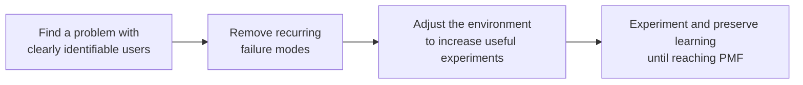

## TL;DR

- Failure modes repeat, while paths to success depend on context.
- Increase the number of experiments that produce customer learning.
- Use AI to lower the cost of useful experiments.

## Introduction

Years ago, I ran a business and shut it down after four years because of several problems. Fortunately, I had no debt, and I think about KRW 34,100 remained in the bank account.

After it failed, I joined a startup near my home. That company grew from eight people to 50 in less than two years.

I had been fairly calm and did not feel especially defeated when my own business failed. Only when the company I had joined became a major success did the sense of loss finally hit me.

## 1. I started by retracing why the business failed

Afterward, I revisited every important decision I had made and analyzed why the business had failed. I was able to form several hypotheses.

They sounded like this: next time I start a business, I should do it this way. Or if these conditions are not met, I should not start one at all.

When I belatedly began studying startups, I also realized that I had committed many of the mistakes Y Combinator describes as causes of failure.

The message I repeatedly found in YC's content was similar: **doing this makes failure more likely, so avoid it.**

I had the same impression while watching restaurant consulting programs. Businesses in the same domain seem to encounter recurring failure modes.

I therefore came to think that, whatever business I start, it is better to identify and remove the recurring failure modes in that domain before exploring a path to success.

## 2. Failure contains little information about success

Looking back on my business and many other cases led me to the following hypothesis.

**Every successful business follows a different path, but failing businesses share recurring patterns.**

This is less a proven law than a personal lens I want to use for my next business.

Seen through this lens, the information gained by analyzing failure differs from the information required for success.

Analyzing why something failed can teach you how not to fail for the same reason next time. It does not, by itself, teach you how to succeed.

Failure modes are relatively easy to generalize into a checklist. A path to success depends on the customer and market, so I think it has to be discovered through direct experimentation.

## 3. So I increase the number of experiments that produce customer learning

If the path to success cannot be fixed in advance, one important variable we can increase directly is **the number of attempts**.

An attempt here does not mean starting more arbitrary work. It must be **an experiment that leaves information about the customer, regardless of whether its immediate result succeeds or fails**.

An experiment that reveals what customers want, what they will pay for, or what they will completely ignore narrows the direction of the next attempt even when it fails. These useful experiments are what I want to increase.

The founder of Toss makes the same point in his PO lecture series.[^2]

Founders often feel strongly convinced by the problem they have chosen. Changing the problem itself can therefore be a difficult decision to accept.

Changing **how the problem is solved**, however, is much easier to accept. That leaves room to move.

I do not think the solution method has to remain fixed to the first idea either.

Even if a founder discovers a problem before anyone else, that does not guarantee they also know the best solution.

The first method that comes to mind is unlikely to be the answer. The method must therefore remain replaceable.

## 4. That requires making the environment experiment-friendly first

Kent Beck's 3X model provides a framework for distinguishing the stage in which experimentation matters.[^1] It divides a business into Explore, where valuable ideas are found cheaply; Expand, where validated ideas are grown; and Extract, where efficiency is maximized.

Applied to Explore, this view makes it important to first build **an environment that allows more experiments to produce customer learning with limited resources**.

To increase the number of useful experiments, adjust the environment so that each experiment costs less instead of relying on determination alone.

For example, whenever someone asks me about starting a side project, the first thing I ask is how long their commute takes.

If they start a side project without first changing surrounding conditions such as the commute and preserving some energy, they eventually burn out and quit.

Or they somehow finish building it, but cannot endure the slightly tedious release process that follows and never launch it at all.

That is why changing the environment so enough energy remains to sustain experiments comes before resolving to run more of them.

## 5. The flow looks like this

Combining the argument so far, I think the ideal flow might look like this.





1. Find a problem with clearly identifiable users.
2. Remove recurring failure modes.
3. Adjust the environment to support many useful experiments.
4. Keep experimenting and preserving customer learning until reaching PMF.

This is because it is difficult to determine in advance how to turn the problem I found into a successful business.

Even a failed experiment narrows the next experiment when it leaves the knowledge that "customers do not want this."

I documented separately how I ran this hypothesis–experiment–validation cycle through a side project.[^3][^4]

## 6. AI makes this flow run better

What is interesting is that the center of this flow is ultimately **lowering the cost of one experiment that produces customer learning**. This is an area where today's AI is strong.

In the past, testing one hypothesis could take several days of designing screens, connecting them, and deploying the result. Because that attempt was expensive, the natural response was to make fewer attempts and attach too much meaning to each one.

Today, adding harness layers around an agent can lower the cost of implementing, validating, and reverting a hypothesis.[^5]

The same applies to removing failure modes. Once a recurring failure mode in a domain has been identified, it can become a checklist that the agent inspects every time. This structurally reduces the chance that a human will repeat the same mistake.

Rather than expecting AI to immediately reveal a new formula for success, I think it is more realistic to use it as **a tool for filtering known failure modes and lowering the cost of useful experiments**.

We may not know the path to success in advance, but we can now test more hypotheses at a lower cost.

For a business still in Explore and still looking for PMF, I therefore think **an AI-first strategy and the Lean Startup approach are especially worth considering together**.

There is an important qualification. This does not apply to every business. In 3X terms, it applies to Explore: startups that have not yet found PMF and need to discover a valuable idea through cheap, fast experiments. Priorities are completely different in Expand, where a validated idea is grown, or Extract, where efficiency is maximized.

In Explore, Lean Startup explains what to do: filter failure modes, form hypotheses, validate them through experiments, and survive until PMF.

AI first improves how cheaply that can be done. It lowers the cost of testing one hypothesis so that more experiments can run in the same amount of time.

With direction from Lean Startup but expensive attempts, there will not be enough experiments. With cheap attempts from AI first but no direction, a team can run quickly toward the wrong place. Used together, they can offset these weaknesses.

## Conclusion

This post is not trying to present a formula for success. It organizes a hypothesis I am still testing myself.

I hope it is read as one lens for designing the next experiment rather than as an answer.

As an employed developer, every new AI technology used to make me feel stressed and anxious. My view changed after I started building micro-SaaS products.[^6]

I began hoping that AI would improve even faster and let me run more experiments on the problems I had found.

Ironically, working on side projects lowered my stress about AI technology and made me more receptive to it at work. It also gave me somewhat more experience and insight into using AI than the people around me.

From the perspective of reducing recurring failure modes first and increasing the number of useful experiments, AI is ultimately a useful tool for lowering the cost of each experiment.

---

[^1]: Kent Beck, [The Product Development Triathlon](https://medium.com/@kentbeck_7670/the-product-development-triathlon-6464e2763c46) (2016) — the 3X model of Explore, Expand, and Extract.

[^2]: [Toss PO SESSION](https://www.youtube.com/watch?v=tcrr2QiXt9M&list=PL1DJtS1Hv1Piv_MQIHgA_CdNsXyDM9UDM) (Korean).

[^3]: [Practicing Lean Startup Through a Side Project — Preparation](/2024/01/13/lean-startup-in-action-with-side-project.html) (Korean).

[^4]: [Practicing Lean Startup Through a Side Project — Iteration](/2024/03/24/lean-startup-in-action-with-side-project-2.html) (Korean).

[^5]: [How I Built the EncBird Harness Layer by Layer](/en/2026/06/16/harness-engineering-in-practice.html).

[^6]: [One Well-Built GenAI Flywheel Can Lift the Entire Business](/en/2026/03/12/genai-flywheel-for-business.html).
