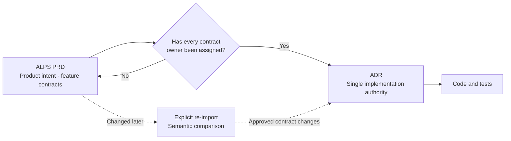
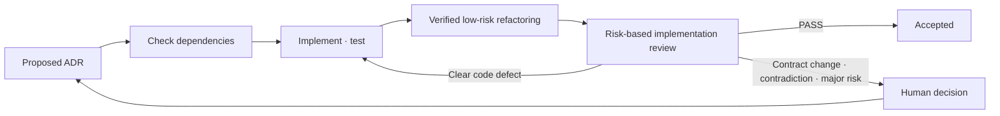

## TL;DR

- ALPS owns product intent and feature contracts before handoff.
- After a complete handoff, ADRs become the implementation authority.
- Agents close implementation and verification while humans judge contract changes and exceptions.

## Introduction

When I added a quiz mode called Office Raid to EncBird, my English-learning service, I wrote a 621-line PRD.

It contained more than game rules. I specified variable declarations, file paths, and a 12-step implementation sequence.

At the time, I thought more detail would prevent the agent from making mistakes.

Within a few days, however, the PRD had drifted from the code. Constants were extracted, modules were split, and the implementation order changed. Every code change required another document update, and once I missed one, the next agent read an obsolete implementation plan.

One sentence in an ADR lasted much longer:

> Do not use a design that prevents the most active learners from playing.

The query and file structure changed, but this requirement remained.

The difference was not the amount of detail. It was **whether the statement remained a decision criterion after the code changed or merely described the current implementation**.

I first treated this as a question of writing different content in PRDs, ADRs, and code. I now see a deeper issue: **who owns the contract when implementation begins**.

I built [ALPS Writer Plugins](https://github.com/haandol/alps-writer-plugins) to apply this boundary consistently.[^1] This post explains the current flow: ALPS transfers its contract into ADRs, and an agent implements against those ADRs.

## 1. Let each task start from one layer

PRDs, ADRs, and code describe the same system at different resolutions.

| Location | Question it must answer | What it should not contain |
| --- | --- | --- |
| ALPS PRD | Whose problem are we solving, and through which experience? | File paths and functions |
| ADR | Which contracts and boundaries must the implementation preserve? | Replaceable libraries and tuning details |
| Code and tests | How does the current implementation execute and verify the contract? | Comments that duplicate higher-level documents |

Each layer should answer its own question without requiring another layer.

If you need to read code to understand product scope, the PRD is incomplete. If you must compare an old PRD with several ADRs to identify the implementation contract, authority is split. If an ADR is required to find a function name, implementation detail has climbed too high.

The Office Raid PRD aged quickly because it owned file paths, variables, and task order together with product requirements. A code refactor therefore became a PRD change.

ALPS Writer defines not only document boundaries but also a rule for transferring contract authority.

Before handoff, the ALPS PRD owns product intent and reproducible feature contracts. After handoff is complete, ADRs become the single authority for implementation contracts. Code and tests own the current execution of those contracts.

With authority in one place, an agent can begin with the one layer that matches its question.

This separation resembles the boundary in hexagonal architecture that keeps domain rules apart from implementation technology.[^4]

## 2. ALPS owns the feature contract before handoff

If a PRD contains only a product hypothesis, the agent has to fill in the contract again before implementation.

The current ALPS format includes not only product context and success criteria but also feature contracts such as user-observable behavior, error handling, permissions, and state transitions.

Its structure has nine fixed sections. Architecture stops at C4 Context and Container, while each Feature is written as a vertical slice that runs from UI through API and data. Every Feature ends its Acceptance Criteria with what the end-to-end demo must show.

This level of specificity is different from an implementation plan.

`Responses must be sorted newest first`, `the same request must be processed only once`, and `do not store data without permission` are contracts that must remain reproducible after the implementation changes. Which module performs the sorting or which cache library is used belongs to the code.

The ALPS authoring process tries to maintain the same boundary.

The agent asks questions in dependency order, and the human reviews values and rules in a section-level approval digest. One section is the default approval unit. Even when requirements arrive as one large input, each Feature contract is confirmed and saved separately.

Document length is not the goal. The standard is **whether product intent and feature contracts are clear enough that handoff does not require reinterpretation**.

## 3. Handoff transfers ownership rather than copying text

`/feature-to-adr` is not a command that summarizes a PRD into several ADRs.

It first classifies implementation-related content into four groups:

- Contracts and decisions that ADRs must continue to own
- Implementation discretion that the agent can exercise in code
- Context that mattered only while the product was being planned
- Unresolved items that cannot yet be assigned to either side

The handoff remains incomplete while unresolved items remain or any contract value and rule lacks an owning ADR.

One Feature does not always become one ADR.

At least one ADR must own the complete feature contract. A durable data boundary or security decision may deserve its own ADR, while replaceable mechanisms such as libraries, SDKs, and module placement should stay out.

When handoff completes, implementation authority moves fully into ADRs.

The PRD remains as a legacy planning document that records how the product was conceived, but normal implementation and review no longer reread it. If both documents behave like current contracts, a human must repeatedly decide which one is correct.





Editing the PRD after handoff does not update ADRs automatically.

A re-import must be explicit. Semantically equivalent changes do nothing. New or changed contracts become proposals, and deleting an item from the PRD does not silently weaken a contract already owned by an ADR.

This constraint can feel inconvenient, but it is intentional. Once implementation authority has moved, editing the previous document must not change the current contract without notice.

## 4. ADRs retain contracts and durable decisions

An ADR becomes more than a history of technology choices. It becomes **the owner of contracts that the next implementation must preserve**.

For EncBird's dictionary feature, the boundary looks like this:

| What the ADR owns | What the code can choose |
| --- | --- |
| Invalid input is classified deterministically | The name and location of the classifier |
| Retrying the same input does not call the LLM again | The cache structure and internal key format |
| Active learners do not become unable to play | The query used to retrieve expressions |

Externally visible contracts, the meaning of stored data, security boundaries, consistency models, and long-lived trade-offs belong in ADRs. The same applies to provider, model, and fallback decisions when replacing them changes system behavior.

An algorithm cannot be assigned to a layer by name alone.

If only the sorted result is contractual and the algorithm can change, the algorithm belongs to code. If the system deliberately adopts the algorithm's properties and trade-offs for the long term, the decision belongs in an ADR.

Contracts are not limited to numbers.

Allowed states, permissions, processing order, duplicate handling, units, and failure guarantees also belong in ADRs. Verification should describe externally observable evidence rather than a particular function or test file.

A changed decision does not always require another ADR.

If the underlying question is unchanged, update the current ADR and record major transitions in `decision-log.md`. Create a new ADR only when a genuinely independent question appears.

## 5. Close implementation and review in one cycle

The complete PRD-first flow is `/alps-init` → `/feature-to-adr` → `/adr-impl` → automatic refactoring → implementation review → `Accepted`.

After handoff, `/adr-impl` runs this sequence:





`/adr-impl` checks prerequisite ADRs in `.mapping.json` and implements them in dependency order. Instead of storing code paths in the ADR index, it searches the current repository for the relevant code.

Passing tests is not the end.

The agent first reviews complexity, duplication, and coupling without changing behavior, then applies only low-risk refactors that can be verified by before-and-after tests. It then reviews which evidence satisfies each ADR contract.

The resulting Evidence Package contains each contract's status and evidence, important implementation choices, and remaining risks. It is not a new source of authority. It is a read-only summary for completion review, and its role ends with the task.

The agent fixes clear code and test defects, then verifies again. A human becomes involved only when a new contract is required, an existing decision is contradicted, or an important risk cannot be verified.

If no such issue remains, the ADR moves from `Proposed` to `Accepted` without another repetitive approval.

If humans must approve every diff after implementation, the bottleneck remains even when agents own implementation and verification. I therefore think the right model is not to eliminate human approval entirely, but to **approve contracts before implementation and judge only exceptions afterward**.[^5]

## 6. Not every task should start with ALPS

I use the following boundary:

- Start with ALPS when a new product has an unclear user, problem, or success criterion.
- Start with an ADR when an existing product needs a durable contract or architecture decision.
- Change only code and tests for local implementation or refactoring within an existing contract.

[Bible Atlas](https://bible-atlas.encbird.com) began with ALPS because the direction of the new product had to be defined first.[^3]

Office Raid, by contrast, was a feature of the existing EncBird product. If I built it again, I would begin with an ADR that owns the feature contract rather than another product-wide PRD.

RFTCR proposed retaining artifacts for Requirement, Feature, Task, Code, and Reflect.[^2] I no longer think task documents and implementation plans need to be kept for long.

An agent can read the ADR and current code, then create a plan for the present state. Persisting the plan, search results, code scope, and Evidence Package only gives the next agent more obsolete state to read.

Only the current authority needs to remain:

- Before handoff, the ALPS PRD owns product intent and feature contracts.
- After handoff, ADRs own current decisions and implementation contracts.
- Code and tests own current behavior and executable evidence.
- `decision-log.md` records only major changes in decisions.

## Conclusion

The 621-line Office Raid PRD tried to help the agent by describing the current code a second time.

Every implementation-plan change required a matching document edit. The moment one was missed, the document became stale context rather than useful guidance.

I now define a document's purpose as **leaving enough authority for the next stage to read and decide independently**.

ALPS establishes product intent and reproducible feature contracts before handoff. `/feature-to-adr` transfers complete ownership of those contracts. ADRs become the current implementation authority, and the agent closes implementation, tests, refactoring, and review in one cycle.

Humans do not write the implementation plan on the agent's behalf.

They approve the product and its contracts, make durable decisions, and judge contradictions or risks that the agent cannot close automatically. They do not repeat the same approval on every normal completion path.

I am not trying only to reduce the amount of documentation. **I am trying to reduce reinterpretation and repetitive approval caused by leaving the current authority in several places.**

---

[^1]: [ALPS Writer Plugins](https://github.com/haandol/alps-writer-plugins) — provides ALPS authoring, ADR handoff, and an ADR-based implementation cycle for Codex and Claude Code. The original ADR format comes from [Documenting Architecture Decisions](https://cognitect.com/blog/2011/11/15/documenting-architecture-decisions).

[^2]: [RFTCR — A New SDLC Framework for Agent-Driven Software Development](/en/2025/05/11/rftcr-framework-for-agentic-dev.html) — my earlier proposal for retaining outputs from each stage. This post updates my view of Task documents.

[^3]: [Bible Atlas](https://bible-atlas.encbird.com) — a side project that began with an ALPS document.

[^4]: [Demystifying Clean and Hexagonal Architecture](/2022/02/13/demystifying-hexgagonal-architecture.html) (Korean) — explains how domain rules are separated from implementation technology.

[^5]: [Why Does AI-Generated Code Make Review Harder?](/en/2026/08/18/ai-coding-review-cognitive-load.html) — describes contract-first review and inspecting code only when necessary.
