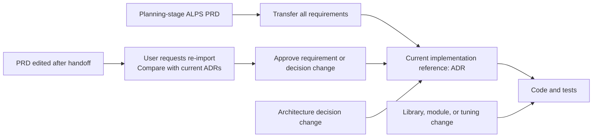

## TL;DR

- PRDs, ADRs, and code answer different questions about the same system.
- After requirements are transferred, ADRs become the implementation reference.
- Clear levels reduce change propagation and human review scope.

## Introduction

In ALPS Writer Plugins, I clarified what should remain in each document to reduce mismatches between documentation and code.

The approach treats the product requirements document (PRD), architecture decision records (ADRs), and code as **views of the same system at different resolutions**. I also recorded this principle in the repository's `AGENTS.md`.[^1]

Resolution here means the level of detail. The PRD describes what users should get, ADRs hold the decisions and requirements an implementation must honor, and code provides the behavior. By a contract, I mean requirements such as allowed states, permissions, and exact limits that must survive an implementation change.

After applying it, I noticed changes beyond cleaner documentation.

An agent no longer had to read every document for each task. Code refactoring stopped propagating into higher-level documents, and implementation remained open while humans could still review contracts and risks.

This post uses the current ALPS Writer Plugins design to explain the practical benefits of separating abstraction levels.

## 1. View the same system at three resolutions

C4 zooms from a system's external relationships (Context), to its applications and data stores (Container), to their internal parts (Component). Similarly, PRDs, ADRs, and code describe one system at different levels of detail.

The concentric circles, borrowed from Clean Architecture diagrams, illustrate the detail each document holds. They do not show runtime calls or mean that every stage must reread the PRD.

The center holds the ALPS PRD's planning-stage user problems, product intent, and feature contracts. File paths, technology inventories, and detailed implementation plans stay out.

The ADR ring holds rationale, alternatives, exact requirements, and system boundaries. SDKs, function signatures, internal call flow, and tuning values remain in the outer code-and-tests ring.

When planning moves to implementation, every required obligation is transferred into ADRs. **After that transfer, ADRs guide implementation and the PRD records the earlier plan.** Code must honor the ADR requirements; a later PRD edit does not automatically change them.

A diagram of the system's external relationships becomes harder to read if it also includes every class. Documents have the same problem: details that do not help answer their question are better left at a lower level.

ALPS Writer checks this by reading one document on its own, a `single-level read test`:

> Can this level answer its own question by itself, without lower-level details and without omitting a contract held nowhere else?

## 2. Let the agent work across documents and code

A Clean Architecture Use Case or Hexagonal Architecture Application Service coordinates work: receive a request, apply business rules, and read or store the necessary data.[^2] It depends on an interface describing the storage operations it needs rather than on a particular database product. The database connection code can then change without changing the business rules.

The agent plays a similar role in ALPS Writer.

During handoff, it reads the PRD, transfers lasting decisions and requirements into ADRs, and identifies choices that can be left to the implementer. Later implementation uses ADRs to locate the current code. The agent follows task instructions in Skills, connects external tools through MCP, and uses command-line tools (CLIs) to modify and test code and produce results for review.

This is also why the target places the Agent outside the rings. It works across all three levels but does not persistently own any of them.

Both coordinate work, but a Use Case or Application Service remains as code, while the agent's plan serves the current execution. That plan does not become an additional implementation reference alongside PRDs, ADRs, and code.

Completed-task plans, search results, helper-agent arrangements, and intermediate review material do not guide the next implementation. The PRD records the planning starting point; ADRs hold current decisions, including the transferred intent and requirements; code and tests hold actual behavior. Records needed to continue unfinished work can remain useful until that work is done.

The next agent reads current ADRs and code and chooses its own work sequence. Requirements should not become readable only after restoring a previous agent's internal state or a separate registry.

I see this as applying dependency inversion to development work. Understanding the documents does not require a particular agent or plugin's internal state. Instead, a replaceable agent reads and follows the documented requirements.

The PRD, ADRs, and code therefore remain readable after removing the plugin or changing the model. The agent's execution strategy may change as long as it preserves the contracts and verification results.

As with abstraction layers in Clean Architecture, this structure adds classification cost. A small project may not benefit enough from separating the full PRD, ADR, and code ladder.

## 3. Read one document for one question

Read the PRD to understand why signup exists.

For example, read the ADR to understand why a refresh token, used to maintain a login session, lasts seven days. Read code when you need to know how the token is replaced or which key stores it in the cache.

When each artifact answers its own question, an agent can load the required level and stop.

ALPS Writer's `/feature-to-adr` transfers implementation requirements from a PRD into ADRs. After handoff, normal implementation and review no longer read the PRD. The ADR index, `.mapping.json`, stores each ADR's path, status, summary, and requirements from other ADRs that must be satisfied first. It stores neither PRD paths nor code paths.

ADR bodies also omit PRD section numbers, Feature IDs, functions, and file paths. An agent reads the ADR and searches the current repository for relevant code.

Stored paths are convenient at first but become stale after renaming and refactoring. The agent must then decide whether the document or the search result is current.

Searching when needed resolves against current code. It reduces loaded context and limits stale lower-level facts from influencing higher-level decisions.

## 4. Stop changes at the level that owns them

The three levels do not change at the same frequency.

Functions and modules change often, architectural decisions change occasionally, and user problems and product goals usually last longer. ALPS Writer's `Code >> ADR >> PRD` describes those different change frequencies during planning. After handoff, implementation follows code and ADRs; PRD revisions are considered only through an explicit re-import.

With clear levels, an implementation-only change does not force a product-document edit. A changed requirement, however, must be reflected in code.





Full ALPS architecture descriptions retain external system relationships, internal applications and data stores, and constraints that must survive reimplementation. Internal components, frameworks, software development kits (SDKs), database libraries, and deployment tools remain recoverable from code and stay out of the PRD.

I also set criteria for which decisions belong in ADRs: requirement contracts, data and security boundaries, external service providers and fallback paths, and trade-offs that continue to constrain multiple implementations. Libraries, credential wiring, and module structure that can change without altering the contract stay in code.

An SDK replacement or file move therefore does not drag an ADR edit behind it. A framework change does not require a PRD edit when product and system boundaries remain intact.

Changing the adopted alternative for the same decision does not create an endless ADR chain either. The ADR body holds the current decision, `decision-log.md` holds major transitions, and Git holds the complete textual history.

Current state, major transitions, and verbatim history do not accumulate in one document, so the number of ADRs does not grow with the number of revisions.

Even when the user requests a PRD re-import, changes to wording or order have no effect. Actual contract or boundary changes produce ADR proposals; removing an existing requirement is not applied automatically either.

Document churn no longer scales with code churn.

## 5. Keep the contract complete and the implementation open

Separating abstraction levels gives the agent more implementation discretion.

ALPS Writer checks whether an implementation honoring the same requirements and boundaries could be rebuilt if all code disappeared. It calls this the `regeneration test`. The files and functions need not be identical.

For example, if `refresh tokens remain valid for seven days` is an established security policy, the ADR records that exact value and its rationale.

The SDK, function, cache structure, and module implementing that policy remain code-level choices. A later agent can choose an approach matching the current repository and tools.

The seven-day value appears in both the ADR and code, but serves different purposes. The ADR records a requirement that needs a new decision before it changes, along with the rationale; the code enforces it.

Code alone shows that the value is seven days today, but not whether it is a product contract or an incidental tuning choice.

Requirement values, allowed states and permissions, mandatory ordering, and failure behavior therefore remain in ADRs. Internal names and data storage formats remain in code.

The requirements are **complete enough to follow while leaving the implementation open**.

As long as the contract holds, an agent can refactor, select a more suitable library, and change internal structure. Humans do not need to prewrite the implementation plan to preserve the autonomy boundary.

## 6. Reduce what humans must judge

Clear abstraction levels also let review begin somewhere other than the full code diff.

ALPS Writer writes ADR requirements as independently reviewable rows with implementation-independent observable evidence rather than named test files or functions.

After implementation and tests, the agent derives an implementation review report (`Evidence Package`) with each contract's status and evidence, implementation choices, and remaining risks.

The report is temporary review material derived from ADRs and code, not another authoritative document. It does not become the reference for the next implementation.

Humans first inspect:

- whether every approved contract has evidence
- which choices the agent made within implementation discretion
- whether a new contract or unresolved risk needs human judgment

Only areas with weak evidence or implementation-sensitive risk—such as security, payments, or data changes—need a deeper code review.

This does not eliminate code reading. **It lets contracts and risk determine where code reading starts and how deep it goes.**[^3]

Without this boundary, humans pay back the implementation time saved by the agent while reconstructing the entire diff. With it, routine plan approval can shrink while human judgment focuses on contract changes, contradictions, and unverified risks.

## 7. Use three questions to place a fact

ALPS Writer routes information through these questions:

1. **If this fact disappeared, could regenerated code violate a requirement?**

   If yes, retain it in the PRD or ADR that owns the requirement. Exact limits, allowed states, permissions, ordering, and failure guarantees belong here.

2. **If it is not a requirement, can reading code or running a tool recover it?**

   If yes, leave it in code and tests. Libraries, SDKs, function input and output formats, module placement, and tuning values usually stop here.

3. **Is the reason for this choice absent from code, and would changing it alter a lasting architectural decision?**

   If yes, retain the rationale, alternatives, trade-offs, and boundary in an ADR.

The same technology name can produce different answers.

For example, choosing Amazon Bedrock as the external model provider and deciding which service to switch to during an outage may require an ADR. The SDK and code that obtain credentials or sign requests remain implementation choices as long as they preserve those requirements.

The relevant question is not whether a technology name appears, but which contract and boundary the choice fixes.

Finally, apply the single-level read test again. If one artifact cannot answer its own question, or every lower-level change forces it to change too, revisit the boundary.

## Conclusion

I now treat a code refactor requiring an ADR edit as a sign that the ADR may be too low-level. If implementation must reread the PRD, I check whether handoff lost a contract. If code cannot distinguish a contract value from an incidental choice, I check whether the ADR lacks its rationale.

These checks reduced **how much I need to read at once and how far changes spread**. When separating documents, I find it helpful to start with the question each document must answer on its own.

---

[^1]: The current design principles of [ALPS Writer Plugins](https://github.com/haandol/alps-writer-plugins) are documented in [AGENTS.md](https://github.com/haandol/alps-writer-plugins/blob/main/AGENTS.md), [ADR concepts](https://github.com/haandol/alps-writer-plugins/blob/main/plugins/adr-writer/templates/adr/concepts.md), and the [Dependency model](https://github.com/haandol/alps-writer-plugins/blob/main/docs/dependency-model.md).

[^2]: [Demystifying Clean and Hexagonal Architecture](/2022/02/13/demystifying-hexgagonal-architecture.html) (Korean) — explains how abstraction layers reduce dependencies and the complexity they add.

[^3]: [Why Does AI-Generated Code Make Review Harder?](/en/2026/08/18/ai-coding-review-cognitive-load.html) — describes reviewing contracts and evidence first, then reading only the risky code paths.
