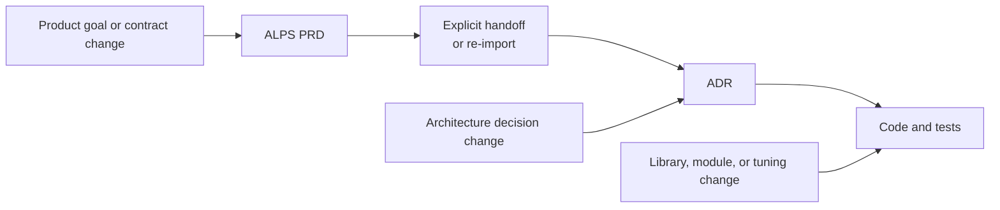

## TL;DR

- PRDs, ADRs, and code are different resolutions of the same system.
- The agent is a temporary orchestration layer connecting all three.
- Clear levels reduce change propagation and human review scope.

## Introduction

The opening section of the ALPS Writer Plugins `AGENTS.md` states one design principle for the entire repository.

PRDs, ADRs, and code are **three resolutions of the same system**.[^1]

Turning that principle into repository rules created several constraints.

PRD Architecture stops at C4 Context and Container. ADRs omit libraries, SDKs, and file paths. Document bodies store neither PRD-to-ADR nor ADR-to-code paths.

At first, I treated these as documentation hygiene for preventing drift.

Applying them revealed changes larger than document drift.

An agent no longer had to read every document for each task. Code refactoring stopped propagating into higher-level documents, and implementation remained open while humans could still review contracts and risks.

This post uses the current ALPS Writer Plugins design to explain the practical benefits of separating abstraction levels.

## 1. View the same system at three resolutions

Just as C4 zooms into one system through Context, Container, and Component views, PRDs, ADRs, and code zoom into the same system.

This is a conceptual model of information resolution, persistence, and dependency direction rather than a runtime call sequence.

The center holds the ALPS PRD: user problems, product intent, and feature contracts. It should be the most stable level, so file paths, technology inventories, and implementation plans stay out.

The ADR ring holds rationale, alternatives, exact requirements, and system boundaries. SDKs, function signatures, internal call flow, and tuning values remain in the outer code-and-tests ring.

Dependencies point inward toward contracts, while change frequency increases toward the outside.

A Context diagram with every class is more detailed, but it answers Context-level questions less effectively. Each ring also becomes clearer through what it excludes.

ALPS Writer applies a `single-level read test`:

> Can this level answer its own question by itself, without lower-level details and without omitting a contract held nowhere else?

## 2. Let the agent orchestrate between levels

A Clean Architecture Use Case or Hexagonal Architecture Application Service orchestrates a business flow.[^2]

It receives a request from an input adapter, invokes the domain model, and communicates with external adapters through ports. Depending on port contracts rather than a concrete database client or web framework inverts the dependency.

The agent plays a similar role in ALPS Writer.

It reads product intent and feature contracts from the PRD, then separates durable decisions from implementation discretion at ADR resolution. During implementation, it uses the ADR to locate current code, modifies and tests it through Skills, MCP, and CLI tools, and produces review evidence.

This is also why the target places the Agent outside the rings. It works across all three levels but does not persistently own any of them.

The roles are analogous, but the structures are not identical. A Use Case or Application Service remains as code, while the agent's orchestration plan is temporary.

The agent is not a fourth authoritative artifact.

Plans, search results, subagent composition, and intermediate review material matter only during execution. After the task, product intent remains in the PRD, decisions and contracts in ADRs, and current behavior in code and tests.

The next agent reads those artifacts and reconstructs the orchestration. It does not need the previous agent's internal state or a hidden registry.

I see this as Dependency Inversion at the development-workflow level. Durable artifacts do not depend on one agent, model, or plugin's internal state; a replaceable agent depends on the contracts in those artifacts.

The PRD, ADRs, and code therefore remain readable after removing the plugin or changing the model. The agent's execution strategy may change as long as it preserves the contracts and verification results.

As with abstraction layers in Clean Architecture, this structure adds classification cost. A small project may not benefit enough from separating the full PRD, ADR, and code ladder.

## 3. Read one document for one question

Read the PRD to understand why signup exists.

Read the ADR to understand why the refresh-token lifetime is seven days. Drop to code only when you need the rotation logic or cache key.

When each artifact answers its own question, an agent can load the required level and stop.

ALPS Writer applies this benefit fairly aggressively.

After `/feature-to-adr` handoff, normal implementation and review no longer read the PRD. `.mapping.json` stores ADR paths, status, summaries, and real contract prerequisites, but neither PRD paths nor code paths.

ADR bodies also omit PRD section numbers, Feature IDs, functions, and file paths. An agent reads the ADR and searches the current repository for relevant code.

Stored paths are convenient at first but become stale after renaming and refactoring. The agent must then decide whether the document or the search result is current.

Searching when needed resolves against current code. It reduces loaded context and limits stale lower-level facts from influencing higher-level decisions.

## 4. Stop changes at the level that owns them

The three levels do not change at the same frequency.

Functions and modules change often, architectural decisions change occasionally, and user problems and product goals usually last longer. ALPS Writer describes this as the stability gradient `Code >> ADR >> PRD`.

With clear levels, a change stops at its own resolution.





The repository's PRD Architecture ADR permits only C4 Context, Container, and constraints that must survive reimplementation. Component structure, frameworks, SDKs, ORMs, and internal deployment tools remain recoverable from code.

ADRs also pass an `admission gate`. Requirement contracts, data or security boundaries, external providers and fallbacks, and trade-offs constraining several implementations qualify. Replaceable libraries, credential plumbing, and module structure stay in code.

An SDK replacement or file move therefore does not drag an ADR edit behind it. A framework change does not require a PRD edit when product and system boundaries remain intact.

Changing the adopted alternative for the same decision does not create an endless ADR chain either. The ADR body holds the current decision, `decision-log.md` holds major transitions, and Git holds the complete textual history.

Current state, major transitions, and verbatim history do not accumulate in one document, so the number of ADRs does not grow with the number of revisions.

PRD re-import also ignores changes to wording or order. It proposes an ADR update only when the actual contract or boundary changes.

Document churn no longer scales with code churn.

## 5. Keep the contract complete and the implementation open

Separating abstraction levels gives the agent more implementation discretion.

ALPS Writer's regeneration test does not ask whether the same code can be recreated. It asks whether entirely new code can still preserve the same requirements and boundaries.

If `refresh tokens remain valid for seven days` is a pricing or security policy, the ADR records the exact seven-day value and its rationale.

The SDK, function, cache structure, and module implementing that policy remain code-level choices. A later agent can choose an approach matching the current repository and tools.

The value appearing in both the ADR and code is not duplication. The ADR records the contract and why it must not change freely; the code enforces it.

Code alone shows that the value is seven days today, but not whether it is a product contract or an incidental tuning choice.

Requirement values, states, permissions, ordering, and failure guarantees therefore remain in ADRs, while identifiers and representation remain in code.

This produces a state that is **contract-complete and implementation-open**.

As long as the contract holds, an agent can refactor, select a more suitable library, and change internal structure. Humans do not need to prewrite the implementation plan to preserve the autonomy boundary.

## 6. Reduce what humans must judge

Clear abstraction levels also let review begin somewhere other than the full code diff.

ALPS Writer writes ADR requirements as independently reviewable rows with implementation-independent observable evidence rather than named test files or functions.

After implementation and tests, the agent derives an implementation review report (`Evidence Package`) with each contract's status and evidence, implementation choices, and remaining risks.

The report is temporary review material derived from ADRs and code, not another authoritative document. It does not become the reference for the next implementation.

Humans first inspect:

- whether every approved contract has evidence
- which choices the agent made within implementation discretion
- whether a new contract or unresolved risk needs human judgment

Only areas with weak evidence or implementation-sensitive risk—such as security, payments, or data changes—need a deeper code review.

This does not eliminate code reading. **It lets contracts and risk determine where code reading starts and how deep it goes.**[^3]

Without this boundary, humans pay back the implementation time saved by the agent while reconstructing the entire diff. With it, routine plan approval can shrink while human judgment focuses on contract changes, contradictions, and unverified risks.

## 7. Use three questions to place a fact

ALPS Writer routes information through these questions:

1. **If this fact disappeared, could regenerated code violate a requirement?**

   If yes, retain it in the PRD or ADR that owns the requirement. Exact limits, allowed states, permissions, ordering, and failure guarantees belong here.

2. **If it is not a requirement, can code or a deterministic tool recover it?**

   If yes, leave it in code and tests. Libraries, SDKs, signatures, module placement, and tuning values usually stop here.

3. **Can code explain neither the reason for the choice nor the durable decision it changes?**

   If yes, retain the rationale, alternatives, trade-offs, and boundary in an ADR.

The same technology name can produce different answers.

Choosing Amazon Bedrock as the external model-provider boundary, including a fallback policy, may require an ADR. The SDK, credential provider chain, and signer implementing that boundary remain in code when they preserve the same contract.

The relevant question is not whether a technology name appears, but which contract and boundary the choice fixes.

Finally, apply the single-level read test again. If one artifact cannot answer its own question, or every lower-level change forces it to change too, revisit the boundary.

## Conclusion

The changes I felt after separating abstraction levels in ALPS Writer Plugins appeared in execution.

Agents can read only the level needed for the question. Libraries and file structures can change without rewriting ADRs and PRDs, while contracts stay fixed and implementation remains open.

Review can begin with contracts, evidence, and exceptions instead of reconstructing every implementation choice.

The agent orchestrates work across all three levels, but it neither replaces their authority nor leaves its execution state as a prerequisite for the next task.

I now treat a code refactor requiring an ADR edit as a sign that the ADR may be too low-level. If implementation must reread the PRD, I check whether handoff lost a contract. If code cannot distinguish a contract value from an incidental choice, I check whether the ADR lacks its rationale.

Good abstraction boundaries **reduce how much must be read at once and limit how far changes propagate.** They also divide what agents and humans must decide within that boundary.

---

[^1]: The current design principles of [ALPS Writer Plugins](https://github.com/haandol/alps-writer-plugins) are documented in [AGENTS.md](https://github.com/haandol/alps-writer-plugins/blob/main/AGENTS.md), [ADR concepts](https://github.com/haandol/alps-writer-plugins/blob/main/plugins/adr-writer/templates/adr/concepts.md), and the [Dependency model](https://github.com/haandol/alps-writer-plugins/blob/main/docs/dependency-model.md).

[^2]: [Demystifying Clean and Hexagonal Architecture](/2022/02/13/demystifying-hexgagonal-architecture.html) (Korean) — explains how abstraction layers reduce dependencies and the complexity they add.

[^3]: [Why Does AI-Generated Code Make Review Harder?](/en/2026/08/18/ai-coding-review-cognitive-load.html) — describes reviewing contracts and evidence first, then reading only the risky code paths.
