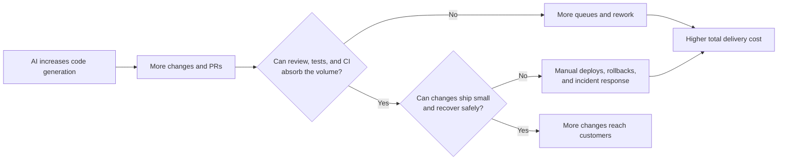

## TL;DR

- AI productivity depends more on the team harness than individual coding speed.
- CTS-SW connects total delivery cost to software that reaches customers.
- A harness should be funded as a team asset, not a personal optimization.

## Introduction

When a team adopts AI coding tools, it naturally starts with numbers that are easy to collect: coding time, autocomplete acceptance rate, and pull request count.

These numbers show how often the tools are used and how much faster code is generated. They do not show whether the cost of delivering a feature to customers has actually gone down.

Code may be produced faster while reviews pile up. If CI is slow or deployment remains manual, the added change volume simply moves into another queue. If more frequent deployments also bring more rollbacks and incident response, the time saved during implementation has only moved elsewhere.[^5]

In an earlier post, I argued that it is more useful to examine the **cost of realizing a requirement**—including the model, tools, retries, and human review—than token prices alone.[^1]

Amazon's Cost to Serve Software, or CTS-SW, applies a similar idea to the software delivery process.[^2]

CTS-SW does not automatically determine whether an AI rollout has worked. I still find it useful because it connects the cost from development through operations to results that actually reach customers, rather than stopping at code generation speed.

## 1. Count the cost of reaching customers

The basic CTS-SW calculation is simple.

```text
CTS-SW =
cost to build and operate software
/ units of software delivered to customers
```

Suppose eight developers produce 16 production deployments in one week. If we use developer-weeks as a proxy instead of exact labor cost, each deployment costs `0.5 developer-weeks`.

If the same team can reliably deliver 20 deployments, the figure drops to `0.4 developer-weeks`. The team is spending less engineering capacity per delivered software unit.

The difficult part is not the calculation. It is deciding **what counts as one unit of software**.

Amazon explains that a deployment may work for a service-oriented architecture, while customer-delivered code reviews or commits may be more appropriate for a monolith or an organization with scheduled releases.[^2]

If deployments are the chosen unit, a team might count only deployments that received real customer traffic rather than every push to an internal environment. For an organization with large release batches, a bundle of changes made available to customers may be more natural than deployment count.

Without this agreement, CTS-SW still produces a number, but different teams will be counting different things.

A software unit is not the same as business value either. Whether one deployment changes revenue or customer satisfaction still needs to be measured separately.

That makes CTS-SW closer to an **intermediate measure of software delivery efficiency** than a final business outcome. I think it is best used to examine how many people and how much time are required after code is written but before it reaches customers.

## 2. Find where the time saved by AI moved

Amazon separates development velocity, such as code review speed, from deployment velocity.[^2]

This distinction matters because when only one side gets faster, the other immediately becomes the bottleneck.

If AI accelerates code generation, changes and pull requests increase. With the same number of reviewers, review queues grow. Even after review, slow CI and deployment mean customer delivery speed does not improve.

By contrast, automated tests, fast CI, small deployments, and reliable rollback mechanisms let a team validate and deliver the additional changes in short cycles.

Here, a harness means more than a developer's prompt or editor settings. It includes shared requirement contracts, repository rules, tools, tests, CI/CD, deployment, and observability.[^10]

I therefore think AI productivity depends less on how well one person operates a model and more on **how reliably the team's harness absorbs generated changes**.

One developer may produce code quickly with strong prompts and settings, but weak review criteria and tests create more work for everyone else. When the team harness automates recurring decisions, an individual's learning remains available to future tasks and other team members.

Amazon's 50-team Frontier Development pilot provides a concrete example of this claim.[^11]

Teams with similar seniority mixes working in existing codebases used nearly the same AI tools, yet half improved production deployment velocity by less than 3x. The other half reached a median of 4.5x, with some exceeding 10x.

The difference was not mainly the tool. The faster teams changed their working practices together: context, tools, tests, and intent documents let agents validate their own work instead of waiting for continuous human input.

This is useful evidence that a team harness can affect deployment velocity.

It still does not prove that CTS-SW fell. The cost of building and operating the added harness, human review and incident response, and delivery quality need to be measured within the same boundary.





DORA's 2025 analysis describes AI as an amplifier of existing organizational capabilities, which matches this flow. Where automated testing, version control, and fast feedback are weak, increased change volume can produce more instability.[^8]

A team does not need a perfect development environment before adopting AI. It does need to know where changes currently wait and fail.

If review is the longest delay, improving review scope and assignment may matter more than generating even more code. If CI is the bottleneck, shortening test feedback may come first. If post-deployment incidents are frequent, rollback and observability need attention.

The effect of AI tools is hard to measure separately from this foundation. In my view, AI does not replace the development system; it mainly makes the strengths and weaknesses of its existing feedback loops more visible.

## 3. Turning the metric into a target distorts it

Even if a team defines deployments as its software unit, deployment count itself should not become the target.

When evaluation rewards deployment count, people can split changes more than necessary or create meaningless deployments. That behavior is rational for the individual, but the organization ends up optimizing a number unrelated to customers.

DORA also warns that using delivery metrics as goals or for competition between teams invites manipulation under Goodhart's law.[^9]

CTS-SW is not exempt.

| How to make the number look better | What to verify instead |
| --- | --- |
| Split releases into smaller deployments | Did each unit deliver something meaningful to customers? |
| Exclude maintenance and incident costs | Did the cost boundary remain consistent from development through operations? |
| Count rollbacks and redeployments as output | Did change failures and incidents rise at the same time? |
| Compare teams using different definitions | Is this a trend within one team using one stable definition? |

This is also why CTS-SW should not become an individual productivity score.

Software delivery does not end when one developer writes code. Review practices, test infrastructure, deployment permissions, and the operating model all shape the result. Scoring individuals turns system problems into personal performance problems.

AI coding tools may be used by individuals, but the harness their output must pass through is a team asset. It is therefore more natural to measure adoption at the level of team delivery cost and quality than individual output volume.

SPACE makes the same point from another direction: developer productivity should not be reduced to one activity metric.[^3]

I think CTS-SW works best as a trend within the same team, with flow metrics such as cycle time and review waiting time used to find the cause. Rollback rate, change failure rate, and incident recovery time should sit beside it to show whether cost has merely been shifted elsewhere.[^4]

For example, if CTS-SW falls while change failures and on-call work increase, it is difficult to call that an improvement. If code volume stays similar but review queues and manual deployments shrink, a lower CTS-SW reflects a genuinely better delivery system.

## 4. Start by funding one bottleneck in one team

For a team without an evaluation baseline, I would start with a one-page agreement rather than a dashboard.

At minimum, agree on the following:

- What are we trying to learn from this number?
- What is one customer-delivered software unit?
- Which proxy will we use instead of exact cost?
- What proves that quality has not declined?
- Will we prohibit its use for individual ratings, team rankings, and headcount cuts?

The agreement should also reserve time to improve the harness.

Moving recurring review comments into tests, shortening CI feedback, and automating deployment and recovery can look slower than shipping one more feature today. If this work depends on voluntary individual effort, urgent feature work will usually win.

Teams need to schedule it as real work and combine domain knowledge with platform and operations expertise so that each improvement survives into the next task. AI adoption budgets should include not only tool licenses and training but also **the capacity to build and operate the team harness**.

If the definition of a software unit changes, do not splice the new series onto the old one. Keeping the definition stable from week to week matters more than the SQL used to calculate it.

Next, connect several recent weeks of Git, CI/CD, organizational, and incident data to create a baseline.

There is no need to calculate perfect cost on day one. Active developer count, customer-delivered units, cycle time, rollbacks, and incident response time are often enough to locate where cost is growing.

After checking that the baseline roughly matches the team's lived experience, choose the largest bottleneck.

If review queues are long, change the review process. If CI is slow, shorten test feedback. If you want to trial an AI coding tool, avoid overlapping it with another major change and watch how code review, deployment, and CTS-SW move together.

This follows the same performance-analysis principles that system throughput is constrained by the slowest component and that changing one variable at a time makes the effect easier to verify.[^6][^7]

A senior engineer does not need to own every number in this process.

Product can define the unit that reaches customers. SRE can watch quality and operational cost. Engineering management can account for team composition changes and govern how the metric is used. Senior engineers can connect each number back to real pull requests, deployments, and incidents.

I would start by making before-and-after changes explainable within one team, rather than trying to reproduce Amazon's full analytical model.

## Conclusion

If we judge AI coding tools only by coding time and pull request count, it is easy to miss the cost created after implementation.

When review queues grow, CI slows down, or manual deployment and incident response increase, faster code generation has not reduced the cost of delivering software to customers.

CTS-SW is not a formula that calculates this cost perfectly. The result depends heavily on how a team defines software units and cost boundaries.

Still, I think it is a useful starting point because it asks **what it cost to produce software that reached customers, not how much code was produced**.

My current recommendation is simple.

Define a customer-delivered unit and quality boundary for one team. Reconstruct a recent baseline and improve the largest bottleneck. Before celebrating a lower CTS-SW, check whether the cost moved into review, incidents, or operations.

Repeating this loop may reduce real development cost more directly than simply using more AI tools.

Improving individual AI skills still matters. But for those skills to become team productivity, the team must turn personal techniques into shared contracts, tools, and guardrails.

**AI productivity looks less like the result of giving individuals a tool and more like the result of investing in the team harness.**

---

[^1]: [Why AI Adoption Should Not Start with Token Savings — The 3S Stages](/en/2026/06/15/organizational-ai-adoption-3s.html).

[^2]: Amazon Science, [Measuring the effectiveness of software development tools and practices](https://www.amazon.science/blog/measuring-the-effectiveness-of-software-development-tools-and-practices) — defines CTS-SW and explains architecture-specific software units, team velocity, delivery quality, and the analysis of Amazon Q Developer.

[^3]: Nicole Forsgren et al., [The SPACE of Developer Productivity](https://queue.acm.org/detail.cfm?id=3454124) — proposes evaluating developer productivity across multiple dimensions rather than reducing it to one activity metric.

[^4]: Google Cloud DORA, [Accelerate State of DevOps Report 2024](https://dora.dev/research/2024/dora-report/) — explains why software delivery throughput and instability need to improve together.

[^5]: [Why Does AI-Generated Code Make Review Harder?](/en/2026/08/18/ai-coding-review-cognitive-load.html) — examines how AI moves cognitive load from implementation into review.

[^6]: Microsoft Learn, [How to Investigate Bottlenecks](https://learn.microsoft.com/en-us/biztalk/core/how-to-investigate-bottlenecks) — explains that throughput is constrained by the slowest component and recommends changing one variable before measuring again.

[^7]: AWS Well-Architected Framework, [Use a data-driven approach for architectural choices](https://docs.aws.amazon.com/wellarchitected/latest/performance-efficiency-pillar/perf_architecture_use_data_driven_approach.html) — treats decisions based on guesses as an anti-pattern and recommends validating choices with performance data and experiments.

[^8]: Google Cloud DORA, [Announcing the 2025 DORA Report: State of AI-Assisted Software Development](https://cloud.google.com/blog/products/ai-machine-learning/announcing-the-2025-dora-report) — describes AI as an amplifier of organizational strengths and weaknesses and links weak testing, version control, and feedback loops to delivery instability.

[^9]: DORA, [DORA's software delivery performance metrics](https://dora.dev/guides/dora-metrics-four-keys/) — warns against metric targets, cross-application comparisons, and competition between teams.

[^10]: [How I Built the EncBird Harness Layer by Layer](/en/2026/06/16/harness-engineering-in-practice.html) — describes how requirements, context, tools, tests, and guardrails accumulated into a project harness.

[^11]: [Why Did Some Teams Get Up to 10x Faster with the Same AI Tools?](/2026/08/31/frontier-development-habits.html) (Korean) — connects Amazon's 50-team pilot and five Frontier Development habits to the team-harness argument.
