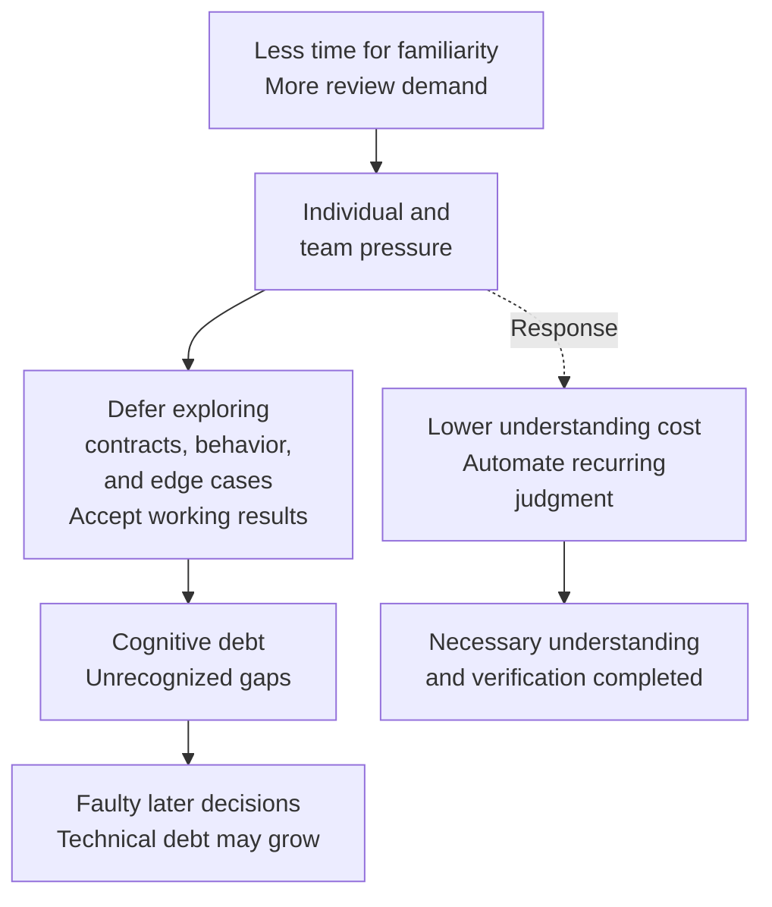
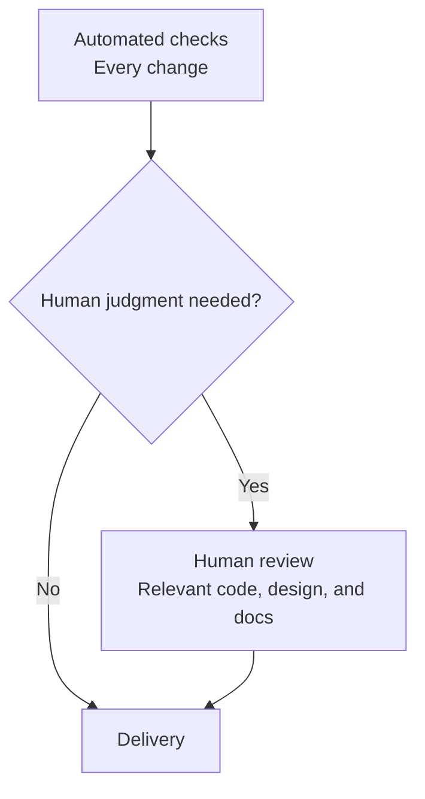

## TL;DR

- Time to become familiar with context is compressed into review.
- Accepting code because it works can leave debt the team cannot see.
- Reduce human review effort or automate recurring checks.

## Introduction

While talking with a customer about AI coding, I heard that reviewing agent-generated code creates overwhelming cognitive load: the mental effort of holding information needed to understand and judge the work.

I had rarely felt that way myself. I suspect that is because I started using AI coding tools with the beta version of GitHub Copilot and became accustomed to small tasks, small commits, and short feedback loops.

Those models failed at large tasks. I split problems, read and corrected the results, and gradually became familiar with the code and its constraints. My understanding of where to trust the models grew alongside their capabilities.

Today, a model can produce a large amount of code at once. But **time to become familiar with its context does not automatically shrink in proportion to coding time**. When understanding no longer develops alongside implementation, the burden collects when the result arrives.

I think this pressure can lead people to accept unfamiliar code because it works, leaving debt they do not recognize. Breaking that path requires reducing the burden of reviewing code, architecture, and documents, or removing people from repetitive reviews.

## 1. Time to build familiarity is compressed

Writing code involved reading its surroundings, translating requirements into implementation, and fixing failed tests. Along the way, a developer learned why the structure was needed and which conditions could break it.

Coding time was also time spent becoming familiar with context. Even incomplete understanding left a working model for the next decision.

Delegating implementation presents the finished result first. The human must trace code and tests backward to reconstruct intent, assumptions, and exceptions. Work previously spread across implementation now competes for a short review window.

DORA describes the movement of time from generation to verification and makes the distinction explicit.[^14]

> “Verification is a fundamentally different cognitive task than creation.”
>
> — DORA


This diagram illustrates where effort occurs. Producing the same amount of code faster does not make the entire task proportionally faster if the human must build familiarity separately.

Keeping the same deadlines while taking on more simultaneous changes can force people to switch repeatedly between unfamiliar contexts. Individuals experience cognitive load; teams accumulate review waits and rework.

In this post, **review backpressure** means progress being constrained because human understanding and verification cannot absorb upstream output. Increasing generation while familiarity-building time is compressed can intensify that pressure.

## 2. Debt chosen knowingly and debt left unrecognized

Technical-debt discussions often bring to mind a trade-off among release timing, performance, and maintenance cost. A team might knowingly defer removing duplicate implementation to ship sooner.

When describing deliberate technical debt, Fowler makes this awareness explicit.[^26]

> “the team knows they are taking on a debt”
>
> — Martin Fowler

Knowing what was deferred and what it may cost makes repayment a decision the team can discuss. Technical debt can also be unintentional. The comparison here is between a recognized compromise and a gap in understanding that passes through review unnoticed.

Cognitive debt is a lack of shared understanding within the team about how the system behaves and how changes will affect it. I am focusing on situations where a team accepts code without adequately recognizing that gap.

Consider a hypothetical duplicate-payment prevention feature. Payments work through the interface and retry tests pass, but nobody explored retries after record loss or two requests arriving simultaneously.

Here, a contract means the behavior and conditions an implementation must satisfy, such as ensuring that one request cannot cause two charges. Knowing that contract is different from understanding the conditions under which the implementation satisfies it. Accepting the result simply because it works can leave the team unaware of what it missed.

Deferring understanding under deadline and approval pressure can be a conscious choice. That does not mean the team recognizes the size or consequences of the gap it leaves. Storey distinguishes those two things.[^10]

> “Even when surrender is intentional, the resulting debt accumulates invisibly.”
>
> — Margaret-Anne Storey

Later, someone shortens payment-record retention to reduce storage cost. A reviewer who does not understand the relationship with retries may accept a faulty change. Cognitive debt can impair later judgment, creating technical debt or delaying discovery of an existing problem.





The diagram shows a possible path when a team accepts code before understanding it. Cognitive debt does not disappear and become technical debt. Inadequate understanding and the faulty code it enables can remain together.

## 3. Team velocity is constrained by the slower verification stage

To avoid leaving cognitive debt, we need to ask how many changes the team can process while completing the necessary understanding and verification. Once generation is sufficiently fast, that verification capacity can constrain team velocity. Microsoft's guidance on system bottlenecks states this principle for sustainable throughput.[^27]

> “a system can only process as fast as its slowest performing component.”
>
> — Microsoft

Apply that principle to review. Assume generation and delivery impose no other bottleneck and enough changes arrive to use review capacity. Every change passes automated checks, and only changes requiring human judgment proceed to human review. The two stages can process different changes concurrently. Keep work units and quality criteria consistent.





Express both stages' capacities in terms of total changes, and review-limited team velocity can be approximated as follows. This is a bottleneck model for choosing improvements, not a formula obtained by measuring actual teams.

```text
team velocity ≈ min(human review velocity, automated review velocity)
```

Velocity here counts changes meeting the same quality criteria, not approvals alone. Rework and waiting can lower actual throughput. If generation or delivery is slower, that stage must also be included in the bottleneck analysis.

Consider a hypothetical team where every change requires human review. People can review eight changes per day, while automated checks can process twelve. `min` selects the smaller value, so `min(8, 12) = 8`. Even if automation finishes twelve changes, the team can sustainably deliver about eight per day when people can review only eight.

Where does that human capacity of eight changes come from? We can calculate it from the time available for review and the time each change requires.

```text
H = human review time available per day
C = average review time per change requiring human review
p = fraction of all changes requiring human review

human review velocity = H / (p × C)
```

Suppose that team has 240 minutes available for review each day and each review takes 30 minutes on average. Every change requires human review, so p is 1. Substituting those values gives `240 / (1 × 30) = 8`: capacity for eight changes per day.

Now suppose only half of all changes need human review, making p equal to 0.5. With H and C unchanged, `240 / (0.5 × 30) = 16`. People review eight of those sixteen changes, requiring `8 × 30 minutes = 240 minutes`. The denominator, `p × C`, is the average human review time needed per change across all changes.

The result therefore counts the total changes that human capacity can support, not the reviews people personally perform. Since automated checks still handle only twelve changes per day, team velocity becomes `min(16, 12) = 12`, or about twelve changes per day.

C includes reading code, reconstructing context, checking assumptions in architecture and documentation, and exploring exceptions. When unfamiliar context and complex conditions take longer to understand and judge, C grows. With available review time H and the fraction requiring human review p held constant, a larger C means fewer changes can be processed.

This is why I think **cognitive load can act inversely to team velocity**. Here, I connect cognitive load to throughput through the time needed for understanding and judgment. I am not claiming an exact inverse relationship between a psychological load score and team velocity; the relationship constrains team velocity when human review is the bottleneck.

Return to the original condition where every change requires human review. Suppose reducing the effort of becoming familiar with the context makes a review possible in 15 minutes at the same quality. H stays at 240 minutes and p stays at 1, while C falls: `240 / (1 × 15) = 16`. Halving the time per review doubles the changes human capacity can support. With automated capacity unchanged, team velocity can rise to about twelve changes per day.

Holding staffing and available time constant leaves C and p as the human-side levers: reduce the cost of understanding and judgment, or reduce the fraction needing direct human review. For a route with no human review, remove that stage from the capacity model rather than divide by zero.

## 4. Lower the cost of becoming familiar with context

The first direction is to make necessary human reviews less burdensome. C grows when people must reconstruct purpose and assumptions from scratch for every code, architecture, or requirements-document review.

I would establish the contract before implementation and connect the result to before-and-after behavior, failure conditions, and verification evidence. That contract should cover observable behavior, conditions that must hold, and who may read or change which data.

For the payment example, a passing-tests summary is less useful than knowing which retries were checked, how record loss and concurrent requests were covered, and which decisions remain open. Explanations should lead directly to code and executed tests to reduce the cost of recovering context.

The amount to learn at once can also shrink. Implement one requirement slice, understand and verify it, then commit. Generating several small pull requests—requests to review and merge changes—and reading them all later pushes familiarity-building time to the end again.


The diagram shows time for building understanding between small implementation steps. Familiarity with the current small change becomes the starting point for the next one.

Existing cognitive debt still needs repayment. Tracing code and design together, finding missed assumptions and failure conditions, and repairing faulty implementation take time. Recording the behavior and assumptions in code, documentation, and tests reduces the need to reconstruct that context from scratch on the next task.

In the [ALPS Writer Plugins](https://github.com/haandol/alps-writer-plugins) I maintain, I have built in criteria for dividing work and reviewing evidence against contracts. Lasting decisions go into Architecture Decision Records (ADRs), and implementation explanations connect request and failure paths to code and tests.[^3]

The presence of documentation does not establish understanding. Maintainers need to be able to explain behavior relevant to future changes and incident response. Small implementation units and readable evidence support that understanding.[^7]

## 5. Remove people from repetitive reviews

The second direction is to stop requiring the same human review for every change. If people repeatedly reread conditions automated checks can verify, p remains high.

If reviews repeatedly flag which modules may depend on others, architecture tests can check those relationships. If reviewers repeatedly check that the same request is not processed twice, regression tests can check that later changes do not reintroduce the problem. Accumulating such decisions in the harness—the working instructions, tools, and verification environment—makes them reusable.[^5]

In the normal path I want, sufficient automated verification of an agreed contract removes the need for repetitive human approval. People decide new product behavior, contract changes, high-risk conditions, and assumptions automation could not verify.

An agent's claim that everything is fine is not enough to remove human review. What was verified and the evidence must be inspectable. Otherwise the process merely passes unfamiliar code faster.

Automating verification is also separate from maintaining necessary understanding. People need not read every implementation detail, but the team still needs to set intent and quality criteria and take responsibility for later changes.

While this transition is incomplete, control new work entering the process. Reducing arrivals alone does not lower the understanding cost of one review. Use the available time to improve explanations, contracts, tests, and tools so later capacity can grow.

After automation, reassess the difficulty of remaining human reviews. Removing routine changes can lower p while increasing C for the harder decisions left behind. Check actual review time and quality. Automated verification also incurs tooling and operating costs, so use CTS-SW—the cost of delivering one software unit to customers—to examine whether overall cost has fallen too.[^19]

## Conclusion

AI reduces coding time, but people may still need separate time to become familiar with the context. Accepting working results while ignoring that gap can leave cognitive debt whose missing pieces the team cannot see.

Demanding faster approvals under the same pressure will not easily break that path. **At the same quality, we need to reduce the effort required for human review or remove people from recurring checks.** I think that is the main work of improving team velocity after code generation becomes fast.

---

[^14]: Jessica Baolin and Nathen Harvey, [Balancing AI tensions](https://dora.dev/insights/balancing-ai-tensions/) (DORA, 2026). Describes effort moving from generation to verification.

[^26]: Martin Fowler, [Technical Debt Quadrant](https://martinfowler.com/bliki/TechnicalDebtQuadrant.html) (2009). The quotation describes deliberate technical debt; the same article also covers inadvertent debt.

[^10]: Margaret-Anne Storey, [From Technical Debt to Cognitive and Intent Debt](https://arxiv.org/pdf/2603.22106v3) (2026). Distinguishes intentional surrender from the visibility of the debt that results.

[^27]: Microsoft Learn, [How to Investigate Bottlenecks](https://learn.microsoft.com/en-us/biztalk/core/how-to-investigate-bottlenecks). The principle concerns sustainable computer-system throughput; its application to team review, including the formula and assumptions, is this post's model.

[^3]: [Why Separate PRDs, ADRs, and Code? — Reading One Abstraction Level at a Time](/en/2026/07/25/alps-adr-abstraction-boundaries.html).

[^7]: Geoffrey Litt, [Understanding is the new bottleneck](https://www.geoffreylitt.com/2026/07/02/understanding-is-the-new-bottleneck) — separates correctness verification from understanding needed for the next change.

[^5]: [How I Built the EncBird Harness Layer by Layer](/en/2026/06/16/harness-engineering-in-practice.html).

[^19]: [Did AI Coding Tools Actually Cut Development Cost? — Understanding CTS-SW](/en/2026/08/14/cts-sw-software-delivery-cost.html).
