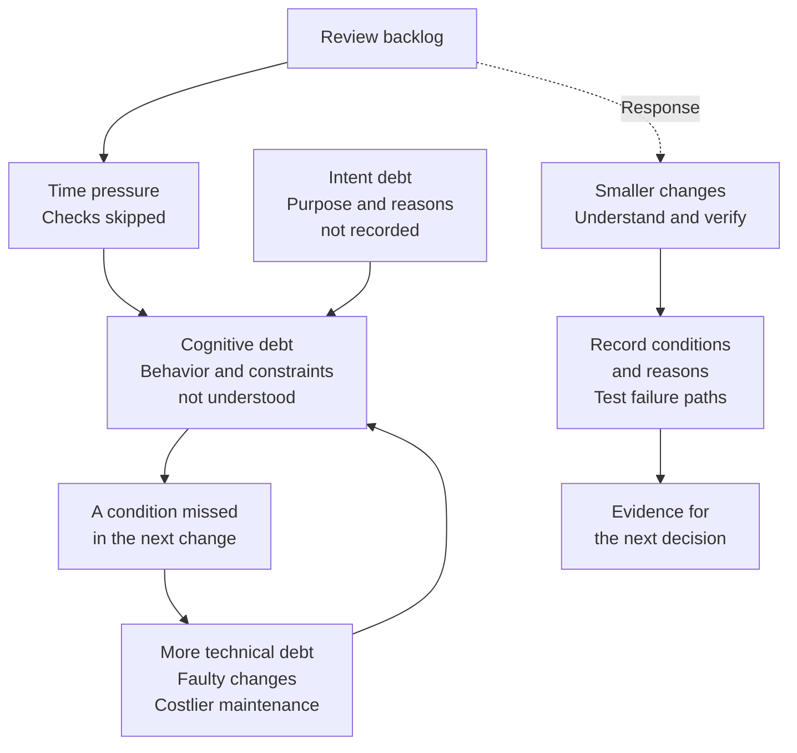
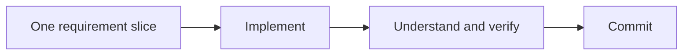
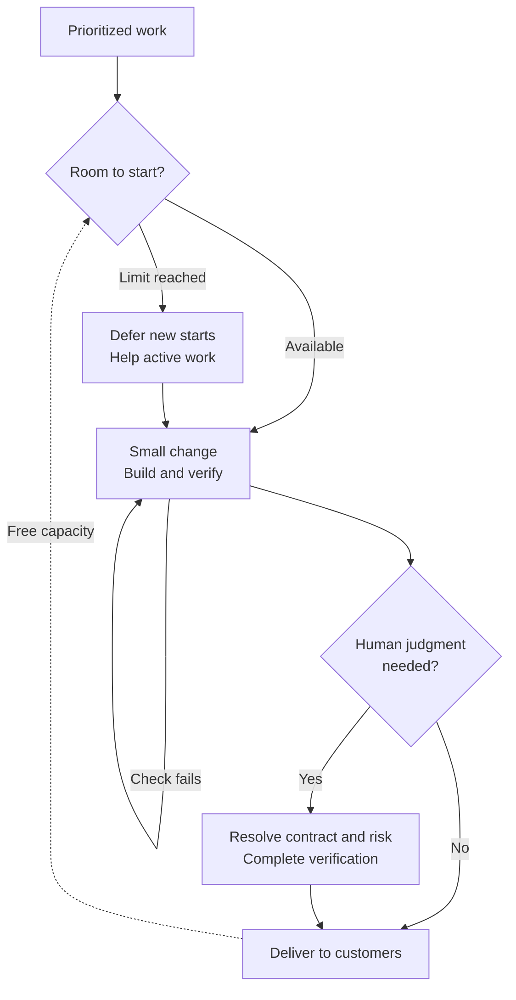
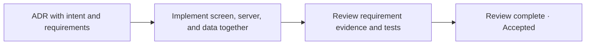

## TL;DR

- Individuals need changes they can understand and verify in small units.
- Teams need limits on work already started but not finished.
- Evaluate improvements through delivery cost, completed output, and quality.

## Introduction

While talking with a customer about AI coding, I heard that reviewing agent-generated code creates overwhelming cognitive load: the mental effort of holding information needed to understand and judge the work.

Looking back at my own experience, I realized I had rarely felt that way.

I suspect that is because I started using AI coding tools with the beta version of GitHub Copilot.

The models were not reliable enough to handle large tasks. I had to split problems into small pieces, make small commits and pull requests (PRs—requests to review and merge code changes), and keep the development feedback loop as short as possible.

As the models improved, I also learned gradually where I could and could not trust them.

People who begin AI coding today meet capable models from the start. They therefore seem more likely to ask for the largest result the model can produce in one pass.

The code arrives quickly, but changes that no human understands accumulate just as quickly.

I started to see this experience through the `Cognitive Load` dimension of Developer Experience described by Max Kanat-Alexander.[^1] A good Developer Experience reduces the amount of knowledge and the number of decisions required to complete a task.

The cognitive load removed by AI does not necessarily disappear. **It can move from implementation into review.**

For now, small changes and short feedback loops can divide that load. Over time, I think human review should focus on the contract between business requirements and code, with evidence showing whether the agent satisfied it.

We still need to preserve the understanding required for the next change. If review gets shorter but nobody on the team can explain the behavior, the cost may return during the next modification or incident.

At team level, individual habits cannot solve everything. Everyone may produce small changes, yet submitting them simultaneously can still overload their colleagues.

Individuals need to control how much they must understand at once; teams need to control how much work they start at once. The team's goal is to **keep unfinished work low while delivering more completed work to customers at the same quality**.

The first part explains cognitive load and individual responses. The later sections extend this to team work limits and bottleneck improvements. A separate introduction explains CTS-SW, the cost measure used to evaluate delivery.[^19]

## 1. Cognitive load during implementation has fallen

Paul Graham distinguishes between the Maker's Schedule and the Manager's Schedule.[^2]

A manager's day can be divided into one-hour blocks. A maker needs enough uninterrupted time to load a problem into their head, so half-day blocks often work better.

Traditional development fit this description well.

You read the surrounding code, understand the requirements and constraints, and build a mental model of the behavior. You keep that model active while writing and testing the code.

A meeting in the middle does not cost only one hour. You also lose the state that had not yet been transferred from your head into the code, then reread the code when you return.

An agent separates this process.

After a human provides the intent and constraints, the agent explores the code, implements the change, and runs tests. The human can do something else, and stepping away does not erase the files or task state the agent has already loaded.

At least during **implementation time**, context switching has become less expensive.

Makers gain a little room to work in manager-sized time blocks. Defining requirements and judging results still demand deep focus, but the human no longer needs to hold the same code in their head throughout implementation.

At first, I saw this as an uncomplicated improvement.

Once I started running multiple agents, however, I saw the cognitive load removed during implementation collect at the moment when their results had to be reviewed.

## 2. The missing understanding process collects in review

Traditional coding took time.

During that time, the developer repeatedly read both the new code and its surroundings. Implementation forced one decision after another, and each failed test updated the mental model along with the code.

By the time the work was complete, the developer generally knew why the structure looked this way and where the risks were. Code understanding was less a separate task than a byproduct accumulated during implementation.

Delegating implementation to an agent presents the completed result first.

The human starts with finished code and works backward to reconstruct what the agent read, which assumptions it made, and why it selected this implementation. There is no guarantee that a human can understand in a similar amount of time what an agent produced over tens of minutes.

Placed on a timeline, the change looks like this.

In traditional development, the burden of reading surrounding code, choosing among alternatives, and testing was distributed across implementation. In AI development, it rises while intent and constraints are defined, falls sharply while the agent codes, and rises again when the human must inspect the result and uncover hidden assumptions.


This is not a measurement of total cognitive load. It is a simplified model of where human effort may sit during the same task.

Rather than assuming AI automatically removes the total burden, I think it is more accurate to say that the understanding once accumulated during implementation is compressed into specification at the front and review at the back. If intent and constraints are weak at the start, the reviewer must reverse-engineer more agent decisions at the end, making the second peak even higher.

This is related to the familiar problem of large pull requests, but it is not exactly the same.

In a traditional large pull request, the author could explain the context gained during implementation. In an agent-authored pull request, the human responsible for the result may also need to learn that context from scratch.

Running multiple agents in parallel does not reduce this gap. It only accumulates unread changes faster.

The current review model, in which a human checks every result, therefore protects quality while also limiting throughput. If every line must be understood before work can proceed, development speed eventually converges on the human's reading speed.

Personally, I think this is the first cognitive-load bottleneck AI coding needs to address.

We already have many ways to generate code faster. The next question is how much of the result a human must understand and which evidence should be sufficient for trust.

This does not mean code understanding itself should disappear.

Geoffrey Litt distinguishes understanding for correctness verification from understanding needed to participate in the next change. Even when an agent produces a correct result, a human who learns nothing from the change loses the conceptual material needed for the next idea. The talk describes the accumulation of changes no one understands as `Cognitive Debt`.[^7]

I think this distinction supports contract-centered review. Instead of reading every line at the same depth, use contracts and evidence for correctness while preserving a human-readable explanation of the behavior needed for the next decision.

## 3. Deferred understanding becomes a cost in the next change

What happens if we respond to a review backlog simply by spending less time reading?

Cognitive load theory distinguishes the limited working memory used to hold and process information from knowledge structures acquired through experience.[^8] Applied to code, someone remembering unfamiliar states and exceptions individually may face a different burden from someone who recognizes them as one familiar behavior.

That is why reviewing 200 lines of familiar screen changes can feel different from reviewing 200 lines of unfamiliar payment retry logic. The latter requires understanding request order, stored state, and the conditions under which another call is safe.

Under pressure to approve quickly, I think it becomes easier to rely on passing tests or the agent's summary instead of tracing the behavior to the end. At that point, finding no problem can become indistinguishable from not having looked for one.

### Mistaking a plausible explanation for understanding

Automation bias is the tendency to trust automated results without checking them sufficiently. Zhou and colleagues examine such judgment biases in LLM-assisted development.[^11]

In observations of 14 developers, 48.8% of behaviors were classified as biased. Developer–LLM interactions accounted for 56.4% **of those biased behaviors**. That does not mean 56.4% of all AI interactions involved uncritical acceptance.

Shaw and Nave use the term `Cognitive Surrender` for accepting AI output as one's own judgment with little scrutiny. Their experiments involved reasoning problems, not code review, so they do not directly establish how developers review code.[^12]

The distinction still matters in review. Delegating repetitive work while checking evidence differs from accepting a result because the agent says it is fine. A fluent explanation needs a visible connection to code and tests.

### Separate the code, the team's understanding, and recorded intent

Margaret-Anne Storey's Triple Debt Model distinguishes technical, cognitive, and intent debt.[^10] This helps explain why the next change can be difficult even when the code looks clean.

| Type | What is missing or inadequate | A question to ask |
| --- | --- | --- |
| Technical debt | Code and structure that make future changes harder | Why does a small change require edits across several modules? |
| Cognitive debt | The team's shared understanding of system behavior | Can anyone explain what happens when an operation is retried after failure? |
| Intent debt | Recorded purpose, constraints, and reasons for decisions | Does a record explain why this behavior was chosen and which conditions must hold? |

Cognitive load is the effort spent reviewing now. Cognitive debt is a burden left for future work when changes pass without understanding. Reading difficult code does not automatically create debt; learning from it may reduce the burden of the next task.

Writing documentation does not automatically remove cognitive debt either. Recording a decision's rationale can reduce intent debt, but whether the team understands and can use it is a separate question.

Consider a hypothetical system that prevents duplicate payments by retaining payment identifiers throughout the retry period. The initial implementation meets that condition, but the reason may be absent from both documentation and the team's understanding.

Later, an agent asked to reduce storage costs shortens the retention period. If the reviewer misses the consequence, a problem enters the system. Existing tests may still pass if none checks a retry after the record has been deleted.

A gap in understanding can allow a bad change through or delay discovery of an existing defect. This is a path by which cognitive debt can create or increase technical debt.





This is a conceptual diagram of how the debts can interact, not an inevitable sequence established by one study. Unfamiliar code can be correct, and tests or static analysis may catch defects before a person does.

### What the studies actually measured

The relevant studies measure understanding, development time, and code quality in different ways. Combining them into proof that AI causes incidents through cognitive debt would go beyond their findings.

| Study | Finding | What it supports here |
| --- | --- | --- |
| Shen and Tamkin, 2026[^9] | In a new-library learning experiment with 52 mostly junior developers, the AI group averaged 50 on the quiz versus 67 without AI. | A 17-percentage-point difference in immediate understanding, not a measurement of long-term skill loss or production incidents. |
| METR, 2025[^13] | Sixteen experienced open-source developers took 19% longer with AI across 246 tasks in their own repositories. | A result for those tasks and early-2025 tools. The study did not isolate cognitive load as the cause of the delay. |
| DORA, 2024[^14] | A 25% increase in AI adoption was associated with 3.1% faster code review and 7.2% lower delivery stability. | A survey-based association, not causation. Faster review did not necessarily accompany better delivery stability. |
| Liu and colleagues, 2026, v2[^15] | A study of roughly 300,000 AI-attributed commits across 6,299 repositories found 22.7% of tracked static-analysis issues still present at the final observed revision. | Not a production incident rate. Without a human-only comparison or reviewer-understanding measurements, persistence cannot be attributed to cognitive debt. |

METR's 2026 follow-up produced estimates in the direction of a speedup, but participant and task selection biases prevented a reliable estimate of the current effect. DORA's 2025 findings also associated AI adoption with improved delivery throughput while continuing to find an association with instability.[^13][^14]

My takeaway is that **generation speed, human understanding, and quality after deployment need separate checks**. One measure alone cannot show where costs fell and where they moved.

## 4. Individuals: reduce what you must understand at once

At the moment, I see two practical approaches.

One moves the object humans must understand from code to a contract. The other keeps generated units small in areas where humans still need to read the code.

They are not mutually exclusive. A team can combine them according to the risk of the code and the strength of its tests.

### Understand the contract, not the entire codebase

The first approach moves human understanding from code to the **contract between business requirements and code**.

Here, a contract is not merely a document. It is the standard used to determine whether a business requirement is true in the implementation.

The human does not need to specify everything:

- Behavior visible to users
- Conditions that must always hold
- Architectural boundaries that must not be crossed
- Decisions the agent may make independently
- Situations that must return to a human

Trying to write a perfect document from the start begins to resemble implementing the feature in advance.

Some constraints become visible only after opening the code. Specifying algorithms and class structures also removes useful implementation freedom from the agent. A better approach is to provide a thin statement of intent and acceptance criteria, let the agent explore the repository, and feed discovered facts back into the contract.

Facts that must survive future implementations belong in a Product Requirements Document (PRD) or an Architecture Decision Record (ADR). An ADR should record the choice, its reasons, alternatives considered, and conditions that must hold. Data structures or function boundaries that matter only to the current implementation can stay in the code.[^3]

The agent implements and tests against the contract, then reports what satisfied each requirement and which evidence supports it.

The coding agent's responsibility should shift from producing a lot of code to satisfying the complete contract and proving that it did so.

The human then checks two things:

- Were all explicit contract conditions satisfied?
- Which decisions outside the contract were based on assumptions?

Before reading an entire payment implementation, for example, the reviewer might begin with the following report. This is a hypothetical format for separating verified results from unresolved decisions, not an actual test run.

```text
Requirement
- The same payment_id must never be charged twice.
- A retry with the same payment_id, amount, and currency returns the existing result.

Verification
- duplicate_webhook_does_not_charge_twice: PASS
- retry_after_timeout_returns_previous_result: PASS

Implementation discretion
- Store a key identifying repeated requests in the existing Redis store.
- Follow the key format used by neighboring modules.

Condition still requiring verification
- Duplicate-charge prevention across record retention and loss: UNVERIFIED

Open product decision
- What happens when the amount or currency changes for the same payment_id?
- Recommendation: reject the request as a conflict.
- Alternatives: return the existing result / ask for a new payment_id.
- Impact: this changes payment safety and data meaning, so ask a human.
```

Preventing duplicate charges and choosing the retry response are separate requirements. This example assumes both were agreed. Two passing tests do not complete the work while retention, loss, and product decisions remain unresolved.

This does not mean implementation details are never inspected.

Start with requirements and tests, then check the assumptions behind decisions not covered by the contract. Drop into the code only when the evidence is weak or the risk is high.

An assumption here does not mean exposing the model's internal chain of thought.

It means an externally verifiable premise on which the code depends: whether the payment provider retains results, whether the customer organization information in a request is trustworthy, or whether completion notifications arrive once and in order.

If a false premise would break the contract or safety boundary, it must be checked against code, tests, configuration, or authoritative documentation. If it cannot be verified, the work should remain incomplete and return to a human as an unverified risk.

Not every gap in the contract needs to become a question.

The agent should first derive obligations that logically follow from the explicit contract, then follow repository conventions and neighboring code. If a gap remains, it can consult an authoritative protocol or domain rule and choose a reversible default that does not change external behavior.

Function names and internal data structures can remain implementation discretion. Assumptions that change user-visible behavior, data meaning, security, or permission boundaries need a new contract or decision.

When several product choices remain, the agent should not merely ask a vague question. It should present a recommendation, the reason, realistic alternatives, the effect of each, and the contract language that would need to be added.

Bad tests or missing contract requirements can still cause failures. Even so, narrowing review from the entire codebase to requirements, evidence, and exceptions is a substantial improvement.

Perfect contract compliance does not mean declaring that errors are impossible.

It means the agent does not hide an unverified contract item behind a successful status. If evidence is missing or a new decision is required, the agent stops and escalates instead of silently closing the work.

### Divide work into units a human can understand

Some code cannot yet be approved from contracts and tests alone.

Security, payments, and data migrations are examples where implementation choices directly create risk. Humans may also need to read code in older systems with weak test coverage.

In these cases, the important limit is not the number of files but **the number of new concepts that must be understood at once**.

Instead of creating one pull request for an entire payment feature, the work could be divided like this:

```text
PR 1 - Add the Payment state model
PR 2 - Isolate payment-provider calls behind a replaceable interface
PR 3 - Prevent duplicate charges
PR 4 - Finalize state from the provider's completion notification (webhook)
```

Each pull request should make clear why the change is needed, which new concept it introduces, which conditions must hold, and which tests demonstrate them.

Waiting for each small pull request to merge before starting the next one, however, wastes much of the agent's generation speed.

Stacked pull requests reduce this cost by allowing later work to continue on top of an unmerged earlier pull request.[^4] The agent keeps moving while the human reviews only the newly added material in sequence.

From the cognitive-load perspective, stacked pull requests divide one large review peak into several smaller peaks.


The human still cannot accumulate understanding during the early implementation period before the first pull request is reviewable. The load is not spread evenly across implementation as in traditional development; it appears as several smaller units near the end.

Each peak is also larger than the pull request diff alone.

Understanding one pull request requires the previous behavior, decisions made in earlier pull requests, the effect on later pull requests, and the scope that must be rechecked after revisions.

```text
Actual review scope
= current PR diff
+ behavior before the change
+ decisions in earlier PRs
+ effects on later PRs
+ scope to recheck after revisions
```

Stacked pull requests therefore retain a base load for surrounding context underneath the smaller peaks. As the stack grows, the real understanding scope becomes wider than each individual diff.

I still find stacked pull requests useful because they reduce how much context must be restored at once and lower the instantaneous review peak. But a human remains involved at every step, and if the agent gets several pull requests ahead, the context the reviewer must recover grows again.

#### Turn the development cycle into a small hill

In practice, reducing this load requires more than splitting pull requests. **The development cycle itself must close at a small scale.**

Define one piece of the requirement. Let the agent implement it. Have a human understand and verify the change, then commit it before moving to the next piece.





Small generated units do not create a small development cycle unless human understanding closes at the same boundary. If four small pull requests are stacked first and read in one batch later, generation was divided but the development cycle remained large.

Climbing a neighborhood hill three times is not the same as climbing one large mountain with a similar total elevation.

The large mountain demands more preparation, sustained effort for longer, and slower recovery. Some people cannot complete it with their current capacity.

AI implementation does not change where the peaks occur.

A small cycle still starts with human work to define intent and constraints, drops while the agent implements, and rises again when the human understands, verifies, and commits the result.

The difference is whether the whole feature closes as one large cycle or as several smaller cycles with the same shape. In the following graph, each color represents one cycle that closes only after understanding and commit.


I do not think cognitive load can be compared by adding up a total area alone.

People differ in how much context they can hold at once. Even the same person's capacity changes with domain experience, practice, fatigue, and interruption. The capacity line in the graph therefore sits at a different height for each person and situation.

When a review exceeds current capacity, the cost is not merely slower reading. The reviewer repeatedly loads fragments of context, restores what was lost, and rereads affected areas after revisions.

The longer the review lasts, the longer the person must sustain high cognitive load. Small development cycles lower each peak and make an understood, verified change the starting point for the next cycle.

A commit does not store understanding by itself. Leave decision reasons and tests that the next person can find. Repeatedly losing track of conditions while reading can signal that the cycle is still too large or that the surrounding context needs a better explanation.

## 5. Individuals: build understanding during review

Even a small change can leave someone unsure where to start reading unfamiliar behavior. Cognitive scaffolding provides reading sequences and questions that help the person build that understanding. Like scaffolding around a building, it offers a way to approach the work in manageable steps.

For the payment example, I would organize review material in the following order instead of starting with the diff, which shows the code before and after a change. The final technique, dividing perspectives, extends this reading approach to colleagues.

### Start with purpose and flow, then inspect the necessary code

First, show what changed, which components a request passes through, and where state is stored in one diagram. Then connect the conditions that must hold to test results. Finally, inspect the code where those conditions might fail.

Presenting information in stages is called progressive disclosure. Each explanation should lead directly to actual code and executed tests so the summary does not become a screen hiding the implementation.

For a payment retry, begin with “request → check stored payment record → return existing result.” Then inspect what happens when the record is missing or two requests arrive together. If the evidence for safe concurrent handling is weak, read that implementation.

High-risk changes may need inspection even when automated checks show no warning. Payment retention, permission checks, and data migrations are reasonable places to plan deep review from the start.

### Read tests first, while looking for missing conditions

Reading tests first can reveal the intended change through inputs and expected results. This sequence is called Test-Driven Code Review, or TDR.[^17]

In Spadini and colleagues' experiment, reviewers who read tests first found more defects in test code, but found the same proportion of production-code defects and fewer maintainability issues. That does not establish a universally faster or more accurate review method.

I would use tests as a starting point, comparing them against the contract for missing conditions. An agent that writes both implementation and tests may repeat the same mistaken assumption in both.

In the payment example, a test showing that an immediate retry returns the existing result is not enough. The reviewer also needs to check whether the contract covers retries after record loss and whether a test verifies that condition.

### Explain the behavior before reading the answer

Participants in the Anthropic study who asked for explanations after generation or asked conceptual questions achieved relatively high quiz scores. Those usage patterns were not randomly assigned, so adding questions alone does not guarantee the same effect.[^9]

In practice, a reviewer could first answer a few questions when learning new behavior or reviewing a high-risk change. For the payment example:

- If the external payment succeeds but its response is lost, what must a retry check?
- Which guarantee breaks when the duplicate-prevention record disappears?
- What behavior has been agreed for the same payment identifier with a different amount?

Before reading the agent's answer, explain the expected behavior and reason in a sentence or two. If the answer is unclear, inspect the relevant state transition or test and ask the agent for a question pointing to that part. Then compare the explanation with the code.

DeepCodeTutor also studied explanations in the learner's own words, supported by incremental hints. However, its student experiment found no statistically significant difference in overall learning gains between the treatment and control groups. It is not evidence of reduced defects in professional code review.[^18]

I would use these questions selectively for unfamiliar behavior or an important handover, rather than making a quiz mandatory for every PR. Memorizing answers written and graded by a model adds an approval step. **Answering questions checks understanding; evidence that the code is correct is still required separately.**

### Divide the review questions among perspectives

If one person cannot track security, performance, and business rules at once, divide the questions. Perspective-Based Reading (PBR) assigns perspectives such as tester, developer, and user. Basili and colleagues' early experiments reported broader team defect detection in requirements documents.[^16]

Applied to code review, one person could inspect access to payment records, another retries and concurrent requests, and another agreed user behavior and tests. The original experiment did not directly measure lower cognitive load in AI code review; this is an adaptation of its way of dividing review scope.

Afterward, reviewers still need to compare findings that cross those boundaries. A shorter retention period chosen for performance may break duplicate-payment prevention. Dividing roles does not remove the need to examine assumptions that affect another perspective.

If I introduce these methods, I want to measure more than approval time. Can the maintainer explain failure behavior afterward? Does the next change require less time reconstructing context? Does rework caused by missed conditions decline?

## 6. Teams: separate work to do from work already started

Even when individuals understand and verify small changes, several people running agents in parallel can grow a team's review queue. My small PR may be the twentieth PR a colleague receives today.

Distinguish the Backlog, the list of work to do, from Work in Progress (WIP), work already started but not finished. A long list does not require starting everything simultaneously.

A hypothetical team with 100 work items could operate as follows.

| State | Items |
| --- | ---: |
| Backlog, not yet started | 94 |
| Implementation | 2 |
| Review or waiting for review | 2 |
| Deployment or waiting for deployment | 2 |
| Total unfinished work in progress | 6 |

The team has not abandoned the other 94 items. It progresses six according to priority and starts more as work finishes. Putting an item in the backlog does not promise its deadline or priority; choosing business commitments remains a separate decision.

Here, software inventory means **work the team has started but has not delivered to customers**. It includes detailed design, revisions, verification, and deployment queues. An agent finishing code or a PR being merged does not remove the work from this inventory.

Count each item in one current state to avoid duplication. Splitting one item into three PRs need not turn it into three customer-delivered work items.

A WIP limit caps this accumulation. DORA recommends improving delays elsewhere in the process, rather than raising the limit, when people gain spare capacity because a limit has been reached.[^20]

### Start work according to downstream capacity

Backpressure communicates the capacity of later stages, such as review and deployment, to control new work upstream. Work advances when the next stage has room to accept it.





When review is full, help existing work by strengthening tests, organizing evidence, or splitting changes that are hard to inspect. AWS also recommends helping active work and improving tools and knowledge when a WIP limit is reached.[^21]

That work still has a cost. Assign an owner and time to a separate improvement and count it in WIP. Link verification improvements for an existing change to that item. An unlimited improvement queue would recreate the problem.

If verification capacity is still insufficient, new feature generation really must slow temporarily. Combine a limit that stops immediate accumulation with improvements that enable more completion later. Keeping every stage busy does not guarantee higher team throughput.

## 7. Teams: turn a signal into diagnosis and action

A growing queue does not identify the remedy. First distinguish time waiting for reviewer assignment, time actively reading and checking, and time spent revising and reviewing again.

| Signal | Possible cause to examine | Intervention to try |
| --- | --- | --- |
| Longer review waits | No owner, or work concentrated on one expert | Clarify ownership, review together, share knowledge |
| Longer active review | Several concepts in one change, missing context | Split by independently verifiable behavior; improve purpose, flow, and evidence |
| Repeated revisions | Ambiguous requirements or missing tests | Resolve contract gaps and test failure conditions |
| Repeated comments | Checkable rules still depend on people | Move checks into static analysis, architecture tests, and instructions |
| Persistent overload across reviewers | New work exceeds verification capacity | Limit new starts; assign capacity to automated checks and review support |
| Review finished but delivery delayed | Test environments, another team's approval, manual deployment | Fix the actual environment, permission, or cross-team dependency |

Larger PRs and longer waits occurring together do not establish causation. Trace a few waiting items, apply one intervention, and check completed output and quality again.

### Reduce the amount that requires human judgment

Teams have two broad options: **reduce the review demand reaching people, or help them complete necessary reviews with less effort**.

Contracts and tests can help with the first; context explanations and joint reviews can help with the second. DORA also recommends small batches, automated checks during authoring, and reconsidering verification practices in response to large AI-generated changes.[^14]

The following is an example routing policy based on risk and evidence. It requires team agreement; it is not an automatic approval rule based on file type.

| Nature of the change | Example review path |
| --- | --- |
| A repeated change within an agreed scope, with no change to external behavior, permissions, or data meaning | Close through trusted automated checks; retain results and sample them for review |
| Business behavior changing within an existing contract | Have a person inspect contract evidence and changed assumptions |
| Payments, authentication, permissions, data migration, or a new product decision | Have the responsible person inspect failure paths and implementation in depth |

One line of wording or configuration can change permission or payment meaning. Do not approve merely because an agent labels a change low risk. Inadequate classification evidence or verification coverage should route it to a person.

PR counts can also misrepresent demand. Splitting one PR into three increases the count but may reduce the context each review requires. It may instead increase total time if the same person must reconstruct the background three times.

Compare available review time and required review time in the same units. As a hypothetical calculation, 30 daily changes requiring 20 minutes each create ten hours of demand. With five available review hours, demand is twice capacity, so the process cannot be sustained.

Automated checks may handle some repeated changes, while better evidence reduces review time for the rest. Measure the actual human time after the change; do not arbitrarily subtract a few PRs for automation and a few more for splitting.

Even equal average demand and capacity can leave queues when complex changes or leave coincide. Preserve room for exceptions and adjust limits using the work that waits longest.

## 8. Teams: read unfinished work alongside CTS-SW

CTS-SW measures the cost of one software unit delivered to customers.[^19] Separate flow measures help reveal whether unfinished work is accumulating while that cost falls.

I would start with completed items, average WIP, old work, and quality. Average WIP is the average of counts recorded at equal time intervals. For old items, distinguish time since work started from time spent waiting for review.

### Compare average WIP with completion rate

The following hypothetical periods track similarly sized customer changes using consistent definitions, day lengths, and period lengths, with no cancellations.

| Measure | Before adoption | Early AI adoption |
| --- | ---: | ---: |
| Cost per customer-delivered change | $500 | $400 |
| Changes delivered per day | 4 | 4.8 |
| Average WIP | 10 | 40 |
| Average WIP / daily completions | 2.5 days | About 8.3 days |

Delivery cost fell and daily completion rose 20%, while unfinished work quadrupled. Before labeling this a success or failure, investigate why unfinished work grew.

Dividing average WIP by average completion rate connects to Little's Law.[^21]

```text
Average WIP = average completion rate × average cycle time

Example: 10 items / 4 items per day = 2.5 days
```

Use the same work unit and the same start and finish boundaries. This example counts changes delivered to customers, not deployments. Dividing 20 open PRs by four daily deployments to claim five days mixes different units.

Under stable long-run flow and consistent boundaries for entering and leaving work, the ratio can be related to average cycle time. In a short period with rapidly growing WIP, use it as a supporting ratio and inspect actual completed-item times and open-item ages. It does not predict when a particular PR will finish.

Canceled work leaves WIP but is not customer-delivered output. When cancellations are substantial, do not estimate the average time of all work from delivered output alone; track cancellation counts and time separately.

I would display the calculation and units rather than give the ratio a new standard-sounding name. Mixing backlog size or agent-completion counts into it would change what it means from one week to the next.

### Inspect pending judgments and old work

Ten routine items and ten payment or authentication changes can impose different review burdens. Alongside total WIP, show items waiting for human judgment, estimated review time, and areas dependent on a small number of experts.

Risk weights such as 1, 2, and 4 are possible, but four times the risk does not imply four times the review time. These scores are team assumptions, not validated measures of cognitive debt. If used, calibrate them against review records and keep risk separate from estimated effort.

Read queue length and age together. Ten items cleared the same day call for a different response from four items stuck for several days. Averages and medians can hide a few very old items, so also inspect the oldest work and items beyond an agreed age.

I would not impose a universal rule such as “more than 24 hours is dangerous.” Set criteria according to release cadence, change risk, and actual capacity, then record why items are delayed.

### Apply one improvement and check again

Each week, inspect CTS-SW and completion alongside WIP, waiting time, rework, and change failures. If a problem appears, use the diagnostic table to choose one intervention.

Adding an explanation will not solve a two-day wait caused by an unassigned reviewer. Conversely, if reviewers repeatedly reconstruct context, improve contracts and evidence before assuming more people are needed.

A smaller queue is not a solution if superficial approvals increase rework or incidents. Include improvement work in cost and check whether more work reached customers at the same quality.

## 9. Move recurring decisions into the team harness

If an improvement remains one person's technique, the bottleneck can return when they are away. Shared contracts, tools, and tests make the improvement usable in later work.

When the normal path has sufficient evidence and exposes its out-of-contract assumptions, it should not require repetitive human approval.

Escalation should be reserved for contract changes, conflicts with existing decisions, important assumptions, and high-risk exceptions that automation could not verify. Human involvement then becomes a mechanism for contracts and exceptions rather than a default step in every implementation.[^6]

If reviewers repeatedly point out the same module dependency direction, turn it into an architecture test. For example, automatically check that business-rule modules do not import screen modules. If reviewers repeatedly check the same requirement, turn it into a test case. Improve the harness—the working instructions, tools, and verification environment—so the next agent avoids the mistake from the beginning.[^5]

Schedule this as team work instead of relying on spare personal time. Building and operating the harness is part of AI adoption cost alongside tool fees. The Amazon teams discussed in the Frontier Development post also invested in context, tests, and tools.[^23]

Problems across team boundaries may require changes in ownership. Team Topologies describes reducing the cognitive load of teams delivering customer value through platforms, learning support, and separate ownership of complex specialist areas.[^22] Common tools and expert support may work better than requiring every product team to learn every operational and security detail.

I think the same principle applies at organizational level. Prioritize incoming requests without starting more projects than teams can finish. More agents should not automatically expand one team's product and operating responsibilities without limit.

In the [ALPS Writer Plugins](https://github.com/haandol/alps-writer-plugins) that I maintain, I have built in criteria for dividing work and verifying implementation against its contract.[^3]

An ALPS Feature is written as a vertical slice: one complete user-observable behavior spanning the screen, server, and data. If the unit is too large, it is divided along independently demonstrable user behavior rather than technical layers.

`/feature-to-adr` moves the contract for that slice into an ADR. `/adr-impl` implements and tests the screen, server request handling, and data together. Mapped to the small AI cycles above, the flow looks like this:





If a slice cannot be divided further by meaning, stacked pull requests can still be used inside it. Each pull request gets one review question and its own tests to lower the instantaneous peak, while the full contract and surrounding context remain active until the stack closes.

Completion review connects each contract item to the implementation, code evidence, and executed tests. The agent repairs code and test defects that do not alter the contract. Humans decide only new contracts, contradictions, and important unverified risks.

I recently added an implementation explanation similar to `Explain Diff` to ADR Writer. It connects the ADR's purpose and scope, the behavior before and after the change, the actual request flow, state and failure paths, and tests to concrete code evidence.

This explanation is a place to apply the progressive disclosure from Section 5. Start with purpose and before-and-after behavior, follow request and failure paths, and inspect the code evidence where needed.

The explanation does not judge whether the implementation is correct. It helps a person understand enough to participate in the next change, while contract-level evidence and executed tests determine whether the work is complete.

The current tooling does not measure individual cognitive capacity or prove that a human understood every commit. It does not manage team WIP limits or delivered output either. It does give each vertical-slice ADR a boundary for what one cycle must implement, verify, and close, which helps create smaller development cycles.

## Conclusion

Starting with the early Copilot releases forced me to develop the habit of splitting problems and changes into small pieces.

Even after newer models became capable of large tasks, I kept short development feedback loops instead of asking for the maximum amount of code in one pass. That may be why I did not feel the review burden as strongly.

For now, I want to keep **the development cycle from building through understanding, validation, and committing** small. When the same judgment recurs within that cycle, I want to move it into contracts and tests so the next review does not have to repeat it.

Over the long term, I think we should move recurring human judgments into the harness to remove repeated human intervention, or Human-in-the-Loop (HITL), from normal execution paths. Understanding behavior in preparation for the next change is different from approving the same conditions every time.

At team level, I want to add limits on unfinished work and deliberate bottleneck improvements. When verification has no room, help work already started reach customers.

I want more work completed at the same quality. Adjusting both individual understanding scope and team WIP, then checking delivery cost, completed output, and quality, is how I think AI generation speed can become a team result.

---

[^1]: Max Kanat-Alexander, [What Makes a Great Developer Experience?](https://www.codesimplicity.com/post/what-makes-a-great-developer-experience/) (2025).

[^2]: Paul Graham, [Maker's Schedule, Manager's Schedule](https://www.paulgraham.com/makersschedule.html) (2009).

[^3]: [Why Separate PRDs, ADRs, and Code? — Reading One Abstraction Level at a Time](/en/2026/07/25/alps-adr-abstraction-boundaries.html) — explains how PRDs and ADRs become contracts for code generation and review.

[^4]: GitHub Docs, [Stacked pull requests](https://docs.github.com/en/pull-requests/reference/stacked-pull-requests) — explains how dependent pull requests form a stack while each change remains independently reviewable.

[^5]: [How I Built the EncBird Harness Layer by Layer](/en/2026/06/16/harness-engineering-in-practice.html) — describes moving recurring human decisions into rules, tools, and guardrails.

[^6]: [A Lens for Agentic Engineering](/en/2026/06/12/lens-for-agentic-engineering.html) — explains the view of agentic engineering as removing human-in-the-loop steps from the normal path.

[^7]: Geoffrey Litt, [Understanding is the new bottleneck](https://www.geoffreylitt.com/2026/07/02/understanding-is-the-new-bottleneck) — distinguishes understanding for correctness from understanding needed to participate in the next change and introduces `Explain Diff`. [Video with Korean and English subtitles](https://youtu.be/x3e_Yl4NNHY).

[^8]: John Sweller, [Cognitive Load During Problem Solving: Effects on Learning](https://doi.org/10.1207/s15516709cog1202_4) (1988). Examines the relationship between resources used for problem solving and acquiring knowledge structures. It does not measure AI code review.

[^9]: Judy Hanwen Shen and Alex Tamkin, [How AI assistance impacts the formation of coding skills](https://www.anthropic.com/research/AI-assistance-coding-skills) (2026). A randomized study involving the unfamiliar Python library Trio. The usage-pattern analysis is observational; the task-speed difference was not statistically significant.

[^10]: Margaret-Anne Storey, [From Technical Debt to Cognitive and Intent Debt](https://arxiv.org/abs/2603.22106) (2026). A conceptual model separating code evolvability, shared understanding, and externalized purpose and rationale.

[^11]: Xinyi Zhou and colleagues, [Cognitive Biases in LLM-Assisted Software Development](https://arxiv.org/abs/2601.08045) (2026). Combines observations of 14 developers with a survey of 22 additional developers. Classified behavior proportions are not population-wide probabilities of bias.

[^12]: Wharton, [Thinking Fast, Slow, Artificially: AI and Your Brain](https://executiveeducation.wharton.upenn.edu/thought-leadership/wharton-at-work/2026/05/thinking-fast-slow-and-artificially/) (2026). Describes Steven Shaw and Gideon Nave's reasoning-task experiments with explanations from the researchers.

[^13]: METR, [Measuring the Impact of Early-2025 AI on Experienced Open-Source Developer Productivity](https://metr.org/blog/2025-07-10-early-2025-ai-experienced-os-dev-study/) (2025). The follow-up, [We are Changing our Developer Productivity Experiment Design](https://metr.org/blog/2026-02-24-uplift-update/) (2026), explains tool changes and participant and task selection biases that limit applying the original result to current development.

[^14]: Google Cloud, [Highlights from the 10th DORA report](https://cloud.google.com/blog/products/devops-sre/announcing-the-2024-dora-report) (2024). DORA's subsequent [Balancing AI tensions](https://dora.dev/insights/balancing-ai-tensions/) discusses the 2025 throughput and instability findings and the shift from generation to verification.

[^15]: Yue Liu and colleagues, [Debt Behind the AI Boom: A Large-Scale Empirical Study of AI-Generated Code in the Wild, v2](https://arxiv.org/html/2603.28592v2) (2026), Table VI and Section VIII. Of 464,900 traceable issues, 105,364 persisted. Static-analysis false positives and tracking errors are limitations. This is separate from Sonar surveys and GitClear's code-churn analysis.

[^16]: Victor R. Basili and colleagues, [The empirical investigation of Perspective-Based Reading](https://doi.org/10.1007/BF00368702) (1996). Experiments with NASA developers reviewing requirements documents from different perspectives.

[^17]: Davide Spadini and colleagues, [Test-driven code review: an empirical study](https://sback.it/publications/icse2019a.pdf) (2019). Studies how reading tests first affects detection of defects and maintainability issues, alongside practitioners' perceptions.

[^18]: Priti Oli and colleagues, [Improving Code Comprehension through Scaffolded Self-Explanations](https://par.nsf.gov/servlets/purl/10447589) (2023), Section 4. The overall group comparison was not significant; differences by prior knowledge were observed within the treatment group.

[^19]: [Did AI Coding Tools Actually Cut Development Cost? — Understanding CTS-SW](/en/2026/08/14/cts-sw-software-delivery-cost.html) — defines and calculates cost per delivered unit and explains how to read it alongside quality and unfinished work.

[^20]: DORA, [Work in process limits](https://dora.dev/capabilities/wip-limits/) — recommends visualizing the entire delivery process and improving constraints rather than raising limits when they create spare capacity.

[^21]: AWS Enterprise Strategy, [Deliver Faster by Limiting Work in Progress](https://aws.amazon.com/blogs/enterprise-strategy/deliver-faster-by-limiting-work-in-progress/) — connects WIP, throughput, and cycle time through Little's Law and recommends helping active work finish before starting more.

[^22]: Team Topologies, [Key Concepts](https://teamtopologies.com/key-concepts) — explains team cognitive load, flow of value, and platform, enabling, and complicated-subsystem team roles.

[^23]: [Why Did Some Teams Get Up to 10x Faster with the Same AI Tools? — Five Habits of Frontier Development](/en/2026/08/31/frontier-development-habits.html) — discusses Amazon teams' investments in context, tools, tests, and intent, with limits on interpreting the observations.
