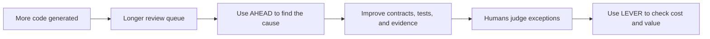

## TL;DR

- In Shape, measure harness learning and review burden.
- In Scale, combine CTS-SW with business outcomes.
- AHEAD and LEVER are question sets, not composite scores.

## Introduction

When I first defined the 3S model in [part 1](/en/2026/06/15/organizational-ai-adoption-3s.html), I put Efficiency in AHEAD and Extraction Efficiency in LEVER.

Because both items focused on cost, the distinction between Shape and Scale became unclear. They also failed to expose how savings in code generation can move into review, CI, and operations.

While writing [the August 18 post](/en/2026/08/18/ai-coding-review-cognitive-load.html), I became convinced that the first question in Shape is not whether cost has fallen, but **whether the burden of understanding and approving results is actually decreasing**.[^1]

While working on [the August 14 CTS-SW post](/en/2026/08/14/cts-sw-software-delivery-cost.html), I also concluded that cost in Scale should mean the end-to-end cost of reaching customers, not token spend or implementation time.[^2]

I therefore changed the `E` in AHEAD from `Efficiency` to `Evidence Quality`, and redefined the first `E` in LEVER as `End-to-end Efficiency`.

AHEAD examines whether the harness learns and reduces recurring human decisions during Shape. LEVER examines whether reusing that harness during Scale lowers total cost and time while creating business value.

These remain evaluation lenses that I am proposing. They are not validated standards or formulas for one score.

## 1. Evaluate from the beginning, but ask different questions

Evaluation does not begin only after a workload reaches Scale.

Before adoption, record the time, quality, cost, and human intervention in the current workflow. During Streamlining, verify that the agent has the data, tools, and permissions required to complete the work.

During Shape, look for failures becoming part of the harness and review burden declining.

During Scale, examine customer delivery cost, delivery time, and business outcomes.

| Stage | First question | Evaluation focus |
| --- | --- | --- |
| Streamlining | Can the agent complete the workflow end to end? | Boundaries, data, tools, permissions, and baseline |
| Shape | Do failures and review feedback change the harness? | AHEAD |
| Scale | Does harness reuse reduce the cost of delivering value? | CTS-SW and LEVER |

Applying Scale ROI directly to Streamlining and Shape makes necessary foundation work look like failure.

The opposite is also dangerous. If a production workload is permanently labeled a learning experiment, nobody has to explain its cost or results. Stage names should change the next decision, not merely justify investment.

## 2. AHEAD — measure harness learning and review burden

During Shape, the important question is not how many artifacts an agent produced, but whether recurring failures and decisions are becoming less common.

The updated AHEAD consists of five questions.

| Dimension | Question | Signals to inspect |
| --- | --- | --- |
| **A — Autonomy Boundary** | Does the normal path close automatically while new contracts, contradictions, and high-risk exceptions reach a human? | Repetitive approvals, escalation accuracy, approval waiting time |
| **H — Harness Learning** | Do failures and review feedback become contracts, evaluation cases, tests, rules, or tools? | Repeated failures, automated manual checks |
| **E — Evidence Quality** | Can a human judge from contracts and evidence without reconstructing the entire implementation? | Contract-level verification, exceptions requiring code inspection |
| **A — Adoption** | Does the domain team use the workflow in real work and improve it directly? | Production workloads, domain feedback, transfer of ownership |
| **D — Dependability** | Do quality, safety, stability, and failure controls stay within agreed boundaries? | Regressions, incidents, rollbacks, missed risks |

`Autonomy Boundary` does not mean maximizing the automation rate.

Low-risk normal paths with clear contracts should let the agent complete implementation and verification. Contract changes, conflicts with existing decisions, and security or data risks must still reach humans reliably.

Low human involvement alone does not prove good autonomy. If necessary escalations disappear as well, Dependability has declined.

`Harness Learning` does not count failure reports.

It asks whether recurring review decisions became contracts, tests, rules, or tools available to the next agent. If humans keep finding the same issue, the harness has not learned.

The new `Evidence Quality` item directly addresses review cognitive load.

If an agent reports only that the tests passed, the human still has to read the code from the beginning. To narrow review, the result must show what satisfied each contract, which evidence supports it, which risks remain unverified, and which new decisions were made during implementation.

Better Evidence Quality does not mean a longer report.

It means the scope a human must newly understand has narrowed to contract changes and exceptions. Security, payments, and data migrations may still require code inspection, but every change should not receive the same review depth.

`Adoption` looks at operational ownership rather than tool logins.

The domain team must trust the output, classify failures, and change evaluation criteria directly. If the workflow stops when the harness engineer leaves, it has not yet become an organizational capability.

The five AHEAD dimensions should not be collapsed into one score.

Maximizing Autonomy can reduce Dependability. Maximizing Dependability can damage Evidence Quality and Adoption. I think the dimensions work better as a dashboard of side effects. This follows the same reasoning behind SPACE's warning against reducing productivity to one activity metric.[^3]

## 3. The boundary between Shape and Scale

Passing a representative evaluation set several times is not enough to declare Scale.

The following conditions need to appear together:

- Recurring failures become contracts, tests, rules, and tools.
- Normal paths complete without repetitive human approval.
- Humans receive contract changes and important exceptions accurately.
- The domain team manages the harness and operational metrics directly.
- Monitoring, rollback, and responsibility boundaries are ready.

If review queues keep growing or humans must reconstruct every implementation, Shape is not complete.

Declaring Scale after improving only code generation increases change volume while moving the bottleneck into review, CI, and operations. DORA's description of AI as an amplifier of existing organizational strengths and weaknesses reflects the same dynamic.[^4]

Moving to Scale is not a declaration that the harness is perfect.

It means the defined scope can operate with repeatable quality and risk controls, and that new contracts or exceptions can send the workload back into Shape.

## 4. LEVER — measure end-to-end delivery cost and value capture

During Scale, examine what changes when the same harness is reused for the next requirement.

The updated LEVER is:

| Dimension | Question | Signals to inspect |
| --- | --- | --- |
| **L — Lead Time** | Has the time from requirement to operable customer-facing feature fallen? | Development, review, CI, and deployment waiting time |
| **E — End-to-end Efficiency** | Has total delivery cost fallen without reducing quality? | CTS-SW, human time, retries, operating cost |
| **V — Value Realization** | Which business outcome did the automation create? | Cost reduction, capacity, revenue, risk reduction |
| **E — Extension & Reuse** | Are contracts, evaluations, guardrails, and connectors reused for new workloads? | Additional setup, reuse scope, new build effort |
| **R — Reliability** | Does quality and recoverability hold as delivery volume rises? | Change failures, incidents, rollbacks, recovery time |

I changed `Extraction Efficiency` to `End-to-end Efficiency` because cost moves.

Even when code generation time and token use fall, efficiency has not improved if review queues, CI retries, and incident response grow. The total cost of models, tools, humans, and operations must be connected to software that reaches customers.

CTS-SW can provide a starting point for this dimension.[^2]

CTS-SW itself is not business value. A cheaper deployment can still deliver a feature that customers do not want.

That is why `Value Realization` remains separate.

The definition of value depends on the workload. At the beginning, decide whether success means faster customer request handling, more capacity with the same team, higher revenue, or lower operational risk.

`Extension & Reuse` examines additional preparation rather than feature count.

If every new workload requires prompts, tools, evaluations, and permissions to be rebuilt from scratch, the earlier investment has not been reused. If existing contracts and evaluation cases need only a small extension, the effect of Scale is starting to appear.

`Reliability` checks whether cost reduction has been transferred elsewhere.

If CTS-SW falls while change failures and on-call work rise, it is difficult to call the result an improvement. Trends within the same team need to be read alongside quality measures.

## 5. When code generation accelerates but review queues grow

Suppose a team adds several agents. Pull requests now appear quickly, but the review queue becomes longer.

Looking only at code volume makes the rollout look successful.

AHEAD exposes a different picture:

- Autonomy Boundary: even normal changes wait for human approval.
- Harness Learning: the same review comments never become tests or rules.
- Evidence Quality: humans read the entire diff because contract-level evidence is missing.
- Adoption: the domain team uses the output but cannot improve the harness.
- Dependability: nobody has defined which risks appear if review is reduced.

Adding more agents in this state only produces unread changes faster.

First, move recurring review decisions into contracts and tests. Require the agent to present requirement-level evidence and remaining risks. Only after humans can review exceptions instead of reconstructing the full implementation will generation speed become delivery speed.





LEVER comes next.

Check whether shorter review queues reduced the time to reach customers, whether CTS-SW fell without harming quality, and whether the change produced an actual business outcome.

## 6. Use metrics as the order of a conversation, not as targets

Turning every AHEAD and LEVER dimension into a KPI recreates numerical optimization.

A target for automatic completion can encourage teams to avoid necessary human review. A target for lower CTS-SW can encourage them to exclude maintenance and incident costs or split software units into meaningless fragments.

I would instead establish a baseline for one workload in one team and hold the conversation in this order:

1. Where is the largest current bottleneck or risk?
2. Which AHEAD dimension should this change affect?
3. How did review burden and quality actually change?
4. After Scale, what changed in CTS-SW and LEVER?
5. Did cost move into another stage or onto another person?

Every dimension does not need to improve every week.

A new security requirement may temporarily increase human review and lead time. If that decision becomes a contract and guardrail that reduces repeated review in later work, it still represents learning during Shape.

Metrics are closer to a record of where to improve next than a score that declares success.

## Conclusion

Measuring AI adoption only by code generation speed misses where cost has moved.

During Shape, look for failures becoming part of the harness and for a growing range of work that humans can judge without reconstructing the entire implementation. That is why I changed the `E` in AHEAD from Efficiency to Evidence Quality.

During Scale, do not stop at tokens or implementation time.

Use CTS-SW to examine total delivery cost across review, CI, deployment, and operations. Use LEVER to consider time, cost, reuse, reliability, and business value together.

For now, I think AHEAD and LEVER are best used as **checklists that keep stage-appropriate questions from being skipped**, not as organizational scoring formulas.

Applying them to real workloads will probably change some names and signals. I still expect the order to remain: first examine learning and review burden during Shape, then ask about end-to-end cost and value during Scale.

---

[^1]: [Why Does AI-Generated Code Make Review Harder?](/en/2026/08/18/ai-coding-review-cognitive-load.html) — examines how cognitive load removed from implementation can move into review.

[^2]: [Did AI Coding Tools Actually Cut Development Cost?](/en/2026/08/14/cts-sw-software-delivery-cost.html) — explains how to use CTS-SW as a same-team trend alongside quality measures.

[^3]: Nicole Forsgren et al., [The SPACE of Developer Productivity](https://queue.acm.org/detail.cfm?id=3454124) — proposes evaluating productivity across multiple dimensions rather than reducing it to one activity metric.

[^4]: Google Cloud DORA, [Announcing the 2025 DORA Report: State of AI-Assisted Software Development](https://cloud.google.com/blog/products/ai-machine-learning/announcing-the-2025-dora-report) — describes AI as an amplifier of existing organizational strengths and weaknesses and emphasizes foundations such as fast feedback and automated testing.
