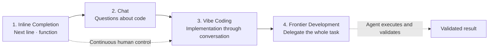
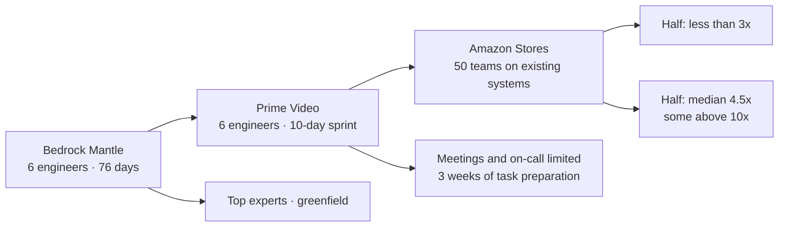
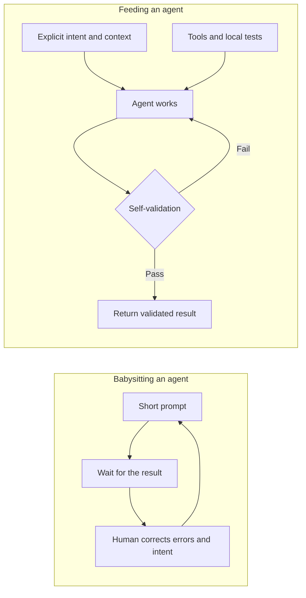
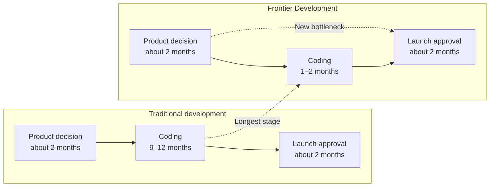
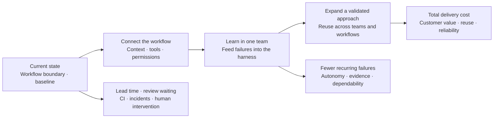

## TL;DR

- Teams using the same tools achieved very different results because they worked differently.
- Frontier teams increased agent autonomy through five habits.
- Review and decision-making became the next bottlenecks after coding.

## Introduction

While working on the CTS-SW post, I looked for evidence about how much AI coding tools actually change software delivery speed.

The numbers varied widely. Some teams reported modest improvements, while others claimed gains of several times or even more than 10x.

I then found a talk that explained this difference through teams inside the same organization.

AWS Senior Principal Engineer Clare Liguori presented the characteristics of `Frontier Development` that Amazon observed across its internal teams.[^1]

The talk ranges from a system estimated to require 30 people for 18 months but built by six people in 76 days, to a comparison of 50 teams maintaining existing codebases.

What interested me most was the explanation of why teams using nearly the same AI tools diverged so sharply: five habits in how they worked.

## 1. AI coding is entering a fourth phase

Clare divides the evolution of AI coding into four phases.

The first is `inline code completion`, which proposes the next line or function.

The second is `chat`, where developers ask questions about code. The third is `Vibe Coding`, where a high-level request is implemented through a conversation with an agent.

Clare says that, anecdotally, these three phases made her feel roughly 10–20% more productive.

She calls the fourth phase, which is only beginning, `Frontier Development`.

In the earlier phases, a person continuously controls each line, function, or exchange. In Frontier Development, an entire task—including how it will be validated—is delegated to an agent.





Clare defines frontier developers through three behaviors rather than a particular product or model.

1. They write only about 1–2% of the code they produce.
2. They let agents work for hours without human intervention.
3. They minimize idle time by having several agents process a backlog in parallel.

These numbers are not standards that every developer should follow.

They are closer to an operational description of early adopters inside Amazon who achieved step-function productivity gains.

The talk does not stay with the definition for long. It moves directly into three cases that show how these behaviors appeared in real teams.

## 2. Six people built it in 76 days—but the result was not automatically reproducible

The first case is the Bedrock Mantle team.

The Bedrock organization needed a new inference data plane and initially estimated that the work would require 30 people for about 18 months.

It was a large project: build a new system, then migrate customers and models from the existing one.

Instead, six engineers built it with Kiro in 76 days.

Amazon had not seen a result like this internally. Based on commits, the pathfinder team demonstrated an improvement of roughly 20x.

The problem was that these were not six ordinary engineers.

The team included two Distinguished Engineers and some of the company's strongest experts in distributed systems, LLMs, and the architecture itself. It was also a greenfield system without the constraints of an existing codebase.

The case proved that the result was possible. It did not prove that another team could reproduce it during ordinary work.

The next experiment took place in Prime Video.

Six different engineers used Kiro without restriction during a ten-day sprint. Based on their progress, the estimated project duration fell from 90 weeks to 24.

This experiment showed that engineers outside the Bedrock Mantle team could produce a similar result.

It also came with unusual conditions.

The team had almost no on-call responsibilities or meetings, and the interruptions common in an engineer's normal day were deliberately limited. A senior engineer had also spent three weeks preparing small, well-scoped tasks and detailed requirements.

It was less an ordinary development team than a sprint designed to give agents ideal working conditions.

Amazon Stores therefore ran a more realistic pilot.

It observed 50 teams with normal seniority distributions, working on existing systems and codebases, for much of a year.

The metric also changed from commit volume to how quickly changes reached production.

The teams split into two groups.

- Half improved deployment velocity by less than 3x.
- The other half reached a median of 4.5x, with some exceeding 10x.

Ninety percent of the teams used Kiro along with nearly the same internal tools.

The tool was not the main variable.

The teams with larger gains did more than place AI tools on top of the existing development process. **They intentionally changed how they worked.**

The three cases can be read as a sequence that progressively narrows the conditions required for reproducibility, not merely as three impressive numbers.





These figures come from Amazon's internal observations as presented in the talk. The raw data and team-level methodology have not been published as a complete research study.

I therefore would not treat 4.5x as an expectation that can be transferred to another organization. The more useful question is what caused teams using the same tools to diverge.

## 3. Five habits of frontier teams

Amazon interviewed the Bedrock Mantle team, the Prime Video sprint, and teams from the 50-team pilot, then identified five shared habits.

Clare deliberately uses the word `habit` rather than `practice`. The results did not come from one exceptional sprint but from a way of working repeated every day.

### 1) Invest in agent context

People carry a great deal of knowledge that never appears in documentation.

They pass it to colleagues through Slack conversations, onboarding, mentoring, code reviews, stand-ups, and sprint planning. For agents, that knowledge has to be written into files.

Whenever an agent made a mistake or worked in a way the team would not have chosen, frontier teams asked:

> What was missing from the Skill or steering file that the agent needed?

They did not correct the result once and move on. They preserved the lesson as context available to the next execution.

Context should not only grow.

A `do not` rule added to work around an older model's behavior may no longer be necessary for a newer one. Leaving old workarounds in place only increases the context an agent must read.

The habit is therefore two-sided: add rules when new failures reveal missing context, and remove rules when stronger models no longer need them.

### 2) Slow down to speed up

Almost every interviewed team reported that productivity initially fell as it adopted frontier practices.

Giving an agent a coding tool does not immediately make it productive in an existing codebase.

The teams first made their environments easier for agents to work in.

- They improved error messages so failures explained what went wrong.
- They built new tools and MCP servers for tasks the agent could not perform.
- They restructured codebases that were difficult for agents to navigate.
- They added linters and tests.
- When necessary, they moved to languages whose type systems and compilers returned more useful feedback.

The talk mentions teams moving from Python or JavaScript to TypeScript, and others choosing Rust because its compiler returns specific errors.

That does not mean every team should change programming languages.

It means these teams made substantial engineering investments to reduce how much the agent had to guess and to give it actionable feedback after a failure.

### 3) Feed agents instead of babysitting them

One of Clare's strongest phrases is `feeding agents, not babysitting agents`.

In Vibe Coding, a person may spend the entire day exchanging short messages with an agent.

The person waits 30 seconds or a minute for code, reviews it, and sends the next instruction. That pattern makes it difficult to run several agents in parallel.

Frontier teams provided the following information before the agent began:

- What needs to be done
- Which constraints must hold
- How the agent should validate its own work
- Which quality bar it must meet before returning

The agent runs the code, compiles it, executes tests, checks coverage, and returns only after meeting the quality bar.

Repeated instructions move into steering files so they do not need to be typed again for the next task.

This allows the agent to correct its own failures while the person does other work or starts another agent.

### 4) Make intent explicit before writing code

In a typical Vibe Coding session, a developer gives a high-level prompt, receives a large amount of code, and then corrects the intent while reviewing the output.

The conversation becomes: `"That is not what I meant,"` `"You misunderstood the requirements,"` or `"I did not want it structured this way."`

Clare argues that discussing intent through code is inefficient when the intent itself is still wrong.

For complex or ambiguous features, Amazon teams first created a specification in the style of BDD, or Behavior-Driven Development.

The person did not have to write the entire document manually.

The agent generated a draft specification, and the person and agent adjusted requirements and technical design in a document that was cheaper to change than code. Code generation began only after the intent was aligned.

### 5) Shift testing left

For an agent to work for hours without human intervention, it needs fast feedback.

The agent can make mistakes. It must be able to detect and correct them quickly.

Frontier teams added linters, unit tests, integration tests, performance tests, and security tests.

These have always been considered good engineering practices. What changed was their return on investment.

A test does not prevent one person's mistake only once. It becomes part of every future agent retry loop. Making the codebase easier for a machine to read and repair has become more valuable.

Several teams also invested in replacing external services with deterministic local mocks.

Connecting to cloud services and real environments during every iteration makes feedback slower and less predictable. When the same local input produces the same response, an agent can run more correction loops in less time.

The five habits form one execution pattern.





## 4. Frontier Development is hard on people too

Clare does not claim that adopting the five habits solves every problem.

This is still an early-adopter phase, and teams are learning a different way to work.

One risk is burnout.

Engineers stay up late trying to create the perfect prompt that will run overnight and leave completed code ready in the morning.

Running several agents in parallel also means constantly switching between terminal tabs. Cognitive load removed from implementation moves into tracking agent state and reviewing output.

Reviewing AI-generated code may feel harder than writing it directly.

The burden can be especially high for early-career engineers who have not yet spent much time reviewing other people's code.

The organization has to change as well.

Productivity may decline first while a team repairs its codebase and tools and builds new habits.

If leaders ask, `"We gave you strong AI tools, so why are you not faster?"` while demanding the same feature output, the team cannot make that foundational investment.

Clare says teams may need to spend roughly two months changing the codebase and how they work.

Rolling the approach out across the entire organization too quickly creates another risk.

Amazon did not turn the result of one pathfinder team into an immediate company-wide standard. It ran a constrained sprint, learned from a 50-team pilot, and is now working on how to extend the approach to the next 2,000 teams.

## 5. Decision-making becomes the next bottleneck after code

The talk ends with a new bottleneck encountered by frontier teams.

In the past, building the code for a new product took nine to twelve months.

Two months to decide whether to build the product and another two months to approve the launch were less visible within the overall schedule.

When coding falls to one or two months, the two-month stages before and after it become the longest parts of the process.

Clare says frontier teams often spend more time making decisions than writing code.

Placing the same workflow before and after Frontier Development makes the bottleneck shift easier to see.





As code generation accelerates, the following steps become visible bottlenecks:

- Deciding which product to build
- Reviewing product and technical design
- Checking security and operational conditions
- Approving the launch

If even easily reversible decisions remain under lengthy review, organizational decision-making absorbs the speed gained from code.

Clare's main message is therefore not a particular prompt or tool technique.

**Frontier Development means intentionally changing how the team and organization work, not merely adding an AI tool.**

## 6. Start with the current state before applying it to an organization

After watching the talk, I was left with a question: what should an organization inspect first before adopting this way of working?

The rest of this section is my proposal, based on earlier posts rather than the talk itself.

### Establish a baseline for the current workflow

Do not begin with AI-tool adoption rates or generated code volume.

Choose one workflow in one team and lay out the path from requirement to production.

- How long does it take to decide the requirement?
- Where do humans intervene during implementation and review?
- How much time is spent waiting for CI and deployment?
- How often do rework, rollbacks, and incident response occur?
- Does the agent have the data, tools, and permissions required to finish the work?

Without a pre-adoption baseline, a team may not notice that time removed from code generation moved into review or operations.

### Connect one team, then turn failures into the harness

Next, connect the context, tools, permissions, and validation criteria that the agent needs to finish the workflow end to end.

Rather than expanding immediately to several agents and teams, I think it is better to first verify that one agent can complete one small task without human intervention.

When the same mistake repeats, preserve it in project rules. When the agent cannot perform a task, add a CLI, Skill, or MCP. When it cannot detect a failure, add a linter or test.

The practical sequence is described in the post on building the EncBird harness layer by layer.[^2]

At the organizational level, this can be divided into three stages.[^3]

- First, connect workflow boundaries, data, tools, and permissions.
- Learn from a pilot in one team and turn failures and review feedback into the harness.
- Reuse the validated approach for other teams and requirements.





### Measure different effects at different stages

Demanding immediate cost savings and business outcomes from an early pilot makes the talk's `slow down to speed up` period look like failure.

While one team is learning, examine whether the same failures recur, whether humans still have to reconstruct all the code, and whether the agent can close normal paths independently.

The questions change when the validated approach expands.

Examine whether requirements reach customers faster, whether total cost across development, review, and operations falls without reducing quality, and whether earlier investments are reused in other workflows.

The questions for these two stages are discussed in more detail in an earlier post.[^4] CTS-SW can serve as a starting point for measuring total delivery cost per unit of customer-delivered software.[^5]

The 50-team case shows that changing how teams work can substantially change deployment velocity.

After applying it to an organization, the next question is whether **faster deployment improved total delivery cost and customer value**.

### Waiting for token prices to fall may be too late

The workflow described in the talk consumes tokens continuously.

Tokens are required not only for code changes and tests but also for feeding lessons into context, tools, and tests and for removing obsolete rules from the harness.

This is closer to an operating cost for maintaining and improving the workflow than a one-time experimentation cost.

Recent studies consistently show a rapid decline in the cost of reaching the same performance level. Estimates vary widely, and long-reasoning frontier tasks can still become more expensive in total, but the downward price trend appears across several sources.[^6][^7][^8]

Price is not the only thing changing. The length of software tasks that agents can complete reliably is also increasing quickly.[^9]

These studies do not directly measure `business value per token`. Even so, as the same performance becomes cheaper and models finish longer tasks, I think the business value available from a given token budget is increasing.

The recent trend should not be extrapolated mechanically. Still, a scenario in which the same work costs tens of times less in two or three years is worth considering when designing a workflow.

If an organization waits until prices are low enough before beginning the transition, it may struggle to catch teams that have already spent years accumulating context, tools, tests, and organizational habits. Token prices can fall much faster than an organization can change how it works.

## Conclusion

Reducing this talk to `"how Kiro makes teams 10x faster"` misses the important part.

The teams with larger gains used the same tools but changed context, tools, intent, and tests together. They also accepted slower feature delivery while making those changes.

This does not require assuming unlimited tokens. It does require treating tokens spent on code changes, retries, and harness updates as operating cost rather than a one-time experiment.

Token prices are falling, and the range of work a model can complete with the same budget is expanding. Waiting until tokens are sufficiently cheap before changing organizational workflows may be too late.

Rather than optimizing every task against today's token price alone, I think an organization should **design the workflow around expected token prices and usage over the next three years, the business value delivered per token budget, and the harness it expects to accumulate during that time**.

---

[^1]: Clare Liguori, [From AI-Assisted to AI-Native: Building a Frontier Development Team](https://www.youtube.com/watch?v=pqlWNihgdjI) (2026). The talk presents Amazon's internal pathfinder, sprint experiment, 50-team pilot, and five habits of frontier teams.

[^2]: [How I Built the EncBird Harness Layer by Layer](/en/2026/06/16/harness-engineering-in-practice.html) — describes the practical sequence for turning recurring failures into context, tools, tests, and guardrails.

[^3]: [Why AI Adoption Should Not Start with Token Savings — The 3S Stages 1/2](/en/2026/06/15/organizational-ai-adoption-3s.html) — divides organizational adoption into stages for connection, learning, and expansion.

[^4]: [When Should AI Adoption Be Measured by Business Metrics? — Revisiting AHEAD and LEVER 2/2](/en/2026/08/18/measuring-ai-adoption-ahead-lever-part-2.html) — organizes stage-specific questions about harness learning, total delivery cost, and value realization.

[^5]: [Did AI Coding Tools Actually Cut Development Cost? — Getting Started with CTS-SW](/en/2026/08/14/cts-sw-software-delivery-cost.html) — connects customer-delivered software to the total cost of development, review, and operations.

[^6]: Stanford HAI, [AI Index 2025: State of AI in 10 Charts](https://hai.stanford.edu/news/ai-index-2025-state-of-ai-in-10-charts) — summarizes the rapid decline in the cost of reaching GPT-3.5-level MMLU performance.

[^7]: Epoch AI, [LLM inference prices have fallen rapidly but unequally across tasks](https://epoch.ai/data-insights/llm-inference-price-trends) — analyzes performance-adjusted price trends across benchmarks and their measurement limitations.

[^8]: Hans Gundlach et al., [The Price of Progress: Price Performance and the Future of AI](https://arxiv.org/abs/2511.23455) — analyzes quality-adjusted benchmark execution costs, including reasoning tokens and frontier evaluation costs.

[^9]: METR, [Time Horizon 1.1](https://metr.org/blog/2026-1-29-time-horizon-1-1/) — updates estimates for the length of software tasks agents can complete at a given reliability level.
