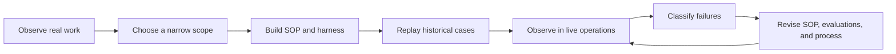
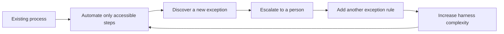
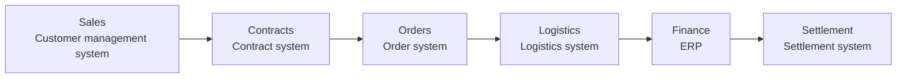

## TL;DR

- As agents accelerate development, business processes become the next bottleneck.
- Someone must keep improving business procedures after external specialists leave.
- I see internal FDE work as one possible next role for developers.

## Introduction

I have been thinking a lot about what traditional developers will do next.

As coding agents—AI tools that write and run code—automate more implementation work, developers need less time to build the same feature. They can spend the saved time on harder design and review problems, or simply build more features.

But both choices still stay inside the development process.

When I wrote about [the value of developers who understand the business](/en/2026/03/13/agentic-dev-business-aligned-code.html), I argued that as execution becomes cheaper, the ability to decide what to execute becomes more important.

Lately, I have started to think developers could move into FDE work, so I have been looking into the role through talks and real-world cases.

A Forward Deployed Engineer works close to the business, finds problems that have not yet become clean requirements, connects the necessary data and systems, and keeps changing the software until it produces an operational result. OpenAI's job description similarly presents FDE as a role that owns the path from discovering a customer's problem to deploying a production system.[^1]

This post summarizes what I have found so far: what FDEs actually do, why the capability may need to live inside the company, and how it connects to the traditional developer.

## 1. The Maersk case made FDE work concrete

Maersk's talk about operating agents in global shipping made the work of an FDE much more concrete for me.

> “The agent loop is not the system. The refining loop around the agent is the system.”[^2]

Completing one agent run is not enough. The team must keep observing failures and incorporating domain experts' corrections into standard operating procedures (SOPs) and the harness.

Here, the harness includes the background information and permissions given to the agent, its execution environment, and the checks that evaluate results and block risky actions. It looks like [harness engineering](/en/2026/03/15/harness-engineering-beyond-context-engineering.html) applied to enterprise operations.

The speaker describes running more than 200 agent instances and producing more than 100,000 corrections over nine months. The country-specific SOP corpus was roughly twenty times larger than the agent runtime, and resolving a single failure category sometimes took one or two months.[^2]

A shipping example makes it easier to see why so much work is required.

For one export shipment, the transportation management system may say the booking is confirmed while the carrier API still says pending. SAP may show that payment is complete while the customs system says a required document is missing.

Even if each system handles normal shipments well, conflicting states leave an operator moving through several screens and emails to determine the actual state and decide which team needs to do what.

Giving the agent a human-oriented manual in a prompt is not enough.

The system needs explicit rules for when the work begins, which identifier retrieves each record, which systems are checked in what order, how the result is validated, and how far the workflow should recover after a failure.

Based on this case, I would organize the work of an FDE as follows.

| Stage | Actual work | What remains |
| --- | --- | --- |
| Field observation | Observe how staff handle exceptions and make decisions | Current workflow and conditions before adoption |
| Scope definition | Choose the initial automation scope and the decisions people will retain | Work to automate and work people will retain |
| Expressing the workflow | Turn judgments previously known only to staff into executable procedures | SOPs and harness |
| Pre-production validation | Replay historical cases in read-only mode | Evaluation cases and failure categories |
| Limited operation | Start in Shadow Mode, offering suggestions without making actual changes | Execution records (traces) and domain experts' corrections |
| Iterative improvement | Feed failures into the harness and move stable procedures into code | Tools that combine several steps and accumulated knowledge about the work |





For a correction to help the next run, feedback such as "I do not like this result" is not enough. It needs to change what happens—for example, which procedure runs first for a particular country and state. I think the failed case should also be retained as an evaluation case that can be replayed.

Domain experts decide what should happen. The agent pursues that goal within the boundaries enforced by the harness. A risky operation is removed from the permission set rather than discouraged through a "please be careful" prompt, and execution is blocked when validation conditions are not met.

Once an agent succeeds repeatedly at part of the work, that part moves into ordinary, stable software.

### Move stable procedures out of the agent

At the beginning, it may be useful to let an agent decide the order in which to inspect a booking, payment, and customs documents. The team does not yet understand the work completely, and new exceptions are still appearing.

After repeated operation, some paths begin to run in the same order under the same conditions.

Suppose `retrieve booking → verify payment → inspect documents → validate result` has become a stable sequence. There is less reason for an agent to infer the next step every time. The procedure can be wrapped in a function or API such as `resolve_booking_exception()`. The talk calls these reusable combinations of steps Composite Tools.[^5]

Once the FDE defines the inputs, outputs, failure conditions, and validation criteria, a coding agent can write the tool and its tests. The order and branch conditions of a repeatedly successful procedure become fixed in code.

| Agent chooses the procedure on each run | Procedure combined in a Composite Tool |
| --- | --- |
| Decides the steps and branches during each execution | Fixes order and branch conditions in code |
| May follow a different path under the same input | Follows the same control flow under the same conditions |
| Tests individual tools and evaluates the workflow the agent chose | Tests the defined branches and results with unit and integration tests |
| Checks permissions for each tool the agent can choose | Checks permissions for the combined procedure |
| Uses execution records to inspect the chosen path and failure | Inspects the path defined in code alongside execution records |

External data and responses can still change, but the retrieval order, branches, validation rules, and recovery behavior remain in code. Supplying the same inputs and external responses makes it easier to test whether an error recurs and to check which permissions each step uses.

The agent can then focus on deciding whether to call the Composite Tool or whether the case is a new exception that has not yet been formalized. FDE work therefore expands what agents can handle while also **moving work that no longer needs agent judgment back into code**.

The company's way of working remains in SOPs, the harness, and operational records. These must continue to change as the business changes.

## 2. What happens when we automate the existing process as-is?

Enterprise work rarely begins as a clean process.

Imagine a customer inquiry that requires an operator to inspect an Excel sheet, message another team, wait for an approval, and then enter a result into an enterprise resource planning (ERP) system that manages orders and financial records.

With the necessary access permissions and integrations, an agent can take on the Excel lookup, the message, and the ERP entry.

But the automation does not explain why the approval exists, why the data lives in Excel, or why the systems disagree. When the agent does not know what to do, it can send the case back to a person and keep the system running.

What looks reasonable at first can accumulate rules over time: send large amounts to a manager, a particular vendor to the payments team, and a European Union (EU) customer to the team responsible for regulatory compliance. As adding behavior through code becomes cheaper, these rules can accumulate faster.

In the past, a developer might have paused a complicated request by pointing out that it required changing the data model or the existing architecture.

In the agent era, someone can say, "Add one more step after the current workflow," and get an implementation immediately. Lower change cost may reduce the opportunities to step back and redesign the process.

After a few years of such changes, business rules are scattered across code, prompts, SOPs, evaluation cases, and escalation conditions in the harness. Reading the code alone makes it difficult to understand the whole process.

Repeated partial automation can create the following cycle.





Before adding another rule, the FDE should ask a different set of questions.

- Is this really an exception?
- If it keeps happening, should it become part of the normal process?
- Is this approval still necessary?
- Why do the two systems disagree?
- Does this require human judgment because of accountability, or because the system is disorganized?

Cases escalated to people should be analyzed in the same way.

Suppose a company processes 100,000 requests in one month, automates 82,000, and escalates 18,000. An 82% automation rate sounds fairly good.

But suppose those 18,000 cases consist of 8,000 with missing data, 4,000 with ambiguous policies, 3,000 with inconsistent system values, and 3,000 that actually need human judgment.

Each category should lead to a different action.

| Why the case was escalated | Should people keep handling it? | Next action |
| --- | --- | --- |
| Missing data | Usually no | Fix how required data is created and validated |
| Ambiguous policy | Usually no | Align criteria with the policy owner |
| Conflicting systems | Usually no | Establish the system of record and integration behavior |
| New case | Temporarily | Add an evaluation case and watch for recurrence |
| Legal accountability or customer negotiation | Possibly | Define the human decision boundary and owner |

The first 15,000 cases are closer to work people are absorbing because the data, policy, and systems have not been fixed than to genuine human judgment.

If the company only improves the escalation mechanism, it can continue operating without fixing the underlying causes.

That is why the automation rate should be read together with the reasons people remain in the process.

Without distinguishing legal accountability and customer negotiation from messy data, partial automation is easy to mistake for completion.

## 3. When the process crosses departmental boundaries

Fixing the process properly often requires data and systems from several organizations.





Different organizations may manage the permissions, data definitions, and performance measures around each system.

When I wrote [my Event Storming post](/2020/12/10/demystifying-event-storming.html), I described how experts' knowledge is scattered across departments, leaving no one with a view of the entire workflow.

Practitioners can map the whole workflow by connecting the parts each knows. But accessing another organization's data, choosing which system to treat as authoritative, and changing responsibilities across teams require someone with the authority to make those decisions.

An FDE can find the problem and design a solution, but cannot grant that authority to themselves.

This is especially difficult in the structures common in Korean enterprises, where departments manage data and make decisions separately. The process to automate crosses many departments, while the FDE's practical scope often stops at the requesting department and its systems.

The organization then automates only as far as access allows and sends the rest to people.

Several agents may appear to be working, but people still connect data and accountability across organizational boundaries. The person becomes a kind of middleware between departments.

The company also needs someone accountable for the entire workflow's result—a Process Owner—and an executive sponsor able to support cross-organizational data access and responsibility changes.

| Role | Decision it must own |
| --- | --- |
| Executive sponsor | Cross-organizational data access and responsibility changes |
| Process Owner | End-to-end success criteria and the human decision boundary |
| Domain expert | Correct outcomes and dangerous exceptions |
| Internal FDE | Execution-record analysis, harness improvement, and system implementation |

The FDE uses operational data and execution records to show the problem, then implements the agreed change in the system.

## 4. Who keeps improving the system after an external FDE leaves?

External FDEs can clearly help with the initial implementation.

An external FDE who has seen patterns across several customers may identify the first problem faster and build the agent and evaluation environment faster than the internal team.

The difficult part is that the business process spans the organization, while the external FDE's authority is usually limited to the contracted project and systems.

When data access or policy change is delayed, the realistic deliverable within the contract period is automation of the accessible portion. The remaining steps are escalated to people, and exception rules are added so the system can operate.

During the engagement, the system works because the external FDE personally investigates exceptions and asks several teams for context.

After the contract ends, someone must keep classifying new exceptions and updating the SOPs and evaluation cases. Without that owner, more cases gradually return to people and unexplained rules remain in the harness.

For the external organization to keep owning this refinement, the relationship effectively needs to become a long-term paid service.

Without a paid contract, the external organization is unlikely to spend months refining exceptions with the same priority as the customer. Even with a contract, continuously learning the customer's internal context and informal relationships is expensive.

Changing a process also requires uncomfortable questions.

Why is this approval required? Which team owns the inconsistent data? Who will own the process afterward? A proposal from a colleague who will remain and share the consequences may carry different weight than the same proposal from someone assigned through a short-term contract.

The initial platform and specialist expertise can come from an external FDE.

But when the same failures recur during operation, the internal organization should decide which procedures to change and how. If that responsibility is also outsourced, improvement is likely to stop when the contract ends.

## 5. FDE as one possible next role for developers

Vasuman Moza of Varick Agents describes the next bottleneck this way:

> “It’s the ability to go deep with the customer, redesign the workflows, deciding what should be automated versus shouldn’t.”[^3]

The argument is that understanding the customer's work deeply, redesigning workflows, and deciding what should be automated become more important than the ability to produce code.

That made the idea of developers expanding into FDE work more concrete for me.

People who have spent years building and operating internal systems know where problems tend to occur, where the real data lives, and how reality differs from documentation. Working inside the organization also teaches them which team to talk to and in what order.

They need to add agent engineering and the ability to observe real work.

They do not need the full domain knowledge of an operator. But they must be able to ask why an operator made a decision, then translate that answer into data access, SOPs, evaluation cases, permissions, and harness behavior.

When developers also take responsibility for improving the workflow, they need to make the following decisions alongside implementation.

| When focusing on implementation | When also improving the workflow |
| --- | --- |
| Implement the requirements received | Ask why those requirements exist |
| Look within the system they own | Follow the workflow from beginning to end |
| Check that deployment meets the requirements | Follow recurring exceptions in production |
| Work mainly with code and APIs | Also address data definitions and organizational responsibility boundaries |
| Build a technically sound solution | Persuade the relevant teams to change the process too |

The last point may give an internal FDE an advantage over an external one.

Being an employee who shared incidents and operational outcomes does not automatically create authority. But sharing organizational history and context—and remaining after the change—can help when persuading colleagues.

Platforms, security, models, and distributed systems will still require developers who go deep into the technology itself. The future of developers is unlikely to converge into one form.

Still, enterprise application developers already translate business requirements into systems and coordinate problems across teams.

As agents take on more implementation, these developers are likely to spend more time understanding processes and connecting systems. Even without an FDE title, they may take on similar responsibilities.

## 6. Won't FDE work also be automated by agents?

FDE work itself will probably be automated quickly.

Palantir provides an agent called `AI FDE` that performs Foundry administration and operations through natural language.[^4] Agents can increasingly summarize meetings, group records of failed tasks, and draft SOPs and system-integration code.

The Varick talk also introduces an internal agent that finds missing details and proposes changes while the FDE builds the workflow.[^3]

Even as the technical parts of FDE work are automated, the work of coordinating authority and responsibility across organizations remains.

Choosing the policy owner or taking responsibility for removing an approval requires persuading colleagues and living with the consequences of the change.

If agents can also replace that part, there is less reason to internalize the FDE capability.

If people will continue to own it for some time, relying only on external FDEs may be expensive. The company reduces development effort through Coding Agents, then pays external FDEs to automate other departments.

Moving existing developers into internal FDE roles preserves the system knowledge and organizational context they have already accumulated.

Seen this way, internalizing FDE is a decision about where to reinvest the capacity created by development automation.

## Conclusion

At first, I thought better coding agents would leave traditional developers doing more design and review. Now I think developers who translate business needs into applications may evolve toward an FDE role that combines workflows, agents, and organizational change.

As companies spend the capacity created by development automation on reducing manual work and process debt elsewhere, the boundary between developer and FDE may naturally blur.

The scope and authority of FDE still appear to vary considerably from company to company. For now, I plan to keep looking at how real FDE organizations operate and how they continue improving systems after external engagements end.

---

[^1]: OpenAI, [Forward Deployed Engineer](https://openai.com/careers/forward-deployed-engineer-san-francisco/) — describes an FDE role that owns the path from discovering a customer's problem to deploying a production system.

[^2]: Dmitry Buykin, [Tribal Dungeons of Global Shipping: AI Agents at Global Scale](https://www.youtube.com/watch?v=dQ-_i1tZiws&t=230s), AI Engineer World's Fair 2026 — presents Maersk's SOPs, evaluations, guardrails, and continuous refinement process.

[^3]: Vasuman Moza, [AI tools for Forward Deployed Engineering](https://www.youtube.com/watch?v=l0FLhNqBOic&t=656s), AI Engineer World's Fair 2026 — explains FDE work as understanding a customer's operations and redesigning workflows and automation boundaries.

[^4]: Palantir, [AI Forward Deployed Engineer](https://palantir.com/docs/foundry/ai-fde/overview/) — an agent that performs Foundry administration and operations through natural language.

[^5]: Dmitry Buykin, [Tribal Dungeons of Global Shipping: AI Agents at Global Scale](https://www.youtube.com/watch?v=dQ-_i1tZiws&t=631s), AI Engineer World's Fair 2026 — describes combining repeatedly successful step sequences into larger reusable Composite Tools.
