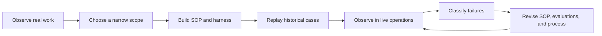
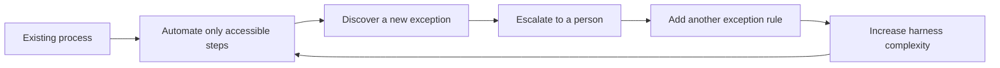
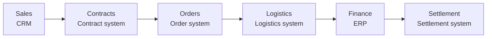

## TL;DR

- As agents accelerate development, business processes become the next bottleneck.
- Someone must keep refining SOPs and evaluations after external FDEs leave.
- FDE may be one form the traditional developer evolves into.

## Introduction

I have been thinking a lot about what traditional developers will do next.

As Coding Agents automate more of the implementation work people used to do directly, developers need less time to build the same feature. They can spend the saved time on harder design and review problems, or simply build more features.

But both choices still stay inside the development process.

When I wrote about [the value of developers who understand the business](/en/2026/03/13/agentic-dev-business-aligned-code.html), I argued that as execution becomes cheaper, the ability to decide what to execute becomes more important.

Lately, I have started to think that FDE may be one of the forms the traditional developer evolves into.

So I have been looking into what FDEs actually do through talks and real-world cases.

A Forward Deployed Engineer works close to the business, finds problems that have not yet become clean requirements, connects the necessary data and systems, and keeps changing the software until it produces an operational result. OpenAI's job description similarly presents FDE as a role that owns the path from discovering a customer's problem to deploying a production system.[^1]

This post summarizes what I have found so far: what FDEs actually do, why the capability may need to live inside the company, and how it connects to the traditional developer.

## 1. The Maersk case made FDE work concrete

Maersk's talk about operating agents in global shipping made the work of an FDE much more concrete for me.

> “The agent loop is not the system. The refining loop around the agent is the system.”[^2]

The inner loop, where an agent executes once, is smaller than the surrounding loop that observes failures and turns expert corrections back into SOPs and the harness. That surrounding loop is the real system.

Here, the harness means the environment around the agent: context, permissions, runtime, evaluations, and guardrails. It looks like [harness engineering](/en/2026/03/15/harness-engineering-beyond-context-engineering.html) applied to enterprise operations.

The speaker describes running more than 200 agent instances and producing more than 100,000 corrections over nine months. The country-specific SOP corpus was roughly twenty times larger than the agent runtime, and resolving a single failure category sometimes took one or two months.[^2]

A shipping example makes it easier to see why so much work is required.

For one export shipment, the transportation management system may say the booking is confirmed while the carrier API still says pending. SAP may show that payment is complete while the customs system says a required document is missing.

The normal shipment is already handled well.

The expensive part begins when system states drift apart. An operator moves through several screens and emails to determine the actual state, then decides which team needs to do what.

Giving the agent a human-oriented manual in a prompt is not enough.

The system needs explicit rules for when the work begins, which identifier retrieves each record, which systems are checked in what order, how the result is validated, and how far the workflow should recover after a failure.

The work of an FDE can be divided into stages and artifacts.

| Stage | What the FDE does | What remains |
| --- | --- | --- |
| Observe the work | Follow how operators handle exceptions and make decisions | Current workflow and baseline |
| Set the boundary | Define the first automation scope and what remains a human judgment | Automation boundary |
| Represent the work | Turn tacit knowledge into executable procedures | SOP and harness |
| Validate offline | Replay historical cases without write access | Evaluation cases and failure categories |
| Operate carefully | Begin in Shadow Mode, proposing actions without making changes | Traces and expert corrections |
| Refine continuously | Feed failures into the harness and move stable procedures into code | Composite Tools and organizational knowledge |





A `correction` in the talk does not mean feedback such as "I do not like this result."

It must change executable behavior—for example, which procedure runs first for a particular country and state. The failed case should also become an evaluation case that can be replayed.

Domain experts decide what should happen. The agent pursues that goal within the boundaries enforced by the harness. A risky operation is removed from the permission set rather than discouraged through a "please be careful" prompt, and execution is blocked when validation conditions are not met.

Once an agent succeeds repeatedly at part of the work, that part moves into ordinary, stable software.

### Move stable procedures out of the agent

At the beginning, it may be useful to let an agent decide the order in which to inspect a booking, payment, and customs documents. The team does not yet understand the work completely, and new exceptions are still appearing.

After repeated operation, some paths begin to run in the same order under the same conditions.

Suppose `retrieve booking → verify payment → inspect documents → validate result` has become a stable sequence. There is less reason for an agent to infer the next step every time. The procedure can be wrapped in a function or API such as `resolve_booking_exception()` and exposed as a Composite Tool.[^5]

This does not mean a person has to write all of that code manually.

Once the FDE defines the inputs, outputs, failure conditions, and validation criteria, a Coding Agent can generate both the Composite Tool and its tests. The successful pattern discovered through agent operation is compiled back into deterministic software.

| Agent orchestrates every run | Deterministic code · Composite Tool |
| --- | --- |
| Decides the steps and branches during each execution | Fixes order and branch conditions in code |
| May follow a different path under the same input | Follows the same control flow under the same conditions |
| Relies on workflow-level evaluation cases | Supports direct unit and integration tests |
| Needs broad permissions and context across steps | Narrows inputs, outputs, and permissions |
| Requires traces to reconstruct the failure | Makes failure points and recovery conditions visible in code |

This does not mean external systems always return the same data or response.

It means the retrieval order, branches, validation rules, and recovery behavior are fixed in code instead of being selected again by an agent. That is much easier to regression-test, permission-check, and reproduce during an incident.

The agent can then focus on deciding whether to call the Composite Tool or whether the case is a new exception that has not yet been formalized. FDE work therefore expands what agents can handle while also **moving work that no longer needs agent judgment back into code**.

The result is more than an agent. The company's way of working remains in SOPs, the harness, deterministic code, and operational records. Those artifacts must continue to change as the business changes.

## 2. What happens when we automate the existing process as-is?

Enterprise work rarely begins as a clean process.

Imagine a customer inquiry that requires an operator to inspect an Excel sheet, message another team, wait for an approval, and then enter a result into ERP.

An agent can automate the Excel lookup, the message, and the ERP entry fairly easily.

But the automation does not explain why the approval exists, why the data lives in Excel, or why the systems disagree. When the agent does not know what to do, it can send the case back to a person and keep the system running.

At first, that looks reasonable.

Over time, rules accumulate: send large amounts to a manager, a particular vendor to the AP owner, and an EU customer to Compliance. Because adding behavior through code has become cheaper, these rules can now accumulate much faster.

In the past, a developer might have paused a complicated request by pointing out that it required changing the data model or the existing architecture.

In the agent era, someone can say, "Add one more step after the current workflow," and get an implementation immediately. Lower change cost may reduce the opportunities to step back and redesign the process.

After a few years, the complexity no longer lives in one codebase.

It is scattered across prompts, SOPs, evaluation cases, and escalation conditions inside the harness. Reading the code alone no longer reveals the whole process, while agent-specific rules keep layering themselves on top of the legacy process.

Repeated partial automation can create the following cycle.





Before adding another rule, the FDE should ask a different set of questions.

- Is this really an exception?
- If it keeps happening, should it become part of the normal process?
- Is this approval still necessary?
- Why do the two systems disagree?
- Does this require human judgment because of accountability, or because the system is disorganized?

Cases escalated to people should be analyzed in the same way.

Suppose a company processes 100,000 requests in one month, automates 82,000, and escalates 18,000. An 82% automation rate sounds fairly good.

But the 18,000 cases may break down into 8,000 with missing data, 4,000 with ambiguous policy, 3,000 with conflicting system states, and only 2,000 that require genuine human judgment.

Each category should lead to a different action.

| Why the case was escalated | Should people keep handling it? | Next action |
| --- | --- | --- |
| Missing data | Usually no | Fix how required data is created and validated |
| Ambiguous policy | Usually no | Align criteria with the policy owner |
| Conflicting systems | Usually no | Establish the system of record and integration behavior |
| New case | Temporarily | Add an evaluation case and watch for recurrence |
| Legal accountability or customer negotiation | Possibly | Define the human decision boundary and owner |

The first 15,000 cases are closer to work people are absorbing because the data, policy, and systems have not been fixed than to genuine human judgment.

If the company only improves the escalation mechanism, it can continue operating without fixing the underlying causes.

That is why the automation rate should be read together with the reasons people remain in the process.

Without distinguishing legal accountability and customer negotiation from messy data, partial automation is easy to mistake for completion.

## 3. When the process crosses departmental boundaries

Fixing the process properly often requires data and systems from several organizations.





Different organizations may own the permissions, data definitions, and KPIs around each system.

When I wrote [my Event Storming post](/2020/12/10/demystifying-event-storming.html), I described how domain knowledge sits inside separate silos and no one person holds the entire map.

Practitioners can build that map together from the bottom up.

But accessing another organization's data, choosing the system of record, and changing ownership across organizations require top-down authority.

An FDE can find the problem and design a solution, but cannot grant that authority to themselves.

This is especially difficult in the heavily siloed structures common in Korean enterprises. The process to automate crosses many departments, while the FDE's practical scope often stops at the requesting department and its systems.

The organization then automates only as far as access allows and sends the rest to people.

Several agents may appear to be working, but people still connect data and accountability across organizational boundaries. The person becomes a kind of middleware between departments.

An FDE can make this problem visible, but cannot unilaterally change another organization's authority.

The company also needs a Process Owner accountable for the end-to-end result and an executive sponsor able to push through cross-organizational data access and responsibility changes.

| Role | Decision it must own |
| --- | --- |
| Executive sponsor | Cross-organizational data access and responsibility changes |
| Process Owner | End-to-end success criteria and the human decision boundary |
| Domain expert | Correct outcomes and dangerous exceptions |
| Internal FDE | Trace analysis, harness improvement, and system implementation |

The FDE uses operational data and traces to show the problem, then implements the agreed change in the system.

## 4. Who keeps improving the system after an external FDE leaves?

External FDEs can clearly help with the initial implementation.

An external FDE who has seen patterns across several customers may identify the first problem faster and build the agent and evaluation environment faster than the internal team.

The difficult part is that the business process spans the organization, while the external FDE's authority is usually limited to the contracted project and systems.

When data access or policy change is delayed, the realistic deliverable within the contract period is automation of the accessible portion. The remaining steps are escalated to people, and exception rules are added so the system can operate.

During the engagement, the system works because the external FDE personally investigates exceptions and asks several teams for context.

After the contract ends, someone must keep classifying new exceptions and updating the SOPs and evaluation cases. Without that owner, more cases gradually return to people and unexplained rules remain in the harness.

For the external organization to keep owning this refinement, the relationship effectively needs to become a long-term paid service.

Without a paid contract, the external organization is unlikely to spend months refining exceptions with the same priority as the customer. Even with a contract, continuously learning the customer's internal context and informal relationships is expensive.

Changing a process also requires uncomfortable questions.

Why is this approval required? Which team owns the inconsistent data? Who will own the process afterward? A proposal from a colleague who will remain and share the consequences may carry different weight than the same proposal from someone assigned through a short-term contract.

The initial platform and specialist expertise can come from an external FDE.

But the internal organization should decide which process change absorbs each operational failure. If that responsibility is also outsourced, refinement is likely to stop when the contract ends.

## 5. FDE as one evolution of the traditional developer

Vasuman Moza of Varick Agents describes the next bottleneck this way:

> “It’s the ability to go deep with the customer, redesign the workflows, deciding what should be automated versus shouldn’t.”[^3]

The argument is that understanding the customer's work deeply, redesigning workflows, and deciding what should be automated become more important than the ability to produce code.

That made my idea that FDE may be one evolution of the traditional developer more concrete.

Developers already know where internal systems tend to break, where the real data lives, and how reality differs from documentation. After working inside the same organization for years, they often know which team to talk to and in what order.

They need to add agent engineering and the ability to observe real work.

They do not need the full domain knowledge of an operator. But they must be able to ask why an operator made a decision, then translate that answer into data access, SOPs, evaluation cases, permissions, and harness behavior.

The work differs considerably from traditional development.

| Traditional developer | FDE-shaped developer |
| --- | --- |
| Implements a given requirement | Starts by asking why the requirement exists |
| Focuses on the owned system | Follows the whole path from the beginning to the end of the work |
| Treats deployment as completion | Follows recurring exceptions in production |
| Primarily works with code and APIs | Also works with data definitions and organizational ownership |
| Produces a technically correct solution | Persuades related organizations and changes the process |

The last point may give an internal FDE an advantage over an external one.

Being an employee who shared incidents and operational outcomes does not automatically create authority. But sharing organizational history and context—and remaining after the change—can help when persuading colleagues.

Platforms, security, models, and distributed systems will still require developers who go deep into the technology itself. The future of developers is unlikely to converge into one form.

Still, enterprise application developers already translate business requirements into systems and coordinate problems across teams.

As agents take on more implementation, these developers are likely to spend more time understanding processes and connecting systems. Even without an FDE title, their role may become FDE-shaped.

## 6. Won't FDE work also be automated by agents?

FDE work itself will probably be automated quickly.

Palantir already provides an agent called `AI FDE` that performs Foundry administration and operations through natural language.[^4] Agents can increasingly summarize meetings, cluster failure traces, and draft SOPs, integration code, and evaluation cases.

The Varick talk also introduces an internal agent that finds missing details and proposes changes while the FDE builds the workflow.[^3]

Even as the technical parts of FDE work are automated, the work of coordinating authority and responsibility across organizations remains.

Choosing the policy owner or taking responsibility for removing an approval requires persuading colleagues and living with the consequences of the change.

If agents can also replace that part, there is less reason to internalize the FDE capability.

If people will continue to own it for some time, relying only on external FDEs may be expensive. The company reduces development effort through Coding Agents, then pays external FDEs to automate other departments.

Moving existing developers into internal FDE roles preserves the system knowledge and organizational context they have already accumulated.

Seen this way, internalizing FDE is a decision about where to reinvest the capacity created by development automation.

## Conclusion

I initially thought existing developers would spend more time on design and review as Coding Agents improved.

Now I suspect that FDE may be one of the forms the traditional developer evolves into.

An FDE has to find the causes behind recurring exceptions, remove unnecessary approvals and data inconsistencies, and feed the result back into SOPs, deterministic code, and evaluation cases.

External FDEs may help with the initial implementation, but the company needs an internal owner for continuous refinement. Executives must support cross-organizational data access and responsibility changes, while the Process Owner decides what to automate and what should remain a human responsibility.

Developers who specialize deeply in platforms and infrastructure will remain. Developers who previously translated business requirements into applications, however, may evolve toward a form that combines the business process, agents, and organizational change.

As companies spend the capacity created by development automation on reducing manual work and process debt elsewhere, the boundary between developer and FDE may naturally blur.

The scope and authority of FDE still appear to vary considerably from company to company. For now, I plan to keep looking at how real FDE organizations operate and how they continue improving systems after external engagements end.

---

[^1]: OpenAI, [Forward Deployed Engineer](https://openai.com/careers/forward-deployed-engineer-nyc/) — describes an FDE role that owns the path from discovering a customer's problem to deploying a production system.

[^2]: Dmitry Buykin, [Tribal Dungeons of Global Shipping: AI Agents at Global Scale](https://www.youtube.com/watch?v=dQ-_i1tZiws&t=230s), AI Engineer World's Fair 2026 — presents Maersk's SOPs, evaluations, guardrails, and continuous refinement process.

[^3]: Vasuman Moza, [AI tools for Forward Deployed Engineering](https://www.youtube.com/watch?v=l0FLhNqBOic&t=656s), AI Engineer World's Fair 2026 — explains FDE work as understanding a customer's operations and redesigning workflows and automation boundaries.

[^4]: Palantir, [AI Forward Deployed Engineer](https://palantir.com/docs/foundry/ai-fde/overview/) — an agent that performs Foundry administration and operations through natural language.

[^5]: Dmitry Buykin, [Tribal Dungeons of Global Shipping: AI Agents at Global Scale](https://www.youtube.com/watch?v=dQ-_i1tZiws&t=631s), AI Engineer World's Fair 2026 — describes combining repeatedly successful step sequences into larger reusable Composite Tools.
