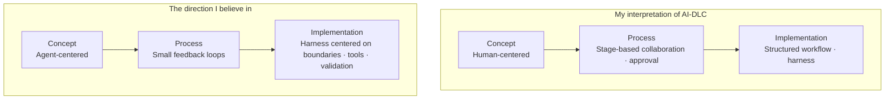
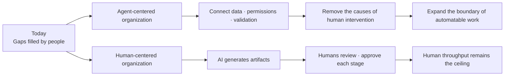
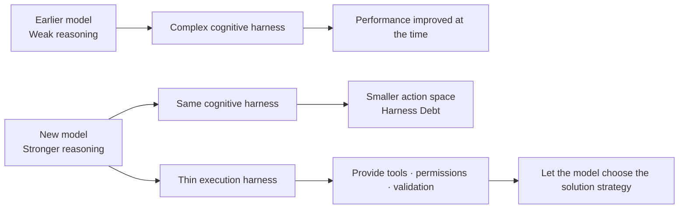

```mermaid
flowchart TB
    subgraph BIG["Compressing one large loop"]
        BR["Many requirements"] --> BD["Design · planning"]
        BD --> BI["Batch implementation"]
        BI --> BT["Integrated testing · review"]
        BT --> BF["Late product feedback"]
    end

    subgraph SMALL["Closing small loops continuously"]
        S1["Small requirement"] --> P1["Working result"] --> F1["User feedback"]
        F1 --> S2["Next small requirement"] --> P2["Next result"] --> F2["Next feedback"]
    end
```

## TL;DR

- AWS AI-DLC differs substantially from my view of agentic development across concept, process, and implementation.
- With so many data points suggesting it works, I need to go out and see for myself whether I am wrong.

## Introduction

I have long been thinking about how my current role differs from the direction I believe in.

The people I work with are still exceptionally capable and kind, and the company offers substantial stability and opportunity.

That is precisely why I have thought about it for so long.

For the past year, I managed to avoid taking the lead in communicating ideas far from my own perspective. I chose other topics, explained only the parts I agreed with, or shared my different view only with a few people close to me.

Then AI-DLC—AWS's AI-Driven Development Life Cycle—became more concrete, with a fuller methodology and execution tooling, and began spreading more broadly. It became increasingly difficult to avoid.[^1][^2]

Senior employees are expected to understand the company's direction, help junior colleagues act on it, and deliver the results the company wants.

The problem is that I cannot find the motivation to actively advocate ideas that remain far from my own perspective.

Staying for title and stability while lacking confidence in the direction—doubting it in private while asking colleagues to pursue it in public—would not be honest with either the team or myself.

**If I cannot actively communicate a direction I do not believe in, I am not fulfilling the role expected of me as a senior employee.**

I want to explain where AI-DLC and my own view diverge, and why that difference has led me to reconsider my current role. These are my personal views, based on public material and my experience, not an official AWS position.

I began as a developer. Even after becoming a Solutions Architect (SA), I continued to build, deploy, and operate my own services. I tend to feel a stronger need to run one product over time and live with the consequences of my decisions than to observe a broad range of customer problems.

An SA with a different background and set of strengths may interpret the same role very differently.

The places where my view differs from AI-DLC form three connected layers: **Concept → Process → Implementation**.

Here, concept means the future a methodology aims toward. Process means how work is divided and repeated on the way to that future. Implementation means how that process is encoded into workflows and harnesses.

The future we aim for shapes how we work, and that way of working shapes the implementation.





## 1. The Conceptual Difference — Keeping Humans at the Center

In an earlier post, I chose a lens through which to interpret agentic engineering.

**I think the long-term direction of agentic engineering is to remove the human in the loop, or HITL—the recurring human intervention embedded in execution.**[^3]

That does not mean removing every person immediately.

It means identifying the gaps in data, permissions, validation, and organizational boundaries that people repeatedly fill today, then treating the removal of those gaps as the goal so agents can close them on their own.

AI-DLC begins from a different premise.

Its official introduction describes a structure in which AI plans and executes while deferring important decisions to people. The whole team gathers in `Mob Elaboration` and `Mob Construction` sessions to validate AI-generated requirements and designs in real time.[^1]

The more recent adaptive workflow is a clear improvement over the initial version. It dynamically selects the breadth and depth of stages so a simple bug fix and a new system do not follow the same procedure.

Even so, human approval remains central rather than exceptional.

The official article calls HITL a cornerstone of trust, accountability, and accuracy and requires collaborative approval cycles throughout the stages.[^2]

This approach can be useful for a team running its first workshop with AI, or for an organization that needs explicit human responsibility because of regulation and audit requirements.

However, I expect a different **default form toward which production development will converge**.

An organization aligned with my view removes the reasons a person is currently required, one by one.

If data is fragmented and a person has to find it, connect the data. If a person acts on behalf of a system because permissions are missing, build a tool with constrained permissions. If a person must read every result because it cannot be trusted, strengthen contracts, tests, and observability.

By contrast, assuming that a person will always remain at the center makes it easier to leave difficult boundaries unresolved and close the workflow with a final human check.

The two organizations may look similar today, but I think they will look completely different in two or three years.





Suppose that three years from now it has been sufficiently proven that agents can replace major workflows.

Beginning only then to break down data silos and make permission and validation systems usable by agents may be too late. Models change quickly; organizational data and responsibility boundaries do not.

This is where the future I expect and the concept behind AI-DLC diverge.

## 2. The Process Difference — Making the Big Loop Run Faster

What I have found most powerful about developing with AI is **the ability to shorten the cycle of defining requirements, building, testing, and receiving feedback to something close to real time**.

In the past, even an attempt to test a sufficiently small product often stopped at a paper prototype or wireframe.

Today, even if some logic and data are mocked, existing code and real interfaces can produce an experience close to production. A user can touch the result first, then use that experience to define the next requirement.

Imagine the traditional software development life cycle as bending a hundred-meter wire into one large circle.

Requirements are collected, the system is designed, development and testing follow, and the circle closes for the first time only at the end.

My model of agentic development looks more like stacking ten-meter circles into a spring.

Each circle is a small vertical slice that a user can verify. The size of each circle can become smaller or larger depending on the problem.





A team does not have to pour out requirements in a meeting room for a product nobody has ever seen. People can touch the product, become familiar with it, and build requirements from real experience, reducing cognitive load.

Reviewers can also inspect one newly added behavior and its evidence instead of reconstructing the whole product at once.[^4]

The AI-DLC processes I have experienced felt closer to using AI to make the existing large loop run faster than to replacing it with many small loops.

The process I prefer instead repeatedly closes small loops of requirements, working results, and user feedback.

The official methodology does use short execution units called `bolts` and small Units of Work. The adaptive workflow also skips unnecessary stages.

Yet the basic form remains: several stakeholders align context at each stage, inspect AI-generated plans and artifacts, and approve the transition to the next stage.

The total duration can fall.

But when the same volume of requirements, design decisions, and review is compressed into less time, human cognitive load can rise.

When AI sharply reduces implementation time, coding becomes a small part of the schedule, exposing product decisions, review, and launch approval as the next bottlenecks. I observed the same shift while examining Amazon's internal Frontier Development cases.[^5]

Participants in AI-DLC workshops often said that bringing stakeholders together reduced communication overhead.

That effect matters.

It may, however, come as much from Amazon's Two-Pizza Team and DevOps culture—small teams owning outcomes and deciding quickly—as from AI-DLC itself.[^5]

If good collaboration culture and the effect of the methodology are treated as the same thing, it becomes difficult to know what another organization must reproduce.

## 3. The Implementation Difference — Structuring Model Judgment Through the Harness

The conceptual and process differences continue into the actual implementation of workflows and harnesses.

Here, a harness means the context, tools, permissions, execution environment, and validation system surrounding the model.[^6]

The longer an agent works without a person, the more it needs a good harness.

I do, however, think it is useful to divide harnesses into two categories.

| Type | Role | As models grow stronger |
| --- | --- | --- |
| Cognitive scaffolding | Forces how the model should think and in which order it should work | Likely to shrink |
| Execution infrastructure | Provides tools, permissions, sandboxing, validation, and observability | Remains necessary |

Planner, Critic, Reviewer, Reflection Agent, and fixed task decomposition were attempts to compensate for weak model reasoning through human-designed workflows.

A strong model can choose a different first action for each problem.

It may read the error log immediately, run tests first, or find the regression in Git history. Some problems need a short plan. For others, writing a long plan is itself waste.

If the harness always forces `Research → Plan → Task creation → Implement → Review → Reflection`, it goes beyond helping the model and begins deciding the solution strategy in advance.

I use **Harness Debt** to describe constraints created for an older model's weaknesses that remain after the next model arrives and restrict its better judgment.





Pi, which has recently attracted attention, describes itself as a "minimal agent harness" and emphasizes that users can build workflows through extensions, skills, and prompt templates.[^7]

That freedom is appealing.

Yet more customization does not guarantee better performance when using frontier models.

A user-designed workflow may restrict a better choice the model could have made for the situation. Some payment and financial operations genuinely require fixed execution order and approval rules as part of the business contract. That does not make the same structure the right default for all software development.

Organizations that build both the model and the agent product, such as the teams behind Claude Code and Codex, can test which context engineering remains necessary for each new model and which decisions can return to the model.

Anthropic explains that Managed Agents separates the interfaces among session, harness, and sandbox because it cannot predict which context engineering future models will require. OpenAI's Codex case likewise focuses less on teaching the model a long reasoning procedure and more on mechanically enforcing repository boundaries and validation.[^8][^9]

That is close to the role I expect a good harness to play.

> **A harness should provide the playing field, not decide how the model plays the game.**

The harness decides which repository the model can read, which shell it can execute, which data it can access, which permissions are forbidden, and which tests it must pass.

Within those boundaries, the model should choose how to solve the problem whenever possible.

The adaptive AI-DLC workflow substantially reduces the problem of forcing one fixed workflow.

Even so, I think embedding stage procedures, required artifacts, approval points, and collaboration practices into the tools' execution flow is a form of cognitive scaffolding.

As models improve, I think we should revisit the work sequences and solution strategies prescribed by the harness, and delegate more of those decisions to the model.

## 4. Real Results Are What Challenge My View Most

If I were completely certain up to this point, I could simply continue in my own direction. The hardest part is something else.

**There are more cases than I expected in which AI-DLC has produced real production results.**

An AWS article connects some AI-DLC processes with Bedrock Mantle, which six people built in 76 days. It also describes an early adoption case in which one product owner and three developers at a European financial institution delivered as many as 35 features per sprint.[^10]

Mantle's success does not establish a causal effect for the entire AI-DLC methodology.

The project combined top-tier engineers, a greenfield system, fast decisions, and strong internal tools. The public article itself carefully says that some of the processes, tools, and ways of working used for Mantle are now parts of AI-DLC.

The result still exists.

Whenever I encounter similar stories, I question whether I am missing an important variable or generalizing too much from personal projects.

At times, I cannot tell whether I am overvaluing my experience or undervaluing the results described inside the organization.

I do not think I can resolve that question from my current position.

I am closer to explaining AI-DLC and helping customers adopt it than to operating one product and team for years and owning the method's results end to end.

I do not want to decide which approach works better under which conditions from presentations and workshop reactions alone.

I want to choose a real customer problem, lead a team, deploy to production, and live through incidents and organizational reactions before reaching a conclusion.

**I think I need to run a product with a real team and live with the consequences of my decisions to find the limits of my perspective**.

## 5. Breadth Alone Has Not Satisfied My Need for Depth

There is a video from a 1992 MIT talk in which Steve Jobs discusses consultants.

<iframe width="560" height="315" style="width: 100%; max-width: 560px; aspect-ratio: 16 / 9; height: auto;" src="https://www.youtube.com/embed/-c4CNB80SRc" title="Steve Jobs on consultants" frameborder="0" allow="accelerometer; autoplay; clipboard-write; encrypted-media; gyroscope; picture-in-picture; web-share" referrerpolicy="strict-origin-when-cross-origin" allowfullscreen></iframe>

Jobs argues that seeing many companies is not enough if you never implement your recommendations or live with their results and failures over time. His analogy is that you may have seen many pictures of fruit without ever tasting it.[^11]

I do not want to turn that into a judgment of every SA. Working with customers over time and revealing recurring patterns and options across companies are real forms of expertise.

But one question remains for me: `Do I experience the operational consequences of my recommendation?` I invest my own time and money in services with roughly 200,000 and 100,000 lines of code and take responsibility for their operations, but they are not official customer cases.

Working on a range of customer problems as an SA has been valuable. What I need now is the experience of leading a team and running a product over time, then using the failures and operational results to inform my next decisions.

I have also seen people in product organizations who only complete assigned tickets and collect a paycheck without caring about the outcome. **Owning an outcome requires staying involved from problem definition through operation.**

As AI narrows individual differences in implementation ability, a team's capacity to share the problem and context, validate results, and improve the harness to prevent the same failures becomes more important. Amazon teams using the same tools produced sharply different results for the same reason.[^5]

I want to work with **a team that runs a product together and uses what went wrong to inform its next decisions**.

## Conclusion

AI-DLC can be a practical answer for organizations adopting AI for the first time or operating under strong governance. I still believe, however, that agentic engineering will move toward removing the reasons people were required in the system rather than positioning them more effectively at its center.

What exhausts me most is not disagreement itself, but having almost nowhere to discuss these ideas from a shared starting point. Before reaching the customer problem, most of the energy is spent aligning on the `why` behind HITL removal and small feedback loops.

A team with firsthand experience of agentic engineering would not need to agree on every conclusion. Shared experience would let us focus more on the productive `how`: **how to solve the customer problem and reshape the process and harness around it**.

My goal is therefore to change jobs by the end of the year. More than a company name or title, I want a team that takes customer problems seriously and shares responsibility for operations—or a team aligned with AI's direction where I can learn and spread advanced practices.

If I cannot find such a team, I am also considering creating a small AI-first company to experiment with Lean Startup.[^12] It would let me test my hypothesis by taking responsibility for everything from choosing the customer problem to deciding how to develop, build, and operate the product.

**I want to find out whether my ideas hold up with a real team working on real customer problems.** I am now looking for a team where I can gain that experience.

---

[^1]: AWS, [AI-Driven Development Life Cycle: Reimagining Software Engineering](https://aws.amazon.com/blogs/devops/ai-driven-development-life-cycle/) (2025.07.31) — introduces the core AI-DLC structure in which AI plans and executes while people validate important decisions.

[^2]: AWS, [Open-Sourcing Adaptive Workflows for AI-Driven Development Life Cycle](https://aws.amazon.com/blogs/devops/open-sourcing-adaptive-workflows-for-ai-driven-development-life-cycle-ai-dlc/) (2025.11.29) — describes the workflow scaffold that adjusts stage breadth and depth to the task while retaining HITL throughout the stages.

[^3]: [A Lens for Interpreting Phenomena—and Agentic Engineering](/en/2026/06/12/lens-for-agentic-engineering.html) — explains the use of HITL removal as a lens for interpreting the direction of agentic engineering.

[^4]: [AI Wrote the Code Faster—Why Is Review Harder? Reducing Shifted Cognitive Load](/en/2026/08/18/ai-coding-review-cognitive-load.html) — discusses cognitive load moving into review and the need for small development cycles.

[^5]: [Why Did Some Teams Get Up to 10x Faster with the Same AI Tools?](/en/2026/08/31/frontier-development-habits.html) — examines Amazon cases in which product decisions and launch approval became bottlenecks after implementation accelerated.

[^6]: [How I Built the EncBird Harness Layer by Layer — Harness Engineering in Practice](/en/2026/06/16/harness-engineering-in-practice.html) — describes how context, tools, validation, and the execution environment accumulated in a real project.

[^7]: [Pi Coding Agent](https://pi.dev/) — a minimal agent harness whose workflows can be composed through extensions, skills, and prompt templates.

[^8]: Anthropic, [Decoupling the brain from the hands](https://www.anthropic.com/engineering/managed-agents) — explains the Managed Agents design that separates session, harness, and sandbox.

[^9]: OpenAI, [Harness engineering: leveraging Codex in an agent-first world](https://openai.com/index/harness-engineering/) — describes an execution environment built through repository boundaries, linters, and tests.

[^10]: AWS, [AI-Driven Development Lifecycle for Financial Services](https://aws.amazon.com/blogs/industries/ai-driven-development-lifecycle-for-financial-services/) (2026.05.26) — presents the Bedrock Mantle case and an early European financial-services adoption case.

[^11]: MIT Sloan, [Steve Jobs talks consultants, hiring, and leaving Apple in unearthed 1992 talk](https://mitsloan.mit.edu/ideas-made-to-matter/steve-jobs-talks-consultants-hiring-and-leaving-apple-unearthed-1992-talk) — summarizes Jobs's argument that learning can remain shallow without implementing recommendations and living with their consequences over time.

[^12]: [Why Avoiding Failure Comes First](/en/2026/06/27/failure-comes-first.html) — develops my hypothesis for combining AI-first execution with Lean Startup to lower the cost of experiments that produce customer learning.
