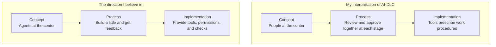
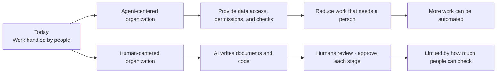
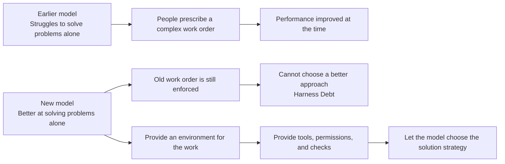

```mermaid
flowchart TB
    subgraph BIG["Compressing one large loop"]
        BR["Many requirements"] --> BD["Design · planning"]
        BD --> BI["Batch implementation"]
        BI --> BT["Integrated testing · review"]
        BT --> BF["Late product feedback"]
    end

    subgraph SMALL["Closing small loops continuously"]
        S1["Small requirement"] --> P1["Working result"] --> F1["User feedback"]
        F1 --> S2["Next small requirement"] --> P2["Next result"] --> F2["Next feedback"]
    end
```

## TL;DR

- AWS AI-DLC differs substantially from my view of agentic development across concept, process, and implementation.
- With so many data points suggesting it works, I need to go out and see for myself whether I am wrong.

## Introduction

I have long been thinking about how my current role differs from the direction I believe in.

The people I work with are still exceptionally capable and kind, and the company offers substantial stability and opportunity.

That is precisely why I have thought about it for so long.

For the past year, I managed to avoid taking the lead in communicating ideas far from my own perspective. I chose other topics, explained only the parts I agreed with, or shared my different view only with a few people close to me.

Then AI-DLC (AI-Driven Development Life Cycle), AWS's approach to developing software with AI, began spreading with more detailed procedures and tools. It became increasingly difficult to avoid.[^1][^2]

Senior employees are expected to understand the company's direction, help junior colleagues act on it, and deliver the results the company wants.

The problem is that I cannot find the motivation to actively advocate ideas that remain far from my own perspective.

Staying for title and stability while lacking confidence in the direction—doubting it in private while asking colleagues to pursue it in public—would not be honest with either the team or myself.

**If I cannot actively communicate a direction I do not believe in, I am not fulfilling the role expected of me as a senior employee.**

I want to explain where AI-DLC and my own view diverge, and why that difference has led me to reconsider my current role. These are my personal views, based on public material and my experience, not an official AWS position.

I began as a developer. Even after becoming a Solutions Architect (SA), helping customers choose technologies and design systems, I continued to build, deploy, and operate my own services. I tend to feel a stronger need to run one product over time and live with the consequences of my decisions than to observe a broad range of customer problems.

An SA with a different background and set of strengths may interpret the same role very differently.

My view differs from AI-DLC in three areas: **Concept → Process → Implementation**.

Concept means the future we aim for. Process means how we divide and repeat work to get there. Implementation means how we put that way of working into tools and the environment they run in.

The future we aim for shapes how we work, and that way of working shapes the implementation.





## 1. The Conceptual Difference — Keeping Humans at the Center

An AI agent uses tools to carry out tasks. Agentic engineering means giving development work to these agents. In an earlier post, I chose a way to judge where this approach is heading.

**I think the long-term direction of agentic engineering is to remove the human in the loop, or HITL—the need for people to keep stepping in while the agent works.**[^3]

That does not mean removing every person immediately.

It means asking why people still have to step in. Is the agent unable to reach the data, missing permission to act, or unable to check its results? Does it need help from another team? The goal is to resolve these problems one by one so the agent can finish the work on its own.

AI-DLC begins from a different premise.

In the official introduction, AI plans and executes while people make important decisions. The team meets to check AI-generated requirements and designs as they are produced, in sessions called `Mob Elaboration` and `Mob Construction`.[^1]

The more recent adaptive workflow changes the procedure to fit the task. A simple bug fix and a new system do not have to follow the same steps. It chooses which stages are needed and how much detail each requires. This is a clear improvement over the initial version.

Even so, human approval remains central rather than exceptional.

The official article also says people are needed to check whether AI's results can be trusted, who is responsible, and whether the results are correct. It therefore requires the team to review and approve the results together at every stage.[^2]

This approach can be useful for a team running its first workshop with AI, or for an organization that must make clear who is responsible for what to meet regulatory and audit requirements.

However, I have a different view of **how teams will build real services in the future**.

An organization aligned with my view removes the reasons a person is currently required, one by one.

If data is scattered and a person has to find it, connect it so the agent can find what it needs. If a person has to act because the agent lacks permission, build a tool with only the permissions it needs.

If a person must read every result because it cannot be trusted, define what the result must satisfy and check it with tests. Record logs and measurements so the team can also see how the system actually behaved.

Assuming a person will always check the work makes it easier to leave data access and permission problems unresolved, with people continuing to handle them.

The two organizations may look similar today, but I think they will look completely different in two or three years.





Suppose that three years from now it has been sufficiently proven that agents can take over major tasks.

Starting only then to connect data held separately by teams, give agents the permissions they need, and provide ways to check their results may be too late. Models change quickly. How a company manages data and assigns responsibility does not.

This is where the future I expect and the concept behind AI-DLC diverge.

## 2. The Process Difference — Making the Big Loop Run Faster

What I have found most powerful about developing with AI is **the ability to shorten the cycle of defining requirements, building, testing, and receiving feedback to something close to real time**.

In the past, even an attempt to test a small version of a product often stopped at drawing screens on paper or showing a simple screen layout.

Today, even with temporary substitutes for some functions and data, we can connect existing code and real screens to make something close to the service. Users can try it first, then decide what they need next.

Imagine the traditional software development life cycle as bending a hundred-meter wire into one large circle.

Requirements are collected, the system is designed, development and testing follow, and the circle closes for the first time only at the end.

My model of agentic development looks more like stacking ten-meter circles into a spring.

Each circle is a small feature that a user can try from start to finish. Building the screen and the processing behind it together is called a vertical slice. The size of each circle can become smaller or larger depending on the problem.





A team does not have to list requirements in a meeting room for a product nobody has ever seen. People can try the product, become familiar with it, and decide what they need next. This reduces cognitive load: the mental effort of imagining the whole product and making decisions about it.

Reviewers can also inspect one newly added behavior and its evidence instead of reconstructing the whole product at once.[^4]

The AI-DLC processes I have experienced felt closer to using AI to make the existing large loop run faster than to replacing it with many small loops.

The process I prefer instead repeatedly closes small loops of requirements, working results, and user feedback.

The official methodology does use short work periods called `bolts` and divides the work into small Units of Work. The adaptive workflow also skips unnecessary stages.

Yet the people involved still meet at each stage to build a shared understanding of the problem and its background. They review AI-generated plans and results, then approve moving to the next stage.

The total duration can fall.

But when the same volume of requirements, design decisions, and review is compressed into less time, human cognitive load can rise.

When AI sharply reduces implementation time, coding becomes a small part of the schedule, exposing product decisions, review, and launch approval as the next bottlenecks. I observed the same shift while examining Amazon's internal Frontier Development cases.[^5]

Participants in AI-DLC workshops often said that bringing stakeholders together reduced communication overhead.

That effect matters.

It may, however, come as much from Amazon's team culture as from AI-DLC itself. The Two-Pizza Team approach keeps teams small so they can decide quickly. DevOps has teams share responsibility for both building and operating the software.[^5]

If good collaboration culture and the effect of the methodology are treated as the same thing, it becomes difficult to know what another organization must reproduce.

## 3. The Implementation Difference — A Harness That Prescribes the Order of Work

These differences also show up when the way of working is built into tools and their execution environment.

A model needs background information, tools, access permissions, a place to run code, and ways to check the results. Here, I call all of these together a harness.[^6]

The longer an agent works without a person, the more it needs a good harness.

I do, however, think it is useful to divide harnesses into two categories.

| Type | Role | As models grow stronger |
| --- | --- | --- |
| Rules for thinking and work order (cognitive scaffolding) | Forces how the model should think and in which order it should work | Likely to shrink |
| An environment for doing the work (execution infrastructure) | Provides tools, permissions, an isolated space to run code, tests, and records of what happened | Remains necessary |

One approach assigns different roles to agents: a Planner makes plans, a Critic finds problems, a Reviewer checks results, and a Reflection Agent looks back over the work. People also prescribe how work should be broken down. These procedures were attempts to help models that struggled to solve problems on their own.

A strong model can choose a different first action for each problem.

It may read the error log immediately, run tests first, or look through the code's change history to find when a problem began. Some problems need a short plan. For others, writing a long plan is itself a waste of time.

If the harness always forces `Research → Plan → Break down tasks → Implement → Review → Reflect`, it decides in advance how the model must solve the problem.

Rules created to help an older model may get in a newer model's way. I call the problem of keeping those rules instead of removing them **Harness Debt**.





Pi, which has recently attracted attention, describes itself as a "minimal agent harness": a harness with a small set of basic features. Users can add features through extensions, task instructions through skills, and reusable requests through prompt templates to create their own workflows.[^7]

That freedom is appealing.

But with the latest models, making more changes yourself does not guarantee better results.

A procedure designed by the user may stop the model from choosing a better approach. Some payment and financial tasks have work sequences and approval rules that must be followed. Fixed procedures may be needed there, but whether all software development should work that way is a separate question.

The organizations behind Claude Code and Codex develop both models and agent products. With each new model, they can test what information and instructions it still needs and which decisions it can make on its own. Choosing and organizing that information and those instructions is called context engineering.

Anthropic also says it is difficult to predict what information and instructions future models will need. In Managed Agents, it therefore separates and connects the session, which manages work records; the harness, which helps the model do the work; and the sandbox, an isolated place to run code.[^8]

OpenAI's Codex case does not focus on teaching the model a long sequence of thinking steps. It focuses on automatically checking that code follows the agreed structure and rules, and using tests to check the results.[^9]

That is close to the role I expect a good harness to play.

> **A harness should provide the playing field, not decide how the model plays the game.**

The harness decides which code repositories the model can read, where it can run commands, which data it can access, which actions are forbidden, and which tests it must pass.

Within those boundaries, the model should choose how to solve the problem whenever possible.

AI-DLC's adaptive workflow greatly reduces the problem of applying the same procedure to every task.

Even so, the tools still prescribe what to produce at each stage, when to get approval, and when to review the work together. I think this still amounts to prescribing how the model should think and in which order it should work.

As models improve, I think we should revisit the work sequences and solution strategies prescribed by the harness, and delegate more of those decisions to the model.

## 4. Real Results Are What Challenge My View Most

If I were completely certain up to this point, I could simply continue in my own direction. The hardest part is something else.

**More cases than I expected keep appearing in which teams built real services and achieved results with AI-DLC.**

An AWS article connects parts of the process used to build Bedrock Mantle with AI-DLC. Six people built it in 76 days. The article also describes an early adoption case at a European financial institution, where one product owner and three developers delivered up to 35 features per sprint—a fixed period of work.[^10]

But Mantle's success alone does not prove that the full AI-DLC methodology caused those results.

The project had excellent engineers, fast decisions, and good internal tools. It also involved building a new system rather than changing an existing one. The public article itself carefully says that some of the processes and tools used for Mantle are now parts of AI-DLC.

The result still exists.

Whenever I hear similar stories, I wonder whether I have missed another reason for those results. I also question whether I am assuming that what happened in my personal projects applies to other teams.

At times, I cannot tell whether I am overvaluing my experience or undervaluing the results described inside the organization.

I do not think I can resolve that question from my current position.

I am closer to explaining AI-DLC and helping customers adopt it than to operating one product and team for years and owning the method's results end to end.

I do not want to decide which approach works better under which conditions from presentations and workshop reactions alone.

I want to choose a real customer problem, lead a team, and launch a service. I want to experience the outages and problems within the organization that follow before reaching a conclusion.

**I think I need to run a product with a real team and live with the consequences of my decisions to find the limits of my perspective**.

## 5. Breadth Alone Has Not Satisfied My Need for Depth

There is a video from a 1992 MIT talk in which Steve Jobs discusses consultants.

<iframe width="560" height="315" style="width: 100%; max-width: 560px; aspect-ratio: 16 / 9; height: auto;" src="https://www.youtube.com/embed/-c4CNB80SRc" title="Steve Jobs on consultants" frameborder="0" allow="accelerometer; autoplay; clipboard-write; encrypted-media; gyroscope; picture-in-picture; web-share" referrerpolicy="strict-origin-when-cross-origin" allowfullscreen></iframe>

Jobs argues that seeing many companies is not enough if you never implement your recommendations or live with their results and failures over time. His analogy is that you may have seen many pictures of fruit without ever tasting it.[^11]

I do not want to turn that into a judgment of every SA. Working with customers over time and revealing recurring patterns and options across companies are real forms of expertise.

But one question remains for me: `Do I experience the operational consequences of my recommendation?` I invest my own time and money in services with roughly 200,000 and 100,000 lines of code and take responsibility for their operations, but they are not official customer cases.

Working on a range of customer problems as an SA has been valuable. What I need now is the experience of leading a team and running a product over time, then using the failures and operational results to inform my next decisions.

I have also seen people in product organizations who only complete assigned tickets and collect a paycheck without caring about the outcome. **Owning an outcome requires staying involved from problem definition through operation.**

As AI narrows the differences in people's ability to write code, how the team works together becomes more important. People need to share the problem and its background, check results, and improve the harness so the same failures do not happen again. Amazon teams using the same tools produced sharply different results for the same reason.[^5]

I want to work with **a team that runs a product together and uses what went wrong to inform its next decisions**.

## Conclusion

AI-DLC can be a practical answer for organizations adopting AI for the first time or needing strict control over approvals and responsibilities. I still believe, however, that agentic engineering will move toward removing the reasons people were required in the system rather than positioning them more effectively at its center.

What exhausts me most is not disagreement itself, but having almost nowhere to discuss these ideas comfortably. Before we can talk about the customer problem, I spend most of my time and energy explaining why people should have to step in less often, and why we should build small pieces and get feedback frequently.

A team with firsthand experience of agentic engineering would not need to agree on every conclusion. Having been through similar work would let us focus more on **how to solve the customer problem and change the way we work and the harness we use**.

My goal is therefore to change jobs by the end of the year. More than a company name or title, I want a team that takes customer problems seriously and shares responsibility for operations. I would also like to learn new development practices and share them with colleagues on a team whose view of AI's future fits mine.

If I cannot find such a team, I am also considering starting a small company that uses AI. I would like to try Lean Startup: build something small, see how customers respond, and use that to decide what to do next.[^12] Taking responsibility for everything from choosing the customer problem to developing and operating the product would let me find out whether my ideas work.

**I want to find out whether my ideas hold up with a real team working on real customer problems.** I am now looking for a team where I can gain that experience.

---

[^1]: AWS, [AI-Driven Development Life Cycle: Reimagining Software Engineering](https://aws.amazon.com/blogs/devops/ai-driven-development-life-cycle/) (2025.07.31) — introduces the core AI-DLC structure in which AI plans and executes while people validate important decisions.

[^2]: AWS, [Open-Sourcing Adaptive Workflows for AI-Driven Development Life Cycle](https://aws.amazon.com/blogs/devops/open-sourcing-adaptive-workflows-for-ai-driven-development-life-cycle-ai-dlc/) (2025.11.29) — describes changing the procedure to fit the task while keeping human checks at each stage.

[^3]: [A Lens for Interpreting Phenomena—and Agentic Engineering](/en/2026/06/12/lens-for-agentic-engineering.html) — explains the use of HITL removal as a lens for interpreting the direction of agentic engineering.

[^4]: [AI Wrote the Code Faster—Why Is Review Harder? Reducing Shifted Cognitive Load](/en/2026/08/18/ai-coding-review-cognitive-load.html) — discusses cognitive load moving into review and the need for small development cycles.

[^5]: [Why Did Some Teams Get Up to 10x Faster with the Same AI Tools?](/en/2026/08/31/frontier-development-habits.html) — examines Amazon cases in which product decisions and launch approval became bottlenecks after implementation accelerated.

[^6]: [How I Built the EncBird Harness Layer by Layer — Harness Engineering in Practice](/en/2026/06/16/harness-engineering-in-practice.html) — describes adding the information, tools, checks, and execution environment a model needs in a real project.

[^7]: [Pi Coding Agent](https://pi.dev/) — a harness that lets users build workflows by adding features, task instructions, and reusable requests.

[^8]: Anthropic, [Decoupling the brain from the hands](https://www.anthropic.com/engineering/managed-agents) — explains the Managed Agents design that separates session, harness, and sandbox.

[^9]: OpenAI, [Harness engineering: leveraging Codex in an agent-first world](https://openai.com/index/harness-engineering/) — describes an agent's work environment that automatically checks code structure and rules and tests the results.

[^10]: AWS, [AI-Driven Development Lifecycle for Financial Services](https://aws.amazon.com/blogs/industries/ai-driven-development-lifecycle-for-financial-services/) (2026.05.26) — presents the Bedrock Mantle case and an early European financial-services adoption case.

[^11]: MIT Sloan, [Steve Jobs talks consultants, hiring, and leaving Apple in unearthed 1992 talk](https://mitsloan.mit.edu/ideas-made-to-matter/steve-jobs-talks-consultants-hiring-and-leaving-apple-unearthed-1992-talk) — summarizes Jobs's argument that learning can remain shallow without implementing recommendations and living with their consequences over time.

[^12]: [Why Avoiding Failure Comes First](/en/2026/06/27/failure-comes-first.html) — explains my ideas about using AI to lower the cost of experiments and choosing the next attempt based on customer responses.
