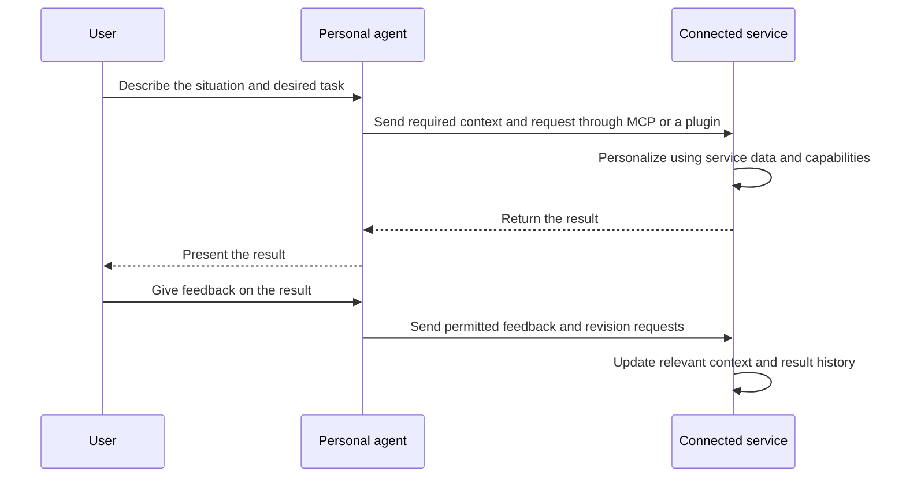

## TL;DR

- Business moats are shifting from the application layer to data.
- Agents will become the next web browser for accessing services.
- I want to connect my service's data and capabilities to agents through MCP or plugins.

## Introduction

People seemed interested whenever I described my recent idea for a “headless community.” But when I asked, “Do you think there's no money in this?” nobody had a ready answer. I was asking because I didn't think it would make money either.

In a headless community, the operator provides data and capabilities instead of a user interface, and each user's agent selects and presents the posts. The idea came from reading a hard-to-understand Reddit comment on my way home from work. I wondered whether people could read community posts in their own language and in a style familiar to them.

I opened Codex, wrote a product requirements document (PRD) using ALPS, and built it. The requirements were simple, so implementation and testing took about five hours. After using it for a few days, it felt surprisingly usable. The business model was less clear: even if I sent ads alongside the posts, an agent could remove them while summarizing, and I would have trouble knowing whether anyone had actually seen them.

I put the project on hold and reconsidered the business model. Perhaps there was a way to make money from connecting directly to a personal agent that knows its user well. I plan to experiment with that approach in EncBird, the English learning service I run.

This led me to think that **as agents get stronger, business moats are shifting from the application layer to data**. If agents take on more of the work of building interfaces and features and connecting services to complete tasks, what sets a service apart will change too.

## 1. Agents Will Become the Next Web Browser

These days, I often leave my writing with an agent instead of opening Obsidian and writing there myself. The agent organizes it and saves it in my vault, the folder where I keep my notes.

I use the agent to capture and organize my writing, and Obsidian to store and review the results.

In a web browser, I find a website and work through the interface that service provides. When I delegate a task to a personal agent, it finds the services it needs, calls them, and brings back the results. I describe what I want to the agent rather than learn each service's interface and how to use it.

Just as the browser became a common entry point to many websites, I think the agent will become a common entry point to many services.

Several products already support this kind of work. OpenAI's dots use conversations and memory to continue tasks and can delegate work to background agents.[^1] Meta's Muse works across connected apps and a browser, using preferences and information learned from conversations in later tasks. Users choose which services to connect and how much access to grant.[^2]

Claude Projects provides a workspace for collecting related materials and instructions and working within that context. A new version, available in beta to some Pro and Max subscribers who use Claude Code, splits requests from one conversation into tasks that run in the cloud. Each task receives the project's files, repositories, instructions, and memory.[^3]

Users can also build the tools they need. With Claude Artifacts, they can create dashboards or small interactive tools and revise them through conversation. On supported plans in the web and desktop apps, artifacts can read and write data in connected apps or store data between sessions.[^4]

Beyond collecting material and asking questions about it, people can now build tools to work with that material and have those tools carry out tasks.

## 2. Moats Are Moving from the Application Layer to Data

Building interfaces, organizing information, and running a sequence of functions used to be the job of the application layer. As agents take on that work, I think a service's moat—its competitive advantage—will change too.

If an agent can build the tools people need or combine existing services to do the work, maintaining an advantage through polished interfaces and features alone will become harder. But an agent cannot instantly recreate the data a service has accumulated through actual operation.

**The data a service has, and the results it can produce with that data, will matter more in setting it apart.**

Hyperpersonalization is one way to think about this shift. Knowing a user's specific situation and goals can let the same feature produce a different result.

For example, an English learning service could offer different exercises when it knows only that someone is “an office worker studying English” versus knowing that they “need to explain a technical topic in a customer meeting next week and repeatedly struggle with certain expressions.”

It is hard to capture that context in a single signup questionnaire. A service needs to build up a history of what users requested, which results helped, and what they asked to change. Copying a feature does not instantly reproduce that history.

In an earlier post about chatbots and user data, I discussed a feedback loop in which a service learns users' specific needs and applies that knowledge to later results.[^7] At the time, I was thinking about putting a chatbot inside a service to collect that context.

But the services where I spend the most time these days are ChatGPT and Codex. I often talk about my work, interests, and concerns, so I feel that a lot of information about me is accumulating there. If user context is gathering in personal agents, we should reconsider making people enter the same information from scratch in every service.

## 3. Connecting Data and Capabilities to Agents

If user context accumulates in a personal agent and people start using services through it, I think services need to be available in a form that agents can use directly.

I am considering MCP and plugins as ways to do that. MCP, the Model Context Protocol, connects agents to external tools and data. A plugin adds capabilities and instructions to a particular agent environment. Describing what a service can do and what inputs it needs lets an agent use those capabilities while handling a user's request.

Notion uses MCP to let external agents search, read, create, and update pages.[^5] Even when a user asks an agent to do the work, the data stays in Notion, and access follows the connected user's permissions.

My use of Obsidian is similar. The agent organizes my writing, but the results still go into the vault. Even if the agent becomes the tool the user interacts with, a service still has a role in storing data and providing capabilities.

A service could receive the context it needs and produce a personalized result, or an agent could receive data from the service and use its own context to select and organize it. The translation and recommendation features I imagined for the headless community are closer to the latter.

Connecting through MCP does not, however, give a service the user's entire conversation history or memory. The official MCP architecture also describes keeping the full conversation in the app running the agent and passing only the necessary context to servers.[^6] What context is available depends on the platform's capabilities, user permissions, and the actual tool call.

In the English learning example, the inputs could be the goal of preparing for a customer meeting and the expressions to practice.

If personalization happens in the service, the flow could look like this.





By retaining task results and feedback within the permitted scope, the connected service could accumulate the personalization data it needs for its work. In this arrangement, the personal agent holds the user's broader context, while the service learns which results helped within its own area.

## 4. Exploring UX and a Business Model for EncBird

I am also considering letting EncBird users create their own user experience (UX), including interfaces and learning flows. When I wrote about the headless community, I imagined people using public APIs and MCP to create whatever interface they wanted, whether it resembled Excel or an internal company portal.[^8]

EncBird would provide the data and learning capabilities, and users would work with their agents to build interfaces and learning flows that suit them. For example, they could make a table of expressions to review or a screen for practicing one expression at a time.

The business model I have in mind is to offer these capabilities through MCP or plugins and charge for those that create additional value from user context.

Not every feature needs to be paid. Free features would give users a reason to connect the service, with one or two paid hyperpersonalization features alongside them.

If an agent can do enough simply by organizing freely available material, users have no reason to pay the service extra. A paid feature needs to offer a benefit that comes from combining the service's data and capabilities with the user's context.

That means separately designing the data and capabilities the service provides, the context it needs from the agent, and how that context changes the result. I also need to consider what feedback to retain and how to apply it to later results.

What I want to check first in EncBird is how much context the service can actually receive, and whether users will pay for the difference that context makes. I want to start with a useful capability that gives people a reason to connect, then experiment with improving personalization through repeated use.

## Conclusion

As agents take on more work, I expect some of the interfaces and features that services used to provide to move into agents. In that process, business moats are shifting toward the data services accumulate and use, rather than the application layer.

I also think agents will become the next web browser for accessing services. As service builders, we need to think about connecting our data and capabilities to agents alongside bringing users to our websites.

With EncBird, I want to experiment with providing data and learning capabilities through MCP or plugins and letting users build their own UX. Through that work, I hope to find out what value personalization based on user context can create.

---

[^1]: [OpenAI dots — Tasks and memory](https://learn.chatgpt.com/docs/dots/tasks-and-memory)
[^2]: [Meta — Introducing Muse](https://about.fb.com/news/2026/09/introducing-muse-personal-ai-agent/)
[^3]: [Claude — What are projects?](https://support.claude.com/en/articles/9517075-what-are-projects)
[^4]: [Claude — What are artifacts and how do I use them?](https://support.claude.com/en/articles/17153992-what-are-artifacts-and-how-do-i-use-them)
[^5]: [Notion MCP](https://developers.notion.com/docs/mcp)
[^6]: [MCP architecture](https://modelcontextprotocol.io/specification/latest/architecture)
[^7]: [Why Your Business Should Build Its Own Chatbot Now](/en/2025/06/03/why-your-business-should-start-your-own-chatbot-now.html)
[^8]: [The Headless Community Idea — LinkedIn](https://www.linkedin.com/feed/update/urn:li:activity:7510882185231581184/)
