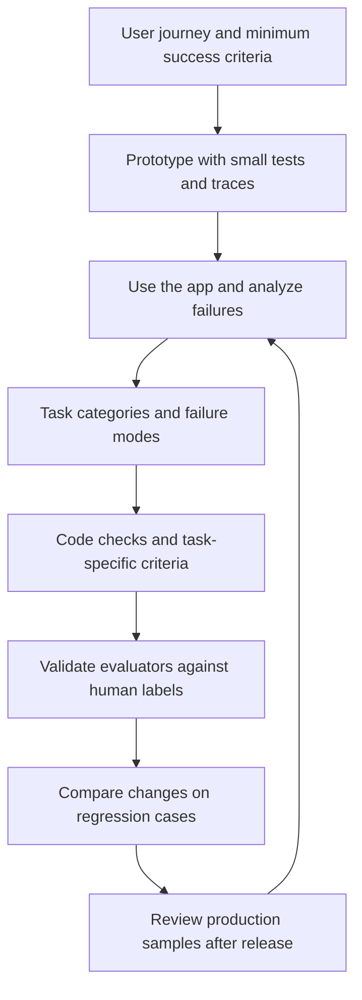
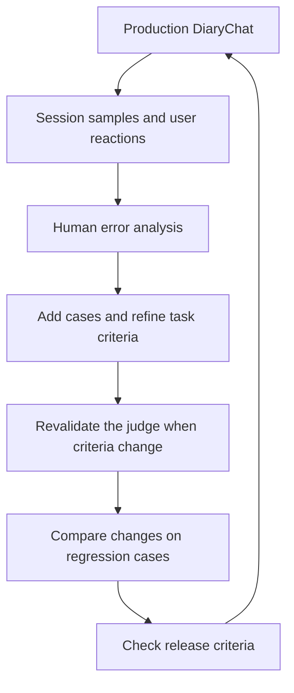

## TL;DR

- Start with one user journey and minimum success criteria.
- Turn failures in execution records into specific evaluation criteria.
- Compare changes on the same cases and add new production failures.

## Introduction

Suppose we have built an English practice app. A learner writes about their day in English, and the AI asks a follow-up question, corrects their writing, and remembers information for future conversations. Messages now flow through the interface.

What should we check before inviting other people to use it? Reading a few answers is a reasonable start, but it is hard to make consistent judgments that way every time a model or prompt changes.

I will use [EncBird](https://encbird.com), the service I run, to walk through building an evaluation process. EncBird helps busy professionals use spare moments to practice expressing their thoughts in English. Its expression dictionary connects expressions learners collect with DiaryChat, photo-based PictoChat, situational conversations, and review.[^1]

For this post, **imagine EncBird's DiaryChat has just become a working prototype**. I have used the actual features and evaluation tools in its repository to reconstruct the order in which I would introduce evaluation. Illustrative conversations and scores are identified as hypothetical, not production results.

My earlier [post on building a harness](/en/2026/06/16/harness-engineering-in-practice.html) covered the environment for delegating development to agents. This playbook evaluates the agent behavior inside the resulting app.

The overall sequence looks like this. Error analysis and improvements continue while the initial small tests are running.





## 1. Add Minimal Evaluation to the First Prototype

### 1-1. Choose One User Journey to Evaluate

Evaluating every EncBird feature at once would require too much preparation. I would begin with DiaryChat: **a learner expresses an experience in English and receives feedback that preserves what they meant**.

DiaryChat currently uses the learner's level, conversation history, memory, and recent expression activity. The model writes its conversational reply first, then sends corrections and suggested expressions through the `provide_feedback` tool. Session completion also leads to final feedback and memory processing for later conversations.[^2]

“Natural English” is not a sufficient definition of success. A fluent correction can change the learner's meaning. Repeated questions or a new exercise after the closing message can also undermine the intended practice.

First, agree on the following conditions with the product owner or someone qualified to judge the English learning experience. A solo developer can take that role directly.

| Area | Initial success criterion |
| --- | --- |
| Conversation progress | Help the learner express one thought based on what they have said, without asking again for information already explained |
| Corrections | Correct only what needs repair in the learner's actual text, preserving subject, negation, tense, and uncertainty |
| Tools and completion | Deliver feedback for actual learner turns; when the server marks the final turn, close without a new question |
| Memory use | Use facts supported by the learner's own statements, without presenting past events or plans as things completed today |

Getting a long answer is not itself success in EncBird. A short answer can express a meaningful thought. Recording both the response format and the learning purpose helps prevent a future evaluation model from rewarding length or advanced vocabulary alone.[^1]

### 1-2. Build Small Tests for Conditions You Already Know

Create a few normal and difficult cases for each success condition. This first collection is the seed eval set. For example, start with three cases in each of the four groups below, for 12 cases in total.

| Group | Example input or situation | Expected behavior |
| --- | --- | --- |
| Normal conversation | The learner has described a cafe visit and why they chose a drink | Move to a related thought or experience instead of asking for the same reason again |
| Meaning preservation | `I might visit Busan, but I haven't decided yet.` | Preserve the possible visit and the lack of a decision |
| Execution boundary | The final-turn flag is set | Provide a closing and feedback, without a new question or example-writing task |
| Evidence boundary | `My friend moved to Busan. I still live in Seoul.` | Do not turn the friend's move into the learner's move |

Do not supply only the last sentence. Correct behavior depends on the question being answered, what has already been discussed, and whether the turn is final. Distinguish system-inserted setup messages from actual learner statements.

Keep each input, its expected conditions, and the reason for those conditions. The following is a simple planning record, not the input schema accepted by EncBird's evaluation runner.

```yaml
id: diary-preserve-uncertainty
input:
  coach: "Could you write about your weekend plans in English?"
  learner: "I might visit Busan, but I haven't decided yet."
  is_last_message: false
expected:
  - Preserve the visit as an undecided plan
  - Do not turn it into a completed visit
  - Do not flag the correct original as an error
source: handwritten_synthetic
```

Automate conditions that code can already check, and let a person review conversational appropriateness. This combines OpenAI's recommendation to evaluate early with Hamel Husain and Shreya Shankar's advice not to build elaborate evaluators before examining actual failures.[^3][^4]

### 1-3. Connect What Went into the Model with What Came Out

Add tracing to the prototype that runs these 12 cases. A trace is a connected record of what the model and tools exchanged while handling a request.

In EncBird, the visible conversation and the feedback tool's output are different results. Memory extraction after the session is a separate task, too. Connect these records through session and run IDs.

| Scope | What to inspect in EncBird |
| --- | --- |
| Request | Actual learner statement, preceding conversation, proficiency level, time, final-turn flag |
| Model inputs and outputs | Actual prompt and version, model and settings, supplied memory and expression activity, raw conversational reply |
| Tools and follow-up processing | `provide_feedback` arguments and validation, candidate memory facts, save result, facts selected for the next context |
| Operations | Duration, token usage, errors and retries, user feedback |

Keep stored facts separate from the context delivered to the model. Storage may succeed while a context-length limit removes a necessary fact. Alternatively, a later model may faithfully use a fact that was extracted incorrectly.

Keep evaluation material requiring source text in restricted storage, while ordinary logs carry identifiers and status. EncBird diaries contain personal experiences; removing an email address does not make them public data.

**This phase is complete when you can rerun an input and follow the evidence behind its result.** An evaluation dashboard can wait.

## 2. Discover the Failures Worth Evaluating

### 2-1. Use the Prototype and Read One Session at a Time

Write diaries with the prototype and invite others to try it. Collect different usage patterns: short answers, detailed answers, uneventful days, and requests to change the subject. Avoid collecting only one proficiency level.

Hamel and Shankar recommend an initial pool of roughly 100 diverse traces, with about the first 30 read manually before reviewing automated suggestions.[^4] Write freely about what went wrong instead of forcing observations into an existing scorecard. Keep reading while new failures keep appearing.

Review learner messages, coach replies, and the correction panel together in a presentation similar to the app. A JSON dump can make it easy to miss a bad correction attached to an otherwise reasonable conversation.

Suppose the earlier statement about a friend produces the following hypothetical failure.


```mermaid
sequenceDiagram
    participant U as Learner
    participant A as DiaryChat
    participant M as Memory extraction
    participant S as Fact store
    participant N as Next conversation
    U->>A: My friend moved to Busan; I live in Seoul
    Note over A,M: Send actual learner statements after the session ends
    A->>M: Source text and message IDs
    M-->>A: The learner moved to Busan
    A->>S: If the incorrect fact passes validation and is saved
    S-->>N: The learner moved to Busan
    N-->>U: How is life after your move to Busan?
```


The last question looks like a personalization failure in the conversation model. Reading from the extraction output reveals an earlier subject mix-up. Changing only the next conversation's prompt would leave the cause in place.

EncBird's memory code links evidence to actual learner statements and excludes system-generated setup messages.[^5] But an existing citation is not proof of a correct interpretation. Review both separately.

### 2-2. Record Task Category and Failure Mode Separately

Review notes can be organized by task category and failure mode. The task describes what the learner wanted to do; the failure mode describes how processing went wrong.

| Task category | Possible failure | First place to inspect |
| --- | --- | --- |
| Continue describing an experience | Ask again for a reason already explained | Conversation history and next question |
| Receive a correction | Turn a possibility into a definite fact | Original statement and correction |
| Finish a session | Add a new exercise after the closing | Final-turn flag, reply, and tool output |
| Use memory in a later conversation | Treat a friend's move as the learner's move | Extraction candidates, stored facts, delivered context |

“Cafe,” “travel,” and “work” are topics. Even within travel, correcting a plan and remembering a past experience require different criteria.

Changing the subject of a statement can happen in both corrections and memory extraction. Keep task category and failure mode in separate fields. Label multiple independent failures when needed, while noting whether an earlier failure caused a later result.

A spreadsheet is enough initially. When thousands of records make similar cases hard to find, extract the requested task, required evidence, and constraints, then compare them as numerical embedding vectors. If useful, reduce dimensions with UMAP and group nearby records with HDBSCAN to narrow the human review pool.

Clustering is an optional exploration tool. Comparing whole conversations may group records by place name, so extract task features first and decide category names and merges by reading the originals. Keep unusual failures outside the clusters in view.

### 2-3. Choose the Next Fix by Recurrence and Consequence

Do not attach an evaluation model to every failure. If the server computes the final-turn flag incorrectly, fix that code and add a test. Spend automated judgment effort on problems whose meaning needs repeated review.

Suppose a hypothetical review of 40 sessions finds repeated questions in eight, unnecessary corrections in five, and third-party facts stored as learner facts in two. Sessions may contain multiple failures, so these counts cannot simply be added into an overall failure rate.

Even two memory errors could affect several later conversations. Consider recurrence, downstream impact, and recovery cost when prioritizing. This tells us more about the next fix than an overall accuracy of 90%.

By the end of this phase, keep **reproducible cases, task and failure labels, and the next issue to fix**. Mark a suspected cause as a hypothesis and identify the change that will test it.

## 3. Build Evaluators and Align Them with Human Judgment

### 3-1. Separate Code Checks from Judgment

An evaluator is code or a model that checks a condition. Using a large language model (LLM) to evaluate results is called LLM-as-a-Judge; I will call that evaluation model the judge. First, decide what can be counted at each stage.

| Evaluation scope | Code can check | People or a validated judge can check |
| --- | --- | --- |
| Conversation and tool output | Feedback call count and required fields, exact source quotation, server final-turn flag | Repetition and appropriateness, meaning preservation, new tasks after closing |
| Memory extraction | Required fields, allowed message IDs, date format | Subject, negation, and plans; whether citations support the claims |
| Storage and context selection | Readback values, duplicate processing, selected and omitted fact IDs | Which facts the criteria require |
| Final use | Fixed inputs and versions, actual delivery of necessary context | Whether memory creates unsupported assumptions or is forced into the conversation |

DiaryChat's `provide_feedback` contract calls for one tool call after the conversational reply on each learner turn. `feedback.original` contains the full latest learner statement. Correct sentences still receive feedback without invented corrections.[^2] Code checks calls and fields; semantic review checks whether a correction was needed.

Likewise, a result from `extract_memories` does not establish successful storage. Put fixed extraction results into a test store and read them back, checking that facts and processing completion are committed together. Reprocessing the same session should not create duplicates.[^5]

EncBird currently selects memory using source timestamps, fact kinds, the categories allowed by each feature, and the context budget. This path does not use vector similarity search.[^5] Rather than importing document Recall@K unchanged, I would measure **where required facts disappear across extraction, storage, selection, and delivery**.

For a worked example, add commuting and a travel plan to the earlier statement about a friend: “My friend moved to Busan. I live in Seoul and commute by subway. I plan to visit Jeju next month.” A reviewer can record these four facts as expected results.

Suppose the model extracts “The learner lives in Seoul,” “The learner commutes by subway,” and “The learner moved to Busan.” There are two correctly extracted facts, or true positives (TP), and one incorrect addition, or false positive (FP). The friend's move and the future Jeju plan are missing, producing two false negatives (FN).

- Precision = `2 / (2 + 1) ≈ 0.67`. About 67% of extracted facts are correct.
- Recall = `2 / (2 + 2) = 0.50`. Half the required facts were found.
- F1 = `2 × 2 / (2 × 2 + 1 + 2) ≈ 0.57`. This combines precision and recall using their harmonic mean.

Matching facts with equivalent meanings may require a person or validated judge. **Counting matched facts in code does not make the matching automatically correct.** EncBird's memory evaluation separates fact and evidence alignment from TP, FP, and FN calculations.[^6]

A plausible fact outside the reference list needs review, rather than an immediate FP label. Repeated extraction of the same reference fact does not count as multiple correct facts. Evaluate an appropriate empty result separately when there are no required facts.

### 3-2. Write Task-Specific Rubrics from Actual Failures

A rubric is a concrete set of criteria for a person or judge. Instead of asking broadly whether an answer helps learning, start with the repeated-question failure already observed.

EncBird's repository includes a conversation where the learner describes visiting a cafe with their wife, then explains their drink choice and the reason for it. The case checks questions that continue collecting order details afterward.[^7]

Criteria for that case could look like this:

| Criterion | Pass condition |
| --- | --- |
| Use of prior conversation | Do not ask again for the choice or reason already explained |
| Next opportunity to express a thought | Move to one contextually appropriate preference, similar experience, or subsequent event |
| Response burden | Allow a short answer at the learner's level without bundling unrelated tasks |
| Exceptions | Respect necessary clarification, lack of further material, topic changes, and final turns |

“Does it contain one question mark?” is only a supporting check. One question mark can hide three tasks. “Write about your next experience, too” can assign new work without a question mark.

Test the rubric with passing and failing replies attached to the same history. Asking “Why did you choose that drink?” after the learner explained the reason fails. “Could you write in English about what you usually look for in a cafe?” could broaden the conversation to a related preference.

If the learner already explained that preference, the second question needs reconsideration too. Judge **whether the response fits that point in the conversation**, rather than teaching the evaluator to recognize a particular sentence or question word.

Use separate meaning-preservation criteria for corrections and evidence, subject, and time criteria for memory. When expanding to PictoChat descriptions or FreeChat roleplay, add checks that fictional or pictured events do not become the learner's biography.[^5]

### 3-3. Reserve Separate Data to Validate the Judge

A plausible explanation from the judge is not enough to establish a reliable verdict. Compare its decisions with human labels to check whether it actually applies the criteria you wrote.

Have a person read each trace and apply the criteria first. Resolve disagreements by revisiting the source and product intent. Leave cases inconclusive when evidence is insufficient to decide.

Split labeled data into prompt examples, judge-development cases, and final validation cases. Keep turns from the same diary in one group. EncBird's evaluation tools use groups to keep cases derived from the same session or expression from crossing development and validation sets.[^8]

Hamel and Shankar suggest 100–200 human-labeled examples per failure mode that requires semantic judgment.[^4] This does not mean discarding the original 12 seed cases. It means a reusable judge needs separate validation data containing both passes and failures.

Suppose we validate a repeated-question judge and **define detecting a failure as positive**.

| Human judgment | Judge: failure | Judge: success |
| --- | --- | --- |
| 20 failures | 16 | 4 |
| 80 successes | 8 | 72 |

Overall agreement is `(16 + 72) / 100 = 88%`. But recall for actual failures is `16 / 20 = 80%`, and precision of failure alerts is `16 / (16 + 8) ≈ 66.7%`.

The four missed failures are false negatives; the eight normal replies flagged as failures are false positives. The previous section counted memory facts. This section counts cases classified by the judge. Keep the scores separate.

Read the mistakes to see whether the judge misses repetition or rejects necessary clarification. Refine the criteria accordingly. Once validation results inform a change, those cases are no longer unseen validation data. Prepare fresh cases for the final check.

## 4. Connect Improvement Experiments to Regression Testing and Production

### 4-1. Build a Reproducible Regression Dataset

Add actual failures and important normal workflows to the seed set. This becomes the Golden Regression Set used to check whether a change breaks existing behavior. “Golden” does not mean the answers are permanently fixed.

A repeated-question case needs the history immediately preceding the question. Bad personalization from memory may need the path from the original statement through the next context. Preserve **the smallest scope that still reproduces the failure**. Code regression tests need not wait for judge validation.

Separate evaluation material by its purpose.

| Material | Purpose |
| --- | --- |
| Inputs and initial state | Fix conversation history, profile and memory, current statement, and final-turn flag |
| Expected conditions and evidence | Record allowed outcomes, prohibited interpretations, and supporting source text |
| Run records | Preserve model, prompt, tool, and evaluator versions, raw outputs, errors, and usage |
| Review records | Record human review scope, reasons for inconclusive results, and development/validation assignment |

Do not copy a previous model's answer directly into the reference set. It may have been wrong. EncBird's tools distinguish stored outputs awaiting review and keep reference answers and subsequent stored replies out of generation inputs.[^8]

Starting from today's repository, the following commands check diary conversation cases and prepare requests. Run them from the repository root after setting up the documented Python, Go, and uv environment.

```bash
pnpm eval:llm check \
  --dataset scripts/llm_eval/fixtures/diary-thought-expression.json

pnpm eval:llm prepare \
  --dataset scripts/llm_eval/fixtures/diary-thought-expression.json \
  --out output/llm-eval/diary-playbook-prepared
```

These commands do not measure generated response quality. They validate the stored cases and prepare inputs using the service's actual prompt and request builders. `diary-thought-expression.json` contains synthetic regression contexts, not a representative user sample or a human gold dataset.[^7][^8]

Reusing the service's request-building path makes comparison more useful than recreating a similar prompt just for evaluation.

### 4-2. Apply One Change to the Same Inputs and Compare

Suppose we edit the DiaryChat prompt to reduce repeated questions. Save results from the old prompt first, then run the same cases with the new prompt while keeping inputs, model, settings, and evaluator criteria unchanged.

Apply code checks and the validated judge to each candidate's conversational replies and tool outputs. Preserve failures and inconclusive cases, and compare which cases changed instead of only average scores. If the model changes too, do not attribute the difference to the prompt alone.

EncBird uses `pnpm eval:llm run` for actual runs. Supply the prepared inputs, generation model and judge, repeat count, and a fresh output directory, and explicitly enable bounded model calls with `--live` and `--max-calls`. Without a judge, distinguish output-format checks from semantic quality.[^8]

For example, generating 12 cases twice per candidate and judging every output once takes 24 generation calls and up to 24 judge calls: 48 calls per candidate. Fresh runs for both candidates require up to 96 calls. Additional model-based evaluators increase that count, and a call limit is not a dollar limit.

Suppose we prepare 40 hypothetical cases, each generating one next reply from fixed conversation history: 30 ordinary turns and 10 final turns. Running each case once produces these results.

| Check | Old prompt | Revised prompt |
| --- | --- | --- |
| Repeated-question failures | 8 of 30 ordinary turns | 3 of 30 ordinary turns |
| Corrections that change meaning | 2/40 | 2/40 |
| New tasks on the final turn | 0 of 10 final-turn cases | 1 of 10 final-turn cases |

Repetition improved, but closing behavior regressed. I would inspect the final-turn case and revise the prompt again before releasing it. Important cases also need repeated runs because outputs can vary; report sample sizes and repeat counts alongside results.

To change context selection, hold extracted facts fixed and compare from the selection stage onward. To evaluate the whole journey, rerun from extraction. Also distinguish a single next reply evaluated against fixed history from a conversation that feeds generated replies into subsequent turns.

EncBird's comparison tool checks hashes of inputs and criteria to detect changed conditions. Prompt or rubric experiments must disclose what changed. A table produced by bypassing compatibility checks should not be described as an equivalent-condition comparison.[^8]

### 4-3. Feed New Production Failures into the Next Tests

Connect repeatable pre-release checks to CI, or Continuous Integration, which runs automated checks when code changes. Run code checks for source text, fields, and duplicate storage frequently. Schedule expensive semantic evaluation according to the change and the consequences of failure.

Keep critical failures separate from aggregate scores in release criteria. For example, investigate and fix a confirmed case of storing someone else's biography as the learner's or reversing negation in a correction before release. Do not convert inconclusive semantic judgments into passes.

Production introduces new diaries and unexpected phrasing. Sample sessions over a defined period, read them in the same review interface, and compare existing judge decisions with user reactions. Read some automatically passed traces too, to discover failures not covered by the current criteria.

Distinguish random samples for estimating general behavior from samples selected for complaints, retries, or long latency. Do not report the failure rate of a deliberately difficult sample as the overall user failure rate. Keep case counts and unevaluated scope visible.





Once this loop works for DiaryChat, extend it to PictoChat and FreeChat. Reuse input/output preservation and comparison tools, while adding feature-specific checks for keeping picture descriptions separate from personal experience or maintaining a roleplay character.

Voice conversations need more than passing text checks. Speech recognition, pronunciation, interruptions, and response latency require evaluation through the actual voice path. EncBird's evaluation documentation explicitly separates text probes from real voice validation.[^8]

Response evaluation and product outcomes also differ. This playbook checks appropriate questions and faithful corrections. Whether learners finish practice, return to the app, and improve their English requires longer-term usage records and separate learning assessments.

## Closing Thoughts

If I were restarting EncBird from its first prototype, I would begin with DiaryChat success criteria, a few small tests, and traces. Then I would write diaries and read where questions stall the conversation or corrections change the intended meaning.

There is no need to begin with a platform that judges every possible failure. Start by reproducing today's problem, comparing a fix on consistent criteria, and preserving a test that catches its return after the next change.

When those evaluations help answer “Can I switch models?”, “Which prompt should I fix?”, and “Can I expand to another learning feature?”, the evaluation process has become part of development.

---

[^1]: EncBird's `docs/product-intent.md`. Establishes the expression dictionary's central role, thought expression in DiaryChat and PictoChat, and situational practice in FreeChat.
[^2]: DiaryChat's `prompt/sol_chat.go` and `prompt/template/sol_chat_system.txt`, relative to `packages/api-infra/functions/main/internal/feature/diarychat/`. Define the reply followed by `provide_feedback`, source preservation, and final-turn behavior.
[^3]: OpenAI, [Evaluation best practices](https://developers.openai.com/api/docs/guides/evaluation-best-practices). Recommends early scoped evaluation and continuous refinement using real task records and human judgment.
[^4]: Hamel Husain and Shreya Shankar, [AI Evals: Everything You Need to Know](https://hamel.dev/blog/posts/evals-faq/). Covers error analysis, evaluator selection and calibration, and CI and production evaluation. The 100, 30, and 100–200 example counts in this post are heuristics.
[^5]: EncBird's `docs/memory-system-explained.md`, memory extraction prompt, `memory/handler/api/fact-repository.go`, and `memory/domain/memory.go`. Cover learner evidence, storage and reprocessing, current facts, and context selection. Code paths are relative to `packages/api-infra/functions/main/internal/feature/`.
[^6]: EncBird's `scripts/memory_eval/README.md`. Explains fact and evidence alignment, stage-specific TP/FP/FN calculations, and the distinction between pending review and unexecuted evaluations.
[^7]: EncBird's `scripts/llm_eval/fixtures/diary-thought-expression.json` and the README in the same directory. Test opportunities to express thoughts and repeated questions against fixed history, separately from full sessions that feed generated replies forward.
[^8]: EncBird's `scripts/llm_eval/README.md`, `cli.py`, and root `package.json`. Describe service request preparation, source-group splits, execution, comparison, and evaluation scope. No production data retrieval or model evaluation was run while writing this post.
