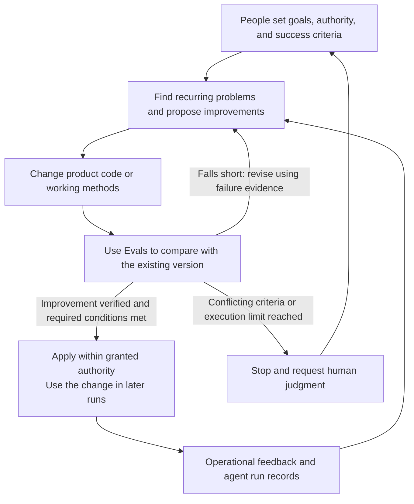
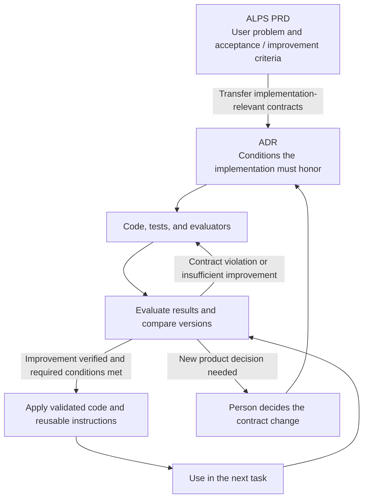

## TL;DR

- Automated self-improvement is central to a Software Factory.
- Evals provide evidence for automating repeated human judgments.
- Tension metrics reveal quality losses during improvement.

## Introduction

In my earlier [Agent Application Evaluation Playbook](/en/2026/10/05/evaluating-new-agent-applications.html), I wrote about choosing which numbers to ask an agent to improve. In EncBird, my English practice app, maximizing the number of corrections can lead to changing sentences that were already correct. Maximizing the number of remembered facts can lead to storing incorrect information.

The need for these improvement criteria becomes clearer when we delegate work to a development agent. Without them, a person must read every proposed change, decide what to fix next, and issue another instruction. Improvement remains limited by how quickly that person can make those decisions.

In her talk, “What It Actually Takes to Build a Software Factory,” Factory's Tereza Tížková describes a system in which agents carry work through the whole development process.[^1] That includes implementing requirements, validating results, and using operational feedback to make further changes.

What matters to me here is **automated self-improvement: using execution results to find problems, produce changes, and verify that those changes help**. The goal is to remove individual human judgments from the repeated process of proposing and accepting improvements, so it can continue without waiting for another instruction.

That makes Eval—checking whether results meet their intended conditions and improve on the previous version—much more important. Evaluation results guide the next change. I have been updating ALPS, which I use for planning development, to define those improvement criteria in advance.

## 1. What it means for a Software Factory to improve itself

Here, a Software Factory means a system in which AI agents connect requirements, implementation, validation, deployment, and operational feedback, then use the results to improve both the product and how it is developed. It covers the software development lifecycle, or SDLC, from building software to running it.

Factory's official introduction names continual learning and self-improvement as a core requirement. Information from agent runs, code reviews, and resolved incidents should feed into subsequent work so that the system itself improves.[^5]

Suppose users report repeated failures during signup. The system finds the relevant execution records, prioritizes the problem, changes the code, and checks whether signup actually works. After deployment, it looks for a reduction in the same failure and turns remaining problems into further work.

**The development agent's own working methods are also candidates for improvement.** If an agent repeatedly skips signup tests, for example, it can propose a change to the test procedure or reusable instructions as well as the application code. Evaluate whether that change reduces omissions on other tasks, then use the validated instructions in future runs.

Fixing a failure within one run can still leave the next run making the same mistake. Improvements need to persist in something that later runs use: corrected code, tests that reproduce the failure, or validated working instructions. This kind of self-improvement does not require retraining the model itself.[^6]

My goal is for an evaluation-and-revision loop to take over the steps where a person previously supplied each next instruction. People set the goals, the allowed scope of changes, and success criteria. Within those boundaries, generating, comparing, and accepting improvements should be automated as far as possible. People step in when criteria conflict or a new product decision is needed.





For this process to work, agents need to reproduce the environment, find the necessary information, and rerun tests. If the project only runs on one person's laptop, or there are no records to investigate a failure, a person has to intervene at each transition.

Factory's published account of its internal Signals system offers an example: it identifies recurring problems in session records, creates tasks, and has Droid implement fixes. That account retains human approval before merge.[^7] Automating problem discovery and task assignment is progress toward autonomy; it does not establish that the entire process already runs without people.

The decision to automate extends from “is the task complete?” to “should later runs use this change?” Delegating that decision requires defining success and the evidence needed to accept an improvement.

## 2. Eval determines the next action

When a person reads every development agent result, they can notice and fill gaps in the specification afterward. As agents take on more autonomous work, some of that judgment has to move into evaluation criteria and executable checks.

Evaluation returns failed cases and violated conditions as inputs to the next revision. The agent uses that evidence to propose a change, evaluates it again, and adopts it within its authority if it improves on the existing version while meeting required conditions. **Eval connects failure discovery, revision, and the acceptance of improvements.** A false pass allows subsequent work to build on a defective result. Treating a correct result as a failure causes unnecessary revisions.

Factory Missions creates a Validation Contract before dividing the implementation into features. It specifies which observable behaviors count as completion. An agent coordinating the work prepares it, and validation agents check results separately from the agents implementing them. Problems found in validation become fix tasks, followed by another check against the same completion criteria.[^2]

For signup, “a user can sign up through the interface and then log in” is closer to a completion criterion than “the signup API exists.” If duplicate registrations must be prevented, that condition also needs checking. Code checks and user journey validation find different failures.

In one published Factory run, validation took 6.14 of the total 16.5 hours, about 37.2%.[^2] That proportion is not a standard for every project, but it shows a system that allocates substantial execution time to validation.

Evaluation does not have to rely entirely on language models. Tests can check explicit conditions such as stored values and permissions. Model evaluation can address questions that require judgment, such as preserved meaning or response appropriateness. User journey checks establish whether the interface and subsequent processing work together.

Consider the EncBird corrections discussed in that earlier evaluation playbook. Code can check whether feedback was delivered. Determining whether “might go” was changed to “went” requires comparing the original sentence with the correction.

To turn that failure into improvement work, an agent could retain the original sentence and incorrect correction as a reproducible case, then change the prompt or processing code. Compare both versions on the same evaluation cases, and check whether meaning preservation also improves on separate cases not used to develop the change.

If feedback still fails to arrive or meaning is still distorted, those failures guide another revision. Also compare whether unnecessary corrections of valid sentences have increased. This evaluation-and-revision process is where I want to move the work of reading every correction and issuing another instruction.

Evaluation models can also be wrong. Compare their judgments with cases people have checked to see whether they miss actual failures or reject correct results. Separating implementation and validation agents does not remove errors if both share the same faulty criteria.

When a new failure appears in operation, retain a reproducible case and add it to subsequent evaluation. Distinguish a violation of an existing condition from a situation that needs a previously undecided product rule. In the latter case, the agent should not invent an answer and make it part of the evaluation.

## 3. What might get worse while the target metric improves?

In a self-improvement process, metrics repeatedly influence which changes are retained. Even if the evaluation computes them correctly, whether they adequately represent the product's purpose is a separate question. A change accepted under flawed criteria becomes the starting point for the next improvement.

An instruction to increase deployment frequency can encourage splitting meaningless changes into smaller releases. An instruction to raise the test pass rate can encourage removing failing tests. The numbers improve while the user's outcome stays the same or gets worse.

That is why my earlier [evaluation playbook](/en/2026/10/05/evaluating-new-agent-applications.html) emphasized **tension metrics: measures that reveal whether another aspect of quality deteriorates while a target metric improves**. They help expose shortcuts that achieve the measured target at the expense of its purpose.

| Intended improvement | Tension metrics to examine alongside it | Problem to look for |
| --- | --- | --- |
| Deliver changes faster | Change fail rate; share of deployments caused by production incidents | Does skipping validation merely create more fixes after release? |
| Lower development costs | Rework time; share of tasks that fail completion criteria | Are savings coming from unfinished work or lower quality? |
| Correct more of EncBird's actual language errors | Unnecessary correction rate for valid sentences; meaning distortion rate | Is the agent changing every sentence to inflate its correction count? |

These metrics do not have to move in opposite directions. The desired outcome is faster delivery with fewer failures. DORA, which researches software delivery performance, considers throughput and instability together and warns about making a single metric the target.[^3]

The comparison conditions also need to stay consistent. Removing difficult tasks from evaluation or splitting the same work into more tasks changes what the numbers mean. Record the task population, aggregation rules, and observation period alongside the results.

A metric we monitor is also different from a condition we must satisfy. An increase in rework time does not have to automatically disqualify every change. But a permissions violation or failure to meet an agreed completion condition cannot be excused by faster delivery.

Combining everything into a weighted score can conceal those violations. I think it is better to examine the primary metric and required conditions separately, and record which changes led us to accept or reject a candidate.

## 4. Connecting completion and improvement criteria in ALPS

Delegating self-improvement requires both the conditions for completing a feature and criteria for accepting later changes as improvements. If we choose these after implementation, it becomes easy to explain the result we already have as a success. This is why I have been updating ALPS, or Agentic Lean Product Spec, which I use to clarify the user's problem and required behavior before assigning development to agents.

ALPS is a format for writing a product requirements document, or PRD. In the 0.9.6 update to ALPS Writer Plugins, which I develop, I added guidance that separates the conditions for initially accepting a feature from the criteria for judging later improvement.[^4]

In Full ALPS, feature acceptance criteria connect a situation and expected result to the evidence needed from tests, quality evaluation, or a demo. When proposing an improvement metric, the guidance asks what could go wrong if that metric alone were optimized, and actively considers a meaningful tension metric.

I applied the same approach to Lite ALPS, the shorter planning format. Essential user experiences should explain how to recognize the intended outcome, beyond recording that the experience exists. If users must be able to end a conversation, showing a completion message and then asking more questions does not satisfy that result.

I did not require a metric for every feature. An observable failure case can check a condition that is difficult to quantify. The guidance also avoids turning a proposed monitoring metric directly into a mandatory pass condition or filling gaps with unsupported numerical targets.[^4]

Criteria chosen during planning need to survive the transition to implementation. Following the [division of responsibilities between ALPS and ADRs](/en/2026/07/25/alps-adr-abstraction-boundaries.html), implementation-relevant intent and requirements move into architecture decision records, or ADRs. After that handoff, ADRs govern implementation. Editing the planning document later does not automatically change the current implementation contract.





ADR Writer's implementation guidance also tells agents to judge results using acceptance evidence defined in advance, without allowing primary-metric gains to offset required-condition violations. Intent and exact criteria stay in the documents; datasets, evaluator code, and run results stay with implementation and validation materials.[^4]

What I have updated so far is the judgment guidance agents follow during planning and implementation. Having that guidance is different from operating a fully automated process from production feedback through deployment. I am starting by connecting the evidence needed to establish that an assigned feature delivered its intended result.

## Closing thoughts

When building a Software Factory, I want to know **whether problems found during execution lead to validated improvements without another human instruction**. Those improvements need to carry into later tasks and reduce repeated failures and human intervention. That is how I think the development system should get better as it runs.

Alongside deciding what to build, I expect to spend more time choosing the Evals and tension metrics that justify delegating improvement. Updating ALPS is part of keeping the user's purpose in that process without requiring a person to intervene every time.

---

[^1]: Tereza Tížková, [What It Actually Takes to Build a Software Factory](https://ai.engineer/talks/vGCJ7diEtrw-what-it-actually-takes-build-software-factory), AI Engineer. Describes autonomous execution and validation across the software lifecycle.
[^2]: Theo Luan, Factory, [How Missions Work](https://factory.com/news/missions-architecture). Source for defining the Validation Contract before implementation, separating implementation and validation roles, and validation time in one run.
[^3]: DORA, [DORA’s software delivery performance metrics](https://dora.dev/guides/dora-metrics/). Covers throughput and instability together, and cautions against optimizing a single metric or comparing unlike contexts.
[^4]: [ALPS Writer Plugins](https://github.com/haandol/alps-writer-plugins)
[^5]: Matan Grinberg, Eno Reyes, [Factory 2.0: From coding agents to software factories](https://factory.com/news/software-factory). Names continual learning and self-improvement as a core requirement for a Software Factory.
[^6]: Factory, [Self-improving software architecture in practice](https://factory.com/articles/self-improving-software-architecture). Discusses changes that persist in code, tests, tools, and instructions for later runs, and evaluation beyond the cases used to develop a correction.
[^7]: Factory, [Signals: Toward a Self-Improving Agent](https://factory.com/news/factory-signals). An internal example connecting recurring problems to implemented fixes. At publication, human approval remained necessary before merge.
