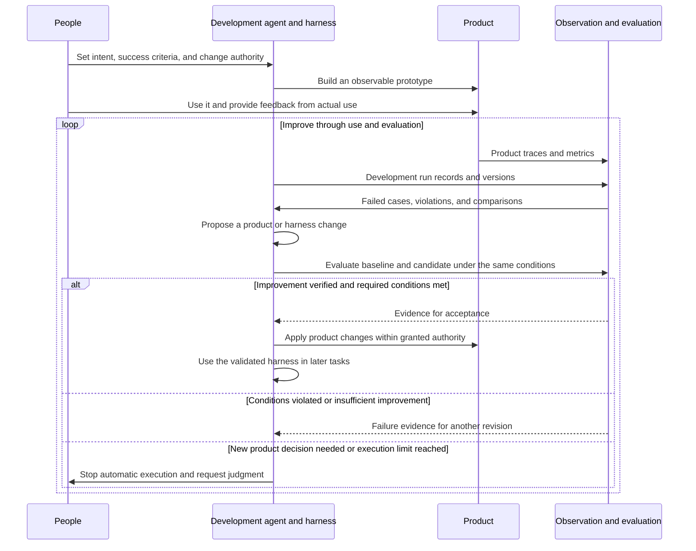
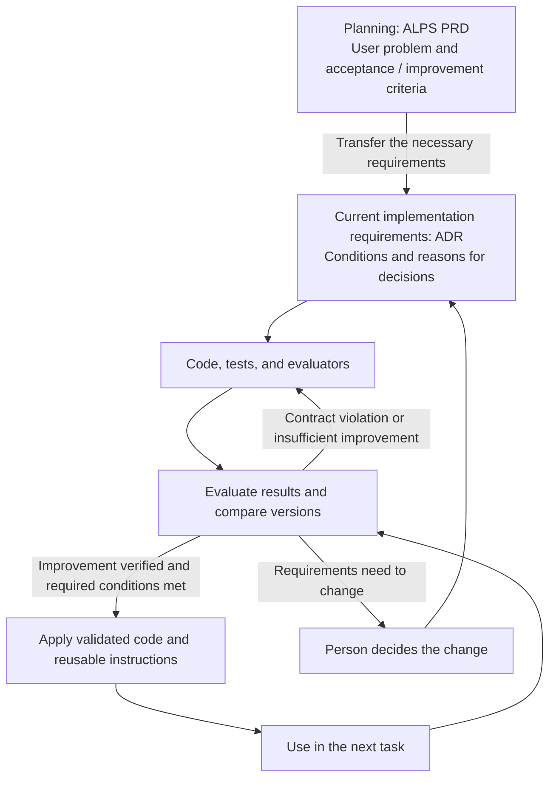

## TL;DR

- Software Factories move toward removing the human review bottleneck.
- Evals and observability supply the evidence for automated improvement.
- Updating a harness from execution experience can be understood as online learning.

## Introduction

A development agent may be able to change code and run tests, but if a person must read every proposed change and assign the next task, improvement remains limited by how quickly that person can decide. Connecting failure discovery to the work needed to fix those failures allows improvement to continue while the person is away.

In earlier posts, I described the long-term direction of agentic engineering as **removing HITL, or human in the loop: the person who repeatedly intervenes during execution**. In particular, I argued that faster code generation can still leave overall throughput limited by review speed if every change needs human review.[^10]

Factory is the company behind the development agent Droid. In “What It Actually Takes to Build a Software Factory,” its speaker Tereza Tížková describes a system that continues development without waiting for a person's next instruction.[^1] Agents carry work from implementing requirements through validation, then turn problems found in operation into further changes.

I understand Software Factories as a continuation of that HITL argument. They attempt to remove the human review bottleneck by automating **self-improvement: using execution results to find problems, produce changes, and verify that those changes help**.

That makes both Eval—checking whether results meet their intended conditions and improve on the previous version—and observability, which makes actual execution visible, essential. To take over the work of reading results and judging them, agents need to establish what happened and whether it matches the original intent.

## 1. Moving human review out of the loop

Here, a Software Factory means a system in which AI agents connect requirements, implementation, validation, deployment, and operational feedback, then use the results to improve both the product and how it is developed. It covers the software development lifecycle, or SDLC, from building software to running it.

Factory's official introduction names continual learning and self-improvement as a core requirement. Information from agent runs, code reviews, and resolved incidents should feed into subsequent work so that the system itself improves.[^5]

StrongDM expresses this direction more directly. It published a Software Factory approach built around a rule that people neither write nor review code; specifications and user scenarios guide agents and validate their results. Scenarios kept apart from the implementation help address the risk of agents tailoring code merely to pass the tests in front of them.[^11]

Suppose users report repeated failures during signup. The system finds the relevant execution records, prioritizes the problem, changes the code, and checks whether signup actually works. After deployment, it looks for a reduction in the same failure and turns remaining problems into further work.

**The development agent's own working methods are also candidates for improvement.** If an agent repeatedly skips signup tests, for example, it can propose a change to the test procedure or reusable instructions as well as the application code. Evaluate whether that change reduces omissions on other tasks, then use the validated instructions in future runs.

In this article, I call the combined instructions, tools, execution environment, and validation and recovery procedures the **harness**. When I wrote about building EncBird's harness, I described turning recurring failures into rules in `AGENTS.md`, tools, and tests.[^12] Now I want to automate the work of reading those failures and telling the agent to improve its harness too.

Fixing a failure within one run can still leave the next run making the same mistake. Improvements need to persist in something that later runs use: corrected code, tests that reproduce the failure, or validated working instructions. Even with the same model, changing its instructions and tools can change how later tasks run. This kind of self-improvement does not require retraining the model itself.[^6]

My goal is for an evaluation-and-revision loop to take over the steps where a person previously supplied each next instruction. People set the goals, the allowed scope of changes, and success criteria. Within those boundaries, generating, comparing, and accepting improvements should be automated as far as possible. People step in when criteria conflict or a new product decision is needed.

For this process to work, agents need to reproduce the environment, find the necessary information, and rerun tests. If the project only runs on one person's laptop, or there are no records to investigate a failure, a person has to intervene at each transition.

Factory's published account of its internal Signals system offers an example: it identifies recurring problems in session records, creates tasks, and has Droid implement fixes. That account retains human approval before merge.[^7] Automating problem discovery and task assignment is progress toward autonomy; it does not establish that the entire process already runs without people.

### 1.1. Transitional services on the way to Software Factories

Services that keep working toward a goal while retaining context are appearing in both software development and everyday work.

- **OpenAI Dots** are always-on agents that continue assigned work between conversations and delegate tasks to background agents. They retain preferences and decisions for subsequent work.[^17]
- **Anthropic Projects**, redesigned in September 2026, divides a goal into tasks and coordinates parallel execution, output review, and integration. The tasks draw on shared memory to maintain project context.[^18]
- **Meta Muse** is a personal agent that uses a browser and connected services to carry out multistep tasks such as reservations and purchases. Sensitive actions such as payments still require user approval.[^19]

I think these can be understood as **transitional services on the way to Software Factories**. Their focus on software development varies, but they share a direction: giving agents a goal to work toward with fewer human instructions at each step.

Turning failures and human interventions from actual work into evaluation cases, then using that evidence to improve the harness, could connect these services to the self-improvement process described above. Long-running execution and memory alone do not complete it: the system also needs to judge success and decide which changes should carry into subsequent runs.

## 2. Closing the development loop with Evals and observability

When a person reads every development agent result, they can notice and fill gaps in the specification afterward. As agents take on more autonomous work, some of that judgment has to move into evaluation criteria and executable checks.

Evaluation returns failed cases and violated conditions as inputs to the next revision. The agent uses that evidence to propose a change, evaluates it again, and adopts it within its authority if it improves on the existing version while meeting required conditions. **Eval connects failure discovery, revision, and the acceptance of improvements.** A false pass allows subsequent work to build on a defective result. Treating a correct result as a failure causes unnecessary revisions.

This is why I think **developing software through a Software Factory is itself an Eval process**. Define criteria from user intent, execute, observe the results, evaluate the gap, revise, and execute again. Here, the Eval process means the whole cycle in which evaluation determines the next change, beyond calculating a score once.

### 2.1. Collecting traces and evaluation cases from a prototype

The loop needs a usable prototype to get started. We cannot anticipate every failure, but we should establish whose problem we are solving and which outcomes must hold. Then we use the prototype ourselves and let actual users try it, collecting execution records along the way.

Observability is the ability to use those records to understand what happened inside the system. A **trace** records how a request moved through processing steps and tool calls to reach its result. **Metrics** capture quantities such as failure rates and response times that let us compare runs. Logs supply details about errors and intermediate states.

Both the product and the process that develops it need observation. A failed signup trace can reveal a product defect; the development agent's record of fixing that code can reveal skipped tests or incorrect tool use. Recording product and harness versions alongside these records makes it possible to compare behavior across changes.

**Observability reveals actual behavior; Eval compares it with user intent.** A faster response time alone does not establish that the user got the job done. Connecting execution records to the expected outcome turns that gap into a problem to fix.

LangChain describes a similar development process: collect traces, enrich them with evaluations and feedback, turn failures into reproducible evaluation cases, and compare behavior before and after changes. Automated evaluations on production runs supply material for subsequent improvements.[^13]

The automation I want to build needs to cover that path. If it stops at collecting records and displaying a dashboard, a person must still read them and select the next fix. Agents need a way to retrieve relevant traces, add violations of established conditions to evaluations, and run and compare proposed changes.





### 2.2. Online learning through harness updates

Because new execution experience changes how subsequent work runs, I think a Software Factory can also be understood as **online learning at the harness level**. Online here means adapting to incoming data while the system is in use; it does not refer to an internet connection.

Each run produces product code, while experience accumulates in an improving **harness that builds deterministic and nondeterministic software**. Its output can include ordinary processing code that follows fixed rules for the same input and state, as well as AI features whose responses can vary between runs. What it learns persists in instructions, tools, tests, and execution procedures rather than updates to model weights.

LangChain's Better-Harness implements a process that proposes and validates harness changes using evaluation results and traces. It separates cases used for optimization from held-out validation cases to check whether changes merely fit known examples. Its published workflow still includes final human review.[^14]

The ACE, or Agentic Context Engineering, research studies how execution feedback can accumulate in a context containing instructions and strategies without updating model weights. It also evaluates online adaptation, where that context changes as new tasks are processed.[^15] Learning from execution to change later behavior need not be confined to retraining a model's internals.

These sources do not demonstrate an entirely unattended Software Factory. My interpretation extends the approaches explored in harness improvement and context adaptation to the whole environment that develops software. Recording evaluation scores during use is not enough: the evidence needs to change the harness and affect subsequent tasks for learning, in this sense, to occur.

### 2.3. Defining the outcome to evaluate

Even as execution experience changes the harness, the evidence for accepting changes must remain connected to the original user intent. If the criteria are vague, an agent can end up optimizing for easy checks instead of better software.

Factory Missions is a feature that divides development work into tasks and carries them out autonomously. Before dividing the implementation into features, it creates a Validation Contract: the observable behaviors required for completion. An agent coordinating the work prepares it, and validation agents check results separately from the agents implementing them. Problems found in validation become fix tasks, followed by another check against the same completion criteria.[^2]

For signup, “a user can sign up through the interface and then log in” is closer to a completion criterion than “the signup API exists.” If duplicate registrations must be prevented, that condition also needs checking. Code checks and user journey validation find different failures.

In one published Factory run, validation took 6.14 of the total 16.5 hours, about 37.2%.[^2] That proportion is not a standard for every project, but it shows a system that allocates substantial execution time to validation.

Evaluation does not have to rely entirely on language models. Tests can check explicit conditions such as stored values and permissions. Model evaluation can address questions that require judgment, such as preserved meaning or response appropriateness. User journey checks establish whether the interface and subsequent processing work together.

EncBird, the English practice app I run, uses AI to continue a conversation and offer sentence corrections when users describe their experiences in English. The intended outcome is to correct language errors while preserving what the user meant.

Suppose a user says `I might visit Busan, but I haven't decided yet.`, and the app changes it to `I visited Busan.` A possible future visit has become a completed event. A check that the correction reached the screen could pass even though meaning preservation failed.[^8]

The development agent fixing this failure records the original sentence, the incorrect correction, and the expected condition: preserve the possibility of a visit and the fact that the user has not decided. It can then change the app's prompt—the instructions its AI follows—or processing code, and compare the existing and revised versions on the same input.

An evaluation model receives the original sentence, the expected condition, and the correction, then returns a judgment about meaning preservation with its supporting reasons. Code checks whether the feedback was delivered.

Separate cases not used to develop the change help detect a fix tailored to just one sentence. Where model responses can vary, compare failure rates over repeated runs under the same conditions rather than accepting a single success as evidence of improvement.

If feedback still fails to arrive or meaning is still distorted, those failures guide another revision. Also compare whether unnecessary corrections of valid sentences have increased. This evaluation-and-revision process is where I want to move the work of reading every correction and issuing another instruction.

Evaluation models can also be wrong. Compare their judgments with cases people have checked to see whether they miss actual failures or reject correct results. Anthropic's agent evaluation guide also explains the need for repeated trials and calibration of model judgments against human judgments.[^16]

Separating implementation and validation agents does not remove errors if both share the same faulty criteria. This calibration can be designed separately from a process that makes people read and approve every change.

When a new failure appears in operation, retain a reproducible case and add it to subsequent evaluation. Distinguish a violation of an existing condition from a situation that needs a previously undecided product rule. In the latter case, the agent should not invent an answer and make it part of the evaluation.

## 3. What might get worse while the target metric improves?

In a self-improvement process, metrics repeatedly influence which changes are retained. Even if the evaluation computes them correctly, whether they adequately represent the product's purpose is a separate question. A change accepted under flawed criteria becomes the starting point for the next improvement.

An instruction to increase deployment frequency can encourage splitting meaningless changes into smaller releases. An instruction to raise the test pass rate can encourage removing failing tests. The numbers improve while the user's outcome stays the same or gets worse.

This is why we need **tension metrics: measures that reveal whether another aspect of quality deteriorates while a target metric improves**. For the English correction feature, compare the proportion of actual errors corrected with the proportion of valid sentences changed unnecessarily.

Suppose a hypothetical evaluation set contains 100 sentences: 40 with errors and 60 without, with one evaluated error in each incorrect sentence. If the existing version corrects 30 errors and unnecessarily changes three valid sentences, its error correction rate is `30/40 = 75%` and its unnecessary correction rate is `3/60 = 5%`.

If the revised version corrects 36 errors but unnecessarily changes 18 valid sentences, those rates become `36/40 = 90%` and `18/60 = 30%`. Accepting that change on the error correction rate alone makes more aggressive changes to valid sentences the starting point for the agent's next improvement. That is why tension metrics need to inform the decision too.[^8]

| Intended improvement | Tension metrics to examine alongside it | Problem to look for |
| --- | --- | --- |
| Deliver changes faster | Change fail rate; share of deployments caused by production incidents | Does skipping validation merely create more fixes after release? |
| Lower development costs | Rework time; share of tasks that fail completion criteria | Are savings coming from unfinished work or lower quality? |
| Correct more of EncBird's actual language errors | Unnecessary correction rate for valid sentences; meaning distortion rate | Is the agent changing every sentence to inflate its correction count? |

These metrics do not have to move in opposite directions. The desired outcome is faster delivery with fewer failures. DORA, which researches software delivery performance, looks at how frequently and quickly changes are delivered alongside the failures and rework they cause. It warns about making a single metric the target.[^3]

The comparison conditions also need to stay consistent. Removing difficult tasks from evaluation or splitting the same work into more tasks changes what the numbers mean. Record the task population, aggregation rules, and observation period alongside the results.

A metric we monitor is also different from a condition we must satisfy. An increase in rework time does not have to automatically disqualify every change. But a permissions violation or failure to meet an agreed completion condition cannot be excused by faster delivery.

Combining everything into a weighted score can conceal those violations. I think it is better to examine the primary metric and required conditions separately, and record which changes led us to accept or reject a candidate.

## 4. Connecting completion and improvement criteria in ALPS

Delegating self-improvement requires both the conditions for completing a feature and criteria for accepting later changes as improvements. If we choose these after implementation, it becomes easy to explain the result we already have as a success. I want to record the user problem, required behavior, and evidence of the intended result during planning.

For this, I use ALPS, or Agentic Lean Product Spec, a format for writing a product requirements document, or PRD. A PRD describes whose problem a product will solve and what behavior it should provide. ALPS Writer Plugins, which I develop, includes ALPS Writer for this planning work and ADR Writer for connecting agreed requirements to design decisions and implementation.[^4]

The 0.9.6 update introduced guidance to separate the conditions for initially accepting a feature from criteria for judging later improvement. Applied to the correction feature, the acceptance condition would be “deliver corrections that preserve the user's meaning,” while the improvement metric would be “the proportion of actual errors corrected on the same evaluation set.” The proportion of valid sentences changed unnecessarily belongs alongside it.

Full ALPS, the detailed planning format, records the situation in which to check an acceptance condition and the evidence needed from tests, quality evaluation, or a demo. When proposing an improvement metric, the guidance asks what could go wrong if that metric alone were optimized, and actively considers a meaningful tension metric.

I applied the same approach to Lite ALPS, the shorter planning format. Essential user experiences should explain how to recognize the intended outcome, beyond recording that the experience exists. If users must be able to end a conversation, showing a completion message and then asking more questions does not satisfy that result.

I did not require a metric for every feature. An observable failure case can check a condition that is difficult to quantify. The guidance also avoids turning a proposed monitoring metric directly into a mandatory pass condition or filling gaps with unsupported numerical targets.[^4]

Criteria chosen during planning need to survive the transition to implementation. In my workflow, the handoff moves implementation-relevant intent and requirements into architecture decision records, or ADRs. An ADR records a decision, its reasons, and what the implementation must honor. After the handoff, ADRs govern the current implementation, while the PRD remains a record of the planning that led to it.[^9]

Here, a contract means a requirement that must survive changes to implementation, such as preserving the user's meaning. An agent can change prompt wording or processing code, but it cannot remove the meaning-preservation condition to raise the correction rate. Changing the requirement itself needs a human decision reflected in the ADR; editing the earlier planning document alone does not change the current implementation requirements.





ADR Writer's implementation guidance also tells agents to judge results using evidence defined in advance, without allowing primary-metric gains to offset required-condition violations. Intent and exact conditions stay in ADRs. Evaluation inputs and expected results, the code that runs the checks, and actual run records are maintained with implementation and validation materials.[^4]

What I have updated so far is the judgment guidance agents follow during planning and implementation. Having that guidance is different from operating a fully automated process from production feedback through deployment. I am starting by connecting the evidence needed to establish that an assigned feature delivered its intended result.

## Closing thoughts

When building a Software Factory, I want to know **whether problems found during execution lead to validated improvements without another human instruction**. Those improvements need to carry into later tasks and reduce repeated failures and human intervention. That is how I think the development system should get better as it runs.

The direction I want from a Software Factory is the same one I described in the earlier HITL posts. I want observation, evaluation, and harness revision to take over the steps that used to wait for human review. Alongside deciding what to build, I expect to spend more time choosing which records to collect and which Evals and tension metrics should justify accepting an improvement.

---

[^1]: Tereza Tížková, [What It Actually Takes to Build a Software Factory](https://ai.engineer/talks/vGCJ7diEtrw-what-it-actually-takes-build-software-factory), AI Engineer. Describes autonomous execution and validation across the software lifecycle.
[^2]: Theo Luan, Factory, [How Missions Work](https://factory.com/news/missions-architecture). Source for defining the Validation Contract before implementation, separating implementation and validation roles, and validation time in one run.
[^3]: DORA, [DORA’s software delivery performance metrics](https://dora.dev/guides/dora-metrics/). Covers throughput and instability together, and cautions against optimizing a single metric or comparing unlike contexts.
[^4]: [ALPS Writer Plugins](https://github.com/haandol/alps-writer-plugins)
[^5]: Matan Grinberg, Eno Reyes, [Factory 2.0: From coding agents to software factories](https://factory.com/news/software-factory). Names continual learning and self-improvement as a core requirement for a Software Factory.
[^6]: Factory, [Self-improving software architecture in practice](https://factory.com/articles/self-improving-software-architecture). Discusses changes that persist in code, tests, tools, and instructions for later runs, and evaluation beyond the cases used to develop a correction.
[^7]: Factory, [Signals: Toward a Self-Improving Agent](https://factory.com/news/factory-signals). An internal example connecting recurring problems to implemented fixes. At publication, human approval remained necessary before merge.
[^8]: [Agent Application Evaluation Playbook](/en/2026/10/05/evaluating-new-agent-applications.html). Source for the meaning-preservation condition and correction-rate example. The numbers are hypothetical, not production measurements. The linked article covers evaluation record collection and judgment validation in more detail.
[^9]: [Why Separate PRDs, ADRs, and Code? — Reading One Abstraction Level at a Time](/en/2026/07/25/alps-adr-abstraction-boundaries.html). Further explanation of separating planning intent, current requirements, and replaceable implementation choices.
[^10]: [Agentic Engineering and Transitional Technologies](/en/2026/05/11/direction-of-agentic-engineering.html), [A Lens for Interpreting Phenomena—and Agentic Engineering](/en/2026/06/12/lens-for-agentic-engineering.html). Earlier posts on HITL removal as a long-term direction and repeated review and approval as bottlenecks.
[^11]: Justin McCarthy, StrongDM, [Software Factories And The Agentic Moment](https://factory.strongdm.ai/) (February 6, 2026). Describes excluding human code writing and review, with separate scenarios for validation.
[^12]: [How I Built the EncBird Harness Layer by Layer — Harness Engineering in Practice](/en/2026/06/16/harness-engineering-in-practice.html). Describes turning failures discovered during execution into rules, tools, and validation.
[^13]: Sam Crowder, LangChain, [The agent improvement loop starts with a trace](https://www.langchain.com/blog/traces-start-agent-improvement-loop) (March 31, 2026). Connects execution records, online evaluation, evaluation case creation, and validation before deployment.
[^14]: Vivek Trivedy, LangChain, [Better Harness: A Recipe for Harness Hill-Climbing with Evals](https://www.langchain.com/blog/better-harness-a-recipe-for-harness-hill-climbing-with-evals) (April 8, 2026). Uses evaluations as harness improvement signals, alongside held-out validation and human review.
[^15]: Qizheng Zhang et al., [Agentic Context Engineering: Evolving Contexts for Self-Improving Language Models](https://arxiv.org/abs/2510.04618), ICLR 2026. Research on offline and online adaptation through context updates rather than weight updates.
[^16]: Anthropic, [Demystifying evals for AI agents](https://www.anthropic.com/engineering/demystifying-evals-for-ai-agents) (January 9, 2026). Covers repeated evaluation of nondeterministic runs and calibration of model judgments against human judgments.
[^17]: OpenAI, [Tasks and memory](https://learn.chatgpt.com/docs/dots/tasks-and-memory). Describes ongoing work, background delegation, and memory in Dots.
[^18]: Anthropic, [Projects redesigned: from folder to conversation](https://claude.com/resources/articles/projects-redesigned) (September 17, 2026). Introduces coordination, parallel execution, and shared memory in redesigned Projects.
[^19]: Meta, [Muse Connector guidelines](https://muse.ai/platform/docs). Describes task completion through browsers and connected tools, follow-up actions, and user approval requirements.
