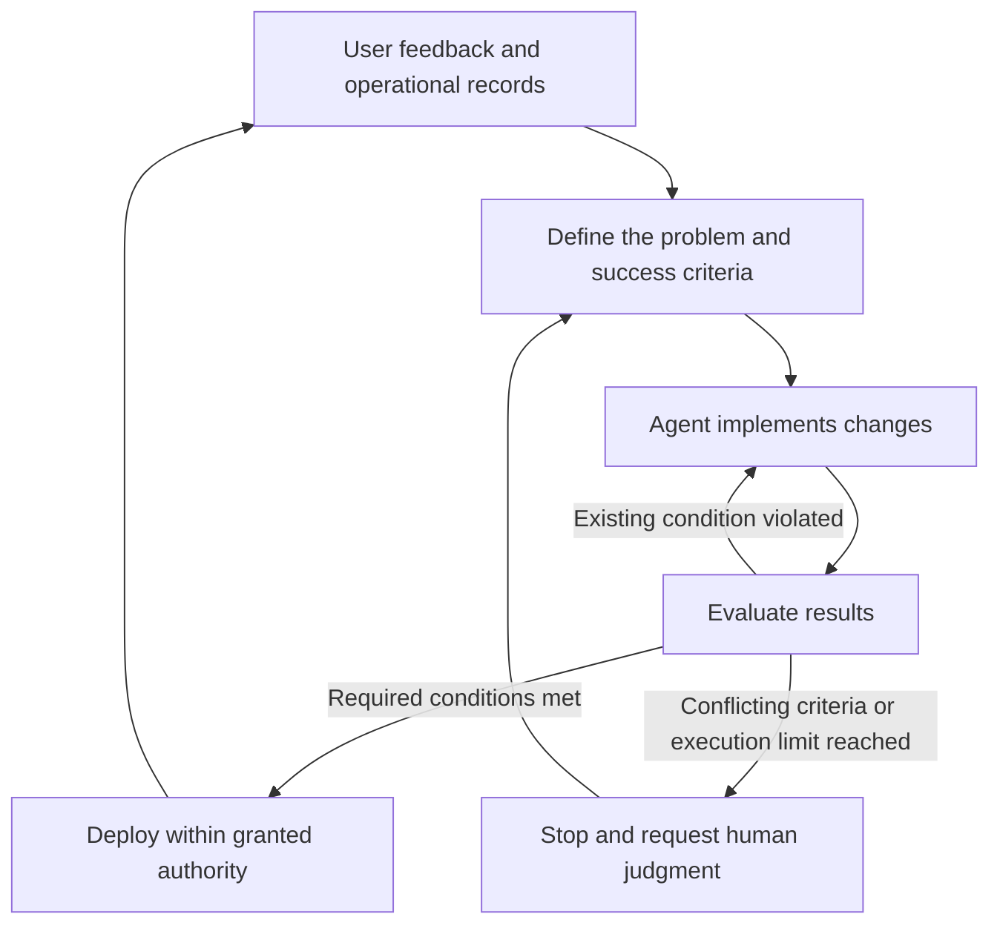
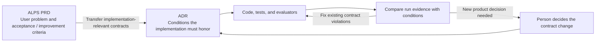

## TL;DR

- A Software Factory repeats development, validation, and operational feedback.
- Eval matters more as agents take on more autonomous work.
- Pair target metrics with tension metrics that reveal quality losses.

## Introduction

In today's [Agent Application Evaluation Playbook](/en/2026/10/05/evaluating-new-agent-applications.html), I wrote about choosing which numbers to ask an agent to improve. In EncBird, my English practice app, maximizing the number of corrections can lead to changing sentences that were already correct. Maximizing the number of remembered facts can lead to storing incorrect information.

The same problem appears when building the app. As development agents work longer and produce more changes, we need a basis for accepting their results and assigning the next task.

In her talk, “What It Actually Takes to Build a Software Factory,” Factory's Tereza Tížková extends this problem across the development process.[^1] Agents carry work from requirements through implementation and validation, then use operational feedback to make further changes.

I think **Eval—checking whether a result satisfies its intended conditions—is becoming much more important** in this process. I have been updating ALPS, which I use for planning development, to reflect this direction.

## 1. What does a Software Factory cover?

Here, a Software Factory means a development system in which AI agents repeatedly connect requirements, implementation, validation, deployment, and operational feedback. It covers the software development lifecycle, or SDLC, from building software to running it.

Suppose users report repeated failures during signup. The system finds the relevant execution records, prioritizes the problem, changes the code, and checks whether signup actually works. After deployment, it looks for a reduction in the same failure and turns remaining problems into further work.

A process guided by agreed criteria takes over the steps where a person previously supplied each next instruction. People choose the problem and the allowed scope of changes, and step in when criteria conflict or a new decision is needed.





For this process to work, agents need to reproduce the environment, find the necessary information, and rerun tests. If the project only runs on one person's laptop, or there are no records to investigate a failure, a person has to intervene at each transition.

The talk proposes three principles: independence from a particular model or tool, execution without constant supervision, and carrying knowledge gained from one run into the next.[^1] Model selection and context management help sustain that process.

But a long agent run alone does not make the process complete. The system needs to judge what counts as success, what to fix after failure, and when to stop.

## 2. Eval determines the next action

When a person reads every development agent result, they can notice and fill gaps in the specification afterward. As agents take on more autonomous work, some of that judgment has to move into evaluation criteria and executable checks.

A pass leads to the next task or deployment; a failure leads back to revision. **Eval determines the development process's next action.** A false pass allows subsequent work to build on a defective result. Treating a correct result as a failure causes unnecessary revisions.

Factory creates a Validation Contract before dividing the implementation into features. It specifies which observable behaviors count as completion. An agent coordinating the work prepares it, and validation agents check results separately from the agents implementing them.[^2]

For signup, “a user can sign up through the interface and then log in” is closer to a completion criterion than “the signup API exists.” If duplicate registrations must be prevented, that condition also needs checking. Code checks and user journey validation find different failures.

In one published Factory run, validation took 6.14 of the total 16.5 hours, about 37.2%.[^2] That proportion is not a standard for every project, but it shows a system that allocates substantial execution time to validation.

Evaluation does not have to rely entirely on language models. Tests can check explicit conditions such as stored values and permissions. Model evaluation can address questions that require judgment, such as preserved meaning or response appropriateness. User journey checks establish whether the interface and subsequent processing work together.

Consider the EncBird corrections discussed in today's post. Code can check whether feedback was delivered. Determining whether “might go” was changed to “went” requires comparing the original sentence with the correction. A development agent changing this feature needs to check both conditions.

Evaluation models can also be wrong. Compare their judgments with cases people have checked to see whether they miss actual failures or reject correct results. Separating implementation and validation agents does not remove errors if both share the same faulty criteria.

When a new failure appears in operation, retain a reproducible case and add it to subsequent evaluation. Distinguish a violation of an existing condition from a situation that needs a previously undecided product rule. In the latter case, the agent should not invent an answer and make it part of the evaluation.

## 3. What might get worse while the target metric improves?

Once evaluation is repeatable, we can give agents metrics and ask them to find better results. Even if the evaluation computes those metrics correctly, whether they adequately represent the product's purpose is a separate question.

An instruction to increase deployment frequency can encourage splitting meaningless changes into smaller releases. An instruction to raise the test pass rate can encourage removing failing tests. The numbers improve while the user's outcome stays the same or gets worse.

That is why today's post emphasized **tension metrics: measures that reveal whether another aspect of quality deteriorates while a target metric improves**. They help expose shortcuts that achieve the measured target at the expense of its purpose.

| Intended improvement | Tension metrics to examine alongside it | Problem to look for |
| --- | --- | --- |
| Deliver changes faster | Change fail rate; share of deployments caused by production incidents | Does skipping validation merely create more fixes after release? |
| Lower development costs | Rework time; share of tasks that fail completion criteria | Are savings coming from unfinished work or lower quality? |
| Correct more of EncBird's actual language errors | Unnecessary correction rate for valid sentences; meaning distortion rate | Is the agent changing every sentence to inflate its correction count? |

These metrics do not have to move in opposite directions. The desired outcome is faster delivery with fewer failures. DORA, which researches software delivery performance, considers throughput and instability together and warns about making a single metric the target.[^3]

The comparison conditions also need to stay consistent. Removing difficult tasks from evaluation or splitting the same work into more tasks changes what the numbers mean. Record the task population, aggregation rules, and observation period alongside the results.

A metric we monitor is also different from a condition we must satisfy. An increase in rework time does not have to automatically disqualify every change. But a permissions violation or failure to meet an agreed completion condition cannot be excused by faster delivery.

Combining everything into a weighted score can conceal those violations. I think it is better to examine the primary metric and required conditions separately, and record which changes led us to accept or reject a candidate.

## 4. Connecting completion and improvement criteria in ALPS

If we choose these criteria after implementation, it becomes easy to explain the result we already have as a success. This is why I have been updating ALPS, or Agentic Lean Product Spec, which I use to clarify the user's problem and required behavior before assigning development to agents.

ALPS is a format for writing a product requirements document, or PRD. In the 0.9.6 update to ALPS Writer Plugins, which I develop, I added guidance that separates the conditions for initially accepting a feature from the criteria for judging later improvement.[^4]

In Full ALPS, feature acceptance criteria connect a situation and expected result to the evidence needed from tests, quality evaluation, or a demo. When proposing an improvement metric, the guidance asks what could go wrong if that metric alone were optimized, and actively considers a meaningful tension metric.

I applied the same approach to Lite ALPS, the shorter planning format. Essential user experiences should explain how to recognize the intended outcome, beyond recording that the experience exists. If users must be able to end a conversation, showing a completion message and then asking more questions does not satisfy that result.

I did not require a metric for every feature. An observable failure case can check a condition that is difficult to quantify. The guidance also avoids turning a proposed monitoring metric directly into a mandatory pass condition or filling gaps with unsupported numerical targets.[^4]

Criteria chosen during planning need to survive the transition to implementation. Following the [division of responsibilities between ALPS and ADRs](/en/2026/07/25/alps-adr-abstraction-boundaries.html), implementation-relevant intent and requirements move into architecture decision records, or ADRs. After that handoff, ADRs govern implementation. Editing the planning document later does not automatically change the current implementation contract.





ADR Writer's implementation guidance also tells agents to judge results using acceptance evidence defined in advance, without allowing primary-metric gains to offset required-condition violations. Intent and exact criteria stay in the documents; datasets, evaluator code, and run results stay with implementation and validation materials.[^4]

What I have updated so far is the judgment guidance agents follow during planning and implementation. Having that guidance is different from operating a fully automated process from production feedback through deployment. I am starting by connecting the evidence needed to establish that an assigned feature delivered its intended result.

## Closing thoughts

Delegating more work to a Software Factory also requires reducing the time people spend checking its results again. Faster code generation does not expand delegation very far if every completion decision has to be reconstructed from scratch.

I expect to spend more time on **which Evals justify accepting an agent's result and which tension metrics help judge improvement**, alongside what the agent can build. Updating ALPS is part of keeping the user's purpose intact as work moves from planning to implementation and repeated improvement.

---

[^1]: Tereza Tížková, [What It Actually Takes to Build a Software Factory](https://ai.engineer/talks/vGCJ7diEtrw-what-it-actually-takes-build-software-factory), AI Engineer. Describes autonomy across the software lifecycle and the three principles.
[^2]: Theo Luan, Factory, [How Missions Work](https://factory.com/news/missions-architecture). Source for defining the Validation Contract before implementation, separating implementation and validation roles, and validation time in one run.
[^3]: DORA, [DORA’s software delivery performance metrics](https://dora.dev/guides/dora-metrics/). Covers throughput and instability together, and cautions against optimizing a single metric or comparing unlike contexts.
[^4]: [ALPS Writer Plugins](https://github.com/haandol/alps-writer-plugins)
