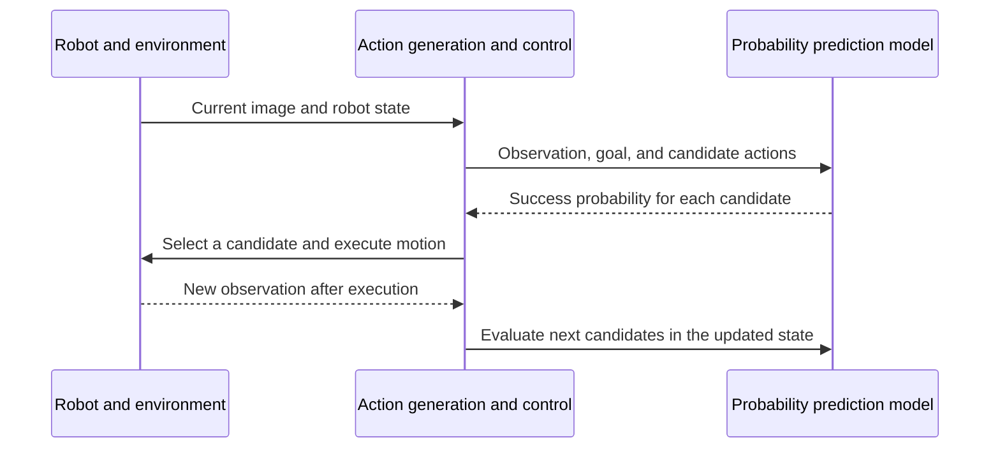

## TL;DR

- Test decision models with different question wordings.
- RLCD targets decisions and calibrated probabilities.
- RLCD's individual contribution to Jev's performance remains unclear.

## Introduction

After Jev came out, models and APIs such as Kev, Jeff, Strands Decider, and OpenAI Decisions offered quick ways to add classification and scoring to an application. Returning fixed choices and probabilities instead of long responses made them look useful for putting AI decisions into an early product.

Some projects published benchmarks suggesting a small gap from Jev, but Jev felt considerably better on the tasks I tried. It reminded me of trying an open model after reading that it had beaten a commercial one, then watching it behave unexpectedly as soon as I gave it something a little harder.

I would not extend that experience to every open model or newer competitor. Still, **despite similar benchmark scores, the alternatives I tried did not yet seem capable of replacing Jev.**

That gap made me interested in RLCD, Jev's training approach. TypeSafe, the company behind Jev, argues that responses people prefer and decisions software can act on need different training objectives. I agree with that concern, but I do not think the performance gap can immediately be attributed to RLCD.

I want to separate what the public evidence establishes from what remains a hypothesis, then consider whether this direction could extend to multimodal models that process images and text together, and to robotic decisions. Product and implementation details reflect the material available on October 8, 2026.

## 1. A benchmark can change when you reverse the question

Changing decision models can change how the same question is understood. Arize, which builds AI evaluation tools, published a comparison that illustrates this.[^1]

The experiment asks whether a response is supported by the supplied evidence. On the same 1,338 test cases, it asks both “Is every claim supported?” and “Does it contain an unsupported claim?” Reversing the question's polarity should reverse the expected answer.

| Model | Is every claim supported? | Does it contain an unsupported claim? |
| --- | --- | --- |
| Jev 1.13 | 0.93 | 0.93 |
| OpenAI Decisions | 0.90 | 0.89 |
| Kev 9B | 0.85 | 0.54 |
| Strands Decider 2B | 0.75 | 0.26 |

These values are ROC AUC, not accuracy. Here, the metric measures how well the model's scores distinguish supported responses from unsupported ones; closer to 1 is better, while 0.5 is random performance. The B in model names indicates billions of parameters.

Jev and OpenAI Decisions produced similar results under both wordings, while Kev and Strands Decider changed substantially. OpenAI handled this reversal well, so treating all newer competitors as substantially weaker would hide a meaningful difference.

The table reports Arize's experiment with particular models, questions, and data. It does not establish the cause of the gap I experienced, but it shows why **a score obtained with one wording may not represent the questions an application will actually use.**

Jev has limitations too. Its documentation lists difficulties with precise calculations, indirect reasoning across multiple steps, long contexts with irrelevant material, and option order in Jev 1.13.[^2] Alongside published rankings, I want to know whether a replacement keeps making the same judgment when I rephrase my questions or rearrange their options.

## 2. What RLCD aims to train differently

### 2.1. The starting point explained in the talk

When wording changes the result, it is worth asking what the model was trained to do well. Diogo Almeida, TypeSafe's founder, coauthored the InstructGPT paper and worked on ChatGPT.[^3][^4]

His [talk before Jev's launch](https://www.youtube.com/watch?v=cJ0EOzey--o) makes three main points:

- **Assistance and automation have different success conditions.** He distinguishes working alongside a person from completing work without ongoing supervision. (4:29–5:11)
- **Human preference does not guarantee task success.** He argues that rewarding preferred responses can encourage convincing but incorrect answers. (5:57–8:22)
- **Software itself should do more work.** Beyond cheaper code generation, he wants models that supply decisions and uncertainty within software. (10:49–16:19)

### 2.2. Learning to produce responses people prefer

His concern is less about the abilities acquired during pretraining, when a model learns patterns from large amounts of data, than about how those abilities are elicited. He argues that rewarding responses people prefer can push a model toward sounding confident instead of expressing uncertainty. That is Almeida's interpretation, not a general law explaining classification failures in every model.[^4]

Reinforcement learning, or RL, trains a model to **take actions that earn more of a specified reward**. What the reward evaluates changes what the model learns to do well.

For example, someone who knows their Korean textbook well might address a friend with “My friend Cheolsu, have you eaten?” The sentence is not wrong, but it sounds awkward. Reinforcement learning from human feedback, or RLHF, can help adapt that kind of language to the situation.

But supervised fine-tuning, or SFT, can also improve it by training on examples of natural conversation. InstructGPT distinguishes training on demonstrations from reinforcement learning using human preferences.[^3] Making speech sound natural is not the purpose of all RL, and classification does not require RL to work in real situations.

Rewards can also come from results whose correctness can be checked, such as a mathematical answer or a program's execution. This is called reinforcement learning with verifiable rewards, or RLVR. Jev also targets the reliability of the probabilities returned with its decisions.

### 2.3. When an 80% probability is useful in code

TypeSafe calls its approach Reinforcement Learning for Calibrated Decisions, or RLCD. Its objective is to return constrained decisions together with **probabilities that match observed outcomes**.[^5]

Suppose a model estimates whether a customer inquiry is a refund request. If we collect enough inquiries assigned roughly 80%, and roughly 80% really are refund requests, the probabilities in that range are well calibrated. This agreement is what calibration means.

An 80% prediction does not guarantee the answer for that individual inquiry. Nor is matching the overall rate sufficient: if half of all inquiries are refund requests, returning 50% for everything gets that rate right but does little to identify which inquiries belong with the refunds team. The model needs to distinguish the requests as well as express its uncertainty accurately.

Reliable probabilities make it easier to decide which cases software can handle automatically. High-probability inquiries could be routed immediately, while ambiguous ones trigger a search for more information or go to a larger model. The cutoff should be chosen using actual inquiries and the cost of routing them incorrectly.

Jev's API also distinguishes an option's `probability` from a separate `confidence` value. For choice and score questions, `confidence` summarizes the returned distribution; `confidence: 0.8` should not be read directly as 80% accuracy.[^6]

What interests me about RLCD is that it treats uncertainty as an output software can use. If a person will not read every response, the way a model expresses the possibility of being wrong matters alongside its ability to select the right answer.

### 2.4. Does that objective explain the performance gap?

Understanding the objective does not tell us how much it contributed to performance. In the TypeSafe launch post and training explanation I checked, I did not find an ablation isolating RLCD's contribution. An ablation changes or removes one component while keeping other conditions comparable.[^5][^7]

To establish that contribution, we would need to compare training with and without RLCD using the same starting model, data, and evaluation conditions. Comparing Jev with another product also changes model size, data, architecture, and other post-training choices. TypeSafe itself introduced a new architecture, parallel output mechanism, and RLCD together.[^7]

We also need to look at what the public evaluation treats as a correct answer. TypeSafe's workflow evaluation, which evaluates business workflows represented in code, uses the average predictions of large external models as reference probabilities. Agreement with that reference does not mean real outcomes were directly observed, and the evaluation description does not reveal RLCD's training data.[^7]

I think decisions and probabilities are useful training targets for automation. But **public product comparisons do not isolate how much of Jev's current advantage comes from RLCD.**

## 3. Similar APIs, different implementations

Before explaining product differences through training, we need to know what each product actually trained. Similar APIs returning fixed choices and probabilities do not imply identical implementations.

The initial OpenAI Decisions API is interesting here. In a DevDay interview, API lead Nikunj Handa said that OpenAI had not trained a new model for it and was using the existing Luna weights. He described an initial implementation that constrains outputs, processes questions in parallel, and optimizes inference speed. Its image understanding also comes from Luna.[^8]

He did not say whether the head, the component that turns internal representations into outputs, was replaced.

The official documentation confirms that Decisions accepts text and images and returns a condition's probability, a choice, or a score.[^9] The training account above applies to the initial release.

The open projects do not share a single recipe either. Their public documentation described the following training scope when checked on October 8, 2026.

| Project | Publicly described training |
| --- | --- |
| Kev | The 0.8B, 4B, and 9B models freeze the base and train a small set of added weights, called an adapter, along with the output head. The 27B model fine-tunes all weights.[^10] |
| Jeff (`firelex/jeff`) | Uses full-weight fine-tuning for its base models and probability calibration afterward. Also provides task-specific adapters.[^11] |
| Strands Decider | Replaces the next-token output head with a head that scores candidate options, and applies LoRA, which trains small sets of added weights, to the base model too.[^12] |

Even within Kev, the training scope varies by model size. A claim of being “close to Jev” needs to be read alongside the size, version, and evaluation conditions behind it.

The open-source Laya project publishes its own RLCD approach aimed at calibrated decisions. It describes a scoring rule designed to make honest probability predictions earn higher expected rewards. That is a related objective, not evidence that Laya reproduces Jev's private training method.[^13]

Laya's documentation also says its base checkpoints are overconfident as shipped and need further probability calibration on the user's data. Including calibration in an objective does not automatically make probabilities reliable on a new task.

These implementations make me reluctant to choose a model just because its training is called RLCD. Alongside what was trained, I want to check how accurately it predicts on my data and where it becomes overconfident.

## 4. From multimodal decisions to robot action selection

If a decision API built on existing multimodal weights is already useful, what might change when a model is trained specifically to make calibrated decisions from images and text? I think this direction could also connect to how robots choose actions.

A vision-language-action model, or VLA, takes visual and language inputs and produces actions. VLA names a family of models, not a particular training method. A model trained with an objective resembling RLCD could still be a VLA.

A concrete connection is estimating the success probability of candidate actions. When a robot needs to move a cup, for example, it might compare “grasp it from here” with “change the viewpoint, then grasp it.”

Predicting success and generating the robot arm's actual motion are different tasks. A system still has to turn the decision into movement and observe how the situation changes afterward. The following is a possible combination I have in mind, not a robot architecture published by Jev.





Evaluating this connection takes more than classification accuracy. We need to know whether the robot completes tasks across multiple movements, moves continuously, and reassesses when an action has an unexpected result. This is the connection between observation and physical action that also interested me in my earlier Physical AI overview.[^14]

Research already applies reinforcement learning to VLAs. A study using OpenVLA compared supervised fine-tuning with RL and reported substantial improvements when object positions or the robot's initial pose changed, but similar performance under visual changes.[^15] It did not test RLCD.

The development I would like to see is **training for calibrated decisions becoming part of VLA action selection and success estimation**. If actual action outcomes can be collected to train and validate those probabilities, this could influence how robots choose what to do next.

## Closing thoughts

Within the tasks I have tried, I still trust Jev more. But I would rather investigate where the differences appear and how much to trust the associated probabilities than explain the experience with “RLCD makes it better.”

As more fast decision models become available, trying them in an application should get cheaper. Beyond accuracy, consistency under rewording and overconfident failures will help determine how much work can be delegated without someone reading every result.

What I most want to see next is a controlled comparison isolating RLCD's contribution, followed by calibration that includes images and action outcomes. Those results could help explain the gap I feel today and make my expectations for robotics more concrete.

---

[^1]: Arize, [Decision model benchmark](https://arize.com/blog/decision-model-benchmark/). The table cites four models from its published question-reversal experiment. I did not rerun the experiment for this article.
[^2]: TypeSafe, [Jev 1.13 jaggedness](https://docs.typesafe.ai/model-jaggedness/jev-1.13). Official limitations, reviewed October 2, 2026.
[^3]: Long Ouyang et al., [Training language models to follow instructions with human feedback](https://arxiv.org/abs/2203.02155). Describes InstructGPT's supervised fine-tuning and reinforcement learning from human feedback.
[^4]: Diogo Almeida, [Jev CEO: I made ChatGPT, now I'm building what's next](https://www.youtube.com/watch?v=cJ0EOzey--o), AI Engineer. The summary and statements were checked against 4:29–16:19 in the [organizer's transcript](https://ai.engineer/talks/cJ0EOzey--o-jev-ceo-made-chatgpt-building-whats-next). This talk describes the research direction before Jev's launch.
[^5]: TypeSafe, [AI primer](https://docs.typesafe.ai/introduction/machine-learning-primer). Explains RLCD's objective and probability calibration.
[^6]: TypeSafe, [Confidence](https://docs.typesafe.ai/confidence). Distinguishes option probabilities from confidence calculated from the distribution.
[^7]: TypeSafe, [Introducing System One Models & Jev](https://typesafe.ai/blog/introducing-system-one-models-and-jev), September 15, 2026. Describes architecture, output generation, RLCD, and reference probabilities in workflow evaluation.
[^8]: Latent Space, [DevDay 2026 interview](https://www.latent.space/p/devday-2026). Nikunj Handa, 27:36–28:43, on the initial Decisions API's reuse of Luna weights, constrained outputs, parallel processing, and vision.
[^9]: OpenAI, [Decisions API guide](https://developers.openai.com/api/docs/guides/decisions).
[^10]: [jaredpalmer/kev](https://github.com/jaredpalmer/kev), Models and training description.
[^11]: [firelex/jeff](https://github.com/firelex/jeff), Train your own. This is the Jeff project discussed here.
[^12]: Strands Decider, [Architecture](https://github.com/strands-labs/strands-decider/blob/main/docs/architecture.md).
[^13]: [NandhaKishorM/laya](https://github.com/NandhaKishorM/laya), Fine-Tuning and Calibration.
[^14]: [Physical AI, simply explained](/en/2026/01/02/physical-ai-demystifying.html). My earlier overview of producing actions from observations and observing the results again.
[^15]: [What Can RL Bring to VLA Generalization? An Empirical Study](https://rlvla.github.io/), NeurIPS 2025.
