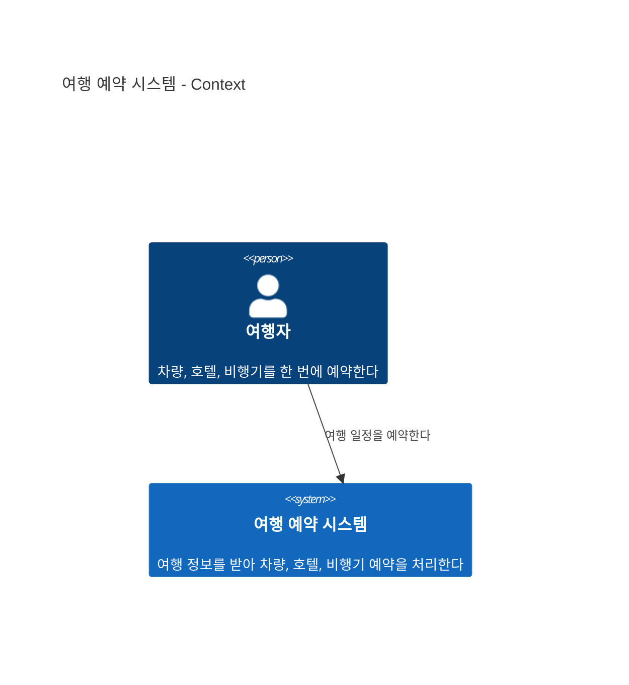
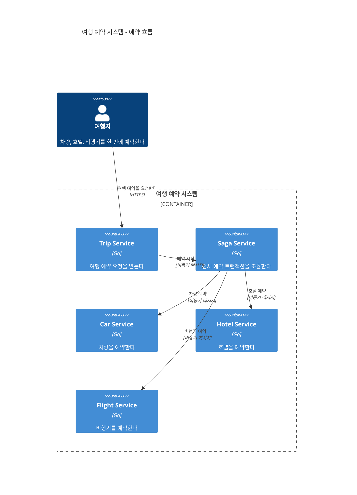
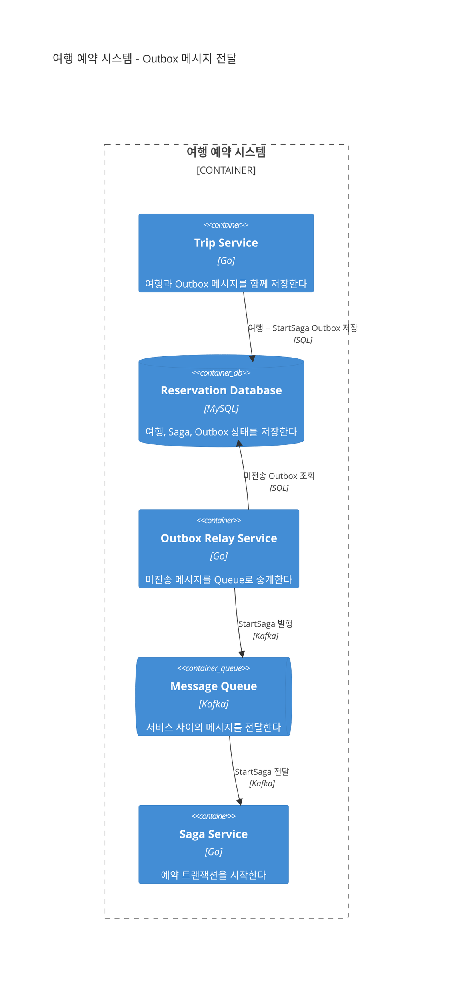
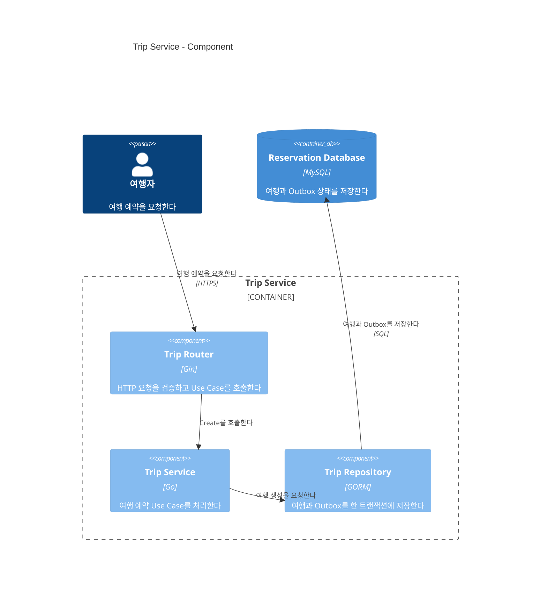

## TL;DR

- C4Model은 Context, Container, Component, Code 순으로 시스템을 확대한다.
- 다이어그램 이름만으로 필요한 상세 수준을 맞출 수 있다.
- Component와 Code는 필요한 경우에만 만든다.

## 시작하며

개인적으로 다이어그램은 시스템을 설명하는 가장 효과적인 수단이라고 생각한다.

실제로 일을 하다 보면 같은 시스템을 두고도 사람마다 조금씩 다른 그림을 그린다.

다이어그램을 그리는 목적과 보는 사람, 담으려는 정보의 양이 다르기 때문이다. 문제는 그림을 요청한 사람과 그리는 사람이 이 내용을 미리 맞추지 않는 경우가 많다는 것이다.

최근 몇 개의 프로젝트에서 C4Model을 사용해 봤는데 이 부분이 꽤 편했다.

예를 들어 “관리자 기준으로 주문 관리 서비스의 Component 다이어그램이 있나요?”라고 요청하면, 그리는 사람도 어느 정도의 내용을 담아야 하는지 바로 이해할 수 있었다.

이 글에서는 여행 예약 시스템[^2]을 예제로 C4Model의 기본적인 내용과 실무에서 사용할 때의 팁을 정리한다.

## 1. C4Model이 필요한 이유

C4Model은 소프트웨어 시스템을 `Context`, `Container`, `Component`, `Code`의 네 단계로 나누어 본다.[^1]

아래 단계로 내려갈수록 한 부분을 더 크게 확대하고, 대신 한 장에서 볼 수 있는 범위는 좁아진다.

- **Context**: 누가 이 시스템을 사용하고, 어떤 외부 시스템과 연결되는가
- **Container**: 시스템 안에서 실행되거나 데이터를 저장하는 단위가 어떻게 협력하는가
- **Component**: 한 Container 안의 주요 구성요소가 책임을 어떻게 나누는가
- **Code**: 한 Component가 클래스, 함수, 테이블 등으로 어떻게 구현되는가

네 단계를 모두 그려야 하는 것은 아니다. Context와 Container만으로 충분한 경우가 많고, Component와 Code는 설명할 필요가 있는 부분만 선택해서 그리면 된다.

C4Model을 쓰면서 가장 편했던 점은 다이어그램의 이름에 추상화 수준이 포함된다는 것이다.

Context를 요청했는데 클래스 그림이 오거나, Component를 요청했는데 시스템 전체 그림이 오는 일이 줄어든다.

## 2. Context diagram

Context 다이어그램은 한 소프트웨어 시스템을 가운데 두고, 그 시스템을 사용하는 사람과 직접 연결된 외부 시스템을 보여준다.

기술, 프로토콜, 데이터베이스 같은 구현 세부사항은 넣지 않는다. 개발자가 아닌 사람에게도 보여줄 수 있는 수준이어야 한다.

여행 예약 시스템의 Context 다이어그램은 아래처럼 단순하다.





이 글을 처음 쓸 때는 그림이 너무 비어 보인다는 생각에 Database와 Message System까지 Context 다이어그램에 넣었다.

하지만 이 요소들은 시스템 내부의 Container이므로 Context 다이어그램에서는 빼는 것이 맞다. 예제 시스템은 사용자 외에 직접 연결된 외부 시스템이 없어서 위의 그림처럼 단순하게 끝난다.

여기서 알 수 있는 것은 사용자가 차량, 호텔, 비행기를 한 번에 예약한다는 사실뿐이다. 내부에 마이크로서비스가 몇 개인지, Kafka나 MySQL을 쓰는지는 다음 단계에서 다룬다.

참고로 Context의 시스템 경계와 DDD의 Bounded Context 경계는 별개의 개념이다.

## 3. Container diagram

C4Model에서 Container는 Docker Container를 뜻하지 않는다.

서버 애플리케이션, SPA, 모바일 앱, 데이터베이스처럼 코드를 실행하거나 데이터를 저장하는 단위를 말한다. 마이크로서비스 하나가 Container 하나로 표현되는 경우는 많지만, Container와 마이크로서비스도 같은 개념은 아니다.

아래 그림은 여행 예약 시스템의 예약 흐름에 집중한 Container 다이어그램이다.





이 그림에서는 Trip Service가 요청을 받고 Saga Service가 차량, 호텔, 비행기 예약을 조율한다는 구조를 볼 수 있다.

각 서비스가 돌려주는 성공 이벤트와 보상 흐름까지 넣으면 선이 너무 많아지기 때문에 예약 요청 흐름만 남겼다. 메시지를 실제로 중계하는 Outbox Relay와 Kafka도 이 그림에서는 생략했다.

전체 이벤트 순서가 필요하다면 별도의 Sequence 다이어그램을 만들고, 메시지가 전달되는 구조는 다음처럼 따로 확대하는 편이 읽기 쉽다.

나도 여행 예약 시스템의 Container 다이어그램을 두 장으로 나누었다. 위의 그림은 서비스들의 역할을 보여주고, 아래 그림은 Trip Service가 Transactional Outbox 패턴[^3]으로 `StartSaga` 메시지를 전달하는 과정을 보여준다.





둘 다 Container 다이어그램이지만 설명하려는 내용은 다르다. 개인적으로 한 다이어그램에서는 하나의 흐름만 설명하는 편을 좋아한다.

## 4. Component diagram

Component 다이어그램은 Container 하나를 확대해서 내부의 주요 구성요소와 책임을 보여준다.

여기서 Component는 반드시 클래스 하나를 뜻하지 않는다. Controller, Application Service, Repository처럼 의미 있는 책임 단위가 될 수 있다.

Trip Service를 [헥사고날 아키텍처](/2022/02/13/demystifying-hexgagonal-architecture.html) 관점에서 확대하면 아래처럼 표현할 수 있다.





이 예제에서는 요청이 `Trip Router -> Trip Service -> Trip Repository` 순서로 처리되고, Repository가 여행정보와 Outbox 메시지를 같은 트랜잭션에 저장한다.

여기에 모든 패키지와 클래스를 그리기 시작하면 Code 다이어그램과 다를 것이 없어진다. 데이터 흐름과 책임을 설명하는 데 필요한 컴포넌트만 남기는 편이 낫다.

Component 다이어그램도 모든 Container에 만들기보다, 팀에서 내부 구조를 자주 설명하는 Container에만 만드는 것을 추천한다.

## 5. Code diagram

Code 다이어그램은 Component 하나를 클래스, 인터페이스, 함수, 데이터베이스 테이블 수준으로 확대한다.

개인적으로 Code 다이어그램은 거의 그리지 않는다. 코드가 바뀔 때마다 함께 수정해야 해서 최신 상태를 유지하기가 가장 어렵기 때문이다.

클래스 구조가 필요하면 IDE나 분석 도구로 그때그때 생성하고, 복잡한 알고리즘이나 중요한 데이터 모델처럼 따로 설명할 이유가 있는 경우만 문서로 남기면 충분하다고 생각한다.

## 6. Diagram as Code

UI 기반 도구로 다이어그램을 만들면 요소 하나를 추가할 때마다 그림을 다시 정리해야 하고, 결과물이 이미지 파일이라 변경 이력을 확인하기도 어렵다.

그래서 개인적으로 다이어그램도 코드로 관리하는 것을 좋아한다. 원본이 텍스트라서 코드 리뷰에서 어떤 관계가 바뀌었는지 확인하기 쉽다.

이 글을 처음 쓸 때는 C4-PlantUML을 추천했다. 지금은 블로그에서 Mermaid를 직접 렌더링하고 있어서 예제도 Mermaid C4 문법으로 바꿨다.

Mermaid C4는 C4-PlantUML 문법과 호환되는 실험 기능이라 문법과 렌더링 방식이 바뀔 수 있다.[^4]

레이아웃도 완전 자동은 아니다. 요소를 선언한 순서와 `UpdateLayoutConfig`에 따라 결과가 달라지므로, 복잡한 그림에서는 렌더링 결과를 직접 확인해야 한다.

Diagram as Code를 쓴다고 다이어그램이 자동으로 최신 상태를 유지하는 것도 아니다. 소스 수정과 이력 추적이 편해질 뿐이므로, 오래 유지할 다이어그램에는 처음부터 세부정보를 너무 많이 넣지 않는 것이 좋다.

여행 예약 시스템의 전체 C4-PlantUML 원본도 저장소에서 확인할 수 있다.[^5]

## 7. 실무에서 쓸 때의 기준

`주문 관리 다이어그램이 필요합니다`라고만 요청하면 C4Model을 쓰더라도 결과는 다시 모호해진다.

나는 보통 `관리자에게 주문 취소 흐름을 설명할 수 있는 주문 관리 서비스의 Component 다이어그램`처럼 청중, 대상, 확인하려는 흐름과 C4 단계를 함께 말한다.

그리고 한 그림 안에서 추상화 단계를 섞지 않는다. Context에 Kafka 토픽과 데이터베이스를 넣거나, Container에 내부 클래스를 넣기 시작하면 어디까지 그려야 할지 기준이 사라진다.

관계의 라벨도 `호출`, `사용`으로 끝내기보다 `여행 예약을 요청한다`, `미전송 Outbox를 조회한다`처럼 문장으로 적는 편이 이해하기 쉽다.

## 마치며

C4Model을 몇 개의 프로젝트에서 사용해 보니 다이어그램을 요청하고 설명하는 과정이 편해졌다.

물론 C4Model을 쓴다고 오래된 문서 문제가 사라지는 것은 아니다. Context와 Container에는 세부 구현을 최대한 적게 넣고, Component는 실제로 필요한 부분만 관리해야 그나마 오래 유지할 수 있다.

개인적으로는 Context와 Container 다이어그램만 제대로 유지해도 충분히 가치가 있다고 생각한다.

---

[^1]: [The C4 model for visualising software architecture](https://c4model.com/)
[^2]: [여행 예약 샘플 시스템](https://github.com/haandol/hexagonal-saga-architecture)
[^3]: [Transactional outbox](https://microservices.io/patterns/data/transactional-outbox.html)
[^4]: [Mermaid C4 diagrams](https://mermaid.js.org/syntax/c4.html)
[^5]: [여행 예약 시스템 C4-PlantUML 예제](https://github.com/haandol/hexagonal-saga-architecture/tree/main/docs/c4)
