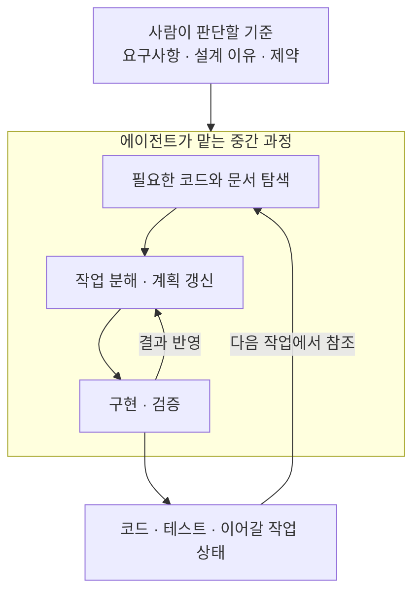

## TL;DR

- 컨텍스트는 의사결정에 필요한 수준으로 추상화해서 관리한다.
- 요구사항과 코드 사이의 중간 과정은 에이전트가 점점 더 맡는다.
- 사람이 계속 관리할 기준과 에이전트가 갱신할 작업 상태를 구분한다.

## 시작하며

에이전트와 개발하다 보면, 요구사항을 코드로 바꾸는 동안 사람이 어디까지 관여해야 하는지 다시 생각하게 된다.

예전에는 개발 컨텍스트를 [Requirement → Feature → Task → Code][^1]처럼 점점 구체화되는 계층으로 나누어 관리하는 프레임워크를 이야기하곤 했다. 요구사항을 기능으로, 기능을 작업으로 나눈 뒤 코드를 만드는 방식이다.

당시에는 중간 단계를 잘게 나누고, 문서화하고, 최신 상태로 유지하는 일이 중요하다고 생각했다. 모델과 도구가 지금보다 약했기 때문에 사람이 그 과정을 더 많이 챙겨야 했다.

요즘은 에이전트가 코드를 찾아 읽고 작업 계획을 세우는 것을 보면서, 사람이 모든 단계의 문서를 직접 관리할 필요는 줄어들고 있다고 느낀다. **어떤 정보를 오래 유지하고, 어떤 구체화 과정을 에이전트에 맡길지**가 더 중요한 문제가 됐다.

## 1. 중간 과정을 관리하는 기능이 에이전트에 들어온다

TaskMaster와 GSD(Get Shit Done)는 요구사항과 코드 사이의 과정을 정리하는 도구다. TaskMaster는 제품 요구사항 문서(PRD)를 작업으로 나누고, 작업 간 선후관계와 진행 상태를 관리한다.[^3] GSD는 요구사항, 계획, 진행 상태를 파일에 남겨 여러 세션에 걸쳐 개발을 이어가게 한다.[^4]

이 도구들이 맡은 일은 개발을 이어가는 데 필요하다. 큰 요구사항을 한 번에 구현하기는 어렵고, 작업이 중단되면 어디까지 했는지도 알아야 한다. 모델이 좋아져도 이 과정 자체가 없어지는 것은 아니다.

다만 그 과정을 담당하는 쪽이 바뀌고 있다. Claude Code에는 코드를 살펴보고 계획을 제안하는 Plan Mode가 있고, 작업 목록을 만들고 상태를 갱신하는 기능도 들어 있다.[^5] 별도 도구로 보완하던 계획과 작업 추적의 일부가 코딩 에이전트의 기본 기능과 겹치기 시작한 것이다.

나는 이런 흡수가 더 빨라질 것이라고 생각한다. 에이전트가 코드를 읽고 수정한 결과를 바로 작업 계획에 반영할 수 있다면, 사람이 코드의 변화를 다른 도구에 다시 설명하고 상태를 맞추는 일이 줄어든다. 모델의 판단 능력과 도구 사용 능력이 좋아질수록 한 번에 맡길 수 있는 과정도 길어진다.

TaskMaster나 GSD의 모든 기능이 이미 대체됐다는 뜻은 아니다. 내가 과도기적이라고 보는 것은 **사람이 여러 도구 사이에서 중간 상태를 직접 맞추는 방식**이다. 계획과 상태를 만드는 기능은 에이전트의 작업 과정 안으로 계속 들어갈 것이라고 본다.

## 2. 오래 유지할 기준을 먼저 추상화한다

여기서 컨텍스트는 에이전트가 판단할 때 읽는 요구사항, 설계 결정, 코드, 작업 상태 같은 정보다. 이 정보를 추상화한다는 것은 세부 사항을 무작정 줄이는 것이 아니라, **지금 내려야 할 판단에 필요한 수준으로 정리하는 것**이다.

예를 들어 주문 취소 기능을 바꿀 때, 사람은 어떤 주문을 취소할 수 있고 환불은 어떤 기준으로 처리할지 정한다. 에이전트는 그 기준과 현재 코드를 읽고 어느 파일부터 수정할지, 어떤 테스트를 추가할지 계획한다. 파일 수정 순서가 바뀌어도 환불 기준까지 다시 정의할 필요는 없다.

나는 이렇게 여러 작업에 걸쳐 유지할 정보를 **정적 컨텍스트**로 본다. 한 번 정하면 바뀌지 않는다는 뜻이 아니라, 개별 작업 계획보다 오래 유지할 기준이라는 뜻이다.

- **PRD**에는 무엇을 만들고 어떤 조건을 만족해야 하는지 남긴다.
- **아키텍처 결정 기록(ADR)**에는 왜 그 설계를 선택했고 어떤 제약을 지켜야 하는지 남긴다.

문서 초안과 갱신은 에이전트가 도울 수 있다. 사람은 사업의 목적과 제약이 맞는지 판단하고, 그 기준이 서로 충돌하지 않게 관리해야 한다. 모든 작업 지시를 미리 적기보다 에이전트가 구체적인 방법을 결정할 근거를 주는 것이다.

## 3. 작업 중의 구체화는 에이전트가 관리한다

정해진 기준을 현재 코드에 적용하려면 수정할 위치를 찾고, 작업을 나누고, 결과를 확인해야 한다. 그 과정에서 읽고 만드는 정보가 **동적 컨텍스트**다. 작업 계획, 탐색 결과, 진행 상태, 코드 변경과 테스트 결과가 여기에 들어간다.

앞의 주문 취소 예에서 에이전트가 환불 로직을 읽다가 예상하지 못한 의존성을 발견했다면 작업 순서를 바꿔야 한다. 사람에게 처음 받은 계획을 그대로 따르기보다, 새로 확인한 코드와 테스트 결과로 계획을 갱신하는 편이 맞다.





이 구조에서 사람은 모든 중간 문서를 관리하는 대신, 판단 기준과 결과가 맞는지를 본다. 에이전트가 요구사항으로 결정할 수 없는 정책을 발견하면 사람의 판단을 받아야 하고, 그 결정은 다음 작업에도 참조할 수 있게 남긴다.

동적 컨텍스트라고 모두 버려도 되는 것은 아니다. 코드와 테스트는 결과물로 보존하고, 진행 중인 작업의 상태와 미해결 문제는 다음 세션에 넘긴다. 용도가 끝난 탐색 기록이나 현재 코드와 어긋난 임시 요약을 계속 읽히지 않도록 정리하는 것도 이 관리의 일부다.

## 마치며

나는 앞으로 요구사항과 코드 사이의 작업 분해, 계획, 상태 관리가 에이전트에 더 많이 포함되고, 그 변화도 가속화될 것이라고 본다. 그럴수록 사람이 관리할 컨텍스트는 사업의 의도와 오래 유지할 판단 기준을 잘 드러내야 한다.

**좋은 추상화는 에이전트가 구체적인 일을 결정할 수 있게 해준다.** 내가 모든 중간 단계를 대신 정리해주는 것보다, 무엇을 지켜야 하는지 명확히 하고 나머지 과정을 맡길 수 있는 쪽으로 개발 방식을 바꾸고 싶다.

그 과정의 결과물인 코드도 다음 작업의 컨텍스트가 된다. 코드 자체가 어떤 업무를 하는지 설명해야 에이전트가 요구사항과 구현을 다시 연결할 수 있다. [다음 글][^2]에서는 이런 코드를 ‘외치는 코드’라는 관점에서 다뤄본다.

---

[^1]: [RFTCR - 에이전트 주도 소프트웨어 개발을 위한 새로운 SDLC 프레임워크](/2025/05/11/rftcr-framework-for-agentic-dev.html)
[^2]: [에이전트가 읽을 좋은 코드 — 비즈니스를 외치는 코드](/2026/03/13/agentic-dev-business-aligned-code.html)
[^3]: [TaskMaster](https://github.com/eyaltoledano/claude-task-master) — 요구사항 분해, 작업 의존성 및 진행 상태 관리.
[^4]: [GSD](https://github.com/gsd-build/get-shit-done) — 요구사항과 계획, 상태를 보존하며 개발을 이어가는 워크플로.
[^5]: Claude Code 공식 문서의 [Plan Mode](https://code.claude.com/docs/en/common-workflows#plan-before-editing)와 [Task list](https://code.claude.com/docs/en/interactive-mode#task-list). 작업 추적 기능의 제공 조건은 모델과 설정에 따라 다르다.
