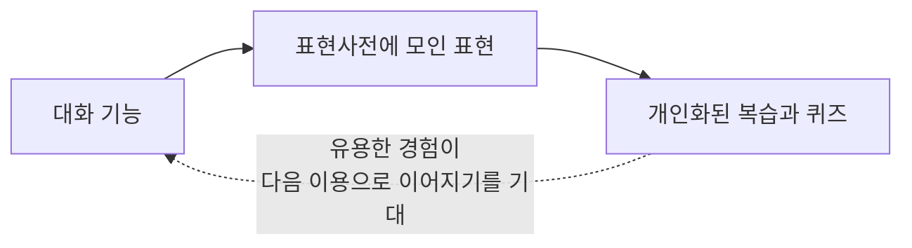

## TL;DR

- EncBird는 여러 대화 기능에서 얻은 표현을 하나의 사전에 모은다.
- 복습과 퀴즈는 그 데이터를 재사용한다.
- 수집한 정보가 다음 사용 경험에 어떻게 반영될지 먼저 정한다.

## 시작하며

최근 생성형 AI(GenAI) 기반 서비스를 설계하면서, 사용자에게서 얻은 정보를 다른 기능에서도 쓸 수 있게 연결하는 일에 관심이 생겼다.

내가 만드는 AI 영어 학습 서비스 EncBird(잉크버드)[^1]에서는 **표현사전**을 중심으로 이 구조를 잡았다.

사진으로 대화하는 픽토챗, AI 코치와 영어 일기를 쓰는 다이어리챗, 비즈니스 상황을 연습하는 프리챗에서 사용자의 표현을 모은다. 표현사전에 쌓인 데이터는 플래시카드와 영작 퀴즈가 다시 사용한다.

각 대화 기능에 별도의 복습 체계를 만드는 대신, 공통으로 모인 표현을 여러 학습 기능에 연결한 것이다.

## 1. GenAI 플라이휠이란

EncBird에서 만들고 싶은 순환은 다음과 같다.





사용자가 대화 중 남긴 정보로 다음 경험을 개선하고, 그 경험에서 다시 정보를 얻는 순환을 플라이휠이라고 부른다.

EncBird에서는 대화에서 모인 표현으로 복습을 개인화하고, 더 유용해진 학습 경험이 다음 대화로 이어지기를 기대하며 설계했다. 아래에서 말하는 효과도 이런 개인화가 중요한 서비스를 전제로 한다.

## 2. 어떤 정보를 어디에 다시 쓸지 묻는다

수집한 정보가 다음 경험에 반영되지 않으면 대화를 많이 쌓아도 개인화가 나아지지는 않는다. 그래서 기능을 만들기 전에 두 가지를 먼저 확인하려 한다.

**첫째, 어떤 기능이 개인화될 때 가장 큰 가치를 만드는가?**

예를 들어 같은 검색 기능이라도 사용자의 취향이 결과를 크게 바꾸는 경우와, 누구에게나 같은 사실을 전달해야 하는 경우는 다르게 봐야 한다.

**둘째, 개인화에 어떤 사용자 정보가 필요한가?**

EncBird에서는 사용자가 대화한 표현이 복습에 돌아오게 했다. 어떤 정보를 모으는지와 그 정보로 무엇을 제공할지가 연결되어 있어야 한다.

이 연결을 먼저 정해야 데이터를 쌓은 뒤에 쓸 곳을 찾는 일을 줄일 수 있다고 생각한다.

## 3. 대화에서 사용자의 의도를 확인한다

로그와 클릭, 구매 이력에서는 사용자의 행동을 보고 의도를 추정한다. 대화에서는 왜 검색하는지, 무엇을 중요하게 여기는지 직접 물어볼 수도 있다.

다만 대화가 늘었다고 해서 필요한 정보를 얻었다고 볼 수는 없다. 실제로 모인 표현이 복습과 퀴즈에 쓰이는지, 사용자가 그 결과를 유용하게 느끼는지 확인해야 한다.

## 4. 데이터 수집과 활용 기능을 나눈다

EncBird에서 나눈 역할은 다음과 같다.

- **대화 기능과 표현사전**: 대화에서 얻은 표현을 한곳에 모은다.
- **플래시카드와 영작 퀴즈**: 모인 표현을 개인화된 복습에 사용한다.

대화 기능을 추가해도 모은 표현을 같은 복습 기능에 연결할 수 있다. 반대로 새로운 복습 방식을 만들 때도 이미 모인 표현을 사용할 수 있다.

## 5. 초기 기능을 출시한 뒤 순환을 확인한다

GenAI로 초기 기능을 빠르게 만들 수 있어도, 실제 사용자가 어떤 정보를 남기고 어떤 결과를 원하는지는 운영하며 확인해야 한다.

출시 전에 어떤 입력을 모으고 어디에 반영할지 정해둔다. 이후에는 입력이 수집·정제되어 다음 기능까지 전달되는지 확인한다.

그 연결이 동작한 뒤에도 학습 경험이 나아졌는지는 별도로 봐야 한다. 데이터가 늘었다는 사실만으로 사용자가 더 자주 돌아오거나 더 잘 배우게 됐다고 결론 내릴 수는 없다.

## 마치며

EncBird를 설계하면서, 대화에서 모은 표현을 복습과 퀴즈가 함께 쓰게 한 구성이 유용하다고 생각하게 됐다.

다음 기능을 만들 때도 어떤 정보를 새로 모을지와 함께, **이미 표현사전에 남은 데이터를 어떻게 다시 쓸지** 먼저 보려 한다. 그 연결이 실제 학습 경험을 개선하는지는 운영하면서 확인할 일이다.

---

[^1]: [EncBird(잉크버드) - AI 영어 표현 학습](https://www.encbird.com)
