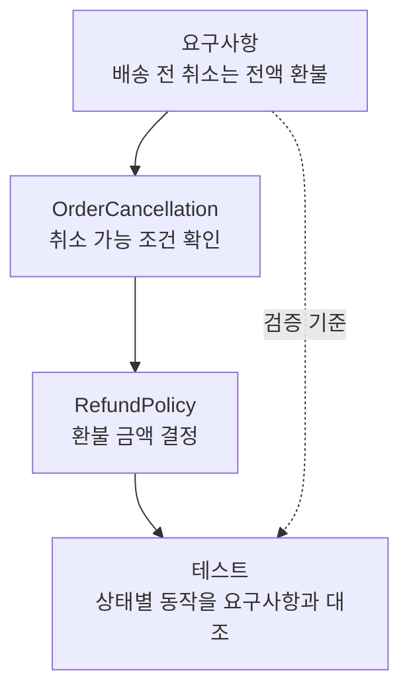

## TL;DR

- 에이전트 시대에는 업무 의도를 스스로 설명하는 코드가 중요하다.
- 업무 용어와 규칙이 코드의 이름과 구조에 드러나야 한다.
- 테스트는 그 규칙이 실제 동작으로 이어지는지 확인한다.

## 시작하며

베드락으로 클로드 코드를 쓸 수 있게 되면서 처음 써보고 있는데, 프로젝트 상태를 관리하는 GSD(Get Shit Done)라는 도구가 눈에 들어왔다. 요구사항과 계획, 현재 진행 상태를 문서로 남겨 다음 작업에서 읽게 하는 방식이다.[^2]

이런 도구를 보면서 요구사항과 코드 사이의 중간 과정을 누가 관리하게 될지 생각하게 됐다. [이전 글][^1]에서는 계획과 작업 추적이 에이전트의 기능에 포함될수록 사람이 모든 중간 상태를 직접 맞출 필요는 줄어들 것이라고 썼다.

에이전트가 그 과정을 더 많이 맡으면, 새 작업을 시작할 때 현재 코드를 읽고 무엇이 구현되어 있는지 판단하는 일도 많아진다. 이때 코드가 업무 의도를 잘 드러내지 못하면 에이전트는 요구사항과 구현 사이의 관계부터 다시 추측해야 한다.

그래서 나는 에이전트 시대의 좋은 코드가 어떤 모습이어야 할지에 관심이 있다. **다음 에이전트가 읽었을 때 자신이 어떤 업무를 하는지 설명하는 코드**, 말하자면 비즈니스를 외치는 코드다.

## 1. 아키텍처가 외치듯 코드도 업무를 드러낸다

Robert C. Martin의 ‘외치는 아키텍처(Screaming Architecture)’는 저장소의 구조를 보면 그 시스템이 무슨 일을 하는지 알 수 있어야 한다는 관점이다. 회계 시스템이라면 사용하는 웹 프레임워크보다 회계 업무가 먼저 드러나야 한다.[^3]

나는 이 관점이 에이전트가 읽는 코드에도 중요해진다고 생각한다. 요구사항에는 ‘주문 취소’와 ‘환불 정책’이 나오는데 코드에는 `Manager`, `Processor`, `handle`만 보인다면, 에이전트는 관련 파일을 찾아 내용을 하나씩 해석해야 한다.

`OrderCancellation`과 `RefundPolicy`라는 이름이 있다면 업무와 코드를 연결할 출발점이 생긴다. 취소를 처리하는 코드에서 환불 정책을 호출하는 관계까지 보이면, 이름뿐 아니라 업무의 흐름도 읽을 수 있다.

**외치는 코드에서 드러나야 하는 것은 업무의 개념과 규칙, 그리고 그 관계다.** 주석으로 구현을 길게 풀어 쓰는 것만으로는 부족하다. 이름과 실제 책임이 일치해야 다음 변경에서도 믿고 따라갈 수 있다.

## 2. 요구사항의 말이 코드와 테스트로 이어져야 한다

이런 연결을 만드는 데 DDD(Domain-Driven Design), 즉 업무의 개념과 규칙을 중심으로 소프트웨어를 설계하는 방식이 도움이 된다. 현업 전문가와 개발자가 합의한 단어를 코드에서도 같은 의미로 사용하는 ‘보편언어’가 그 출발점이다.[^4]

예를 들어 ‘배송 전 주문을 취소하면 전액 환불한다’는 요구사항이 있다고 하자. 에이전트가 이 정책을 수정하려면 세 가지를 연결해서 읽을 수 있어야 한다.

- **이름**: `OrderCancellation`과 `RefundPolicy`에서 취소와 환불의 책임을 찾는다.
- **구조**: 취소 처리에서 배송 상태를 확인하고 환불 정책을 적용하는 흐름을 따라간다.
- **테스트**: 배송 전 취소와 배송 후 취소를 구분해 정책에 맞는 결과인지 확인한다.





업무 규칙이 여러 곳에 복사되어 있으면 이름을 잘 붙여도 어느 구현을 바꿔야 할지 모호해진다. 같은 책임을 한곳에서 관리하고, 다른 업무와 연결되는 지점을 명확히 해야 변경 범위를 찾기 쉽다.

테스트도 현재 구현을 그대로 되풀이하면 잘못된 정책을 통과시킬 수 있다. 요구사항에서 기대하는 결과를 확인해야 코드가 설명하는 내용과 실제 동작을 함께 믿을 수 있다.

## 3. 코드에서 알 수 없는 의도는 따로 남긴다

코드는 지금 어떻게 동작하는지 보여준다. 하지만 왜 그 정책을 골랐는지, 다른 선택지를 왜 버렸는지, 다음에 무엇을 만들지는 코드만으로 알기 어렵다.

예를 들어 환불 금액을 계산하는 코드를 읽으면 현재 정책은 알 수 있다. 그 정책이 고객과의 약속 때문인지, 외부 결제 시스템의 제약 때문인지는 별도로 남겨야 한다. 이런 배경은 요구사항 문서나 아키텍처 결정 기록(ADR)에 보존할 정보다.

별도의 코드 요약문서는 갱신이 빠지거나 필요한 세부 내용이 생략될 수 있다. 에이전트가 현재 동작을 확인하려고 결국 코드를 읽는다면, 그 코드에서 업무를 파악할 수 있게 만드는 데 투자할 가치가 있다. 문서에는 코드로 복원하기 어려운 의도와 제약을 남기는 편이 낫다고 생각한다.

이렇게 하면 앞선 글에서 말한 컨텍스트의 추상화도 이어진다. 사람은 업무의 목적과 판단 기준을 관리하고, 에이전트는 그 기준을 코드의 책임과 연결해 계획을 세운다. 코드가 설명을 잘할수록 다음 작업을 위한 중간 요약을 다시 만드는 부담도 줄어든다.

## 4. 리팩토링의 기준도 다음 에이전트가 된다

최근 몇 년간 AI와 개발하면서 실행 비용이 꾸준히 낮아지는 것을 느끼고 있다. 평소 미뤄두던 문서화, 리팩토링, 최적화를 가볍게 시도할 여유도 생겼고, 이런 변화는 코드 외의 작업으로도 넓어지고 있다.

그 여유를 업무와 코드의 관계를 정리하는 데 쓰고 싶다. 에이전트에게 관련 코드에서 서로 다른 뜻으로 쓰이는 이름이나 흩어진 업무 규칙을 찾아보게 하고, 정리 방법을 제안하게 할 수 있다.

사람은 그 제안이 실제 업무와 조직의 상황에 맞는지 판단한다. 같은 단어라도 팀이나 업무에 따라 뜻이 다를 수 있으므로, 이름이 비슷하다는 이유로 무조건 합쳐서는 안 된다. 에이전트가 3~4가지 방법을 제안한다면 팀의 수준과 사업의 방향을 고려해 고르고, 그 선택을 코드와 테스트에 반영하는 것이다.

## 마치며

에이전트가 요구사항과 코드 사이의 과정을 더 많이 맡을수록, 코드의 독자에는 다음 작업을 수행할 에이전트도 포함된다. 그 에이전트가 업무를 다시 추측하지 않게 하는 것이 좋은 코드를 판단하는 중요한 기준이 될 것이라고 생각한다.

나는 코드의 이름과 구조에서 업무를 읽을 수 있고, 테스트에서 그 규칙을 확인할 수 있는 코드를 만들고 싶다. **외치는 아키텍처가 시스템의 목적을 드러내듯, 외치는 코드는 자신이 맡은 비즈니스를 설명한다.** 그런 코드는 사람이 읽기에도 좋고, 에이전트에게 다음 변경을 맡기기에도 좋다.

---

[^1]: [컨텍스트 엔지니어링 — 요구사항과 코드 사이를 에이전트에 맡기기](/2026/03/11/context-engineering-static-vs-dynamic.html)
[^2]: [GSD](https://github.com/gsd-build/get-shit-done) — 요구사항, 계획과 상태를 파일로 유지하는 개발 워크플로.
[^3]: Robert C. Martin, [Screaming Architecture](https://blog.cleancoder.com/uncle-bob/2011/09/30/Screaming-Architecture.html) (2011.09.30). 이 글의 ‘외치는 코드’는 그 관점을 에이전트가 읽는 코드에 적용한 내 표현이다.
[^4]: [처음 DDD를 공부할 때 알아두면 좋을 내용들](/2021/10/11/thoughts-for-ddd-starters.html)
