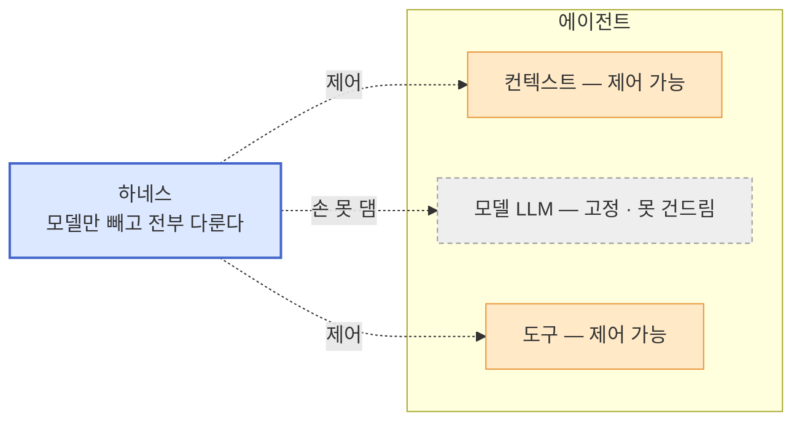
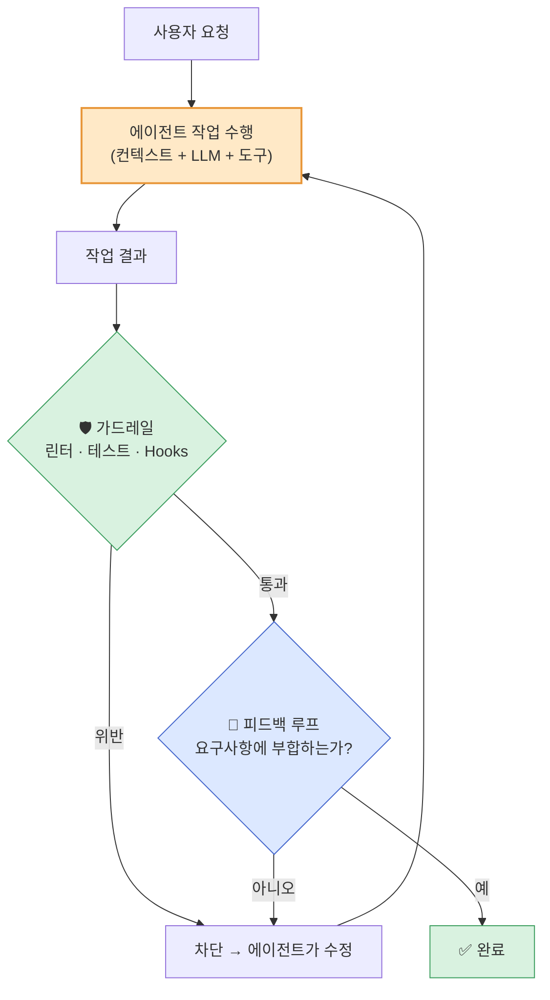
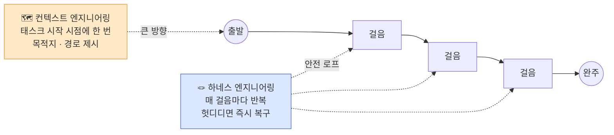
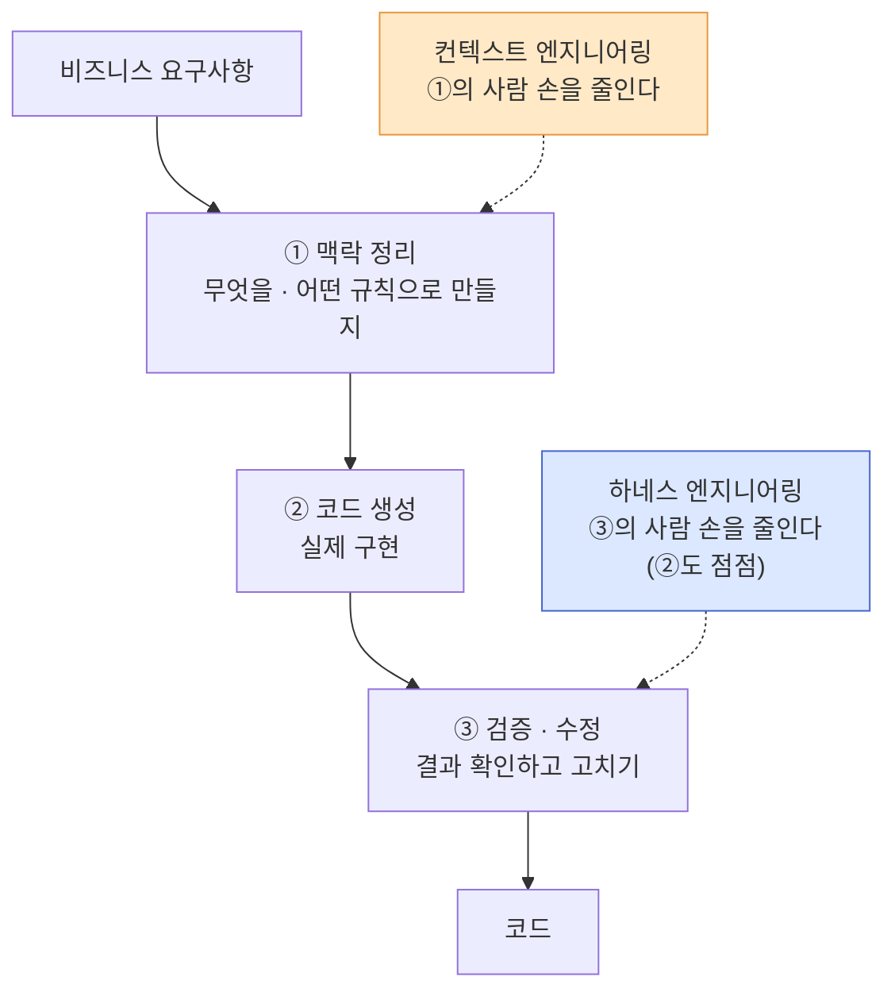
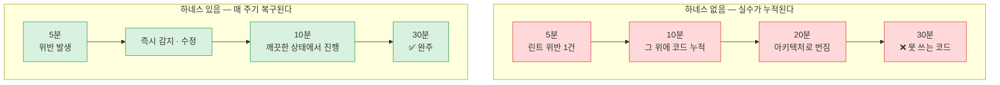
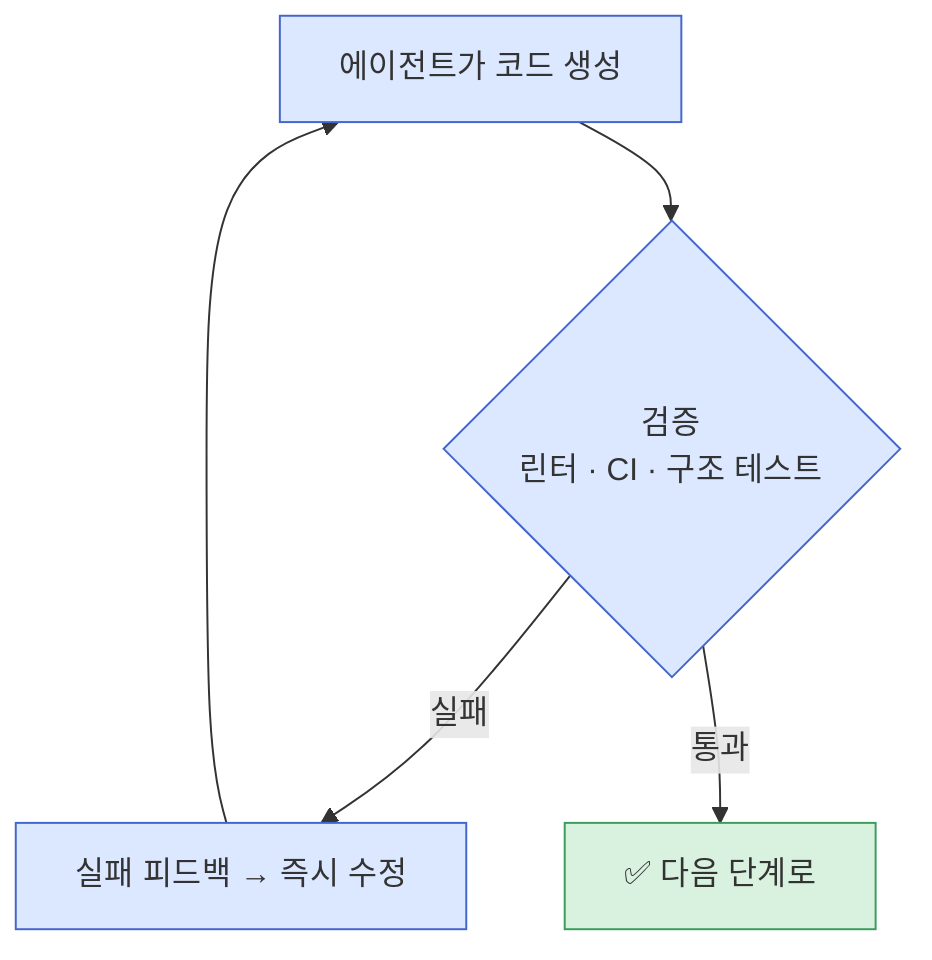
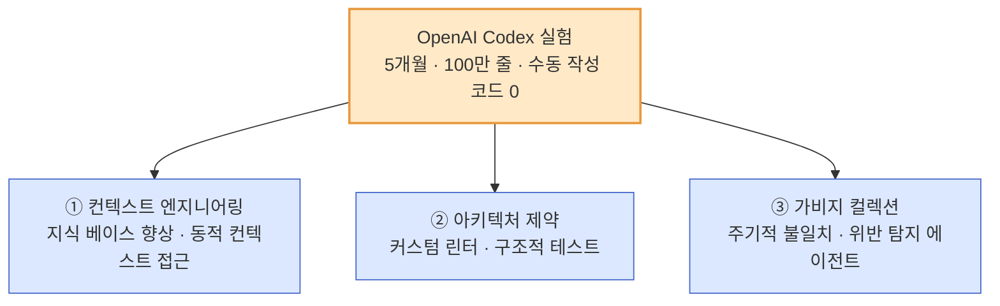
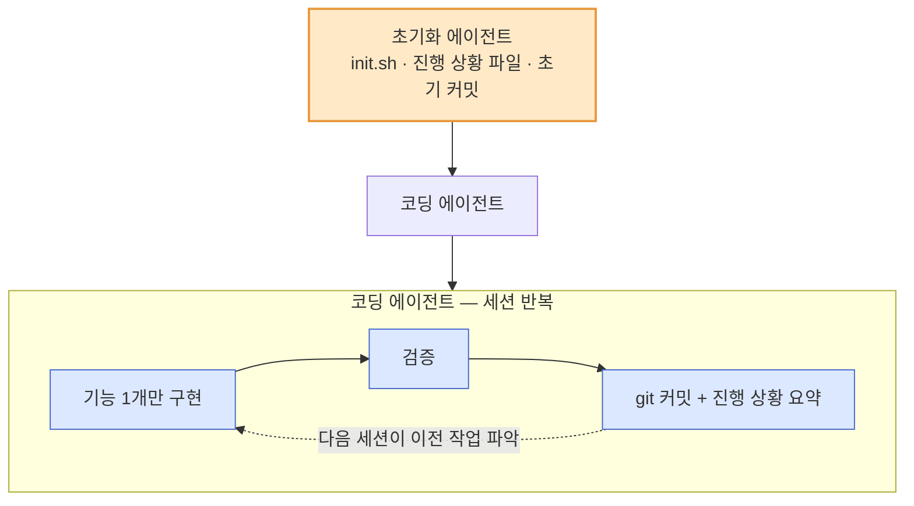
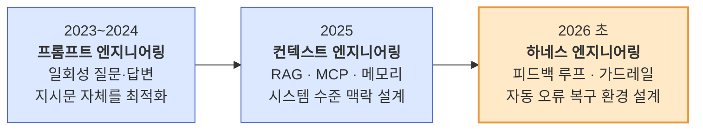

## TL;DR

- 에이전트만으로 수백만 줄 규모의 프로덕션 코드를 개발하고 유지보수할 수 있는가? **가능하다.** OpenAI[^4]와 Anthropic[^6]이 이를 입증하고 있다.
- **컨텍스트 엔지니어링**과 **하네스 엔지니어링**은 상호 보완적이자 확장된 관계다. 컨텍스트가 큰 방향을 잡아주고, 하네스가 짧은 실행 주기마다 자동 오류 복구로 그 방향을 지켜준다.
- 개발 전 과정을 에이전트에게 위임할 생각이 없다면, 아직은 하네스 엔지니어링을 도입하지 않아도 된다.

## 시작하며

이전 글에서 컨텍스트 엔지니어링[^1]과 비즈니스 맥락을 코드에 녹이는 방법[^2]에 대해 이야기한 적이 있다.

에이전트에게 좋은 정적 컨텍스트를 주고, 코드 자체가 비즈니스를 잘 설명하면, 에이전트가 더 안정적으로 동작한다는 이야기였다.

그런데 실제로 에이전트를 프로덕션 수준에서 운영하다 보면 컨텍스트만으로는 해결되지 않는 문제들이 생긴다.

에이전트가 린트 규칙을 무시하거나, 아키텍처 원칙에서 벗어나거나, 이미 해결된 실수를 반복하거나. 좋은 프롬프트와 좋은 컨텍스트를 줬는데도 결과가 불안정한 경험을 해본 적이 있을 것이다.

최근 OpenClaw 같은 always-on long-running agent 환경이 등장하면서 이 문제는 더 가시화되었다.

에이전트가 여러 컨텍스트 윈도우에 걸쳐 몇 시간, 며칠 단위로 작업을 수행하게 되면서, 한 번의 실행 루프 안에서 발생하는 작은 오류들이 누적되어 전체 방향을 무너뜨리는 현상이 빈번해진 것이다.

일반 개발자들의 AI 도입 상황이 아직 성숙하지 않았음에도, 하네스 엔지니어링은 커뮤니티 전반에서 중요한 관심사로 급부상했다.

2026년 2월, Mitchell Hashimoto[^3]와 OpenAI[^4]가 이 영역에 이름을 붙였다. **하네스 엔지니어링(Harness Engineering)**이다.

이후 Anthropic도 long-running agent를 위한 효과적인 하네스 설계에 대한 글[^6]을 발표하면서, 업계 전반의 공감대가 형성되고 있다.

## 1. 하네스란 무엇인가

하네스(harness)는 원래 말에 씌우는 마구, 즉 고삐와 안장 같은 장치를 뜻한다. 말이 제멋대로 달리지 않게 방향을 잡아주는 장치다.

AI 에이전트의 하네스도 똑같다. **에이전트가 엉뚱한 길로 새지 않도록 감싸주는 환경 전체**를 말한다.

먼저 우리가 무엇을 제어할 수 있는지부터 정리하자. 에이전트는 **컨텍스트 + LLM(모델) + 도구**의 조합이다. 이 셋 중 **모델은 우리가 손댈 수 없다.** GPT든 Claude든, 고를 수는 있어도 안을 뜯어고칠 수는 없는 고정된 상수다.

바꿔 말하면, 우리가 실제로 주무를 수 있는 건 **모델을 뺀 나머지 전부** — 컨텍스트, 도구, 그리고 그것들이 돌아가는 환경이다.





그래서 하네스는 에이전트의 "바깥"만 감싸는 게 아니다. 모델 하나만 고정해두고, **컨텍스트와 도구까지 적극적으로 주무르는** 환경이다. 뒤에서 보겠지만 피드백 루프는 검증 결과를 다시 컨텍스트에 넣고 도구로 확인하니, 사실상 에이전트 안쪽을 직접 굴린다.

이 하네스를 안을 들여다보면, 결국 두 가지 장치로 정리된다. **피드백 루프**와 **가드레일**이다. 하나씩 보자.

### 피드백 루프 — "결과를 보고, 틀렸으면 다시"

피드백 루프는 **에이전트가 내놓은 결과를 검증하고, 기준에 맞을 때까지 스스로 다시 시도하게 만드는 순환**이다.

사람이 "이거 틀렸으니 고쳐"라고 말해주는 대신, 그 역할을 자동화한 것이다. 테스트를 돌려보고 실패하면 에이전트가 다시 고치고, 다시 돌려보고, 통과할 때까지 반복한다.

여기서 중요한 성질이 하나 있다. 피드백 루프는 **비결정적**이다. 똑같은 상황에서도 에이전트가 매번 조금씩 다르게 고친다. "맞는지 판단하고 알아서 고쳐봐"라고 맡기는, 유연하지만 결과가 딱 떨어지지 않는 영역이다.

### 가드레일 — "선을 넘으면 무조건 막는다"

가드레일은 반대로 **결정적**이다. 명확한 규칙을 정해두고, 위반하면 통과를 막는다.

린터가 스타일 위반을 잡고, 테스트가 깨진 코드를 거르고, Hooks가 금지된 동작을 차단한다. "이렇게 해줘"라고 부탁하는 게 아니라, **그렇게 하지 않으면 아예 통과가 안 되도록** 길 양옆에 세워둔 난간이다.

같은 입력이면 같은 결과가 나오는, 예측 가능한 자동 차단 장치다.

### 둘은 역할이 다르다

| 장치 | 성격 | 하는 일 | 예시 |
| --- | --- | --- | --- |
| 피드백 루프 | 비결정적 · 유연 | 결과를 검증하고 맞을 때까지 자율 재시도 | 테스트 실행 → 실패 시 재수정 |
| 가드레일 | 결정적 · 엄격 | 규칙 위반을 자동으로 차단 | 린터 · 타입 체크 · Hooks |

가드레일이 "넘으면 안 되는 선"을 그어주고, 피드백 루프가 "선 안에서 맞을 때까지 다듬는" 역할을 한다. 이 둘이 합쳐져 에이전트를 감싼 환경이 바로 하네스다.

이걸 실제 작업 흐름에 얹어보면 이렇게 돌아간다.





핵심은 이 두 장치가 **모델은 고정해두고, 그 나머지(컨텍스트·도구·실행 환경)를 매 걸음마다 검증하고 되돌려준다**는 점이다.

가드레일이 결과를 거르고, 피드백 루프가 그 결과를 다시 컨텍스트에 넣어 에이전트를 한 번 더 굴린다. 에이전트를 멀리서 감싸기만 하는 게 아니라, 안쪽까지 손을 넣어 방향을 잡아주는 환경. 그게 하네스다.

## 2. 컨텍스트 엔지니어링과 하네스 엔지니어링의 관계

둘의 차이를 가장 직관적으로 이해하는 방법은 **시간 축**으로 보는 것이다.

**컨텍스트 엔지니어링은 큰 방향성을 조정하는 것이다.** 에이전트가 무엇을 해야 하는지, 어떤 아키텍처를 따라야 하는지, 어떤 비즈니스 맥락 속에서 동작하는지를 알려주는 것이다.

시스템 프롬프트, CLAUDE.md, RAG로 가져온 문서, 메모리 등이 여기에 해당한다. 이것은 에이전트에게 **목적지와 경로**를 알려주는 역할이다.

**하네스 엔지니어링은 짧은 실행 과정에서 자동으로 오류를 복구하여, 큰 방향에서 멀어지지 않고 긴 호흡의 태스크를 완료할 수 있게 해주는 것이다.**

린터가 코드 스타일 위반을 잡아서 에이전트가 즉시 수정하고, CI가 테스트 실패를 알려서 에이전트가 자동으로 고치고, 구조적 테스트가 아키텍처 위반을 감지해서 되돌리게 하는 것. 이것은 **매 걸음마다 발밑을 확인하는 안전장치**이다.

비유하자면, 컨텍스트 엔지니어링이 등산 전에 지도와 경로를 건네주는 것이라면, 하네스 엔지니어링은 등산 중에 발을 헛디딜 때마다 자동으로 잡아주는 안전 로프다.

지도가 없으면 어디로 가야 하는지 모르고, 안전 로프가 없으면 한 번의 실수로 낭떠러지에서 떨어진다. **긴 호흡의 태스크일수록 안전 로프의 가치는 커진다.**





Anthropic의 long-running agent 하네스 설계 글[^6]에서도 이 점을 강조한다.

에이전트가 여러 컨텍스트 윈도우를 넘나들며 작업할 때, **"압축만으로는 충분하지 않다. 고급 모델이라도 컨텍스트 윈도우 여러 개를 순환할 때 고수준 프롬프트만으로는 프로덕션급 결과를 만들기 어렵다"**는 것이다.

매 실행 루프마다 상태를 기록하고, 실패를 감지하고, 자동으로 복구하는 메커니즘이 있어야 한다.

| 구분 | 핵심 역할 | 시간 축 | 설계 대상 |
| --- | --- | --- | --- |
| 컨텍스트 엔지니어링 | 큰 방향성 조정 | 태스크 시작 시점 | LLM이 보는 모든 토큰 |
| 하네스 엔지니어링 | 짧은 주기의 자동 오류 복구 | 매 실행 루프 | 가드레일과 피드백 루프 (모델만 빼고) |

Martin Fowler의 정리[^5]에서도 **"컨텍스트 엔지니어링은 모델이 잘 생각하게 돕고, 하네스 엔지니어링은 시스템이 궤도를 이탈하지 않게 막는다"**고 설명한다.

실무에서 중요한 것은 프레이밍이 아니라, 큰 방향만 잡아줘서는 긴 태스크가 완주되지 않는다는 현실적 인식이다.

### 결국은 "사람의 개입을 어디까지 줄이느냐"의 문제

두 엔지니어링이 왜 함께 가야 하는지는, 개발 과정에서 **사람이 끼어드는 지점**을 떠올려보면 분명해진다.

비즈니스 요구사항이 코드가 되기까지는 보통 세 군데에서 사람이 개입한다. **무엇을 만들지 맥락을 정리하는 일**, **실제로 코드를 짜는 일**, 그리고 **결과가 맞는지 확인하고 고치는 일**이다.

에이전트에게 일을 맡긴다는 건, 이 세 지점에서 사람의 손을 하나씩 떼어내는 과정이다.





**컨텍스트 엔지니어링은 ①번 손을 줄인다.** 매번 사람이 "이건 이렇게 해줘"라고 설명하는 대신, 규칙과 맥락을 미리 문서로 깔아둔다.

**하네스 엔지니어링은 ③번 손을 줄인다.** 사람이 결과를 일일이 검토하고 "여기 틀렸으니 고쳐"라고 말해주는 대신, 린터·테스트가 자동으로 검증하고 에이전트가 스스로 고치게 만든다.

여기서 핵심은, **③번 손을 떼어내려면 ①번이 먼저 잘 깔려 있어야 한다**는 점이다. 무엇이 맞는지(컨텍스트)가 명확해야, 틀렸을 때 자동으로 잡아내는 장치(하네스)를 만들 수 있다.

그래서 둘은 따로 노는 게 아니라, **사람의 개입을 단계적으로 줄여나가는 하나의 흐름** 위에 놓여 있다. 컨텍스트로 방향을 잡는 손부터 줄이고, 하네스로 검증하는 손을 줄이고, 그렇게 사람이 "비즈니스 요구사항을 던지는 일"만 남기는 쪽으로 나아가는 것이다.

## 3. 왜 짧은 주기의 자동 오류 복구가 핵심인가

컨텍스트 엔지니어링으로 큰 방향을 잘 잡아줬다고 가정하자.

그런데 에이전트가 30분짜리 태스크를 수행하는 동안, 5분 차에 린트 규칙을 무시한 코드를 생성했다. 10분 차에 그 위에 더 많은 코드를 쌓았다. 20분 차에는 처음의 위반이 아키텍처 전체로 번졌다.

30분 뒤에 결과물을 보면, 방향은 맞았지만 코드는 못 쓰게 된 상태다.





**문제는 실수 자체가 아니라 실수가 복구되지 않고 누적된다는 것이다.** 이것이 long-running agent의 본질적인 어려움이다.

Anthropic의 글[^6]에서는 이를 **"이전 교대 근무에 대한 기억 없이 도착하는 엔지니어"**에 비유했다. 매번 새로운 컨텍스트로 시작하는 에이전트가 이전 실수를 인지하지 못하면, 같은 실수를 반복하거나 그 위에 더 쌓아 올린다.

하네스 엔지니어링의 핵심은 이 문제를 **짧은 실행 주기마다 자동으로 복구**하는 데 있다.

**린터가 매 실행마다 코드를 검사한다.** 에이전트가 코드를 생성하면, 린터가 즉시 위반을 잡아내고 에이전트에게 실패 피드백을 준다. 에이전트는 5분 차에서 바로 수정한다. 위반이 10분, 20분으로 누적되지 않는다.

**CI가 매 커밋마다 테스트를 돌린다.** 에이전트가 기능을 구현하면, 자동 테스트가 즉시 검증한다. 실패하면 에이전트가 자동으로 수정을 시도한다.

Anthropic은 이를 위해 **한 번에 하나의 기능만 구현하게 제한하고, 매 세션 종료 시 git 커밋과 진행 상황 요약을 강제**하는 방식을 제안했다[^6].

**구조적 테스트가 아키텍처 위반을 감지한다.** 커스텀 린트 규칙이나 아키텍처 테스트가 에이전트의 결과물이 전체 구조에서 벗어나지 않는지 확인한다.

이 세 가지는 결국 하나의 짧은 피드백 루프로 묶인다. 에이전트가 결과를 내면 검증 장치가 즉시 통과 여부를 판정하고, 실패하면 그 피드백을 받아 같은 자리에서 다시 시도한다.





루프 한 바퀴가 짧을수록 실수가 누적되기 전에 끊긴다. 이것이 "피드백 루프를 짧게"가 하네스의 핵심 원칙인 이유다.

Mitchell Hashimoto는 이를 한 문장으로 정리했다. **"에이전트가 실수를 하면, 에이전트가 그 실수를 다시는 하지 못하도록 환경을 엔지니어링하라."**[^3]

희망이 아니라 기계적 강제(mechanical enforcement)로 문제를 해결하는 것이다. 그리고 그 강제가 **짧은 주기로 반복될수록**, 에이전트는 큰 방향에서 벗어나지 않고 긴 태스크를 완주할 수 있다.

## 4. OpenAI와 Anthropic이 보여준 것

OpenAI는 2026년 2월, 5개월간의 내부 실험 결과를 공개했다[^4].

소규모 팀이 Codex 에이전트만을 사용하여, 수동으로 작성된 코드 없이 백만 줄이 넘는 프로덕션 소프트웨어를 완성했다는 내용이다.

이 실험에서 엔지니어들이 한 일은 코드를 짜는 게 아니었다. **하네스를 설계하는 것**이었다. OpenAI는 하네스의 구성요소를 크게 세 가지로 분류했다.

1. **컨텍스트 엔지니어링**: 코드베이스 내의 지식 베이스를 지속적으로 향상시키고, 관찰 데이터나 브라우저 탐색 같은 동적 컨텍스트에 에이전트가 접근할 수 있게 하는 것
2. **아키텍처 제약**: LLM 기반 에이전트뿐 아니라 결정론적인 커스텀 린터와 구조적 테스트로도 모니터링하는 것
3. **가비지 컬렉션**: 주기적으로 문서 불일치나 아키텍처 위반을 찾아내는 에이전트를 돌려 엔트로피와 부패에 맞서는 것





Anthropic도 같은 맥락에서 long-running agent를 위한 하네스 설계 원칙을 발표했다[^6]. 핵심은 **이중 구조 방식**이다.

초기화 에이전트가 환경을 설정하고(`init.sh`, 진행 상황 파일, 초기 커밋), 코딩 에이전트가 한 번에 하나의 기능만 점진적으로 구현한다. 매 세션마다 상태를 기록하고, 다음 세션이 이전 작업을 빠르게 파악할 수 있게 한다.

**짧은 실행 주기마다 명확한 결과물을 남기고 검증하는 것**이 long-running agent의 안정성을 담보한다는 결론이다.





두 글에서 공통적으로 강조하는 것은 결국 같다. 컨텍스트로 큰 방향을 잡아주되, **매 실행 주기마다 자동으로 오류를 잡아내고 복구하는 메커니즘**이 있어야 에이전트가 긴 태스크를 완주할 수 있다는 것이다.

## 5. 시기별 흐름으로 보는 진화

세 개념이 순서대로 등장한 데는 AI 활용 방식의 변화가 있다.





흐름의 방향은 일관된다. **제어 대상이 "입력 텍스트"에서 "에이전트가 일하는 과정 전체"로 넓어진다.** 모델이 더 자율적으로, 더 오래 일할수록 입력만으로는 통제가 안 되는 영역이 드러나기 때문이다.

**2023~2024년, 프롬프트 엔지니어링의 시대.** ChatGPT에 질문 하나를 던지고 답변 하나를 받는 구조였다.

역할을 부여하고, 단계별로 시키고, 예시를 넣는 것만으로 원하는 결과를 끌어낼 수 있었다. 모델과의 상호작용이 일회성이었기 때문에, 지시문 자체를 최적화하는 것이 핵심이었다.

**2025년, 컨텍스트 엔지니어링의 부상.** 에이전트가 등장하면서, 단일 프롬프트가 아니라 RAG, MCP, 메모리, 검색 결과 등 시스템 수준의 맥락을 설계하는 것이 중요해졌다.

Andrej Karpathy가 "프롬프트 엔지니어링에서 컨텍스트 엔지니어링으로" 전환을 이야기하면서 용어가 널리 퍼졌다.

**2026년 초, 하네스 엔지니어링의 등장.** 에이전트가 더 자율적으로, 더 오래, 더 큰 범위의 작업을 수행하게 되면서, 입력 제어만으로는 부족한 영역이 드러났다.

Mitchell Hashimoto가 2026년 2월 5일 자신의 AI 도입 여정을 공유하며 "harness engineering"이라는 용어를 처음 사용했고, 일주일 뒤 OpenAI가 Codex 실험 보고서에서 이를 공식화했다. 이어서 Anthropic도 long-running agent를 위한 하네스 설계 글을 발표했다[^6].

특히 주목할 만한 것은 OpenClaw, NanoClaw, NemoClaw 같은 always-on long-running agent 환경들의 등장이다. 이들은 에이전트가 사람의 개입 없이 며칠 단위로 자율 작업을 수행하는 환경을 제공한다.

아직 대다수 개발자들이 AI 코딩 도구를 자동완성 수준에서 사용하고 있는 상황임에도, 이런 환경들이 빠르게 만들어지고 있다는 것은 업계가 어디를 향하고 있는지를 보여준다.

## 6. 실무에서의 의미

이 글에서 하네스 엔지니어링의 구체적인 실천법을 다루기에는 범위가 너무 넓다. 하지만 핵심 원칙은 명확하다.

**피드백 루프를 짧게, 자동 복구를 빠르게.** 이것이 하네스 엔지니어링의 핵심이다.

에이전트가 실수를 하면 빠르게 알 수 있어야 하고, 알게 된 즉시 스스로 수정할 수 있어야 한다. 실패 피드백이 빠를수록 오류가 누적되지 않고, 큰 방향에서 멀어지지 않는다.

**희망 대신 기계적 강제를 택하라.** 에이전트에게 "이렇게 해줘"라고 부탁하는 것이 아니라, 그렇게 하지 않으면 실패하도록 가드레일을 세워라. 린터, 테스트, Hooks가 그 역할을 한다.

**엔트로피와 싸워라.** 에이전트가 많은 코드를 생성할수록 일관성은 떨어진다. 주기적으로 코드베이스를 점검하고, 문서와 코드의 불일치를 찾아내는 프로세스가 필요하다.

**컨텍스트로 방향을 잡고, 하네스로 걸음을 지켜라.** 좋은 컨텍스트 없이 하네스만 있으면 에이전트가 무엇을 해야 하는지 모른다.

좋은 하네스 없이 컨텍스트만 있으면 에이전트가 궤도를 이탈한다. 큰 방향은 컨텍스트가, 매 걸음의 안정성은 하네스가 책임진다.

## 마치며

내가 보는 에이전트 개발 전반의 방향성은 명확하다. **비즈니스 요구사항을 코드로 바꾸는 전 과정을 AI에게 위임할 수 있는지 확인하는 과정**이다.

하네스 엔지니어링이 주목받는 것도, OpenClaw, NanoClaw, NemoClaw 같은 각종 Claw 환경들이 쏟아지는 것도, 이 방향성에 대한 다양한 관점에서의 동의로 읽을 수 있다.

컨텍스트 엔지니어링이 에이전트에게 "어디로 가야 하는지"를 알려준다면, 하네스 엔지니어링은 "가는 도중에 넘어져도 자동으로 일어나게" 해준다.

짧은 실행 주기마다 오류를 잡아내고 복구하는 이 메커니즘이 있어야, 에이전트는 큰 방향에서 벗어나지 않고 긴 호흡의 태스크를 끝까지 완주할 수 있다.

물론 하네스 엔지니어링도 아직 초기 단계다. 용어 자체가 등장한 지 한 달밖에 되지 않았고, 도구와 방법론은 계속 진화하고 있다.

하지만 OpenAI[^4]와 Anthropic[^6] 모두 이 영역의 중요성을 공식적으로 다루기 시작했다는 것은, 에이전트가 자율적으로 오래 동작하는 미래가 이미 현재 진행형이라는 뜻이다.

---

[^1]: [컨텍스트 엔지니어링 - 정적 컨텍스트와 동적 컨텍스트](/2026/03/11/context-engineering-static-vs-dynamic/)
[^2]: [에이전틱 개발 시대, 비즈니스를 아는 개발자의 가치](/2026/03/13/agentic-dev-business-aligned-code/)
[^3]: [Mitchell Hashimoto - My AI Adoption Journey](https://mitchellh.com/writing/my-ai-adoption-journey) (2026.02.05)
[^4]: [OpenAI - Harness engineering: leveraging Codex in an agent-first world](https://openai.com/index/harness-engineering/) (2026.02.11)
[^5]: [Martin Fowler - Harness Engineering](https://martinfowler.com/articles/exploring-gen-ai/harness-engineering.html) (2026.02.17)
[^6]: [Anthropic - Effective harnesses for long-running agents](https://www.anthropic.com/engineering/effective-harnesses-for-long-running-agents)
