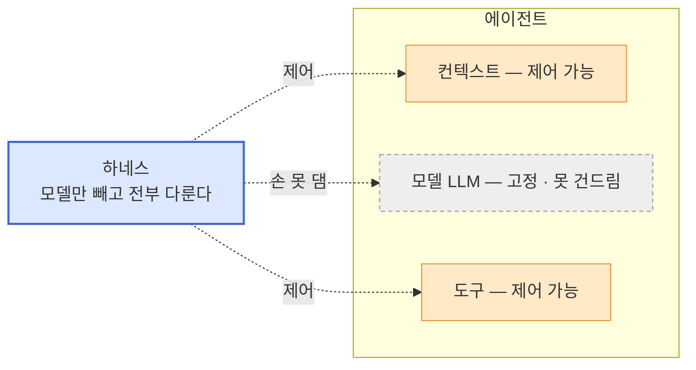
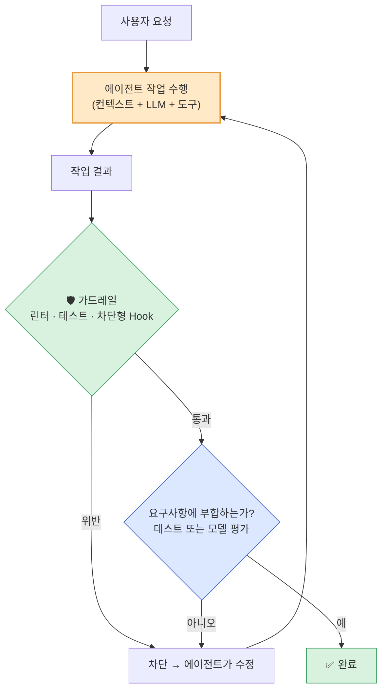
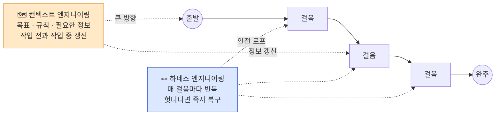
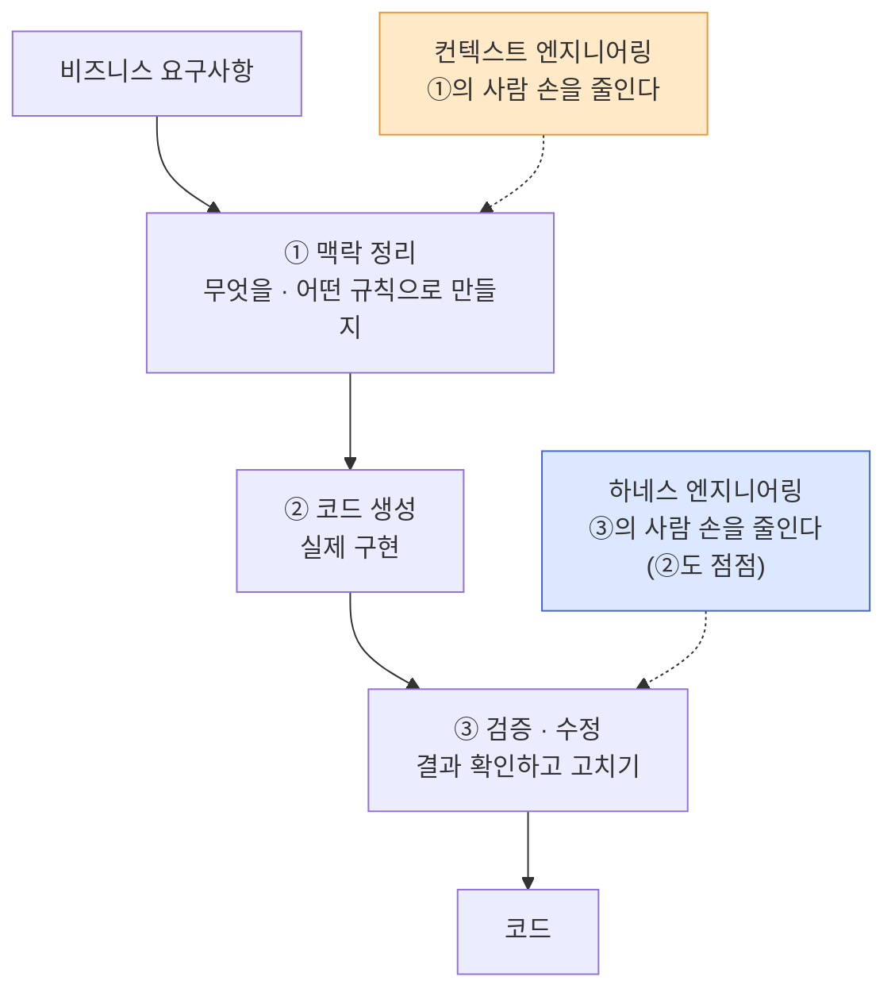
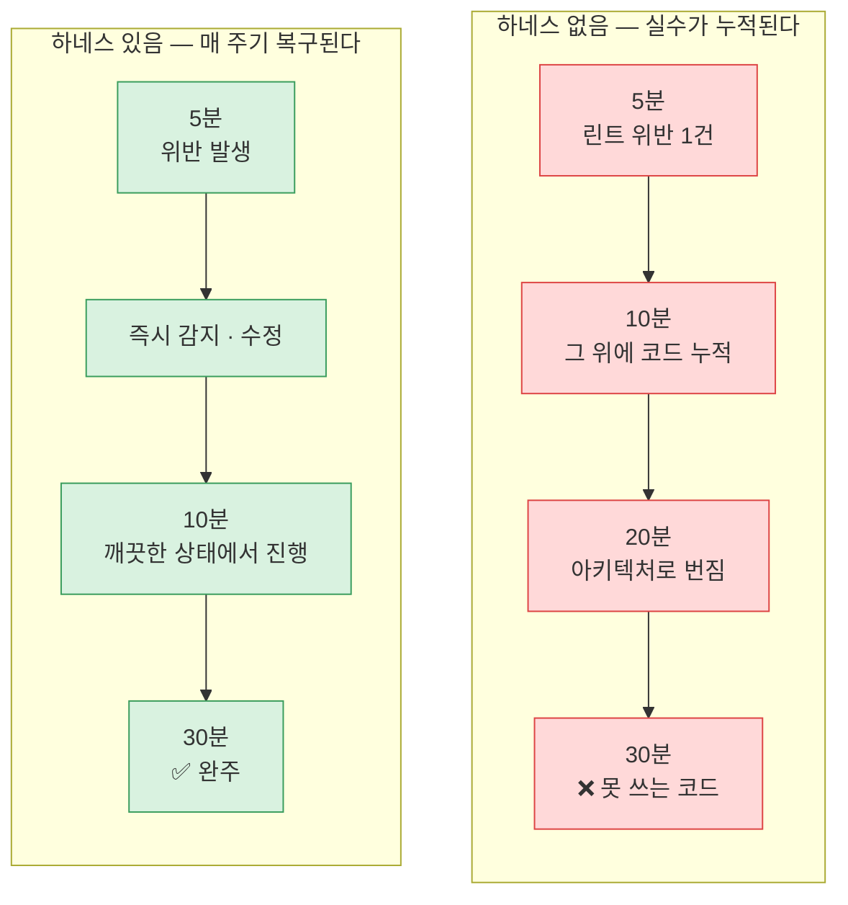
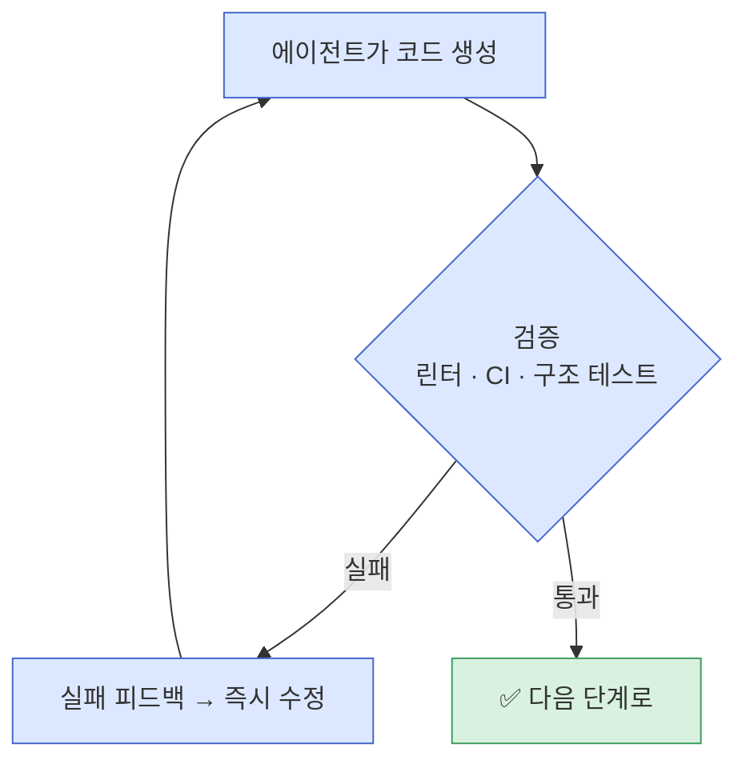
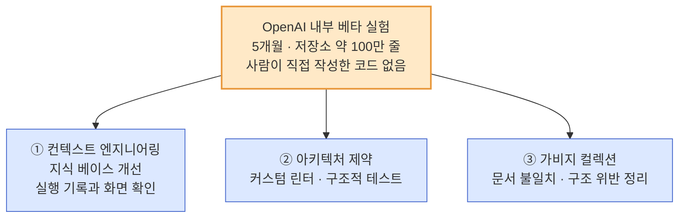
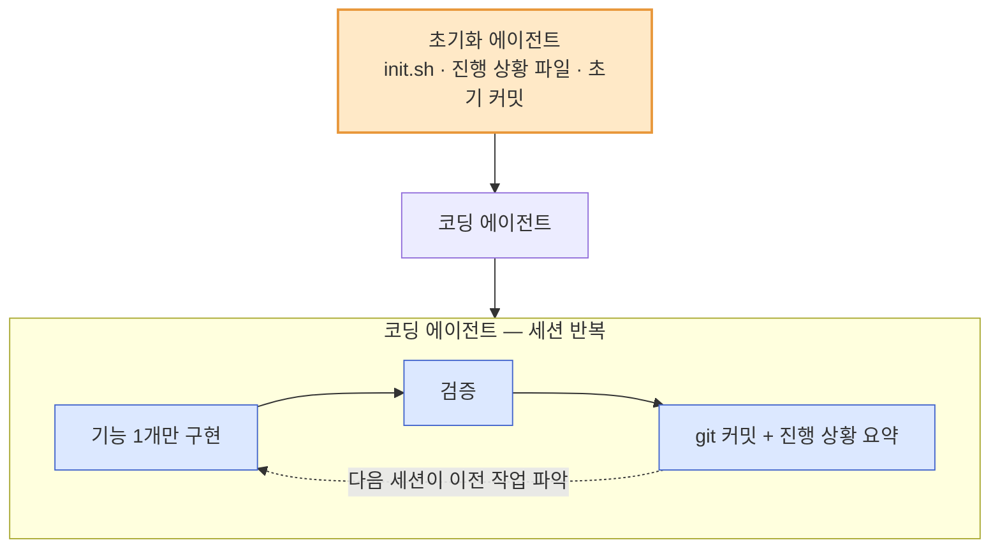
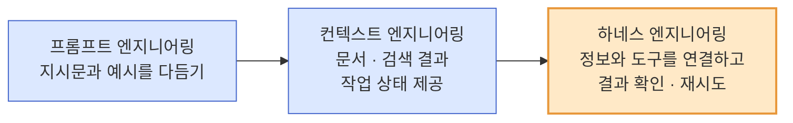

## TL;DR

- 하네스는 컨텍스트·도구·검증을 연결하는 실행 환경이다.
- 짧은 검증과 재시도는 오류가 누적되는 것을 줄인다.
- 반복되는 오류 하나를 자동으로 확인하는 것부터 시작한다.

## 시작하며

이전 글에서 컨텍스트 엔지니어링[^1]과 비즈니스 맥락을 코드에 녹이는 방법[^2]에 대해 이야기한 적이 있다.

에이전트에게 좋은 정적 컨텍스트를 주고, 코드 자체가 비즈니스를 잘 설명하면, 에이전트가 더 안정적으로 동작한다는 이야기였다.

그런데 실제로 에이전트를 프로덕션 수준에서 운영하다 보면 컨텍스트만으로는 해결되지 않는 문제들이 생긴다.

에이전트가 린트 규칙을 무시하거나, 아키텍처 원칙에서 벗어나거나, 이미 해결된 실수를 반복하거나. 좋은 프롬프트와 좋은 컨텍스트를 줬는데도 결과가 불안정한 경험을 해본 적이 있을 것이다.

에이전트가 한 번에 읽을 수 있는 정보량, 즉 컨텍스트 윈도우를 넘겨 작업을 이어가면 이전 오류나 미완료 상태를 놓칠 수 있다. 작업을 오래 맡길수록 어떤 정보를 이어받고 어떻게 결과를 확인할지가 중요해진다.

Anthropic은 2025년 11월 장기 실행 에이전트의 하네스 설계를 소개했다.[^6] 2026년 2월에는 Mitchell Hashimoto[^3]와 OpenAI[^4]도 **하네스 엔지니어링(Harness Engineering)**이라는 이름으로 자신의 작업 방식과 실험을 설명했다.

## 1. 하네스란 무엇인가

하네스(harness)는 원래 말에 씌우는 마구, 즉 고삐와 안장 같은 장치를 뜻한다. 말이 제멋대로 달리지 않게 방향을 잡아주는 장치다.

AI 에이전트의 하네스도 똑같다. **에이전트가 엉뚱한 길로 새지 않도록 감싸주는 환경 전체**를 말한다.

먼저 우리가 무엇을 제어할 수 있는지부터 정리하자. 에이전트는 **컨텍스트 + LLM(모델) + 도구**의 조합이다. 여기서는 모델을 직접 학습시키지 않고 선택해 사용하는 개발 환경을 다룬다.

바꿔 말하면, 우리가 실제로 주무를 수 있는 건 **모델을 뺀 나머지 전부** — 컨텍스트, 도구, 그리고 그것들이 돌아가는 환경이다.



```mermaid
flowchart LR
    subgraph AGENT["에이전트"]
        direction TB
        CTX["컨텍스트 — 제어 가능"]
        LLM["모델 LLM — 고정 · 못 건드림"]
        TOOL["도구 — 제어 가능"]
    end
    HAR["하네스<br/>모델만 빼고 전부 다룬다"]
    HAR -. 제어 .-> CTX
    HAR -. 제어 .-> TOOL
    HAR -. 손 못 댐 .-> LLM
    classDef fixed fill:#eee,stroke:#999,stroke-dasharray:4 3;
    classDef ctl fill:#ffe9c7,stroke:#e8973a;
    classDef har fill:#dce8ff,stroke:#46c,stroke-width:2px;
    class LLM fixed;
    class CTX,TOOL ctl;
    class HAR har;
```


하네스는 검증 결과를 컨텍스트에 넣고, 도구로 다음 작업을 수행하게 한다. 이 과정에서 사용하는 두 가지 장치가 **피드백 루프**와 **가드레일**이다.

### 피드백 루프 — "결과를 보고, 틀렸으면 다시"

피드백 루프는 **에이전트가 내놓은 결과를 검증하고, 기준에 맞을 때까지 스스로 다시 시도하게 만드는 순환**이다.

사람이 "이거 틀렸으니 고쳐"라고 말해주는 대신, 그 역할을 자동화한 것이다. 테스트를 돌려보고 실패하면 에이전트가 다시 고치고, 다시 돌려보고, 통과할 때까지 반복한다.

루프 안의 검증과 수정은 구분해야 한다. 린터나 테스트처럼 **같은 입력에 같은 결과를 내는 결정적 검증**을 쓸 수 있고, 요구사항에 맞는지 모델에게 평가하게 할 수도 있다.

모델이 수정안을 고르는 과정은 같은 상황에서도 달라질 수 있으므로, 검사 자체의 재현성과 전체 수정 과정의 재현성은 구분해야 한다. 같은 검사를 사용하더라도 수정 결과나 필요한 시도 횟수까지 같아지는 것은 아니다.

### 가드레일 — "선을 넘으면 무조건 막는다"

이 글에서 다루는 가드레일은 **결정적인 차단 장치**다. 명확한 규칙을 정해두고, 위반하면 통과를 막는다.

린터나 테스트의 실패를 커밋·배포 중단 조건에 연결하고, 차단형 Hook으로 금지된 동작을 막는 식이다. 검사 결과를 출력하거나 프롬프트만 추가하는 경우에는 이런 차단이 보장되지 않으므로 구분해야 한다.

같은 입력이면 같은 결과가 나오는, 예측 가능한 자동 차단 장치다.

### 둘은 역할이 다르다

| 장치 | 성격 | 하는 일 | 예시 |
| --- | --- | --- | --- |
| 피드백 루프 | 검증·수정을 반복하는 흐름 | 검증 결과를 돌려주고 재시도 | 테스트 실행 → 실패 시 재수정 |
| 가드레일 | 규칙에 따른 결정적 차단 | 규칙 위반 시 다음 동작을 막음 | 린터 · 타입 체크 · 차단형 Hook |

가드레일이 "넘으면 안 되는 선"을 그어주고, 피드백 루프가 "선 안에서 맞을 때까지 다듬는" 역할을 한다. 이 둘이 합쳐져 에이전트를 감싼 환경이 바로 하네스다.

이걸 실제 작업 흐름에 얹어보면 이렇게 돌아간다.



```mermaid
flowchart TB
    REQ["사용자 요청"] --> AGENT["에이전트 작업 수행<br/>(컨텍스트 + LLM + 도구)"]
    AGENT --> OUT["작업 결과"]
    OUT --> GR{"🛡️ 가드레일<br/>린터 · 테스트 · 차단형 Hook"}
    GR -->|위반| BACK["차단 → 에이전트가 수정"]
    BACK --> AGENT
    GR -->|통과| FB{"요구사항에 부합하는가?<br/>테스트 또는 모델 평가"}
    FB -->|아니오| BACK
    FB -->|예| DONE["✅ 완료"]
    classDef agent fill:#ffe9c7,stroke:#e8973a,stroke-width:2px;
    classDef guard fill:#d9f2e0,stroke:#3a9d5d;
    classDef loop fill:#dce8ff,stroke:#46c;
    classDef done fill:#d9f2e0,stroke:#3a9d5d;
    class AGENT agent;
    class GR guard;
    class FB loop;
    class DONE done;
```


가드레일이 차단한 이유도 다음 수정의 입력이 된다. 위 그림에서 결과를 확인하고 작업으로 되돌아가는 경로 전체가 피드백 루프다.

## 2. 컨텍스트 엔지니어링과 하네스 엔지니어링의 관계

둘을 구분할 때는 모델에 어떤 정보를 줄지와, 그 정보를 가지고 한 작업을 어떻게 검증할지 나눠보면 편하다.

**컨텍스트 엔지니어링은 큰 방향성을 조정하는 것이다.** 에이전트가 무엇을 해야 하는지, 어떤 아키텍처를 따라야 하는지, 어떤 비즈니스 맥락 속에서 동작하는지를 알려주는 것이다.

시스템 프롬프트, CLAUDE.md, 검색으로 가져온 문서, 메모리 등이 여기에 해당한다. 작업 중 새로 읽은 코드나 검증 결과도 다음 판단에 필요한 컨텍스트가 된다.

**하네스 엔지니어링은 실행 중 오류를 확인하고 다시 시도할 수 있게 환경을 구성하는 일이다.** 이를 짧은 주기로 반복해, 작은 오류 위에 다음 작업을 계속 쌓는 일을 줄이려는 것이다.

린터가 코드 스타일 위반을 잡아서 에이전트가 즉시 수정하고, CI가 테스트 실패를 알려서 에이전트가 자동으로 고치고, 구조적 테스트가 아키텍처 위반을 감지해서 되돌리게 하는 것. 이것은 **매 걸음마다 발밑을 확인하는 안전장치**이다.

등산에 비유하면 컨텍스트는 지도와 현재 위치를 알려주고, 실행 중 검증과 복구는 발을 헛디뎠을 때 잡아주는 안전 로프에 가깝다. 지도도 새로운 상황을 만나면 다시 확인하듯, 컨텍스트 역시 작업 중에 갱신된다.



```mermaid
flowchart LR
    CTX["🗺️ 컨텍스트 엔지니어링<br/>목표 · 규칙 · 필요한 정보<br/>작업 전과 작업 중 갱신"]
    CTX -.큰 방향.-> START(("출발"))
    START --> S1["걸음"] --> S2["걸음"] --> S3["걸음"] --> GOAL(("완주"))
    CTX -.정보 갱신.-> S2
    ROPE["🪢 하네스 엔지니어링<br/>매 걸음마다 반복<br/>헛디디면 즉시 복구"]
    ROPE -.안전 로프.-> S1
    ROPE -.-> S2
    ROPE -.-> S3
    classDef ctx fill:#ffe9c7,stroke:#e8973a;
    classDef harness fill:#dce8ff,stroke:#46c;
    class CTX ctx;
    class ROPE harness;
```


Anthropic의 long-running agent 하네스 설계 글[^6]에서도 이 점을 강조한다.

그 글에서는 에이전트가 여러 컨텍스트 윈도우를 넘나들 때, 대화를 압축하고 큰 목표를 알려주는 것만으로는 안정적으로 작업을 이어가기 어려웠다고 설명한다.

매 실행 루프마다 상태를 기록하고, 실패를 감지하고, 자동으로 복구하는 메커니즘이 있어야 한다.

| 구분 | 핵심 역할 | 시간 축 | 설계 대상 |
| --- | --- | --- | --- |
| 컨텍스트 엔지니어링 | 목표·규칙·필요한 정보 제공 | 작업 전과 작업 중 갱신 | LLM이 판단에 사용하는 정보 |
| 실행 중 검증·복구 | 결과 확인과 재시도 | 각 실행 루프 | 도구·가드레일·피드백 루프 |

컨텍스트와 검증·복구를 연결한 실행 환경 전체를 넓은 의미의 하네스로 다룬다. 위 표는 서로 배타적인 두 기술을 나누기보다 그 안에서 맡는 역할을 구분한 것이다.

Martin Fowler 사이트에 실린 Birgitta Böckeler의 글은 작업 전 지침과 작업 후 검사를 함께 다루며, 사용자 하네스를 컨텍스트 엔지니어링의 한 형태로 설명한다.[^5] 용어를 어디까지 묶는지는 저자마다 다를 수 있다. 이 글에서는 모델에게 정보를 주는 역할과 결과를 확인하는 역할을 구분하되, 둘을 연결한 환경을 하네스라고 부른다.

### 결국은 "사람의 개입을 어디까지 줄이느냐"의 문제

두 엔지니어링이 왜 함께 가야 하는지는, 개발 과정에서 **사람이 끼어드는 지점**을 떠올려보면 분명해진다.

비즈니스 요구사항이 코드가 되기까지는 보통 세 군데에서 사람이 개입한다. **무엇을 만들지 맥락을 정리하는 일**, **실제로 코드를 짜는 일**, 그리고 **결과가 맞는지 확인하고 고치는 일**이다.

에이전트에게 일을 맡긴다는 건, 이 세 지점에서 사람의 손을 하나씩 떼어내는 과정이다.



```mermaid
flowchart TB
    REQ["비즈니스 요구사항"]
    REQ --> S1["① 맥락 정리<br/>무엇을 · 어떤 규칙으로 만들지"]
    S1 --> S2["② 코드 생성<br/>실제 구현"]
    S2 --> S3["③ 검증 · 수정<br/>결과 확인하고 고치기"]
    S3 --> CODE["코드"]
    CTX["컨텍스트 엔지니어링<br/>①의 사람 손을 줄인다"] -.-> S1
    HAR["하네스 엔지니어링<br/>③의 사람 손을 줄인다<br/>(②도 점점)"] -.-> S3
    classDef ctx fill:#ffe9c7,stroke:#e8973a;
    classDef har fill:#dce8ff,stroke:#46c;
    class CTX ctx;
    class HAR har;
```


**컨텍스트 엔지니어링은 ①번 손을 줄인다.** 매번 사람이 "이건 이렇게 해줘"라고 설명하는 대신, 규칙과 맥락을 미리 문서로 깔아둔다.

**하네스 엔지니어링은 ③번 손을 줄인다.** 사람이 결과를 일일이 검토하고 "여기 틀렸으니 고쳐"라고 말해주는 대신, 린터·테스트가 자동으로 검증하고 에이전트가 스스로 고치게 만든다.

여기서 핵심은, **③번 손을 떼어내려면 ①번이 먼저 잘 깔려 있어야 한다**는 점이다. 무엇이 맞는지(컨텍스트)가 명확해야, 틀렸을 때 자동으로 잡아내는 장치(하네스)를 만들 수 있다.

그래서 둘은 따로 노는 게 아니라, **사람의 개입을 단계적으로 줄여나가는 하나의 흐름** 위에 놓여 있다. 컨텍스트로 방향을 잡는 손부터 줄이고, 하네스로 검증하는 손을 줄이고, 그렇게 사람이 "비즈니스 요구사항을 던지는 일"만 남기는 쪽으로 나아가는 것이다.

## 3. 왜 짧은 주기의 자동 오류 복구가 핵심인가

컨텍스트 엔지니어링으로 큰 방향을 잘 잡아줬다고 가정하자.

그런데 에이전트가 30분짜리 태스크를 수행하는 동안, 5분 차에 린트 규칙을 무시한 코드를 생성했다. 10분 차에 그 위에 더 많은 코드를 쌓았다. 20분 차에는 처음의 위반이 아키텍처 전체로 번졌다.

30분 뒤에 결과물을 보면, 방향은 맞았지만 코드는 못 쓰게 된 상태다.



```mermaid
flowchart TB
    subgraph WO["하네스 없음 — 실수가 누적된다"]
        direction TB
        W5["5분<br/>린트 위반 1건"] --> W10["10분<br/>그 위에 코드 누적"] --> W20["20분<br/>아키텍처로 번짐"] --> W30["30분<br/>❌ 못 쓰는 코드"]
    end
    subgraph WH["하네스 있음 — 매 주기 복구된다"]
        direction TB
        H5["5분<br/>위반 발생"] --> H5F["즉시 감지 · 수정"] --> H10["10분<br/>깨끗한 상태에서 진행"] --> H30["30분<br/>✅ 완주"]
    end
    classDef bad fill:#ffd9d9,stroke:#d44;
    classDef good fill:#d9f2e0,stroke:#3a9d5d;
    class W5,W10,W20,W30 bad;
    class H5,H5F,H10,H30 good;
```


**문제는 실수 자체가 아니라 실수가 복구되지 않고 누적된다는 것이다.** 이것이 long-running agent의 본질적인 어려움이다.

Anthropic의 글[^6]에서는 이를 **"이전 교대 근무에 대한 기억 없이 도착하는 엔지니어"**에 비유했다. 매번 새로운 컨텍스트로 시작하는 에이전트가 이전 실수를 인지하지 못하면, 같은 실수를 반복하거나 그 위에 더 쌓아 올린다.

하네스 엔지니어링의 핵심은 이 문제를 **짧은 실행 주기마다 자동으로 복구**하는 데 있다.

**린터가 매 실행마다 코드를 검사한다.** 에이전트가 코드를 생성하면, 린터가 즉시 위반을 잡아내고 에이전트에게 실패 피드백을 준다. 에이전트는 5분 차에서 바로 수정한다. 위반이 10분, 20분으로 누적되지 않는다.

**CI가 매 커밋마다 테스트를 돌린다.** 에이전트가 기능을 구현하면, 자동 테스트가 즉시 검증한다. 실패하면 에이전트가 자동으로 수정을 시도한다.

Anthropic은 이를 위해 **한 번에 하나의 기능만 구현하게 제한하고, 매 세션 종료 시 git 커밋과 진행 상황 요약을 강제**하는 방식을 제안했다[^6].

**구조적 테스트가 아키텍처 위반을 감지한다.** 커스텀 린트 규칙이나 아키텍처 테스트가 에이전트의 결과물이 전체 구조에서 벗어나지 않는지 확인한다.

이 세 가지는 결국 하나의 짧은 피드백 루프로 묶인다. 에이전트가 결과를 내면 검증 장치가 즉시 통과 여부를 판정하고, 실패하면 그 피드백을 받아 같은 자리에서 다시 시도한다.



```mermaid
flowchart TB
    GEN["에이전트가 코드 생성"] --> CHECK{"검증<br/>린터 · CI · 구조 테스트"}
    CHECK -->|실패| FIX["실패 피드백 → 즉시 수정"]
    FIX --> GEN
    CHECK -->|통과| NEXT["✅ 다음 단계로"]
    classDef loop fill:#dce8ff,stroke:#46c;
    classDef pass fill:#d9f2e0,stroke:#3a9d5d;
    class GEN,CHECK,FIX loop;
    class NEXT pass;
```


루프 한 바퀴가 짧을수록 실수가 누적되기 전에 끊긴다. 이것이 "피드백 루프를 짧게"가 하네스의 핵심 원칙인 이유다.

Mitchell Hashimoto도 에이전트가 같은 실수를 반복하지 않도록 지침과 도구를 개선하는 일을 하네스 엔지니어링으로 설명한다.[^3]

이때 자동 검사로 확인할 수 있는 조건은 실제 검사에 연결한다. 피드백을 짧은 주기로 받으면 오류가 쌓이기 전에 수정을 시도할 수 있다.

## 4. OpenAI와 Anthropic이 보여준 것

OpenAI는 2026년 2월, 5개월간의 내부 실험 결과를 공개했다[^4].

소규모 팀이 사람이 직접 코드를 작성하지 않고 Codex로 내부 베타 제품을 만든 사례다. 약 백만 줄 규모의 저장소에는 애플리케이션 코드뿐 아니라 테스트, 인프라, 도구와 문서도 포함된다.

이 실험에서 엔지니어들은 목표를 정하고 결과를 판단하며, 에이전트가 작업을 확인할 **하네스를 설계**했다. 그 사례에서 참고할 부분을 세 가지로 묶어봤다.

1. **컨텍스트 엔지니어링**: 코드베이스 내의 지식 베이스를 지속적으로 향상시키고, 관찰 데이터나 브라우저 탐색 같은 동적 컨텍스트에 에이전트가 접근할 수 있게 하는 것
2. **아키텍처 제약**: LLM 기반 에이전트뿐 아니라 결정론적인 커스텀 린터와 구조적 테스트로도 모니터링하는 것
3. **가비지 컬렉션**: 주기적으로 문서 불일치나 아키텍처 위반을 찾아내는 에이전트를 돌려 엔트로피와 부패에 맞서는 것



```mermaid
flowchart TB
    OAI["OpenAI 내부 베타 실험<br/>5개월 · 저장소 약 100만 줄<br/>사람이 직접 작성한 코드 없음"]
    OAI --> C1["① 컨텍스트 엔지니어링<br/>지식 베이스 개선<br/>실행 기록과 화면 확인"]
    OAI --> C2["② 아키텍처 제약<br/>커스텀 린터 · 구조적 테스트"]
    OAI --> C3["③ 가비지 컬렉션<br/>문서 불일치 · 구조 위반 정리"]
    classDef root fill:#ffe9c7,stroke:#e8973a,stroke-width:2px;
    classDef comp fill:#dce8ff,stroke:#46c;
    class OAI root;
    class C1,C2,C3 comp;
```


Anthropic도 같은 맥락에서 long-running agent를 위한 하네스 설계 원칙을 발표했다[^6]. 핵심은 **이중 구조 방식**이다.

초기화 에이전트가 환경을 설정하고(`init.sh`, 진행 상황 파일, 초기 커밋), 코딩 에이전트가 한 번에 하나의 기능만 점진적으로 구현한다. 매 세션마다 상태를 기록하고, 다음 세션이 이전 작업을 빠르게 파악할 수 있게 한다.

**작업 상태를 다음 세션에 남기고, 새 작업 전에 현재 동작을 확인하는 것**이 장기 실행을 돕는다는 사례다. 자동 검사를 갖췄다는 사실만으로 모든 작업의 성공이 보장되는 것은 아니다.



```mermaid
flowchart TB
    INIT["초기화 에이전트<br/>init.sh · 진행 상황 파일 · 초기 커밋"]
    INIT --> CODE["코딩 에이전트"]
    subgraph SESSION["코딩 에이전트 — 세션 반복"]
        direction LR
        ONE["기능 1개만 구현"] --> VERIFY["검증"] --> COMMIT["git 커밋 + 진행 상황 요약"]
    end
    CODE --> SESSION
    COMMIT -.다음 세션이 이전 작업 파악.-> ONE
    classDef init fill:#ffe9c7,stroke:#e8973a,stroke-width:2px;
    classDef sess fill:#dce8ff,stroke:#46c;
    class INIT init;
    class ONE,VERIFY,COMMIT sess;
```


두 글에서 공통적으로 강조하는 것은 결국 같다. 컨텍스트로 큰 방향을 잡아주되, **매 실행 주기마다 자동으로 오류를 잡아내고 복구하는 메커니즘**이 있어야 에이전트가 긴 태스크를 완주할 수 있다는 것이다.

## 5. 지시문에서 실행 환경으로 넓어지는 관심

세 개념은 앞의 것을 버리고 다음 것으로 교체하는 관계가 아니다. 내가 관심을 두는 제어 범위가 넓어지는 흐름으로 보면 이해하기 쉽다.



```mermaid
flowchart LR
    P["프롬프트 엔지니어링<br/>지시문과 예시를 다듬기"]
    P --> C["컨텍스트 엔지니어링<br/>문서 · 검색 결과<br/>작업 상태 제공"]
    C --> H["하네스 엔지니어링<br/>정보와 도구를 연결하고<br/>결과 확인 · 재시도"]
    classDef era fill:#dce8ff,stroke:#46c;
    classDef latest fill:#ffe9c7,stroke:#e8973a,stroke-width:2px;
    class P,C era;
    class H latest;
```


흐름의 방향은 일관된다. **제어 대상이 "입력 텍스트"에서 "에이전트가 일하는 과정 전체"로 넓어진다.** 모델이 더 자율적으로, 더 오래 일할수록 입력만으로는 통제가 안 되는 영역이 드러나기 때문이다.

짧은 질문에서는 지시문과 예시를 다듬는 일이 중요하다. 저장소 전체를 수정하는 작업에서는 어떤 문서와 코드를 읽힐지, 현재 상태를 어떻게 전달할지도 정해야 한다.

작업이 길어지면 도구를 실행한 결과를 확인하고, 실패를 다음 수정에 반영하며, 다음 세션에 상태를 넘기는 일까지 필요해진다. 작업의 범위에 맞춰 이 장치들을 갖추는 것이 중요하며, 특정 연도나 제품 이름이 적용 여부를 정해주지는 않는다.

## 6. 실무에서의 의미

먼저 반복해서 사람이 확인하는 조건 하나를 고른다. 코드 스타일이라면 린터에, 동작 조건이라면 테스트에 넣고 에이전트가 작업 중 실행하게 한다.

검증에 실패하면 위반한 조건과 실행 결과를 다음 수정의 입력으로 돌려준다. 다시 통과했는지 확인할 때까지 같은 검증을 사용한다.

작업이 끝난 뒤에는 문서와 코드가 어긋난 부분도 확인한다. 같은 실수를 막기 위해 추가한 규칙이 실제 동작과 맞는지 점검해야 다음 작업에도 쓸 수 있다.

## 마치며

나는 비즈니스 요구사항을 코드로 바꾸는 과정에서 에이전트에게 맡길 수 있는 범위를 계속 넓히고 싶다.

그러려면 결과를 믿어달라는 설명보다, 무엇을 확인했고 어디서 실패했는지를 보여주는 실행 환경이 필요하다. 사람이 매번 하던 확인을 하나씩 그 환경으로 옮기는 것이 하네스를 만드는 출발점이라고 생각한다.

---

[^1]: [컨텍스트 엔지니어링 - 정적 컨텍스트와 동적 컨텍스트](/2026/03/11/context-engineering-static-vs-dynamic.html)
[^2]: [에이전틱 개발 시대, 비즈니스를 아는 개발자의 가치](/2026/03/13/agentic-dev-business-aligned-code.html)
[^3]: [Mitchell Hashimoto - My AI Adoption Journey](https://mitchellh.com/writing/my-ai-adoption-journey) (2026.02.05)
[^4]: [OpenAI - Harness engineering: leveraging Codex in an agent-first world](https://openai.com/index/harness-engineering/) (2026.02.11)
[^5]: Birgitta Böckeler, [Harness engineering for coding agent users](https://martinfowler.com/articles/exploring-gen-ai/harness-engineering.html), Martin Fowler 사이트 (2026.04.02).
[^6]: [Anthropic - Effective harnesses for long-running agents](https://www.anthropic.com/engineering/effective-harnesses-for-long-running-agents) (2025.11.26)
