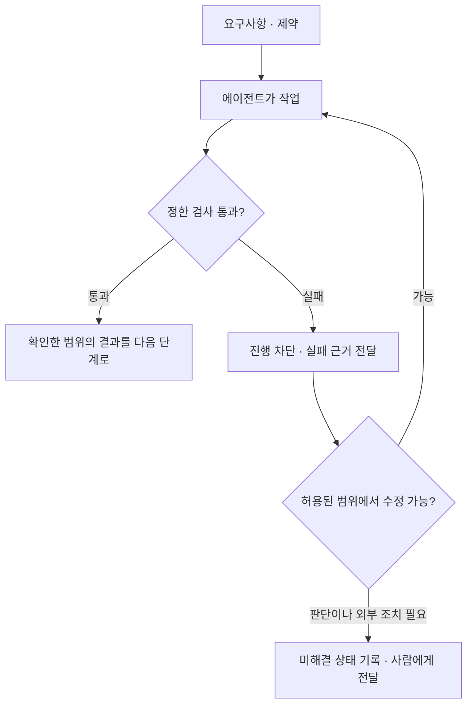
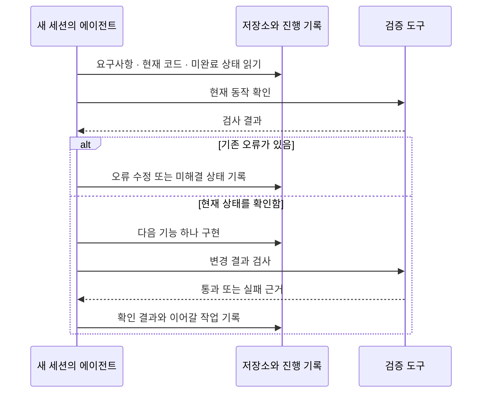

## TL;DR

- 하네스는 컨텍스트·도구·검증을 연결하는 실행 환경이다.
- 짧은 검증과 재시도는 오류가 누적되는 것을 줄인다.
- 반복해서 사람이 확인하는 조건 하나부터 자동화한다.

## 시작하며

이전 글에서는 요구사항과 코드 사이의 계획·상태 관리를 에이전트에 맡기는 흐름[^1]과, 코드 자체가 업무 의도를 설명해야 하는 이유[^2]를 이야기했다.

그런데 에이전트가 필요한 맥락을 읽을 수 있다고 해서 그 기준을 항상 지키는 것은 아니다. 아키텍처 제약을 문서에 적어도 어기는 코드가 나올 수 있고, 테스트를 실행하라는 지시가 있어도 결과를 확인하지 않고 작업을 끝낼 수 있다.

작업이 길어지면 문제는 더 커진다. 에이전트가 한 번에 읽을 수 있는 정보량, 즉 컨텍스트 윈도우를 넘어 다음 세션으로 이어갈 때는 이전 오류와 미완료 상태도 전달해야 한다.

그래서 중간 과정을 더 맡기려면 **에이전트가 결과를 확인하고 실패에 대응할 환경**도 필요하다. Anthropic의 장기 실행 에이전트 사례[^6], Mitchell Hashimoto의 작업 방식[^3], OpenAI의 내부 실험[^4]을 보며 이런 환경을 만드는 하네스 엔지니어링에 관심이 생겼다.

## 1. 하네스는 정보를 행동과 검증에 연결한다

하네스(harness)는 원래 말에 씌우는 마구를 뜻한다. AI 에이전트에서는 모델에 정보를 제공하고, 도구를 실행하게 하고, 그 결과를 다음 판단으로 돌려주는 실행 환경을 가리킨다.

에이전트를 **컨텍스트 + 대규모 언어 모델(LLM) + 도구**로 보면, 모델을 직접 학습시키지 않는 개발자가 주로 조정할 대상은 컨텍스트와 도구, 그리고 둘을 연결하는 흐름이다. 모델을 선택하는 일과 선택한 모델이 일할 환경을 만드는 일은 구분할 수 있다.

이 환경에서 알아둘 장치는 피드백 루프와 가드레일이다.

### 피드백 루프와 가드레일

**피드백 루프**는 결과를 검사하고, 실패한 조건을 에이전트에 돌려주어 수정과 재검사를 이어가는 흐름이다. 사람이 매번 “이 테스트가 실패했으니 고쳐”라고 말하던 부분을 환경에 넣는다.

**가드레일**은 규칙을 어겼을 때 다음 행동을 막는 장치다. 린터가 오류를 출력하는 것과, 그 오류가 있으면 커밋을 막는 것은 다르다. 여기서는 검사 실패를 실제 차단에 연결한 경우를 가드레일로 부르겠다.

같은 린터나 테스트도 어떻게 연결하느냐에 따라 두 역할을 함께 할 수 있다. 실패 결과는 수정의 근거가 되고, 통과 전에는 다음 단계로 넘어가지 못하게 한다.



```mermaid
flowchart TB
    R["요구사항 · 제약"] --> A["에이전트가 작업"]
    A --> C{"정한 검사 통과?"}
    C -->|통과| D["확인한 범위의 결과를 다음 단계로"]
    C -->|실패| B["진행 차단 · 실패 근거 전달"]
    B --> F{"허용된 범위에서 수정 가능?"}
    F -->|가능| A
    F -->|판단이나 외부 조치 필요| S["미해결 상태 기록 · 사람에게 전달"]
```


검사를 통과했다는 것은 그 검사가 다룬 조건을 만족했다는 뜻이다. 모든 요구사항이 자동으로 확인되는 것은 아니다. 모델이 고른 수정안도 매번 같지는 않으므로, 재시도만 반복하면 반드시 성공한다고 볼 수는 없다.

## 2. 컨텍스트를 잘 주는 일과 결과를 확인하는 일

컨텍스트 엔지니어링은 에이전트가 판단할 정보를 고르고 관리하는 일이다. 요구사항과 설계 이유, `CLAUDE.md`의 지침, 검색한 문서, 현재 코드와 테스트 결과가 모두 판단에 쓰인다. 작업 전에 한 번 제공하고 끝나는 정보만을 뜻하지 않는다.

하네스는 이런 정보를 도구 실행과 검증에 연결한다. 예를 들어 “주문 모듈이 결제 모듈의 내부 구현을 직접 참조하지 않는다”는 아키텍처 규칙을 문서에 남기면 에이전트가 읽을 기준이 된다. 이 의존성을 검사하고 위반 결과를 수정 작업으로 돌려주면 기준을 실행 중에도 확인할 수 있다.

등산에 비유하면 컨텍스트는 지도와 현재 위치이고, 검증과 복구 장치는 잘못 들어선 길을 확인하고 돌아오게 하는 수단이다. 현재 위치가 바뀌면 지도를 다시 보듯 검증 결과도 다음 판단의 컨텍스트로 들어간다.

따라서 둘은 서로 배타적인 기술이 아니다. 나는 정보와 도구, 검증을 연결한 환경 전체를 넓은 의미의 하네스로 이해한다. 나중에 읽은 Birgitta Böckeler의 글도 작업 전 지침과 작업 후 검사를 함께 다루며, 사용자 하네스를 컨텍스트 엔지니어링의 한 형태로 설명한다.[^5]

이 관계를 보면 사람이 넘겨줄 일도 구체적이다. 오래 유지할 요구사항과 제약을 정리하고, 에이전트가 구현하게 하고, 반복해서 확인하는 조건을 검사로 옮긴다. 자동화하기 어려운 정책 판단이나 확인하지 못한 결과는 사람의 판단으로 남긴다.

## 3. 오류가 쌓이기 전에 확인한다

결과를 마지막에 한 번만 보면 처음의 잘못된 가정 위에 여러 변경이 쌓일 수 있다.

예를 들어 에이전트가 주문 모듈에서 결제 모듈의 내부 구현을 직접 호출했다고 하자. 그 관계를 그대로 둔 채 취소와 환불 기능까지 추가하면, 나중에 의존성을 바로잡을 때 여러 기능을 함께 고쳐야 할 수 있다.

처음 위반이 생겼을 때 구조 검사로 알려주면 에이전트는 그 변경부터 다시 검토할 수 있다. **검사와 수정의 간격을 줄이는 이유는 잘못된 변경 위에 다음 작업을 쌓지 않게 하기 위해서다.**

| 확인할 조건 | 실행할 검사 | 실패 후 할 일 |
| --- | --- | --- |
| 코드 스타일과 타입 | 린터·타입 검사 | 위반 위치를 수정한 뒤 같은 검사 실행 |
| 요구사항에 따른 동작 | 자동 테스트 | 실패 조건과 구현을 비교해 수정 |
| 모듈 간 의존 규칙 | 구조 검사 | 잘못 연결된 책임과 참조 수정 |

CI, 즉 코드 변경 때 검사를 자동 실행하는 환경에서도 같은 기준을 확인할 수 있다. 다만 CI가 실패했다는 알림만 보내고 끝내면 수정까지 자동화된 것은 아니다. 에이전트가 그 결과를 읽고 후속 작업을 하도록 연결해야 한다.

수정할 근거가 없거나 사람의 정책 판단이 필요한 실패라면 그 상태를 남기고 넘겨야 한다. 실패를 통과로 바꾸거나 검사 조건을 느슨하게 만드는 것으로 작업을 끝내서는 안 된다.

### 세션이 바뀌어도 확인을 이어간다

Anthropic의 사례는 긴 작업을 여러 세션으로 이어갈 때 생기는 문제를 다룬다. 초기화 에이전트가 기능 목록과 실행 환경을 준비하고, 코딩 에이전트가 한 번에 하나의 기능을 구현한다. 진행 기록과 Git 이력으로 다음 세션이 이전 작업을 파악하고, 새 작업 전에 현재 동작부터 확인한다.[^6]



```mermaid
sequenceDiagram
    participant N as 새 세션의 에이전트
    participant R as 저장소와 진행 기록
    participant T as 검증 도구
    N->>R: 요구사항 · 현재 코드 · 미완료 상태 읽기
    N->>T: 현재 동작 확인
    T-->>N: 검사 결과
    alt 기존 오류가 있음
        N->>R: 오류 수정 또는 미해결 상태 기록
    else 현재 상태를 확인함
        N->>R: 다음 기능 하나 구현
        N->>T: 변경 결과 검사
        T-->>N: 통과 또는 실패 근거
        N->>R: 확인 결과와 이어갈 작업 기록
    end
```


앞서 말한 짧은 피드백을 세션 사이에도 이어주는 방식이다. 진행 기록은 현재 코드를 대신하는 요약이 아니라, 다음 세션이 무엇을 확인하고 어디서 이어갈지 알려주는 정보가 된다.

## 4. 반복되는 확인을 실행 환경으로 옮긴다

OpenAI는 2026년 2월, 소규모 팀이 5개월간 Codex로 내부 베타 제품을 만든 실험을 공개했다. 사람이 직접 코드를 작성하지 않은 약 백만 줄의 저장소에는 애플리케이션뿐 아니라 테스트, 인프라, 도구와 문서도 포함됐다.[^4]

엔지니어들은 목표를 정하고 결과를 판단하면서 에이전트가 일할 환경을 설계했다. 코드베이스의 지식과 실행 중 얻는 정보를 제공하고, 커스텀 린터와 구조적 테스트로 제약을 검사하고, 문서와 코드의 불일치를 주기적으로 정리했다.

내가 이 사례에서 참고하려는 것은 저장소의 크기보다 사람이 하던 확인을 환경으로 옮긴 방식이다. Mitchell Hashimoto도 같은 실수를 반복하지 않도록 지침과 도구를 개선하는 일을 하네스 엔지니어링으로 설명한다.[^3]

실무에서는 반복해서 사람이 확인하는 조건 하나를 고르는 것부터 시작할 수 있다. 스타일이면 린터에, 동작이면 테스트에 넣고, 에이전트가 실패 결과를 읽어 수정한 뒤 다시 확인하게 한다. 문서로만 알려주던 제약을 어디까지 검사로 확인할 수 있는지 늘려가는 것이다.

그렇게 보면 프롬프트, 컨텍스트, 하네스에 대한 관심은 이어져 있다. 지시문을 다듬다가 필요한 정보 전체를 관리하게 되고, 오래 일하게 할수록 도구 실행과 결과 확인, 다음 세션으로의 인계까지 설계하게 된다.

## 마치며

나는 요구사항과 코드 사이의 과정을 에이전트에게 더 많이 맡기고 싶다. 그러려면 무엇을 만들지 설명하는 것과 함께, 어떻게 결과를 확인하고 실패를 처리할지도 준비해야 한다.

하네스를 만드는 출발점은 **내가 반복해서 하던 확인 하나를 에이전트의 실행 환경에 넣는 것**이라고 생각한다. 그 검사가 무엇을 확인하는지, 실패하면 어디로 돌아가는지, 사람의 판단이 필요한 경우는 무엇인지 설명할 수 있어야 다음 작업도 맡길 수 있다.

---

[^1]: [컨텍스트 엔지니어링 — 요구사항과 코드 사이를 에이전트에 맡기기](/2026/03/11/context-engineering-static-vs-dynamic.html)
[^2]: [에이전트가 읽을 좋은 코드 — 비즈니스를 외치는 코드](/2026/03/13/agentic-dev-business-aligned-code.html)
[^3]: [Mitchell Hashimoto - My AI Adoption Journey](https://mitchellh.com/writing/my-ai-adoption-journey) (2026.02.05)
[^4]: [OpenAI - Harness engineering: leveraging Codex in an agent-first world](https://openai.com/index/harness-engineering/) (2026.02.11)
[^5]: Birgitta Böckeler, [Harness engineering for coding agent users](https://martinfowler.com/articles/harness-engineering.html) (2026.04.02). 최초 발행 후 보완하며 추가한 참고 글.
[^6]: [Anthropic - Effective harnesses for long-running agents](https://www.anthropic.com/engineering/effective-harnesses-for-long-running-agents) (2025.11.26)
