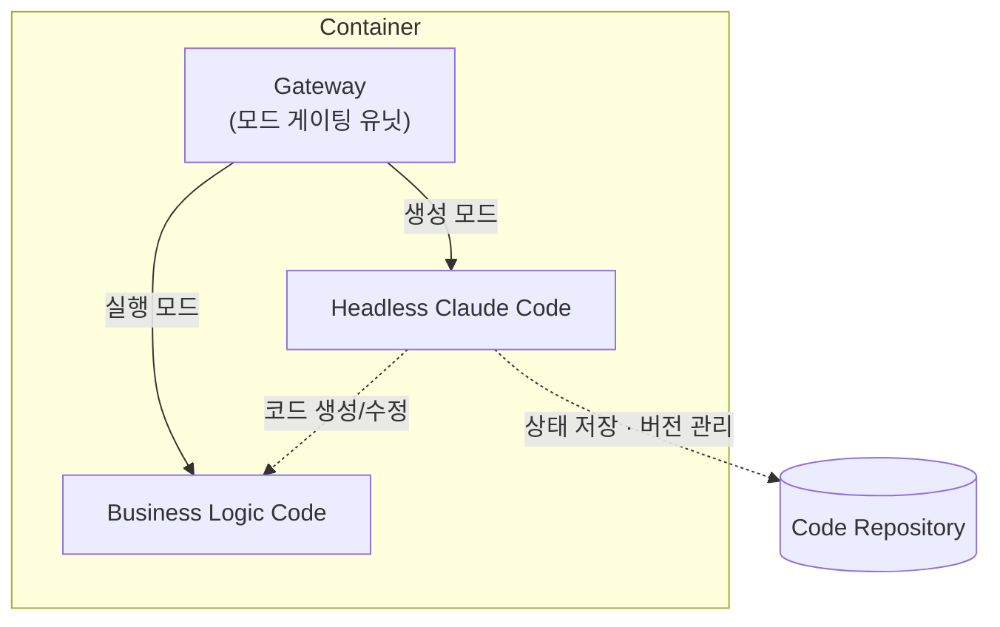

## TL;DR

- 소프트웨어 개발의 목적은 결국 **비즈니스 요구사항을 코드로 전환**하는 것이고, VM→컨테이너→서버리스의 흐름은 그 목적에서 멀어지는 인프라 레이어를 계속 추상화해온 결과다.
- 에이전틱 개발의 이상적인 다음 단계는 에이전트가 만든 코드를 배포하는 것이 아니라, **에이전트 자체가 런타임에서 비즈니스 로직을 직접 서빙**하는 것이다.
- 토큰 비용과 비결정성 때문에 당장은 그 이상형이 어렵기 때문에, **생성 모드와 실행 모드를 게이트로 분리**하는 현실적 타협안으로 시작한다. 이 구조를 그대로 확장하면 사용자별 모듈을 동적으로 생성하는 **초개인화**까지 이어진다.

## 시작하며

이전 글에서 하네스 엔지니어링[^1]과 하네스 없는 멀티 에이전트[^2]에 대해 이야기한 적이 있다. 이 두 글을 쓰면서 계속 머릿속을 맴돌던 질문이 하나 있었다. **우리는 결국 어디로 가고 있는가?**

소프트웨어 개발을 오래 하다 보면, 기술의 이름은 바뀌어도 방향성은 놀랍도록 일관되다는 것을 느낀다. 그 방향성을 한 문장으로 정리하면 이렇게 된다. **비즈니스 요구사항을 코드로 전환하는 과정에서 사람의 개입을 최대한 줄이는 것.** VM이 컨테이너가 되고, 컨테이너가 서버리스가 된 것도 이 흐름 위에 있었다. 그리고 지금 우리가 보고 있는 에이전틱 개발의 흐름 역시, 결국 같은 방향의 다음 장면이다.

최근 Anthropic이 Managed Agents[^3]를 공개하면서, 내가 막연히 그려오던 그림이 조금 더 구체적으로 보이기 시작했다. 이 글은 그 그림에 대한 이야기다.

## 1. 소프트웨어 개발의 본질적 목적

소프트웨어 개발의 목적은 복잡해 보이지만 사실 단순하다. **비즈니스 요구사항을 실행 가능한 코드로 전환하는 것**이다.

이 일을 하기 위해 작게는 기획자, 개발자, 디자이너, 운영자가 필요하고, 크게는 대규모 팀이 필요하다. 그리고 지난 수십 년간 이 프로세스에서 사람의 개입을 줄이기 위한 모든 기술이 만들어져 왔다.

**VM에서 컨테이너, 컨테이너에서 서버리스로 이어진 흐름**을 보자. 표면적으로는 배포 방식의 진화처럼 보이지만, 본질은 다르다. 인프라에 가까운 레이어일수록 비즈니스 요구사항과는 무관한 일이다. OS를 관리하고, 네트워크를 세팅하고, 스케일링을 걱정하는 시간은 비즈니스 요구사항을 코드로 바꾸는 시간이 아니다.

그래서 업계는 이 비-비즈니스 레이어들을 계속 추상화해왔다. VM이 OS를 숨겼고, 컨테이너가 런타임 환경을 표준화했고, 서버리스가 서버 관리 자체를 없앴다. 매 단계마다 사람은 본질에 더 가까이 다가갔다. **추상화의 방향성은 언제나 "비즈니스 요구사항을 코드로 바꾸는 일에만 집중할 수 있는 환경"으로 향했다.**

## 2. 에이전틱 개발과 하네스

에이전틱 개발은 이 흐름의 자연스러운 연장선이다. 개발이라는 행위 자체에서도 사람을 줄여나가는 단계다.

이전 글[^1]에서 다뤘듯이, 에이전트가 안정적으로 동작하려면 **하네스**가 필요하다. 린터, CI, 구조적 테스트, 재시도 루프, 권한 제어 같은 것들이 에이전트 바깥에서 짧은 주기마다 오류를 복구해주지 않으면, 긴 태스크를 완주할 수 없다.

여기서 한 가지 분명해진 사실이 있다. **에이전트를 직접 만들든, 에이전트를 이용해 코드를 만들든, 결국 하네스를 바닥부터 쌓아야 한다는 것.** 하네스 없이 프롬프트만 잘 쓴다고 에이전트가 프로덕션 수준의 코드를 꾸준히 만들어내지는 않는다. 이건 OpenAI와 Anthropic이 각자의 실험에서 이미 보여준 것이다.

그런데 여기서 현실적인 질문이 생긴다. **그 누구도 에이전트를 바닥부터 만들고 싶지 않다.** 비즈니스 요구사항을 코드로 바꾸는 일에 집중하고 싶지, 린터와 CI와 복구 루프와 권한 체계를 바닥부터 조립하고 싶지 않다. 그것은 다시 서버를 관리하고 컨테이너를 오케스트레이션하던 시절로 돌아가는 일이다.

그리고 다행히도, **비즈니스 요구사항을 코드로 전환하는 목적에 최적화된 하네스를 이미 충분히 갖춘 에이전트가 존재한다.** 클로드 코드(Claude Code)나 코덱스(Codex) 같은 도구들이다. 이 도구들은 오랜 시간 프로덕션 수준의 코드 생성을 목표로 하네스가 다듬어져 왔다. 새로 만드는 것보다 이 위에서 시작하는 편이 본질에 가깝다.

## 3. 에이전트 자체를 배포한다는 아이디어

여기서 생각을 조금 더 밀어붙여 보자. **에이전트가 만든 코드를 배포하는 것**과 **에이전트 자체를 배포하는 것**은 다른 이야기다.

지금까지의 워크플로우는 이렇다. 에이전트가 내 로컬이나 CI 환경에서 코드를 만든다 → 그 코드를 컨테이너로 패키징한다 → 배포 파이프라인을 태운다 → 런타임에서 그 코드가 요청을 처리한다. 에이전트는 빌드 타임에만 존재하고, 런타임에는 사라진다.

그런데 생각해보면, 이 구조는 꽤 어색하다. **에이전트가 비즈니스 로직을 이해하고 코드로 만들어낼 수 있다면, 왜 굳이 그 결과물만 서빙해야 하는가?** 가장 이상적인 그림은 에이전트 자체를 런타임에 올려놓고, 요청이 들어올 때마다 에이전트가 비즈니스 로직을 직접 해석하며 응답하는 것이다. 이것이 진짜 "에이전트가 곧 앱 엔진"인 상태다.

다만 현실에는 두 가지 장벽이 있다. **토큰 비용**과 **비결정적 실행**이다. 모든 요청을 LLM이 실시간으로 해석하면 호출당 비용이 너무 크고, 같은 입력에 다른 출력이 나올 수 있어 프로덕션 신뢰성을 담보하기 어렵다. 토큰 비용이 사실상 무료에 수렴하고 결정성이 충분히 확보되는 미래가 오기 전까지는, 이 이상형을 그대로 구현할 수 없다.

그래서 현실적인 타협안이 필요하다. **생성과 실행을 분리**하는 것이다. 에이전트는 빌드 타임처럼 동작해서 코드를 만들어두고, 런타임에는 그 코드가 결정론적으로 실행된다. 에이전트 자체를 런타임에 올려두지만, 매 요청마다 LLM을 호출하지는 않는 방식이다.

구조는 단순하다. 헤드리스 클로드 코드(또는 코덱스, Kiro 같은 다른 에이전트)와 비즈니스 로직 코드를 한 컨테이너 안에 묶고, **앞에 게이트 하나를 둔다.** 게이트는 들어오는 요청이 "생성 모드"인지 "실행 모드"인지를 판별한다.

- **생성 모드**: 헤드리스 에이전트에게 자연어로 요구사항을 전달한다. 에이전트는 자신의 하네스를 활용해 코드를 만들고, 린터와 테스트로 검증하고, 최종 산출물을 코드 저장소에 커밋한다.
- **실행 모드**: 생성된 비즈니스 로직 코드가 일반 애플리케이션처럼 요청을 처리한다. 이 경로에서는 LLM이 호출되지 않는다. 결정론적이고 빠르고 저렴하다.

핵심은 이 분리가 **"에이전트=앱 엔진" 이상형에 대한 현실적 타협**이라는 점이다. 토큰 비용이 충분히 내려가고 결정성이 확보되는 날이 오면, 실행 모드가 점점 얇아지다가 결국 사라지고 생성 모드만 남게 될 것이다. 그전까지는 이 하이브리드가 가장 실용적인 형태다.

## 4. 유비쿼터스 개발 환경

이 구조가 실제로 작동한다면, 개발자의 일상은 꽤 달라진다.

**IDE도, 로컬 머신도 필요 없다.** 배포된 클로드 코드 인프라에 직접 비즈니스 요구사항을 전달하면 해당 로직이 반영된 API가 즉시 생성된다. 게이트의 모드 제어를 통해 그 API는 바로 실제 트래픽을 받을 수 있다. 수정도 마찬가지다. "주문 취소 시 환불 정책을 이렇게 바꿔줘"라고 자연어로 전달하면, 에이전트가 해당 코드를 찾아 수정하고, 테스트를 돌리고, 새 상태를 저장한다. 다음 요청부터는 바뀐 로직으로 처리된다.

**어디서든 텍스트만 전달할 수 있으면 비즈니스의 변경과 서빙이 가능해진다.** 스마트폰 채팅창이든, 슬랙이든, 이메일이든. 개발 환경은 물리적 기기를 벗어나 편재(ubiquitous)하게 된다. 이전 글[^4]에서 말한 "비즈니스를 이해하는 개발자의 가치"가 극단까지 밀어붙여진 형태다. 코드를 짜는 손은 사라지고, 비즈니스를 정확히 전달하는 언어만 남는다.

디버깅과 테스트도 별도 환경이 필요하지 않다. **모드만 바꾸면서 코드를 바꿔 테스트하면 되기 때문에**, 비즈니스 로직 관리 엔진을 LLM으로 두고, 결정론적인 부분만 저장된 상태로 고정하는 하이브리드가 자연스럽게 만들어진다. 런타임은 LLM이 만들어낸 로직과 저장된 결정론적 산출물 사이를 오가는 구조다.

이 아이디어가 완전히 새로운 것은 아니다. Anthropic의 Managed Agents[^3]는 에이전트를 호스팅된 인프라 위에서 장기 실행 작업으로 올려두는 방향을 이미 열었다. 내가 말하는 앱 엔진은 그 연장선에서, **에이전트를 개발 도구가 아니라 런타임 구성 요소로 다루는 관점**에 가깝다.

## 5. 확장: 초개인화

이 아이디어를 한 걸음만 더 밀어붙이면 재미있는 곳에 도착한다. **초개인화(hyper-personalization)** 다.

지금까지는 "하나의 비즈니스 로직을 모든 사용자에게 똑같이 적용한다"는 전제 위에서 소프트웨어를 만들어왔다. 공통 코드가 있고, 사용자별 데이터가 그 코드를 거쳐 개인화된 결과를 만든다. 하지만 구조적으로는 모두가 같은 함수를 호출한다.

에이전트가 런타임 구성 요소가 되면 이 전제가 깨진다. **사용자별로 전용 함수나 모듈을 생성해두고, 해당 사용자의 요청이 올 때 그 모듈이 실행되게 할 수 있다.** 같은 엔드포인트라도 사용자 A의 선호와 컨텍스트에 맞춰진 코드가 사용자 A에게, 사용자 B의 것은 사용자 B에게 실행된다.

- 생성 모드가 **"사용자 A의 연말정산 계산 모듈을 세제 혜택 반영해서 만들어줘"** 같은 요구사항을 받아 `handlers/user_a/tax.py` 를 만든다.
- 실행 모드는 요청이 들어올 때 사용자 식별자를 보고 해당 사용자의 모듈을 디스패치한다.
- 사용자가 선호를 바꾸면 자연어로 전달해 모듈만 갱신한다. 다른 사용자 모듈은 그대로다.

기존 A/B 테스트나 피처 플래그는 "정해둔 변주"를 골라주는 것이었다면, 이 방식은 **변주 자체를 런타임에 에이전트가 만들어낸다**. 개인화의 단위가 데이터에서 코드로 한 단계 내려간다. 공통 코어는 결정론적으로 유지하고, 사용자별 얇은 레이어만 에이전트가 생성/갱신하게 하면, 비용과 결정성 문제도 일정 수준 제어할 수 있다.

또 하나 간과하기 쉬운 장점이 있다. **사용자의 컨텍스트가 매 요청마다 프롬프트로 주입되는 것이 아니라, 한 번 코드로 변환되어 모듈에 박힌다**는 점이다. 기존 개인화 방식은 사용자의 선호, 이력, 프로파일을 모델의 컨텍스트 윈도우에 계속 실어 날라야 하고, 사용자당 누적되는 정보가 많아질수록 토큰 비용과 레이턴시가 선형으로 증가한다. 컨텍스트 윈도우 상한에 걸리면 요약이나 생략이 불가피해지면서 개인화 품질도 떨어진다. 반면 컨텍스트를 코드로 변환해 서빙하면, **런타임의 개인화 동작은 사용자 컨텍스트 크기와 무관해진다.** 10년치 이력을 가진 사용자든 방금 가입한 사용자든, 실행 경로에서 소비되는 토큰은 똑같이 0에 가깝다. 비용은 사용자별 모듈을 갱신할 때만, 실제로 개인화 조건이 바뀔 때만 발생한다.

물론 여기도 장벽은 있다. 사용자 수만큼 늘어나는 모듈의 저장과 로딩, 개인별 모듈 품질을 담보하는 하네스 설계, 사용자별 산출물에 대한 거버넌스. 하지만 이 모두가 **"에이전트=앱 엔진"이라는 방향성 위에서 풀어나가야 할 구체적 문제**들이다.

## 6. 이 그림의 전제와 한계

물론 이 그림이 당장 모든 서비스에 맞는 것은 아니다.

**대규모 트래픽과 엄격한 레이턴시 요구사항이 있는 서비스**는 여전히 전통적인 코드 배포 모델이 유리하다. 에이전트가 런타임에서 로직을 해석하는 오버헤드는 아직 크고, 결정론적 성능이 필요한 영역에서는 타협하기 어렵다.

**보안과 감사 추적**도 다시 설계되어야 한다. 자연어로 비즈니스 로직이 실시간으로 바뀐다는 것은, 누가 언제 무엇을 바꿨는지에 대한 기록과 승인 흐름이 기존 CI/CD 이상으로 엄격해야 한다는 뜻이다. 게이트 컨트롤러가 단순한 모드 스위치가 아니라, 사실상의 거버넌스 레이어가 된다.

**하네스의 품질이 그대로 시스템의 품질이 된다.** 앱 엔진이 내놓는 API의 안정성은 결국 헤드리스 에이전트가 얹고 있는 하네스가 얼마나 촘촘한지에 좌우된다. 이 지점에서 하네스 엔지니어링[^1]의 중요성은 오히려 더 커진다. **에이전트가 만든 코드를 배포하던 세상에서는 하네스가 나쁘면 배포 전에 잡을 기회라도 있지만, 에이전트 자체를 배포하는 세상에서는 하네스의 구멍이 곧 프로덕션의 구멍이다.**

## 마치며

VM에서 컨테이너로, 컨테이너에서 서버리스로 내려온 추상화의 흐름은, 결국 **"비즈니스 요구사항을 코드로 바꾸는 일에만 사람이 집중할 수 있는 환경"** 으로 향해왔다. 에이전틱 개발은 그 흐름 안에서, 이제 개발이라는 행위 자체를 추상화하고 있다.

이상적인 미래는 **에이전트 자체가 런타임이 되어 비즈니스 로직을 직접 해석하며 응답하는 세상**이다. 다만 토큰 비용과 비결정성이라는 현실적 제약 때문에, 지금은 생성과 실행을 게이트로 분리하는 타협안에서 출발할 수밖에 없다. 이 타협안이 그대로 사용자별 모듈 생성으로 확장되면 초개인화까지 이어지고, 토큰 비용이 내려가는 만큼 실행 모드는 점점 얇아질 것이다.

아직은 실험적이고, 현실의 제약도 많다. 그러나 VM을 관리하던 시절에 서버리스를 상상하는 일이 공상 같았듯이, 지금 이 그림도 몇 년 뒤에는 평범한 인프라의 기본값이 되어 있을지 모른다. **그 미래가 왔을 때 중요한 것은 여전히 하나다. 비즈니스를 얼마나 잘 이해하고, 그 이해를 얼마나 정확히 언어로 옮길 수 있는가.**

---

[^1]: [쉽게 설명한 하네스 엔지니어링](/2026/03/15/harness-engineering-beyond-context-engineering/)
[^2]: [하네스 없는 멀티 에이전트는 그냥 컨텍스트 엔지니어링이다](/2026/03/31/multi-agent-without-harness-is-just-context-engineering/)
[^3]: [Anthropic - Managed Agents Overview](https://platform.claude.com/docs/en/managed-agents/overview)
[^4]: [에이전틱 개발 시대, 비즈니스를 아는 개발자의 가치](/2026/03/13/agentic-dev-business-aligned-code/)
