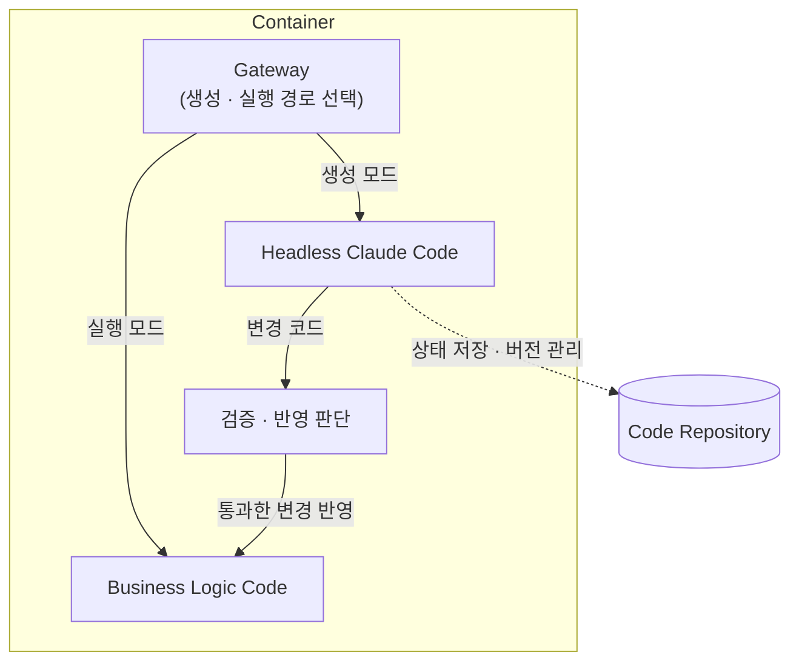

## TL;DR

- 코드 생성과 실행을 한 환경에서 다루는 앱 엔진을 구상한다.
- 생성 모드는 에이전트가, 실행 모드는 검증된 코드가 맡는다.
- 사용자별 모듈을 생성하는 개인화에도 이 구성을 적용해볼 수 있다.

## 시작하며

이전 글에서 하네스 엔지니어링[^1]과 하네스 없는 멀티 에이전트[^2]를 다루면서, 에이전트가 코드를 만든 뒤의 과정이 궁금해졌다.

코드가 완성돼도 패키징과 배포 파이프라인을 거쳐야 사용자가 쓸 수 있다. **코드를 만드는 에이전트와 그 코드를 실행하는 환경을 함께 운영할 수는 없을까?**

최근 Anthropic이 Managed Agents[^3]를 공개하면서, 내가 막연히 그려오던 그림이 조금 더 구체적으로 보이기 시작했다. 이 글은 그 그림에 대한 이야기다.

## 1. 소프트웨어 개발의 본질적 목적

나는 소프트웨어 개발을 **비즈니스 요구사항을 실행 가능한 코드로 전환하는 과정**으로 보고 있다.

이 과정에는 기획, 설계, 구현뿐 아니라 실행 환경을 관리하는 일도 들어간다.

VM, 컨테이너, 서버리스 같은 선택지를 볼 때도 개발자가 직접 관리해야 할 실행 환경을 얼마나 줄일 수 있는지에 관심이 간다. 같은 관점에서 코드 생성 이후의 패키징과 배포도 더 묶어서 다룰 수 있을지 생각해봤다.

## 2. 에이전틱 개발과 하네스

에이전틱 개발은 이 흐름의 자연스러운 연장선이다. 개발이라는 행위 자체에서도 사람을 줄여나가는 단계다.

이전 글[^1]에서 다뤘듯이, 에이전트가 오래 일하게 하려면 실행을 돕고 결과를 확인하는 환경인 **하네스**가 필요하다고 생각한다. 코드 검사와 테스트로 오류를 찾아 모델에게 돌려주고, 다시 시도하게 하며, 실행 권한을 제한하는 식이다. 검사를 붙이는 것만으로 자동 복구되는 것은 아니고, 실패 결과를 읽고 고치는 과정까지 연결해야 한다.

이 실행 환경을 전부 직접 만들기보다, 이미 사용하는 코딩 에이전트 위에서 시작하고 싶다. 클로드 코드(Claude Code)나 코덱스(Codex)에 프로젝트의 테스트와 권한, 복구 절차를 연결하는 방식이다.

## 3. 에이전트 자체를 배포한다는 아이디어

여기서 생각을 조금 더 밀어붙여 보자. **에이전트가 만든 코드를 배포하는 것**과 **에이전트 자체를 배포하는 것**은 다른 이야기다.

지금까지의 워크플로우는 이렇다. 에이전트가 내 로컬이나 CI 환경에서 코드를 만든다 → 그 코드를 컨테이너로 패키징한다 → 배포 파이프라인을 태운다 → 런타임에서 그 코드가 요청을 처리한다. 에이전트는 빌드 타임에만 존재하고, 런타임에는 사라진다.

여기서 더 나아가 에이전트가 런타임에서 비즈니스 로직을 직접 해석하고 요청에 응답하는 모습을 상상해봤다. 코드 생성과 서빙을 모두 에이전트에게 맡기는 구상이다.

다만 요청마다 LLM을 호출하면 **비용과 응답 지연**이 생기고, 같은 입력에도 다른 판단이 나올 수 있다. 이를 감당할 수 있는지는 업무에 따라 다르다. 내가 구상한 일반적인 API 실행 경로에서는 매번 모델의 판단을 다시 받기보다, 검증한 코드를 실행하는 쪽부터 시작하고 싶다.

그래서 **생성과 실행을 분리**한다. 에이전트가 코드를 만들어두고, 요청을 받을 때는 그 코드에 정한 순서와 조건으로 실행한다. 에이전트를 서비스 환경에 함께 올려두지만 매 요청마다 LLM을 호출하지는 않는 방식이다.



```mermaid
flowchart TB
    subgraph C["Container"]
        direction TB
        G["Gateway<br/>(생성 · 실행 경로 선택)"]
        H["Headless Claude Code"]
        B["Business Logic Code"]
        G -- "생성 모드" --> H
        G -- "실행 모드" --> B
        H -- "변경 코드" --> V["검증 · 반영 판단"]
        V -- "통과한 변경 반영" --> B
    end
    R[("Code Repository")]
    H -. "상태 저장 · 버전 관리" .-> R
```


이 구상에서는 대화형 화면 없이 명령으로 실행하는 헤드리스 코딩 에이전트와 비즈니스 로직 코드를 한 컨테이너에 묶는다. **앞에 요청을 분류하는 게이트웨이를 두고**, 들어온 요청을 "생성 모드"와 "실행 모드"로 나눈다.

- **생성 모드**: 헤드리스 에이전트에게 자연어로 요구사항을 전달한다. 에이전트는 자신의 하네스를 활용해 코드를 만들고, 린터와 테스트로 검증하고, 최종 산출물을 코드 저장소에 커밋한다.
- **실행 모드**: 생성된 비즈니스 로직 코드가 일반 애플리케이션처럼 요청을 처리한다. 이 경로에는 LLM 호출 비용과 대기 시간이 없지만, 데이터 조회와 연산 비용은 남는다. 외부 시스템의 응답에 따라 결과가 달라질 수도 있다.

지금 시험해보고 싶은 것은 이 하이브리드 구성이다. 이후 모델이 요청마다 로직을 해석해도 비용과 신뢰성을 만족하는 업무가 생긴다면, 그 업무부터 직접 처리하게 바꿔볼 수 있을 것이다.

이 구조를 실제로 동작하는 코드로 확인하고 싶다면, 헤드리스 클로드 코드를 게이트웨이 뒤에 두고 생성 모드와 실행 모드를 분리한 POC 구현체[^5]를 참고하기 바란다.

## 4. 유비쿼터스 개발 환경

이 구조가 실제로 작동한다면, 개발자의 일상은 꽤 달라진다.

이 구상에서는 개발자가 로컬 IDE를 열지 않고도 배포된 에이전트에 요구사항을 전달해 API를 생성하거나 수정한다. "주문 취소 시 환불 정책을 이렇게 바꿔줘"라고 요청하면, 에이전트가 관련 코드를 찾아 수정하고 테스트한다.

검증과 반영 절차를 거친 변경이 실행 모드에 적용된 뒤부터 새 로직으로 요청을 처리한다.

이 구상에서는 스마트폰 채팅창이나 슬랙처럼 요구사항을 전달할 수 있는 곳에서 변경을 시작할 수 있다. 이전 글[^4]에서 말한 것처럼, 어떤 동작을 원하는지 정확하게 설명하는 일이 중요해진다.

디버깅과 테스트도 호스팅된 환경에서 시작할 수 있다. 다만 생성 중인 코드와 실제 요청을 처리하는 코드를 어떻게 분리하고, 검증된 변경을 언제 반영할지는 별도로 정해야 한다. 모드를 나눈 것만으로 이 경계까지 해결되지는 않는다.

이 아이디어가 완전히 새로운 것은 아니다. Anthropic의 Managed Agents[^3]는 에이전트를 호스팅된 인프라 위에서 장기 실행 작업으로 올려두는 방향을 이미 열었다. 내가 말하는 앱 엔진은 그 연장선에서, **에이전트를 개발 도구가 아니라 런타임 구성 요소로 다루는 관점**에 가깝다.

## 5. 확장: 초개인화

사용자마다 필요한 동작이 다르다면 **사용자별 모듈을 생성하는 개인화**에도 이 구성을 적용해볼 수 있다.

지금까지는 "하나의 비즈니스 로직을 모든 사용자에게 똑같이 적용한다"는 전제 위에서 소프트웨어를 만들어왔다. 공통 코드가 있고, 사용자별 데이터가 그 코드를 거쳐 개인화된 결과를 만든다. 하지만 구조적으로는 모두가 같은 함수를 호출한다.

에이전트가 런타임 구성 요소가 되면 이 전제가 깨진다. **사용자별로 전용 함수나 모듈을 생성해두고, 해당 사용자의 요청이 올 때 그 모듈이 실행되게 할 수 있다.** 같은 엔드포인트라도 사용자 A의 선호와 컨텍스트에 맞춰진 코드가 사용자 A에게, 사용자 B의 것은 사용자 B에게 실행된다.

- 생성 모드가 **"사용자 A의 연말정산 계산 모듈을 세제 혜택 반영해서 만들어줘"** 같은 요구사항을 받아 `handlers/user_a/tax.py` 를 만든다.
- 실행 모드는 요청이 들어올 때 사용자 식별자를 보고 해당 사용자의 모듈을 디스패치한다.
- 사용자가 선호를 바꾸면 자연어로 전달해 모듈만 갱신한다. 다른 사용자 모듈은 그대로다.

기존 A/B 테스트나 피처 플래그는 "정해둔 변주"를 골라주는 것이었다면, 이 방식은 **변주 자체를 런타임에 에이전트가 만들어낸다**. 개인화의 단위가 데이터에서 코드로 한 단계 내려간다. 공통 코어는 결정론적으로 유지하고, 사용자별 얇은 레이어만 에이전트가 생성/갱신하게 하면, 비용과 결정성 문제도 일정 수준 제어할 수 있다.

매 요청마다 사용자 이력을 프롬프트에 넣는 방식과 비교하면, 이 구성에서는 **코드로 옮겨둔 개인화 조건을 실행할 때 LLM을 다시 호출하지 않아도 된다.**

LLM 호출 비용은 모듈을 생성하거나 갱신할 때 들어간다. 실행에 필요한 데이터 조회나 코드의 연산, 모듈 저장과 로딩 비용까지 사라지는 것은 아니다.

사용자 수만큼 늘어나는 모듈을 관리하고, 각 모듈이 공통 규칙을 지키는지 검증하는 비용도 비교해야 한다. 개인화 조건을 데이터로 관리할 때보다 코드 생성이 유리한 업무가 무엇인지가 다음 질문이다.

## 6. 이 그림의 전제와 한계

여기서는 앞서 구분한 두 구상의 제약도 나눠서 봐야 한다.

**매 요청을 모델이 직접 해석하는 구상**에는 LLM 호출 비용과 응답 지연, 결과 검증 문제가 남는다. 트래픽이 크거나 응답 시간이 엄격한 업무에서는 이 비용을 먼저 확인해야 한다.

**생성된 코드를 실행하는 하이브리드 구성**은 실행 경로에서 LLM을 호출하지 않는다. 대신 생성·검증 중인 변경과 현재 서비스 중인 코드를 분리하고, 검증된 변경을 반영하거나 되돌리는 절차가 필요하다.

**보안과 변경 이력**도 설계해야 한다. 누가 어떤 변경을 요청했는지 기록하고, 생성 권한과 실제 서비스 반영 권한을 구분하며, 필요한 승인을 거치게 해야 한다. 요청을 나누는 게이트웨이에도 이 권한과 승인 상태를 확인하는 역할이 필요하다.

앱 엔진에서도 하네스[^1]의 검증을 통과한 코드만 실행 경로에 반영해야 한다. 생성과 서빙을 가까이 두더라도 검증을 건너뛰는 경로가 생기면 운영 중인 API에 결함이 바로 드러날 수 있다.

## 마치며

나는 코드 생성과 실행을 한 환경에서 다루면 요구사항 변경부터 사용자가 결과를 확인하기까지의 과정을 줄일 수 있을지 궁금하다.

당장은 생성 모드에서 만든 코드를 검증한 뒤 실행 모드에 반영하는 구성부터 확인하고 싶다. 사용자별 모듈 생성도 그 경계를 안정적으로 운영할 수 있을 때 넓혀볼 수 있는 실험이다.

---

[^1]: [쉽게 설명한 하네스 엔지니어링](/2026/03/15/harness-engineering-beyond-context-engineering.html)
[^2]: [하네스 없는 멀티 에이전트는 그냥 컨텍스트 엔지니어링](/2026/03/31/multi-agent-without-harness-is-just-context-engineering.html)
[^3]: [Anthropic - Managed Agents Overview](https://platform.claude.com/docs/en/managed-agents/overview)
[^4]: [에이전틱 개발 시대, 비즈니스를 아는 개발자의 가치](/2026/03/13/agentic-dev-business-aligned-code.html)
[^5]: [Agentic App Engine POC - 헤드리스 클로드 코드 기반 생성/실행 모드 분리 데모](https://github.com/haandol/agentic-app-engine-poc)
