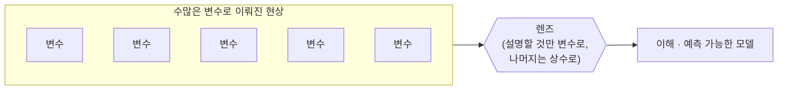
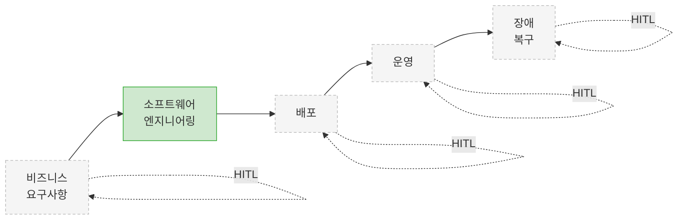
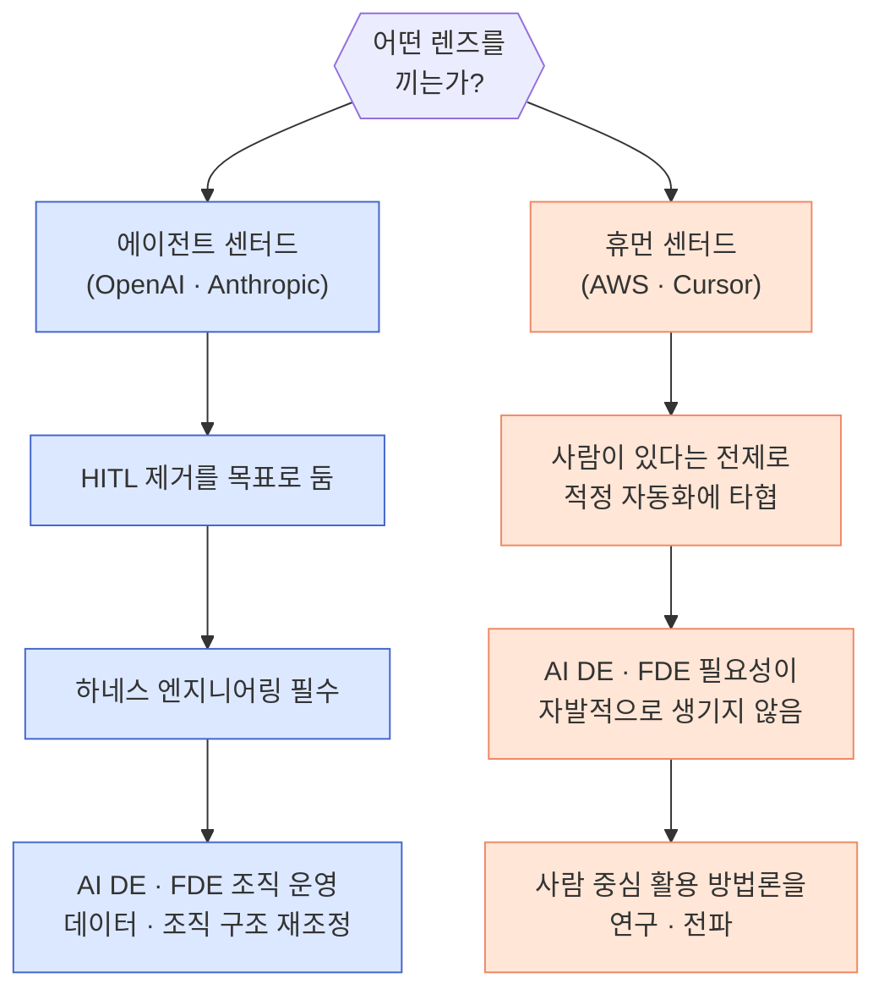

## TL;DR

- 렌즈는 수많은 변수를 의도에 맞게 상수로 고정해 현상을 예측 가능하게 만드는 틀이고, 나는 에이전틱 엔지니어링을 **human in the loop의 제거**라는 렌즈로 본다.

## 1. 렌즈란 무엇인가

경제학에서는 경제 현상을 설명할 때 모델링을 많이 한다. 모델링은 수많은 변수로 이뤄진 대상을 이해할 수 있는 수준으로 끌어내리기 위해, **설명하려는 부분을 제외한 나머지 변수를 전부 상수로 고정하는** 방식이다.

이런 발상은 우리 주변에서도 흔하게 볼 수 있다.

대표적인 예가 MBTI다.

사람을 의사결정 흐름에 대한 4개의 변수, 16가지 값으로 이해하겠다는 발상 덕분에 꽤 오랜 시간 다양한 곳에서 활용되고 있다. 몇 년간 내가 가장 좋아하는 다른 예는 켄트 벡의 3X 모델이다.

모든 비즈니스와 프로덕트를 세 단계(Explore, Expand, Extract)로 나눠 설명하고, 각 단계에 맞는 전략을 찾아 조직을 운영하자고 제안한다.[^5]

이렇게 다양한 변수를 의도에 맞게 재단하여 상수로 바꿔 해석하는 것을, 나는 **렌즈**라고 부른다.





렌즈가 있고 없고는 앞을 예측하는 데 극명한 차이를 만든다.

특히 예측이 틀렸을 때 그다음 예측을 조정하는 데 도움이 된다.
렌즈가 없으면 그냥 찍기밖에 안 되지만, 렌즈가 있으면 **무엇을 상수로 두었는지가 명확하기 때문에 어디서 틀렸는지를 되짚을 수 있다.** 틀린 예측조차 렌즈를 다듬는 재료가 되는 셈이다.

## 2. 에이전틱 엔지니어링을 HITL 렌즈로 보기

하나의 현상을 해석하는 렌즈는 무수히 많고, 최근 핫한 에이전틱 엔지니어링에도 마찬가지로 무수한 렌즈가 있다.  비용으로 보는 렌즈, UX로 보는 렌즈, 생태계 경쟁 구도로 보는 렌즈도 있을 것이다. 

나는 개인적으로 에이전틱 엔지니어링을 볼 때 **HITL 렌즈**를 애용한다. 즉, *모든 에이전틱 엔지니어링은 human in the loop 을 기준으로 (특히 이를 제거하는 방향으로) 해석하겠다*는 관점이다.

다른 렌즈보다 이걸 택한 이유는 단순하다. **지금까지의 발전 과정을 가장 적은 예외로 설명해주고, 앞으로의 방향까지 설명이 쉽기 때문이다.** 특히 Anthropic의 행보가 이 렌즈로 설명할 수 있다고 보기 때문에 좋아한다.[^1]

본 글에서는 이러한 human in the loop를 제거하겠다는 관점을 **에이전트 센터드(agent-centered)**, 그 반대를 **휴먼 센터드(human-centered)**라고 부르겠다.

## 3. HITL 렌즈로 에이전트 멀미 제거하기

최근 사람들이 AI에 대해 보이는 과민 반응은, 휴먼 센터드 관점으로 에이전트 센터드 기술을 해석하면서 생기는 일종의 **멀미** 라고 생각한다.

휴먼 센터드 관점에서는 저렇게 빨리 달려서는 안 된다는 걸 체험적으로 알기 때문에, 나도 모르게 심적으로든 행동으로든 계속 브레이크를 잡게 된다.

하지만 에이전트 기술의 발전 속도가 너무 빠르고 여파도 너무 파괴적이어서 브레이크가 생각대로 동작하지 않으며, 이로 인한 생각의 동기화가 어려워졌기 때문이다.

소프트웨어 개발 라이프 사이클은 비즈니스 요구사항을 코드로 바꾸는, 요컨데 비즈니스 요구사항의 컴파일 과정이다.[^4]

이 과정을 에이전트 센터드 방식으로, 즉 HITL을 제거하는 방향으로 미는 것이 에이전틱 엔지니어링이다. 클로드 코드와 코덱스는 이미 HITL을 상당 부분 걷어낸 방식으로 프로덕트를 개발하고 있고, 그 팀에서 나오는 도구들도 같은 렌즈로 해석할 수 있다.

개인적으로는, 소프트웨어 엔지니어링을 HITL 로 단순화하고 기타 변수들을 의도적으로 무시함으로써, 그 외의 부분들을 노이즈로 볼 수 있게 (혹은 렌즈니깐 흐릿하게) 되며, 이를 통해 멀미도 상당히 완화할 수 있었다.

## 4. HITL 렌즈로 앞으로를 예측해보기

이 렌즈의 또 다른 쓸모는 **예측**에 있다. 지금 프로세스의 어디에 HITL이 남아 있는지를 면밀히 보면, 앞으로 나올 도구와 기술도 어느 정도 짚어볼 수 있다.

비즈니스 요구사항 → 소프트웨어 엔지니어링 → 배포 → 운영 → 장애 복구로 이어지는 긴 흐름을 비즈니스 라이프 사이클이라고 본다면, 현재 에이전틱 엔지니어링은 그 **중간의 소프트웨어 엔지니어링 부분만** 주로 커버하고 있다.

위 그림에서 초록색으로 칠한 소프트웨어 엔지니어링은 HITL이 빠르게 걷히고 있는 구간이고, 나머지 회색 구간에는 여전히 사람이 들어가 있다.

우리의 렌즈에서 다음의 목표는 자연스럽게 그려볼 수 있다. 소프트웨어 엔지니어링의 HITL 제거라는 사명이 어느 정도 완료되면 배포, 운영, 장애 복구로 이어지는 단계의 HITL을 자동화하는 방법론과 도구들이 나올 것이다.

그리고 조금 더 지나면, 지금은 사람으로 시작해서 사람으로 끝나고 있는 **비즈니스 요구사항 분석**까지 자동화하려는 시도가 나올 것이라고 본다.

## 4. 우리 조직은 어떤렌즈를 끼고 있는가?

조직이 현상을 해석하고 앞으로 나가고자 하는 방향성을 렌즈라고 본다면, 조직이 말하는 것이 아니라 행동을 보면 어떤 렌즈로 현상을 해석하고 있는지 알 수 있다.

개인적으로 분류해보면 OpenAI와 Anthropic이 에이전트 센터드 렌즈를 낀 대표 주자이고, Google은 다소 중립, AWS와 Cursor는 휴먼 센터드 렌즈를 낀 대표 주자처럼 보인다.

이 차이는 조직 구조로도 드러나는데, 뒤에서 다시 이야기할 **AI Deployment Engineer(이하 AI DE)**와 **Forward Deployed Engineer(이하 FDE)** 같은 롤의 유무가 대표적인 신호다.





**에이전트 센터드 렌즈**를 낀 회사는 현재 HITL을 어떻게 자동화할지를 고민한다.

자료의 노출이나 조정이 에이전트가 접근하기 어려운 형태라 HITL 제거가 까다롭다면, 어떻게든 에이전트가 중요한 자료에 접근하고 활용할 수 있게 만들려고 최선을 다할 것이다.

이를 위해서는 하네스 엔지니어링이 필수이고, 조직 내 도메인 전문가가 직접 하네스를 만들기 어려운 경우를 위해 AI DE나 FDE 같은 조직도 운영하게 된다.

결국 이런 조직이 있는지 없는지를 보면 그 회사의 방향성을 간접적으로 읽을 수 있다.[^2]

반면 **휴먼 센터드 렌즈**를 낀 조직은 늘 사람이 있다는 전제 위에서 적정 수준의 자동화를 추구한다.

복잡하게 조정하거나 사람과 사람, 조직과 조직 사이의 경계를 허무는 일은 주저하게 되고, 결국 어려운 부분은 "사람이 있으니까"를 전제로 자동화를 타협한다.

해당 렌즈 상에서 중요한 부분엔 사람이 항상 있기 때문에 AI에 대한 기대 수준도 높지 않고, 하네스 엔지니어링도 적정선에서만 필요해서 AI DE나 FDE 같은 롤의 필요성이 자발적으로 생겨나지 않는다.

겉으로 드러나는 신호도 다르다.

휴먼 센터드 회사들은 AI DE·FDE 롤이 없거나, 있어도 에이전트를 통한 업무 자동화가 아니라 그냥 에이전트로 문제를 푸는 데 집중하는 역할에 가깝다. (PoC, MVP 를 빠르게 빌드하는 정도의 롤일 것이다)

하네스 엔지니어링 이야기를 별로 하지 않고, 사람이 중심이 되어 AI를 활용하는 여러 방법론을 연구하고 전파한다.

다르게 말하면, **현재의 AI 수준이 더 발전하지 않거나 선형적으로만 개선된다는 것을 전제로** 전략을 세우고 이야기를 풀어간다.

반면 에이전트 센터드 회사들은 휴먼 센터드 쪽에 거의 관심을 주지 않는다.

이들에게 AI DE·FDE는 하네스 엔지니어링을 통해 조직의 업무를 자동화하는 것이 목표이고, 데이터와 조직 구조를 그 목표에 맞춰 재조정하는 일을 돕는다.

> 여담이지만 FDE는 현재 가장 자기파괴적인 롤이라고 본다. 지금의 SA(Solutions Architect)들이 크게 축소되고 그 자리가 FDE로 대체되다가, 조금 더 지나면 FDE마저 사라지는 그림이 그려진다. 이것도 뇌피셜이지만 풀어놓으면 할 이야기가 많다.

그래서 이 렌즈로 보면 결론은 한쪽으로 기운다.

토큰 가격이 빠르게 하락하고 하네스 엔지니어링의 방법과 도구가 개선되면서 **토큰 가치와 비즈니스 가치의 격차**가 점차 줄어들면, **휴먼 센터드 렌즈는 적어도 에이전틱 엔지니어링 영역에서는 결국 기각될 것**이라고 본다.[^6]

사람이 있다는 전제로 타협해둔 자동화의 상한이, 사람을 빼고 시작한 쪽의 상승 곡선에 따라잡히는 순간이 오기 때문이다.

> 피지컬 AI 회사들도 사실 이런 방식으로 나누는게 어느정도 가능하다.[^3]

## 5. 렌즈를 정했으면, 무엇을 할 것인가

마지막으로, 어떤 렌즈를 골랐다면 그것을 가지고 **무엇을 할 것인지**를 정하고 움직여야 한다.

LLM이 지금 수준에서 발전을 멈춰서 결국 소프트웨어 엔지니어링을 대체하지 못한다면, 나는 무엇을 할 것인가?

> 에이전트가 학계에서 기대하던 AGI에 끝내 도달하지 못할 수도 있다. 하지만 이건 자기 개선을 위한 AI를 만든다는 현재 방향을 고수할 때의 이야기고, 모든 기업이 방향을 틀어 현재 수준의 소프트웨어 엔지니어링 자동화에 데이터를 집중한다면 그 좁은 범위에서는 지금도 사실상 AGI 수준이 가능하다고 본다. 이것도 아티클 하나짜리 주제라 여기서는 접어둔다.

어느 쪽이든 에이전트 기술을 안 배울 수는 없다.

코덱스와 클로드 코드는 이미 현재 기술만으로도 코드의 90~100%를 생성하고 있기 때문이다.

사람이 결국 무엇을 반영할지는 정하겠지만, 중간 과정은 이미 정복되었다고 봐도 무방하다 (토큰이 무한에 가깝다는 전제이긴 하지만, 어차피 하드웨어 발전으로 토큰 비용은 빠르게 개선될 것이다).

반대로 에이전트가 결국 소프트웨어 엔지니어링을 대체할 것이 정해져 있다면, 나는 이제 무엇을 준비할 것인가?

떠오르는 것들과 이미 정해둔 것들이 사람마다 있을 텐데, 이런 상상만으로도 꽤 재미있는 시나리오를 많이 그려볼 수 있다.

어느 쪽이든, **렌즈는 만드는 것 자체가 목적이 아니라 그 렌즈를 통해서 나의 다음 행동을 정하는 것이 목적** 이다.

그러므로 행동의 방향은 각자 정하더라도, 다들 어떤 현상에 대해 자신만의 렌즈 하나쯤은 가졌으면 좋겠다.

## 마치며

렌즈를 깎으면서 어떤 부분은 더 선명하게, 어떤 부분은 의도적으로 흐릿하게 두며 현상을 해석하는 일은 생각보다 재미있다. 현상을 구성하는 변수가 너무나 많기 때문이다.

무엇보다, 그럴듯하게 설명하는 렌즈를 하나 찾으면 스트레스를 덜 받는다. (분봉그래프에 기영이 머리를 얹으며)

우리가 스트레스를 받는 건 대개 **예측이 불가능할 때**인데 (멀미도 그래서 난다), 좋은 렌즈는 그 스트레스에서 어느 정도 자유롭게 해준다.

제어가 불가능한 세상과 흐름에 대해서, 내가 고민할 수 있는 여지를 주며, 이를 통해 다음 행동을 할 수 있는 용기도 준다.

이 글이 결국 하고 싶었던 이야기도 그거다. 정답인 렌즈를 강요하려는 게 아니라, 렌즈를 가진다는 행위 자체가 주는 효용에 대한 이야기.

현재 회사의 안좋은 점은, 다들 관심사나 다루는 고객이 달라서 이런 이야기를 할 사람도 없고, 굳이 내 생각을 정리해서 이야기해도 사실 동의하지 못하는 사람들이 많아서 이야기해도 그냥 피곤하기만 하다.

연말 즈음에는 이직을 하는게 목표인데, 사이드 프로젝트들이 잘 되서 1인 창업을 하거나, 나와 비슷한 렌즈로 세상을 보는 사람들이 많은 회사에서 일해보는 것을 희망하고 있다.

링크드인의 경우에도, 메신저가 메시지보다 중요한 시대를 살고 있어서, 메신저로서의 가치를 올릴 수 있는 방법이 뭐가 있을까 하고 시작했는데, 크게 효과는 없었다. (대문자 I 가 살아남기 힘든 것은 온라인이나 오프라인이나 마찬가지.)

글과 코드가 값싼 시대에 메신저의 가치는 이런 블로그나 링크드인의 글 몇자, 깃허브 코드 몇자에 있지 않고, 그 사람이 만들어낸 족적에 있는 것 같다.

이전까지의 족적은 형편없지만, 앞으로 유의미한 사이드 프로젝트들에 집중하고, 결과를 만들어내는게 이런 글 몇자 쓰는거 보다 더 낫기 때문이다.

---

[^1]: [에이전틱 엔지니어링과 과도기적 기술들](/2026/05/11/direction-of-agentic-engineering/)

[^2]: [에이전트의 다음 진화는 똑똑한 도구에서 온다](/2026/05/27/agent-evolution-smart-edge/)

[^3]: [쉽게 설명한 하네스 엔지니어링](/2026/03/15/harness-engineering-beyond-context-engineering/)

[^4]: [미래의 에이전틱 앱 엔진](/2026/04/17/future-agentic-app-engine/)

[^5]: 켄트 벡, [The Product Development Triathlon](https://medium.com/@kentbeck_7670/the-product-development-triathlon-6464e2763c46) (2016). 3X 모델(Explore, Expand, Extract)의 원본 글이다.

[^6]: [토큰 가치와 비즈니스 가치의 괴리, 그리고 조직의 AI 도입 3단계](/2026/06/15/closing-the-token-value-gap/)