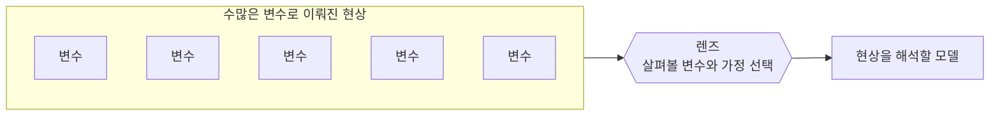
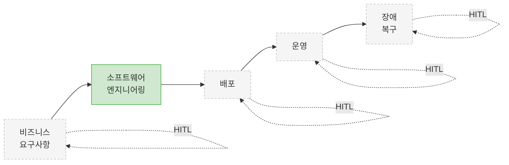
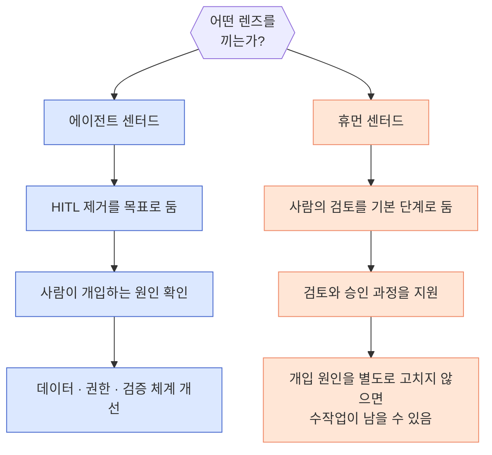

## TL;DR

- 렌즈는 현상을 해석할 때 어떤 변수를 고정했는지 드러낸다.
- 나는 사람의 반복 개입을 제거하는 방향으로 에이전틱 엔지니어링을 본다.

## 1. 렌즈란 무엇인가

경제학에서는 복잡한 현상을 설명하기 위해 모델을 만든다. **어떤 변수와 관계를 살펴볼지 고르고, 나머지는 단순화하거나 일정하다고 가정하는 것**도 그 방법 중 하나다.

이런 발상은 우리 주변에서도 흔하게 볼 수 있다.

대표적인 예가 MBTI다.

MBTI는 네 가지 선호 축의 조합으로 사람을 16개 유형으로 설명한다. 여기서 참고하려는 것은 그 분류의 정확성보다, 복잡한 대상을 몇 가지 축으로 줄여 보는 방식이다. 몇 년간 내가 가장 좋아하는 다른 예는 켄트 벡의 3X 모델이다.

제품 개발을 가능성을 찾는 Explore, 검증한 가능성을 넓히는 Expand, 안정된 제품에서 가치를 얻는 Extract로 나눠 보고, 각 단계에 맞는 전략을 쓰자고 제안한다.[^5]

이렇게 무엇을 자세히 보고 무엇을 단순화할지 정하는 관점을, 나는 **렌즈**라고 부른다.



```mermaid
flowchart LR
    subgraph V["수많은 변수로 이뤄진 현상"]
        v1["변수"]
        v2["변수"]
        v3["변수"]
        v4["변수"]
        v5["변수"]
    end
    V --> LENS{{"렌즈<br/>살펴볼 변수와 가정 선택"}}
    LENS --> P["현상을 해석할 모델"]
```


렌즈가 있고 없고는 앞을 예측하는 데 극명한 차이를 만든다.

특히 예측이 틀렸을 때 그다음 예측을 조정하는 데 도움이 된다.
렌즈가 없으면 그냥 찍기밖에 안 되지만, 렌즈가 있으면 **무엇을 상수로 두었는지가 명확하기 때문에 어디서 틀렸는지를 되짚을 수 있다.** 틀린 예측조차 렌즈를 다듬는 재료가 되는 셈이다.

## 2. 에이전틱 엔지니어링을 HITL 렌즈로 보기

하나의 현상을 해석하는 렌즈는 무수히 많고, 최근 핫한 에이전틱 엔지니어링에도 마찬가지로 무수한 렌즈가 있다.  비용으로 보는 렌즈, UX로 보는 렌즈, 생태계 경쟁 구도로 보는 렌즈도 있을 것이다. 

나는 개인적으로 에이전틱 엔지니어링을 볼 때 **HITL 렌즈**를 애용한다. HITL(human in the loop)은 실행 과정에서 사람이 판단하거나 승인하며 개입하는 것을 뜻한다. 나는 *그 개입이 어디에 남아 있고 어떻게 줄어드는지*를 기준으로 이 흐름을 해석하려 한다.

다른 렌즈보다 이걸 택한 이유는 단순하다. **지금까지의 발전 과정을 가장 적은 예외로 설명해주고, 앞으로의 방향까지 설명이 쉽기 때문이다.** 특히 Anthropic의 행보가 이 렌즈로 설명할 수 있다고 보기 때문에 좋아한다.[^1]

본 글에서는 이러한 human in the loop를 제거하겠다는 관점을 **에이전트 센터드(agent-centered)**, 그 반대를 **휴먼 센터드(human-centered)**라고 부르겠다.

## 3. HITL 렌즈로 에이전트 멀미 제거하기

최근 사람들이 AI에 대해 보이는 과민 반응은, 휴먼 센터드 관점으로 에이전트 센터드 기술을 해석하면서 생기는 일종의 **멀미** 라고 생각한다.

휴먼 센터드 관점에서는 저렇게 빨리 달려서는 안 된다는 걸 체험적으로 알기 때문에, 나도 모르게 심적으로든 행동으로든 계속 브레이크를 잡게 된다.

하지만 에이전트 기술의 발전 속도가 너무 빠르고 여파도 너무 파괴적이어서 브레이크가 생각대로 동작하지 않으며, 이로 인한 생각의 동기화가 어려워졌기 때문이다.

소프트웨어 개발 라이프 사이클은 비즈니스 요구사항을 코드로 바꾸는, 요컨데 비즈니스 요구사항의 컴파일 과정이다.[^4]

나는 이 과정에서 HITL을 줄이는 방향으로 에이전틱 엔지니어링을 해석한다. 실제로 OpenAI는 사람이 코드를 직접 작성하지 않고 Codex로 제품을 만든 내부 실험을 공개했다.[^7] 이런 시도와 그 팀에서 나오는 도구를 같은 렌즈로 살펴볼 수 있다.

개인적으로는, 소프트웨어 엔지니어링을 HITL 로 단순화하고 기타 변수들을 의도적으로 무시함으로써, 그 외의 부분들을 노이즈로 볼 수 있게 (혹은 렌즈니깐 흐릿하게) 되며, 이를 통해 멀미도 상당히 완화할 수 있었다.

## 4. HITL 렌즈로 앞으로를 예측해보기

이 렌즈의 또 다른 쓸모는 **예측**에 있다. 지금 프로세스의 어디에 HITL이 남아 있는지를 면밀히 보면, 앞으로 나올 도구와 기술도 어느 정도 짚어볼 수 있다.

비즈니스 요구사항 → 소프트웨어 엔지니어링 → 배포 → 운영 → 장애 복구로 이어지는 흐름을 놓고 보면, 나는 우선 **코드를 만들고 검증하는 구간**의 변화에 주목해왔다.



```mermaid
flowchart LR
    R["비즈니스<br/>요구사항"] --> E["소프트웨어<br/>엔지니어링"] --> D["배포"] --> O["운영"] --> F["장애<br/>복구"]
    R -. HITL .-> R
    D -. HITL .-> D
    O -. HITL .-> O
    F -. HITL .-> F
    classDef done fill:#cfe8cf,stroke:#3a3;
    classDef todo fill:#f5f5f5,stroke:#bbb,stroke-dasharray:4 3;
    class E done;
    class R,D,O,F todo;
```


초록색은 내가 자동화의 변화에 주목한 구간이며, 사람이 완전히 빠졌다는 표시는 아니다. 회색 구간에도 배포 자동화 같은 기존 도구가 있다. 이 그림에서는 각 구간에 남아 있는 사람의 판단을 다음 질문으로 삼으려 한다.

이 렌즈로 보면 코드 작성뿐 아니라 배포, 운영, 장애 복구에서 사람이 반복하던 판단도 도구에 맡기려는 시도가 늘어날 것이라고 예상한다. 개발 자동화가 끝난 뒤에야 다음 단계가 시작되는 순서일 필요는 없다.

그리고 조금 더 지나면, 지금은 사람으로 시작해서 사람으로 끝나고 있는 **비즈니스 요구사항 분석**까지 자동화하려는 시도가 나올 것이라고 본다.

## 5. 우리 조직은 어떤 렌즈를 끼고 있는가

조직이 현상을 해석하고 앞으로 나가고자 하는 방향성을 렌즈라고 본다면, 조직이 말하는 것이 아니라 행동을 보면 어떤 렌즈로 현상을 해석하고 있는지 알 수 있다.

개인적으로 분류해보면 OpenAI와 Anthropic이 에이전트 센터드 렌즈를 낀 대표 주자이고, Google은 다소 중립, AWS와 Cursor는 휴먼 센터드 렌즈를 낀 대표 주자처럼 보인다.

다만 이것은 내가 접한 제품과 일하는 방식에 대한 인상이다. 같은 회사 안에서도 도구와 방법론에 따라 사람의 개입을 다르게 설계할 수 있으므로, 회사 전체를 고정된 유형으로 분류하려는 기준은 아니다.

이 차이를 살펴볼 때 **AI Deployment Engineer(이하 AI DE)**와 **Forward Deployed Engineer(이하 FDE)**가 어떤 일을 맡는지도 참고할 수 있다. 직함의 유무보다는 데이터와 권한, 업무 절차를 실제로 바꿀 수 있는지 보려 한다.



```mermaid
flowchart TB
    L{{"어떤 렌즈를<br/>끼는가?"}}
    L --> A["에이전트 센터드"]
    L --> H["휴먼 센터드"]
    A --> A1["HITL 제거를 목표로 둠"]
    A1 --> A2["사람이 개입하는 원인 확인"]
    A2 --> A3["데이터 · 권한 · 검증 체계 개선"]
    H --> H1["사람의 검토를 기본 단계로 둠"]
    H1 --> H2["검토와 승인 과정을 지원"]
    H2 --> H3["개입 원인을 별도로 고치지 않으면<br/>수작업이 남을 수 있음"]
    classDef agent fill:#dce8ff,stroke:#46c;
    classDef human fill:#ffe6d6,stroke:#e86;
    class A,A1,A2,A3 agent;
    class H,H1,H2,H3 human;
```


**에이전트 센터드 렌즈**를 낀 회사는 현재 HITL을 어떻게 자동화할지를 고민한다.

사람이 자료를 대신 찾아주고 있다면 데이터 접근을, 권한이 없어 대신 실행하고 있다면 도구와 권한을, 결과를 믿을 수 없어 검토하고 있다면 검증 체계를 고치는 식이다.

도메인 전문가와 AI DE·FDE가 함께 이런 일을 할 수 있다. 나는 이 역할들이 고객의 업무와 시스템을 어디까지 바꾸는지에서 조직의 방향을 읽어보려 한다.[^2]

반면 **휴먼 센터드 렌즈**를 낀 조직은 늘 사람이 있다는 전제 위에서 적정 수준의 자동화를 추구한다.

이 접근에서 주의할 부분은 데이터와 권한 문제가 사람의 검토 뒤에 가려질 수 있다는 점이다. 어려운 건을 사람이 대신 처리하면 당장의 운영은 가능하지만, 같은 이유로 다음 작업에서도 사람이 필요하다.

물론 사람의 검토를 유지하면서 이런 기반을 고칠 수도 있다. 그래서 직함이나 회사 이름만으로 방향을 확정하기보다, **사람이 개입하는 원인을 실제로 없애고 있는지**를 보는 편이 낫다고 생각한다.

> 여담이지만 FDE는 현재 가장 자기파괴적인 롤이라고 본다. 지금의 SA(Solutions Architect)들이 크게 축소되고 그 자리가 FDE로 대체되다가, 조금 더 지나면 FDE마저 사라지는 그림이 그려진다. 이것도 뇌피셜이지만 풀어놓으면 할 이야기가 많다.

그래서 이 렌즈로 보면 결론은 한쪽으로 기운다.

모델 실행 비용이 낮아지고 하네스가 개선되어 **같은 예산으로 더 많은 업무를 끝낼 수 있게 된다면**, **휴먼 센터드 렌즈는 적어도 에이전틱 엔지니어링 영역에서는 결국 기각될 것**이라고 본다.[^6]

사람이 있다는 전제로 타협해둔 자동화의 상한이, 사람을 빼고 시작한 쪽의 상승 곡선에 따라잡히는 순간이 오기 때문이다.

> 피지컬 AI 회사들도 사실 이런 방식으로 나누는게 어느정도 가능하다.[^3]

## 6. 렌즈를 정했으면, 무엇을 할 것인가

마지막으로, 어떤 렌즈를 골랐다면 그것을 가지고 **무엇을 할 것인지**를 정하고 움직여야 한다.

LLM이 지금 수준에서 발전을 멈춰서 결국 소프트웨어 엔지니어링을 대체하지 못한다면, 나는 무엇을 할 것인가?

> 여러 분야의 지적 작업을 수행하는 범용 인공지능, 즉 AGI에 끝내 도달하지 못할 수도 있다. 그래도 소프트웨어 개발이라는 좁은 업무에 데이터와 검증 수단을 집중하면, 그 업무에서는 사람이 하던 일을 상당 부분 자동화할 수 있다고 생각한다. 범용 지능의 달성과 특정 업무의 자동화는 나눠서 보고 싶다.

어느 쪽이든 에이전트 기술을 안 배울 수는 없다.

현재 기술로도 코드 작성을 Agent에게 맡기는 범위가 커지고 있기 때문이다. 앞서 언급한 OpenAI 실험에서도 사람은 목표와 검증 환경을 만들고 결과를 판단하는 일을 맡았다.[^7] 코드 생성 비율이 높다는 사실만으로 설계·검증·운영까지 모두 자동화됐다고 볼 수는 없다.

반대로 에이전트가 결국 소프트웨어 엔지니어링을 대체할 것이 정해져 있다면, 나는 이제 무엇을 준비할 것인가?

떠오르는 것들과 이미 정해둔 것들이 사람마다 있을 텐데, 이런 상상만으로도 꽤 재미있는 시나리오를 많이 그려볼 수 있다.

나도 이 관점을 다음에 배울 기술과 함께 일할 팀을 고르는 기준으로 쓰고 있다.

## 마치며

렌즈를 깎으면서 어떤 부분은 더 선명하게, 어떤 부분은 의도적으로 흐릿하게 두며 현상을 해석하는 일은 생각보다 재미있다. 현상을 구성하는 변수가 너무나 많기 때문이다.

무엇보다, 그럴듯하게 설명하는 렌즈를 하나 찾으면 스트레스를 덜 받는다. (분봉그래프에 기영이 머리를 얹으며)

우리가 스트레스를 받는 건 대개 **예측이 불가능할 때**인데 (멀미도 그래서 난다), 좋은 렌즈는 그 스트레스에서 어느 정도 자유롭게 해준다.

제어가 불가능한 세상과 흐름에 대해서, 내가 고민할 수 있는 여지를 주며, 이를 통해 다음 행동을 할 수 있는 용기도 준다.

현재 회사의 안좋은 점은, 다들 관심사나 다루는 고객이 달라서 이런 이야기를 할 사람도 없고, 굳이 내 생각을 정리해서 이야기해도 사실 동의하지 못하는 사람들이 많아서 이야기해도 그냥 피곤하기만 하다.

연말 즈음에는 이직을 하는게 목표인데, 사이드 프로젝트들이 잘 되서 1인 창업을 하거나, 나와 비슷한 렌즈로 세상을 보는 사람들이 많은 회사에서 일해보는 것을 희망하고 있다.

링크드인의 경우에도, 메신저가 메시지보다 중요한 시대를 살고 있어서, 메신저로서의 가치를 올릴 수 있는 방법이 뭐가 있을까 하고 시작했는데, 크게 효과는 없었다. (대문자 I 가 살아남기 힘든 것은 온라인이나 오프라인이나 마찬가지.)

글과 코드가 값싼 시대에 메신저의 가치는 이런 블로그나 링크드인의 글 몇자, 깃허브 코드 몇자에 있지 않고, 그 사람이 만들어낸 족적에 있는 것 같다.

이전까지의 족적은 형편없지만, 앞으로 유의미한 사이드 프로젝트들에 집중하고, 결과를 만들어내는게 이런 글 몇자 쓰는거 보다 더 낫기 때문이다.

---

[^1]: [에이전틱 엔지니어링과 과도기적 기술들](/2026/05/11/direction-of-agentic-engineering.html)

[^2]: [에이전트의 다음 진화는 똑똑한 도구에서 온다](/2026/05/27/agent-evolution-smart-edge.html)

[^3]: [쉽게 설명한 하네스 엔지니어링](/2026/03/15/harness-engineering-beyond-context-engineering.html)

[^4]: [미래의 에이전틱 앱 엔진](/2026/04/17/future-agentic-app-engine.html)

[^5]: 켄트 벡, [The Product Development Triathlon](https://medium.com/@kentbeck_7670/the-product-development-triathlon-6464e2763c46) (2016). 3X 모델(Explore, Expand, Extract)의 원본 글이다.

[^6]: [조직의 AI 도입 3단계: Stream, Shape, Scale과 단계별 평가법](/2026/06/15/organizational-ai-adoption-3s.html)

[^7]: OpenAI, [Harness engineering: leveraging Codex in an agent-first world](https://openai.com/index/harness-engineering/) — 사람이 직접 코드를 작성하지 않은 내부 제품 개발 실험과, 사람이 맡은 목표 설정·환경 설계·검토를 설명한다.
