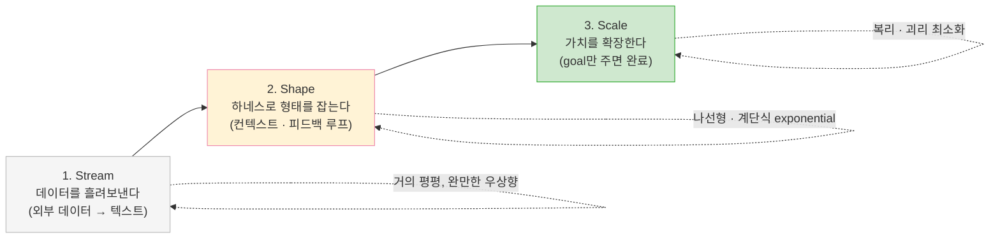

## TL;DR

- 토큰 가격과 토큰당 비즈니스 가치 사이의 괴리를 줄이는 것이 하네스 엔지니어링이고, 조직의 AI 도입은 **Stream → Shape → Scale** 세 단계를 거칠 수밖에 없으며 모든 투자는 마지막 단계에서 복리로 돌아온다.

## 시작하며

요즘 회사들이 AI를 도입하는 모습이나, AI 회사들이 도입을 가이드하는 모습이나, 둘 다 어딘가 향방 없이 흘러가는 경향이 있다.

OpenAI와 Anthropic은 노하우가 있지만 의도적으로 풀지 않는 쪽에 가깝다. 에이전트와 하네스 관점에서는 복제가 너무 쉽기 때문에, 이건 이해가 되는 부분이다. 정작 의문인 쪽은 나머지 회사들이다. 왜 그런 식으로 일하고, 왜 적절히 가이드하지 못하는 걸까.

답을 풀기 위해 먼저 짚어야 할 전제가 하나 있다. **지금 에이전트는 토큰 가격과 토큰당 비즈니스 가치 사이의 괴리가 심하다.** 그리고 이 간극을 줄여주는 것이 바로 하네스(컨텍스트를 포함한) 엔지니어링이다.[^1]

이 전제를 깔고 보면, 향방 없이 흘러가는 AI 도입의 정체가 비교적 또렷하게 보인다.

## 1. AI만 도입하고 "토큰은 알아서 쓰세요"의 함정

하네스 없이 AI만 도입하고 "토큰은 알아서 쓰라"고 던져두면 어떻게 될까. 당연히 모두가 토큰이 부족하고, 모두가 능률이 나지 않는다.

모든 사람이 같은 시행착오를 거치면서 모델을 호출하고, 심지어 같은 시행착오를 **매 세션마다** 반복한다. 어제 누군가 한 번 겪은 시행착오를, 오늘 옆자리 동료가 똑같이 토큰을 태워가며 다시 겪는다. 조직 안에서는 비슷한 일을 개개인이 자주 만나기 때문에, 하네스가 없으면 동일한 작업에 토큰이 과다 소모되는 경향이 구조적으로 개선되지 않는다.

여기서 흔히 빠지는 착각이, 모델이 좋아지면 이 문제가 저절로 풀린다는 기대다. 하지만 **하네스가 제대로 갖춰지지 않으면, 모델이 좋아져도 시행착오 자체가 줄기보다는 시행착오에서 사람이 확인을 한 번 덜 누르는 정도로 바뀔 뿐이다.** 괴리의 본질은 그대로 남는다.

이런 상태에서 AI 도입의 성과를 평가하겠다고 하니, 기가 찰 노릇이다. 평가의 대상은 사람도 모델도 아니라 하네스여야 하는데, 정작 하네스가 없는 상태에서 사람과 모델만 평가하고 있는 셈이다.

## 2. 도입을 설명하는 3단계 렌즈 — 3S

여기서 잠깐 켄트 벡(Kent Beck)의 **3X 모델**[^2]을 빌려오자. 3X는 모든 제품과 비즈니스를 수익 곡선의 모양에 따라 세 단계로 나눈다. 가치 있는 아이디어를 싸고 빠른 실험으로 찾는 **Explore**(곡선이 거의 평평하다), 검증된 아이디어를 폭발적으로 키우는 **Expand**(곡선이 가파르게 치솟는다), 성숙한 제품에서 효율과 수익을 짜내는 **Extract**(곡선이 평탄해진다). 핵심은 **단계마다 곡선이 다르니 엔지니어링 전략도 달라야 한다**는 통찰이다. Explore에서 적절한 것이 Extract에서는 낭비고, 그 반대도 마찬가지다.

나는 에이전틱 프로덕트를 도입하는 과정도 이런 식으로 세 단계로 나눠 본다. 다만 여기서 단계를 가르는 곡선은 수익이 아니라 **토큰 가격과 토큰당 생산하는 비즈니스 가치의 괴리**다. 3X의 결을 빌려, 나는 이걸 **3S — Stream · Shape · Scale**이라고 부른다. 이것이 현재 내가 조직 관점에서 AI를 보는 렌즈다.[^3]

세 단어가 모두 `S-`로 시작하는 건 3X가 `Ex-`로 운율을 맞춘 것을 따라 한 의도적인 장치다. 입에 붙어야 렌즈로 오래 쓰인다.

3X의 곡선을 그대로 빌려, 세로축을 '토큰당 비즈니스 가치'로 바꿔 그리면 3S의 모양도 같은 S자 곡선이 된다. **낮게 출발해 중간에 급격히 오르고 끝에서 완만해지는** 기조는 똑같다. 둘 다 초반은 보상이 안 나오는 선행 투자 구간이고, 후반은 상한에 부딪혀 평탄해지기 때문에 모양이 같을 수밖에 없다. 다만 세 구간 중 두 곳에서 3S만의 차이가 드러난다.

Stream에서 3S는 거의 평평하게 출발한다. 비용만 잔뜩 들고 가치는 좀처럼 드러나지 않지만, 정렬해둔 데이터가 다른 곳에서 조금씩 재활용되기 때문에 아주 완만하게나마 우상향한다.

급상승 구간인 Shape가 가장 큰 차이다. 3X의 Expand가 수요에 올라타 **매끄러운 지수 곡선**으로 치솟는 것과 달리, 3S의 Shape는 **계단을 밟듯 울퉁불퉁하게** 올라온다. 하네스 구축이 나선형이기 때문이다. 컨텍스트와 피드백 루프를 한 바퀴 돌 때마다 한 칸 올라가고, 그 사이에는 다음 칸을 준비하는 정체 구간이 끼어든다. **계단 한 칸 = 나선 한 바퀴**인 셈이다. 뒤에서 다룰 "모델이 좋아져도 하네스가 없으면 시행착오가 줄지 않는다"는 이야기도 결국 이 그림에서 나온다. 하네스가 없으면 계단의 수직 부분(한 칸 올라가는 순간) 없이 수평 부분(정체)만 반복하는 셈이기 때문이다.

마지막으로 Scale에서는 끝없이 치솟는 게 아니라 **'괴리 0'이라는 이론상 상한에 수렴하며 평탄화된다.** 토큰당 가치는 아무리 좋아져도 괴리가 0인 지점을 넘을 수 없기 때문이다(끝없이 불어나는 건 토큰당 효율이 아니라 그 위에 쌓이는 누적 가치 쪽이다).

### 1단계 — Stream (Data Streamlining)

에이전트는 모델이 외부 환경과 소통할 수 있게 해주는 애플리케이션이고, 외부 환경과 소통하는 수단은 도구다. 그런데 외부 환경이라는 건 결국 **텍스트로 변환할 수 있는 데이터**일 뿐이다. 그렇다면 외부의 어떤 데이터든 텍스트로 변환해서 에이전트가 소비할 수 있도록 조율하는 과정이 없으면, 토큰 가격과 비즈니스 가치의 괴리를 줄일 방법 자체가 없다.

이 단계는 지리하고 지루하다. 시간, 돈, 사람, 조직에 들어가는 비용은 큰데 실제 비즈니스 가치는 거의 드러나지 않는다. 특히 엔터프라이즈에서는 조직 간의 경계를 조정하고 허무는 일이 주가 되기 때문에, 단기적으로는 비즈니스 생산성이 정체되거나 오히려 손해처럼 보일 수도 있다.

하지만 한번 구축해두면 다른 조직으로 쉽게 확산되기 때문에 확실한 보상이 따른다. 비용이 앞서 나가고 가치가 뒤늦게 따라오는, 전형적인 선행 투자 구간이다.

### 2단계 — Shape (Harness Engineering)

외부 환경이 준비되면, 이를 기반으로 하네스를 구축하면서 컨텍스트와 피드백 루프를 쌓는다. 흩어진 데이터에 **형태를 잡아주는** 단계다.

이 과정은 직선이 아니라 **나선형**으로 일어난다. 그래서 비즈니스 가치도 직선이 아니라 계단식으로 쌓이고, 장기적인 팀 생산성 관점에서 보면 선형이 아니라 exponential하게 향상된다. 한 칸 올라갈 때마다 다음 칸을 오르는 비용이 줄어들기 때문이다.

### 3단계 — Scale (Value Extracting)

하네스가 충분히 구축된 상태에서는 요구사항 변경이나 기능 개선이 매우 안정적이다. 충분한 가이드가 있고, 참고할 베스트 프랙티스 코드와 하네스가 있기 때문에 에이전트가 웬만해서는 어긋나지 않는다.

이 상태가 되면 거의 **goal만 주어지면** 대부분의 작업이 매끄럽게 완료되고, 사람의 개입도 거의 필요하지 않다. 새로운 요구사항이 들어와도 기존 하네스와 코드를 참조해 맞춤 하네스를 만드는 일이 어렵지 않다. **토큰 가격 대비 비즈니스 가치의 괴리가 최소화되는 단계**다.

앞 두 단계에서 비용으로 쏟아부은 모든 투자는, 이 단계에서 복리 형태로 돌아온다. 그리고 그 혜택은 하네스 위에 구축된 조직원 전체와 회사가 장기적으로 입는다. 괴리가 선형으로 줄어들지 않는 이유도 여기 있다. 하네스를 만들어가는 전 과정에서 도메인 전문가와 AI 전문가가 모두 필요하고, 기술 측면에서는 최신 모델로 많은 토큰을 문제 정의와 해결에 써야 하기 때문에, 중간 구간의 괴리는 오히려 벌어졌다가 마지막에 가서야 급격히 좁혀진다.

## 3. 그렇다면 조직은 어떻게 일해야 하는가

위 렌즈에 동의한 조직이 AI를 도입해야 한다면, 일하는 방식은 어느 정도 정해진다고 본다.

**첫째, 도메인 전문가를 기반으로 Stream(데이터 정렬)을 구축하는 TFT를 만든다.** 이 TF의 역할은 데이터를 안전하게 외부로 노출하는 것, 그리고 향후 다양한 형태의 데이터 노출에 대해 완전히 flexible한 하네스를 만드는 것이다. 가능하면 이 도메인 경계를 기준으로 조직을 재편하는 것이 좋다. 바운디드 컨텍스트가 아니라 도메인을 기준으로 삼는 이유는, 엔터프라이즈에서는 바운디드 컨텍스트와 도메인이 어긋날 가능성이 높기 때문이다.

**둘째, Agentic Harness Engineer(이하 AHE) 조직을 만든다.** 이 조직에는 회사 비즈니스 도메인에 대한 기본적인 이해와, 하네스 엔지니어링의 동작 방식에 대한 깊은 이해가 모두 필요하다. 하네스는 에이전트의 자율성을 목표로 하는데, 최대한의 자율성은 최대한의 커스터마이제이션을 전제한다. 그래서 중앙에서 일괄로 찍어내는 하네스는 개별 조직의 HITL을 충분히 제거하지 못하고, 어정쩡한 부분 자동화에 머물게 만든다.[^4]

다만 이런 엔지니어를 직접 뽑고 운영하는 비용은 대체로 크다. 그래서 현재 OpenAI나 Google은 AI Deployment Engineer(AI DE)나 Forward Deployed Engineer(FDE) 같은 롤을 직접 운영하고 있고, 조직 입장에서는 그 회사의 솔루션을 사는 대신 **이 엔지니어들을 빌려 쓰는 선택지**도 존재한다. 자체 AHE 조직을 키우는 비용과, 외부 엔지니어를 활용하는 비용을 저울질하게 되는 셈이다. 단, 여기에는 큰 함정이 있다. **하네스는 모델과 도구의 동작 방식에 종속적이라 락인이 굉장히 심하다.** 어떤 회사의 엔지니어와 솔루션 위에 하네스를 쌓느냐는 사실상 향후 몇 년의 기술 스택을 고정하는 결정에 가까우므로, 신중하게 선택해야 한다. (이 종속성이 왜 그렇게 강한지는 4번에서 내 경험으로 다시 다룬다.)

**셋째, 각 조직에 도메인 챔피언과 AHE를 짝지어 할당하고, 해당 도메인 워크로드에 특화된 하네스를 구축한다.** 여기서 핵심은 HITL을 정의하고, 그것을 얼마나 제거했는지다. 하네스가 잘 구축되면 더 작은 모델로 전환해서(e.g. Opus → Sonnet) 토큰 효율화까지 달성할 수 있다.

**넷째, 도메인 TFT는 하네스를 기반으로 평가 시스템을 만든다.** 도메인 내 토큰 사용량 대비 비즈니스 가치 생산을 측정하고, 하네스가 새는 곳을 찾아, 그 시그널을 챔피언들에게 전달해 계속 개선해 나가도록 만든다. 앞서 "기가 찰 노릇"이라고 했던 평가는, 바로 이 자리에서야 비로소 의미를 가진다.

## 4. 모델이 좋아진다고 괴리가 저절로 줄지는 않는다

최근 나온 Fable을 충분히 테스트해보진 않았지만, 핵심은 **스스로 판단해서 컨텍스트를 메꾸는 능력이 향상된 것**으로 보인다. 입력된 데이터를 넘어 모델 자체의 성능이나 리즈닝 방식이 급격하게 발전한 것 같지는 않다. 일부 에이전트 벤치마크는 여전히 GPT 5.5가 이기기도 하니까.

이 지점이 내가 줄곧 하고 싶은 이야기, 즉 괴리를 줄이는 건 모델이 아니라 그 위에 쌓인 컨텍스트와 하네스라는 이야기와 맞닿아 있다. 내가 운영하는 [www.encbird.com](https://www.encbird.com)과 [www.pixelbankstudio.com](https://www.pixelbankstudio.com)은 각각 12만 라인, 5만 라인 규모의 코드(코드만 카운팅했을 때)를 가지고 있다. 두 프로젝트를 Claude Sonnet 3.7부터 Opus 4.8까지 같은 코드베이스 위에서 돌려왔는데, **모델이 내가 원하는 코드를 못 만든 적은 지금까지 단 한 번도 없었다.**

모델과 에이전트의 발전을 통해 바뀐 건 두 가지뿐이다. 내가 정확한 컨텍스트를 전달하는 과정이 토큰 효율화되었고, 사람의 개입이 줄었다. 바꿔 말하면, 괴리를 줄인 건 모델의 성능이 아니라 그 위에 쌓아온 컨텍스트와 하네스였다는 뜻이다.

그러니 모델이 좋아지길 기다리며 도입을 미루는 건 번지수가 틀렸다. 모델은 이미 충분히 좋다. 부족한 건 그 모델에 정확한 컨텍스트를 떠먹여 줄 하네스이고, 그건 기다린다고 생기지 않는다. 누군가 Stream을 깔고, Shape에서 하네스를 깎아야 생긴다.

## 5. "아무 모델이나 골라 쓰세요"가 이해되지 않는 이유

같은 맥락에서, 최근 여러 회사가 내놓는 "모델은 여러 개 붙여줄 테니 아무거나 골라 쓰라"는 정책도 나는 잘 이해가 안 된다. 심지어 한 작업을 두 모델로 반반 나눠 쓰라는 경우까지 있다.

앞서 줄곧 말했듯 **현재의 하네스는 모델과 도구에 종속적이다.** 모델마다 컨텍스트를 메꾸는 방식, 도구를 호출하는 습관, 지시를 해석하는 결이 다르기 때문에, 같은 하네스라도 모델이 바뀌면 효율이 무너진다. 그런데 아무 모델이나 쓰라거나, 한 작업을 두 모델로 반반 쓰라는 건 곧 **하네스가 모델에 종속적이라는 사실 자체를 거의 이해하지 못하고 있다는 반증**이라고 본다. 모델을 자유롭게 갈아 끼울 수 있다는 발상은, 하네스가 없거나 있어도 제대로 동작하지 않는 상태에서만 성립한다.

이건 개인 프로젝트에서 내가 직접 겪은 일이기도 하다. 나는 한동안 Cursor에서 Claude Code로 넘어가지 못했는데, 이유는 단순했다. Cursor 기준으로 짜둔 하네스가 Claude Code로 옮기는 순간 전부 망가졌고, 그걸 전환하는 데 시간이 너무 오래 걸렸기 때문이다. 흥미로운 건, **하네스를 Claude Code 기준으로 재구성해봤을 때도 그전까지는 제대로 동작하지 않았다**는 점이다. 결국 Opus가 나오고 나서야 재구성한 하네스가 비로소 돌아갔고, 그제서야 넘어갈 수 있었다. 도구가 바뀌면 하네스를 다시 깎아야 하고, 그 하네스가 도는지는 모델 수준에까지 걸려 있다. 락인이 심하다는 말은 이런 의미다.

그러니 모델 선택은 "여러 개 중 골라 쓰는" 편의의 문제가 아니라, **하네스를 어디에 정착시킬지를 결정하는** 전략의 문제다. 반반 쓰라는 정책은 둘 중 어느 쪽에도 제대로 된 하네스를 쌓지 말라는 말과 다르지 않다.

## 마치며

정리하면 이렇다. 토큰 가격과 비즈니스 가치의 괴리는 실재하고, 그 괴리를 줄이는 것은 모델이 아니라 하네스다. 조직이 이 괴리를 줄이려면 Stream의 지루한 비용 구간을 통과하고, Shape의 나선형 구간을 거쳐, Scale의 복리 구간에 도달해야 한다. 그 전까지의 비용은 손해가 아니라 선행 투자다.

향방 없이 흘러가는 AI 도입의 정체도 결국 이 렌즈로 설명된다. Stream의 비용을 감내하지 못하고, Shape의 하네스를 만들 사람을 두지 않은 채, Scale의 성과만 평가하려 하기 때문이다. "아무 모델이나 골라 쓰라"는 정책도, AHE를 직접 키울지 외부 엔지니어를 빌릴지의 고민도, 결국 하네스가 모델과 도구에 종속적이라는 사실을 받아들이는 데서 출발한다. 순서가 거꾸로면 어느 것도 풀리지 않는다.

OpenAI와 Anthropic이 노하우를 풀지 않는 건 복제가 쉬워서라고 했는데, 사실 풀어줘도 대부분의 조직은 Stream에서 멈출 것이다. 지루하고, 단기 성과가 안 나오고, 조직의 경계를 건드려야 하니까. 그래서 이 글의 결론은 단순하다. **남들이 멈추는 그 지루한 Stream을 통과할 각오가 되어 있는 조직만이, Scale의 복리를 가져간다.**

---

[^1]: [쉽게 설명한 하네스 엔지니어링](/2026/03/15/harness-engineering-beyond-context-engineering/)

[^2]: 켄트 벡의 3X 모델(Explore, Expand, Extract). 모든 비즈니스와 프로덕트를 수익 곡선의 모양에 따라 세 단계로 나누고, 단계마다 곡선이 다르니 엔지니어링 전략도 달라야 한다고 제안한다. 본문의 3S는 이 결을 빌려, 단계를 가르는 곡선을 '수익'에서 '토큰–가치 괴리'로 바꿔 적용한 것이다.

[^3]: [현상을 해석하는 렌즈, 그리고 에이전틱 엔지니어링](/2026/06/12/lens-for-agentic-engineering/)

[^4]: [에이전틱 엔지니어링과 과도기적 기술들](/2026/05/11/direction-of-agentic-engineering/)
