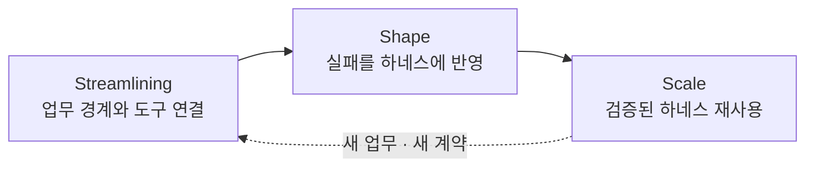

## TL;DR

- 초기 토큰 절감은 하네스 투자를 막을 수 있다.
- 3S는 연결·학습·재사용의 단계를 구분한다.
- 단계마다 투자와 평가 기준이 달라져야 한다.

## 시작하며

조직에서 AI 도입 이야기를 하다 보면 두 요구가 함께 나온다.

구성원에게는 AI를 더 많이 써보라고 한다. 동시에 토큰 사용량과 도구 비용은 빠르게 줄이라고 한다.

둘 다 필요한 요구다. 문제는 순서다.

AI를 업무에 연결하는 초기에는 실패를 많이 보고, 평가 사례와 도구를 만들고, 사람이 반복하던 판단을 규칙으로 옮겨야 한다. 이 과정에는 토큰뿐 아니라 도메인 전문가의 시간과 엔지니어링 비용이 든다.

처음부터 사용량 절감만 목표로 두면 구성원은 하네스를 만드는 대신 눈앞의 작업을 적은 토큰으로 끝내는 쪽을 택하기 쉽다. 개인에게는 합리적이지만 같은 실패가 다음 작업에서도 반복된다.

반대로 제한 없이 실험만 늘리면 리뷰, 재작업과 유지보수 비용이 커진다.

나는 이 사이에서 하나의 예산 원칙을 찾기보다, **현재 워크로드가 어느 단계에 있는지 먼저 구분하는 편이 낫다**고 생각한다.

이 글에서는 그 단계를 `Streamlining`, `Shape`, `Scale`로 나눈다. AHEAD와 LEVER로 각 단계를 평가하는 방법은 [2/2 글](/2026/08/18/measuring-ai-adoption-ahead-lever-part-2.html)에서 이어서 다룬다.

## 1. 토큰은 전체 비용의 일부다

토큰 가격은 바로 보인다.

하지만 비즈니스 요구사항이 고객에게 도달하기까지는 모델 호출 외에도 도구 실행, 재시도, 사람의 검토, 변경한 코드를 자동으로 빌드하고 테스트하는 CI(Continuous Integration), 배포와 장애 대응이 필요하다.

AI가 코드를 빨리 만들수록 리뷰 대기열이 길어질 수도 있다. 구현에서 줄어든 인지부하가 리뷰 시점으로 이동하면 토큰 비용은 낮아 보여도 전체 전달 비용은 줄지 않는다.[^1]

그래서 토큰 사용량을 단독 목표로 두는 것은 위험하다.

같은 품질의 기능을 고객에게 전달하는 데 필요한 전체 투입이 줄었는지를 봐야 한다. [CTS-SW 글](/2026/08/14/cts-sw-software-delivery-cost.html)에서 코드 생성량보다 고객에게 도달한 소프트웨어와 전체 비용을 연결해야 한다고 쓴 이유도 같다.[^2]

다만 도입 초기부터 소프트웨어 한 단위의 전체 전달 비용을 보는 CTS-SW나 단기 투자수익률(ROI)이 좋아질 것이라고 기대하는 것도 맞지 않는다.

데이터와 도구를 연결하고, 실패를 평가와 가드레일로 옮기는 동안에는 비용이 먼저 생긴다. 이 투자가 이후 워크로드에서 재사용되기 전까지 숫자만 보면 비효율처럼 보일 수 있다.

## 2. 하네스를 만들 여유가 필요하다

하네스는 Agent에게 긴 프롬프트를 주는 것보다 넓은 개념이다.

업무에 필요한 데이터와 도구, 품질 기준, 테스트, 권한, 관측성과 예외 처리 방식을 묶어 Agent가 같은 실패를 반복하지 않게 만드는 환경에 가깝다.[^3]

하네스는 한 번에 완성되지 않는다.

Agent가 실패하면 원인을 보고 평가 사례를 추가한다. 리뷰에서 같은 지적이 반복되면 테스트나 아키텍처 규칙으로 옮긴다. 사람이 매번 판단하던 예외가 있다면 지켜야 할 동작과 데이터 형식을 계약으로 정하고, Agent가 처리를 멈추고 사람에게 판단을 요청할 조건을 분명히 한다.

이 과정에서 토큰을 쓴 결과가 다음 실행에도 남아야 한다.

현재 작업 하나를 끝내기 위해 많은 토큰을 쓴 것과, 실패를 재현하고 하네스를 갱신하기 위해 쓴 것은 같은 비용으로 보기 어렵다. 후자는 다음 작업의 검토와 재작업을 줄일 가능성이 있기 때문이다.

아래 그림은 실측 결과가 아니라 이 관계를 표현한 개념도다.

왼쪽에서는 탐색과 검증을 시작할 여유가 부족하다. 오른쪽에서는 비즈니스 목표와 무관한 실험과 유지보수할 결과물이 늘어난다.

어느 지점이 적절한지는 업무의 위험과 복잡도, 현재 하네스의 성숙도에 따라 달라진다. 그래도 초기 투자와 운영 최적화를 같은 기준으로 평가하면 안 된다는 점은 분명하다고 생각한다.

Kiro의 매니저용 가이드에서도 성과가 높았던 팀들은 모델을 익히는 초기에 오히려 느려졌다고 보고한다. 컨텍스트와 도구에 투자하고 일하는 방식을 바꾼 뒤에야 속도가 붙었다는 설명은, 초기 하네스 투자를 당장의 비용 절감만으로 평가하기 어렵다는 생각을 뒷받침한다.[^6]

## 3. 도입 단계를 3S로 나눈다

켄트 벡의 3X 모델은 제품 개발을 Explore, Expand, Extract로 나누고 단계마다 다른 전략이 필요하다고 설명한다.[^4]

이 생각을 AI 도입에 적용해 `Streamlining`, `Shape`, `Scale`이라는 세 단계로 나눠봤다.

3S는 검증된 표준 모델이 아니다. 워크로드의 상태에 따라 투자와 평가 질문을 바꾸기 위한 내가 제안하는 렌즈다.





Streamlining에서는 Agent가 업무를 끝까지 수행할 수 있는 환경을 만든다.

Shape에서는 실제 실패와 리뷰 피드백을 하네스에 반영한다.

Scale에서는 검증된 하네스를 다른 요구사항에 재사용해 전체 전달 비용과 시간을 줄인다.

이 단계는 조직 전체의 단일 성숙도 등급이 아니다.

한 팀 안에서도 주문 취소 자동화는 Scale에 있을 수 있고, 새로 시작한 정산 업무는 Streamlining에 있을 수 있다. 기존 워크로드도 데이터 계약이나 위험 기준이 바뀌면 앞 단계로 돌아간다.

## 4. Streamlining — 업무를 끝까지 수행할 수 있게 연결한다

Streamlining의 출발점은 모델이 아니라 업무다.

예를 들어 주문 취소를 자동화한다고 해보자.

취소 요청은 주문 시스템에 있고, 결제 취소는 결제팀 API를 거치며, 환불 정책은 고객 지원 도구에 있을 수 있다. 팀별 시스템을 그대로 Agent와 외부 도구를 연결하는 규격인 MCP(Model Context Protocol)로 감싸면 Agent는 여러 API 조각을 받지만 어떤 순서와 권한으로 조합해야 하는지는 알기 어렵다.

먼저 주문 취소라는 업무에 필요한 데이터, 규칙, 권한과 책임을 펼쳐봐야 한다.

Event Storming은 업무에서 일어나는 사건을 펼쳐놓고 흐름과 bounded context, 즉 같은 용어와 규칙이 적용되는 범위를 찾는 데 사용할 수 있다.[^5] 조직도와 도메인 경계가 일치한다고 가정하지 않고, 함께 조회되고 변경되어야 할 내용을 확인하는 것이다.

그 다음 필요한 조회와 조작을 명시적인 계약으로 연결한다.

모든 데이터를 하나로 합칠 필요는 없다. Agent가 주문 상태를 확인하고 취소 가능 여부를 판단한 뒤, 허용된 범위에서 환불을 실행할 수 있으면 된다. 최소권한, 감사 기록과 사람에게 넘길 조건도 이때 정한다.

Kiro도 Agent가 참고할 팀 지식을 정리하고 코드를 만들기 전에 완료 조건을 명시하는 것을 팀의 공통 관행으로 설명한다.[^6] 개발자 가이드에서는 파일·도구·네트워크·인증 정보에 대한 접근 제한을 강조한다.[^7] 업무에 필요한 정보와 권한을 먼저 연결해야 한다는 Streamlining의 방향과 맞닿아 있다.

이 단계의 질문은 성과보다 준비 상태에 가깝다.

- 업무의 시작과 완료 조건이 분명한가
- 필요한 데이터와 도구에 접근할 수 있는가
- 권한과 책임 경계가 연결되어 있는가
- 현재 수작업의 시간·품질·비용 기준선이 있는가

이 조건이 없으면 Shape에서 실패를 관찰해도 모델 문제인지 환경 문제인지 구분하기 어렵다.

## 5. Shape — 반복되는 판단을 하네스로 옮긴다

Shape에서는 연결된 업무를 Agent에게 맡기고 실패를 본다.

처음부터 높은 자율성을 목표로 두기보다, 어떤 판단이 반복되고 어디에서 사람이 다시 코드를 읽는지 찾는다.

리뷰에서 같은 import 방향을 계속 지적한다면 아키텍처 테스트로 옮긴다. 같은 요구사항을 매번 확인한다면 계약과 테스트 케이스로 만든다. 증거가 부족해 사람이 전체 코드를 읽어야 했다면 다음 실행에서 계약별 검증 결과를 남기게 한다.[^1]

Kiro의 빠른 피드백 원칙도 Agent가 직접 테스트하고 실패를 수정할 수 있는 환경에 투자하라고 권한다.[^8] 반복 개입의 원인을 규칙·도구로 옮기라는 지속 개선 원칙까지 함께 보면, Shape에서 말하는 학습이 무엇으로 남아야 하는지 구체적인 근거가 된다.[^9]

내가 생각하는 Shape의 산출물은 자동화율이 아니다.

같은 실패가 다시 나왔을 때 더 빨리 발견하거나, 아예 발생하지 않게 만드는 하네스다. 사람이 맡던 판단을 무조건 없애는 대신 반복 가능한 판단과 고위험 예외를 구분하는 과정이기도 하다.

이 단계에서는 도메인 전문가와 하네스 엔지니어가 함께 일해야 한다.

도메인 전문가는 무엇이 올바른 결과인지, 어떤 예외가 위험한지 정한다. 하네스 엔지니어는 이를 평가 사례, 도구, 계약과 가드레일로 옮긴다. 보안과 법무 판단이 필요한 정책은 해당 조직이 계속 소유한다.

하네스 엔지니어가 영구적으로 모든 도메인에 상주할 필요는 없다.

초기에는 공통 기반과 피드백 순환을 만들고, 도메인팀이 직접 실패를 분류하고 하네스를 고칠 수 있게 되면 다음 워크로드로 이동하는 편이 낫다. 하네스가 조직 역량이 되려면 도메인팀이 운영 책임을 넘겨받아야 한다.

## 6. Scale — 앞선 투자를 다음 요구사항에 재사용한다

Scale에서는 새 요구사항이 들어올 때마다 환경과 평가 기준을 처음부터 만들지 않는다.

검증된 데이터 계약, 외부 시스템 연결 도구, 테스트, 권한 제한과 실행 기록을 재사용한다. Agent가 정상 경로는 정해진 검증까지 마치고, 새 계약이나 확인하지 못한 위험은 사람에게 올릴 수 있어야 한다.

Kiro의 매니저용 가이드도 한 팀에서 실험한 뒤 공통 규칙과 컨텍스트를 조직에 공유하며 확산하는 순서를 제안한다.[^6] 앞선 투자를 다음 업무에 재사용한다는 Scale의 방향을 뒷받침하는 사례로 볼 수 있다. 다만 이것이 내가 제안한 3S 자체의 효과를 검증한 것은 아니다.

이때부터 앞선 투자가 전체 전달 비용의 감소로 이어지는지 볼 수 있다.

코드 생성 시간이 아니라 요구사항이 고객에게 도달하는 시간, 사람의 검토와 대기, 배포와 운영 비용을 함께 본다. CTS-SW 같은 지표는 이 구간에서 같은 팀의 추세를 확인하는 데 사용할 수 있다.[^2]

Scale이 비용 절감만 뜻하는 것은 아니다.

같은 인원으로 더 많은 고객 요구를 처리하거나, 사고 위험을 낮추거나, 이전에는 경제성이 없던 작은 업무를 자동화할 수도 있다. 무엇을 가치로 볼지는 워크로드를 시작할 때 정해야 한다.

모델과 Agent를 바꾸는 결정도 이 단계에서 평가 없이 해서는 안 된다고 생각한다.

나도 Cursor에 맞춰 만든 하네스가 Claude Code에서 그대로 작동하지 않아 한동안 전환하지 못했다. 모델과 도구가 바뀌면 컨텍스트 사용법과 실패 형태도 달라질 수 있다.

공통 자산으로 남길 계약과 평가 사례, 특정 Agent에 맞출 도구를 구분해두면 교체 전후를 같은 기준으로 비교할 수 있다.

Kiro도 새 모델이 나오면 이전 모델의 약점을 보완하려고 만든 규칙과 도구가 여전히 필요한지 다시 보라고 제안한다.[^9] 하네스 재사용과 모델 교체 전후의 평가가 함께 필요하다는 이유다.

## 마치며

AI 도입 초기에는 토큰 사용량이 늘어날 수 있다.

데이터와 도구를 연결하고, 실패를 재현하고, 사람이 반복하던 판단을 하네스로 옮기는 비용이 먼저 들기 때문이다.

그렇다고 초기 투자를 무제한으로 허용하자는 뜻은 아니다.

Streamlining에서는 업무와 기준선을 만들고, Shape에서는 실패가 하네스에 남는지 확인한다. Scale에 들어간 워크로드에서 전체 전달 비용과 비즈니스 성과를 본다.

3S는 조직에 성숙도 점수를 붙이기 위한 모델보다, **지금 이 워크로드에 무엇을 투자하고 무엇을 묻지 말아야 하는지 구분하는 렌즈**에 가깝다.

다음 [2/2 글](/2026/08/18/measuring-ai-adoption-ahead-lever-part-2.html)에서는 Shape의 하네스 학습과 리뷰 부담을 AHEAD로, Scale의 전체 전달 비용과 가치 회수를 LEVER로 어떻게 볼지 정리한다.

---

[^1]: [AI로 코드는 빨리 만들었는데 왜 리뷰는 더 힘들까](/2026/08/18/ai-coding-review-cognitive-load.html) — 구현에서 줄어든 인지부하가 리뷰로 이동하는 문제와 계약 기반 리뷰를 다룬다.

[^2]: [AI 코딩 도구가 정말 개발 비용을 줄였을까](/2026/08/14/cts-sw-software-delivery-cost.html) — 코드 생성량 대신 고객에게 도달한 소프트웨어와 전체 전달 비용을 연결하는 CTS-SW를 설명한다.

[^3]: [쉽게 설명한 하네스 엔지니어링](/2026/03/15/harness-engineering-beyond-context-engineering.html) — 컨텍스트, 도구, 평가와 가드레일을 함께 다루는 하네스의 범위를 설명한다.

[^4]: 켄트 벡(Kent Beck), [The Product Development Triathlon](https://medium.com/@kentbeck_7670/the-product-development-triathlon-6464e2763c46) — 제품 개발을 Explore, Expand, Extract로 나누는 3X 모델.

[^5]: [쉽게 설명한 Event Storming](/2020/12/10/demystifying-event-storming.html) — 실제 업무 흐름에서 도메인 이벤트와 경계를 찾는 방법.

[^6]: Kiro, [Frontier Engineering Teams](https://kiro.dev/topics/frontier-teams/) — 한 팀에서 시작해 실험·확산·지속 운영으로 이어가는 도입 방법. 이 글의 3S와는 별개의 제안이며, 소개된 기간과 성과는 모든 팀의 목표값으로 보지 않는다.

[^7]: Kiro, [Trust the boundaries, not the agent](https://kiro.dev/topics/frontier-engineering/trust-the-boundaries/) — 자율 실행에 필요한 접근 제한과 자동 검사를 설명한다.

[^8]: Kiro, [Give agents a fast feedback loop](https://kiro.dev/topics/frontier-engineering/fast-feedback-loop/) — Agent가 직접 실행할 수 있는 테스트와 검증 환경에 투자할 것을 권한다.

[^9]: Kiro, [Continuously tune your agent setup](https://kiro.dev/topics/frontier-engineering/tune-your-setup/) — 반복 개입에서 개선점을 찾고 모델 교체 시 기존 규칙과 도구를 재평가하는 습관.
