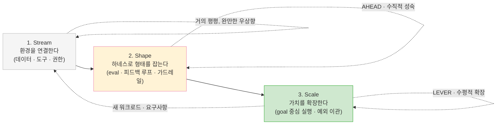
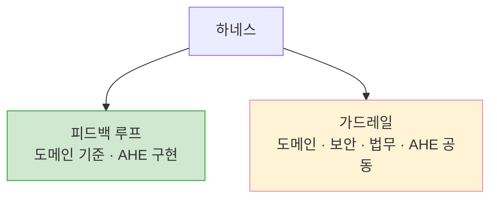
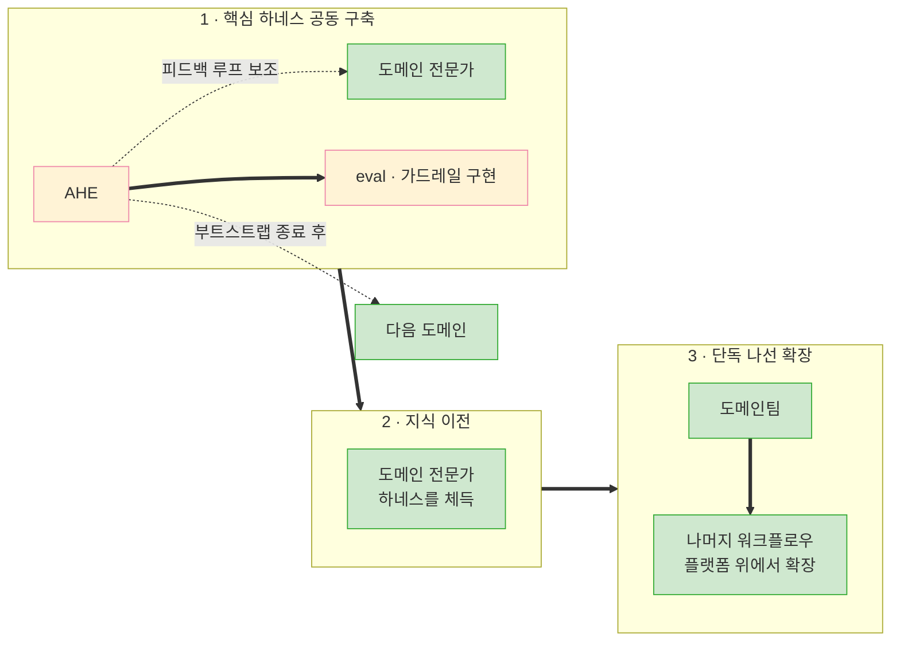

## TL;DR

- 조직의 AI 도입은 **Stream → Shape → Scale**이라는 성숙도 루프로 설명할 수 있으며, 새로운 워크로드와 요구사항이 생기면 앞 단계로 돌아간다.
- Shape에서는 **AHEAD**로 현재 워크플로우의 하네스가 성숙하는지 평가한다.
- Scale에서는 **LEVER**로 그 하네스가 다음 워크로드의 자동화 비용까지 낮추는지 평가한다.

## 시작하며

개인적으로는, 요즘 회사가 AI를 도입하는 방식도, AI 회사가 이를 안내하는 방식도 어딘가 향방 없이 흘러가는 경향이 있다고 생각한다.

OpenAI와 Anthropic을 비롯한 여러 회사가 eval, agent, guardrail, enterprise adoption에 대한 가이드를 꾸준히 공개하고 있다. 다만 데이터 준비부터 하네스 구축, 평가, 조직 확산까지를 하나의 운영 모델로 연결한 설명은 아직 드물다.

그 결과 실제 도입 현장에서는 이 요소들이 서로 연결되지 않은 채 따로 다뤄지는 경우가 있다. 무엇이 이 연결을 어렵게 만드는 걸까.

답을 풀기 위해 먼저 짚어야 할 전제가 하나 있다. **현재 에이전트 사용에서는 토큰 가격이 쉽게 보이지만, 그 토큰이 만든 비즈니스 가치는 측정하기 어렵다.**

그래서 나는 토큰 가격과 추상적인 "생산성"을 바로 비교하기보다, 모델·도구·재시도·지연·사람의 검토까지 포함한 **수용 가능한 결과당 총비용**을 보려 한다. 이 비용을 낮추고 결과의 품질을 안정시키는 것이 바로 컨텍스트까지 포함하는 하네스 엔지니어링이다.[^1][^8]

이 전제를 깔고 보면, AI 도입이 방향을 잡기 어려운 이유를 조금 다르게 해석할 수 있다.

내가 보기에는 워크플로우와 하네스를 대하는 관점의 차이가 그 이유 중 하나다.

## 1. "AI를 쓰세요, 그런데 토큰은 최소로" 사이의 긴장

하네스에 대한 이해 없이 AI만 도입하고 "AI는 쓰되 토큰은 최소로 쓰라"고 던져두면 어떻게 될까?

이 두 요구 사이에는 긴장이 생길 수 있다. **하네스를 구축하는 일 자체가 토큰과 엔지니어링 시간을 먼저 쓰는 작업**이기 때문이다. 하네스는 한 번에 완성되지 않고, 아래 사이클을 반복하며 깎여 나간다. 그리고 이 한 바퀴 한 바퀴마다 모델 비용뿐 아니라 도구 연동, eval, 관측성, 보안과 운영 비용이 함께 들어간다.

토큰 사용량에 강한 압박이 걸리면 구성원은 하네스 구축을 미루고, 적은 토큰으로 눈앞의 단기 작업을 처리하는 쪽을 택할 수 있다. 평가 기준이 단기 사용량을 향해 있다면 개인에게는 합리적인 선택이다.

다만 단기 작업 처리에만 집중하면 **결과당 총비용을 구조적으로 개선하기 어려울 수 있다.** 어제 누군가 겪은 시행착오를 오늘 다른 동료가 비슷하게 반복할 수 있고, 이를 하네스에 반영하지 않으면 동일한 실패와 사람의 재검토가 다시 발생한다.

즉 단기 토큰 사용량만 강조하면, 결과당 비용을 낮추기 위한 하네스 투자가 뒤로 밀릴 수 있다. 개인의 사용량과 함께 조직이 반복하는 시행착오도 비용으로 볼 필요가 있다.

일부 구성원은 자신의 하네스를 만들어 쓴다. 하지만 그 방식을 전파하고 다른 사람의 업무에 맞는 하네스를 다시 만드는 것은 또 다른 일이므로, 개인의 업무 안에 머무르기 쉽다.

코딩 에이전트를 도입하면 여러 문제가 자연스럽게 해결되리라는 기대도 생길 수 있다. 하지만 **하네스가 충분히 갖춰지지 않으면, 모델의 능력이 반복 가능한 업무 성과로 이어지는 데 한계가 있다.**
모델이 할 수 있는 일과 조직이 안정적으로 맡길 수 있는 일 사이에는 여전히 차이가 남을 수 있다.

이런 상태에서 개인의 AI 사용량만으로 도입 성과를 평가하면, 구성원이 그 기준을 납득하기 어려울 수 있다. 그래서 나는 평가 단위를 사람이나 모델 하나보다 **사람·모델·데이터·도구·하네스가 결합된 전체 워크플로우**로 보는 편이 적절하다고 생각한다.

무엇을 어떻게 평가할지 합의하지 않은 채 기존 KPI를 그대로 적용하면 이런 문제가 생길 가능성이 있다. 특히 디자인, 예술, GenAI처럼 결과의 품질이 단일한 숫자로 떨어지지 않는 분야에서는 더 그렇다.

## 2. 도입을 설명하는 3단계 렌즈 — 3S

그럼 어떻게 도입하고 어떻게 평가하는 게 현실적인가?

여기서 잠깐 켄트 벡(Kent Beck)의 **3X 모델**[^2]을 빌려오자.

3X는 모든 제품과 비즈니스를 수익 곡선의 모양에 따라 세 단계로 나눈다. 가치 있는 아이디어를 싸고 빠른 실험으로 찾는 **Explore**(곡선이 거의 평평하다), 검증된 아이디어를 폭발적으로 키우는 **Expand**(곡선이 가파르게 치솟는다), 성숙한 제품에서 효율과 수익을 짜내는 **Extract**(곡선이 평탄해진다).

핵심은 **단계마다 곡선이 다르니 엔지니어링 전략도 달라질 수 있다**는 통찰이다. Explore에서 적절한 방식이 Extract에서는 비효율적일 수 있고, 그 반대도 마찬가지다.

나는 에이전틱 프로덕트를 도입하는 과정도 이런 식으로 세 단계로 나눠 본다.

다만 여기서 단계를 가르는 기준은 수익 곡선이 아니라, **일정한 품질과 위험 기준을 통과한 결과를 얼마나 안정적이고 효율적으로 만드는가**다.

3X의 결을 빌려, 나는 이걸 **3S — Stream · Shape · Scale**이라고 부른다. 이것이 현재 내가 조직 관점에서 AI를 보는 렌즈다.[^3]

3S는 아직 실증된 표준 모델이 아니다. 공개된 연구와 현장 사례가 지지하는 전제 위에서, 워크로드의 성숙도에 따라 투자와 평가 기준이 어떻게 달라져야 하는지를 한 단계 더 밀어붙인 가설이다.





> 세 단어가 모두 `S-`로 시작하는 건 3X가 `Ex-`로 운율을 맞춘 것을 따라 한 의도적인 장치다. 입에 붙어야 렌즈로 오래 쓰인다.

3X의 곡선을 빌려 세로축을 **총운영비용당 수용 가능한 비즈니스 결과**로 바꿔 그리면, 3S도 대략적인 S자 곡선으로 표현할 수 있다.

이 곡선은 실측 결과가 아니라 설명을 위한 개념도다. **낮게 출발해 중간에 계단식으로 개선되고, 운영이 안정되면 완만해지는** 경향을 나타낸다.
초반에는 데이터와 기반에 대한 선행 투자가 크고, 중간에는 실패를 하네스에 반영할 때마다 품질이 개선되며, 후반에는 최적화 여지가 줄어드는 모습을 표현한 것이다.

세로축이 올라간다는 것은 같은 비용으로 더 많은 결과를 만들 수 있다는 뜻이다. 반대로 이 글의 나머지 부분에서 사용하는 **결과당 총비용**은 그 역수이므로 내려간다.

각 구간을 자세히 보면 3S만의 차이가 드러난다.

Stream에서 3S는 거의 평평하게 출발한다. 비용이 먼저 들고 직접적인 가치는 좀처럼 드러나지 않지만, 정리해둔 데이터와 도구가 다른 워크플로우에서 재활용되면 완만하게나마 효율이 오른다.

급상승 구간인 Shape가 가장 큰 차이다.

3X의 Expand가 수요에 올라타 매끄럽게 상승하는 모습이라면, 3S의 Shape는 **계단을 밟듯 울퉁불퉁하게** 올라오는 쪽에 가깝다. 하네스 구축이 실패 관찰과 개선을 반복하는 나선형 과정이기 때문이다.

컨텍스트와 피드백 루프를 한 바퀴 돌 때마다 한 칸 올라가고, 그 사이에는 다음 칸을 준비하는 정체 구간이 끼어든다. **계단 한 칸 = 나선 한 바퀴**인 셈이다.

뒤에서 다룰 "모델이 좋아져도 조직의 시행착오가 자동으로 줄지는 않는다"는 이야기도 이 그림에서 나온다. 관찰한 실패를 하네스에 반영하지 않으면 계단의 수직 부분(한 칸 올라가는 순간)보다 수평 부분(정체)이 길어질 수 있기 때문이다.

마지막으로 Scale에서는 끝없이 치솟는 게 아니라 완만해진다. 품질 기준을 안정적으로 통과하기 시작하면 최적화의 중심이 추가 HITL 제거에서 모델 라우팅, 캐싱, 재시도, 지연과 운영비용으로 이동하기 때문이다. 워크플로우 하나의 효율은 평탄해져도, 검증된 패턴을 다른 워크플로우에 재사용하면서 누적 가치는 계속 쌓일 수 있다.

HITL은 이 곡선을 움직이는 중요한 변수지만, 세로축 자체와 같지는 않다. 사람이 매번 끼어들어 확인하고 고쳐야 하면 결과당 비용과 시간이 늘어난다. 반대로 금융, 의료, 보안처럼 실패 비용이 큰 업무에서는 사람의 승인이 위험을 줄여 전체 비즈니스 가치를 높일 수도 있다.[^10]

따라서 나는 Shape에서 단순한 HITL 제거율보다 **일정한 품질·위험 기준 아래에서 사람의 개입 없이 완료되는 비율**, 사람이 개입해야 할 때 정확히 escalation하는 비율, 그리고 검토에 걸리는 시간을 함께 보려 한다. 여기서 목표는 HITL 0이라는 숫자보다 **불필요한 개입은 줄이고 필요한 통제는 남기는 것**에 가깝다.

### 1단계 — Stream (Data Streamlining)

에이전트는 모델이 외부 환경과 소통할 수 있게 해주는 애플리케이션이고, 외부 환경과 소통하는 수단은 도구다.

외부 환경은 텍스트뿐 아니라 이미지, 음성, 구조화 데이터, 시스템 상태와 실제 행동을 수행하는 API로 구성된다. 중요한 것은 모든 것을 텍스트로 바꾸는 게 아니라, 에이전트가 필요한 순간에 **기계가 처리할 수 있는 관찰과 도구**로 접근할 수 있게 만드는 것이다.

결국 업무에 필요한 데이터, 도구, 권한을 에이전트가 안전하게 사용할 수 있도록 준비하지 않으면 안정적인 비즈니스 결과를 만들기 어렵다.

이 단계는 지난하고 더디다. 시간, 돈, 사람, 조직에 들어가는 비용은 큰데 실제 비즈니스 가치는 거의 드러나지 않는다.

특히 엔터프라이즈에서는 조직 간의 경계를 조정하고 필요한 연결을 만드는 일이 주가 되기 때문에, 단기적으로는 비즈니스 생산성이 정체되거나 오히려 손해처럼 보일 수도 있다.

하지만 잘 구축된 데이터 계약, 권한 체계, connector와 관측성은 다른 워크플로우에서 재사용될 수 있다. 비용이 앞서 나가고 가치가 뒤늦게 따라오는, 전형적인 선행 투자 구간이다.[^5][^8]

어떤 데이터가 필요한지 조사하는 데도 시간이 많이 들어가는데, 특히 사일로가 심화된 엔터프라이즈가 더 그렇다. 그렇다고 모든 데이터를 한꺼번에 개방하면 또 다른 위험이 생긴다. 워크플로우가 결과를 내는 데 필요한 데이터만 최소권한으로 노출하고, 출처·품질·갱신 주기·감사 로그를 함께 관리하는 편이 안전하다.

그래서 이 글에서는 먼저 end-to-end 워크플로우를 파악하고, 그 경계 안에서 필요한 데이터와 도구를 안전하게 연결하는 과정에서 시작한다. DDD의 도메인과 bounded context는 이 경계를 찾는 데 유용한 렌즈가 될 수 있지만, 조직 전체를 같은 경계로 재편하자는 뜻은 아니다.

### 2단계 — Shape (Harness Engineering)

하네스에 필요한 데이터가 준비되면, 이를 기반으로 하네스를 구축하면서 컨텍스트와 피드백 루프를 쌓는다. 흩어진 데이터를 적시에 가져와서 워크플로우를 구축하며 **형태를 잡아주는** 단계다.

이 과정은 직선이 아니라 **나선형**으로 일어난다. 실제 실패를 관찰하고, eval dataset과 가드레일에 반영하고, 다시 실행한다. 개선이 재사용되면 다음 문제를 푸는 비용이 줄어들기 때문에 비즈니스 가치도 계단식으로 축적될 수 있다. OpenAI의 Codex 실험에서도 모델이 아니라 환경이 과소명세된 것이 초기 병목이었고, 엔지니어의 역할은 에이전트가 일할 수 있는 도구·구조·피드백 루프를 만드는 쪽으로 이동했다.[^17]

효율이 선형으로 개선되지 않는 이유도 여기 있다. Shape에서는 실패를 수집하고 데이터와 도구를 연결하는 비용이 먼저 늘어날 수 있다. 그 투자가 재사용 가능한 품질 개선으로 굳어질 때 비로소 결과당 비용이 계단식으로 낮아진다.

도메인 전문가와 AI 전문가(FDE)가 짝을 이뤄 작업하는 방식이 효과적일 수 있다. 내 경험에서는 특히 도메인 지식이 성과를 가르는 경우가 많았다.[^6]
워크플로우의 책임 경계가 안정적이라면, DDD에서 말하는 비즈니스 처리 과정과 하네싱된 AI 워크플로우의 경계를 정렬해볼 수 있다.

Shape의 평가 질문은 **"이 하네스가 잘 구축되고 있는가?"**다. 이를 현재 워크플로우의 수직적 성숙을 보는 **AHEAD**로 구체화할 수 있다.

### 3단계 — Scale (Value Extraction)

하네스가 충분히 구축되고 대표적인 eval에서 품질 기준을 반복해 통과하면, 요구사항 변경이나 기능 개선의 결과를 더 예측하기 쉬워진다. 충분한 가이드와 예제, 도구, 가드레일, 회귀 테스트가 있기 때문이다.

이 상태에서는 저위험·반복 업무의 상당 부분이 goal 중심으로 완료되고, 예외와 고위험 결정만 사람에게 넘길 수 있다. 새로운 요구사항이 들어와도 기존 하네스와 eval을 참조해 맞춤 워크플로우를 만드는 비용이 낮아진다. **수용 가능한 결과당 총비용이 안정적으로 측정되는 단계**다.

그러므로 나는 Scale에서 현재 워크플로우가 잘 도는지를 넘어 **"이제 다음 워크로드를 얼마나 적은 추가 노력으로 자동화할 수 있는가?"**를 묻는다. 이를 다음 워크로드로의 수평적 확장을 보는 **LEVER**로 구체화할 수 있다. 3X의 Extract가 성숙한 제품에서 축적된 투자의 가치를 꺼내는 단계라면, 3S의 Scale은 성숙한 하네스에서 반복 가능한 자동화 역량을 꺼내는 단계다.

**Scale에 도달한 워크플로우에서는 앞 두 단계의 투자를 반복적으로 회수할 가능성이 열린다.** 같은 하네스와 기반 위에서 처리량을 늘리는 것뿐 아니라, 다음 워크로드를 자동화하는 한계비용을 낮출 수 있기 때문이다. 물론 문제 선택이 적절하지 않거나 데이터와 품질 기준이 충분하지 않으면 Scale에 도달하기 어려울 수 있다.[^15] 3S가 모든 투자의 성공을 가정하는 것은 아니다. 다만 **성공한 투자를 반복해서 회수할 구조가 Scale에서 만들어질 수 있다**고 본다.

## 3. 3S 렌즈로 조직의 일하는 방식 그려보기

이 렌즈로 AI 도입을 설계하면, 조직의 일하는 방식에 대해서도 몇 가지 방향을 도출할 수 있다.

이러한 접근을 뒷받침하는 관찰도 있다. McKinsey의 2025년 조사에서 AI 고성과 조직은 다른 조직보다 워크플로우를 근본적으로 재설계할 가능성이 약 3배 높았다.[^16] 3S는 여기서 한 단계 더 나아가, 그 재설계를 Stream·Shape·Scale의 순서와 평가법으로 구체화한 것이다.

**첫째, 도메인 전문가를 중심으로 Stream을 구축하는 소규모 cross-functional team을 만든다.** 이 팀에는 도메인 전문가, AI 엔지니어, 데이터 담당자, 보안·거버넌스 담당자와 의사결정권자가 필요하다. 역할은 end-to-end 워크플로우를 그리고 baseline을 잡은 뒤, 필요한 데이터와 도구를 안전하게 연결하는 것이다.[^9]

**둘째, Agentic Harness Engineering 역량을 명시적인 조직 기능으로 만든다.** 큰 조직이라면 전담 조직이 필요하고, 작은 조직이라면 기존 플랫폼팀이 이 책임을 명시적으로 가져갈 수 있다. 이 글에서는 그 역할을 맡는 사람을 **Agentic Harness Engineer(AHE)**라고 부른다. 형태보다 중요한 것은 회사의 비즈니스 도메인과 하네스의 동작 방식을 함께 이해하는 사람이 있고, 하네스 개선이 남는 업무로 인정받는다는 점이다.

중앙팀은 identity, connector, eval, observability, model routing 같은 공통 기반을 제공하고, 도메인팀은 업무별 컨텍스트와 품질 기준을 책임지는 편이 자연스럽다. 중앙에서 모든 하네스를 일괄 제작하면 실제 업무의 예외를 놓치기 쉽고, 반대로 도메인마다 처음부터 따로 만들면 같은 인프라와 실패를 반복하게 된다.[^4][^8]

다만 이런 역량을 직접 채용하고 운영하는 비용은 대체로 크다. 그래서 AI 회사들은 AI Deployment Engineer(AI DE)나 Forward Deployed Engineer(FDE) 같은 역할을 운영한다. 조직 입장에서는 자체 역량을 키우는 비용과 외부 엔지니어를 활용해 초기 워크플로우를 구축하는 비용을 저울질하게 된다.

여기서 함께 고려할 점이 있다. **하네스의 일부는 모델과 도구의 동작 방식에 강하게 결합될 수 있어 전환 비용이 생긴다.** 특정 모델의 tool calling, context 구성, 권한 모델, agent loop에 깊게 기대면 락인이 커질 수 있다. 반면 eval dataset, 업무 규칙, 데이터 계약과 표준화된 도구 인터페이스를 별도로 관리하면 일부를 이식 가능한 자산으로 남길 수 있다.

**셋째, 각 조직에서 도메인 전문가 한 명을 챔피언으로 정하고 AHE와 짝지어, 해당 도메인 워크로드에 특화된 하네스를 구축한다.** 여기서 핵심은 현재의 HITL과 실패 비용을 정의하고, 어떤 개입은 자동화하고 어떤 개입은 통제로 남길지 결정하는 것이다.

다만 이 짝은 영구적인 게 아니라 **핵심 하네스를 까는 동안 집중적으로 협업하는** 부트스트랩에 가깝다. 하네스는 크게 피드백 루프와 가드레일로 이뤄진다. 피드백 루프의 품질 기준은 도메인 전문가가 주도하고, AHE는 이를 실행 가능한 eval과 도구로 옮긴다. 가드레일도 기술 구현은 AHE가 맡되, 정책의 소유권은 도메인·보안·법무·리스크 조직과 함께 가져가는 편이 자연스럽다.





이 과정에서 도메인 전문가는 하네스의 동작 방식을 체득하게 된다. 그러면 집중 지원이 끝난 뒤에도 전문가가 공통 플랫폼과 템플릿을 이용해 나머지 워크로드를 확장할 수 있다. 앞서 Shape에서 말한 "나선 한 바퀴 = 계단 한 칸"을 실제 운영팀이 계속 돌릴 수 있게 만드는 셈이다.





AHE가 도메인마다 상주하지 않고 부트스트랩만 하고 빠지기 때문에, 바로 앞에서 말한 "직접 뽑고 운영하는 비용이 크다"는 부담도 한 명이 여러 도메인을 순회하는 식으로 완화된다.

하네스와 eval이 잘 구축되면 품질 기준을 유지한 채 더 작고 저렴한 모델로 전환하거나, 작업별로 모델을 라우팅해 비용을 줄일 수 있다. 반대로 평가 기준 없이 에이전트 수만 늘리면 호출과 실패 경로만 복잡해질 수 있다.[^7]

**넷째, 도메인팀은 처음부터 평가 시스템을 함께 만든다.** 도입 전에 기존 업무의 시간·품질·비용을 측정하고, Shape에서는 AHEAD로 하네스의 성숙도를 보고하며, Scale에서는 LEVER로 다음 워크로드의 자동화 비용이 낮아지는지 보고한다. 평가 결과가 챔피언과 AHE에게 돌아가 다음 하네스 개선으로 이어지는 구조도 필요하다.[^9]

## 4. 어떻게 도입하고, 단계별로 무엇을 평가할 것인가

앞 장이 역할과 책임을 설명했다면, 여기서는 한 워크로드를 도입하는 실행 순서와 평가 기준을 정리한다.

1. **도메인을 분석한다.** DDD 관점으로 조직의 워크플로우를 훑어 도메인 경계를 그린다.
2. **현재 상태의 baseline을 잡는다.** 처리 시간, 품질, 실패 비용, 사람의 개입과 실제 비즈니스 결과를 기록한다.
3. **도메인 전문가를 찾는다.** 그 경계 안의 데이터와 의사결정을 실제로 아는 사람이다.
4. **도메인 전문가와 AHE 또는 FDE를 짝지어 Stream을 만든다.** 필요한 데이터·도구·권한을 machine-actionable한 형태로 연결한다.
5. **도메인별 하네스와 eval을 함께 만든다.** 컨텍스트와 피드백 루프를 쌓고, 실패를 dataset과 가드레일에 반영한다.
6. **대표적인 eval과 실제 사용자 검증을 통과한 워크플로우를 Scale한다.** 운영 지표와 비즈니스 지표를 계속 모니터링한다.

여기서 강조하고 싶은 점은 평가가 마지막 단계에만 놓이지 않는다는 것이다. baseline이 없으면 AI 도입 전후를 비교하기 어려워지고, 개발 중 eval이 없으면 하네스 개선의 근거가 약해지며, 운영 중 모니터링이 없으면 실제 환경의 drift와 새로운 실패를 뒤늦게 발견할 수 있다.[^9][^10]

각 워크로드의 성숙도에 따라 **Stream에서는 baseline과 readiness**, **Shape에서는 AHEAD**, **Scale에서는 LEVER**를 본다. 새로운 워크로드나 큰 요구사항이 생기면 필요한 범위만큼 다시 Stream과 Shape로 돌아간다. 즉 3S는 조직 전체가 한 번 통과하고 끝나는 전환 일정이 아니라, 워크로드마다 반복하는 루프다.

다만 조직 차원의 ROI를 너무 일찍 판단하는 것도 주의할 필요가 있다. Stream과 Shape의 선행 투자를 Scale의 안정된 운영비와 같은 잣대로 비교하면, 기반을 만드는 비용을 실패로 오독할 수 있다.

그렇다면 평가 기준은 무엇인가. 내가 특히 조심스럽게 보는 접근은 **모든 단계를 토큰당 비용 하나로 재는 것**이다. 단계마다 곡선이 다르다면 평가 기준도 달라질 필요가 있다. 새로운 워크로드가 들어와도, 그것이 3S 중 어느 단계에 있는지에 맞춰 다른 잣대를 적용할 수 있다.

### Stream — 평가할 수 있는 상태 만들기

Stream에서는 성과보다 **readiness**를 본다. 기존 업무의 시간·품질·실패 비용과 사람의 개입을 baseline으로 잡았는가, 필요한 데이터·도구·권한에 접근할 수 있는가, 감사와 보안 요건을 충족하는가를 확인한다.

이 단계의 주요 산출물은 AI 데모보다 이후의 전후 비교를 가능하게 하는 측정 기반에 가깝다. baseline이 없으면 Shape의 개선과 Scale의 절감을 설득력 있게 보여주기 어렵다.

### Shape — AHEAD로 하네스의 수직적 성숙 평가하기

AHEAD는 한 워크플로우 안에서 하네스가 사람의 반복 작업과 판단을 얼마나 안정적으로 흡수하는지를 본다.

AHEAD와 뒤에서 설명할 LEVER는 검증된 표준이 아니다. DORA와 SPACE처럼 하나의 숫자로 생산성을 단정하지 않고, 서로 긴장 관계에 있는 지표를 함께 보려는 이 글의 제안이다.[^13][^18]

| 관점 | 판단할 질문 | 비즈니스 리더에게 번역하면 |
| --- | --- | --- |
| **A — Autonomy** | 고정된 품질·위험 기준 아래 회피 가능한 HITL이 줄고, 필수 HITL로 정확히 escalation하는가? | 반복 검토 시간과 대기 비용이 줄었는가? |
| **H — Harness Learning** | 실패와 피드백이 eval, tool, rule, guardrail로 전환되어 같은 실패의 재발을 막는가? | 투자한 학습이 조직 자산으로 남는가? |
| **E — Efficiency** | Delivery tokens와 Learning tokens, 도구 호출, 재시도, 사람의 시간을 포함한 결과당 총투입이 줄어드는가? | 같은 품질의 결과를 만드는 총비용이 낮아지는가? |
| **A — Adoption** | 도메인팀이 실제 업무에서 사용하고, 결과를 신뢰하며, 스스로 개선에 참여하는가? | 파일럿이 아니라 운영 역량으로 정착했는가? |
| **D — Dependability** | 품질, 안전, 안정성, regression과 escalation 정확도가 기준 안에 있는가? | 절감한 비용보다 더 큰 실패 위험을 만들지 않는가? |

각 항목을 하나의 종합점수로 합치기보다 함께 보는 편이 낫다. 예를 들어 HITL 제거율만 높이면 Dependability가 낮아질 수 있고, 품질만 완벽하게 만들려 하면 Efficiency와 Adoption이 나빠질 수 있다. **AHEAD의 목적은 높은 점수가 아니라 이 trade-off를 보이게 만드는 것**이다.

또한 Learning tokens를 Delivery tokens와 같은 방식으로 평가하는 것은 적절하지 않을 수 있다. 전자는 하네스를 개선하는 선행 투자이고 후자는 현재 결과를 만드는 변동비에 가깝다. 물론 "학습"이라는 이름만으로 투자가 되는 것은 아니다. 실제 eval이나 도구로 남아 재사용되고, 같은 실패의 재발을 줄였는지 확인할 필요가 있다.

### Shape에서 Scale로 넘어가는 gate

이 글에서는 대표 eval에서 품질과 위험 기준을 반복해서 통과하고, 알려진 반복 실패가 하네스에 반영되며, 도메인팀이 AHE로부터 운영 책임을 넘겨받았을 때 Scale로 넘어간다고 본다. 이 gate에는 운영 모니터링, escalation, rollback의 준비도 포함한다.

이 글의 렌즈에서는 이 gate를 통과하기 전에 처리량부터 늘리는 것을 Scale보다 미완성된 Shape의 확산에 가깝다고 본다.

### Scale — LEVER로 Extract의 수평적 확장 평가하기

Scale에서는 평가 단위가 바뀐다. AHEAD가 **현재 워크플로우**의 성숙도를 묻는다면, LEVER는 **다음 워크로드**를 자동화할 때 축적된 하네스가 얼마나 지렛대로 작동하는지 묻는다.

| 관점 | 판단할 질문 | 비즈니스 리더에게 번역하면 |
| --- | --- | --- |
| **L — Lead Time** | 새로운 워크로드를 발견한 뒤 운영 가능한 자동화로 만드는 시간이 줄어드는가? | 가치를 실현하기까지 기다리는 시간이 짧아지는가? |
| **E — Engineering Effort** | 다음 자동화에 필요한 도메인·엔지니어링·검증의 추가 투입이 줄어드는가? | 자동화 한 건을 추가하는 비용이 낮아지는가? |
| **V — Value Realization** | 자동화가 비용 절감, capacity, 매출 기여, 위험 감소 중 무엇을 만들어내는가? | 손익과 운영 여력에 어떤 변화가 생겼는가? |
| **E — Extension & Reuse** | 기존 context, connector, eval, guardrail을 새 워크로드에 재사용하는가? | 앞선 투자를 몇 번 다시 회수하고 있는가? |
| **R — Reliability** | 확장 뒤에도 같은 품질·위험 기준을 유지하고 regression을 통제하는가? | 성장 때문에 품질 비용이나 사고 위험이 커지지 않는가? |

LEVER에서 중요한 것은 누적 자동화 개수가 아니라 **다음 한 건에 필요한 추가 비용과 시간이 줄어드는 방향**이다. 비슷한 복잡도의 워크로드를 추가할 때마다 매번 Stream과 Shape를 처음부터 반복한다면, 운영 중인 자동화는 늘었어도 아직 Extract 가능한 하네스 자산을 만든 것은 아니다.

요컨대 토큰 비용은 어느 단계에서나 관찰할 수 있지만, 그것만으로 생산성을 충분히 판단하기는 어렵다. 특히 Stream과 Shape에서 단기 ROI만 요구하면 선행 투자를 손해로 오독할 수 있다. Scale에서도 토큰은 총비용의 한 구성요소이므로, 나는 비용을 **업무가 받아들일 수 있는 결과 한 건**을 기준으로 나눠보는 편이 유용하다고 생각한다.

## 5. 모델이 좋아져도 시스템은 저절로 좋아지지 않는다

최근 모델을 보며 나는 **스스로 판단해서 부족한 컨텍스트를 보완하는 능력**이 빠르게 높아지고 있다고 느낀다. 이런 발전은 필요한 사람의 개입과 하네스의 복잡도를 실제로 줄일 수 있다.

다만 모델의 역량이 곧바로 조직의 역량이 되는 것은 아니다.

명세가 분명하고 검증 장치가 있는 구현 업무는 이미 상당 부분 자동화됐다. 하지만 소프트웨어 엔지니어링에서 코딩은 일부분이다. 과거 여러 프로토타입 프로젝트를 진행하며 비슷한 기대를 자주 접했다. `휴먼 트래킹만 해결되면 다 된다`거나 `물성 예측만 해결되면 다 된다`는 식이다. 해당 문제를 해결하고 큰 그림을 보면, 그것이 전체 비즈니스 시스템의 여러 변수 중 하나였음을 알게 된다.

에이전틱 엔지니어링도 마찬가지다. 코드 생성 능력이 빠르게 발전해도 요구사항 발견, 데이터 접근, 아키텍처, 검증, 배포, 운영과 책임의 문제는 남는다. DORA의 2025년 조사에서도 AI 도입은 delivery throughput과 product performance에는 긍정적인 관계를 보였지만, delivery stability에는 여전히 부정적인 관계를 보였다.[^13]

실험 결과도 업무와 환경에 따라 엇갈린다. 고객 지원 현장에서는 AI가 시간당 해결 건수를 평균 14% 높였고, 특히 저숙련·초보 직원에게 효과가 컸다.[^11] 반면 숙련된 오픈소스 개발자를 대상으로 한 METR의 2025년 실험에서는 당시 AI 도구를 허용했을 때 작업 시간이 19% 늘었다.[^14] HBS의 실험에서도 AI capability frontier 안의 업무는 빨라지고 품질이 높아졌지만, frontier 밖의 업무에서는 정답률이 낮아졌다.[^12]

이 결과들이 말하는 것은 "AI가 좋다"거나 "아직 쓸모없다" 중 하나가 아니다. **모델, 업무, 사용자, 하네스의 조합을 실제 환경에서 평가할 필요가 있다**는 뜻에 가깝다.

모델 발전은 가능한 업무의 경계를 넓히고, 하네스는 그 능력을 반복 가능하고 안전한 결과로 바꾼다. 둘은 경쟁 관계보다 보완 관계에 가깝다. 모델이 이미 충분한 워크로드라면 기다리기보다 Stream을 깔고 Shape에서 하네스를 깎기 시작할 이유가 있다.

반면 하네스와 필요한 HITL을 더해도 품질 기준을 충족하지 못한다면, 그 워크로드가 현재 모델의 capability frontier 밖에 있는지 확인할 필요가 있다. 이 경우에는 Shape에 투자를 계속하기보다 범위를 줄이거나 도입을 보류하는 편이 합리적일 수 있다.

## 6. 여러 코딩 에이전트를 자유롭게 쓰는 전략은 어떨까?

같은 맥락에서, 나는 평가 기준 없이 "코딩 에이전트는 여러 개 붙여줄 테니 아무거나 골라 쓰라"는 정책을 신중하게 본다. 한 작업을 두 에이전트로 나눠 쓰더라도, 어떤 기준으로 결과를 비교하고 통합할지 함께 정할 필요가 있기 때문이다.

앞서 말했듯 **현재 하네스의 일부는 모델과 에이전트에 강하게 결합되어 있다.** 모델마다 동작하는 방식이 다르고, 코딩 에이전트마다 내장된 하네스와 시스템 프롬프트를 통한 기본 행동 지침이 다르기 때문에, 같은 하네스라도 모델이나 에이전트가 바뀌면 성능과 효율이 그대로 유지된다고 보기 어렵다.

그래서 사용자가 임의로 에이전트를 바꾸면 결과의 차이가 모델 때문인지, 도구와 컨텍스트 때문인지, 하네스 때문인지 알기 어렵다. 같은 eval을 통과하는지 확인하지 않은 교체는 재현성과 학습 루프를 약화할 수 있다.

그렇다고 멀티 모델이나 멀티 에이전트 자체를 배제할 이유는 없다. 작업별 model routing, 독립적인 review agent, 서로 다른 모델의 ensemble은 의도적으로 설계하고 평가한다면 유효한 하네스가 될 수 있다. 관건은 선택지의 수보다 **선택을 통제하고 비교할 eval이 있는가**에 가깝다.

이건 개인 프로젝트에서 내가 직접 겪은 일이기도 하다.

나도 몇 년 전 한동안 Cursor에서 Claude Code로 넘어가지 못했는데, 이유는 단순했다. Cursor 기준으로 짜둔 하네스가 Claude Code로 옮기자 기대한 대로 작동하지 않았고, 그걸 전환하는 데 시간이 너무 오래 걸렸기 때문이다.

흥미로운 건, **Cursor 하네스를 Claude Code 기준으로 스스로 재구성하라고 시켰을 때도 Sonnet 모델로는 제대로 동작하지 않았다**. 나는 수십 개가 넘는 파일로 구성된 하네스를 수동으로 옮기고 싶지 않았기 때문에 넘어가지 못했었다.

결국 Opus가 나오고 나서야 에이전트가 스스로 재구성한 하네스가 기대한 수준으로 돌아갔고, 그제야 넘어갈 수 있었다. 적어도 이 경험에서는 도구가 바뀌자 하네스를 다시 조정해야 했고, 결과는 모델 수준에도 영향을 받았다. 내가 전환 비용을 중요하게 보는 이유다.

이 경험 이후 코딩 에이전트 선택을 "여러 개 중 골라 쓰는" 편의의 문제로만 보기는 어려워졌다. **무엇을 공통 자산으로 남기고 무엇을 특정 agent에 최적화할지 결정하는** 전략의 문제이기도 하다.

현재 상황에서 eval과 routing 전략 없이 에이전트를 나눠 쓰면, 어느 쪽의 실패에서도 조직이 충분히 학습하기 어려울 가능성이 있다.

## 마치며

정리하면 이렇다. 토큰 가격은 쉽게 보이지만 AI가 만든 비즈니스 가치는 저절로 측정되지 않는다. 그래서 나는 토큰 수만 보기보다, 사람의 검토와 실패 비용까지 포함해 품질 기준을 통과한 결과 하나를 만드는 총비용을 함께 보려 한다.

이 비용을 낮추는 한 가지 접근으로, 필요한 데이터와 도구를 Stream하고, 실제 실패를 eval과 가드레일에 반영하며 Shape하고, 검증된 워크플로우를 Scale할 수 있다. 모델은 가능 범위를 넓히고, 하네스는 그 가능성을 반복 가능한 조직 역량으로 바꾸는 역할을 한다.

AI 도입이 방향을 잡지 못하는 상황을 보면 순서와 평가 기준이 어긋난 경우가 있다. baseline 없이 성과부터 요구하거나, 하네스를 만들 사람과 시간을 두지 않은 채 토큰 절감만 강조하는 경우다. 반대로 기술 eval 없이 "나중에 ROI를 보자"며 투자를 계속하는 접근도 단계와 평가 기준이 맞지 않을 수 있다.

Shape에서는 AHEAD로 **현재 워크플로우의 반복적인 사람 개입을 하네스가 얼마나 흡수하는지** 물을 수 있다. Scale에서는 LEVER로 **그 하네스가 다음 워크로드의 자동화 비용과 시간을 실제로 낮추는지** 살펴볼 수 있다. 이 글에서는 전자를 수직적 성숙, 후자를 3X의 Extract에 해당하는 수평적 레버리지로 본다.

하네스를 만드는 일은 지루하고, 단기 성과가 잘 보이지 않으며, 조직의 경계를 건드린다. 그래서 3S는 한 번 통과하고 끝나는 로드맵이 아니라, 워크로드마다 반복하는 성숙도 루프에 가깝다.

내가 이 렌즈를 통해 그리는 장기적인 방향은 **지금 사람이 반복적으로 메우는 자리를 개발 전 과정에서 하나씩 하네스에 넘기는 것**이다. 위험 때문에 의도적으로 남긴 승인은 HITL 0이라는 숫자를 위해 없애지 않되, 반복 가능한 판단과 검토는 계속 자동화할 수 있다고 본다. 그렇게 된다면 사람은 목표 설정·새로운 예외 판단·책임처럼 아직 하네스로 굳히기 어려운 곳으로 이동할 것이다.

> If you don't cannibalize yourself, someone else will.
>
> — Steve Jobs

이 문장을 조직의 관점에서 읽으면, 반복 업무의 구조를 스스로 바꾸며 진화할 것인지, 변화가 외부에서 올 때까지 기다릴 것인지에 대한 질문으로도 볼 수 있다. 지금은 그 질문을 각자의 조직에 던져볼 시기라고 생각한다.

---

[^1]: [쉽게 설명한 하네스 엔지니어링](/2026/03/15/harness-engineering-beyond-context-engineering/)

[^2]: 켄트 벡(Kent Beck)의 [The Product Development Triathlon](https://medium.com/@kentbeck_7670/the-product-development-triathlon-6464e2763c46) (2016) — 3X 모델(Explore, Expand, Extract).

[^3]: [현상을 해석하는 렌즈, 그리고 에이전틱 엔지니어링](/2026/06/12/lens-for-agentic-engineering/)

[^4]: [에이전틱 엔지니어링과 과도기적 기술들](/2026/05/11/direction-of-agentic-engineering/)

[^5]: [하나의 잘 만든 GenAI 플라이휠이 비즈니스 전체를 견인한다](/2026/03/12/genai-flywheel-for-business/)

[^6]: [에이전틱 개발 시대, 비즈니스를 아는 개발자의 가치](/2026/03/13/agentic-dev-business-aligned-code/)

[^7]: [하네스 없는 멀티 에이전트는 그냥 컨텍스트 엔지니어링](/2026/03/31/multi-agent-without-harness-is-just-context-engineering/)

[^8]: OpenAI, [How to manage AI investments in the agentic era](https://openai.com/index/managing-ai-investments-in-agentic-era) — 토큰 단가가 아니라 모델·도구·재시도·지연·사람 검토를 포함한 `cost per accepted outcome`을 측정하고, 탐색·검증·프로덕션의 성숙도에 따라 투자를 달리할 것을 제안한다.

[^9]: OpenAI, [AI in the Enterprise](https://cdn.openai.com/business-guides-and-resources/ai-in-the-enterprise.pdf) — 엔터프라이즈 AI 도입의 첫 원칙으로 `Start with evals`를 제시하고, 도메인 전문가의 지속적인 피드백을 강조한다.

[^10]: NIST, [AI Risk Management Framework Core](https://airc.nist.gov/airmf-resources/airmf/5-sec-core) — AI 시스템을 배포 전에 시험하고 운영 중에도 모니터링하며, human-AI configuration과 사람의 override를 측정하도록 권고한다.

[^11]: Erik Brynjolfsson, Danielle Li, Lindsey Raymond, [Generative AI at Work](https://www.nber.org/papers/w31161) — 5,179명의 고객 지원 상담사를 분석한 결과 AI 도구가 시간당 해결 건수를 평균 14% 높였으며, 초보·저숙련 직원의 개선 폭이 더 컸다.

[^12]: Fabrizio Dell'Acqua et al., [Navigating the Jagged Technological Frontier](https://www.hbs.edu/faculty/Pages/item.aspx?num=64700) — AI capability frontier 안의 지식 업무에서는 속도와 품질이 개선됐지만, frontier 밖의 업무에서는 정답률이 낮아졌다.

[^13]: Google Cloud DORA, [State of AI-assisted Software Development 2025](https://dora.dev/dora-report-2025) — AI는 조직의 기존 강점과 약점을 증폭하며, 빠른 피드백과 자동화된 테스트 같은 기반 역량이 성과를 좌우한다고 설명한다.

[^14]: METR, [Measuring the Impact of Early-2025 AI on Experienced Open-Source Developer Productivity](https://metr.org/blog/2025-07-10-early-2025-ai-experienced-os-dev-study) — 숙련 개발자가 자신의 저장소에서 작업한 무작위 대조 실험에서 당시 AI 도구 사용 시 완료 시간이 19% 증가했다. 특정 시점과 환경의 결과이므로 일반화에는 주의가 필요하다.

[^15]: RAND, [The Root Causes of Failure for Artificial Intelligence Projects and How They Can Succeed](https://www.rand.org/pubs/research_reports/RRA2680-1.html) — 잘못 정의된 문제, 부족한 데이터, 사용자 문제보다 기술을 우선하는 접근, 배포 인프라 부족 등을 주요 실패 원인으로 정리한다.

[^16]: McKinsey, [The State of AI 2025](https://www.mckinsey.com/capabilities/quantumblack/our-insights/the-state-of-ai) — AI 고성과 조직은 다른 조직보다 AI 도입 과정에서 워크플로우를 근본적으로 재설계할 가능성이 약 3배 높았다.

[^17]: OpenAI, [Harness engineering: leveraging Codex in an agent-first world](https://openai.com/index/harness-engineering/) — 초기 병목을 모델보다 과소명세된 환경에서 찾고, 도구·아키텍처 제약·피드백 루프를 구축한 경험을 설명한다.

[^18]: Nicole Forsgren et al., [The SPACE of Developer Productivity](https://queue.acm.org/detail.cfm?id=3454124) — 생산성을 단일 활동량으로 환원하지 않고 Satisfaction, Performance, Activity, Communication, Efficiency의 여러 차원에서 함께 보아야 한다고 제안한다.
