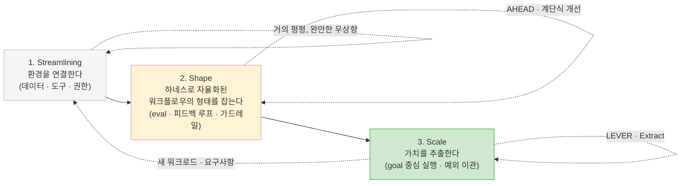
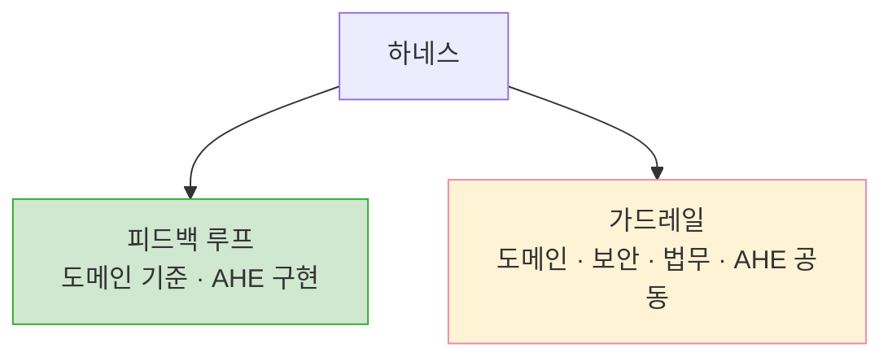

## TL;DR

- 에이전틱 엔지니어링은 **비즈니스 요구사항을 검증된 코드와 운영 가능한 기능으로 바꾸는 과정**이다.
- Streamlining과 Shape에서는 토큰을 써서 이 과정을 반복 가능하게 만드는 하네스를 구축한다.
- 비즈니스 평가는 요구사항 실현이 안정된 Scale에서 시작하고, **LEVER**로 가치 회수와 효율을 본다.

## 시작하며

OpenAI와 Anthropic을 비롯한 여러 회사가 eval, agent, guardrail에 대한 가이드를 공개하고 있다. 하지만 데이터 준비부터 하네스 구축, 평가, 조직 확산까지를 하나로 연결한 운영 모델은 드물고, 실제 현장에서도 각 요소가 따로 다뤄지기 쉽다.

그 이유 중 하나는 측정 기준이라고 생각한다. 토큰 가격은 바로 보이지만, 그 토큰이 비즈니스 요구사항을 얼마나 잘 실현했는지는 측정하기 어렵다.

이 글에서는 에이전틱 엔지니어링을 **비즈니스 요구사항을 검증된 코드와 운영 가능한 기능으로 바꾸는 과정**으로 본다. 토큰은 이 과정에 드는 비용 중 하나이고, 하네스는 시행착오를 다음 실행에 남기는 시스템이다.

따라서 토큰 가격보다 모델·도구·재시도·사람의 검토까지 포함한 **요구사항 실현 비용**을 평가 기준으로 삼는 편이 적절하다고 생각한다. 이 비용을 낮추고 구현 품질을 안정시키는 것이 하네스 엔지니어링이다.[^1][^8]

## 1. "AI를 쓰세요, 그런데 토큰은 최소로" 사이의 긴장

AI를 도입하면서 동시에 토큰을 최소화하려 하면 긴장이 생긴다. **하네스 구축 자체가 토큰과 엔지니어링 시간을 먼저 쓰는 작업**이기 때문이다. 하네스는 아래 사이클을 반복하며 만들어지고, 매번 도구 연동, eval, 관측성, 보안과 운영 비용이 함께 든다.[^19]

최근 Claude Fable 5와 GPT-5.6 Sol 같은 frontier model을 보면, 이 사이클 자체도 상당 부분 자동화할 수 있다는 근거가 생기고 있다. 장기 코딩 작업을 이어가며 스스로 검증하고, 메모리와 Custom Agent를 갱신하는 능력이 이전보다 높아졌다.[^20][^21] 이를 하네스 구축에 적용하면 실패 로그 분석, eval case 추가, 규칙·도구·가드레일 수정과 재검증을 모델이 연속해서 수행할 수 있다.

그래서 Shape 초기에는 가장 저렴한 모델로 토큰부터 아끼기보다, 도메인의 복잡성을 감당할 수 있는 큰 모델을 하네스 구축에 투입하는 편이 낫다고 생각한다. 다만 무엇을 실패로 볼지, 어떤 결과를 통과시킬지는 도메인 전문가가 정해야 한다. **도메인 하네스는 범용 지식만으로 한 번에 만들어지는 산출물이 아니라, 실제 업무의 시행착오를 eval과 규칙으로 축적하며 만들어지는 시스템**이기 때문이다.

큰 모델이 여러 대안을 탐색하고, 실행하고, 검증하고, 다시 하네스를 고치게 하면 이 구간의 토큰 사용량은 커진다. 하지만 이 Learning tokens가 재사용 가능한 하네스로 남는다면, 이후에는 더 작은 모델을 연결하거나 반복 횟수를 줄여 다음 요구사항의 실현 비용을 낮출 수 있다. Shape에서 토큰을 많이 쓰는 이유는 현재 작업 하나를 끝내기 위해서라기보다, 다음 작업부터 같은 시행착오를 반복하지 않기 위해서다.

토큰 사용량을 강하게 제한하면 구성원은 하네스 구축을 미루고, 적은 토큰으로 눈앞의 단기 작업을 처리하는 쪽을 택하기 쉽다. 평가 기준이 단기 사용량을 향해 있다면 개인에게는 합리적인 선택이다.

문제는 단기 작업만 처리하는 동안 시행착오가 조직의 자산으로 남지 않는다는 점이다. 어제 누군가 겪은 실패를 오늘 다른 동료가 반복하고, 결과를 다시 사람이 검토한다. 작업은 완료되지만 **요구사항 실현 비용은 구조적으로 낮아지지 않는다.**

따라서 개인의 토큰 사용량과 함께 조직이 반복하는 시행착오도 비용으로 봐야 한다. 단기 사용량만 줄이면, 장기적으로 이 비용을 낮출 하네스 투자가 오히려 뒤로 밀릴 수 있다.

일부 구성원은 자신의 하네스를 만들어 문제를 해결한다. 하지만 그 하네스를 다른 사람과 업무에 맞게 일반화하고 전파하는 일은 별도의 투자다. 이 과정이 없으면 학습은 개인의 업무 안에 머무르고, 다른 팀은 같은 문제를 처음부터 다시 푼다.

결국 코딩 에이전트를 도입하는 것만으로 모델의 능력이 조직의 반복 가능한 역량이 되지는 않는다. 모델이 할 수 있는 일과 조직이 안정적으로 맡길 수 있는 일 사이의 차이를 메우는 것이 하네스다.

따라서 도입 성과는 개인의 AI 사용량보다 **사람·모델·데이터·도구·하네스가 결합된 전체 워크플로우**를 기준으로 보는 편이 적절하다. 특히 품질을 단일 숫자로 표현하기 어려운 업무일수록 그렇다.

## 2. 도입을 설명하는 3단계 렌즈 — 3S

그럼 어떻게 도입하고 어떻게 평가하는 게 현실적인가?

여기서 잠깐 켄트 벡(Kent Beck)의 **3X 모델**[^2]을 빌려오자.

3X는 모든 제품과 비즈니스를 수익 곡선의 모양에 따라 세 단계로 나눈다. 가치 있는 아이디어를 싸고 빠른 실험으로 찾는 **Explore**(곡선이 거의 평평하다), 검증된 아이디어를 폭발적으로 키우는 **Expand**(곡선이 가파르게 치솟는다), 성숙한 제품에서 효율과 수익을 짜내는 **Extract**(곡선이 평탄해진다).

핵심은 **단계마다 곡선이 다르니 엔지니어링 전략도 달라질 수 있다**는 통찰이다. Explore에서 적절한 방식이 Extract에서는 비효율적일 수 있고, 그 반대도 마찬가지다.

에이전틱 프로덕트를 도입하는 과정도 이런 식으로 세 단계로 나눌 수 있다고 생각한다.

다만 여기서 단계를 가르는 기준은 수익 곡선이 아니라, **비즈니스 요구사항을 일정한 품질과 위험 기준을 통과한 기능으로 얼마나 안정적이고 효율적으로 바꾸는가**다.

3X의 결을 빌려, 나는 이걸 **3S — Streamlining · Shape · Scale**이라고 부른다. 이것이 현재 내가 조직 관점에서 AI를 보는 렌즈다.[^3]

3S는 아직 실증된 표준 모델이 아니다. 공개된 연구와 현장 사례가 지지하는 전제 위에서, 워크로드의 성숙도에 따라 투자와 평가 기준이 어떻게 달라져야 하는지를 한 단계 더 밀어붙인 가설이다.





앞선 글들에서 소프트웨어 개발을 비즈니스 요구사항을 코드로 바꾸는 컴파일 과정으로, 에이전틱 엔지니어링을 그 과정의 HITL을 줄여가는 방향으로 설명했다.[^3][^4] 이 정의를 따르면 3S가 직접 다루는 대상은 매출 자체보다 요구사항을 코드와 운영 가능한 기능으로 전환하는 과정이다.

이런 관점에서 3X 곡선의 세로축을 **요구사항 실현 효율**로 바꿔 그려보자. 같은 비용으로 요구사항을 더 안정적으로 구현할수록 축은 올라가고, 요구사항 실현 비용은 내려간다.

아래 그림은 실측 결과가 아니라 이 가정을 표현한 개념도다. Streamlining에서는 데이터와 도구를 연결하는 비용이 앞서 효율이 거의 드러나지 않는다. Shape에서는 실패를 하네스에 반영할 때마다 효율이 계단식으로 개선되지만, 하네스를 만드는 비용이 계속 들어가므로 투자 대비 효율은 아직 낮다.

어느 정도 완성된 하네스를 재사용해 비즈니스 요구사항을 빠르게 구현하는 Scale에 들어서야 앞선 투자가 회수되며 효율이 높아진다. 이후 최적화 여지가 줄면서 곡선이 완만해진다고 가정한다.

HITL은 중요한 변수지만 목표가 무조건 HITL 0인 것은 아니다. 사람의 반복 개입은 비용을 늘리지만, 고위험 업무의 승인은 오히려 위험을 줄인다. 따라서 **불필요한 개입은 줄이고 필요한 통제는 남기는 편이 적절하다.**[^10]

### 1단계 — Streamlining (Data & Tool Integration)

Streamlining은 에이전트가 업무에 필요한 데이터, 도구, 권한을 안전하게 사용할 수 있도록 연결하는 단계다. 모든 것을 텍스트로 바꾸기보다 필요한 순간에 기계가 처리할 수 있는 관찰과 도구로 접근하게 만든다.

엔터프라이즈에서는 사일로와 권한 경계를 조정해야 하므로 비용이 먼저 들고 가치는 늦게 보인다. 대신 데이터 계약, 권한 체계, connector와 관측성은 다른 워크플로우에서도 재사용된다.[^5][^8]

AWS와 Google에서는 여러 팀이 내부 시스템에 접근하는 MCP를 직접 만들고 공유하면서 Streamlining을 bottom-up으로 진행하고 있다. AWS의 MCP 서버 묶음도 사내 해커톤에서 출발했고, 각 사업 조직이 필요한 MCP를 만든 뒤 중앙 registry에서 공유하는 구조로 확장되고 있다.[^22][^23] Google 역시 Google과 Google Cloud의 서비스뿐 아니라 조직이 보유한 API를 검색 가능한 MCP 도구로 노출하고 공유하는 체계를 운영한다.[^24] 도메인팀이 자신의 시스템을 MCP로 만들고 공유하는 활동 자체가 조직의 Streamlining을 계속 진전시키는 셈이다.

반대로 개발 조직이 이런 방식으로 자율적으로 움직이기 어렵다면, 자연 발생을 기다리기보다 조직 차원의 Streamlining TFT가 필요하다고 생각한다. 이 팀은 여러 부서의 업무 흐름을 기준으로 필요한 데이터와 도구를 찾고, 권한·데이터 계약·감사 기준과 공통 registry를 함께 마련해야 한다. 개별 MCP를 대신 만드는 중앙 개발팀이라기보다, 도메인팀이 안전하게 만들고 공유할 수 있는 경로를 여는 역할에 가깝다.

먼저 end-to-end 워크플로우를 파악하고, 필요한 데이터만 최소권한으로 노출한다. DDD의 도메인과 bounded context는 이 경계를 찾는 렌즈로 활용할 수 있다.

### 2단계 — Shape (Harness Engineering)

Shape는 연결된 데이터와 도구 위에 컨텍스트, eval, 피드백 루프와 가드레일을 쌓는 단계다. 실패를 관찰해 하네스에 반영할 때마다 요구사항 실현 비용이 계단식으로 낮아진다. OpenAI의 Codex 실험에서도 초기 병목은 모델보다 과소명세된 환경이었고, 엔지니어의 역할은 도구·구조·피드백 루프를 만드는 쪽으로 이동했다.[^17]

이 과정에는 도메인 전문가와 AI 전문가의 협업이 필요하다. 내 경험에서는 특히 도메인 지식이 중요했다.[^6] Shape의 평가 질문은 **"이 하네스가 잘 구축되고 있는가?"**이며, 이를 **AHEAD**로 구체화한다.

### 3단계 — Scale (Value Extraction)

Scale은 하네스가 대표 eval을 반복해 통과하고, 요구사항 실현 비용과 시간을 안정적으로 측정할 수 있는 단계다. 저위험·반복 업무는 goal 중심으로 완료하고 예외와 고위험 결정만 사람에게 넘긴다.

이 단계에서는 하네스 자체를 만드는 일보다, 축적된 도메인 지식과 이를 담은 검증된 하네스를 새로운 워크로드에 재사용하는 비중이 커진다. 목표는 추가로 작성할 문서와 사용할 토큰, 검증 작업을 최소화하면서 새로운 비즈니스 가치를 추출하는 것이다.

이때 질문은 **"축적된 도메인 지식과 하네스를 재사용해 다음 워크로드에 필요한 추가 토큰과 문서 작업, 시간을 얼마나 줄일 수 있는가?"**로 바뀐다. 이를 앞선 투자의 회수와 비즈니스 가치 추출을 보는 **LEVER**로 구체화한다.

같은 하네스를 재사용할수록 앞선 투자를 반복해서 회수할 수 있다. 다만 문제 선택이나 데이터와 품질 기준이 적절하지 않으면 Scale에 도달하기 어렵다.[^15]

## 3. 3S 렌즈로 조직의 일하는 방식 그려보기

McKinsey의 2025년 조사에서 AI 고성과 조직은 다른 조직보다 워크플로우를 근본적으로 재설계할 가능성이 약 3배 높았다.[^16] 3S 관점에서 이를 실행하려면 다음 역할이 필요하다.

**첫째, 도메인 전문가를 중심으로 Streamlining을 추진하는 소규모 cross-functional team을 만든다.** 이 팀에는 도메인 전문가, AI 엔지니어, 데이터 담당자, 보안·거버넌스 담당자와 의사결정권자가 필요하다. 역할은 end-to-end 워크플로우를 그리고 baseline을 잡은 뒤, 필요한 데이터와 도구를 안전하게 연결하는 것이다.[^9]

**둘째, Agentic Harness Engineering을 명시적인 조직 기능으로 둔다.** 이 역할을 맡는 **Agentic Harness Engineer(AHE)**는 identity, connector, eval, observability 같은 공통 기반을 제공하고, 도메인팀은 업무별 컨텍스트와 품질 기준을 책임진다.[^4][^8]

조직은 자체 AHE를 키우거나 AI DE·FDE 같은 외부 역할을 활용할 수 있다. 다만 하네스의 일부는 모델과 도구에 결합되므로, eval dataset, 업무 규칙, 데이터 계약과 표준화된 도구 인터페이스는 이식 가능한 자산으로 분리해두는 편이 좋다.

**셋째, 도메인 챔피언과 AHE가 함께 핵심 하네스를 구축한다.** 도메인 전문가는 품질 기준을 정하고, AHE는 이를 eval과 도구로 옮긴다. 가드레일의 정책은 도메인·보안·법무·리스크 조직이 함께 소유한다.





이 협업은 영구 상주보다 부트스트랩에 가깝다. 도메인팀이 하네스를 운영할 수 있게 되면 AHE는 다음 도메인으로 이동한다. 잘 구축된 eval은 이후 더 저렴한 모델로 전환하거나 작업별로 모델을 라우팅하는 기준도 된다.[^7]

**넷째, 도메인팀은 처음부터 평가 시스템을 만든다.** 도입 전 baseline을 잡고, Shape에서는 AHEAD로 하네스의 계단식 개선을, Scale에서는 LEVER로 가치 회수와 비즈니스 성과를 본다. 평가 결과는 다시 하네스 개선으로 이어져야 한다.[^9]

## 4. 어떻게 도입하고, 단계별로 무엇을 평가할 것인가

앞 장이 역할과 책임을 설명했다면, 여기서는 한 워크로드를 도입하는 실행 순서와 평가 기준을 정리한다.

1. **도메인과 baseline을 정의한다.** 현재의 시간·품질·비용·사람 개입을 기록한다.
2. **Streamlining을 진행한다.** 도메인 전문가와 AHE가 필요한 데이터·도구·권한을 연결한다.
3. **하네스와 eval을 만든다.** 실패를 dataset과 가드레일에 반영한다.
4. **검증된 워크플로우를 Scale한다.** 운영 지표와 비즈니스 지표를 모니터링한다.

평가 자체를 뒤로 미루는 것은 아니다. 도입 전에는 baseline, 개발 중에는 eval, 운영 중에는 모니터링이 필요하다.[^9][^10] 다만 **Streamlining에서는 readiness**, **Shape에서는 AHEAD**, **Scale에서는 LEVER와 비즈니스 성과**처럼 평가 대상을 달리한다.

Streamlining과 Shape는 토큰과 엔지니어링 시간을 써서 요구사항 실현 과정을 하네스로 남기는 구간이다. 이때 단기 ROI나 토큰 비용만 적용하면 선행 투자를 실패로 오독할 수 있다. 새로운 요구사항이 생기면 필요한 범위만큼 다시 앞 단계로 돌아간다.

### Streamlining — 평가할 수 있는 상태 만들기

Streamlining에서는 성과보다 **readiness**를 본다. baseline이 있는지, 필요한 데이터·도구·권한에 접근할 수 있는지, 보안과 감사 요건을 충족하는지 확인한다.

### Shape — AHEAD로 하네스의 계단식 개선 평가하기

AHEAD는 실패와 피드백이 하네스에 반영될 때마다 사람의 반복 작업과 판단이 얼마나 안정적으로 줄어드는지 본다. AHEAD와 LEVER는 검증된 표준이 아니라, 서로 긴장 관계에 있는 지표를 함께 보기 위한 이 글의 제안이다.[^13][^18]

| 관점 | 판단할 질문 | 비즈니스 리더에게 번역하면 |
| --- | --- | --- |
| **A — Autonomy** | 고정된 품질·위험 기준 아래 회피 가능한 HITL이 줄고, 필수 HITL로 정확히 escalation하는가? | 반복 검토 시간과 대기 비용이 줄었는가? |
| **H — Harness Learning** | 실패와 피드백이 eval, tool, rule, guardrail로 전환되어 같은 실패의 재발을 막는가? | 투자한 학습이 조직 자산으로 남는가? |
| **E — Efficiency** | Delivery tokens와 Learning tokens, 도구 호출, 재시도, 사람의 시간을 포함해 요구사항을 실현하는 총투입이 줄어드는가? | 같은 품질의 기능을 더 적은 비용으로 구현하는가? |
| **A — Adoption** | 도메인팀이 실제 업무에서 사용하고, 결과를 신뢰하며, 스스로 개선에 참여하는가? | 파일럿이 아니라 운영 역량으로 정착했는가? |
| **D — Dependability** | 품질, 안전, 안정성, regression과 escalation 정확도가 기준 안에 있는가? | 절감한 비용보다 더 큰 실패 위험을 만들지 않는가? |

각 항목은 종합점수로 합치기보다 함께 본다. Autonomy만 높이면 Dependability가 낮아질 수 있고, 품질만 높이면 Efficiency와 Adoption이 나빠질 수 있기 때문이다. Learning tokens도 실제 eval이나 도구로 남아 같은 실패를 줄였는지 확인해야 한다.

### Shape에서 Scale로 넘어가는 gate

대표 eval을 반복해 통과하고, 반복 실패가 하네스에 반영되고, 도메인팀이 운영 책임을 넘겨받으면 Scale로 넘어간다. 모니터링, escalation, rollback도 이 gate에 포함한다.

### Scale — LEVER로 Extract 평가하기

Scale에서는 평가 초점이 바뀐다. AHEAD가 실패를 하네스에 반영하며 현재 워크플로우를 계단식으로 개선하는지 묻는다면, LEVER는 축적된 도메인 지식과 완성된 하네스를 재사용해 다음 워크로드의 비용과 시간을 얼마나 낮추고 비즈니스 가치를 추출하는지 묻는다.

| 관점 | 판단할 질문 | 비즈니스 리더에게 번역하면 |
| --- | --- | --- |
| **L — Lead Time** | 새로운 워크로드와 비즈니스 요구사항을 운영 가능한 기능으로 만드는 시간이 줄어드는가? | 요구사항이 실제 가치로 이어지는 시간이 짧아지는가? |
| **E — Extraction Efficiency** | 새 워크로드에 필요한 추가 토큰, 문서·컨텍스트 준비와 검증 작업이 줄어드는가? | 같은 하네스에서 더 적은 추가 비용으로 가치를 만드는가? |
| **V — Value Realization** | 자동화가 비용 절감, capacity, 매출 기여, 위험 감소 중 무엇을 만들어내는가? | 손익과 운영 여력에 어떤 변화가 생겼는가? |
| **E — Extension & Reuse** | 축적된 도메인 지식과 이를 반영한 context, eval, rule, guardrail, connector를 새 워크로드에 재사용하는가? | 앞선 투자를 몇 번 다시 회수하고 있는가? |
| **R — Reliability** | 하네스를 재사용한 뒤에도 같은 품질·위험 기준을 유지하고 regression을 통제하는가? | 가치 회수 과정에서 품질 비용이나 사고 위험이 커지지 않는가? |

LEVER의 핵심은 기능 개수보다 **도메인 지식과 하네스를 재사용해 다음 워크로드에 필요한 추가 토큰과 문서 작업, 시간을 줄이는가**다. 이 단계에서 줄어든 요구사항 실현 비용을 비용 절감, 매출 기여, 위험 감소 같은 비즈니스 성과와 연결한다.

## 5. 모델이 좋아져도 시스템은 저절로 좋아지지 않는다

최근 모델은 부족한 컨텍스트를 스스로 보완하는 능력을 높이고 있다. 사람의 개입과 하네스의 복잡도를 줄일 수 있지만, 모델의 역량이 곧 조직의 역량이 되는 것은 아니다.

코드 생성은 요구사항을 운영 가능한 기능으로 만드는 여러 단계 중 하나다. 요구사항 발견, 데이터 접근, 아키텍처, 검증, 배포와 운영도 남는다. DORA의 2025년 조사에서도 AI 도입은 delivery throughput에는 긍정적이었지만 delivery stability에는 부정적인 관계를 보였다.[^13]

실험 결과도 업무와 환경에 따라 엇갈린다. 고객 지원 현장에서는 AI가 시간당 해결 건수를 평균 14% 높였고, 특히 저숙련·초보 직원에게 효과가 컸다.[^11] 반면 숙련된 오픈소스 개발자를 대상으로 한 METR의 2025년 실험에서는 당시 AI 도구를 허용했을 때 작업 시간이 19% 늘었다.[^14] HBS의 실험에서도 AI capability frontier 안의 업무는 빨라지고 품질이 높아졌지만, frontier 밖의 업무에서는 정답률이 낮아졌다.[^12]

따라서 **모델, 업무, 사용자, 하네스의 조합을 실제 환경에서 평가할 필요가 있다.** 모델이 충분한 업무는 Streamlining과 Shape를 시작하고, 하네스와 HITL을 더해도 기준을 충족하지 못하는 업무는 범위를 줄이거나 도입을 보류할 수 있다.

## 6. 여러 코딩 에이전트를 자유롭게 쓰는 전략은 어떨까?

평가 기준 없이 여러 코딩 에이전트를 자유롭게 쓰는 정책에는 신중할 필요가 있다고 생각한다. 하네스의 일부가 모델과 에이전트에 결합되어 있어, 교체 후 같은 성능과 효율이 유지된다고 보기 어렵기 때문이다.

멀티 모델이나 멀티 에이전트 자체가 문제는 아니다. model routing이나 review agent도 유효한 하네스가 될 수 있다. 관건은 **선택을 통제하고 비교할 eval이 있는가**다.

나도 Cursor 기준으로 만든 하네스가 Claude Code에서 작동하지 않아 한동안 전환하지 못했다. Sonnet으로 하네스를 재구성했을 때는 실패했고, Opus가 나온 뒤에야 기대한 수준으로 옮길 수 있었다.

이 경험 이후 에이전트 선택은 편의보다 **무엇을 공통 자산으로 남기고 무엇을 특정 agent에 최적화할지 결정하는 전략**에 가깝다고 보게 됐다.

## 마치며

에이전틱 엔지니어링은 비즈니스 요구사항을 검증된 코드와 운영 가능한 기능으로 바꾸는 과정이다. 토큰은 비용 중 하나이고, 하네스는 시행착오를 다음 구현에 남기는 시스템이다.

초기에는 토큰을 아끼기보다 Streamlining과 Shape에 투자한다. Shape에서는 AHEAD로 하네스의 계단식 개선을 평가하고, 안정된 Scale에 이르면 LEVER로 앞선 투자의 회수와 비즈니스 성과를 본다.

3S는 한 번 통과하는 로드맵이 아니라 워크로드마다 반복하는 루프다. 내가 그리는 장기적인 방향은 **사람이 반복적으로 메우는 자리를 개발 전 과정에서 하나씩 하네스에 넘기는 것**이다. 필요한 승인은 남기되, 반복 가능한 판단과 검토는 자동화하고 사람은 목표 설정·새로운 예외·책임으로 이동한다.

> If you don't cannibalize yourself, someone else will.
>
> — Steve Jobs

이 문장을 조직의 관점에서 읽으면, 반복 업무의 구조를 스스로 바꾸며 진화할 것인지, 변화가 외부에서 올 때까지 기다릴 것인지에 대한 질문으로도 볼 수 있다. 지금은 그 질문을 각자의 조직에 던져볼 시기라고 생각한다.

---

[^1]: [쉽게 설명한 하네스 엔지니어링](/2026/03/15/harness-engineering-beyond-context-engineering/)

[^2]: 켄트 벡(Kent Beck)의 [The Product Development Triathlon](https://medium.com/@kentbeck_7670/the-product-development-triathlon-6464e2763c46) (2016) — 3X 모델(Explore, Expand, Extract).

[^3]: [현상을 해석하는 렌즈, 그리고 에이전틱 엔지니어링](/2026/06/12/lens-for-agentic-engineering/)

[^4]: [에이전틱 엔지니어링과 과도기적 기술들](/2026/05/11/direction-of-agentic-engineering/)

[^5]: [하나의 잘 만든 GenAI 플라이휠이 비즈니스 전체를 견인한다](/2026/03/12/genai-flywheel-for-business/)

[^6]: [에이전틱 개발 시대, 비즈니스를 아는 개발자의 가치](/2026/03/13/agentic-dev-business-aligned-code/)

[^7]: [하네스 없는 멀티 에이전트는 그냥 컨텍스트 엔지니어링](/2026/03/31/multi-agent-without-harness-is-just-context-engineering/)

[^8]: OpenAI, [How to manage AI investments in the agentic era](https://openai.com/index/managing-ai-investments-in-agentic-era) — 토큰 단가가 아니라 모델·도구·재시도·지연·사람 검토를 포함한 `cost per accepted outcome`을 측정하고, 탐색·검증·프로덕션의 성숙도에 따라 투자를 달리할 것을 제안한다.

[^9]: OpenAI, [AI in the Enterprise](https://cdn.openai.com/business-guides-and-resources/ai-in-the-enterprise.pdf) — 엔터프라이즈 AI 도입의 첫 원칙으로 `Start with evals`를 제시하고, 도메인 전문가의 지속적인 피드백을 강조한다.

[^10]: NIST, [AI Risk Management Framework Core](https://airc.nist.gov/airmf-resources/airmf/5-sec-core) — AI 시스템을 배포 전에 시험하고 운영 중에도 모니터링하며, human-AI configuration과 사람의 override를 측정하도록 권고한다.

[^11]: Erik Brynjolfsson, Danielle Li, Lindsey Raymond, [Generative AI at Work](https://www.nber.org/papers/w31161) — 5,179명의 고객 지원 상담사를 분석한 결과 AI 도구가 시간당 해결 건수를 평균 14% 높였으며, 초보·저숙련 직원의 개선 폭이 더 컸다.

[^12]: Fabrizio Dell'Acqua et al., [Navigating the Jagged Technological Frontier](https://www.hbs.edu/faculty/Pages/item.aspx?num=64700) — AI capability frontier 안의 지식 업무에서는 속도와 품질이 개선됐지만, frontier 밖의 업무에서는 정답률이 낮아졌다.

[^13]: Google Cloud DORA, [State of AI-assisted Software Development 2025](https://dora.dev/dora-report-2025) — AI는 조직의 기존 강점과 약점을 증폭하며, 빠른 피드백과 자동화된 테스트 같은 기반 역량이 성과를 좌우한다고 설명한다.

[^14]: METR, [Measuring the Impact of Early-2025 AI on Experienced Open-Source Developer Productivity](https://metr.org/blog/2025-07-10-early-2025-ai-experienced-os-dev-study) — 숙련 개발자가 자신의 저장소에서 작업한 무작위 대조 실험에서 당시 AI 도구 사용 시 완료 시간이 19% 증가했다. 특정 시점과 환경의 결과이므로 일반화에는 주의가 필요하다.

[^15]: RAND, [The Root Causes of Failure for Artificial Intelligence Projects and How They Can Succeed](https://www.rand.org/pubs/research_reports/RRA2680-1.html) — 잘못 정의된 문제, 부족한 데이터, 사용자 문제보다 기술을 우선하는 접근, 배포 인프라 부족 등을 주요 실패 원인으로 정리한다.

[^16]: McKinsey, [The State of AI 2025](https://www.mckinsey.com/capabilities/quantumblack/our-insights/the-state-of-ai) — AI 고성과 조직은 다른 조직보다 AI 도입 과정에서 워크플로우를 근본적으로 재설계할 가능성이 약 3배 높았다.

[^17]: OpenAI, [Harness engineering: leveraging Codex in an agent-first world](https://openai.com/index/harness-engineering/) — 초기 병목을 모델보다 과소명세된 환경에서 찾고, 도구·아키텍처 제약·피드백 루프를 구축한 경험을 설명한다.

[^18]: Nicole Forsgren et al., [The SPACE of Developer Productivity](https://queue.acm.org/detail.cfm?id=3454124) — 생산성을 단일 활동량으로 환원하지 않고 Satisfaction, Performance, Activity, Communication, Efficiency의 여러 차원에서 함께 보아야 한다고 제안한다.

[^19]: AWS Skill Builder, [Two Pizza Labs 1: Agentic Engineering — Agent & Harness](https://skillbuilder.aws/learn/7PYA9PPKYU/two-pizza-labs-1-agentic-engineering--agent--harness--/PVZGG72Y3G) — 코드 생성, 검증과 피드백을 반복하며 하네스를 업데이트하는 과정을 실습한다.

[^20]: Anthropic, [Claude Fable 5 and Claude Mythos 5](https://www.anthropic.com/news/claude-fable-5-mythos-5) — Fable 5가 이전 Claude보다 더 오래 자율적으로 작업하고, 장기 코딩 작업과 지속 메모리를 활용한 반복 개선에 강해졌다고 설명한다.

[^21]: OpenAI, [GPT-5.6: Frontier intelligence that scales with your ambition](https://openai.com/index/gpt-5-6/) — Sol의 장기 소프트웨어 엔지니어링 성능과 함께, `max`가 대안을 탐색하고 검증·수정하며 `ultra`는 더 많은 토큰을 사용해 복잡한 작업의 성능을 높이는 방식을 설명한다.

[^22]: AWS Events, [The MCP Revolution: AWS Team's Journey from Internal Tools to Open Source AI Infrastructure](https://www.youtube.com/watch?v=DZFgufNCvAo) — AWS PACE 팀이 사내 해커톤 프로젝트에서 시작해 30개 이상의 MCP 서버를 공개한 과정을 소개한다.

[^23]: AWS, [Accelerating AI innovation: Scale MCP servers for enterprise workloads with Amazon Bedrock](https://aws.amazon.com/blogs/machine-learning/accelerating-ai-innovation-scale-mcp-servers-for-enterprise-workloads-with-amazon-bedrock/) — 각 사업 조직이 필요한 MCP 서버를 개발하고, 완성된 서버를 중앙 hub와 registry를 통해 조직 전체에 공유하는 구조를 제안한다.

[^24]: Google Cloud, [Announcing Model Context Protocol support for Google services](https://cloud.google.com/blog/products/ai-machine-learning/announcing-official-mcp-support-for-google-services) — Google과 Google Cloud 서비스용 managed MCP와 함께, 조직 자체 API를 Apigee API Hub에서 검색 가능한 도구로 노출하고 통제하는 방식을 소개한다.
