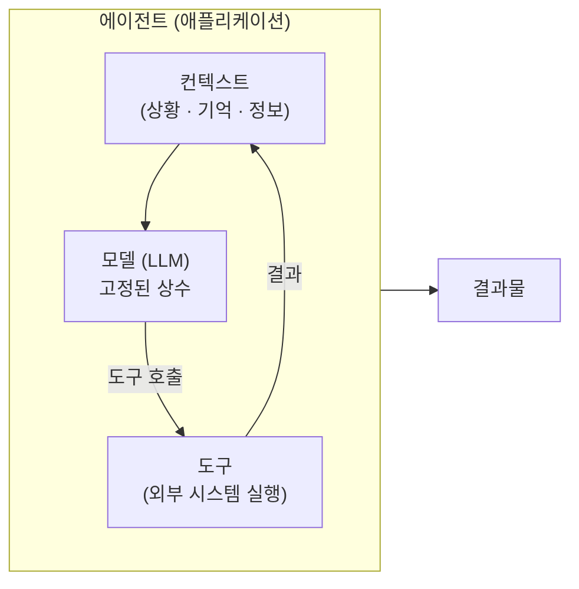
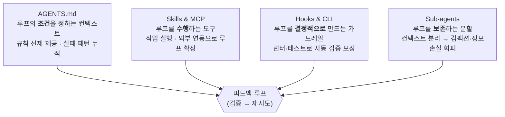
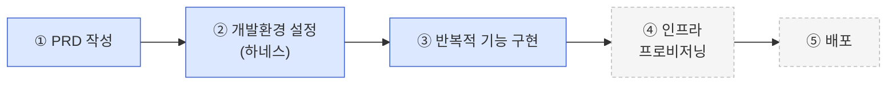
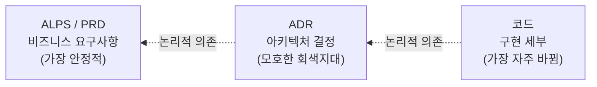
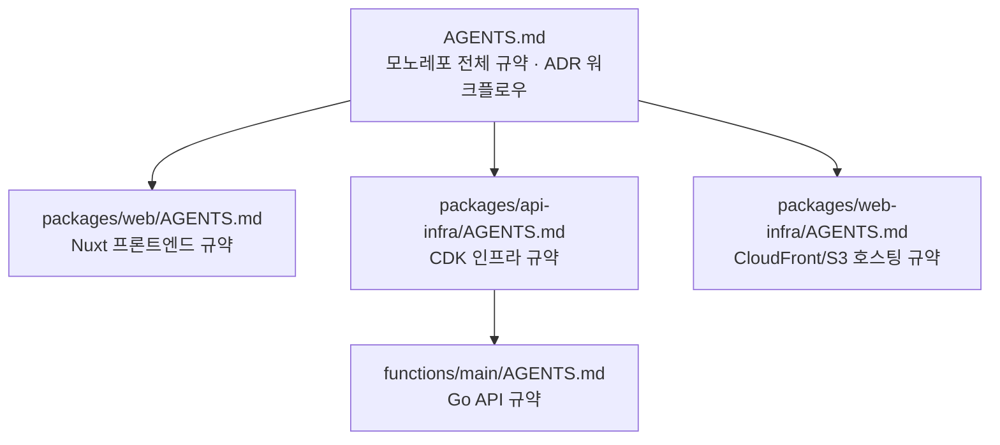
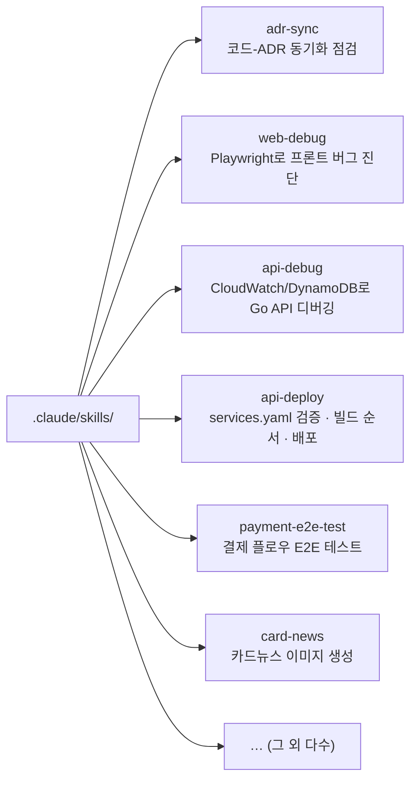
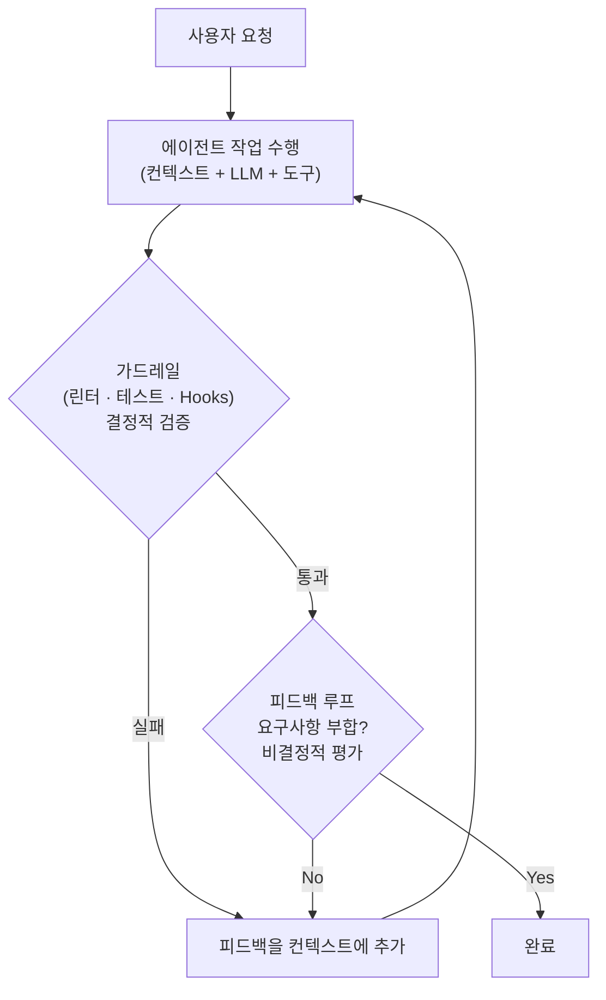
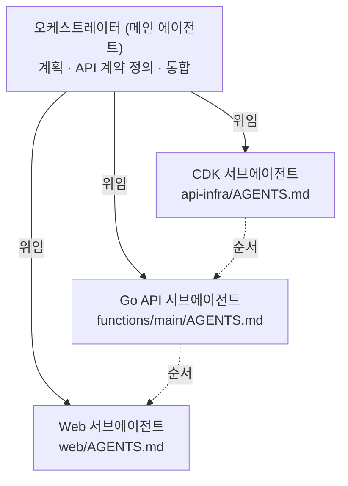
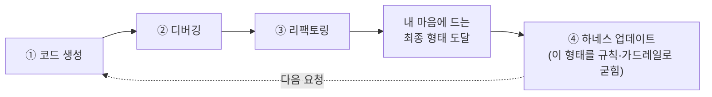
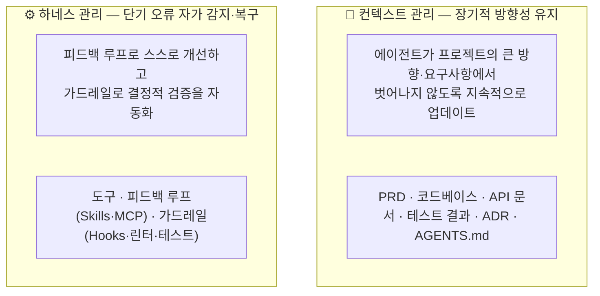

## TL;DR

- 하네스 엔지니어링은 에이전트에게 자율성을 부여하기 위한 것이다.
- 처음부터 거창하게 설계하는 게 아니라, 에이전트가 실수할 때마다 한 겹씩 덧씌워 쌓아가는 점진적 과정이다.

## 시작하며

이전 글들에서 하네스 엔지니어링이 **무엇인지**[^1], 그리고 **왜 필요한지**[^2]를 다뤘다.

컨텍스트가 큰 방향을 잡아주고 하네스가 매 실행 주기마다 오류를 복구해서, 에이전트가 긴 호흡의 태스크를 완주하게 해준다는 이야기였다.

그런데 이 개념을 글로 설명하고 나면 늘 같은 질문을 받는다.

**"그래서 실제로는 뭘 어떻게 하면 되는데요?"**

하네스라는 단어는 거창한데, 막상 빈 디렉토리 앞에 앉으면 무엇부터 손대야 할지 막막하다.

그래서 이번 글에서는 개념이 아니라 **순서**를 이야기하려고 한다.

개발자 한 명이 빈 프로젝트에 에이전트를 붙이고, 거기에 하네스를 한 겹씩 씌워나가는 과정을 단계별로 따라가 본다.

마침 내가 혼자 만들고 운영하는 [EncBird](https://encbird.com)(GenAI 영어 학습 서비스)와 [PixelBank](https://pixelbankstudio.com)(AI 이미지 편집 서비스)의 하네스가 딱 이런 과정을 거쳐 쌓였기 때문에, 추상적인 단계마다 실제 프로젝트의 설정을 같이 보여주려고 한다.

서비스뿐 아니라 에이전트용 툴인 [ALPS Writer](https://github.com/haandol/alps-writer-plugins)나 [PPT Generator](https://github.com/haandol/ppt-generator)도 같은 방식으로 하네스를 씌워 만들었다.

이 프로젝트들 모두 Nx 모노레포에 ADR-first 워크플로우를 얹은 같은 골격이라, 주로 EncBird를 예로 들되 필요하면 다른 프로젝트도 함께 언급하겠다.

미리 결론부터 말하면, **하네스는 한 번에 설계해서 씌우는 게 아니다.** 

에이전트를 굴리다가 삐끗하는 지점이 보이면, 바로 그 지점에 한 겹을 덧대는 식으로 쌓인다. 
그래서 좋은 하네스는 처음부터 그려놓은 청사진이 아니라, **에이전트가 남긴 실수의 회고록**에 가깝다.

## 0. 출발점: 에이전트는 컨텍스트를 관리하는 애플리케이션일 뿐이다

순서를 이야기하기 전에 기준점 하나만 다시 짚어두자.

**에이전트 = 모델 + 컨텍스트 + 도구.** 이 셋이 전부다.

그리고 에이전트라는 건 결국 이 셋을 묶어서 **컨텍스트를 관리해주는 애플리케이션**에 지나지 않는다.





누군가 "에이전트를 잘 쓴다"고 하면, 그건 대단한 비법이 있는 게 아니라 그냥 **컨텍스트를 잘 설계하고 도구를 적절히 붙였다**는 뜻이다.

여기서 중요한 제약이 하나 나온다. 세 구성요소 중 **모델은 우리가 직접 건드릴 수 없다.** 

GPT든 Claude든, 우리가 고를 수는 있어도 그 안을 바꿀 수는 없다. 그러니까 우리가 실제로 제어할 수 있는 건 **컨텍스트와 도구, 그리고 그 둘이 돌아가는 런타임 환경(awscli, gh 같은 CLI들)뿐이다.**

하네스 엔지니어링을 한 줄로 정의하면 이렇게 된다.

> **모델은 고정된 상수로 두고, 제어 가능한 컨텍스트·도구·런타임 환경만으로 코드 생성 과정을 자율화하되, 그 결과가 원래의 비즈니스 요구사항을 잘 반영하게 만드는 일.**

컨텍스트 엔지니어링이 "생성된 코드가 비즈니스 요구사항을 잘 반영하게" 하는 데 초점이 있다면, 하네스 엔지니어링은 그걸 포함하되 목적이 한 발 더 나가 있다.

**비즈니스 요구사항이 잘 반영된 코드 생성 과정을 사람 없이 굴러가게 자율화하는 것**이다.[^3]

하네스의 구성요소는 크게 네 가지라고 볼 수 있다.

1. **AGENTS.md** — 라고 적었지만 사실은 컨텍스트의 집합이고, 보통 파일 하나로 끝나지 않는다.
2. **도구(Skills & MCP)** — MCP든 Skill이든, 결국 "도구를 어떻게 줄 것인가"의 문제를 푸는 방법들이다.
3. **가드레일(Hooks & CLI)** — 린터, 테스트, Hooks 같은 결정적 검증 장치.
4. **서브에이전트** — 컨텍스트를 분할해서 메인 루프를 지켜주는 장치.

네 요소가 따로 노는 것처럼 보이지만, 사실은 전부 하나의 **피드백 루프**(에이전트가 결과를 검증받고, 안 맞으면 다시 시도하는 순환)를 떠받치기 위해 존재한다.

각자 그 루프에서 맡는 역할이 다를 뿐이다.





그런데 이 네 가지는 **개발 전체 흐름 중 어디에** 들어가는 걸까? 질문을 한 줄로 좁히면 이렇다.

> **어떻게 하면 에이전트가 최소한의 노력으로 더 신뢰할 수 있는 코드를 생성하게 할 수 있을까?**

이 질문에 답하는 에이전틱 엔지니어링 프로세스를 단계로 펼치면 대략 이렇다.





- **① PRD 작성** — 비즈니스 요구사항과 기술 세부를 문서화한다. 에이전트가 따라갈 방향이다.
- **② 개발환경 설정** — 여기가 핵심이다. 단순한 환경 설정이 아니라 **하네스 설정**이다. 도구·피드백 루프·가드레일을 갖춰, 에이전트가 오류를 스스로 감지하고 복구하는 환경을 만든다.
- **③ 반복적 기능 구현** — PRD 기반으로 작은 단위씩 반복 구현·검증하며 품질을 누적한다.
- **④ 인프라 프로비저닝 / ⑤ 배포** — IaC와 CI/CD로 자동화하는 영역.

각 단계는 독립적이지 않고, **앞 단계에서 명확히 정의한 내용이 뒤 단계의 에이전트 동작 품질을 결정**한다.

이 글이 다루는 건 그중 **①~③**이다. ①에서 방향(PRD·ADR)을 세우고, ②에서 하네스의 네 요소를 얹고, ③에서 그 위에서 기능을 반복 구현하며 하네스를 나선형으로 키운다.

④ 인프라와 ⑤ 배포는 아직 에이전트 자동화가 무르익지 않은 영역이라 이 글의 범위 밖이다.

그러니 아래 순서는 이 프로세스를 그대로 따라간다.

1번이 PRD·ADR(①), 2~5번이 하네스 네 요소를 한 겹씩 얹는 개발환경 설정(②), 6번이 그 위에서 도는 반복 구현 사이클(③)이다.

이제 빈 프로젝트에 **순서대로** 씌워가 보자.

## 1. 맨손으로 시작하지 않는다 — PRD와 ADR로 방향을 먼저 세운다

"빈 프로젝트에 에이전트를 켠다"고 했지만, 정말로 맨손으로 시작하는 건 아니다. 보통은 피쳐를 만들면 이렇게 할 것이다.

```
$ claude
> 결제 모듈에 환불 기능 추가해줘
```

이러면 에이전트가 일을 하긴 한다.

하지만 무엇을 만드는 서비스인지, 환불 정책이 어떤지, 어떤 제약이 있는지 모른 채 자기가 그럴듯하다고 판단한 방향으로 코드를 쏟아낸다.

사람이 옆에 딱 붙어서 매 줄을 들여다보고 이상하면 끊어야 한다. 하네스가 없으니 사람이 모든 걸 메우는 것이다.

그래서 코드를 짜라고 시키기 **전에**, 에이전트가 따라갈 방향부터 먼저 만든다.

두 가지다.

**PRD — 무엇을 만들지를 모호함 없이 적는다.** 에이전트가 흔들리는 가장 큰 이유는 비즈니스 요구사항이 사람의 머릿속에만 있기 때문이다.

그래서 나는 [ALPS Writer](https://github.com/haandol/alps-writer-plugins) 같은 도구로 PRD부터 쓴다.

ALPS(Agentic Lean Product Spec)는 사람이 읽고 직관으로 빈틈을 메우는 전통적 PRD와 달리, **에이전트가 모호함 없이 코드를 짤 수 있게** 설계된 PRD 포맷이다.

핵심은 작성 방식인데, 사람이 백지에 쓰는 게 아니라 **에이전트가 9개 섹션을 따라 집중된 질문을 던지고 사람이 답하는** 구조다.

그리고 "만들지 않을 것(Out of Scope)"을 일급 섹션으로 둬서, 에이전트가 무엇을 **하지 말아야** 하는지까지 못박는다.

PRD 품질이 작성자 역량에 휘둘리던 문제를, 질문 흐름을 표준화해서 풀어내는 셈이다.

**ADR — 어떻게 만들지의 결정을 기록한다.** 

PRD가 "무엇"이라면 ADR(Architecture Decision Record)은 "어떻게"의 결정이다. 

ALPS Writer는 `/feature-to-adr`로 PRD의 기능을 ADR 초안으로 넘겨주고, 거기서부터는 `adr-writer`가 `/adr-new`로 새 결정을 쓰고 `/adr-impl`로 구현하는 사이클을 돈다.

여기서 중요한 설계가 **PRD → ADR → 코드의 단방향 의존성**이다.





코드는 ADR을 만족시키려고 쓰이고, ADR은 PRD를 만족시키려고 쓰인다.

안쪽(PRD)이 바뀌면 바깥쪽(ADR·코드)이 따라오지만, 그 반대는 일어나지 않는다.

코드 리팩토링 한 번에 ADR을 다시 써야 한다면 그 ADR이 구현 세부를 끌어안고 있었다는 뜻이다.

그래서 ADR에는 파일 경로나 코드 조각이 아니라 **왜 이렇게 결정했는지(WHY)와 대안 비교**만 남긴다.

이게 왜 하네스의 0층이냐면, **PRD와 ADR이 그다음에 쌓을 모든 하네스의 기준점**이 되기 때문이다.

AGENTS.md의 규칙도, 가드레일이 검증하는 "올바른 형태"도, 결국 "PRD·ADR이 정한 방향에 맞는가"로 판정된다.

방향을 적어두지 않으면 그 뒤의 모든 자동화는 "무엇에 맞춰 자동화하는지" 모르는 채로 돌아간다.

대부분의 사람들이 이 단계 없이 바로 코드를 시킨다.

개발 전 과정을 에이전트에게 위임할 생각이 없다면 그래도 된다.[^1]

하지만 위임을 늘리고 싶다면, 방향을 글로 먼저 적는 이 단계가 출발점이다.

그리고 여기서부터, 에이전트를 굴리다 보면 슬슬 짜증나는 지점들이 보이기 시작한다. 그 짜증이 바로 다음 단계의 재료다.

## 2. 같은 지적을 세 번 하면, AGENTS.md를 연다 (컨텍스트)

가장 먼저 닳는 인내심은 이런 데서 온다.

- "우리 프로젝트는 pnpm 쓴다니까 자꾸 npm으로 깔지 마"
- "커밋 메시지는 한국어로 써달라고 했잖아"
- "API 핸들러는 `handlers/` 밑에 둬야 한다고 방금 말했는데"

매번 똑같은 지적을 채팅창에 다시 친다. 그런데 대화는 휘발된다.

다음 세션이 시작되면 에이전트는 **이전 교대 근무에 대한 기억 없이 도착하는 신입**[^1]처럼 같은 실수를 반복한다.

**같은 지적을 세 번쯤 했다면, 그건 채팅에 칠 게 아니라 파일에 남길 신호다.** 이게 첫 번째 하네스, `AGENTS.md`(혹은 `CLAUDE.md`)다.

핵심은 이걸 **선제적으로 한 번에 완벽하게 쓰려고 하지 않는 것**이다.

처음부터 베스트 프랙티스를 다 적겠다고 덤비면 쓰지도 못할 규칙만 잔뜩 쌓인다.

그게 아니라, **에이전트가 어긋날 때마다 그 어긋남을 한 줄씩 추가**한다.

AGENTS.md는 작성하는 문서가 아니라 **자라나는 문서**다.

EncBird의 루트 AGENTS.md도 그렇게 자랐다.

지금은 이런 항목들이 쌓여 있는데, 하나하나가 "에이전트가 여기서 한 번 사고 쳤다"는 흔적이다.

```markdown
## Agent Work Protocol
### Principles
- Focus on one feature/bug at a time
- Code must be buildable and pass lint at session end
- Write descriptive commit messages so the next session can
  understand progress from `git log` alone
- Prefer early return: handle errors and edge cases first ...

## Deployment & CI/CD
- A merge to `main` is itself a web deploy, so the agent never
  pushes/merges to `main` without explicit user confirmation.
```

마지막 줄("`main` 머지 = 곧 배포니까 사람 확인 없이 머지하지 마라")이 특히 좋은 예다. 에이전트가 무심코 `main`에 머지해서 의도치 않은 배포를 한 번 일으킨 뒤에 추가된 규칙이다. 사고가 규칙을 낳고, 규칙이 다음 사고를 막는다.

프로젝트가 커지면 AGENTS.md도 하나로는 안 된다. EncBird는 Nx 모노레포라 패키지마다 툴체인이 완전히 다른데, 그래서 컨텍스트도 계층으로 쪼갰다.





루트는 "전체 약속"만 담고, 각 패키지의 구체적인 빌드·린트·컨벤션은 그 디렉토리의 AGENTS.md가 책임진다.

에이전트가 web을 만지면 web의 AGENTS.md만, Go를 만지면 Go의 AGENTS.md만 보면 된다.
이렇게 하면 컨텍스트가 비대해지지 않고, 엉뚱한 패키지의 규칙을 잘못 적용하는 일도 줄어든다.

여기까지 오면 에이전트는 프로젝트의 큰 방향에서 덜 벗어난다. 이게 컨텍스트 엔지니어링의 영역이고, 하네스의 1층이다. 하지만 곧 컨텍스트만으로 안 되는 벽을 만난다.

## 3. "할 줄 모르는 일"이 나오면, 도구를 쥐여준다 (도구)

AGENTS.md로 방향은 잡았는데, 에이전트가 애초에 **할 수 없는 일**들이 보이기 시작한다.

- DB 스키마를 확인해야 하는데 접근할 방법이 없어서 추측으로 코드를 짠다.
- 배포 상태를 봐야 하는데 로그를 못 봐서 "아마 됐을 겁니다"로 끝낸다.
- 결제 연동 스펙을 매번 잘못된 방식으로 호출한다.

에이전트가 입출력하는 건 텍스트(토큰)뿐이다.

외부 세계와 닿으려면 **도구**라는 창구가 필요하다.[^4] 그래서 두 번째 층은 도구를 쥐여주는 일이다.

여기서 중요한 건, **MCP니 Skill이니 하는 것들이 별개의 거창한 개념이 아니라는 점**이다.

전부 "도구를 어떻게 줄 것인가"라는 같은 문제를 푸는 서로 다른 방법일 뿐이다. 가볍게 시작해서 필요가 증명될 때 무겁게 가는 순서를 권한다.

**① 런타임 CLI — 가장 가볍고, 보통 가장 강력하다.** 사실 가장 강력한 도구는 이미 깔려 있는 `gh`, `aws`, `psql` 같은 CLI들이다.

에이전트에게 셸을 주면 이것들을 그냥 쓴다. 별도 통합이 필요 없다. EncBird도 대부분의 배포·조회는 `aws --profile encbird`, `cdk`, `gh`, `nx`, `pnpm` 같은 CLI를 셸에서 직접 쓰는 것으로 해결한다.

**② Skill — 절차를 파일로 굳혀둔다.** 도구가 늘어나고 그 사용법이 복잡해지면, 매번 절차를 설명하기도 번거롭고 그 설명이 컨텍스트 창을 잡아먹는다.

Skill은 도구 사용 절차를 외부 파일(`SKILL.md`)로 빼두고, 필요할 때만 동적으로 적재하는 패턴이다. EncBird의 `.claude/skills/`에는 20개가 넘는 Skill이 쌓여 있다.





이것들 역시 한 번에 만든 게 아니다.

- "배포할 때마다 빌드 순서를 틀린다" → `api-deploy` Skill,
- "프론트 버그 잡을 때마다 같은 디버깅 절차를 설명한다" → `web-debug` Skill.

반복되는 절차가 보일 때마다 하나씩 떼어내 파일로 굳힌 것이다.

**③ MCP — 도구를 프로세스 밖으로 분리한다.** 셸 CLI로도, 절차 문서로도 안 되는 영역이 있다.

외부 시스템과 구조화된 방식으로 통신해야 하거나, 여러 도구·여러 에이전트가 공유해야 할 때다.

이때 도구를 독립 서버(MCP)로 분리한다. 언어·런타임 독립성과 재사용성을 얻는 대신, 서버 운영·디버깅 비용을 떠안는다.[^5] EncBird의 `.mcp.json`에는 직접 짜기 번거로운 연동들이 붙어 있다.

```json
{
  "mcpServers": {
    "tosspayments": { ... },   // 결제 연동 가이드
    "cloudwatch":   { ... },   // 로그 조회
    "analytics-mcp":{ ... },   // GA4 분석
    "pdf-reader":   { ... }
  }
}
```

순서를 다시 강조하면 **CLI → Skill → MCP**다.

많은 경우 셸에 CLI 몇 개 쥐여주는 것만으로 충분한데, 처음부터 MCP 서버를 띄우느라 시간을 쓰는 경우를 자주 본다. **도구는 필요가 증명된 뒤에 붙여도 늦지 않다.**

이제 에이전트는 방향도 알고(컨텍스트), 손발도 생겼다(도구). 그런데도 결과물을 못 믿겠는 문제가 남는다.

## 4. "또 같은 실수를?" 싶으면, 가드레일을 친다 (결정적 검증)

도구까지 쥐여줬는데도 에이전트는 한 번에 요구사항을 완벽히 만족시키지 못한다.

그래서 결과가 요구사항에 맞는지 확인하고, 안 맞으면 다시 시키는 메커니즘이 필요하다. 이게 **피드백 루프**다.

문제는, 피드백 루프 자체를 LLM의 판단에 맡기면 **비결정적**이라는 것이다.

"이거 린트 통과했어?"라고 물으면 통과했다고 우기고, 같은 실수를 또 한다.

똑똑한 모델이라도 컨텍스트 윈도우를 몇 번 돌다 보면 처음의 규칙을 잊는다.





그래서 세 번째 층은 **가드레일**, 즉 **결정적 검증 장치**다.

비결정적인 LLM의 판단 대신, 기계적으로 통과/차단을 강제한다.[^1] EncBird는 두 종류의 가드레일을 건다.

**커밋 시점의 결정적 검증 (git pre-commit hook).** 스테이징된 파일을 패키지별로 골라내서, web이면 ESLint + Prettier를, Go면 golangci-lint를 자동으로 돌린다.

에이전트가 어떤 코드를 짰든, 커밋하는 순간 린터를 통과하지 못하면 막힌다. 부탁이 아니라 강제다.

```bash
# scripts/pre-commit (요약)
web_files=$(echo "$staged" | grep -E '^packages/web/.*\.(vue|ts)$')
if [ -n "$web_files" ]; then
  echo "$web_files" | xargs npx eslint --fix
  echo "$web_files" | xargs npx prettier --write
fi
go_files=$(echo "$staged" | grep -E 'functions/main/.*\.go$')
if [ -n "$go_files" ]; then
  (cd packages/api-infra/functions/main && golangci-lint run ./...)
fi
```

**프롬프트 시점의 절차 강제 (Claude Code Hook).** EncBird에는 `UserPromptSubmit` Hook이 하나 걸려 있다.

사용자가 뭔가 요청할 때마다, "이게 신규 기능이나 동작 변경이면 코드부터 짜지 말고 ADR(아키텍처 결정 기록)을 먼저 점검·작성하라"는 지시를 컨텍스트에 주입한다.

```json
// .claude/settings.json
{
  "hooks": {
    "UserPromptSubmit": [{
      "hooks": [{ "type": "command",
        "command": "$CLAUDE_PROJECT_DIR/.claude/hooks/adr-first-reminder.sh" }]
    }]
  }
}
```

이게 왜 가드레일이냐면, **에이전트가 설계를 건너뛰고 바로 코드로 돌진하는 실수를 반복했기 때문**이다.

"설계 먼저 해줘"라고 매번 부탁하는 대신, 매 턴마다 환경이 그 지시를 자동으로 끼워 넣게 만들었다. 희망을 기계적 강제로 바꾼 것이다.

여기에 한 가지 디테일을 더하면 효과가 크다. **검증 실패 메시지 안에 수정 방법까지 적어두는 것**이다.

OpenAI의 Codex 팀이 자기 자신을 만들 때 썼던 기법인데, 커스텀 린터가 단순히 "규칙 위반"이라고 하는 대신 "이 패턴 대신 저 패턴을 쓰라"는 지침까지 에러에 담아서, 에이전트가 그걸 읽고 스스로 교정하게 했다.[^6]

핵심 원칙은 하나다.

**희망 대신 기계적 강제를 택하라.** "이렇게 해줘"라고 부탁하지 말고, 그렇게 하지 않으면 빌드가 깨지거나 커밋이 막히도록 환경을 만들어라.

## 5. 컨텍스트가 더러워지면, 일을 쪼개 보낸다 (서브에이전트)

여기까지 오면 에이전트 한 마리가 꽤 안정적으로 일한다.

그런데 작업이 길어지고 복잡해지면 새로운 문제가 생긴다. **컨텍스트 오염**이다.

긴 작업을 하다 보면 메인 대화창에 온갖 것이 쌓인다.

디버깅하다 찍어본 로그 수백 줄, 탐색하느라 읽은 파일 수십 개, 중간에 시도했다 버린 접근들. 정작 중요한 큰 방향은 이 잡음에 묻힌다.

그러다 컨텍스트가 꽉 차면 compaction(압축)이 일어나고, 그 과정에서 중요한 정보가 손실된다.

네 번째 층은 **서브에이전트**로 일을 쪼개 보내는 것이다.

EncBird는 모노레포라 패키지마다 툴체인이 완전히 다른데, 그래서 **메인 에이전트를 오케스트레이터로 두고 패키지별 작업을 서브에이전트에게 위임**하는 구조를 쓴다.





오케스트레이터는 (1) ADR을 읽고 범위를 정하고, (2) 패키지 간 기능이면 인터페이스(엔드포인트·타입·이벤트 페이로드)를 **먼저** 정의한 다음, (3) 각 서브에이전트에게 계약과 제약을 넘겨 위임하고, (4) 합쳐진 변경을 검토해 통합한다.

각 서브에이전트는 **자기 패키지의 AGENTS.md만 읽고, 자기 디렉토리에서만 명령을 실행하며, 다른 패키지의 패턴을 함부로 가져다 쓰지 않는다.** 의존성 방향을 따라 CDK → Go API → Web 순으로 진행한다.

이렇게 하면 Go API를 뒤지느라 읽은 수십 개 파일의 잡음은 Go 서브에이전트의 컨텍스트와 함께 버려지고, 오케스트레이터의 컨텍스트는 큰 방향과 각 서브에이전트의 결론만 담은 채 깨끗하게 유지된다.

PixelBank는 백엔드가 Go가 아니라 Python(FastAPI)이라 서브에이전트 구성도 그에 맞게 다르지만, "패키지마다 툴체인이 다르니 각자의 컨텍스트·도구 경계를 가진 서브에이전트로 분리한다"는 골격은 똑같다.

단, 여기서 한 가지 주의할 게 있다.

이전 글[^2]에서 길게 다뤘듯이, **서브에이전트는 "프롬프트만 다른 LLM"이 아니다.** 단순히 "너는 리뷰어", "너는 테스터"라고 역할만 쪼개는 건 멀티 에이전트가 아니라, 하나의 LLM에게 더 많은 역할을 떠넘기는 것에 불과하다.

EncBird의 서브에이전트가 의미 있는 이유는, 각자가 **자기만의 AGENTS.md(컨텍스트 경계), 자기 패키지의 린트·빌드 명령(도구·가드레일 경계)**을 갖춘 독립 실행 단위이기 때문이다. 즉, 서브에이전트는 2~4단계의 하네스를 **각자 작게 다시 갖춘 단위**여야 한다.

그래서 서브에이전트를 가장 마지막에 두었다.

하나의 에이전트조차 안정적으로 못 굴리는 상태에서 에이전트를 여러 개 붙이면, 불안정한 단위들이 모여 더 불안정한 시스템이 될 뿐이다.[^2]

**컨텍스트 → 도구 → 가드레일이 갖춰진 뒤에야 분할이 의미가 있다.**

## 6. 반복 구현: 나선형으로 하네스를 키운다

여기까지가 프로세스의 ② 개발환경 설정이다. 방향(PRD·ADR)을 세우고 그 위에 하네스 네 층을 얹고 나면, 이제 ③ 반복적 기능 구현으로 들어간다.

이 단계의 에이전트는 꽤 자율적으로 일한다. Claude Code가 자기 코드의 90%를, Codex가 100만 줄을 사람 손 없이 써낸 게 바로 이 지점이다.

그들이 한 일은 코드를 짠 게 아니라 **하네스를 설계한 것**이었다.[^6]

하지만 오해하면 안 되는 게, 이건 **한 번 씌우고 끝나는 작업이 아니다.**

모델이 바뀌고, 코드베이스가 자라고, 새 요구사항이 들어오면 에이전트는 새로운 방식으로 삐끗한다. 그때마다 다시 한 겹을 덧댄다.

그래서 이 과정은 직선이 아니라 **나선형**이다.

여기서 **타이밍**이 중요하다. 하네스 보강은 코드를 짜기 전에 미리 하는 게 아니라, 한 기능을 **다 만들고 난 뒤에** 한다. 실제 순서는 이렇다.





코드 생성 → 디버깅 → 리팩토링을 거치면서 **어떻게든 내가 마음에 드는 형태**에 도달한다.

여기서 끝내지 않는 게 핵심이다. **그 최종 형태에 도달한 뒤에, 에이전트가 다음 요청부터는 처음부터 그 형태로 코드를 생성하도록 하네스를 보강한다.**

이번 한 번의 디버깅·리팩토링으로 알아낸 "올바른 형태"를, 규칙(AGENTS.md)이나 가드레일(린터·테스트)로 굳혀두는 것이다.

이걸 안 하면 매번 같은 디버깅과 리팩토링을 반복하게 된다.

반대로 이걸 꾸준히 하면, 에이전트가 처음부터 만족스러운 코드를 뽑는 비율이 점점 올라가고, 디버깅·리팩토링에 드는 손이 점점 줄어든다.

**이번 작업에서 흘린 땀을 다음 작업의 하네스로 환원하는 것** — 이게 나선이 한 바퀴 돌 때마다 하네스가 두꺼워지는 메커니즘이다.

그런데 이 사이클에서 "하네스 업데이트"라고 뭉뚱그린 단계를 좀 더 들여다보면, 실은 성격이 다른 **두 종류의 관리**가 함께 돈다. 시간 축이 다르다.[^1]





**컨텍스트 관리**는 긴 호흡이다.

PRD·ADR·AGENTS.md·코드베이스를 계속 최신으로 유지해서, 에이전트가 며칠짜리 작업을 하더라도 프로젝트의 큰 방향에서 멀어지지 않게 한다.

앞의 1·2단계가 여기에 해당한다. **하네스 관리**는 짧은 호흡이다. 매 실행 주기마다 도구로 작업하고, 피드백 루프로 스스로 고치고, 가드레일로 결정적으로 검증해서, 단기 오류가 누적되지 않게 한다. 3·4·5단계가 여기다.

둘은 경쟁 관계가 아니라 시간 축이 다른 보완 관계다 — **컨텍스트가 큰 방향을 잡고, 하네스가 매 걸음을 지킨다.**[^1]

EncBird의 ADR-first 피드백 루프가 이 나선형의 축소판이다. AGENTS.md에는 이렇게 적혀 있다.

> 빠른 사이클을 돌리고 매 패스마다 ADR을 보강하라 — **완벽한 ADR을 처음부터 쓰려고 하지 마라.**

이게 하네스 전체에 대한 메타포이기도 하다. 이 글을 통틀어 단 하나의 문장만 가져간다면 이것이다.

> **에이전트가 실수할 때마다, 하네스를 보강하라.**

- 같은 지적을 반복하게 되면 → AGENTS.md에 한 줄 추가
- 못 하는 일이 보이면 → 도구를 하나 붙임 (CLI → Skill → MCP)
- 같은 실수를 또 하면 → 가드레일(Hook/린터/테스트)로 기계적 차단
- 컨텍스트가 더러워지면 → 서브에이전트로 분할

이 나선이 한 바퀴 돌 때마다 사람이 메우던 자리를 하네스가 한 칸씩 넘겨받는다.

처음엔 사람이 과정과 결과에 다 개입하다가, 점점 과정은 하네스에 맡기고 결과만 보게 되고, 나중엔 비즈니스 요구사항 충족 여부만 판정하게 된다.

**사람의 개입(HITL)을 한 단계씩 줄여나가는 것**, 그게 에이전틱 엔지니어링의 방향이고[^7], 하네스는 그 방향으로 올라가는 나선형 계단이다.

## 마치며

하네스 엔지니어링을 처음 접하면 "린터, CI, Hooks, MCP, 서브에이전트… 이걸 다 갖춰야 시작할 수 있나?" 싶어서 압도된다.

하지만 실제 순서는 정반대다. **아무것도 없이 시작해서, 에이전트가 넘어지는 자리에만 한 겹씩 깔아주면 된다.**

EncBird의 하네스도 처음부터 이렇게 생기지 않았다.

빈 모노레포에 AGENTS.md 한 줄로 시작해서, 에이전트가 사고 칠 때마다 규칙을 더하고, 못 하는 걸 만날 때마다 CLI·Skill·MCP를 붙이고, 같은 실수를 반복할 때마다 pre-commit과 Hook으로 막고, 컨텍스트가 터질 때마다 서브에이전트로 쪼갰다.

지금의 구조는 그 나선이 여러 바퀴 돈 결과물일 뿐이다.

그래서 좋은 하네스는 누가 설계도를 보고 한 번에 지은 건물이 아니라, **에이전트가 어디서 자주 넘어졌는지를 보여주는 지층**에 가깝다.

AGENTS.md의 각 줄, 추가된 도구 하나, Hook 하나, 분리된 서브에이전트 하나가 전부 "에이전트가 여기서 한 번 삐끗했다"는 기록이다.

거창하게 시작하지 말자. 다음에 에이전트가 만든 코드를 디버깅하고 리팩토링해서 마음에 드는 형태에 도달했다면, 거기서 멈추지 말고 그 형태를 파일 한 줄로 남겨두자.

반복되던 실수를 한 세션 안에서 해결했다면, 그대로 끝내지 말고 이렇게 입력하는 것으로 마무리하자.

`지금 수정한 내용의 원인을 분석해서 재발하지 않도록 AGENTS.md와 문서들을 업데이트 해줘`

이 한 줄을 누르는 순간, 방금 고생한 디버깅이 다음 세션에서 에이전트가 같은 실수를 반복하지 않게 막는 하네스로 굳는다. 거기서부터 하네스가 자란다.

---

[^1]: [쉽게 설명한 하네스 엔지니어링](/2026/03/15/harness-engineering-beyond-context-engineering/)
[^2]: [하네스 없는 멀티 에이전트는 그냥 컨텍스트 엔지니어링](/2026/03/31/multi-agent-without-harness-is-just-context-engineering/)
[^3]: [컨텍스트 엔지니어링 - 정적 컨텍스트와 동적 컨텍스트](/2026/03/11/context-engineering-static-vs-dynamic/)
[^4]: [에이전틱 개발 시대, 비즈니스를 아는 개발자의 가치](/2026/03/13/agentic-dev-business-aligned-code/)
[^5]: [MCP 서버를 개발하기 전에 고려할 것들](/2026/03/02/considerations-before-developing-mcp-server/)
[^6]: [OpenAI - Harness engineering: leveraging Codex in an agent-first world](https://openai.com/index/harness-engineering/) (2026.02.11) / [Anthropic - Effective harnesses for long-running agents](https://www.anthropic.com/engineering/effective-harnesses-for-long-running-agents)
[^7]: [에이전틱 엔지니어링과 과도기적 기술들](/2026/05/11/direction-of-agentic-engineering/)
