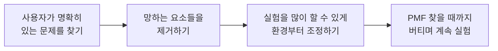

## TL;DR

- 성공은 저마다 다르지만, 실패는 비슷한 이유로 온다.
- 성공법은 아무도 모르니, 할 수 있는 건 시도 횟수를 늘리는 것이다.
- 실험이 싸지는 환경을 먼저 만들고, AI로 시도 비용을 낮춘다.

## 시작하며

옛날에 사업을 하다가 4년 만에 여러 이슈로 접었다. 다행히 빚은 없었고, 통장에 34,100원 정도 남아 있었던 거 같다.

망하고 나서 집 가까운 스타트업에 들어가게 됐고, 그 회사는 8명에서 근 2년 만에 50명이 되었다.

내 사업이 망할 때만 해도 별로 좌절감은 없고 무던했었는데, 정작 내가 소속된 회사가 대박이 나서 잘되니까 그제서야 상실감이 밀려왔다.

## 1. 왜 망했는지부터 되짚었다

이후에 내가 했던 중요한 모든 결정을 되짚어 보면서 왜 망했는지를 분석해봤고, 몇 가지 가설은 세워볼 수 있었다.

다음에 사업을 한다면 이렇게 해야겠다. 또는 이런 조건이 안 맞아지면 나는 사업을 하면 안 되겠다. 같은 것들이었다.

그러면서 뒤늦게 스타트업 공부를 해보니, YCombinator에서 "이렇게 하면 망한다"고 했던 것들을 내가 상당히 많이 하고 있었다는 것도 깨달았다.

YC의 모든 콘텐츠가 하는 이야기는 비슷하다. **이렇게 하면 망하니까 하지 마라.** 그런 이야기다.

식당 컨설팅 프로그램들을 보면서 깨달은 점도 같았다. 같은 도메인의 비즈니스는 대부분 비슷한 이유로 망한다는 것.

무슨 비즈니스를 시작하든, 일단 해당 도메인에서 망하는 요소들을 먼저 찾아서 그걸 안 하고 나서야 성공에 대한 이야기를 할 수 있다는 것이다.

## 2. 실패에는 성공이 인코딩되어 있지 않다

결국 이런 나름의 결론을 내렸다.

**성공하는 비즈니스는 저마다의 이유로 성공하지만, 망하는 비즈니스는 비슷한 이유로 망한다.**

이 가설을 뒷받침해주는 비슷한 연구도 예전부터 많이 있었다.

이런 연구들이 공통적으로 말해주는 건, 결국 실패에는 성공에 대한 데이터가 별로 인코딩되어 있지 않다는 점이다.

망한 이유를 아무리 분석해도 그건 "다음에 안 망하는 법"을 알려줄 뿐, "성공하는 법"을 알려주지는 않는다.

성공은 케이스마다 제각각이라 일반화가 안 되고, 실패는 패턴이 비슷해서 일반화가 된다.

## 3. 그래서 할 수 있는 건 시도 횟수를 늘리는 것

성공법은 아무도 모른다. 그렇다면 우리가 통제할 수 있는 변수는 하나밖에 없다. **시도 횟수.**

토스 창업자의 PO 강의 시리즈 영상에도 같은 내용이 나온다.[^2]

그런데 대부분의 창업자는 고집이 세다. 그래서 문제 자체를 바꾸는 건 받아들이기 어려운 결정이다.

하지만 **문제를 푸는 방식을 바꾸는 것**은 충분히 받아들일 만하다. 여기에 여지가 있다.

방법까지 자기가 원하는 방식만 고집하는 창업자는 생각을 다시 해볼 필요가 있다.

창업자가 풀려는 문제에 대한 전문가가 없기 때문에, 답답해서 직접 풀려고 나선 것이다. 창업자 역시 먼저 떠올렸을 뿐 그 방법의 전문가는 아니다.

처음 떠올린 첫 번째 방법이 정답일 확률은 낮다. 그러니 방법은 계속 갈아끼울 수 있어야 한다.

## 4. 그러려면 환경부터 실험하기 좋게 조정한다

Kent Beck도 3X 모델로 비슷한 이야기를 한다.[^1] 3X는 비즈니스를 가치 있는 아이디어를 싸게 찾는 Explore, 검증된 아이디어를 키우는 Expand, 효율을 짜내는 Extract 세 단계로 나눈다.

요약하면, 비즈니스는 한정된 리소스로 **더 많은 실험을 할 수 있는 환경**으로 조직 구성을 조정하고, 그 위에서 더 많은 실험을 해야 한다는 내용이다. 나는 완전히 동의하는 편이다.

시도 횟수가 중요하다면, 시도 한 번의 비용을 낮추는 것이 가장 먼저 할 일이다.

순서도 중요하다. 실험을 많이 하려고 마음먹는 것보다, 실험이 싸지도록 환경을 먼저 조정하는 게 앞선다.

예를 들어 누군가 나에게 사이드 프로젝트를 하려고 한다고 물어보면, 나는 항상 먼저 출퇴근 시간이 얼마나 되는지를 묻는다.

출퇴근 시간 같은 주변 환경을 먼저 조정해서 에너지를 남겨두지 못한 채로 사이드 프로젝트를 시작하면, 결국 얼마 못 가 지쳐서 포기하게 된다.

또는 어찌어찌 만들기는 했지만, 그 뒤에 오는 약간 지루한 출시 과정을 참아내지 못해서 출시조차 못 하게 된다.

실험 횟수를 늘리겠다는 결심보다, 실험을 버텨낼 에너지가 남도록 환경을 먼저 조정하는 게 앞서는 이유다.

## 5. 정리하면 이런 흐름

지금까지의 내용을 종합하면, 가장 이상적인 흐름은 이렇지 않을까 싶다.





1. 사용자가 명확히 있는 문제를 찾고
2. 망하는 요소들을 제거하는 한편
3. 최대한 많은 실험을 할 수 있도록 환경을 먼저 조정하고
4. PMF를 찾을 때까지 버티면서 계속 실험한다.

내가 찾은 문제에서 비즈니스적으로 성공하는 방법은 아무도 모르기 때문이다.

여기서 실험은 그냥 많이 하는 게 목적이 아니다. **실험의 목적은 고객에 대해 하나라도 더 많이 알아내는 것**이다. 고객이 무엇을 원하는지, 무엇에 돈을 내는지, 무엇은 거들떠보지도 않는지를 한 조각씩 알아내다 보면 PMF에 가까워진다.

그러니 좋은 실험은 결과의 성패와 무관하게 고객에 대한 정보를 남기는 실험이다. 실패한 실험도 "고객은 이건 원하지 않는다"는 사실을 알려주면 충분히 제 몫을 한 것이다.

이 가설–실험–검증 사이클을 사이드 프로젝트로 직접 돌려본 기록은 따로 정리해둔 게 있다.[^3][^4]

## 6. AI는 이 흐름을 더 잘 돌게 해준다

흥미로운 건, 위 흐름의 핵심이 결국 **시도 한 번의 비용을 낮추는 것**이라는 점이다. 그리고 이건 요즘 AI가 가장 잘하는 일이다.

예전에는 가설 하나를 검증하려면 화면을 그리고, 붙이고, 배포하는 데 며칠이 걸렸다. 그 비용이 비싸니 자연스럽게 시도 횟수가 줄고, 한 번의 시도에 과하게 의미를 부여하게 된다.

지금은 다르다. 에이전트에게 하네스를 한 겹씩 씌워두면, 가설 하나를 붙였다 떼는 비용이 극적으로 싸진다.[^5]

망하는 요소를 제거하는 일도 마찬가지다. 같은 도메인이 비슷한 이유로 망한다면, 그 "망하는 요소" 목록은 대체로 알려져 있다. 그걸 체크리스트로 만들어 에이전트가 매번 점검하게 만들면, 사람이 매번 다시 밟던 실수를 구조적으로 줄일 수 있다.

즉 AI는 새로운 성공법을 알려주는 도구가 아니다. **망하는 요소를 빠르게 걸러내고, 시도 한 번을 싸게 만들어 실험 횟수를 끌어올리는 도구**다.

성공법은 여전히 아무도 모른다. 하지만 모르는 채로 더 많이, 더 싸게 시도해볼 수 있게 됐다.

그래서 개인적으로는, 아직 PMF를 못 찾은 Explore 단계의 비즈니스라면 **AI first 전략과 린스타트업을 반드시 조합해야 한다**고 생각한다.

여기엔 단서가 붙는다. 이건 모든 비즈니스에 해당하는 이야기가 아니다. 3X로 치면 가치 있는 아이디어를 싸고 빠른 실험으로 찾아야 하는 Explore 단계, 즉 아직 PMF를 찾지 못한 스타트업에 한정된 이야기다. 이미 검증된 아이디어를 키우는 Expand나 효율을 짜내는 Extract 단계라면 우선순위가 완전히 달라진다.

그 Explore 단계에서, 린스타트업은 "무엇을 해야 하는가"를 알려준다. 망하는 요소를 걸러내고, 가설을 세우고, 실험으로 검증하며 PMF까지 버티라는 방향이다.

AI first는 "그걸 얼마나 싸게 할 수 있는가"를 끌어올린다. 가설 하나를 검증하는 사이클의 비용을 극적으로 낮춰 같은 시간에 더 많은 실험을 돌리게 해준다.

방향(린스타트업)만 있고 시도 비용이 비싸면 실험 횟수가 모자라고, 시도 비용(AI first)만 싸고 방향이 없으면 빠르게 엉뚱한 곳으로 달려간다. 둘은 한쪽만으로는 부족하고, 합쳐질 때 비로소 제 힘을 낸다.

## 마치며

비즈니스에서는 결국 성공한 사람의 이야기만이 의미가 있다.

그러니 아직 고민하고 있는 개발자의 의견은 재미로 읽어주면 좋을 거 같다.

고용된 개발자로서는 AI가 신기술이 나올 때마다 스트레스이고 불안했었는데, 마이크로 SaaS들을 만들기 시작하면서 생각이 바뀌었다.[^6]

AI가 더 빨리 좋아져서, 내가 찾은 문제들에 대해 더 많은 실험을 하게 해줬으면 좋겠다는 방향으로.

아이러니하게도, 사이드 프로젝트를 하는 덕분에 회사 생활에서도 AI 기술에 대한 스트레스 지수가 낮아지고 수용성이 높아져서, 남들보다 AI 활용에 대한 경험과 인사이트를 좀 더 많이 가지게 됐다.

결국 망하지 않는 걸 먼저 챙기고 실험 횟수를 늘리는 이 관점에서 보면, AI는 시도 한 번의 비용을 낮춰주는 가장 강력한 도구다.

---

[^1]: 켄트 벡(Kent Beck)의 [The Product Development Triathlon](https://medium.com/@kentbeck_7670/the-product-development-triathlon-6464e2763c46) (2016) — 3X 모델(Explore, Expand, Extract).

[^2]: [토스 PO SESSION](https://www.youtube.com/watch?v=tcrr2QiXt9M&list=PL1DJtS1Hv1Piv_MQIHgA_CdNsXyDM9UDM)

[^3]: [사이드프로젝트로 린스타트업 실천해보기 - 준비하기](/2024/01/13/lean-startup-in-action-with-side-project/)

[^4]: [사이드프로젝트로 린스타트업 실천해보기 - 이터레이션](/2024/03/24/lean-startup-in-action-with-side-project-2/)

[^5]: [EncBird에 하네스를 한 겹씩 씌워온 과정](/2026/06/16/harness-engineering-in-practice/)

[^6]: [하나의 잘 만든 GenAI 플라이휠이 비즈니스 전체를 견인한다](/2026/03/12/genai-flywheel-for-business/)
