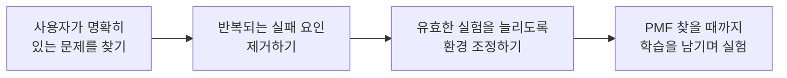

## TL;DR

- 실패 원인은 반복되지만 성공 경로는 상황마다 다르다고 가정한다.
- 고객 학습을 남기는 실험 횟수를 늘린다.
- AI로 유효한 실험의 비용을 낮춘다.

## 시작하며

옛날에 사업을 하다가 4년 만에 여러 이슈로 접었다. 다행히 빚은 없었고, 통장에 34,100원 정도 남아 있었던 거 같다.

망하고 나서 집 가까운 스타트업에 들어가게 됐고, 그 회사는 8명에서 근 2년 만에 50명이 되었다.

내 사업이 망할 때만 해도 별로 좌절감은 없고 무던했었는데, 정작 내가 소속된 회사가 대박이 나서 잘되니까 그제서야 상실감이 밀려왔다.

## 1. 왜 망했는지부터 되짚었다

이후에 내가 했던 중요한 모든 결정을 되짚어 보면서 왜 망했는지를 분석해봤고, 몇 가지 가설은 세워볼 수 있었다.

다음에 사업을 한다면 이렇게 해야겠다. 또는 이런 조건이 안 맞아지면 나는 사업을 하면 안 되겠다. 같은 것들이었다.

그러면서 뒤늦게 스타트업 공부를 해보니, YCombinator에서 실패 요인으로 다루던 것들을 내가 상당히 많이 하고 있었다는 것도 깨달았다.

YC의 콘텐츠를 읽으며 내가 반복적으로 발견한 메시지는 비슷했다. **이렇게 하면 망할 가능성이 높으니 피하라.** 그런 이야기다.

식당 컨설팅 프로그램들을 보면서도 비슷한 인상을 받았다. 같은 도메인의 비즈니스에서는 반복해서 등장하는 실패 요인이 있다는 것.

그래서 무슨 비즈니스를 시작하든, 해당 도메인에서 반복되는 실패 요인을 먼저 찾아 제거한 뒤 성공 가능성을 탐색하는 편이 낫다고 생각하게 됐다.

## 2. 실패에는 성공에 대한 정보가 별로 인코딩되어 있지 않다

사업 경험과 여러 사례를 되짚으며 다음과 같은 가설을 세웠다.

**성공하는 비즈니스의 경로는 저마다 다르지만, 망하는 비즈니스의 원인에는 반복되는 패턴이 있다.**

검증된 법칙이라기보다, 내가 다음 사업에서 활용하려고 만든 개인적인 렌즈에 가깝다.

이 렌즈에서 보면 실패를 분석해 얻는 정보와 성공에 필요한 정보는 서로 다르다.

망한 이유를 분석하면 "다음에 같은 이유로 망하지 않는 법"은 배울 수 있지만, 그것만으로 "성공하는 법"까지 알 수는 없다.

실패 요인은 체크리스트로 일반화하기 비교적 쉽지만, 성공 경로는 고객과 시장에 따라 달라서 직접 실험하며 찾아야 한다고 생각한다.

## 3. 그래서 고객 학습을 남기는 실험 횟수를 늘린다

성공하는 방법을 미리 확정하기 어렵다면, 직접 늘릴 수 있는 중요한 변수 중 하나는 **시도 횟수**다.

다만 여기서 말하는 시도는 아무 작업이나 많이 벌이는 것이 아니다. **결과의 성패와 무관하게 고객에 대한 정보를 남기는 실험**이어야 한다.

고객이 무엇을 원하는지, 무엇에 돈을 내는지, 무엇은 거들떠보지도 않는지 하나씩 알아내는 실험이라면 실패해도 다음 시도의 방향을 좁혀준다. 이 글에서 늘리려는 것은 이런 유효한 실험의 횟수다.

토스 창업자의 PO 강의 시리즈 영상에도 같은 내용이 나온다.[^2]

창업자는 자신이 선택한 문제에 강한 확신을 갖는 경우가 많다. 그래서 문제 자체를 바꾸는 건 받아들이기 어려운 결정일 수 있다.

하지만 **문제를 푸는 방식을 바꾸는 것**은 충분히 받아들일 만하다. 여기에 여지가 있다.

다만 문제를 푸는 방법까지 처음 생각한 방식으로 고정할 필요는 없다고 생각한다.

창업자가 누구보다 먼저 문제를 발견했더라도, 해결 방법까지 가장 잘 안다고 보장되지는 않는다.

처음 떠올린 방법이 바로 정답일 가능성은 높지 않다. 그러니 방법은 계속 갈아끼울 수 있어야 한다.

## 4. 그러려면 환경부터 실험하기 좋게 조정한다

Kent Beck의 3X 모델은 실험이 중요한 구간을 구분하는 틀을 제공한다.[^1] 3X는 비즈니스를 가치 있는 아이디어를 싸게 찾는 Explore, 검증된 아이디어를 키우는 Expand, 효율을 짜내는 Extract 세 단계로 나눈다.

이 관점을 Explore 단계에 적용해보면, 한정된 리소스로 **고객 학습을 남기는 실험을 더 많이 할 수 있는 환경**을 먼저 만드는 것이 중요해진다.

유효한 실험의 횟수를 늘리려면, 의지만 앞세우기보다 실험 한 번의 비용이 낮아지도록 환경을 먼저 조정해야 한다.

예를 들어 누군가 나에게 사이드 프로젝트를 하려고 한다고 물어보면, 나는 항상 먼저 출퇴근 시간이 얼마나 되는지를 묻는다.

출퇴근 시간 같은 주변 환경을 먼저 조정해서 에너지를 남겨두지 못한 채로 사이드 프로젝트를 시작하면, 결국 얼마 못 가 지쳐서 포기하게 된다.

또는 어찌어찌 만들기는 했지만, 그 뒤에 오는 약간 지루한 출시 과정을 참아내지 못해서 출시조차 못 하게 된다.

실험 횟수를 늘리겠다는 결심보다, 실험을 버텨낼 에너지가 남도록 환경을 조정하는 게 앞서는 이유다.

## 5. 정리하면 이런 흐름

지금까지의 내용을 종합하면, 가장 이상적인 흐름은 이렇지 않을까 싶다.



```mermaid
flowchart LR
    A["사용자가 명확히<br/>있는 문제를 찾기"] --> B["반복되는 실패 요인<br/>제거하기"]
    B --> C["유효한 실험을 늘리도록<br/>환경 조정하기"]
    C --> D["PMF 찾을 때까지<br/>학습을 남기며 실험"]
```


1. 사용자가 명확히 있는 문제를 찾고
2. 반복되는 실패 요인을 제거하는 한편
3. 유효한 실험을 많이 할 수 있도록 환경을 조정하고
4. PMF를 찾을 때까지 고객 학습을 남기며 실험한다.

내가 찾은 문제에서 비즈니스적으로 성공하는 방법을 미리 확정하기 어렵기 때문이다.

실패한 실험도 "고객은 이건 원하지 않는다"는 사실을 남긴다면 다음 실험의 범위를 줄여준다.

이 가설–실험–검증 사이클을 사이드 프로젝트로 직접 돌려본 기록은 따로 정리해둔 게 있다.[^3][^4]

## 6. AI는 이 흐름을 더 잘 돌게 해준다

흥미로운 건, 위 흐름의 핵심이 결국 **고객 학습을 남기는 실험 한 번의 비용을 낮추는 것**이라는 점이다. 그리고 이건 요즘 AI가 강점을 보이는 영역이다.

예전에는 가설 하나를 검증하려면 화면을 그리고, 붙이고, 배포하는 데 며칠이 걸렸다. 그 비용이 비싸니 자연스럽게 시도 횟수가 줄고, 한 번의 시도에 과하게 의미를 부여하게 된다.

지금은 에이전트에게 하네스를 한 겹씩 씌워두면, 가설 하나를 구현하고 검증한 뒤 되돌리는 비용을 낮출 수 있다.[^5]

실패 요인을 제거하는 일도 마찬가지다. 같은 도메인에서 반복되는 실패 요인을 발견했다면, 이를 체크리스트로 만들어 에이전트가 매번 점검하게 할 수 있다. 그러면 사람이 같은 실수를 반복하는 일을 구조적으로 줄일 수 있다.

즉 AI가 새로운 성공법을 바로 알려준다고 기대하기보다, **알려진 실패 요인을 걸러내고 유효한 실험의 비용을 낮추는 도구**로 활용하는 편이 현실적이라고 생각한다.

성공 경로를 미리 알 수는 없어도, 더 많은 가설을 더 낮은 비용으로 검증할 수 있게 됐다.

그래서 아직 PMF를 못 찾은 Explore 단계의 비즈니스라면 **AI first 전략과 린스타트업을 함께 검토할 가치가 크다**고 생각한다.

여기엔 단서가 붙는다. 이건 모든 비즈니스에 해당하는 이야기가 아니다. 3X로 치면 가치 있는 아이디어를 싸고 빠른 실험으로 찾아야 하는 Explore 단계, 즉 아직 PMF를 찾지 못한 스타트업에 한정된 이야기다. 이미 검증된 아이디어를 키우는 Expand나 효율을 짜내는 Extract 단계라면 우선순위가 완전히 달라진다.

그 Explore 단계에서, 린스타트업은 "무엇을 해야 하는가"를 알려준다. 실패 요인을 걸러내고, 가설을 세우고, 실험으로 검증하며 PMF까지 버티라는 방향이다.

AI first는 "그걸 얼마나 싸게 할 수 있는가"를 끌어올린다. 가설 하나를 검증하는 사이클의 비용을 낮춰 같은 시간에 더 많은 실험을 돌리게 해준다.

방향(린스타트업)만 있고 시도 비용이 비싸면 실험 횟수가 모자라고, 시도 비용(AI first)만 싸고 방향이 없으면 빠르게 엉뚱한 곳으로 달려갈 수 있다. 둘을 함께 쓰면 이런 약점을 서로 보완할 수 있다.

## 마치며

이 글은 성공 공식을 제시하려는 게 아니라, 아직 직접 검증하고 있는 가설을 정리한 것이다.

그러니 정답보다는 다음 실험을 설계하기 위한 하나의 렌즈로 읽어주면 좋을 것 같다.

고용된 개발자로서는 AI가 신기술이 나올 때마다 스트레스이고 불안했었는데, 마이크로 SaaS들을 만들기 시작하면서 생각이 바뀌었다.[^6]

AI가 더 빨리 좋아져서, 내가 찾은 문제들에 대해 더 많은 실험을 하게 해줬으면 좋겠다는 방향으로.

아이러니하게도, 사이드 프로젝트를 하는 덕분에 회사 생활에서도 AI 기술에 대한 스트레스 지수가 낮아지고 수용성이 높아져서, 남들보다 AI 활용에 대한 경험과 인사이트를 좀 더 많이 가지게 됐다.

결국 반복되는 실패 요인을 먼저 줄이고 유효한 실험 횟수를 늘리는 관점에서 보면, AI는 실험 한 번의 비용을 낮추는 유용한 도구다.

---

[^1]: 켄트 벡(Kent Beck)의 [The Product Development Triathlon](https://medium.com/@kentbeck_7670/the-product-development-triathlon-6464e2763c46) (2016) — 3X 모델(Explore, Expand, Extract).

[^2]: [토스 PO SESSION](https://www.youtube.com/watch?v=tcrr2QiXt9M&list=PL1DJtS1Hv1Piv_MQIHgA_CdNsXyDM9UDM)

[^3]: [사이드프로젝트로 린스타트업 실천해보기 - 준비하기](/2024/01/13/lean-startup-in-action-with-side-project.html)

[^4]: [사이드프로젝트로 린스타트업 실천해보기 - 이터레이션](/2024/03/24/lean-startup-in-action-with-side-project-2.html)

[^5]: [EncBird에 하네스를 한 겹씩 씌워온 과정](/2026/06/16/harness-engineering-in-practice.html)

[^6]: [하나의 잘 만든 GenAI 플라이휠이 비즈니스 전체를 견인한다](/2026/03/12/genai-flywheel-for-business.html)
