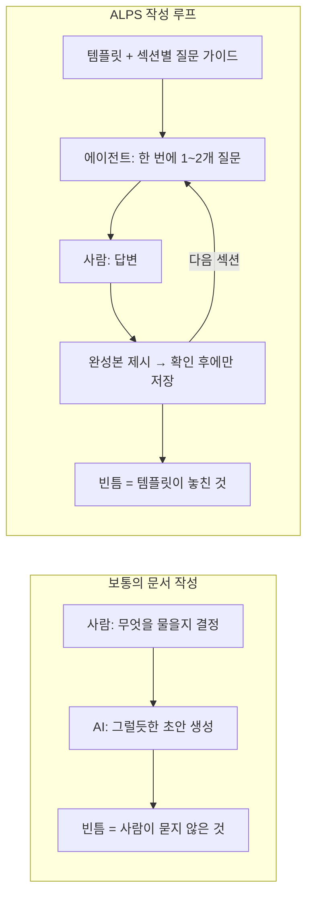
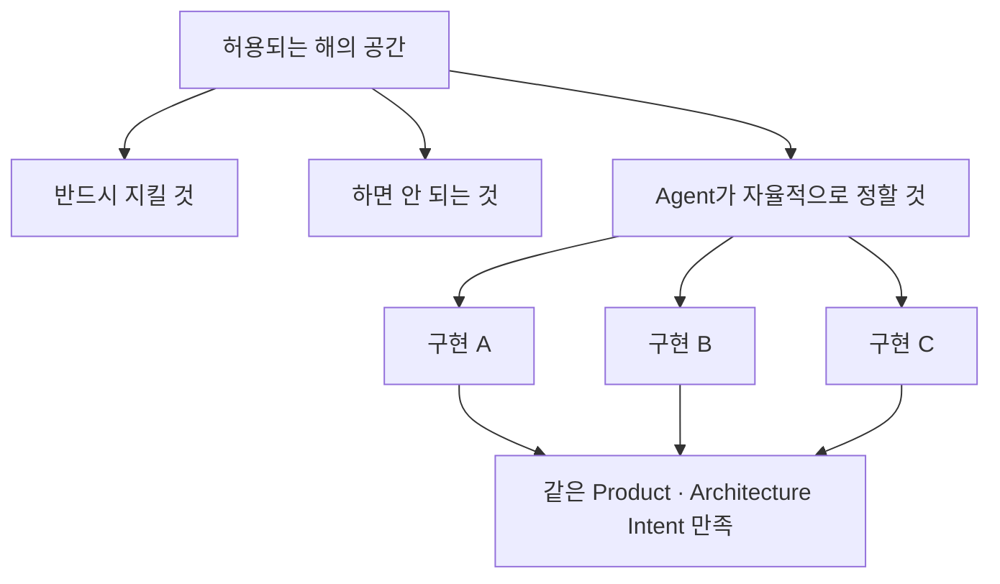
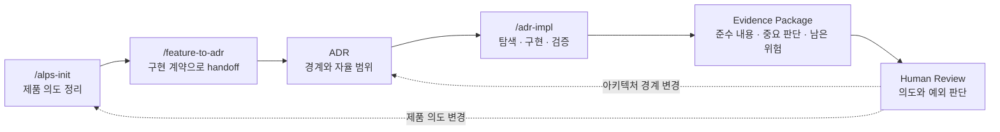

## TL;DR

- PRD는 제품 의도를, ADR은 구현이 지킬 경계를 정의한다.
- 다른 구현이 나와도 같은 의도를 만족하면 된다.
- 사람은 의도와 예외를 판단하고 Agent는 구현과 증명을 맡는다.

## 시작하며

최근 모델이 좋아지면서 에이전틱 개발에 필요했던 human in the loop의 많은 부분이 모델과 도구 안으로 흡수되고 있다.[^2] 개인적으로 이 방향을 가장 빠르게 밀어붙이는 곳은 Anthropic이라고 생각한다.

이 글은 계속 써온 렌즈 위에 있다. **소프트웨어 개발은 비즈니스 요구사항을 코드로 바꾸는 컴파일 과정이고, 에이전틱 엔지니어링은 그 과정에서 사람을 덜어내는 방향이다.**[^7]

이 렌즈를 쓰면 문서의 역할이 자동으로 정해진다. 컴파일러에게 필요한 건 입력, 즉 요구사항이다. 출력인 코드를 문서에 옮겨 적는 일은 컴파일러를 두 번 돌리는 것과 같다.

그래서 이 글의 결론은 한 문장으로 압축할 수 있다. **Human은 의도와 경계를 관리하고, Agent는 구현과 증명을 관리한다.**

문제는 요구사항과 코드의 추상화 수준이 너무 다르다는 데 있다. 요구사항에서 코드로 의존성은 흐르되 둘이 서로 직접 참조하면 안 되고, 그 사이의 매핑은 코딩 에이전트가 매번 동적으로 수행해야 코드베이스가 깨끗하게 남는다.

그래서 요구사항 문서를 두 종류로 나눈다. **PRD는 제품 전체의 가설과 요구사항을 담고, ADR은 구현이 지켜야 할 기능 계약과 아키텍처 경계를 담는다.**

이 원칙을 실제 프로젝트에 적용하려고 만든 도구가 [ALPS Writer](https://github.com/haandol/alps-writer-plugins)[^3]와 `adr-writer`다.

### 이 도구의 목표

먼저 목표를 분명히 해두는 게 좋겠다. 이 두 플러그인이 하는 일은 두 가지다.

**하나, 모델에게 생각하는 관점을 준다.** 문서를 예쁘게 뽑아주는 생성기가 아니다. "지금 너는 제품 전체의 가설을 다루는 중이다", "지금은 기능 계약과 독립 결정의 판정 기준을 쓰는 중이다"라는 시점을 템플릿과 질문 프로토콜로 강제한다. 모델이 어느 레이어에 서 있는지 알면, 무엇을 쓰지 않을지도 알게 된다.

**둘, C4 모델처럼 각 문서가 담는 정보의 수준을 추상화 레벨별로 제약한다.**[^4] PRD(ALPS)·ADR·코드가 서로 다른 질문에 답하도록 경계를 정해두는 것이다.

이 제약이 만드는 결과가 목표다. **제품 의도는 PRD에서, 구현이 지킬 경계는 ADR에서, 현재 동작은 코드에서 찾는다.** 한 질문에 답하려고 세 레이어를 다 펼쳐야 한다면 층 나누기가 실패한 것이다.

이 관점이 왜 필요하고 그것이 포맷과 워크플로우에 어떻게 내려왔는지, PRD와 ADR을 서로 다른 레이어로 갈라두는 이유부터 실제 사용법까지 차례로 살펴본다.[^1]

## 1. 컨텍스트에도 레이어가 있다

먼저 그림 하나로 시작하자. 요구사항 문서라고 뭉쳐 불렀지만, 그 안에도 레이어가 나뉜다.





레이어를 어디서 자를지는 **변하는 속도**가 정한다. 제품 전체의 요구사항은 몇 달에 한 번 바뀌고, 기능 하나의 요구사항은 몇 주에 한 번 바뀌고, 코드는 매일 바뀐다.

달력의 숫자보다 중요한 건 **무엇이 바뀔 때 함께 고쳐야 하는가**다.

| 레이어 | 담는 질문 | 넣지 않는 것 |
| --- | --- | --- |
| PRD | 무엇을 왜 만들고, 성공은 무엇인가 | 파일 경로, 함수, 구현 순서 |
| ADR | 결과가 무엇을 지켜야 하고, 어디까지 자유로운가 | 교체 가능한 구조와 튜닝값 |
| 코드 | 지금 시스템은 어떻게 동작하는가 | 상위 문서의 설명을 복제한 주석 |

**"담는 질문"과 "넣지 않는 것"이 각 레이어가 담을 정보의 수준을 제약한다.** C4 모델에서 Container 다이어그램에 클래스 이름을 그리지 않는 것과 같은 종류의 규칙이다.

그리고 이 제약이 지켜지면 각 질문에 답할 문서가 하나로 정해진다. 세 레이어를 다 펼쳐놓고 어디에 답이 있는지 찾는 대신, 질문의 추상화 수준을 보고 그 레이어만 열면 된다.

구현을 시작하면 기능 계약의 권위는 PRD에서 ADR로 넘어간다. PRD는 제품을 왜 시작했는지 보여주는 계획 문서로 남고, ADR이 현재 구현과 리뷰의 기준이 된다.

이 구조는 헥사고날 아키텍처가 도메인을 구현 기술로부터 지키는 방식과 닮아 있다.[^8] **ADR은 코드가 지켜야 할 계약이고, 코딩 에이전트는 그 계약을 현재 코드에 맞게 구현한다.**

그래서 PRD와 ADR에는 파일 경로나 함수 이름을 넣지 않고, 코드에도 ADR 번호를 박아두지 않는다. 에이전트가 작업할 때 ADR과 코드를 함께 읽어 관계를 복원하면 리팩터링이 문서를 끌고 다니지 않는다.

### 내가 실제로 침범한 사례

내 영어 학습 서비스 EncBird에 Office Raid라는 퀴즈 모드를 붙일 때 621줄짜리 PRD를 쓴 적이 있다. 게임 규칙뿐 아니라 변수 선언, 파일 경로, 12단계 구현 순서까지 함께 적었다.

쓸 때는 친절한 문서라고 생각했다. 하지만 상수를 추출하고 모듈을 나누고 구현 순서가 바뀌자 며칠 만에 문서가 코드와 어긋났다.

반면 ADR에는 **많이 공부한 사용자가 오히려 플레이할 수 없게 만드는 방식은 쓰지 않는다**는 요구사항과, 검토한 대안을 기각한 이유만 남겼다. 조회 쿼리나 파일 구조가 바뀌어도 이 문장은 계속 유효했다.

**둘의 차이는 문서를 얼마나 성실하게 관리했느냐가 아니라 무엇을 문서에 넣었느냐였다.**

ALPS Writer는 여기서 출발했다. PRD를 길게 써주는 생성기가 아니라, 각 문서가 담을 정보의 수준을 제한해 요구사항을 코드 변화로부터 지키는 도구가 필요했다.

## 2. PRD는 가설을 검증하는 문서다

먼저 이 문서가 무엇을 담는지부터 정하자. **PRD는 프로젝트 전체에 대한 비즈니스 요구사항과 기능·비기능 요구사항의 상세다.** 개별 기능이 아니라 제품 하나를 통째로 놓고 본다.

그래서 PRD가 가장 유용한 지점은 **Explore 단계**다. 켄트 벡의 3X에서 수익 곡선이 아직 평평한 구간, 가치 있는 아이디어를 싸고 빠른 실험으로 찾는 시기다.[^6]

이 단계에서 제품은 전부 가설이다. 누가 쓸지, 무엇이 성공인지, 무엇을 만들지 않을지가 모두 검증 대상이다. 이 가설들을 한 문서에 모아 서로 앞뒤가 맞는지 확인하는 것이 PRD의 일이다.

**중요한 건 이게 구현 지시서가 아니라는 점이다.** 가설을 세우고 검증하는 도구이므로, 파일 경로나 변수 선언이 들어갈 자리가 없다. 그런 게 들어가면 가설 문서가 아니라 코드 설명서가 된다.

Office Raid PRD가 정확히 그렇게 변했다.

### 재현의 대상은 코드가 아니다

이 지점에서 ALPS 프로세스 전체의 목표를 분명히 해둘 필요가 있다. 같은 문서로 프로세스를 여러 번 돌렸을 때 **알고리즘까지 똑같은 코드가 나오는 것이 목표가 아니다.**

오히려 알고리즘이나 자료구조 같은 구현 디테일은 매번 달라도 된다. 목표는 나온 코드가 **내가 준 비즈니스 요구사항과 기능·비기능 요구사항을 준수하는 것**이다.

이 차이가 문서에 무엇을 적을지를 결정한다.

| 재현하려는 것 | 문서에 적어야 하는 것 | 결과 |
| --- | --- | --- |
| 같은 코드 | 알고리즘, 상수, 파일 배치까지 | 코드를 두 벌 쓴다. 한 벌은 반드시 낡는다 |
| 같은 요구사항 준수 | 지켜야 할 것과 그 판정 기준 | 구현은 자유롭고 문서는 오래 유효하다 |

정렬을 예로 들면, "응답은 최신순이어야 한다"는 요구사항이고 "quicksort를 쓴다"는 구현이다. 후자를 적어두면 나중에 정렬 방식을 바꿀 때 문서가 틀리지만, 전자는 그대로 유효하다.

모델이 좋아질수록 이 방향이 유리해진다. 구현을 지정해줄 필요가 줄어들고, **무엇을 지켜야 하는지만 정확히 주는 쪽이 더 나은 결과를 낸다.**

그럼 PRD를 어떻게 자기 레이어에 머물게 하면서 에이전트가 읽기 좋은 source of truth로 만들 수 있을까. ALPS Writer는 여기에 두 가지로 답한다. 포맷을 고정하는 것, 그리고 작성 책임을 뒤집는 것이다.

PRD가 어긋나기 시작하는 지점은 보통 두 군데다.

**첫째, 포맷이 매번 새로 발명된다.** 팀마다, 문서마다 PRD 모양이 다르다. 섹션 이름도 다르고 상세 수준도 다르다.

에이전트는 이 문서가 무엇을 주장하는 문서인지부터 추측해야 한다. 사람도 내용을 쓰기 전에 형식을 다시 결정하느라 시간을 쓴다.

**둘째, 품질이 작성자 역량에 묶인다.** 경험 많은 PO가 쓴 PRD는 에이전트의 자유도를 적당히 조여주고, 그렇지 않은 PRD는 과잉 해석할 여지를 남긴다.

같은 제품인데 누가 문서를 썼느냐에 따라 생성된 코드가 달라진다.

ALPS(Agentic Lean Product Spec)는 이 둘을 각각 다르게 공격한다. 포맷은 **고정**해서 매번 결정하지 않게 하고, 작성 루프는 **뒤집어서** 완결성을 사람이 아니라 에이전트가 책임지게 한다. 앞에서 말한 관점이 각각 템플릿과 대화 프로토콜이라는 도구의 기능으로 내려온 셈이다.

### 고정된 질문의 범위

ALPS는 MVP 하나를 9개 섹션으로 나누지만, 섹션 이름을 외울 필요는 없다. 결국 아래 네 질문에 답하기 위한 구조다.

| 질문 | ALPS가 정리하는 것 |
| --- | --- |
| 누구의 어떤 문제인가 | 제품 맥락과 타깃 사용자 |
| 어떤 경험을 제공할 것인가 | Demo Scenario와 기능 요구사항 |
| 무엇을 지켜야 하는가 | 시스템 경계와 비기능 요구사항 |
| 어디까지 만들 것인가 | 성공 지표와 Out of Scope |

목적은 문서를 길게 만드는 게 아니다. **제품 의도, 사용자가 관찰할 행동, 시스템 경계, 성공 기준을 서로 모순 없이 연결하는 것**이다.

### 질문하는 쪽을 뒤집는다

포맷보다 더 중요한 게 작성 방식이라고 생각한다.

보통 우리가 AI로 문서를 쓸 때는 **사람이 묻고 AI가 답한다.** 이 구조에서는 사람이 무엇을 물어야 하는지 아는 만큼만 문서가 채워진다. 문서 품질의 상한이 작성자의 질문 실력이 된다.

ALPS Writer는 이걸 반대로 돌린다.





- **에이전트가 묻고 사람이 답한다.** 9개 섹션을 순서대로 돌면서 한 턴에 1~2개씩 좁은 질문을 던진다.
- **에이전트가 섹션을 임의로 생성하지 않는다.** 완성본을 보여주고 사람이 확인해야 저장된다.
- **섹션별 대화 가이드가 도구 안에 들어 있다.** 프로젝트가 바뀌어도 질문 흐름이 같다.

이러면 문서 품질의 상한이 **작성자의 PRD 실력**에서 **템플릿과 질문 프로토콜**로 옮겨간다. 도구를 개선하면 다음 프로젝트의 문서가 같이 좋아진다는 뜻이라, 나는 이게 이 도구의 핵심 설계라고 생각한다.

앞에서 말한 "모델에게 관점을 준다"가 구체적으로 이 부분이다. 섹션별 질문 가이드는 모델에게 **지금 어느 추상화 수준에서 묻고 있는지**를 알려주는 장치다. Section 2를 쓰는 중이면 성공의 정의를 묻고, 파일 배치는 묻지 않는다. 질문의 층이 정해지면 답의 층도 정해진다.

부수 효과로 문서 작성이 인터뷰가 된다. 백지 앞에서 "아키텍처 뭐 쓰지"를 고민하는 것보다, "지도 타일은 어디서 받아오실 건가요"에 답하는 게 훨씬 쉽다.

ALPS가 완성되면 제품 전체를 계속 들고 구현하지 않는다. 다음 단계에서 Feature별 계약을 ADR로 넘기고, 구현은 더 작은 컨텍스트에서 진행한다.

## 3. ADR은 허용되는 해의 공간을 정한다

기존 ADR은 과거에 왜 기술을 선택했는지 기록하는 문서로 많이 쓰였다. 내가 원하는 ADR은 거기서 한 걸음 더 나아간 **Architecture Intent Contract**에 가깝다.

ADR은 특정 코드를 지시하지 않는다. 대신 결과가 반드시 지켜야 할 계약, 넘으면 안 되는 경계, Agent가 자유롭게 판단해도 되는 범위를 정한다.





EncBird의 사전 기능을 예로 들면 이렇게 갈린다.

| ADR에 남기는 의도 | Agent에게 맡기는 구현 |
| --- | --- |
| 유효하지 않은 입력의 판정은 결정론적이어야 한다 | 판정 함수의 이름과 위치 |
| 동일 입력 재시도에 LLM을 다시 호출하지 않는다 | 캐시 자료구조와 내부 키 형식 |
| 많이 공부한 사용자가 플레이 불가에 빠지지 않는다 | 표현을 조회하는 쿼리 |

왼쪽은 구현을 다시 생성해도 지켜야 한다. 오른쪽은 같은 의도를 만족하는 범위에서 매번 달라도 된다.

판별 기준은 두 문장으로 충분하다.

> 이 내용이 빠지면 다시 만든 코드가 요구사항이나 아키텍처 의도를 위반할 수 있는가?

> 다른 구현으로 바뀌어도 의도가 그대로라면 Agent에게 맡겨도 되는가?

이 관점에서 ADR의 목표는 **implementation reproducibility가 아니라 intent reproducibility**다. JWT와 Redis로 만들든 다른 token과 저장소로 만들든, 같은 사용자 행동과 아키텍처 경계를 만족하면 성공이다.

Agent가 구현 중에 내리는 모든 판단을 ADR로 올리지는 않는다. 자료구조, 함수 분리, 내부 라이브러리처럼 되돌리기 쉬운 선택은 코드에 남긴다.

반대로 public contract, persistent data semantics, security boundary처럼 다음 재생성에서도 유지되어야 할 판단은 사람에게 알리고 ADR의 변경 후보로 다룬다.

## 4. 실제로는 이 흐름으로 사용한다

사용법은 명령보다 흐름으로 이해하는 편이 쉽다.





**먼저 `/alps-init`으로 제품 의도를 정리한다.** Agent가 질문하고 사람은 사용자, 문제, 성공 기준, 하지 않을 일을 결정한다. 이 단계의 목표는 구현 계획이 아니라 제품 가설을 명확하게 만드는 것이다.

**다음으로 `/feature-to-adr`를 실행해 기능 계약을 ADR로 넘긴다.** 이건 내용을 복사하는 작업이 아니라 구현 권위를 옮기는 handoff다. 하나의 기능이 여러 독립적인 경계를 가진다면 ADR도 하나 이상이 될 수 있다.

Handoff 뒤 PRD는 당시의 제품 가설을 보여주는 planning document로 남고, 현재 구현의 기준은 ADR이 된다. PRD가 바뀌었다고 코드까지 자동으로 따라가지 않으며, 제품 의도를 다시 반영하려는 경우에만 명시적으로 re-import한다.

**이제 `/adr-impl`을 실행하면 Agent가 저장소를 탐색하고, 구현하고, 테스트하고, ADR 준수 여부를 검토한다.** 사람은 중간의 파일 목록이나 세부 태스크를 일일이 관리하지 않는다.

마지막에는 요구사항과 경계를 어떻게 만족했는지, Agent가 어떤 중요한 판단을 했는지, 아직 어떤 위험이 남았는지를 Evidence Package로 확인한다. 이 화면은 새로운 source of truth가 아니라 **사람이 전체 diff보다 의도와 예외를 먼저 볼 수 있게 하는 일시적 리뷰 화면**이다.

리뷰 순서도 자연스럽게 바뀐다.

> 의도를 만족했는가 → 근거가 충분한가 → Agent가 중요한 결정을 했는가 → 필요하면 raw diff를 본다.

## 5. 영속화할 것은 다시 판단할 기준이다

RFTCR에서 나는 Requirement → Feature → Task → Code → Reflect의 다섯 단계를 제안했다.[^4] 지금은 그중 Task가 별도 문서로 남을 필요는 거의 없다고 생각한다.

Agent는 ADR을 읽고 매번 현재 코드에 맞는 구현 계획을 다시 만들 수 있다. 반대로 세부 태스크를 저장하면 코드가 바뀔 때마다 함께 관리해야 할 문서만 늘어난다.

그래서 영속 artifact의 기준은 **나중에 같은 판단을 다시 내리는 데 필요한가**다.

| Artifact | 역할 | 수명 |
| --- | --- | --- |
| ALPS PRD | Product Intent | 제품 가설을 다시 검토할 때까지 |
| ADR | Architecture Intent와 기능 계약 | 해당 의도나 경계가 바뀔 때까지 |
| Code와 Test | 현재 구현과 실행 가능한 증거 | 다음 구현 변경까지 |
| Evidence Package | 이번 구현을 위한 리뷰 화면 | 리뷰가 끝날 때까지 |

Agent가 구현 중에 내린 모든 결정을 별도 문서로 저장할 필요도 없다. 지역적이고 되돌리기 쉬운 판단은 코드에 남고, 이번 구현에서 중요한 판단은 Evidence Package에 드러난다.

그중 다음 재생성에서도 반드시 유지되어야 할 판단만 사람의 결정을 거쳐 ADR로 승격한다. **문서는 계속 학습하지만, 모든 실행 흔적을 끌어안지는 않는다.**

## 6. 언제 ALPS부터 시작하고, 언제 ADR부터 시작할까

ALPS가 모든 변경의 입구일 필요는 없다.

| 상황 | 시작점 |
| --- | --- |
| 새 제품이고 사용자·문제·성공 기준이 아직 불명확하다 | `/alps-init` |
| 운영 중인 제품에 새로운 기능 계약이나 지속적인 경계가 필요하다 | `/adr-new` |
| 기존 ADR 안에서 구현만 바뀌는 국소 변경이다 | 코드와 테스트 |
| Handoff된 제품 의도 자체를 다시 바꾸려 한다 | ADR 변경 또는 명시적 re-import |

성경길은 새 제품의 방향부터 정해야 했기 때문에 ALPS로 시작했다.[^5] 반면 Office Raid는 이미 오래 운영한 제품의 한 기능이었으므로, 제품 전체 PRD보다 기능 계약을 담는 ADR에서 시작하는 편이 맞았다.

판별 기준은 단순하다. **무엇을 만들지 아직 모르면 ALPS에서 제품 의도를 정하고, 무엇을 지켜야 하는지 결정해야 한다면 ADR에서 경계를 정한다.**

## 마치며

내가 원하는 ADR은 과거의 선택을 보관하는 문서에 머물지 않는다. **코드를 다시 생성하고 다시 리뷰할 때 사용할 수 있는 Architecture Intent Contract**에 가깝다.

이 계약이 충분히 좋다면 구현은 매번 달라도 된다. 중요한 것은 같은 Product Intent와 Architecture Intent를 만족하는가다.

그래서 사람의 역할은 코드를 모두 읽는 것이 아니라, 지켜야 할 의도와 경계를 정하고 Agent가 자율 범위에서 내린 중요한 판단과 경계 밖의 예외를 확인하는 쪽으로 이동한다. Agent는 현재 저장소에 맞게 구현하고, 테스트하고, 그 의도를 만족했다는 증거를 만든다.

결국 이 흐름의 철학은 처음의 한 문장으로 돌아온다.

> **Human은 의도와 경계를 관리하고, Agent는 구현과 증명을 관리한다.**

ADR은 코드 생성의 context이면서 동시에 코드 리뷰의 rubric이 된다. 나는 이것이 HITL을 줄이면서도 사람이 시스템의 의도를 잃지 않는 방향이라고 생각한다.

---

[^1]: [EncBird에 하네스를 한 겹씩 씌워온 과정](/2026/06/16/harness-engineering-in-practice.html) — PRD·ADR을 다른 모든 자동화의 기준점으로 놓는 이유와 PRD → ADR → 코드 단방향 의존성을 다룬다.

[^2]: [에이전틱 엔지니어링과 과도기적 기술들](/2026/05/11/direction-of-agentic-engineering.html) — human in the loop이 모델과 도구로 흡수되는 방향에 대한 이전 글.

[^3]: [ALPS Writer Plugins](https://github.com/haandol/alps-writer-plugins) — 마켓플레이스, 사용 가이드, 의존성 모델 문서. ADR 형식 자체의 원전은 [Documenting Architecture Decisions](https://cognitect.com/blog/2011/11/15/documenting-architecture-decisions).

[^4]: [RFTCR - 에이전트 주도 소프트웨어 개발을 위한 새로운 SDLC 프레임워크](/2025/05/11/rftcr-framework-for-agentic-dev.html) — 단계별 입출력의 추상화 수준을 C4 모델처럼 고정해야 한다는 논지. 이 글의 5절은 그중 Task 단계에 대한 정정이다.

[^5]: [성경길 Bible Atlas](https://bible-atlas.encbird.com) — ALPS 문서를 먼저 쓰고 시작한 사이드 프로젝트. 지금은 ADR만 남아 있다.

[^6]: 켄트 벡의 [The Product Development Triathlon](https://medium.com/@kentbeck_7670/the-product-development-triathlon-6464e2763c46) (2016) — Explore·Expand·Extract 세 단계로 나누는 3X 모델. 이 모델을 조직 관점으로 확장한 내용은 [조직의 AI 도입을 보는 렌즈](/2026/06/15/organizational-ai-adoption-3s.html) 참고.

[^7]: [현상을 해석하는 렌즈, 그리고 에이전틱 엔지니어링](/2026/06/12/lens-for-agentic-engineering.html) — 소프트웨어 개발을 비즈니스 요구사항의 컴파일 과정으로 보는 렌즈. 이 글의 문서 구분은 그 렌즈에서 따라 나온 결과다. 컴파일러 비유의 출발점은 [에이전틱 엔지니어링과 과도기적 기술들](/2026/05/11/direction-of-agentic-engineering.html).

[^8]: [쉽게 설명한 클린 / 헥사고날 아키텍쳐](/2022/02/13/demystifying-hexgagonal-architecture.html) — 포트와 어댑터, 의존성 역전이 실제로 어디서 일어나는지 정리한 이전 글. 원전은 앨리스터 코번의 [Hexagonal architecture](https://alistair.cockburn.us/hexagonal-architecture/).
